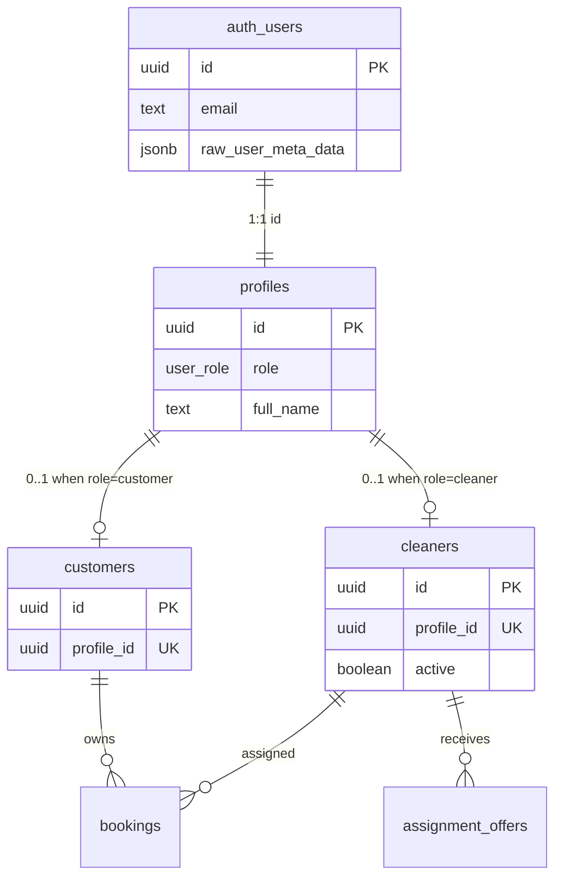
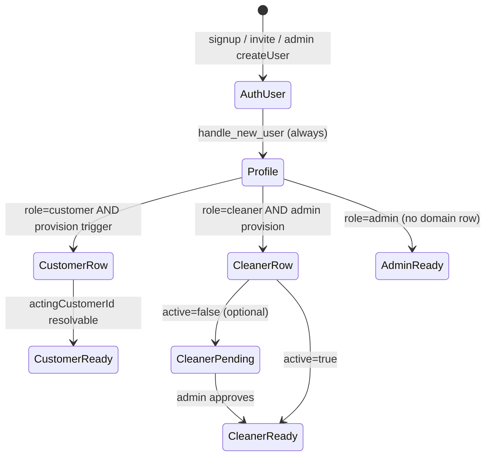
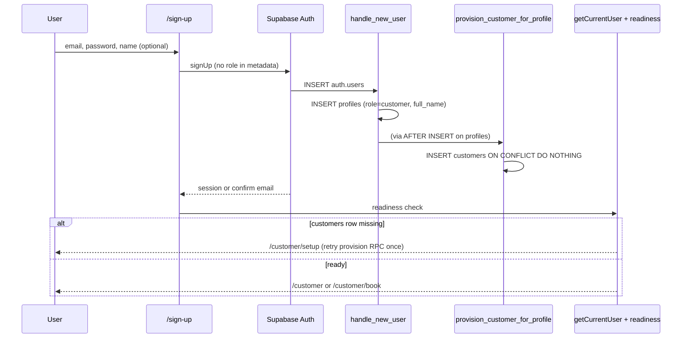

# Stage 1B — Identity Provisioning Architecture & Security Hardening

**Project:** Shalean Cleaning Services  
**Date:** 2026-05-16  
**Status:** **FINALIZED** — architecture & implementation planning complete; Stage 1C may implement per boundaries below  
**Phase:** 1B (documentation only — no production behavior changed)  
**Inputs:** Stage 1A identity audit findings (summarized in §1; see `docs/audits/` for related audits)

---

## 1. Executive summary

Stage 1A established that **authentication and role enforcement work**, but **domain provisioning does not**. A user can sign in with a `profiles` row and reach role dashboards, yet fail at booking, payments, and cleaner workflows because `customers` / `cleaners` rows are never created automatically.

This document defines the **canonical identity provisioning architecture** for Stage 1B implementation. It is intentionally incremental: it preserves `profiles.role` as authority, `resolveActorScope`, middleware/layout routing, RLS direction, and the booking command layer.

### Design decisions (final recommendation)

| Decision | Choice |
|----------|--------|
| Role authority | `profiles.role` only — **never** JWT / `user_metadata` for authorization |
| Customer onboarding | **Self-serve signup** with **database-side auto-provisioning** (security definer trigger chain) |
| Cleaner onboarding | **Invite-only / admin-provisioned** — no public cleaner signup |
| Admin role assignment | **Service role or admin-only RPC only** — never client-controlled |
| Provisioning mechanism | **Hybrid:** hardened `handle_new_user` + `provision_domain_row` trigger on `profiles` + optional idempotent RPC for repair |
| Incomplete provisioning UX | **Fail-fast** readiness gate before `/customer/book` and cleaner job APIs |
| Orphan handling | **Prevent in DB** + **detect in app** + **repair via service-role scripts** |

### What this phase does *not* do

- Redesign auth, middleware, RLS, bookings, payments, assignments, or earnings  
- Move authority into JWT claims or microservices  
- Rewrite existing command or dashboard architectures  

### Readiness verdict after implementation (target state)

| Persona | Sign up | Domain row | Book / pay | Cleaner work |
|---------|---------|------------|------------|--------------|
| Customer | Self-serve | Auto | Yes | N/A |
| Cleaner | Invite only | Admin creates | N/A | After approval |
| Admin | Manual / internal | N/A | N/A | Full ops |
| E2E / seed | Unchanged path | Preserved | Yes | Yes |

---

## 2. Canonical identity model

### 2.1 Entity responsibilities



| Entity | Source of truth for | Owned by | Created when |
|--------|---------------------|----------|--------------|
| `auth.users` | Credentials, session (`auth.uid()`) | Supabase Auth | Sign-up, admin `createUser`, invite accept |
| `profiles` | **Role** (`customer` \| `cleaner` \| `admin`) | App domain (FK to auth) | `on_auth_user_created` trigger (always) |
| `customers` | **Customer business identity** (`customers.id` on bookings) | App domain | Auto when `profiles.role = customer` (new) |
| `cleaners` | **Cleaner workforce identity** (offers, jobs, earnings) | App domain | Admin/invite flow only (new) |

### 2.2 Authority boundaries

| Question | Answer |
|----------|--------|
| Where does role authority live? | **`public.profiles.role`** — read by middleware, layouts, `getCurrentUser`, APIs, and mapped to command `actorType` |
| Should JWT metadata ever be trusted? | **No** for authorization. Metadata may carry **display** hints (`full_name`) only. Role must not be taken from `raw_user_meta_data` or `user_metadata` in triggers after hardening. |
| Are `customers` / `cleaners` always 1:1 with `profiles`? | **Yes, at most one each** per profile (unique `profile_id`). A profile must **not** have both rows. `admin` profiles have **neither**. |
| Does cleaner onboarding differ from customer? | **Yes.** Customers: self-serve + automatic row. Cleaners: invite/admin-only + optional approval gate before `active = true`. |

### 2.3 Lifecycle relationships



### 2.4 Allowed transitions

| From | To | Who may perform | Mechanism |
|------|-----|-----------------|-----------|
| (none) | `profiles.role = customer` | Sign-up (default), admin | Hardened `handle_new_user` (fixed default) |
| (none) | `profiles.role = cleaner` | Admin / invite completion | Service-role `createUser` + admin RPC or seed |
| (none) | `profiles.role = admin` | Internal ops only | Service-role `profiles` upsert — never public signup |
| `customer` | `cleaner` | **Discouraged** | Not in v1 — requires admin migration script (deactivate customer row, create cleaner row, audit) |
| Any role change | | Admin only | `profiles` update via admin session or service role; RLS already blocks self-escalation |

**Invariant (must enforce in DB + app):**

- `role = customer` ⇒ exactly one `customers` row for `profile_id` (after provisioning completes)  
- `role = cleaner` ⇒ exactly one `cleaners` row for `profile_id`  
- `role = admin` ⇒ zero domain rows  
- Never: both `customers` and `cleaners` for same `profile_id`  

### 2.5 Provisioning responsibility matrix

| Step | Customer | Cleaner | Admin |
|------|----------|---------|-------|
| Auth user | Supabase Auth (self-serve) | Admin `createUser` / invite | Internal |
| Profile | Trigger `handle_new_user` | Trigger + admin sets role via service role | Service role upsert |
| Domain row | **Auto trigger** on profile | **Admin RPC / seed** | None |
| Eligibility data (areas, caps) | N/A | Admin / ops after row | N/A |
| Session enforcement | Existing middleware | Existing middleware | Existing middleware |
| Command scope | `resolveActorScope` → `actingCustomerId` | `resolveActorScope` → `actingCleanerId` | N/A |

---

## 3. Customer provisioning architecture

### 3.1 Goals

- Self-serve customer signup with **zero admin steps**  
- **Idempotent** provisioning (safe on retry, duplicate sign-up, trigger re-run)  
- **No orphan profiles** (`role = customer` without `customers` row)  
- Preserve RLS: customers still cannot insert their own row via client; provisioning runs as **security definer**  
- Preserve booking command path: `actingCustomerId` always populated for real customers  

### 3.2 Signup lifecycle (target)



### 3.3 Option evaluation

| Approach | Pros | Cons | Verdict |
|----------|------|------|---------|
| **A. DB trigger on `profiles`** | Atomic with profile; works for all user creation paths; idempotent; no service role in browser signup | Harder to test locally; logic in SQL | **Recommended (primary)** |
| **B. Server action after signUp** | Easy in TypeScript | Race: user hits dashboard before action runs; bypass if user uses magic link only; not atomic with auth insert | Secondary **safety net only** |
| **C. Security definer RPC called from app** | Explicit, testable | Client could skip call; must not be only line of defense | **Repair + backfill only** |
| **D. Extend `handle_new_user` only** | Single trigger on auth.users | Mixes auth + domain concerns; harder to extend for cleaner admin path | Use for **profile + role hardening only** |

### 3.4 Recommended architecture: **hybrid (A + C repair)**

**Primary:** `AFTER INSERT ON public.profiles` (and optionally `AFTER UPDATE OF role` where new role = `customer`) → `provision_customer_for_profile()`  

```sql
-- Conceptual (not implemented in this doc)
provision_customer_for_profile(profile_id)
  IF role != 'customer' THEN RETURN
  INSERT INTO customers (profile_id, ...) 
  ON CONFLICT (profile_id) DO NOTHING
  RETURN customer_id
```

**Secondary:** `public.ensure_customer_provisioned(profile_id uuid)` — same logic, callable by service role for repair and one-shot app retry on `/customer/setup`.

**Do not rely on:** server action as sole provisioner.

### 3.5 Sign-up UI responsibilities (implementation phase)

| Component | Responsibility |
|-----------|----------------|
| `/sign-up` page | `signUp({ email, password, options: { data: { full_name } } })` — **no `role` in data** |
| Email confirmation | If enabled, show “confirm email”; provisioning still runs at user insert |
| Post-sign-up | Call readiness helper; redirect to `/customer` or `/customer/setup` |
| `/auth/callback` | After OAuth (future): same readiness check as password sign-in |

### 3.6 Failure modes & recovery

| Failure | Symptom | Recovery |
|---------|---------|----------|
| Profile trigger ran, customer trigger failed | `role=customer`, no `customers` row | User lands on `/customer/setup`; app calls `ensure_customer_provisioned` once; admin script if still failing |
| Auth user without profile | Sign-in error (existing) | Sign out; admin runs profile repair from `auth.users` |
| Duplicate sign-up | `ON CONFLICT` on profile / customer | Idempotent — no duplicate rows |
| Partial transaction (rare) | Orphan profile | Integrity job + repair RPC |

### 3.7 RLS compatibility

- Keep **`customers_admin_insert`** for admin overrides; add **no** general `customers_insert_own` policy.  
- Provisioning functions: `SECURITY DEFINER`, `SET search_path = public`, owned by restricted role, `REVOKE ALL FROM PUBLIC`, `GRANT EXECUTE` to `service_role` and optionally `supabase_auth_admin` only where needed.  
- Authenticated users **never** insert into `customers` directly.

### 3.8 Onboarding redirect flow

| State | Redirect |
|-------|----------|
| Unauthenticated → `/customer/*` | `/sign-in?redirectedFrom=...` (unchanged) |
| Authenticated, no profile | Sign out + error (unchanged) |
| Authenticated, `customer`, no row | `/customer/setup` |
| Authenticated, `customer`, row OK | `/customer` or allowed `redirectedFrom` |
| Authenticated, wrong role | `homePathForRole` (unchanged) |

---

## 4. Cleaner onboarding architecture

### 4.1 Principle

**Public cleaner signup is unsafe** for Shalean: workforce verification, tax/payout details, service areas, and brand trust require human or admin gatekeeping.

### 4.2 Recommended operational model: **invite-only + admin approval**

```mermaid
flowchart TD
  A[Admin: Create cleaner invite] --> B[service_role: createUser + profiles role=cleaner]
  B --> C[service_role: INSERT cleaners active=false]
  C --> D[Send invite email / set password link]
  D --> E[Cleaner signs in]
  E --> F{active?}
  F -->|no| G[/cleaner/onboarding or pending page]
  F -->|yes| H[/cleaner/offers + jobs]
  A2[Admin: Complete eligibility] --> I[areas, capabilities, availability]
  I --> J[Admin: Approve]
  J --> K[UPDATE cleaners SET active=true]
  K --> H
```

### 4.3 When `cleaners` row is created

| Event | Creates row? |
|-------|----------------|
| Public self-sign-up | **Never** |
| Admin “Add cleaner” | **Yes** — same transaction as profile (service role) |
| E2E seed | **Yes** — existing `ensureE2eCleaner` pattern preserved |
| Customer sign-up | **Never** |

### 4.4 Who can create cleaner/admin roles

| Role | Create `auth.users` | Set `profiles.role` | Insert `cleaners` |
|------|---------------------|---------------------|-------------------|
| Public | No | No | No |
| Customer session | No | No | No |
| Cleaner session | No | No | No |
| Admin session | Via **admin API** using service role on server | Admin RLS or service role | Admin RLS (`cleaners_admin_insert`) |
| Service role (scripts) | Yes | Yes | Yes |

### 4.5 Pending cleaner permissions

While `cleaners.active = false` (use existing column — **no new enum required for v1**):

| Capability | Allowed? |
|------------|----------|
| Sign in | Yes |
| View `/cleaner` shell | Yes — **pending state UI** |
| List offers / accept jobs | **No** — APIs return `403 CLEANER_NOT_APPROVED` |
| Update profile phone | Yes (own row) |
| See earnings | No |

RLS already scopes cleaner reads to `auth_cleaner_id()`; inactive cleaners can still **see** their row but app layer blocks operational APIs.

**Optional Phase 2:** `cleaner_onboarding_status enum` (`invited`, `pending_review`, `active`, `suspended`) — defer unless ops need finer states.

### 4.6 Application workflow (future-safe)

If Shalean later wants “Apply to clean”:

1. Applicant submits form → `cleaner_applications` table (no auth user yet)  
2. Admin approves → creates auth user + profile + cleaner row  
3. Never auto-create cleaner from public signup  

Not in initial implementation scope.

### 4.7 Dashboard behavior before approval

| Route | Behavior |
|-------|----------|
| `/cleaner` | “Your account is being set up” + contact admin |
| `/cleaner/offers`, `/cleaner/jobs` | Redirect to `/cleaner` or show pending banner |
| Middleware | Still requires `role = cleaner` |

---

## 5. Role hardening strategy

### 5.1 Problem

`handle_new_user` currently does:

```sql
v_role := (new.raw_user_meta_data->>'role')::public.user_role;
```

Any signup path that allows client-supplied metadata can escalate to `admin` or `cleaner`.

### 5.2 Target behavior

| Metadata field | On sign-up | On admin `createUser` |
|----------------|------------|------------------------|
| `role` | **Ignored** | **Ignored** by trigger |
| `full_name` | Accepted (display) | Accepted |
| `e2e_seed`, test flags | Ignored for role | N/A |

**Fixed rule:** `handle_new_user` always sets `profiles.role = 'customer'` for auth-triggered inserts.

### 5.3 Where roles may be assigned

| Role | Assignment mechanism |
|------|----------------------|
| `customer` | Default on auth insert |
| `cleaner` | Service-role admin provisioning **after** user exists, or single `admin_create_cleaner(...)` RPC |
| `admin` | Service-role only (`profiles` upsert) + break-glass documented |

### 5.4 Should `profiles.role` be immutable?

| Actor | Change own role? | Change others? |
|-------|------------------|----------------|
| Customer / cleaner | **No** (RLS `profiles_update` already enforces) | No |
| Admin | No self-escalation via client | **Yes** — ops use admin tools / service role |

**Recommendation:** Keep existing RLS; add DB trigger **optional** `BEFORE UPDATE ON profiles` raising if `role` changed and `NOT auth_is_admin()` — belt-and-suspenders.

### 5.5 Preserving E2E seed

`scripts/e2e/lib/auth.mjs` already:

1. `auth.admin.createUser({ user_metadata: { role, ... } })`  
2. **`profiles.upsert({ role })`** via service role  

After hardening:

- Trigger creates profile as `customer` on insert  
- Seed **continues step 2** — upsert overwrites role to `cleaner` / `admin` via service role (bypasses RLS)  
- Then `ensureE2eCustomer` / `ensureE2eCleaner` as today  

**No E2E breakage** if seed order preserved.

### 5.6 Preserving admin creation flows

Documented internal procedure:

1. Create user in Supabase dashboard **or** `auth.admin.createUser`  
2. Service role: `profiles.upsert({ id, role: 'admin' | 'cleaner', ... })`  
3. If cleaner: `cleaners.insert` + eligibility tables  

---

## 6. Orphan prevention strategy

### 6.1 Orphan taxonomy

| ID | Condition | Prevent | Detect | Repair |
|----|-----------|---------|--------|--------|
| O1 | `profiles` customer, no `customers` | Customer provision trigger | Readiness check; SQL audit | `ensure_customer_provisioned` |
| O2 | `profiles` cleaner, no `cleaners` | Admin-only creation checklist | Readiness check; SQL audit | Admin insert cleaner row |
| O3 | `customers` without `profiles` | FK | FK prevents | N/A |
| O4 | `cleaners` without `profiles` | FK | FK prevents | N/A |
| O5 | `role` mismatch (cleaner role, customer row) | Admin SOP + CHECK trigger (optional) | Audit query | Admin migration |
| O6 | Duplicate domain rows | UNIQUE(`profile_id`) | Unique violation | Manual merge (service role) |
| O7 | Deleted cleaner, stale offers | ON DELETE CASCADE (existing) | Assignment repair script (existing) | `repairOrphanedAssignments` (out of scope) |

### 6.2 Integrity constraints (recommended additions)

```sql
-- Conceptual
-- profiles.role = 'admin' => no customers/cleaners for profile_id
-- profiles.role = 'customer' => customers exists
-- profiles.role = 'cleaner' => cleaners exists
```

**v1:** Enforce via triggers + nightly audit, not deferred CHECK on role (easier rollout).

### 6.3 Automated audits

| Job | Frequency | Query |
|-----|-----------|-------|
| Orphan customers | Daily | `profiles.role='customer' LEFT JOIN customers` |
| Orphan cleaners | Daily | `profiles.role='cleaner' LEFT JOIN cleaners` |
| Dual domain rows | Weekly | profile_id in both tables |
| Role/metadata drift | Weekly | optional |

Run via `scripts/ops/audit-identity-integrity.mjs` (service role, read-only) — **plan only**.

### 6.4 Onboarding verification checks

Centralize in `src/lib/auth/provisioningStatus.ts` (future):

```ts
type ProvisioningStatus =
  | { ready: true; actingCustomerId?: string; actingCleanerId?: string }
  | { ready: false; code: 'CUSTOMER_ROW_MISSING' | 'CLEANER_ROW_MISSING' | 'CLEANER_PENDING_APPROVAL'; ... }
```

Used by layouts, `/customer/book`, and APIs (consistent codes).

---

## 7. Dashboard readiness strategy

### 7.1 Principles

1. **Fail fast** before expensive UX (wizard, Paystack).  
2. **Same rules** in layout + page + API.  
3. **Actionable** setup states, not empty dashboards.  

### 7.2 Route behavior matrix (target)

| Route | Profile required | Domain row | `active` (cleaner) | On incomplete |
|-------|------------------|------------|--------------------|-----------------|
| `/customer` | Yes | `customers` | N/A | Banner + link to `/customer/setup` |
| `/customer/bookings` | Yes | `customers` | N/A | Redirect `/customer/setup` |
| `/customer/book` | Yes | `customers` | N/A | **Block** — redirect `/customer/setup` |
| `/cleaner` | Yes | `cleaners` | Any | Pending UI if `!active` |
| `/cleaner/offers` | Yes | `cleaners` | `true` | Redirect `/cleaner` if pending |
| `/cleaner/jobs` | Yes | `cleaners` | `true` | Redirect `/cleaner` if pending |
| `/admin/*` | Yes admin | None | N/A | Unchanged |

### 7.3 `/customer/setup` (new page)

- Explains account activation  
- Server action: call `ensure_customer_provisioned` once  
- On success → redirect to `redirectedFrom` or `/customer/book`  
- On failure → support contact + error id for logs  

### 7.4 Middleware

**No change required** for role isolation. Optional future: set `x-provisioning-ready` header from edge — defer (adds latency).

---

## 8. API readiness strategy

### 8.1 Standard error contract

When domain row missing:

```json
{
  "ok": false,
  "error": "PROVISIONING_INCOMPLETE",
  "code": "CUSTOMER_ROW_MISSING",
  "message": "Your account is not fully set up. Complete setup to continue."
}
```

HTTP **403** (not 401) — user is authenticated but not provisioned.

### 8.2 API classification

| Tier | Routes | Check |
|------|--------|-------|
| **A – Domain required** | `/api/bookings/lock`, `/api/customer/*`, `/api/paystack/initialize`, `/api/paystack/verify` | `actingCustomerId` |
| **B – Cleaner ops** | `/api/cleaner/offers*`, `/api/cleaner/jobs*` | `actingCleanerId` + `active` |
| **C – Customer optional** | `/api/cleaners/available`, `/api/booking/cleaners` (no bookingId) | Role only for v1; consider soft require before lock |
| **D – Public** | `/api/pricing/quote`, `/api/health` | None |
| **E – Admin** | `/api/admin/*` | `role = admin` |

### 8.3 Unify auth helpers (implementation task)

Migrate Tier B routes from raw `getCurrentUser()` to `requireApiUser` + shared `requireProvisioning(user)` — **behavior-preserving refactor**.

### 8.4 Booking wizard alignment

| Step | Minimum gate |
|------|----------------|
| Browse services / quote | Public or authenticated |
| Select cleaners | Authenticated customer + **customer row** |
| Lock / pay | **customer row** (already in `createBookingPaymentLock`) |

Move gate to **entering** `/customer/book`, not lock API only.

---

## 9. Security considerations

| Risk | Mitigation |
|------|------------|
| Role escalation via signup metadata | Harden `handle_new_user`; never trust metadata for role |
| Privilege escalation via `profiles` self-update | Existing RLS; optional trigger |
| Provisioning RPC callable by anon | `REVOKE PUBLIC`; service role + definer only |
| SECURITY DEFINER search_path hijack | `SET search_path = public` on all definer functions |
| Customer inserts arbitrary `customers` row | No INSERT policy for authenticated; trigger only |
| Cleaner impersonation | Invite-only; admin creates row |
| Race between sign-up and first API call | DB trigger atomicity + setup page retry |
| Admin profile query multi-row (historical) | Always `.eq('id', user.id)` — keep `loadProfileRoleForUser` |
| Service role leakage to client | Keep `server-only` on service role module |

**Supabase Auth dashboard:** Disable public sign-up for cleaner/admin domains if using separate projects; restrict allowed sign-up roles in Auth hooks when Stage 1B ships.

---

## 10. Repair / diagnostic tooling plan

### 10.1 Scripts (service role, idempotent)

| Script | Purpose |
|--------|---------|
| `scripts/ops/audit-identity-integrity.mjs` | Report O1–O6; exit code non-zero in CI staging |
| `scripts/ops/repair-customer-provisioning.mjs` | `--email` or `--profile-id`; calls `ensure_customer_provisioned` |
| `scripts/ops/repair-cleaner-provisioning.mjs` | Admin-only; links cleaner row |

**Guards:** Require `--confirm` for mutating runs; never touch non-prefixed production emails without explicit flag (mirror E2E prefix pattern for test repair).

### 10.2 Admin diagnostics (future UI)

Read-only admin page: orphan counts, last 20 orphans, link to runbook — **Phase 2 UI**, not blocking 1B.

### 10.3 Runbook snippets

- **Customer can’t book:** Check `customers` for `profile_id = auth.uid()`; run repair script.  
- **Cleaner can’t see offers:** Check `cleaners.active`, `profile_id` mapping, eligibility tables.  
- **Wrong dashboard:** Check `profiles.role` only (ignore metadata).  

---

## 11. Testing strategy

### 11.1 Unit tests

| Test | File area |
|------|-----------|
| `provisioningStatus` matrix | `src/lib/auth/provisioningStatus.test.ts` |
| Readiness redirect helpers | `src/lib/auth/redirects.test.ts` (extend) |
| `handle_new_user` role ignored | SQL test or migration comment + integration |
| API error shape `PROVISIONING_INCOMPLETE` | Route handler tests |

### 11.2 Integration tests (Vitest + Supabase)

| Test | Requires |
|------|----------|
| Sign up customer → `customers` row exists | Remote or local Supabase |
| Idempotent double provision | Same |
| Sign up cannot set `admin` role via metadata | Same |
| `ensure_customer_provisioned` repair | Service role |
| Admin create cleaner → row + inactive | Service role |
| Approved cleaner → offers API 200 | Seed offer |

### 11.3 RLS tests

Extend `src/tests/security/rls-policies.integration.test.ts`:

- Authenticated customer **cannot** `INSERT` into `customers`  
- Provisioned customer **can** `SELECT` own row  
- Unprovisioned customer **cannot** see bookings (empty set — not leak)  

### 11.4 E2E tests

| Flow | Tool |
|------|------|
| Customer sign-up → book → lock (smoke) | Playwright or manual checklist update |
| E2E seed still passes | `npm run e2e:seed` + existing smoke doc |
| Cleaner pending cannot accept offer | API test sufficient for v1 |

### 11.5 Regression targets

- `loadProfileRoleForUser` scoped by user id  
- Middleware cross-role redirect  
- `resolveActorScope` null handling  
- E2E admin/customer/cleaner sign-in  

---

## 12. Safe rollout order

| Step | Work | Classification | Notes |
|------|------|----------------|-------|
| 1 | Document Supabase Auth settings (signup on, email confirm) | **SAFE** | Ops |
| 2 | Migration: harden `handle_new_user` (ignore metadata role) | **HIGH RISK** | Deploy off-peak; test E2E seed |
| 3 | Migration: `provision_customer_for_profile` + trigger on `profiles` | **HIGH RISK** | **REQUIRES TESTING FIRST** |
| 4 | Migration: `ensure_customer_provisioned(uuid)` RPC | **SAFE** | Repair path |
| 5 | Backfill migration: insert missing `customers` for existing customer profiles | **REQUIRES FREEZE** | Run once on staging, then prod |
| 6 | `provisioningStatus` + unit tests | **SAFE** | App only |
| 7 | `/customer/setup` page + server action (retry RPC) | **SAFE** | |
| 8 | Layout/readiness gates on `/customer/book` | **SAFE** | |
| 9 | `/sign-up` UI + email confirm flow | **SAFE** | Feature flag `ENABLE_CUSTOMER_SIGNUP` |
| 10 | Standardize API provisioning errors | **SAFE** | |
| 11 | Cleaner admin RPC `admin_create_cleaner` | **HIGH RISK** | Admin-only |
| 12 | `/cleaner` pending state + API `CLEANER_NOT_APPROVED` | **SAFE** | |
| 13 | Ops audit/repair scripts | **SAFE** | |
| 14 | Integration + RLS test expansion | **REQUIRES TESTING FIRST** | Gate for prod |
| 15 | Enable signup flag in production | **REQUIRES FREEZE** | Short window; monitor orphans |

### 12.1 Rollout strategy

1. **Staging:** full migration + tests + manual smoke.  
2. **Production:** migrations 2–4 during low traffic; backfill (5) with monitoring.  
3. **App deploy:** readiness UI before enabling sign-up flag.  
4. **Enable signup:** flip `ENABLE_CUSTOMER_SIGNUP=true` after 24h clean audit.  
5. **Rollback:** disable signup flag; repair script; do **not** roll back triggers without DBA review.  

---

## 13. Migration strategy

### 13.1 New migrations (planned names)

| Migration | Purpose |
|-----------|---------|
| `20260517_stage1b_harden_handle_new_user.sql` | Fixed role = customer; metadata name only |
| `20260517_stage1b_provision_customer_trigger.sql` | `provision_customer_for_profile` + trigger |
| `20260517_stage1b_ensure_customer_rpc.sql` | Idempotent repair RPC |
| `20260517_stage1b_backfill_customers.sql` | One-time INSERT…SELECT orphans |
| `20260517_stage1b_admin_create_cleaner_rpc.sql` | Optional bundled admin cleaner create |

**Do not edit** `20260516150000_auth_profile_bootstrap.sql` in place — replace via new migration `CREATE OR REPLACE`.

### 13.2 Backfill safety

```sql
-- Conceptual backfill
INSERT INTO public.customers (profile_id, company_name)
SELECT p.id, 'legacy_' || left(p.id::text, 8)
FROM public.profiles p
LEFT JOIN public.customers c ON c.profile_id = p.id
WHERE p.role = 'customer' AND c.id IS NULL;
```

Run on staging; verify counts match audit.

### 13.3 Cleaner schema changes

**v1:** Use existing `cleaners.active` — no new tables.  
**v2 (optional):** `cleaner_onboarding_status`, `cleaner_invites` — separate migration.

---

## 14. Risks and mitigations

| Risk | Likelihood | Impact | Mitigation |
|------|------------|--------|------------|
| Trigger failure blocks signup | Low | High | Monitor auth logs; `ON CONFLICT`; fallback RPC on setup page |
| E2E seed breaks after role hardening | Medium | Medium | Keep service role `profiles.upsert` after createUser |
| Backfill creates junk `company_name` | Medium | Low | Backfill uses email from auth.users join; ops cleanup |
| Admin creates user before migration | Low | Medium | Run backfill after deploy |
| Cleaner ops bypass inactive gate | Medium | High | Central `requireCleanerReady()` in all Tier B APIs |
| Over-reliance on server action | Medium | High | DB trigger is primary |
| Duplicate provisioning paths diverge | Medium | Medium | Single SQL function used by trigger + RPC |

---

## 15. Final recommendation

Implement **incremental, database-primary customer provisioning** with **invite-only cleaner onboarding** and **strict role hardening** at the auth trigger boundary.

### Canonical stack

1. **`handle_new_user`:** create `profiles` with `role = 'customer'` always; take `full_name` from metadata only.  
2. **`provision_customer_for_profile`:** security definer; insert `customers` on profile insert/update when role is customer; `ON CONFLICT (profile_id) DO NOTHING`.  
3. **`ensure_customer_provisioned(uuid)`:** same body; service-role repair + setup page retry.  
4. **App:** `provisioningStatus()`, `/customer/setup`, hard gate on `/customer/book`, unified API error codes.  
5. **Cleaners:** `admin_create_cleaner` RPC (service role); `active = false` until approval; no public signup.  
6. **Ops:** daily integrity audit script; backfill once before enabling signup.  
7. **Tests:** integration tests for provision + escalation attempt; extend RLS suite.  

### Success criteria (Stage 1C implementation — not Stage 1B)

These are **implementation exit criteria** for Stage 1C, not documentation tasks:

- New customer sign-up produces `auth.users` + `profiles` + `customers` within one transaction path  
- Zero known O1 orphans 24h after backfill + signup enabled  
- Metadata `role: admin` on signUp does not elevate `profiles.role`  
- E2E seed and smoke test pass unchanged  
- `/customer/book` unreachable without `actingCustomerId`  
- Cleaner without approval cannot accept offers (Stage 1C+ if cleaner RPC included)  
- Repair script fixes O1 in staging drill  

### Explicit non-goals (defer)

- Customer impersonation / admin “act as customer”  
- Public cleaner applications table  
- JWT custom claims  
- Rewriting RLS policies (only add provisioning functions + optional triggers)  
- Changing payment, assignment, or earnings logic  

---

## Related documents

- Stage 1A audit: `docs/audits/stage-1a-identity-provisioning-audit.md` (to be saved from Stage 1A session; findings summarized in §1 above)  
- Prior audits: `docs/audits/e2e-admin-login-profile-audit.md`, `docs/audits/cleaner-login-identity-offer-visibility-audit.md`  
- RLS: `docs/security/rls-role-security.md`  
- Auth gaps (update after implementation): `docs/security/auth-enforcement-gap-map.md`  
- E2E smoke: `docs/testing/live-e2e-smoke-test.md`  
- Booking commands: `docs/architecture/booking-command-execution-layer.md`  

---

## 16. Stage 1B completion checklist

Use this checklist to confirm Stage 1B (architecture) is done before starting Stage 1C (implementation).

### Document completeness

| # | Required section | Location | Done |
|---|------------------|----------|------|
| 1 | Executive summary | §1 | [x] |
| 2 | Canonical identity model | §2 | [x] |
| 3 | Customer provisioning architecture | §3 | [x] |
| 4 | Cleaner onboarding architecture | §4 | [x] |
| 5 | Role hardening strategy | §5 | [x] |
| 6 | Orphan prevention strategy | §6 | [x] |
| 7 | Dashboard readiness strategy | §7 | [x] |
| 8 | API readiness strategy | §8 | [x] |
| 9 | Security considerations | §9 | [x] |
| 10 | Repair/diagnostic tooling plan | §10 | [x] |
| 11 | Testing strategy | §11 | [x] |
| 12 | Safe rollout order | §12 | [x] |
| 13 | Migration strategy | §13 | [x] |
| 14 | Risks and mitigations | §14 | [x] |
| 15 | Final recommendation | §15 | [x] |
| 16 | Stage 1B completion checklist | §16 | [x] |
| 17 | Stage 1C implementation boundary | §17 | [x] |
| 18 | Do not touch during Stage 1C | §18 | [x] |
| 19 | Final verdict | §19 | [x] |

### Architecture decisions locked

| Decision | Locked value |
|----------|--------------|
| Role authority | `profiles.role` only |
| Customer provisioning | DB trigger + repair RPC (hybrid) |
| Cleaner onboarding | Invite-only / admin-provisioned |
| Metadata role on signup | Ignored after hardening |
| Incomplete customer UX | `/customer/setup` + fail-fast on `/customer/book` |
| RLS approach | Add definer functions/triggers; do not rewrite policies |

### Stage 1B phase gates (this phase)

- [x] Architecture document written and reviewed for completeness  
- [x] Stage 1C scope boundary documented  
- [x] Do-not-touch list documented for Stage 1C  
- [x] Rollout order and migration names defined  
- [x] No application code changed in Stage 1B  
- [x] No migrations created in Stage 1B  
- [x] No production behavior changed in Stage 1B  

### Pre–Stage 1C decisions (confirm before coding)

| # | Decision | Recommendation | Owner |
|---|----------|----------------|-------|
| D1 | Enable email confirmation on customer signup? | Confirm with ops (affects post-sign-up UX) | Product / ops |
| D2 | `company_name` for auto-provisioned customers | Default to email local-part or `full_name` | Product |
| D3 | Include cleaner `admin_create_cleaner` RPC in Stage 1C scope? | **Defer to Stage 1C-b** if focus is customer path only | Tech lead |
| D4 | Feature flag name for signup | `ENABLE_CUSTOMER_SIGNUP` (env) | Engineering |
| D5 | Backfill `company_name` format | Join `auth.users.email` in backfill migration | DBA / engineering |

---

## 17. Stage 1C implementation boundary

Stage 1C is the **first implementation phase** for identity provisioning. It may implement **only** the following (and supporting docs/tests):

| Allowed in Stage 1C | Description |
|-----------------------|-------------|
| Hardened `handle_new_user` role behavior | `CREATE OR REPLACE` migration: always `role = 'customer'` on auth insert; `full_name` from metadata only |
| Customer auto-provisioning trigger/RPC | `provision_customer_for_profile()` + `AFTER INSERT` (and role-change) trigger on `profiles`; `ensure_customer_provisioned(uuid)` repair RPC |
| Orphan repair/backfill tooling | One-time backfill migration; `scripts/ops/audit-identity-integrity.mjs`; `scripts/ops/repair-customer-provisioning.mjs` |
| Customer setup/readiness gate | `provisioningStatus()` helper; `/customer/setup`; layout/page gate on `/customer/book`; standardized `PROVISIONING_INCOMPLETE` API responses where already customer-scoped |
| Provisioning tests | Unit tests for readiness; integration tests for signup → customer row; RLS test that authenticated users cannot self-insert `customers` |
| Role-escalation tests | Integration test: signUp with `user_metadata.role = 'admin'` does not yield `profiles.role = 'admin'` |

### Stage 1C may also include (thin app layer only)

- `/sign-up` page and client `signUp` call (**no role in metadata**), behind `ENABLE_CUSTOMER_SIGNUP`  
- Auth callback alignment: sign out or redirect to setup if profile exists but customer row missing (match sign-in behavior)  
- `.env.example` entries for new flags  
- Updates to `docs/security/auth-enforcement-gap-map.md` after implementation  

### Explicitly out of Stage 1C scope (later stages)

- Cleaner invite UI, `admin_create_cleaner` RPC, cleaner pending dashboard (Stage 1C-b or 1D unless D3 moves in)  
- Public cleaner signup  
- Admin impersonation  
- JWT custom claims  
- Full API auth helper refactor across all routes (optional cleanup; not required for customer path)  

---

## 18. Do not touch during Stage 1C

The following systems must **not** be modified during Stage 1C unless a separate approved phase explicitly covers them:

| System | Paths / areas (representative) |
|--------|--------------------------------|
| Payment finalize pipeline | `src/features/payments/server/initializePayment.ts`, `verifyPayment.ts`, `handlePaystackWebhook.ts`, payment RPC usage |
| Booking command layer | `src/features/bookings/server/commands/*`, `executeBookingCommand.ts`, booking RPC backends |
| Assignment engine | `src/features/assignments/server/*`, offer accept/decline business logic |
| Earnings logic | `src/features/earnings/server/*` |
| Payout logic | Admin payout routes, `payoutReadModel.ts`, mark-paid-out flows |
| Existing RLS rewrites | Do not replace `20260516160000_rls_role_security.sql` policies; only **add** migrations for provisioning functions/triggers |
| Pricing engine | `src/features/pricing/server/*`, `/api/pricing/quote` |
| Paystack webhook/verify logic | `src/app/api/paystack/webhook/route.ts`, verify route behavior (except adding provisioning error types on customer-only routes if already touched) |

### Allowed incidental contact

- **Read-only** use of `resolveActorScope`, `getCurrentUser`, `createBookingPaymentLock` to understand gates — do not change lock/payment/command logic  
- Customer API routes: **only** add provisioning checks / error codes at the top of handlers — do not change read model queries or booking ownership rules  
- Middleware / layouts: **only** add readiness redirects — do not change role-matching rules  

---

## 19. Final verdict

**Stage 1B is complete when the architecture is clear enough for Stage 1C implementation without touching transactional booking/payment/assignment systems.**

That condition is met by this document as of finalization (2026-05-16):

- Canonical identity and provisioning model are defined.  
- Customer and cleaner paths are separated with explicit security posture.  
- Role hardening, orphan prevention, dashboard/API readiness, tests, rollout, and migrations are specified.  
- Stage 1C scope and do-not-touch boundaries are explicit.  

**Stage 1B status: COMPLETE (documentation).**  
**Stage 1C status: NOT STARTED (implementation).**

---

*End of Stage 1B architecture document. Stage 1C implementation requires explicit kickoff against §17 boundaries and §18 restrictions.*
