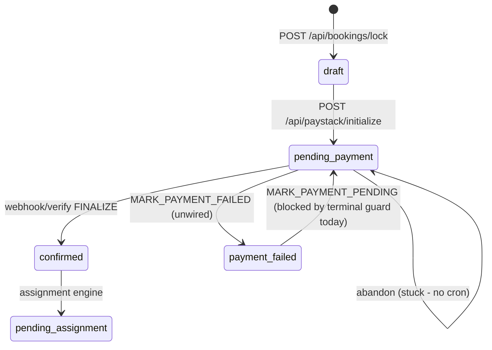

# Stage 2B-2 — Abandoned checkout & pending payment expiry (design)

**Date:** 2026-05-16  
**Status:** Design / audit only — **no implementation in this pass**  
**Depends on:** Stage 2B-1 (idempotent payment success recovery) — **complete**  
**Inputs:** `docs/audits/stage-2a-payment-edge-safety-audit.md`, current Paystack + lock + command layer code

---

## 1. Executive summary

Bookings can remain in **`pending_payment` indefinitely** when a customer abandons Paystack checkout or never returns to `/payment/success`. The platform already has the right **command** (`MARK_PAYMENT_FAILED`) and **RPC** (`booking_record_payment_failure`), but nothing invokes them for abandonment. The column **`payments.payment_link_expires_at`** is written at initialize time and **never read**.

**Recommendation:** Do **not** add a new `payment_expired` booking status. Use existing **`payment_failed`** with structured audit/metadata (`failure_reason: checkout_expired`). Run a **command-layer cron** (same pattern as assignment offer expiry) that expires stale `pending_payment` rows after **`payment_link_expires_at` + grace**, with safe guards so paid bookings are never touched.

**Prerequisite discovery:** `payment_failed` is listed in the **terminal** status set in `bookingCommandGuards.ts`, which currently **blocks** `MARK_PAYMENT_PENDING` retries even though `nextStatusForCommand` documents retry. Stage 2B-2 implementation must include a **small guard fix** for retry — without changing Paystack finalize or RPC bodies.

---

## 2. Audit answers (design questions)

### 2.1 What statuses currently exist for unpaid/expired payments?

| Layer | Values | Meaning today |
|-------|--------|----------------|
| **Booking** | `draft` | Created at lock; not yet sent to Paystack initialize |
| **Booking** | `pending_payment` | Initialize ran; awaiting Paystack success |
| **Booking** | `payment_failed` | Command/RPC-defined failure state; **no Paystack path sets it** |
| **Booking** | `cancelled` | Terminal cancel (allowed from non-terminal states) |
| **Payment row** | `initialized`, `pending` | Pre-success (initialize sets `pending` via `MARK_PAYMENT_PENDING`) |
| **Payment row** | `paid` | Set only by `FINALIZE_PAYMENT_SUCCESS` / RPC |
| **Payment row** | `failed` | Set only by `MARK_PAYMENT_FAILED` / RPC |
| **Payment row** | `refunded` | Not used in Paystack path |
| **Lock** | `active`, `consumed`, `expired` | Checkout lock lifecycle (`booking_locks.status`) |

There is **no** booking or payment enum value for “expired” checkout.

### 2.2 Is `payment_expired` a real booking status or only a concept?

**Concept only.** Repo-wide search shows **zero** `payment_expired` in schema, TypeScript `BOOKING_STATUSES`, guards, or UI. Stage 2A/2B-1 audits confirmed the same.

Use **`payment_failed`** plus audit/metadata to distinguish abandonment from Paystack-declined failures (future 2B-3).

### 2.3 How does `MARK_PAYMENT_FAILED` behave today?

| Aspect | Behavior |
|--------|----------|
| **Transition** | `pending_payment` → `payment_failed` only (`bookingCommandGuards.ts`) |
| **Payment row** | `initialized` / `pending` → `failed` (RPC guards status) |
| **Actor** | `admin`, `system`, `service` (`bookingCommandGuards` policy) |
| **Persistence** | `booking_record_payment_failure` RPC — audit row + updates (`20260515203000_booking_command_layer.sql`) |
| **Idempotency** | Optional `idempotencyKey` on command; RPC short-circuits if audit key exists |
| **Notification** | `executeBookingCommand` enqueues `payment_failed` email template on success |
| **Production callers** | **None** (webhook/verify/cron do not call it) |

RPC rejects if booking is not `pending_payment` (`BOOKING_NOT_AWAITING_PAYMENT`). It does **not** downgrade paid bookings.

### 2.4 What tables/fields indicate payment initialization time?

| Source | Field | When set |
|--------|-------|----------|
| `payments` | `created_at` | `MARK_PAYMENT_PENDING` insert |
| `payments` | `updated_at` | Any payment patch |
| `payments` | `payment_link_expires_at` | Paystack **initialize** (copied from `booking_locks.expires_at`) |
| `booking_locks` | `locked_at`, `expires_at` | Lock creation (30 min TTL) |
| `booking_locks` | `status = consumed` | First successful initialize |
| `bookings` | `updated_at` | Status transitions |
| `booking_state_audit` | `created_at` + `command = MARK_PAYMENT_PENDING` | Authoritative “entered pending_payment” event |

**Best expiry anchor:** `payments.payment_link_expires_at` when non-null; else `payments.created_at + BOOKING_LOCK_TTL_MINUTES` (30m).

### 2.5 What is `payment_link_expires_at` used for today?

| Operation | Uses column? |
|-----------|----------------|
| Set on initialize | **Yes** (`initializePayment.ts` ~271–282) |
| Initialize re-open Paystack | **No** |
| Verify / webhook finalize | **No** |
| Admin/customer UI | **No** |
| Cron / cleanup | **No** |

Migration comment (`20260516190000_booking_payment_lock.sql`): *“Paystack checkout link expiry aligned with booking_locks.expires_at.”* — **intent documented, enforcement missing**.

### 2.6 Safest threshold for marking `pending_payment` as failed?

| Rule | Recommendation |
|------|----------------|
| **Primary cutoff** | `now() > payment_link_expires_at + grace` |
| **Fallback cutoff** | `now() > payments.created_at + 30 minutes + grace` when `payment_link_expires_at` is null |
| **Grace period** | **15 minutes** after link expiry (webhook/verify lag, clock skew) |
| **Ops monitor (checklist)** | Alert `pending_payment` where `updated_at` **> 1 hour** — stricter than expiry cron; use for dashboards, not necessarily the same SQL |

**Do not** use lock `expires_at` alone after initialize: lock is **consumed** at first init; payment link expiry is the durable checkout window.

**Do not** expire `draft` bookings in this job — they never reached `pending_payment`.

### 2.7 Should abandoned checkout become `payment_failed`, `payment_expired`, `cancelled`, or stay `pending_payment`?

| Option | Verdict |
|--------|---------|
| **`payment_failed`** | **Recommended** — RPC + UI labels exist; retry path intended in docs |
| **`payment_expired` (new status)** | **Reject** — requires enum migration, matrix change, full UI/test sweep; duplicates `payment_failed` |
| **`cancelled`** | **Reject for default** — implies intentional cancel; blocks clear “payment didn’t complete” narrative; retry would need new booking |
| **Remain `pending_payment`** | **Reject** — current broken ops state; pollutes metrics |

Store subtype in **audit.metadata** / command **reason**: `checkout_expired` vs future `paystack_declined`.

### 2.8 Customer dashboard display

| State | Display | Copy direction |
|-------|---------|----------------|
| `pending_payment` (before cron) | Existing “Awaiting payment” warning badge | Optional: “Complete payment in Paystack” if returned within window |
| `payment_failed` + expired metadata | “Payment failed” / “Checkout expired” | Explain no charge finalized; CTA to try again |
| `payment_failed` (other reasons, later) | “Payment failed” | Paystack declined (2B-3) |

Show **`payment_link_expires_at`** on detail (optional 2B-2b): “Complete payment by …” while still `pending_payment`.

Do **not** show raw Paystack references as primary CTA for expired rows.

### 2.9 Should customers be allowed to retry payment?

**Yes**, for `payment_failed` after checkout expiry — **new lock + new initialize** (new quote review), not reuse consumed lock.

**Current gap:** `payment_failed` is in the **terminal** set (`bookingCommandGuards.ts` lines 9–12), so `MARK_PAYMENT_PENDING` is rejected with `TERMINAL_STATE` even though `nextStatusForCommand` allows `payment_failed` → `pending_payment`. **2B-2 implementation must fix this** (see §8).

`initializePayment` already allows non-paid statuses except `confirmed` / `pending_assignment`; it does not special-case `payment_failed` at the API layer.

### 2.10 Should expiry create audit rows?

**Yes — required.** Use `MARK_PAYMENT_FAILED` only (never direct `UPDATE bookings.status`). RPC inserts `booking_state_audit` (`pending_payment` → `payment_failed`) with:

- `command`: `MARK_PAYMENT_FAILED`
- `actor_type`: `service`
- `reason`: `Checkout expired without payment`
- `idempotency_key`: `cron:expire-pending-payment:{paymentId}` (or `{bookingId}:{paymentId}`)
- `metadata`: `{ "failure_reason": "checkout_expired", "expired_at": "<iso>", "payment_link_expires_at": "<iso>" }`

### 2.11 Should expiry trigger notifications?

| Phase | Recommendation |
|-------|----------------|
| **2B-2a (core)** | **Defer sending** — outbox enqueue exists but wire only after copy/legal review; log `expiredCount` from cron |
| **2B-2b** | Enable existing `payment_failed` template with branch for `checkout_expired` |

Avoid duplicate emails on cron retry — idempotent command + audit key prevents double enqueue if notification runs once per successful command.

### 2.12 Should cron use command layer or direct SQL?

**Command layer only** — mirror `expireStaleAssignmentOffers`:

1. Service-role Supabase client **selects candidates** (read-only query).
2. For each row, `executeBookingCommand({ type: "MARK_PAYMENT_FAILED", actor: service, ... })`.
3. Never `UPDATE bookings SET status = ...` from app/cron SQL.

Direct SQL would bypass audit, notifications, and guard invariants.

---

## 3. Current state (architecture snapshot)



**Time bounds today:**

| Mechanism | TTL | Enforced? |
|-----------|-----|-----------|
| `booking_locks.expires_at` | 30 min | At lock + first initialize only |
| `payments.payment_link_expires_at` | Copy of lock expiry | **Not enforced** |
| Stuck monitor (checklist) | 1 h `pending_payment` | **Not implemented** |

**Related code (reference):**

- Initialize + expiry column: `src/features/payments/server/initializePayment.ts`
- Lock TTL: `src/features/bookings/server/lock/constants.ts` (`BOOKING_LOCK_TTL_MINUTES = 30`)
- Failure RPC: `booking_record_payment_failure` in `supabase/migrations/20260515203000_booking_command_layer.sql`
- Cron pattern: `src/app/api/cron/expire-assignment-offers/route.ts` + `expireStaleAssignmentOffers`
- Success recovery (do not touch): `src/features/payments/server/paymentFinalizeRecovery.ts`

---

## 4. Status model recommendation

### 4.1 Booking status

| Scenario | Target booking status | Notes |
|----------|----------------------|--------|
| Checkout abandoned / link expired | `payment_failed` | Single failure bucket for v1 |
| Paystack hard decline (future 2B-3) | `payment_failed` | `failure_reason: paystack_declined` |
| Successful payment | `confirmed`+ | Unchanged (2B-1) |
| Customer/admin cancel before pay | `cancelled` | Separate explicit action; not default for abandon |

### 4.2 Payment row status

| Scenario | Target payment status |
|----------|----------------------|
| Expire cron | `failed` (via RPC) |
| Success | `paid` (unchanged) |

### 4.3 Do not add `payment_expired`

Adding a new enum value touches migrations, generated types, guards, badges, admin filters, tests, and docs — **high cost, low benefit** vs metadata on `payment_failed`.

---

## 5. Command recommendation

### 5.1 Single command: `MARK_PAYMENT_FAILED`

```typescript
await executeBookingCommand(backend, {
  type: "MARK_PAYMENT_FAILED",
  actor: { actorType: "service", profileId: null },
  bookingId,
  paymentId,
  idempotencyKey: `cron:expire-pending-payment:${paymentId}`,
  reason: "Checkout expired without payment",
  metadata: {
    failure_reason: "checkout_expired",
    source: "expire_pending_payment_cron",
    payment_link_expires_at: payment.payment_link_expires_at,
  },
});
```

### 5.2 Pre-expire guards (application layer, before command)

Skip (do not fail loudly) when **any** of:

| Guard | Reason |
|-------|--------|
| `booking.status !== 'pending_payment'` | Already moved (paid, failed, cancelled) |
| `payment.status === 'paid'` | Success path won |
| `payment.status IN ('failed', 'refunded')` | Already failed |
| `now <= expiry_at + grace` | Still in checkout window |
| Exists `payment_events` with success-type for payment | Extra safety (optional v1) |

### 5.3 Post-expire behavior for late Paystack success

After cron runs, booking is `payment_failed`. `FINALIZE_PAYMENT_SUCCESS` requires `pending_payment` — **late webhook/verify will not confirm** until customer retries (`MARK_PAYMENT_PENDING` after guard fix). This is **desirable** (avoids confirming abandoned slots without explicit retry).

**Do not** add finalize-time expiry checks in 2B-2 (would touch success path). Rely on state transition + cron ordering.

### 5.4 Guard fix for retry (required)

**Problem:** `payment_failed` ∈ `terminal` blocks `MARK_PAYMENT_PENDING`.

**Minimal fix (recommended):** In `assertTransitionShape`, allow `MARK_PAYMENT_PENDING` when `current === 'payment_failed'` (exempt from terminal block, or remove `payment_failed` from `terminal` set).

**Scope:** `bookingCommandGuards.ts` + unit test — **not** RPC rewrite.

---

## 6. Cron / job recommendation

### 6.1 New module

`src/features/payments/server/expirePendingPayments.ts` (name illustrative):

- `expireStalePendingPayments(client, backend, { now, batchSize, graceMinutes })`
- Returns `{ expiredCount, bookingIds, skipped: { paid, notYetDue, ... } }`

### 6.2 Candidate query (read-only)

```sql
-- Conceptual; implement via Supabase client
SELECT b.id AS booking_id, p.id AS payment_id, p.payment_link_expires_at, p.created_at
FROM bookings b
JOIN payments p ON p.booking_id = b.id
WHERE b.status = 'pending_payment'
  AND p.status IN ('initialized', 'pending')
  AND (
    (p.payment_link_expires_at IS NOT NULL
     AND p.payment_link_expires_at < :cutoff)
    OR
    (p.payment_link_expires_at IS NULL
     AND p.created_at < :fallback_cutoff)
  )
ORDER BY p.payment_link_expires_at NULLS LAST, p.created_at
LIMIT :batchSize;
```

Where `cutoff = now - grace`, `fallback_cutoff = now - 30min - grace`.

Use **latest** payment per booking if multiple rows exist (should be rare due to idempotency key).

### 6.3 Route

`GET/POST /api/cron/expire-pending-payments` — same auth as `expire-assignment-offers` (`CRON_SECRET`).

### 6.4 Scheduler

Supabase Cron + Vault URL (document in `docs/operations/expire-pending-payments-cron.md`) — **hourly** sufficient; **every 15 min** optional in high-volume prod.

### 6.5 Constants (env)

| Variable | Default | Purpose |
|----------|---------|---------|
| `PENDING_PAYMENT_EXPIRY_GRACE_MINUTES` | `15` | After `payment_link_expires_at` |
| `PENDING_PAYMENT_EXPIRE_BATCH_SIZE` | `50` | Per run cap |
| `BOOKING_LOCK_TTL_MINUTES` | `30` | Fallback when link expiry null |

---

## 7. Customer UX recommendation

| Priority | Item |
|----------|------|
| P0 | Badge copy for `payment_failed` — distinguish expired via metadata in `labelForBookingStatus` or detail subtitle |
| P1 | Booking detail CTA: “Book again” → `/customer/book` and/or “Retry payment” → new wizard lock flow for same booking |
| P2 | While `pending_payment` and `now < payment_link_expires_at`, show “Payment in progress — complete checkout” |
| P3 | Do not poll Paystack from dashboard; rely on return URL + webhook |

**Retry flow (after guard fix):**

1. Customer opens failed booking detail.  
2. CTA starts wizard or API: new `POST /api/bookings/lock` (new `checkoutIdempotencyKey`).  
3. `POST /api/paystack/initialize` → `MARK_PAYMENT_PENDING` from `payment_failed`.  
4. Redirect to Paystack.

---

## 8. Admin UX recommendation

| Priority | Item |
|----------|------|
| P1 | Admin bookings list filter: `status=pending_payment|payment_failed` |
| P1 | Show `payment_link_expires_at` + age on booking detail payments section |
| P2 | Admin home metric: count `pending_payment` where `updated_at < now() - 1h` (checklist alignment) |
| P2 | Cron JSON response logged / exposed to ops (`expiredCount`, `bookingIds`) |

No manual “force expire” in v1 unless re-running cron endpoint is sufficient.

---

## 9. Retry-payment recommendation

| Question | Answer |
|----------|--------|
| Allow retry? | **Yes** — new lock + initialize |
| Same booking row? | **Yes** — keep booking id; new payment idempotency key from new checkout session |
| Reuse old Paystack reference? | **No** — new initialize builds/reuses provider ref per existing rules |
| From `pending_payment` (not yet expired)? | Idempotent initialize already reopens Paystack (no cron needed) |
| From `payment_failed`? | Requires guard fix + new lock |

---

## 10. Risk analysis

| Risk | Likelihood | Impact | Mitigation |
|------|------------|--------|------------|
| Cron expires booking that actually paid | Low | High | Pre-check `payment.status`, `booking.status`; grace period; 2B-1 recovery already handles success races |
| Cron races webhook | Medium | Medium | 15m grace; command idempotency; finalize only from `pending_payment` |
| Retry blocked by terminal guard | **Current bug** | High | Fix guards in 2B-2a |
| Customer confusion (failed vs cancelled) | Medium | Low | Copy + metadata `checkout_expired` |
| Notification spam | Low | Medium | Defer email to 2B-2b; idempotent audit keys |
| Multiple payment rows per booking | Low | Medium | Target latest `pending` payment for booking |
| `BOOKING_LOCK_REQUIRED=false` rows missing link expiry | Medium | Low | Fallback `created_at + 30m` |
| Late Paystack success after expiry | Low | Medium | Customer must retry; ops can manual verify in admin if needed |

---

## 11. Implementation plan (Stage 2B-2 implementation — not this pass)

Split into shippable slices **without touching payment success finalization** (`finalizePaidBooking`, `paymentFinalizeRecovery`, `booking_finalize_payment_success` RPC).

### Phase 2B-2a — Core expiry (backend)

| Step | Work |
|------|------|
| 1 | Fix `assertTransitionShape` / terminal handling for `MARK_PAYMENT_PENDING` from `payment_failed` + test |
| 2 | Implement `expireStalePendingPayments` using `executeBookingCommand(MARK_PAYMENT_FAILED)` |
| 3 | Add `/api/cron/expire-pending-payments` + `verifyCronSecret` |
| 4 | Unit tests: expire due row, skip paid, skip not-due, idempotent re-run, amount mismatch N/A |
| 5 | Ops doc for Supabase Cron + Vault |

### Phase 2B-2b — Visibility (UI, read-only plus filters)

| Step | Work |
|------|------|
| 6 | Admin: filter + `payment_link_expires_at` on detail |
| 7 | Customer: expired copy + “Book again” / retry CTA wiring to lock API |
| 8 | Optional: stuck `pending_payment` > 1h on admin home |

### Phase 2B-2c — Notifications (optional)

| Step | Work |
|------|------|
| 9 | Enable `payment_failed` email for cron with `checkout_expired` template branch |

### Explicitly defer to later stages

- Paystack `charge.failed` webhook → `MARK_PAYMENT_FAILED` (2B-3)  
- `/payment/failed` redirect wiring (2B-3)  
- Finalize-time `payment_link_expires_at` enforcement (risks false negatives; prefer cron first)  
- New `payment_expired` enum  

---

## 12. Things not to touch (Stage 2B-2)

| Area | Reason |
|------|--------|
| `finalizePaidBooking` / `paymentFinalizeRecovery` | 2B-1 complete; success path |
| `booking_finalize_payment_success` RPC | User constraint |
| Paystack initialize amount/lock authority | Working |
| Assignment engine / `runAssignmentAfterPayment` | Out of scope |
| Earnings | Out of scope |
| RLS policies | Out of scope |
| `payment_events` uniqueness / idempotency keys for success | Out of scope |

**Allowed adjacent touch:** `bookingCommandGuards.ts` terminal exception for payment retry (required for product correctness).

---

## 13. Final answer — what to implement next (safely)

**Next implementation (Stage 2B-2a):** A **command-layer cron** that expires stale **`pending_payment`** bookings via existing **`MARK_PAYMENT_FAILED`**, using **`payment_link_expires_at + 15 minutes grace`** (fallback: **`payments.created_at + 30 minutes + grace`**), plus the **minimal guard fix** so customers can **`MARK_PAYMENT_PENDING` again from `payment_failed`** when retrying with a **new lock**.

**Do not implement in the same slice:**

- Changes to Paystack verify/webhook finalize logic (2B-1 stays authoritative for success).  
- New `payment_expired` status or migration.  
- Blocking finalize based on expiry (optional future hardening).  

**Smallest safe first PR (single vertical slice):**

1. `expireStalePendingPayments` + `/api/cron/expire-pending-payments` + tests.  
2. Guard exception: `MARK_PAYMENT_PENDING` allowed from `payment_failed`.  
3. No UI required for cron to be production-safe (ops can hit cron + see audit rows).

This clears abandoned checkout stuck state **without** risking paid-booking regression on the success path fixed in 2B-1.
