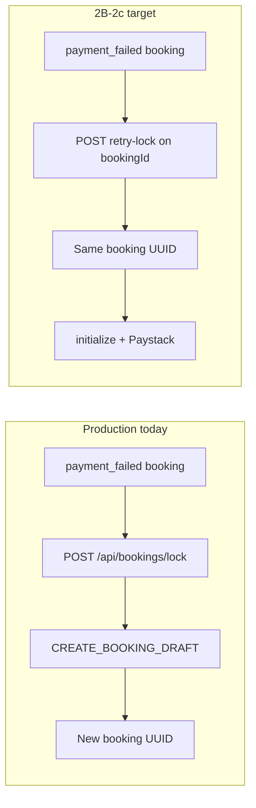
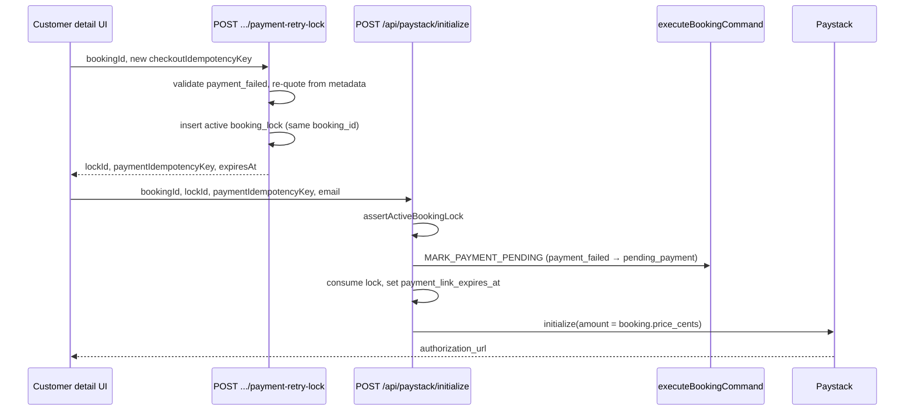

# Stage 2B-2c — Production same-booking payment retry (design)

**Date:** 2026-05-16  
**Status:** Design / audit only — **no implementation in this pass**  
**Depends on:** Stage 2B-2a (expiry cron), 2B-2b (failed-payment UX) — **complete**  
**Inputs:** `createBookingPaymentLock.ts`, `initializePayment.ts`, `booking_locks` migration, `bookingCommandGuards.ts`, `docs/operations/payment-failed-customer-retry.md`

---

## 1. Executive summary

Customers in **`payment_failed`** need to pay again on the **same booking row** without running the full wizard (which today always creates a **new** booking via `POST /api/bookings/lock`).

The **command layer is ready** (`MARK_PAYMENT_PENDING` from `payment_failed` after 2B-2a guard fix). Production is blocked by **lock + payment idempotency mechanics**, not by Paystack finalize.

**Recommended architecture:** Add a dedicated **retry lock** API that attaches a **new active `booking_locks` row** to an existing `payment_failed` booking (schema tweak required), then reuse **`POST /api/paystack/initialize`** unchanged in spirit with a **new `paymentIdempotencyKey`** and **new payment row**. Do **not** update the failed payment row in place.

**Final answer (§12):** Keep **“Start a new booking”** in production until 2B-2c is implemented and verified in staging. The slice is **safe to implement next** as a bounded backend + UI change; it should not ship to customers without the migration and tests below.

---

## 2. Current limitation

### 2.1 What works today

| Layer | Behavior |
|-------|----------|
| **Guards** | `MARK_PAYMENT_PENDING` allowed from `payment_failed` → `pending_payment` (`bookingCommandGuards.ts`) |
| **Initialize** | Accepts any booking status except `confirmed` / `pending_assignment` (`initializePayment.ts` ~144–151) |
| **Failure UX** | Labels, payment issue panel, admin attention (`paymentFailureDisplay.ts`, 2B-2b) |
| **Expiry** | Cron moves stale `pending_payment` → `payment_failed` with `failure_reason: checkout_expired` (2B-2a) |

### 2.2 What blocks production retry

| Blocker | Detail |
|---------|--------|
| **Lock API always creates a new booking** | `createBookingPaymentLock()` calls `CREATE_BOOKING_DRAFT` on every **new** `checkoutIdempotencyKey` (`createBookingPaymentLock.ts` ~141–160). |
| **One lock row per booking (DB)** | `booking_locks_booking_id_unique` prevents a second lock on the same `booking_id` (`20260516190000_booking_payment_lock.sql` ~38). First checkout **consumes** the lock; retry cannot insert another. |
| **Consumed lock rejected** | `assertActiveBookingLock()` returns `409 LOCK_NOT_ACTIVE` for `status = consumed` (`assertActiveLock.ts` ~55–61). |
| **UI defers retry** | `canRetryPaymentOnExistingBooking()` is `false` when `BOOKING_LOCK_REQUIRED` is true (default) → **Start a new booking** (`payment-failed-customer-retry.md`). |



---

## 3. Audit answers

### 3.1 Current lock API behavior

**Route:** `POST /api/bookings/lock` → `createBookingPaymentLock(user, BookingLockInput)`.

| Step | Behavior |
|------|----------|
| Auth | Customer only; `actingCustomerId` required |
| Quote | Server `calculateQuote(pricingInput)`; client total must match |
| Idempotent reuse | Same `checkoutIdempotencyKey` + same `inputs_hash` → return existing `lockId` + **existing** `bookingId` |
| New checkout | `CREATE_BOOKING_DRAFT` + `insertBookingLock()` → new booking + new lock |
| TTL | 30 minutes (`BOOKING_LOCK_TTL_MINUTES`) |
| Payment key | `paystack:checkout:{checkoutIdempotencyKey}` (`paymentIdempotencyKeyForLock`) |

**Not supported:** `bookingId` in request body, `payment_failed` as target status, or re-lock on consumed lock.

### 3.2 Current Paystack initialize behavior

**Route:** `POST /api/paystack/initialize` → `initializePayment()`.

| Booking status | Result |
|----------------|--------|
| `confirmed`, `pending_assignment` | `409 INVALID_STATE` (“already paid”) |
| `pending_payment` + same `paymentIdempotencyKey` | Re-open Paystack on **existing** pending payment (no new `MARK_PAYMENT_PENDING`) |
| Other (incl. `payment_failed`, `draft`) | Requires lock (if enabled) → `MARK_PAYMENT_PENDING` → consume lock → set `payment_link_expires_at` → Paystack init |

**Amount authority:** Always `booking.price_cents` at Paystack initialize time (`completePaystackInitialize` ~326–327).

**Out of scope (unchanged):** `finalizePaidBooking`, webhook/verify, `booking_finalize_payment_success`.

### 3.3 Required data to retry on existing booking

| Data | Source | Required for |
|------|--------|----------------|
| `bookingId` | URL / UI | Lock + initialize |
| `customerId` match | `bookings.customer_id` | Auth |
| `booking.status === payment_failed` | DB | Retry eligibility |
| `scheduled_start` / `scheduled_end` | `bookings` row | Lock schedule + past-slot guard |
| `price_cents`, `currency` | `bookings` row | Paystack amount |
| Pricing input | `bookings.metadata.quote.input` | Server re-quote validation |
| Address / suburb / cleaner pref | `bookings.metadata` (+ `locked_metadata` on prior lock if needed) | Display + eligibility |
| Customer email | Auth session | Paystack initialize |
| **New** `checkoutIdempotencyKey` | Client-generated per retry attempt | Lock row + payment key namespace |
| **New** `paymentIdempotencyKey` | Derived from checkout key | New payment row |

### 3.4 Is `metadata.quote` sufficient?

**Yes for pricing re-validation**, if the booking was created through the wizard/lock path.

`buildBookingQuoteMetadata()` persists (`metadata.ts`):

- `quote.input`: `serviceSlug`, `bedrooms`, `bathrooms`, `propertySizeSqm`, `frequency`, `addons`, `teamSize`
- `quote.breakdown`: line items, `totalCents`, `pricingVersion`

`resolveServiceSlugFromMetadata()` and dashboard tests confirm the wizard shape.

**Gaps to handle in implementation:**

| Gap | Mitigation |
|-----|------------|
| Legacy bookings missing `quote.input` | Reject retry with `RETRY_NOT_SUPPORTED` → UI shows **Start a new booking** |
| Address / `areaSlug` only in top-level metadata | Read suburb from `metadata.suburb` / `metadata.address` (same as `parseBookingDisplay`) |
| Cleaner preference | Read from `metadata` or last `booking_locks.locked_cleaner_preference` if present |
| Schedule in the past | Reject retry (`INVALID_SCHEDULE`) — customer must new booking |

**Do not** accept client-supplied pricing input as authority on retry; rebuild `PricingInput` from stored metadata server-side.

### 3.5 Must `checkoutIdempotencyKey` change?

**Yes — every retry attempt needs a new key.**

| Reason | Detail |
|--------|--------|
| Lock uniqueness | `booking_locks.idempotency_key` is globally unique |
| First lock consumed | Reusing the original wizard key hits a **consumed** lock → `LOCK_NOT_ACTIVE` |
| Semantics | Each retry is a new checkout **session**, not idempotent replay of the failed one |

**Recommended format:**

```text
retry:{bookingId}:{clientAttemptId}
```

where `clientAttemptId` is a UUID (or monotonic attempt counter stored client-side for double-click protection).

### 3.6 How to prevent duplicate payments

| Mechanism | Usage |
|-----------|--------|
| **New `payments.idempotency_key`** per retry | Required; global unique constraint on `payments.idempotency_key` |
| **Never reuse** `paystack:booking:{bookingId}` after failure | Old row remains `failed`; reuse would block insert or confuse initialize |
| **`MARK_PAYMENT_PENDING` idempotency** | Only short-circuits when `booking.status === pending_payment` and key matches — safe for retry from `payment_failed` |
| **Single active lock per booking** | Partial unique index (see §4) — only one `active` lock |
| **Initialize allowlist** | Only `payment_failed` (and existing `pending_payment` path) for retry lock |
| **Finalize idempotency** | Unchanged — `FINALIZE_PAYMENT_SUCCESS` keyed by provider event id (2B-1) |
| **At most one `paid` per booking** | Existing RPC guards + `hasPaidPaymentForBooking` |

**Rule:** One failed payment row per attempt (historical audit); at most one `pending` payment driving checkout at a time.

### 3.7 Avoid changing confirmed / assigned / completed bookings

**Application allowlist** (retry lock + initialize entry):

| Allowed | Blocked |
|---------|---------|
| `payment_failed` | `confirmed`, `pending_assignment`, `assigned`, `in_progress`, `completed`, `payout_ready`, `paid_out`, `cancelled` |
| (optional) `draft` — out of scope for 2B-2c UI | |

Harden `initializePayment` from a loose “not confirmed” check to an **explicit allowlist** so future statuses do not accidentally accept payment.

**RPC safety:** `booking_finalize_payment_success` requires `pending_payment`; late success after expiry stays blocked until retry succeeds (desired).

### 3.8 New payment row vs update failed payment?

**Recommendation: always insert a new payment row.**

| Approach | Verdict |
|----------|---------|
| **New row** | **Recommended** — preserves failure history, cron audit links to old `payment_id`, clear admin timeline |
| **Update failed → pending** | **Reject** — loses attempt boundary, complicates Paystack `provider_ref` reuse, fights RPC that sets `failed` |

`MARK_PAYMENT_PENDING` already **inserts** a new payment when coming from `payment_failed` (no idempotent short-circuit unless status is `pending_payment`).

### 3.9 Amount / pricing drift

| Policy | Recommendation |
|--------|----------------|
| **Authority at Paystack** | `bookings.price_cents` (unchanged) |
| **On retry lock** | Re-run `calculateQuote()` from `metadata.quote.input` |
| **Match rule** | `serverTotal === booking.price_cents` or return `409 QUOTE_STALE` |
| **Catalog price changed** | Do **not** auto-update booking price in 2B-2c — force **Start a new booking** (new quote UX) |
| **Client `priceCents` on initialize** | Ignored / rejected if mismatched to lock (existing behavior) |

Optional later: admin or command to refresh price on booking before retry (out of scope).

### 3.10 Customer detail — how retry should call

**Recommended UX flow (production after 2B-2c):**

1. Customer opens `/customer/bookings/[bookingId]` (`payment_failed`).
2. **Payment not completed** panel shows **Retry payment** (replaces **Start a new booking** when retry is supported).
3. Client generates `checkoutIdempotencyKey = retry:{bookingId}:{uuid}`.
4. `POST /api/bookings/{bookingId}/payment-retry-lock` with body `{ checkoutIdempotencyKey }` (optional `clientQuoteTotalCents` advisory).
5. On success: `POST /api/paystack/initialize` with `{ bookingId, lockId, email, paymentIdempotencyKey }` from step 4 response.
6. Redirect to `authorization_url`.
7. Existing `/payment/success` + verify path unchanged.

**Do not** route retry through the full booking wizard unless quote is stale or metadata is incomplete (then **Start a new booking**).

**Optional phase 2:** `POST /api/bookings/{bookingId}/retry-payment` bundles lock + initialize (single round trip); not required for v1.

### 3.11 Admin visibility of retry attempts

Read-only extensions (no mutation controls):

| Surface | Addition |
|---------|----------|
| **Booking detail — Payments** | List all payments chronologically; show `failed` / `pending` / `paid` + `created_at` |
| **Audit timeline** | `MARK_PAYMENT_PENDING` rows after a `MARK_PAYMENT_FAILED` indicate retry |
| **Metadata** | `metadata.retry_attempt`, `metadata.checkout_idempotency_key` on lock/payment audit (optional) |
| **Locks (admin)** | Show lock history: `active` / `consumed` / `expired` per booking after migration allows multiple rows |
| **Attention badge** | Existing checkout_expired / payment_failed badges; add subtitle “Retry in progress” when `pending_payment` after failure |

No admin “force retry” button in 2B-2c.

### 3.12 Required tests

| Area | Tests |
|------|--------|
| **Retry lock service** | Happy path on `payment_failed`; rejects `confirmed` / `assigned` / `cancelled`; rejects missing `quote.input`; rejects past schedule; rejects `QUOTE_STALE`; idempotent same retry key returns same active lock |
| **Schema / repository** | Two locks on same booking (first consumed, second active); only one active enforced |
| **Initialize** | From `payment_failed` with valid retry lock → `pending_payment` + new payment row; new `paymentIdempotencyKey`; amount = `price_cents` |
| **Idempotency** | Double-click same checkout key; duplicate initialize while `pending_payment` reopens Paystack |
| **Payment rows** | Failed payment unchanged; new pending payment created |
| **Guards** | `MARK_PAYMENT_PENDING` still blocked from `paid_out` / `completed` |
| **Integration** | Failure → cron expire → retry lock → initialize (mock Paystack) → finalize (existing tests) |
| **UI / read model** | `canRetryPaymentOnExistingBooking()` true when retry API available; Retry CTA visible; admin lists multiple payments |
| **Regression** | Wizard `POST /api/bookings/lock` still creates new booking; no change to finalize/webhook tests |

---

## 4. Recommended retry architecture

### 4.1 Pattern: “Retry lock” + existing initialize

Two-step checkout, mirroring the wizard, with a **new server function** that does **not** call `CREATE_BOOKING_DRAFT`.



### 4.2 Why not extend `POST /api/bookings/lock`?

| Concern | Separate retry route |
|---------|----------------------|
| Accidental new booking | Retry handler never calls `CREATE_BOOKING_DRAFT` |
| Input contract | Lock body today requires full wizard pricing payload; retry infers from metadata |
| Authorization | Retry scoped to `bookingId` + ownership |
| Observability | Clear metrics/logs for “retry” vs “new booking” |

Optional later: shared internal `insertBookingLockForBooking()` used by both paths.

---

## 5. API contract

### 5.1 `POST /api/bookings/{bookingId}/payment-retry-lock`

**Auth:** Customer session; booking must belong to `actingCustomerId`.

**Request body:**

```json
{
  "checkoutIdempotencyKey": "retry:<bookingId>:<uuid>",
  "clientQuoteTotalCents": 59000
}
```

`clientQuoteTotalCents` is advisory; server recalculates and compares to `bookings.price_cents`.

**Success (200):**

```json
{
  "ok": true,
  "lockId": "<uuid>",
  "bookingId": "<same as path>",
  "lockedPriceCents": 59000,
  "currency": "ZAR",
  "expiresAt": "<iso>",
  "paymentIdempotencyKey": "paystack:checkout:retry:<bookingId>:<uuid>",
  "idempotent": false
}
```

**Error codes (illustrative):**

| Code | HTTP | When |
|------|------|------|
| `BOOKING_NOT_FOUND` | 404 | Missing or wrong customer |
| `RETRY_NOT_ELIGIBLE` | 409 | Status not `payment_failed` |
| `RETRY_NOT_SUPPORTED` | 422 | Missing `metadata.quote.input` |
| `QUOTE_STALE` | 409 | Re-quote ≠ `booking.price_cents` |
| `INVALID_SCHEDULE` | 410 | `scheduled_start` in the past |
| `LOCK_ALREADY_ACTIVE` | 409 | Another active lock exists (should not happen if partial unique enforced) |
| `PROVISIONING_INCOMPLETE` | 403 | Customer row missing |

### 5.2 `POST /api/paystack/initialize` (existing)

No contract break. Callers must pass:

- `bookingId` (existing row)
- `lockId` (from retry-lock response)
- `paymentIdempotencyKey` (from retry-lock response — **must be new**)
- `email`

**Hardening only:** explicit booking-status allowlist at top of `initializePayment`.

---

## 6. Idempotency strategy

| Key | Scope | Retry behavior |
|-----|-------|----------------|
| `checkoutIdempotencyKey` | `booking_locks.idempotency_key` | New per retry attempt; same key + same hash → return existing **active** retry lock |
| `paystack:checkout:{checkoutIdempotencyKey}` | `payments.idempotency_key` | New payment row per attempt |
| Paystack `reference` | `payments.provider_ref` | New payment → new or regenerated ref (`buildPaystackReference`) |
| `FINALIZE_PAYMENT_SUCCESS` | `payment_events` / audit | Unchanged — provider event id |

**Never** reuse the wizard’s original `checkoutIdempotencyKey` after lock consumption.

---

## 7. Pricing / quote safety

1. Build `PricingInput` from `bookings.metadata.quote.input` only.
2. `calculateQuote()` → `serverTotal`.
3. If `serverTotal !== booking.price_cents` → `QUOTE_STALE` (no silent patch).
4. Retry lock stores `locked_price_cents = booking.price_cents` (not re-derived total without explicit product decision).
5. `assertBookingMatchesLock()` before initialize (existing).
6. Paystack amount = `booking.price_cents` (existing).

---

## 8. Command usage

| Step | Command | Transition |
|------|---------|------------|
| Expiry (existing) | `MARK_PAYMENT_FAILED` | `pending_payment` → `payment_failed` |
| Retry initialize | `MARK_PAYMENT_PENDING` | `payment_failed` → `pending_payment` |
| Success (unchanged) | `FINALIZE_PAYMENT_SUCCESS` | `pending_payment` → `confirmed` |

**No new booking command types** for 2B-2c.

**Optional audit metadata on retry `MARK_PAYMENT_PENDING`:**

```json
{
  "source": "payment_retry",
  "checkout_idempotency_key": "retry:...",
  "prior_payment_ids": ["<failed-payment-uuid>"]
}
```

**Do not modify** `booking_record_payment_failure` or `booking_finalize_payment_success` RPC bodies.

---

## 9. UI behavior

| State | Customer detail |
|-------|-----------------|
| `payment_failed` + retry supported | **Payment not completed** panel + **Retry payment** button |
| `payment_failed` + missing metadata / quote stale | Panel + **Start a new booking** only |
| `pending_payment` (after retry) | Existing awaiting-payment copy; optional link expiry display (2B-2b P2) |
| Retry in flight | Disable button; loading state |

Update `canRetryPaymentOnExistingBooking()` to reflect retry-lock availability (not merely `!BOOKING_LOCK_REQUIRED`).

**Home / list:** No change — failed bookings remain non-upcoming.

---

## 10. Admin visibility

| Item | Implementation |
|------|----------------|
| Payment history | Already listed; ensure sort by `created_at` desc |
| Failure reason | Existing `paymentFailureReason` from audit |
| Retry signal | Second+ `MARK_PAYMENT_PENDING` audit after `MARK_PAYMENT_FAILED` |
| Lock history | Admin-only query on `booking_locks` by `booking_id` (after schema change) |

Filter-ready labels: **Payment failed**, **Checkout expired**, **Retry checkout open** (`pending_payment` post-failure).

---

## 11. Implementation phases

### Phase 2B-2c-1 — Schema + retry lock (backend)

| Task | Notes |
|------|-------|
| Migration | Drop `booking_locks_booking_id_unique`; add `unique (booking_id) where status = 'active'` |
| `createPaymentRetryLock(bookingId, …)` | Server-only module under `lock/` |
| Route | `POST /api/bookings/[bookingId]/payment-retry-lock` |
| Tests | Service + route tests |

### Phase 2B-2c-2 — Initialize hardening

| Task | Notes |
|------|-------|
| Allowlist | `payment_failed`, `pending_payment`, `draft` (if ever needed); deny paid path |
| Docs | Update `booking-lock-before-payment.md`, `payment-failed-customer-retry.md` |

### Phase 2B-2c-3 — Customer UI

| Task | Notes |
|------|-------|
| Replace **Start a new booking** with **Retry payment** when eligible | `PaymentIssuePanel`, wire lock + initialize |
| Fallback copy | Quote stale / unsupported metadata |

### Phase 2B-2c-4 — Admin read model (optional same PR)

| Task | Notes |
|------|-------|
| Payment attempt count / last failure | Read-only fields on admin detail |

**Explicitly defer:** Paystack `charge.failed` webhook (2B-3), notification template branching, booking price refresh command.

---

## 12. Risks and mitigations

| Risk | Impact | Mitigation |
|------|--------|------------|
| Migration allows two active locks (bug) | Double checkout | Partial unique index + transactional lock insert |
| Re-quote ≠ stored price | Wrong charge or confusion | `QUOTE_STALE`; no auto-update |
| Schedule in past | Meaningless retry | `INVALID_SCHEDULE` on retry lock |
| Late Paystack success on old ref | Wrong booking state | Finalize only from `pending_payment` on **new** payment (2B-1) |
| Duplicate `paymentIdempotencyKey` | DB unique violation | Server returns key; client must use response |
| Missing metadata on old rows | Retry broken | `RETRY_NOT_SUPPORTED` + new booking CTA |
| Race: cron expire vs retry | Edge timing | 15m grace on expiry cron (existing) |

---

## 13. Final recommendation

### Architecture

Implement **retry lock on existing `payment_failed` booking** + **new payment row** + **existing initialize/finalize path**, with a **small `booking_locks` migration** (one active lock per booking, multiple historical locks).

### Is same-booking retry safe to implement now?

| Question | Answer |
|----------|--------|
| **Safe to design?** | **Yes** — boundaries are clear; no finalize/webhook/RLS/enum changes required. |
| **Safe to ship to production UI today without 2B-2c code?** | **No** — keep **Start a new booking** until retry-lock + migration + tests land. |
| **Safe to implement as the next slice?** | **Yes** — recommended after design sign-off; medium scope, high customer value, low coupling to assignment/earnings. |

**Production should keep “Start a new booking” until:**

1. Partial unique lock migration applied in all environments.  
2. `payment-retry-lock` API deployed and covered by tests.  
3. Initialize allowlist hardened.  
4. Customer detail wired to lock → initialize in staging with `BOOKING_LOCK_REQUIRED=true`.  

After staging verification, flip `canRetryPaymentOnExistingBooking()` / UI to offer **Retry payment** on the same booking.

---

## 14. Things not to touch (2B-2c)

| Area | Reason |
|------|--------|
| `finalizePaidBooking` / `paymentFinalizeRecovery` | 2B-1 success path |
| Paystack webhook / verify success handling | User constraint |
| `booking_finalize_payment_success` RPC | User constraint |
| Assignment engine / earnings | Out of scope |
| RLS policies | Out of scope |
| Booking status enum | Use `payment_failed` + metadata |
| Expiry cron (`expireStalePendingPayments`) | 2B-2a complete |

**Allowed:** `booking_locks` constraint migration, new lock service + route, initialize allowlist, UI + read models, tests, ops docs.
