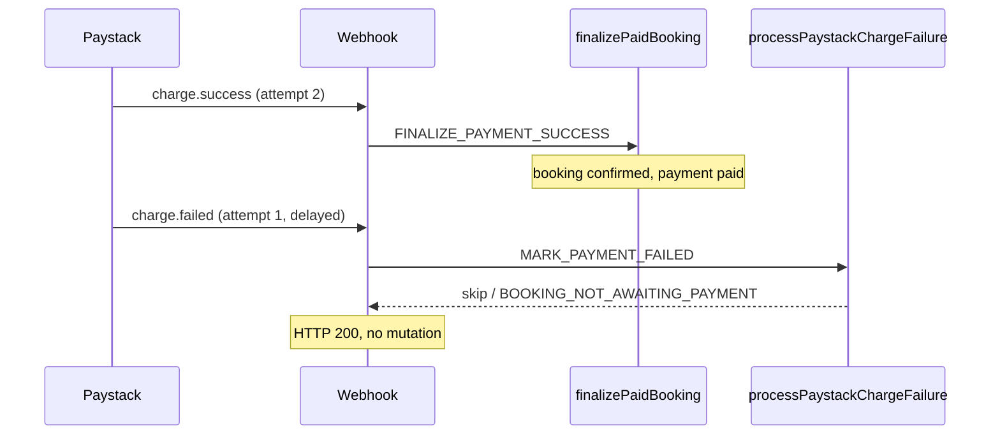
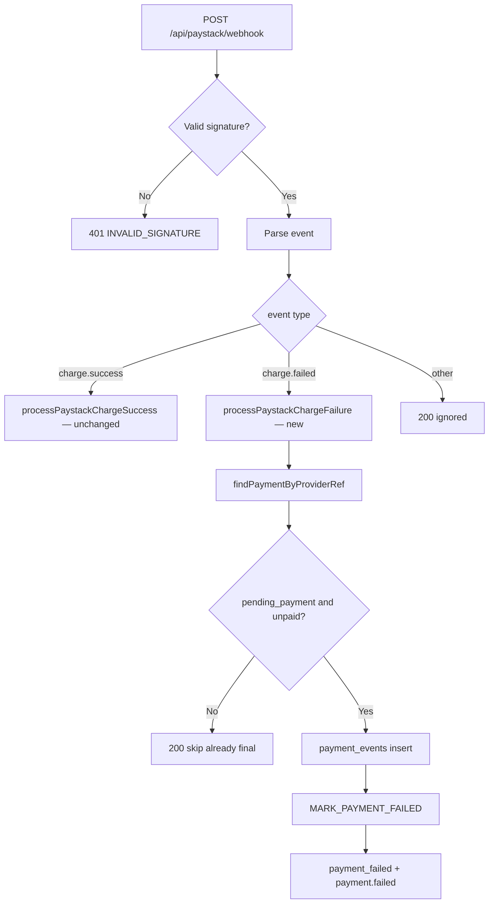

# Stage 2B-3 — Paystack failed charge webhook handling (design)

**Date:** 2026-05-17  
**Status:** Design / audit only — **no implementation in this pass**  
**Depends on:** Stage 2B complete (2B-1 race recovery, 2B-2a expiry cron, 2B-2b UX, 2B-2c same-booking retry)  
**Inputs:** `docs/audits/stage-2b-payment-edge-final-audit.md`, `docs/payments/paystack-foundation.md`, current webhook + command layer code

---

## 1. Executive summary

Paystack **declined/failed charges** can leave bookings in **`pending_payment`** until the **abandoned-checkout cron** (2B-2a) runs. The platform already has the correct failure command (`MARK_PAYMENT_FAILED`) and RPC (`booking_record_payment_failure`), but the webhook handler **only processes `charge.success`** and returns `handled: false` for everything else.

**Recommendation:** Add a **symmetric failure path** next to the existing success path: verify signature → map `charge.failed` (and only that event in v1) → resolve payment by `provider_ref` → record `payment_events` → `executeBookingCommand(MARK_PAYMENT_FAILED)` with structured metadata. **Do not** modify `finalizePaidBooking`, assignment, earnings, RLS, booking status enum, or `booking_finalize_payment_success`.

**Paystack caveat:** Public Paystack docs emphasize webhooks for **successful** charges on the verify page; `charge.failed` is widely used in integrations and listed in ops checklists, but **must be validated in the Paystack dashboard** (test declined card + webhook log) before relying on it for real-time UX. Until confirmed, **cron remains the safety net**.

**Safest implementation slice:** Webhook-only `charge.failed` → shared `processPaystackChargeFailure` facade (mirror `processPaystackChargeSuccess`), with pre-command guards and idempotent `payment_events` — **no** verify-route changes, **no** finalize/assignment touches, **no** new booking statuses. Optional follow-up: `failure_reason` display copy for declines (UI-only).

---

## 2. Audit answers (design questions)

### 2.1 Which Paystack webhook events represent failed/declined checkout?

| Event | Treat in 2B-3? | Notes |
|-------|----------------|-------|
| **`charge.failed`** | **Yes (primary)** | Paystack sends when a charge attempt fails (card declined, insufficient funds, etc.). Same `data` shape as `charge.success` in practice (`PaystackWebhookEvent` already types `PaystackVerifyData`). |
| **`charge.success`** | **No change** | Existing path; out of scope for 2B-3. |
| Customer closes hosted checkout without paying | **No webhook** | No reliable `charge.failed`; covered by **2B-2a cron** (`checkout_expired`). |
| **`transfer.*`, `refund.*`, `dispute.*`** | **No** | Different lifecycle; do not call `MARK_PAYMENT_FAILED`. |
| Verify API `status: "failed"` | **Out of scope v1** | `verifyPayment` already returns `{ paid: false }` without mutating booking (`mapPaystackVerifyData` returns `null`). Intentionally unchanged so browser verify does not race-authority over webhook. |

**Ops action before ship:** In Paystack dashboard → Webhooks, ensure URL points to `/api/paystack/webhook` and **`charge.failed` is subscribed** (alongside `charge.success`). Run one **test decline** and confirm delivery + signature.

**Documentation uncertainty:** Paystack’s verify docs note webhooks are “for successful transactions” in some wording; treat **`charge.failed` as best-effort real-time signal**, not a replacement for cron.

### 2.2 What payload fields identify booking/payment/reference?

Webhook body (already parsed as `PaystackWebhookEvent`):

| Field | Use |
|-------|-----|
| `event` | Must be `charge.failed` for v1 handler. |
| `data.reference` | **Primary lookup** — matches `payments.provider_ref` (set at initialize; format `bk_{booking8}_{payment12}`). |
| `data.id` | Paystack transaction id → `provider_event_id`: `paystack:txn:{id}` (same pattern as success). |
| `data.status` | Expect `"failed"`; reject/skip if `"success"` (misrouted event). |
| `data.amount` | Optional sanity check vs `payments.amount_cents` (log/warn; do not block failure marking on mismatch for declines). |
| `data.metadata.booking_id` | Secondary validation only — **trust DB row from reference**, not metadata alone. |
| `data.metadata.payment_id` | Secondary validation — must match payment row if present. |
| `data.gateway_response` / `data.message` | Audit payload + optional `metadata.failure_detail` (not shown in customer UI v1). |

Initialize already sends metadata (`initializePayment.ts`):

```json
{
  "booking_id": "<uuid>",
  "payment_id": "<uuid>",
  "customer_id": "<uuid>",
  "lock_id": "<uuid|null>"
}
```

### 2.3 How does the current webhook route handle `charge.success` only?

**Route:** `POST /api/paystack/webhook` → `handlePaystackWebhook(rawBody, x-paystack-signature)`.

| Step | Success path today |
|------|-------------------|
| 1 | HMAC-SHA512 verify (`verifyPaystackWebhookSignature`) |
| 2 | `JSON.parse` → `PaystackWebhookEvent` |
| 3 | If `event !== "charge.success"` → **`{ ok: true, handled: false, reason: "ignored:…" }`** (HTTP 200) |
| 4 | `mapPaystackWebhookChargeSuccess` → `PaystackChargeSuccess` |
| 5 | `processPaystackChargeSuccess(charge, "webhook")` → `findPaymentByProviderRef` → `finalizePaidBookingWithDeps` → `FINALIZE_PAYMENT_SUCCESS` |

**Failure path today:** Step 3 returns ignored for all non-success events — **no DB writes**, no command.

### 2.4 Should failed events update `payments.status`?

**Yes — via existing RPC, not ad hoc SQL.**

`booking_record_payment_failure` updates:

```sql
update payments set status = 'failed'
where id = p_payment_id and booking_id = p_booking_id
  and status in ('initialized', 'pending');
```

| Payment status before | After `MARK_PAYMENT_FAILED` |
|-----------------------|-----------------------------|
| `initialized`, `pending` | `failed` |
| `paid` | **Unchanged** (0 rows updated; RPC still requires `pending_payment` booking) |
| `failed` | Idempotent / no-op at booking layer if already `payment_failed` |

**Do not** add a separate `payments` patch in the webhook handler; keep **command layer as sole mutator**.

### 2.5 Should failed events call `MARK_PAYMENT_FAILED`?

**Yes.** This is the only approved booking transition for Paystack declines:

| Command | Transition | Actor |
|---------|------------|-------|
| `MARK_PAYMENT_FAILED` | `pending_payment` → `payment_failed` | `service` (webhook) |

Matches cron path (`expirePendingPayments.ts`) but with different metadata:

| Source | `failure_reason` | `source` |
|--------|------------------|----------|
| Cron 2B-2a | `checkout_expired` | `expire_pending_payment_cron` |
| Webhook 2B-3 | `paystack_declined` (recommended constant) | `paystack_webhook` |

### 2.6 How to ensure idempotency?

Mirror the **success** two-layer model:

| Layer | Key | Behavior |
|-------|-----|----------|
| **`payment_events`** | `paystack:txn:{data.id}` | `recordPaymentEvent` — unique constraint; duplicate insert → `outcome: "duplicate"` |
| **Booking audit / RPC** | Same key on `MARK_PAYMENT_FAILED.idempotencyKey` | `booking_record_payment_failure` short-circuits if audit row exists |
| **Suggested command key** | `paystack:txn:{transactionId}` | Parallel to `paystackFinalizeIdempotencyKey` |

**Event type string:** `charge.failed` (and `source: "webhook"` in payload) — distinct from `charge.success` / `verify.success`.

**Webhook HTTP response:** Return `200` with `{ ok: true, handled: true, idempotent: true }` on duplicate — Paystack retries on non-2xx.

### 2.7 How to avoid marking paid bookings as failed?

**Defense in depth (all required):**

1. **Pre-command read (application):** After resolving payment by reference:
   - Skip if `payment.status === 'paid'`.
   - Skip if `booking.status` is in post-payment set (`confirmed`, `pending_assignment`, `assigned`, …) — same idea as `POST_PAYMENT_BOOKING_STATUSES` in `paymentFinalizeRecovery.ts`.
   - Only proceed if `booking.status === 'pending_payment'` and payment in `initialized` | `pending`.

2. **Command guards:** `assertTransitionShape` allows `MARK_PAYMENT_FAILED` only from `pending_payment`.

3. **RPC guards:** `booking_record_payment_failure` raises `BOOKING_NOT_AWAITING_PAYMENT` if booking ≠ `pending_payment`; payment update limited to non-paid statuses.

4. **Never downgrade:** No code path sets `confirmed` → `payment_failed` in guards or RPC.

**Late `charge.failed` after `charge.success`:** Pre-check #1–2 returns skip; if command still invoked, RPC error → map to **benign 200** (see §2.9).

### 2.8 How to handle duplicate failed events?

| Scenario | Expected behavior |
|----------|-------------------|
| Same Paystack txn id, same reference | `payment_events` duplicate; RPC idempotent via audit key; **no second booking transition** |
| Same reference, different txn ids (retry attempts) | Each new txn id → new `payment_events` row; first failure marks `payment_failed`; subsequent commands get `INVALID_TRANSITION` / `TERMINAL_STATE` / RPC `BOOKING_NOT_AWAITING_PAYMENT` → **treat as success (ignored)** |
| Cron already set `checkout_expired` | Booking already `payment_failed` → command rejected at guard or RPC → **200 ignored/idempotent**; optional: still insert `payment_events` for audit |

**Notification duplication risk:** `executeBookingCommand` enqueues `payment_failed` email **even when RPC returns idempotent** (existing behavior). Mitigation for 2B-3:

- Use **stable** idempotency key `paystack:txn:{id}` so Paystack retries do not re-notify.
- Consider gating `enqueueNotification` on `!r.idempotent` in a **small follow-up** (touches success path too — defer unless product requests).

### 2.9 How to handle failed event after success event?

Typical race: customer retries card; Paystack emits `charge.failed` for attempt 1 after attempt 2 succeeded.



**Handler policy:**

| State when failed arrives | Action |
|---------------------------|--------|
| `pending_payment` + unpaid | `MARK_PAYMENT_FAILED` |
| `confirmed`+ or `payment.paid` | **No-op**, log `skipped:already_paid`, return `handled: false` or `handled: true, idempotent: true` |
| `payment_failed` (cron) | No-op |

**Do not** add “failure recovery” symmetric to `tryRecoverAlreadyFinalizedPayment` — ignoring late failures is correct.

### 2.10 What customer/admin UX already exists for `payment_failed`?

Implemented in Stage 2B-2b/2c — **no new status required**.

| Surface | Behavior |
|---------|----------|
| **Customer list/home** | Badge: “Payment failed” or “Checkout expired” via `labelForCustomerBookingStatus` + `paymentFailureReason` |
| **Customer detail** | `PaymentIssuePanel` — retry CTA when eligible, always “Start a new booking” |
| **Admin list/detail** | Danger badge + banner; `checkout_expired` gets specific copy |
| **Retry** | Same-booking flow when `payment_failed` + eligibility (`payment-retry-lock` → initialize) |

**2B-3 UX impact:**

| `failure_reason` | Customer label today | Panel body today |
|------------------|----------------------|------------------|
| `checkout_expired` (cron) | “Checkout expired” | Link expired copy |
| `null` / generic | “Payment failed” | “We could not confirm payment…” |
| **`paystack_declined` (new)** | Still “Payment failed” unless UI slice added | Same generic body unless copy added |

**Minimal UX follow-up (optional, same PR or 2B-3b):** Add `PAYSTACK_DECLINED_FAILURE_REASON` in `paymentFailureDisplay.ts` with copy such as “Your bank declined the payment” — **read-only**, no new routes.

**Public `/payment/failed`:** Exists but is **not** wired from Paystack cancel URL — out of scope for 2B-3 (deferred in 2B-2 design).

### 2.11 What tests are needed?

| Test file / area | Cases |
|------------------|-------|
| **`mapPaystackCharge.test.ts` (new or extend)** | Map `charge.failed` payload; reject `success` status |
| **`processPaystackChargeFailure.test.ts` (new)** | Reference → payment; calls `MARK_PAYMENT_FAILED`; metadata |
| **`handlePaystackWebhook.test.ts` (extend `paystackFoundation.test.ts`)** | Signed `charge.failed` → `payment_failed`; bad signature; ignored `charge.success` unchanged |
| **Idempotency** | Duplicate txn id → idempotent; duplicate webhook body |
| **Paid-booking protection** | Pre-seed `confirmed` + `paid` → failure webhook → still confirmed |
| **After cron expiry** | `payment_failed` + second failed webhook → no error storm |
| **Failed-after-success race** | Finalize then failure event → booking stays `confirmed` |
| **Regression** | Existing `charge.success` tests unchanged |
| **Integration (manual/staging)** | Paystack test decline card + webhook log |

**Do not** require RLS integration tests for this slice.

---

## 3. Current webhook behavior (reference)

```38:40:src/features/payments/server/handlePaystackWebhook.ts
  if (event.event !== "charge.success") {
    return { ok: true, handled: false, reason: `ignored:${event.event}` };
  }
```

Success pipeline (unchanged):

```42:52:src/features/payments/server/handlePaystackWebhook.ts
  const charge = mapPaystackWebhookChargeSuccess(event);
  // ...
  const result = await processPaystackChargeSuccess(charge, "webhook");
```

Failure command (already implemented, cron uses it):

```243:262:src/features/bookings/server/commands/executeBookingCommand.ts
    case "MARK_PAYMENT_FAILED": {
      // ...
      const r = await backend.recordPaymentFailure(cmd, booking.id, payment.id);
      await backend.enqueueNotification("email", booking.customer_id, {
        template: "payment_failed",
        bookingId: booking.id,
      });
      return ok(booking.id, r.status, r.idempotent);
    }
```

RPC core:

```255:267:supabase/migrations/20260515203000_booking_command_layer.sql
  if v_booking.status is distinct from 'pending_payment' then
    raise exception 'BOOKING_NOT_AWAITING_PAYMENT:%', v_booking.status;
  end if;

  update public.payments
  set status = 'failed', updated_at = now()
  where id = p_payment_id
    and booking_id = p_booking_id
    and status in ('initialized', 'pending');
```

---

## 4. Paystack failure event mapping



**Proposed types** (mirror success):

```typescript
export type PaystackChargeFailure = {
  reference: string;
  amountCents: number;
  providerEventId: string; // paystack:txn:{id}
  transactionId: number;
  status: string; // "failed"
  gatewayResponse?: string;
  metadata: Record<string, unknown>;
};
```

**Proposed metadata on command:**

```json
{
  "failure_reason": "paystack_declined",
  "source": "paystack_webhook",
  "paystack_reference": "<reference>",
  "paystack_transaction_id": 12345,
  "gateway_response": "Declined"
}
```

---

## 5. Safe command strategy

| Principle | Application |
|-----------|-------------|
| Single mutator | Only `executeBookingCommand({ type: "MARK_PAYMENT_FAILED", actor: service })` |
| No finalize reuse | Do **not** route failures through `finalizePaidBooking` |
| No assignment | Failure path must not call `runAssignmentAfterPayment` |
| No verify mutation | Leave `verifyPayment` read-only for non-success |
| Actor | `{ actorType: "service", profileId: null }` |
| Reason string | e.g. `"Paystack charge.failed webhook"` |
| Reference authority | `payments.provider_ref` from `data.reference` |

**Amount mismatch on failure:** Unlike success, **do not 409** on amount mismatch for declines — log warning and still mark failed if booking still awaiting payment (decline is authoritative from Paystack).

---

## 6. Idempotency strategy

| Step | Order |
|------|-------|
| 1 | Resolve payment by reference (404 if unknown — same as success) |
| 2 | Pre-guards (paid / wrong booking status) → return early **before** `payment_events` if skipping intentionally; **or** record event even on skip for audit (product choice: **record event on all authenticated failures**, command only when guards pass) |
| 3 | `recordPaymentEvent({ providerEventId, eventType: "charge.failed", ... })` |
| 4 | `executeBookingCommand(MARK_PAYMENT_FAILED, idempotencyKey: providerEventId)` |

**Recommendation:** Insert `payment_events` **before** command when guards pass; on skip (already paid), insert event with `payment_id` and payload `skipped: "already_paid"` **without** command — aids admin webhook timeline.

---

## 7. Paid-booking protection

| Check | Location |
|-------|----------|
| `payment.status === 'paid'` | App pre-guard |
| `isPostPaymentBookingStatus(booking.status)` | App pre-guard |
| `booking.status === 'pending_payment'` | Command guard + RPC |
| Payment row only `initialized`/`pending` | RPC `UPDATE` WHERE clause |

**HTTP mapping for benign skip:**

| Condition | HTTP | Body |
|-----------|------|------|
| Unknown reference | 404 | Same as success |
| Already paid / confirmed | **200** | `{ ok: true, handled: false, reason: "skipped:already_paid" }` |
| RPC idempotent replay | **200** | `{ idempotent: true }` |

---

## 8. Customer/admin UX impact

| Audience | Change in 2B-3 core slice |
|----------|---------------------------|
| Customer | Faster transition to `payment_failed` on decline (seconds vs cron minutes) |
| Customer | Retry button appears sooner (same 2B-2c rules) |
| Admin | Earlier `payment_failed` status; webhook events visible if admin detail lists `payment_events` |
| Copy | Optional `paystack_declined` label — deferrable |

**No changes required** to retry-lock, initialize, or success return page for core 2B-3.

---

## 9. Implementation plan

### Phase 2B-3a — Core webhook failure path (recommended first ship)

| # | Task | Files (indicative) |
|---|------|-------------------|
| 1 | Add `PaystackChargeFailure` + `mapPaystackWebhookChargeFailed` | `paystackTypes.ts`, `mapPaystackCharge.ts` |
| 2 | Add `processPaystackChargeFailure` (+ `WithDeps`) | `processPaystackChargeFailure.ts` (new) |
| 3 | Wire `charge.failed` in `handlePaystackWebhook` | `handlePaystackWebhook.ts` |
| 4 | Export `PAYSTACK_DECLINED_FAILURE_REASON` constant | `paymentFailureDisplay.ts` |
| 5 | Unit tests | `processPaystackChargeFailure.test.ts`, extend `paystackFoundation.test.ts` |
| 6 | Ops: enable `charge.failed` on Paystack dashboard | `docs/launch/production-readiness-checklist.md` (checkbox already mentions failure) |

### Phase 2B-3b — UX polish (optional)

| # | Task |
|---|------|
| 7 | Customer/admin copy for `paystack_declined` |
| 8 | Admin webhook timeline filter for `charge.failed` |

### Explicitly out of scope

| Item | Reason |
|------|--------|
| `finalizePaidBooking` / recovery changes | User constraint |
| `verifyPayment` failure mutation | Avoid dual authority with webhook |
| Assignment / earnings | User constraint |
| RLS / migrations (unless audit proves required) | User constraint; RPC already sufficient |
| New booking statuses | User constraint |
| `/payment/failed` redirect wiring | Separate small task |
| Refund/dispute webhooks | Different product semantics |

---

## 10. Test plan

### Automated (Vitest)

1. `charge.failed` webhook with valid signature marks `pending_payment` → `payment_failed`.
2. Payment row → `failed`; audit contains `failure_reason: paystack_declined`.
3. Duplicate same `data.id` → idempotent, single audit transition.
4. `charge.success` tests still pass unchanged.
5. Failure when booking `confirmed` / payment `paid` → no status change, HTTP 200 skip.
6. Failure after success finalize in same test → booking remains `confirmed`.
7. Unknown reference → 404.
8. Invalid signature → 401.

### Staging / manual

1. Create booking → initialize → Paystack **test decline** card.
2. Confirm webhook received in Paystack dashboard.
3. Confirm booking `payment_failed` before cron would run.
4. Confirm retry flow still works (2B-2c).
5. Confirm successful payment still works (regression).

### Production monitoring

- Count webhooks `handled: false` vs `charge.failed` handled.
- Alert on spike of `PAYMENT_NOT_FOUND` for failure webhooks (bad reference mapping).
- Compare time-to-`payment_failed` for declines vs cron-only baseline.

---

## 11. Final recommendation

| Decision | Choice |
|----------|--------|
| Event scope v1 | **`charge.failed` only** |
| Booking transition | **`MARK_PAYMENT_FAILED`** only from `pending_payment` |
| Payment row | **`failed`** via existing RPC |
| Idempotency | **`paystack:txn:{id}`** on `payment_events` + command |
| Paid protection | App pre-guards + existing RPC |
| Success path | **Untouched** |
| Cron | **Keep running** — abandonment + webhook gaps |
| Paystack config | **Verify `charge.failed` delivery in dashboard** before promising real-time decline UX |

**Risk if `charge.failed` is not delivered:** No regression — cron still expires stale checkouts; declines during active session may remain `pending_payment` until cron (same as today).

---

## 12. Final question — safest implementation slice for Stage 2B-3

**Ship 2B-3a only:**

1. **`processPaystackChargeFailure`** — parallel to `processPaystackChargeSuccess`, max ~80–120 lines.
2. **`handlePaystackWebhook`** — add `else if (event.event === "charge.failed")` branch; leave success branch byte-stable.
3. **Pre-guards** for paid/post-payment before command.
4. **`payment_events` + `MARK_PAYMENT_FAILED`** with `failure_reason: paystack_declined`.
5. **Unit tests** listed in §10 — no Supabase migration, no RPC edits, no finalize/assignment/verify changes.

**Do not bundle** in the same PR: verify-route failure handling, notification idempotency fix, `/payment/failed` redirect, admin copy, or Paystack dashboard changes (ops task).

**Order of operations:** Implement + test locally with signed fixture payloads → deploy → enable `charge.failed` in Paystack → run one declined test transaction → monitor.

This slice is the smallest change that closes the **real-time decline gap** without jeopardizing the **production success path** hardened in Stage 2B-1.

---

## 13. Related docs

- [Stage 2B final audit](../audits/stage-2b-payment-edge-final-audit.md)
- [Stage 2B-2 abandoned checkout design](./stage-2b-2-abandoned-checkout-expiry-design.md)
- [Stage 2B-2c same-booking retry design](./stage-2b-2c-same-booking-payment-retry-design.md)
- [Paystack foundation](../payments/paystack-foundation.md)
- [Payment failed customer retry ops](../operations/payment-failed-customer-retry.md)
- [Expire pending payments cron](../operations/expire-pending-payments-cron.md)
