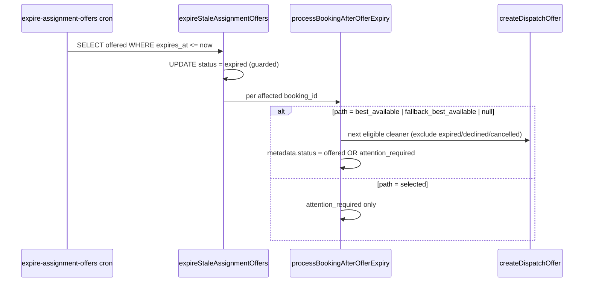
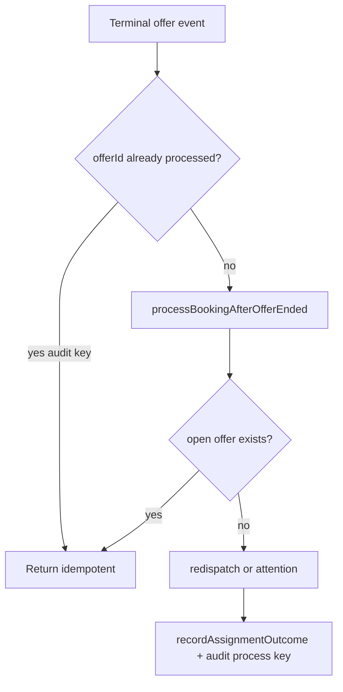

# Stage 3B-2 — Decline vs Expiry Redispatch Policy (design)

**Date:** 2026-05-17  
**Status:** Design only — **no implementation in this pass**  
**Depends on:** Stage 3A audit, Stage 3B-1 (post-payment assignment recovery) — **complete**  
**Inputs:** `docs/audits/stage-3a-assignment-dispatch-reliability-audit.md`, assignment engine code

---

## 1. Executive summary

Today, when a cleaner **declines** an offer, the booking is immediately marked `attention_required` and waits for admin. When an offer **expires** on a `best_available` booking, the hourly cron can **auto-redispatch** to the next eligible cleaner (up to five offers total). That asymmetry creates inconsistent ops load and customer experience: the same underlying event—“no cleaner accepted this offer”—is handled differently depending on whether the cleaner acted or time ran out.

**Recommendation:** Unify post-terminal-offer handling behind a single **path-aware redispatch orchestrator** shared by expiry cron and decline API. **`best_available`** and **`fallback_best_available`** should redispatch on **both** decline and expiry (same rules, same attempt cap, same exclusion set). **`selected`** should **not** auto-redispatch to a different cleaner on decline or expiry—admin attention only, preserving customer preference. Do not change accept semantics, payment finalize, earnings formulas, RLS, or team assignment.

**Safest first implementation slice (3B-2a):** Extract `processBookingAfterOfferEnded()` from expiry logic; call it from decline for `best_available` / `fallback_best_available` only; preserve `metadata.assignment.path` on decline; leave selected decline as admin escalation.

---

## 2. Current behavior

### 2.1 What happens when a cleaner declines an offer?

```mermaid
sequenceDiagram
  participant CL as Cleaner API
  participant CMD as executeBookingCommand
  participant DB as assignment_offers / bookings

  CL->>CMD: DECLINE_CLEANER_ASSIGNMENT
  CMD->>DB: offer.status = declined, responded_at set
  Note over DB: booking.status stays pending_assignment
  CL->>CMD: RECORD_ASSIGNMENT_ATTENTION
  Note over CMD: metadata.assignment.status = attention_required<br/>path = null (not preserved)
  Note over CMD: reason = "Cleaner declined offer; booking needs redispatch."
```

| Artifact | After decline |
|----------|----------------|
| `assignment_offers.status` | `declined` |
| `bookings.status` | `pending_assignment` (unchanged) |
| `bookings.cleaner_id` | `null` |
| `metadata.assignment` | `attention_required`, **`path: null`**, reason mentions decline |
| Redispatch | **None** |
| Notifications | None on decline (only on offer create / accept) |

**Code references:**

- Command: `DECLINE_CLEANER_ASSIGNMENT` in `executeBookingCommand.ts` (~348–382)
- API: `POST /api/cleaner/offers/[offerId]/decline` calls `recordAssignmentOutcome` after successful decline (`decline/route.ts` 65–72)
- Idempotency: `assignment:decline:${offerId}` on decline command

### 2.2 What happens when an offer expires?



| Artifact | After expiry (typical `best_available`) |
|----------|----------------------------------------|
| `assignment_offers.status` | `expired` |
| `bookings.status` | `pending_assignment` |
| `metadata.assignment.path` | Preserved from prior dispatch (`best_available`, etc.) |
| Redispatch | **Yes**, if path ∈ `{ best_available, fallback_best_available, null }`, attempts < 5, next cleaner exists |
| Excluded cleaners | Those with prior `expired`, `declined`, or `cancelled` offers on this booking |

**Code references:**

- `expireStaleAssignmentOffers.ts` → `processBookingAfterOfferExpiry.ts`
- `ASSIGNMENT_MAX_DISPATCH_ATTEMPTS_PER_BOOKING = 5` (`constants.ts`)
- `cleanersToExcludeFromRedispatch()` includes **declined** cleaners (already aligned for next pick)

### 2.3 How the system distinguishes selected vs best_available

| Mechanism | Source | Set when |
|-----------|--------|----------|
| Checkout lock | `booking_locks.locked_cleaner_preference` | Lock creation (`mode: selected \| best_available`, `selectedCleanerId`) |
| Assignment context | `loadAssignmentContext()` | Prefers lock; falls back to `bookings.metadata` |
| Dispatch path | `metadata.assignment.path` | Written by `recordAssignmentOutcome` on each dispatch / redispatch |

**Initial dispatch paths** (`runAssignmentAfterPayment.ts`):

| Customer preference | Eligibility | `metadata.assignment.path` | First offer target |
|--------------------|-------------|------------------------------|-------------------|
| Selected + eligible | Yes | `selected` | Selected cleaner |
| Selected + ineligible | Fallback exists | `fallback_best_available` (after attention note on selected) | Best eligible ≠ selected |
| Selected + ineligible | No fallback | `selected` | None — `attention_required` |
| Best available | — | `best_available` | Top ranked cleaner |

**Gap:** On decline, `recordAssignmentOutcome` passes **`path: null`**, erasing the path needed for expiry-style branching. Expiry cron relies on **last non-null path** in metadata; decline overwrites or fails to preserve path for any future unified handler.

---

## 3. Inconsistency analysis

| Dimension | Expiry (`best_available`) | Decline (all paths today) |
|-----------|---------------------------|---------------------------|
| Offer terminal state | `expired` | `declined` |
| Booking status | `pending_assignment` | `pending_assignment` |
| Auto-redispatch | Yes (within cap) | **No** |
| Admin queue | Only after max attempts / no cleaner | **Immediately** |
| `metadata.assignment.path` | Preserved | **Cleared (`null`)** |
| Exclusion of prior cleaner | Yes | N/A (no retry) |
| Customer-visible booking status | “Finding cleaner” (`pending_assignment`) | Same label, but ops treats as stuck |
| Time to next offer | Up to 1h (cron batch) + processing | Manual admin |

**User-visible inconsistency:** Customer still sees “Finding cleaner” in both cases, but admin sees “Needs assignment” immediately on decline while expiry may self-heal.

**Ops inconsistency:** Admins must manually redispatch declined `best_available` jobs that would have auto-recovered if the cleaner had simply ignored the offer for 48h.

**Data inconsistency:** Decline reasons and expiry reasons use different metadata strings; admin cannot distinguish “declined” vs “expired” without reading `assignment_offers` rows.

**Policy inconsistency:** `fallback_best_available` is redispatch-eligible on expiry but decline treats it like selected (immediate attention because path is wiped).

---

## 4. Design questions — answers

### 4.1 Should `best_available` decline auto-redispatch?

**Yes.** Treat decline as an immediate terminal-offer event equivalent to expiry for redispatch policy. Rationale:

- Same business meaning: offered cleaner unavailable.
- Exclusion set already includes `declined` in `cleanersToExcludeFromRedispatch`.
- Reduces admin load without weakening customer consent (still offer-based acceptance).
- Aligns with Stage 3A recommendation to defer decline auto-redispatch to this slice.

### 4.2 Should selected cleaner decline retry same cleaner, fallback, or admin attention?

**Admin attention only** — do **not** auto-offer another cleaner on selected decline or expiry.

| Option | Recommendation | Why |
|--------|----------------|-----|
| Retry same cleaner | **No** (auto) | Decline is explicit rejection; re-offering without admin/customer involvement is poor UX |
| Fallback to best_available | **No** (auto) | Customer chose a named cleaner; silent substitution violates preference |
| Admin attention | **Yes** | Admin can contact customer, re-offer same cleaner later, or manually override |

**Optional future enhancement (out of 3B-2 scope):** Admin UI action “Offer fallback cleaner” that records path transition explicitly—not silent auto-fallback.

### 4.3 How many redispatch attempts should be allowed?

**Keep existing cap: 5 total `assignment_offers` rows per booking** (`ASSIGNMENT_MAX_DISPATCH_ATTEMPTS_PER_BOOKING`), counting initial dispatch + all redispatches.

| Rule | Detail |
|------|--------|
| Counter | `offers.length` on booking (all statuses) |
| On cap | `attention_required` with reason mentioning max attempts |
| Per-cleaner | Partial unique index prevents duplicate `offered` to same cleaner |
| Decline + expiry | Share same counter |

Do not introduce a separate “decline retry” budget in 3B-2.

### 4.4 How should admin see decline vs expiry?

Extend **`metadata.assignment.reason`** (and optionally a new **non-breaking** field `lastOfferOutcome?: 'declined' | 'expired' | 'cancelled'`) for read models—**no new tables**.

| Admin display | Source |
|---------------|--------|
| “Offer declined — redispatching” | `lastOfferOutcome=declined` + `status=offered` after auto-redispatch |
| “Offer expired — redispatching” | `lastOfferOutcome=expired` + new offer open |
| “Needs assignment (selected)” | `path=selected` + `attention_required` |
| “Max dispatch attempts” | reason string + offer count |

Assignment queue already uses `assignmentReason`; enrich labels in `labelForAssignmentAttention` / queue item subtitle—read-only, no new mutation APIs in 3B-2.

### 4.5 How should customer status remain stable?

| Principle | Implementation |
|-----------|----------------|
| Booking status unchanged | Stay `pending_assignment` until accept |
| Customer label | Keep `labelForBookingStatus('pending_assignment')` → “Finding cleaner” |
| Attention badge | Show `attention_required` only when **no open offer** and not actively redispatching |
| Hide internal events | Do not expose “declined” or “expired” to customer |

**3B-2 adjustment:** After decline on `best_available`, briefly set metadata to `offered` again when redispatch succeeds—customer should not see “Needs assignment” during successful auto-redispatch.

### 4.6 How should earnings preview remain safe?

**No changes to earnings formulas or `resolveCleanerEarningsDisplay`.**

| Phase | Earnings behavior |
|-------|-------------------|
| Open offer | Preview from `metadata.quote.cleanerEarningsPreview` or computed preview (`teamSize` from quote; assignment context still `teamSize: 1` for dispatch) |
| Decline / expiry / redispatch | No `earning_lines`; preview on new offer uses same booking metadata |
| Accept | Unchanged (Phase 10 completion path) |

Redispatch does not mutate `price_cents` or quote metadata; preview stays stable across offers.

### 4.7 What idempotency keys are needed?

| Operation | Current key | 3B-2 change |
|-----------|-------------|-------------|
| `OFFER_TO_CLEANER` | `assignment:offer:{bookingId}:{cleanerId}` | **Keep** — one open offer per cleaner |
| `DECLINE_CLEANER_ASSIGNMENT` | `assignment:decline:{offerId}` | **Keep** |
| `RECORD_ASSIGNMENT_ATTENTION` | `assignment:meta:{bookingId}:{status}:{path}` | **Extend** — include `lastOfferOutcome` in key or use deterministic reason slug to allow metadata updates |
| Redispatch orchestrator | — | **New:** `assignment:redispatch:{bookingId}:{cleanerId}` OR reuse offer key (preferred: reuse `assignment:offer:…`) |
| Post-decline processing | — | **New:** `assignment:after-decline:{offerId}` on audit/command wrapper to prevent double redispatch if API retried |

**Recommendation:** Add service-level idempotency `assignment:process-terminal-offer:{offerId}` around the unified post-decline/expiry handler (audit row or in-memory guard), without new DB tables.

### 4.8 How to avoid duplicate open offers?

| Layer | Mechanism |
|-------|-----------|
| DB | Partial unique index `(booking_id, cleaner_id) WHERE status = 'offered'` |
| Orchestrator | `hasOpenOffer` check (`isOfferOpenForOps`) before redispatch — same as expiry |
| Engine | Single dispatch per orchestrator invocation |
| Accept path | `expireOtherOpenOffers` — unchanged |

**Do not** add global “one open offer per booking” constraint in 3B-2; rely on orchestrator discipline (matches Stage 3A).

---

## 5. Recommended policy

### 5.1 Unified orchestrator

Introduce **`processBookingAfterOfferEnded()`** (name TBD) as the single entry point after an offer becomes terminal (`declined`, `expired`, or `cancelled` sibling from accept):

```
Inputs: bookingId, terminalOfferId, terminalStatus, now
1. Load booking — require pending_assignment, no cleaner_id
2. If any open offer (isOfferOpenForOps) → return (no-op)
3. Read metadata.assignment.path (preserve; never null-out on decline)
4. If offers.length >= MAX_ATTEMPTS → attention_required, stop
5. Switch path:
   - selected → attention_required (reason distinguishes decline vs expiry)
   - best_available | fallback_best_available | null → pickBestEligibleCleanerIdExcluding → createDispatchOffer or attention
6. recordAssignmentOutcome with path preserved, lastOfferOutcome set
```

**Wire callers:**

| Caller | When |
|--------|------|
| `expireStaleAssignmentOffers` | After marking `expired` (replace direct `processBookingAfterOfferExpiry` call) |
| Decline API / command follow-up | After `DECLINE_CLEANER_ASSIGNMENT` succeeds (non-idempotent) |
| **Not wired** | Accept, payment, 3B-1 recovery |

Refactor `processBookingAfterOfferExpiry` → thin wrapper or alias to avoid behavioral drift.

### 5.2 Policy matrix (target state)

| `metadata.assignment.path` | Decline | Expiry |
|----------------------------|---------|--------|
| `best_available` | Auto-redispatch (exclude decliner) | Auto-redispatch (exclude expired cleaner) |
| `fallback_best_available` | Auto-redispatch | Auto-redispatch |
| `selected` | Admin attention | Admin attention |
| `null` (legacy) | Treat as `best_available` if preference in lock is best_available; else attention | Same as expiry today |

### 5.3 Metadata shape (optional extension)

```typescript
type AssignmentMetadata = {
  // existing fields…
  lastOfferOutcome?: "declined" | "expired" | "cancelled" | null;
};
```

Backward compatible: read models treat missing field as unknown.

---

## 6. Selected cleaner policy (detailed)

| Event | Booking status | Offer | Redispatch | Metadata |
|-------|----------------|-------|------------|----------|
| Selected cleaner declines | `pending_assignment` | `declined` | **No** | `attention_required`, `path: selected`, reason cites decline |
| Selected offer expires (48h) | `pending_assignment` | `expired` | **No** (already) | `attention_required`, reason cites expiry |
| Admin manual re-offer (future) | — | new `offered` | Via admin API (out of scope) | Admin sets path / cleaner explicitly |

**Customer communication (future):** Optional email “Your preferred cleaner isn’t available”—not in 3B-2.

---

## 7. Best_available policy (detailed)

| Event | Behavior |
|-------|----------|
| Decline | Immediate `processBookingAfterOfferEnded` → next cleaner if eligible |
| Expiry | Unchanged logic, shared function |
| Max attempts | `attention_required` — same message family as expiry |
| No eligible cleaner | `attention_required` — “no eligible cleaner for auto-redispatch” |
| Successful redispatch | `metadata.status = offered`, update `cleanerId` / `offerId`, path unchanged |

**Timing advantage:** Decline redispatch is **synchronous** on API path; expiry waits for hourly cron (acceptable; decline path improves latency).

---

## 8. Admin visibility

| Queue signal | Condition |
|--------------|-----------|
| Open offer | `isOfferOpenForOps` — working |
| Paid — dispatch not started | 3B-1 — unchanged |
| Needs assignment (selected) | `path=selected` + attention, no open offer |
| Offer declined (awaiting redispatch) | Transient: only if redispatch fails synchronously |
| Max attempts reached | offer count ≥ 5 |

**Suggested admin reason strings (structured prefix):**

- `decline:selected_requires_admin`
- `decline:redispatch_failed:{code}`
- `expiry:max_attempts`
- `expiry:no_eligible_cleaner`

Admin booking detail already lists offers with statuses—admins can see `declined` vs `expired` per row.

---

## 9. Idempotency strategy



| Retry scenario | Expected behavior |
|------------------|-------------------|
| Duplicate decline POST | `DECLINE` idempotent; process key prevents second redispatch |
| Cron expires + decline race | Status guards on offer row; `hasOpenOffer` prevents double dispatch |
| Same cleaner redispatch | `assignment:offer:{bookingId}:{cleanerId}` idempotent if still offered |

---

## 10. Implementation phases

| Phase | Scope | Risk |
|-------|--------|------|
| **3B-2a** | Extract `processBookingAfterOfferEnded` from expiry; wire decline API for `best_available` / `fallback` only; **preserve path** on decline metadata | Low |
| **3B-2b** | Add `lastOfferOutcome` metadata; admin/customer read-model labels | Low |
| **3B-2c** | Decline redispatch integration tests + concurrency tests | Medium |
| **3B-2d** (optional) | Admin filter “declined vs expired”; notification on selected decline | Medium |
| **Deferred** | Admin dispatch API, global one-offer constraint, team assignment | High |

**Explicitly out of scope:** Payment finalize, accept command, earnings RPC, RLS, eligibility ranking changes.

---

## 11. Test plan

| Test | Assert |
|------|--------|
| `best_available` decline → second offer | Booking `pending_assignment`, 2 offers, first `declined`, second `offered`, metadata `path=best_available` |
| Decline excludes decliner | Second offer `cleaner_id` ≠ first |
| Selected decline → no redispatch | One offer, `attention_required`, `path=selected` |
| Selected expiry → no redispatch | Unchanged `expireOffers.test` behavior |
| Decline at max attempts | No new offer; `attention_required` |
| Idempotent decline POST | Single redispatch |
| Expiry + decline shared logic | Mock terminal status both paths → same next cleaner pick |
| No duplicate open offers | Partial unique index + at most one `isOfferOpenForOps` |
| Customer read model | `pending_assignment` label; no decline-specific customer badge |
| Earnings preview on redispatched offer | Same preview cents as first offer (metadata unchanged) |

**Files to extend:**

- `assignmentEngine.test.ts`
- `expireOffers.test.ts`
- New `processBookingAfterOfferEnded.test.ts`
- `dashboardReadModels.test.ts` (admin labels)
- Decline API route test (mock orchestrator)

---

## 12. Risks and mitigations

| Risk | Mitigation |
|------|------------|
| Decline API latency increases | Redispatch is one eligibility query + one offer insert; acceptable; monitor p95 |
| Path lost on decline (`path: null` today) | 3B-2a must read path **before** overwrite; preserve from metadata or lock |
| `attention_required` blocks `runAssignmentAfterPayment` retry | Orchestrator sets `offered` on success; only set attention when redispatch impossible |
| Race: cron expires while decline in flight | Offer row status guards; `hasOpenOffer` check |
| Customer sees “Needs assignment” flash | Only set `attention_required` when not redispatching |
| Metadata idempotency key blocks updates | Adjust `RECORD_ASSIGNMENT_ATTENTION` key to include `lastOfferOutcome` or use new audit command |
| Fallback path treated as selected | Explicit branch: `fallback_best_available` ∈ redispatch paths |

---

## 13. Final recommendation

Adopt a **single path-aware orchestrator** for all terminal offers, with **symmetric redispatch rules** for decline and expiry on `best_available` and `fallback_best_available`, and **symmetric admin escalation** for `selected`. Preserve assignment path on decline, add optional `lastOfferOutcome` for ops clarity, keep five-attempt cap and existing offer idempotency keys, and leave customer booking status as `pending_assignment` / “Finding cleaner” until assignment succeeds.

---

## 14. Safest implementation slice for Stage 3B-2

**Ship 3B-2a only:**

1. **Refactor** `processBookingAfterOfferExpiry` → shared `processBookingAfterOfferEnded(bookingId, { trigger: 'expired' \| 'declined', offerId })` without changing selected/expiry behavior.
2. **Wire** decline route to call orchestrator **only when** `metadata.assignment.path` (or lock preference) is `best_available` or `fallback_best_available`.
3. **Fix** decline metadata to **preserve `path`** and set reason `decline:…` instead of wiping path to `null`.
4. **Tests:** best_available decline redispatches; selected decline does not; expiry tests still pass.

Defer admin label polish (`lastOfferOutcome`), customer copy, and notifications to 3B-2b.

---

## Related

- [assignment-engine.md](../assignments/assignment-engine.md)
- [stage-3a-assignment-dispatch-reliability-audit.md](../audits/stage-3a-assignment-dispatch-reliability-audit.md)
- [assignment-recovery.md](../operations/assignment-recovery.md)
- [expire-assignment-offers-cron.md](../operations/expire-assignment-offers-cron.md)
