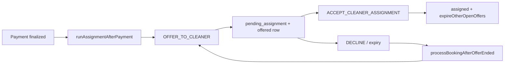
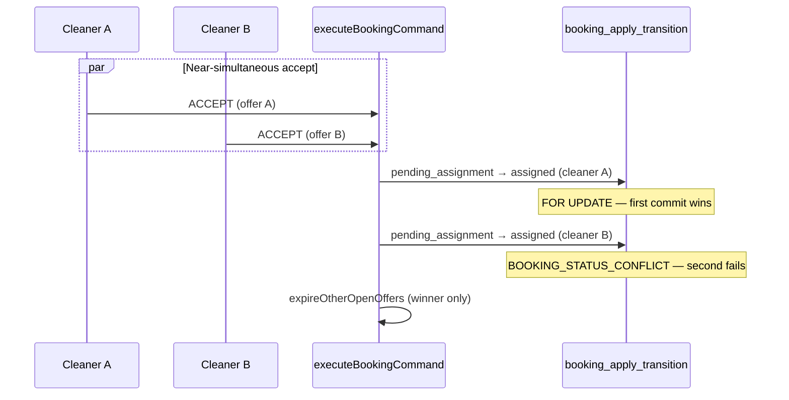

# Stage 3C — Offer Race & Global Duplicate Protection (design)

**Date:** 2026-05-17  
**Status:** Design only — **no implementation in this pass**  
**Depends on:** Stage 3A audit, Stage 3B (recovery, decline redispatch, visibility) — **complete**  
**Inputs:** `docs/audits/stage-3a-assignment-dispatch-reliability-audit.md`, `docs/audits/stage-3b-assignment-recovery-redispatch-final-audit.md`, assignment command/orchestrator code

**Guardrails (unchanged):** Do not modify accept semantics, earnings, RLS, or implement team assignment in this slice.

---

## 1. Executive summary

Stage 3B closed several assignment reliability gaps (post-payment recovery, unified decline/expiry redispatch, visibility) but **did not** close the pre-existing race where **more than one cleaner can hold an open (`offered`) row for the same booking**. The database enforces at most one open offer **per (booking, cleaner)**; orchestrators use a **best-effort** `hasOpenOffer` check; **`OFFER_TO_CLEANER` does not reject** a second open offer to a different cleaner.

**Recommendation:** For current single-cleaner dispatch (`teamSize` effectively 1), add a **partial unique index** on `assignment_offers (booking_id) WHERE status = 'offered'`, preceded by a **backfill** that resolves any existing duplicates. Keep application guards as **defense in depth** (orchestrator + command pre-insert). Defer parallel multi-offer semantics to a future **team assignment** stage with an explicit slot model.

**Safest first implementation slice (3C-a):** Migration backfill + partial unique index only, plus a **pre-insert guard** in `OFFER_TO_CLEANER` (no accept/RLS/earnings changes). Align `runAssignmentAfterPayment` open-offer detection with `isOfferOpenForOps` in the same PR if low risk.

---

## 2. Current state

### 2.1 Where assignment offers are created

All production offer rows flow through **`createDispatchOffer`** → **`executeBookingCommand` / `OFFER_TO_CLEANER`** → **`backend.insertOffer`**.

| Call site | Trigger | Notes |
|-----------|---------|--------|
| `runAssignmentAfterPayment` → `dispatchOffer` | Post-payment finalize, recovery cron/script | Initial dispatch after `MOVE_TO_PENDING_ASSIGNMENT` |
| `processBookingAfterOfferEnded` → `createDispatchOffer` | Decline follow-up, offer expiry cron | Auto-redispatch for `best_available` / `fallback_best_available` |
| Tests / E2E repair | Manual | Same command path |

There is **no** admin “offer to cleaner” API yet (Stage 3A R6); future admin dispatch would use the same command and inherit whatever constraints exist at that time.

**Idempotency key on create:** `assignment:offer:{bookingId}:{cleanerId}` — dedupes **retries to the same cleaner**, not cross-cleaner offers.

### 2.2 What statuses count as “open”

| Layer | Definition | Includes past `expires_at`? |
|-------|------------|----------------------------|
| **DB partial unique index** | `status = 'offered'` only | **Yes** — stale rows block a second `offered` insert until expired/cancelled |
| **`isOfferOpenForOps`** (orchestrator, admin queue, recovery candidate) | `offered` **and** `expires_at` not in the past | **No** |
| **`runAssignmentAfterPayment` short-circuit** | `status === 'offered'` (any expiry) | **Yes** — **inconsistent** with ops/read models |
| **Accept / decline commands** | `status === 'offered'` + `isOfferExpired()` hard reject | **No** (actionable offers only) |
| **Cleaner offer list API** | `offered` + not past expiry (soft hide) | **No** |

Terminal offer statuses (not open): `accepted`, `declined`, `expired`, `cancelled`.

**Implication:** A row can be `offered` in DB but “not open” for ops/UI after TTL. Cron (`expireStaleAssignmentOffers`) eventually sets `expired`. Until then, a **global** unique on `offered` would still treat it as blocking — which is **desirable** for duplicate protection (only one `offered` row per booking at a time).

### 2.3 Database constraints today

From `20260515201500_core_foundation.sql` + `20260516200000_assignment_offer_integrity.sql`:

| Constraint / index | Scope | Effect |
|--------------------|-------|--------|
| `assignment_offers_pkey` | `id` | Row identity |
| FK `booking_id`, `cleaner_id` | Referential | CASCADE on booking/cleaner delete |
| `idx_assignment_offers_booking_cleaner` | `(booking_id, cleaner_id)` | Lookup only, **not unique** |
| **`idx_assignment_offers_one_open_per_cleaner`** | `(booking_id, cleaner_id) WHERE status = 'offered'` | **Partial unique** — one open offer per cleaner per booking |
| `idx_assignment_offers_offered_expires` | `(expires_at) WHERE status = 'offered'` | Cron batch selection |

**Missing:** `UNIQUE (booking_id) WHERE status = 'offered'` (global one-open-offer-per-booking).

### 2.4 Application guards today

| Guard | Location | Prevents |
|-------|----------|----------|
| Per-cleaner offer idempotency | `OFFER_TO_CLEANER` — existing `offered` / `accepted` for **same** `cleaner_id` | Duplicate offer to same cleaner |
| `hasOpenOffer` | `processBookingAfterOfferEnded` | Redispatch while **ops-open** offer exists |
| Open-offer short-circuit | `runAssignmentAfterPayment` | Re-dispatch while **any** `offered` row exists |
| `isAssignmentRecoveryCandidate` | Recovery sweeper | Recovery when ops-open or accepted offer exists |
| `expireOtherOpenOffers` | `ACCEPT_CLEANER_ASSIGNMENT` (after successful transition) | Sibling `offered` → `cancelled` **after** first accept wins |
| `booking_apply_transition` | `FOR UPDATE` + `expected_from` | Second accept cannot move `pending_assignment` → `assigned` |
| Max 5 offer rows | `processBookingAfterOfferEnded` | Unbounded redispatch |

**Not guarded:** `OFFER_TO_CLEANER` when another cleaner already has `status = 'offered'` for the same booking.

### 2.5 Assignment lifecycle (relevant slice)



---

## 3. Race analysis

### 3.1 Can two cleaners receive open offers for one booking?

**Yes, under concurrency today** (Stage 3A scenario **R6**). The command only inspects offers for **`cmd.cleanerId`**:

```293:321:src/features/bookings/server/commands/executeBookingCommand.ts
    case "OFFER_TO_CLEANER": {
      // ...
      const existingOffers = await backend.listOffersForBooking(booking.id);
      for (const existing of existingOffers) {
        if (existing.cleaner_id !== cmd.cleanerId) continue;
        // idempotent / expire only for SAME cleaner
      }
      // insert new offer — no check for other cleaners' offered rows
```

**How it could happen (theoretical but valid):**

| # | Scenario | Mechanism |
|---|----------|-----------|
| T1 | Overlapping redispatch paths | Decline follow-up and expiry cron both pass `hasOpenOffer` before either inserts; or recovery + redispatch overlap |
| T2 | TOCTOU on `hasOpenOffer` | `processBookingAfterOfferEnded` lists offers, sees none ops-open, two workers proceed |
| T3 | Direct double `OFFER_TO_CLEANER` | Future admin API or bug calling `createDispatchOffer` twice with different `cleanerId` without orchestrator |
| T4 | Partial failure between paths | Unlikely to create two offers alone, but combined with T1/T2 increases risk |

Orchestrator discipline **reduces** frequency; it does **not** eliminate cross-cleaner duplicates under parallel execution.

### 3.2 What happens if two cleaners accept near-simultaneously?

**Booking assignment is serialized; offer cleanup is not transactional with accept.**



| Step | Cleaner A (wins) | Cleaner B (loses) |
|------|------------------|-------------------|
| Offer row | `accepted` | Stays `offered` until winner’s `expireOtherOpenOffers` → `cancelled` |
| Booking | `assigned`, `cleaner_id = A` | Unchanged / conflict on transition |
| Customer impact | Correct assignment | Sees failure; may have briefly seen two open offers |
| Earnings | Unaffected by race (assigned cleaner drives ledger) | N/A |

**Risk if two open offers existed:** UX confusion, spurious push notifications, admin queue showing two open offers, and **unnecessary** accept attempts. **Not** double assignment if RPC path is used (current production path).

**Residual gap:** Loser’s offer may remain `offered` if winner’s `updateOffer` / `expireOtherOpenOffers` fails after RPC succeeds (Stage 3A **R5** — re-accept idempotent if booking already assigned).

### 3.3 Other races (unchanged by 3B)

| ID | Scenario | Severity | 3C impact |
|----|----------|----------|-----------|
| R2 | Cron expires while accept in flight | Medium | Unchanged; row-level `status = offered` guards |
| R3 | Redispatch vs open offer | Medium | Global unique + `hasOpenOffer` strengthens |
| R5 | Accept RPC ok, offer update fails | Medium | Out of 3C scope (3B-3 transactional accept) |
| Stale `offered` | Past `expires_at`, still `offered` in DB | Low–Medium | Global unique blocks new offer until cron expires; align `runAssignmentAfterPayment` with `isOfferOpenForOps` |

---

## 4. Design questions (answers)

### 4.1 Should the system allow parallel offers in future team assignment?

**Yes, eventually** — for `teamSize > 1`, the product will need **N concurrent open offers** (or N sequential offers with explicit slots), not a single global `offered` row.

Today:

- Dispatch hardcodes `teamSize: 1` in `assignmentContext.ts`.
- Quotes may carry `teamSize > 1` for pricing/preview only (Stage 3A §10).

**Do not** design 3C around parallel offers; design it so a **future migration can replace** the global unique with a **slot-aware** partial unique (e.g. `(booking_id, team_slot)` or `(booking_id, cleaner_id)` with multiple slots).

### 4.2 Should single-cleaner bookings enforce one open offer globally?

**Yes.** That matches current engine behavior (one cleaner dispatched at a time), admin mental model, and customer expectation for MVP assignment.

Enforcement layers:

1. **Database** — partial unique on `booking_id` where `status = 'offered'` (authoritative).
2. **Command** — pre-insert check for any `offered` row on booking (fast fail, clearer than unique violation).
3. **Orchestrator** — retain `hasOpenOffer` (handles ops-open vs stale rows when aligned).

### 4.3 How should team bookings be handled later?

| Approach | Pros | Cons |
|----------|------|------|
| **A. Slot column** `team_slot smallint` + unique `(booking_id, team_slot) WHERE status = 'offered'` | Clear N-open model | Schema + command changes |
| **B. Keep per-cleaner unique only** + app dispatches N times without global unique | Flexible | Race returns without careful orchestration |
| **C. Single “team offer” row** + join table | Normalized team state | Larger refactor |

**Recommendation for future team stage:** **A** — add `team_slot` (1..`teamSize`) when implementing team dispatch; drop global `(booking_id)` unique; keep per-cleaner unique as secondary guard.

3C should document this so the partial unique index is **dropped/replaced** in team work, not painted into a corner.

---

## 5. Recommended constraint strategy

### 5.1 Primary: partial unique index (single-cleaner era)

```sql
create unique index if not exists idx_assignment_offers_one_open_per_booking
  on public.assignment_offers (booking_id)
  where status = 'offered';
```

**Properties:**

- At most **one** row per booking in `offered` at any time.
- Coexists with existing `idx_assignment_offers_one_open_per_cleaner` (redundant but harmless; keep for clarity and team-era evolution).
- Stale `offered` past `expires_at` still counts until cron sets `expired` — prevents overlapping “zombie + new” offers.

**Error surface:** `insert` raises unique violation → map in app to `OFFER_ALREADY_OPEN` or idempotent no-op when same cleaner retry (already handled before insert).

### 5.2 Secondary: command-layer pre-check

In `OFFER_TO_CLEANER`, before `insertOffer`:

1. `listOffersForBooking(booking.id)`.
2. If any row has `status === 'offered'`:
   - If same `cleaner_id` → existing idempotent path.
   - If different `cleaner_id` → `fail('OPEN_OFFER_EXISTS', ...)` **or** treat as idempotent skip when orchestrator expects no-op (prefer **fail** for admin/debuggability; orchestrator should not call in that state).

Optional: auto-expire same-cleaner stale `offered` (already done) — do **not** auto-cancel another cleaner’s open offer in 3C (orchestrator should not create that situation; accept path already cancels siblings).

### 5.3 What not to do in 3C

| Out of scope | Reason |
|--------------|--------|
| Change `ACCEPT_CLEANER_ASSIGNMENT` flow | User guardrail |
| Transactional accept RPC | Stage 3B-3 / later |
| RLS policy changes | User guardrail |
| Earnings / preview changes | User guardrail |
| Team dispatch implementation | User guardrail |
| `SELECT … FOR UPDATE` on offers table | Heavier; DB unique sufficient for create race |

---

## 6. Migration plan

### 6.1 Pre-migration audit (run in staging/production read-only)

```sql
select booking_id, count(*) as open_count
from public.assignment_offers
where status = 'offered'
group by booking_id
having count(*) > 1;
```

Also list `pending_assignment` bookings with multiple `offered` rows for ops review.

### 6.2 Backfill policy (before `CREATE UNIQUE INDEX`)

For each `booking_id` with `open_count > 1`:

| Situation | Action |
|-----------|--------|
| Booking already `assigned` / has `cleaner_id` | Set extra `offered` → `cancelled` (or `expired` if past TTL); keep row matching assigned cleaner if `accepted` exists |
| `pending_assignment`, multiple `offered` | **Keep** the row with latest `offered_at` (or latest `created_at`); set others → `cancelled` with `responded_at = now()` |
| All past `expires_at` | Prefer keeping newest; expire others via same update as cron |

**Do not delete rows** — append-only style history for offers; status transitions only.

Script location suggestion: `supabase/migrations/20260517xxxxxx_backfill_duplicate_open_offers.sql` (data fix) immediately before index migration in same release train, or single migration with `DO $$ … $$` block.

### 6.3 Migration file order

1. **Backfill** duplicate open offers (idempotent updates).
2. **`CREATE UNIQUE INDEX CONCURRENTLY`** if large table (Supabase: use concurrent-friendly pattern per platform docs); else standard `create unique index` in transaction for small envs.
3. **No enum / RLS changes.**

### 6.4 Rollback

| Action | Effect |
|--------|--------|
| Drop index `idx_assignment_offers_one_open_per_booking` | Removes DB enforcement; app guards remain |
| Revert app pre-check | Orchestrator-only protection (weaker) |

Backfilled rows need not be reverted — cancelled duplicates are valid history.

### 6.5 Deployment sequence

1. Deploy migration (backfill + index).
2. Deploy app with pre-insert guard (handles friendly errors).
3. Monitor for `OPEN_OFFER_EXISTS` / unique violations in logs.
4. Run existing test suites + new 3C tests.

---

## 7. App guard plan

| Guard | Action in 3C | Owner |
|-------|----------------|-------|
| `hasOpenOffer` in `processBookingAfterOfferEnded` | **Keep** — use `isOfferOpenForOps` (already does) | Orchestrator |
| `runAssignmentAfterPayment` open offer check | **Align** to `isOfferOpenForOps` (fix stale-`offered` false block) | 3C-a or 3C-b |
| `OFFER_TO_CLEANER` pre-insert | **Add** — any `offered` row for booking blocks different cleaner | 3C-a |
| `expireOtherOpenOffers` on accept | **Keep** — no semantic change | Accept path |
| `createDispatchOffer` idempotency key | **Keep** | Dispatch |
| Recovery candidate | Already uses `isOfferOpenForOps` | No change |

**On unique violation from insert:** Catch Postgres `23505`, map to `PERSISTENCE_ERROR` or dedicated `OPEN_OFFER_EXISTS`; orchestrator treats as no redispatch / attention if unexpected.

---

## 8. Tests required

| Test | Type | Asserts |
|------|------|---------|
| Second `OFFER_TO_CLEANER` to different cleaner while first `offered` | Unit (`executeBookingCommand` + in-memory backend) | Second call fails or no-ops per policy; only one `offered` row |
| Concurrent dual insert simulation | Unit / integration | One succeeds, one gets unique violation or pre-check fail |
| `processBookingAfterOfferEnded` with ops-open offer | Unit (exists) | No duplicate — extend if needed for cross-cleaner fixture |
| `runAssignmentAfterPayment` with stale `offered` (past expiry) | Unit | Does not treat as blocking once aligned to `isOfferOpenForOps` |
| Migration backfill fixture | SQL test or integration | After backfill, `HAVING count(*) > 1` returns zero |
| Accept with two offers (setup pre-constraint violation) | Integration | Only one assigned; siblings `cancelled` after accept — **no change** to accept expectations |
| Regression: per-cleaner idempotent re-offer | Unit | Same cleaner retry still idempotent |
| Regression: decline → redispatch chain | Existing `processBookingAfterOfferEnded.test.ts` | Still single open offer after redispatch |

**Explicitly defer:** load test / true parallel accept from two HTTP clients (optional 3C-c); transactional accept RPC tests (3B-3).

---

## 9. Risks and mitigations

| Risk | Likelihood | Impact | Mitigation |
|------|------------|--------|------------|
| Backfill picks “wrong” keeper offer | Low | Medium | Prefer latest `offered_at`; ops audit query pre-migration |
| Index creation locks table (non-concurrent) | Env-dependent | Medium | Use `CONCURRENTLY` on production-sized data |
| Stale `offered` blocks redispatch until cron | Known | Low | Cron already runs; optional command auto-expire before insert (same cleaner only, already partial) |
| Team assignment needs multiple open offers | Future | High if forgotten | Document index removal + slot model in team stage |
| Unique violation during legitimate retry | Low | Low | Map to idempotent path when same cleaner; orchestrator serializes redispatch |
| `runAssignmentAfterPayment` vs `hasOpenOffer` mismatch | Medium (today) | Medium | Align to `isOfferOpenForOps` in 3C |
| Admin manual double dispatch (future) | Medium | High without index | Index is authoritative when API ships |

---

## 10. Final recommendation

| Decision | Choice |
|----------|--------|
| Global one-open-offer for MVP | **Yes** — partial unique on `(booking_id) WHERE status = 'offered'` |
| Parallel offers for team | **Defer** — replace constraint in team stage with slot-based model |
| Accept semantics | **No change** in 3C |
| RLS / earnings | **No change** |
| Authority order | **DB unique > command pre-check > orchestrator `hasOpenOffer`** |

Stage 3B remains safe to operate; 3C closes the **creation-side** race that enables confusing multi-cleaner open offers and unnecessary concurrent accept attempts. Accept-side booking serialization already prevents double assignment.

---

## 11. Safest first implementation slice for Stage 3C

### Ship **3C-a** (minimal, highest leverage)

1. **Migration:** idempotent backfill + `idx_assignment_offers_one_open_per_booking`.
2. **Command:** `OFFER_TO_CLEANER` pre-insert guard — reject (or idempotent skip per policy) when another cleaner has `status = 'offered'` on the booking.
3. **Tests:** duplicate cross-cleaner offer prevented; migration/backfill sanity.
4. **Ops:** run pre-migration audit query; note in runbook.

**Optional same PR (low risk):** Align `runAssignmentAfterPayment` open-offer detection with `isOfferOpenForOps`.

### Defer to **3C-b**

- Admin dispatch API (depends on constraint anyway).
- Integration test with two real HTTP accept clients.
- Command auto-expire stale `offered` before new insert (cron path sufficient for MVP).

### Defer to **team assignment stage**

- Drop/replace global unique with `(booking_id, team_slot)` partial unique.
- Parallel `createDispatchOffer` orchestration for `teamSize > 1`.

---

## 12. References

| Doc / code | Relevance |
|------------|-----------|
| `docs/audits/stage-3b-assignment-recovery-redispatch-final-audit.md` | Confirms global gap (checklist #8) |
| `docs/audits/stage-3a-assignment-dispatch-reliability-audit.md` | R6, R1, 3B-5 pointer |
| `supabase/migrations/20260516200000_assignment_offer_integrity.sql` | Current partial unique |
| `src/features/assignments/server/processBookingAfterOfferEnded.ts` | `hasOpenOffer` |
| `src/features/bookings/server/commands/executeBookingCommand.ts` | `OFFER_TO_CLEANER`, `expireOtherOpenOffers` |
| `src/features/assignments/server/buildOfferExpiry.ts` | `isOfferOpenForOps` |
