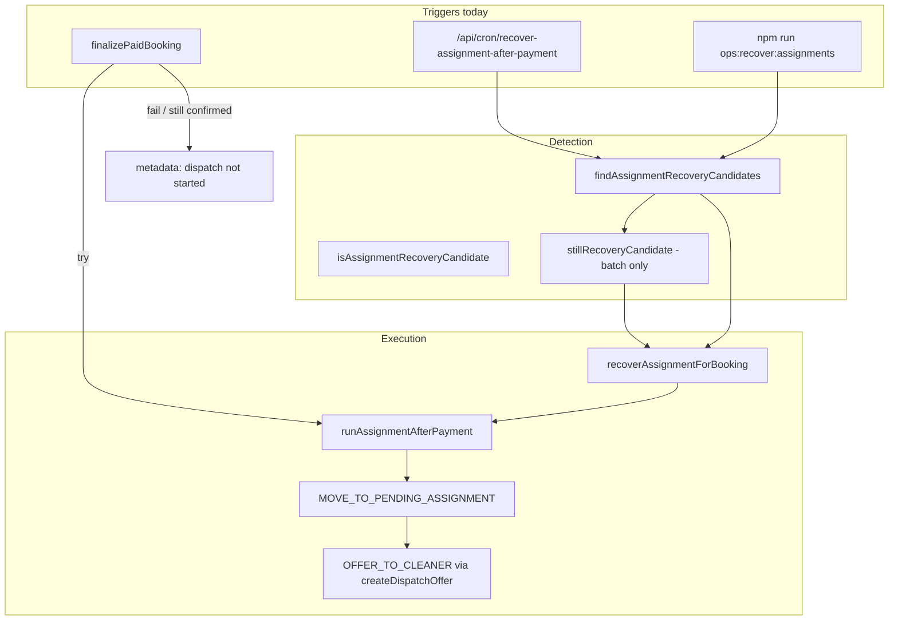

# Stage 4B-2 — Single-Booking Assignment Recovery Design

**Date:** 2026-05-17  
**Type:** Design only — no implementation  
**Depends on:** Stage 3B-1 (recovery cron/script), Stage 4B-1 (operational panel + eligibility display)

**Related:** [assignment-recovery.md](../operations/assignment-recovery.md), [admin-operational-dashboard.md](../operations/admin-operational-dashboard.md), [stage-4a-admin-dispatch-operational-control-audit.md](../audits/stage-4a-admin-dispatch-operational-control-audit.md)

---

## Executive summary

| Question | Answer |
|----------|--------|
| Safe to implement now? | **Yes**, as a narrow admin mutation behind the same eligibility rules as cron |
| Smallest safe slice | One POST route + server orchestrator + booking-detail button (grace enforced, no cleaner pick) |
| Call `runAssignmentAfterPayment` directly? | **No** — call existing `recoverAssignmentForBooking` (thin wrapper today) inside a new **admin orchestrator** that adds eligibility + logging |
| Expose override / manual dispatch? | **No** — out of scope |

---

## Current recovery architecture



| Component | Role |
|-----------|------|
| `isAssignmentRecoveryCandidate` | Pure eligibility (confirmed + paid + past grace + no cleaner + no open/accepted offers) |
| `findAssignmentRecoveryCandidates` | Batch scan for cron/script (paid payments older than grace, cap 50) |
| `stillRecoveryCandidate` | Re-check immediately before batch attempt (race-safe) |
| `recoverAssignmentForBooking` | **Single-booking entry** — delegates to `runAssignmentAfterPayment` |
| `runAssignmentAfterPayment` | Idempotent engine: move to `pending_assignment`, dispatch per preference path |
| `createDispatchOffer` | `OFFER_TO_CLEANER` with service actor + per-cleaner idempotency key |

**Important:** Batch recovery treats success as “booking left `confirmed`”. If engine returns `ok: true` but status stays `confirmed`, batch records `STILL_CONFIRMED` failure.

---

## Design audit answers

### 1. Which bookings are eligible?

**In scope (same as cron O1)** — all must hold at request time:

| Rule | Check |
|------|--------|
| Booking status | `confirmed` only |
| Payment | ≥1 `payments.status = paid` for this booking |
| Grace | Paid at (`payments.updated_at` or `created_at`) ≥ `ASSIGNMENT_RECOVERY_GRACE_MINUTES` ago (default 3) |
| Cleaner | `bookings.cleaner_id` is null |
| Offers | No open offer (`isOfferOpenForOps`); no `accepted` offer |

**Explicitly out of scope for this action**

| State | Why |
|-------|-----|
| `payment_failed`, `draft`, `pending_payment` | Not paid — engine must not run |
| `pending_assignment` + open offer | Dispatch in progress — cron skips |
| `pending_assignment` + `attention_required` + no open offer | Engine **short-circuits** (no retry) — needs **manual dispatch** (4B-3), not recovery |
| `assigned`, `in_progress`, `completed`, … | Already past dispatch |
| `cancelled` | Terminal |
| Display-only “dispatch not started” on non-`confirmed` rows | 4B-1 visibility can be broader than eligibility — **button must use `isAssignmentRecoveryCandidate`, not badge alone** |

**Grace period:** Enforce same grace as cron in v1. Button disabled with “wait N minutes” (4B-1 panel already shows `grace_period`). Do **not** add admin grace bypass in the smallest slice.

---

### 2. Which existing helper/service should be reused?

| Layer | Reuse |
|-------|--------|
| Eligibility | `isAssignmentRecoveryCandidate` (+ load booking, payments, offers same as `stillRecoveryCandidate`) |
| Execution | `recoverAssignmentForBooking` → `runAssignmentAfterPayment` |
| Backend | `createBookingCommandBackend()` (service role, same as payout admin actions and cron) |
| DB reads | `createServiceRoleClient()` or shared client passed to `listOffersForBooking` |
| Admin auth | `requireApiUser(["admin"])` (align with GET `/api/admin/*`) or `getCurrentUser` + role check (align with payout POST) — **pick one pattern; recommend `requireApiUser`** |
| 4B-1 UI | `computeRecoveryEligibility` / operational panel to gate button |

**New (thin) module proposed:** `runAdminSingleBookingAssignmentRecovery` in `src/features/assignments/server/runAssignmentRecovery.ts` (or `adminAssignmentRecovery.ts`) — orchestration only, no engine fork.

---

### 3. `runAssignmentAfterPayment` directly or a wrapper?

**Use the existing wrapper** `recoverAssignmentForBooking(client, backend, bookingId)`.

| Approach | Verdict |
|----------|---------|
| Call `runAssignmentAfterPayment` directly from route | Duplicates batch naming; skip |
| Call `recoverAssignmentForBooking` | **Yes** — single canonical “retry post-payment dispatch” entry |
| Call `runAssignmentRecoveryBatch` for one id | Wrong abstraction; skips per-booking re-check design |

Admin orchestrator wraps:

1. AuthZ admin  
2. Load booking + payments + offers  
3. `assertRecoveryEligible(...)` (same rules as `isAssignmentRecoveryCandidate`)  
4. `recoverAssignmentForBooking(...)`  
5. Classify result (`recovered` / `still_confirmed` / `engine_error` / `skipped`)  
6. Log + return API DTO  

Do **not** change `runAssignmentAfterPayment` behavior in 4B-2.

---

### 4. Admin role checks

| Check | Where |
|-------|--------|
| Authenticated session | `requireApiUser(["admin"])` |
| Role | `user.role === "admin"` (403 if not) |
| Booking exists | 404 if missing |
| Not customer/cleaner scoped | Admin may act on any booking id (RLS not relied on for mutation — service role backend) |

No cron secret on this route. No impersonation of cleaner/customer.

---

### 5. Audit / reason strategy

**Requirement:** Mandatory admin **reason** (non-empty string, e.g. min 10–20 chars) in request body — stored in ops log, not in customer-visible copy.

| Mechanism | Use in 4B-2 |
|-----------|-------------|
| `booking_state_audit` new command | Optional follow-up — `command` column is free text, but insert should go through command layer |
| `RECORD_ASSIGNMENT_ATTENTION` before recovery | **Do not** — can set `attention_required` and block engine |
| Engine audits (`MOVE_TO_PENDING_ASSIGNMENT`, `OFFER_TO_CLEANER`) | Automatic; remain `service` actor — acceptable |
| Structured ops log | **Yes (primary)** — `admin_assignment_recovery` JSON event |

**Recommended log payload**

```json
{
  "event": "admin_assignment_recovery",
  "at": "ISO-8601",
  "bookingId": "uuid",
  "adminProfileId": "uuid",
  "reason": "human text",
  "eligible": true,
  "result": {
    "ok": true,
    "outcome": "offered",
    "bookingStatus": "pending_assignment",
    "idempotent": false
  }
}
```

**Optional 4B-2b:** `RECORD_ASSIGNMENT_ATTENTION` **after** success/failure with metadata field `adminRecovery: { profileId, reason, at, outcome }` merged without changing eligibility-blocking `status` — only if metadata schema extended carefully. Not required for smallest slice.

**Do not** use `ADMIN_OVERRIDE_STATUS`.

---

### 6. Preventing duplicate offers

Existing safeguards (no new logic required):

| Layer | Behavior |
|-------|----------|
| `runAssignmentAfterPayment` | If `pending_assignment` + open offer → idempotent return `offered` (no second offer) |
| `createDispatchOffer` | Idempotency key `assignment:offer:{bookingId}:{cleanerId}` |
| DB | Partial unique index `idx_assignment_offers_one_open_per_booking` → `OPEN_OFFER_EXISTS` |
| Eligibility gate | No recovery when open offer exists |

**Admin action:** If admin clicks while eligible but race adds open offer before execution, engine returns idempotent `offered` — treat as **success (no-op)** in UI, not error.

**Re-click after success:** Booking no longer `confirmed` → `NOT_ELIGIBLE` — safe.

---

### 7. Selected cleaner vs `best_available`

**No admin choice.** Recovery reuses `runAssignmentAfterPayment` → `loadAssignmentContext` → existing preference logic:

| Preference | Engine behavior (unchanged) |
|------------|----------------------------|
| `selected` + eligible | Offer to selected cleaner |
| `selected` + ineligible | Fallback to `fallback_best_available` or `attention_required` |
| `best_available` | `pickBestEligibleCleanerId` |

Admin recovery **must not** add cleaner id parameter or bypass selected-cleaner policy. Selected decline / max-attempts cases are **not** recovery candidates while `confirmed`; if stuck on `pending_assignment`, route to 4B-3 manual dispatch, not this button.

---

### 8. Admin UI response

**After POST + `router.refresh()` on booking detail:**

| Result | UI copy (example) |
|--------|-------------------|
| Dispatched new offer | “Recovery succeeded — offer sent to [cleaner label].” + link to offers section |
| Idempotent offer exists | “Offer already open — no change needed.” |
| `attention_required` | “Recovery ran but no eligible cleaner — booking flagged for admin review.” |
| `already_assigned` | “Booking already assigned — no recovery needed.” |
| Not eligible | Inline error from API `message` (no toast with stack traces) |
| Grace period | Button disabled; panel shows wait time (no POST) |
| `STILL_CONFIRMED` | “Recovery ran but booking is still payment-confirmed — check assignment context or runbook.” |

Show structured fields from API: `outcome`, `bookingStatus`, `offerId` (short id), `idempotent`, `skipped`.

**Do not** expose internal Paystack refs or service role errors to customer routes (admin-only endpoint).

---

### 9. Error taxonomy (safe messages)

| Code | HTTP | Admin message | Customer impact |
|------|------|---------------|-----------------|
| `UNAUTHORIZED` | 401 | Sign in required | None |
| `FORBIDDEN` | 403 | Admins only | None |
| `NOT_FOUND` | 404 | Booking not found | None |
| `NOT_ELIGIBLE` | 409 | Booking is not eligible for recovery (current status: …) | None |
| `GRACE_PERIOD` | 409 | Wait N minutes after payment before recovery | None |
| `NO_PAID_PAYMENT` | 409 | No paid payment on this booking | None |
| `STILL_CONFIRMED` | 422 | Recovery completed but dispatch did not progress | None |
| `ENGINE_ERROR` | 422 | Assignment engine failed: [code] | None — booking unchanged re payment |
| `ASSIGNMENT_CONTEXT_MISSING` | 422 | Missing assignment context (lock/metadata) | None |
| `OPEN_OFFER_EXISTS` | 200 idempotent | Treated as success path if engine returns offered | None |
| `PERSISTENCE_ERROR` | 500 | Temporary error — retry or use cron | None |

**Customer-safe:** Endpoint is admin-authenticated; error bodies never returned on customer APIs. Failed recovery does not change payment row or booking to unpaid.

**Admin-safe:** No raw SQL, webhook payloads, or secrets in responses.

---

### 10. Avoiding payment status bypass

| Guard | Implementation |
|-------|----------------|
| Eligibility | `isAssignmentRecoveryCandidate` requires `paid` payment |
| Engine | `ensurePendingAssignment` only from `confirmed`; rejects `payment_failed` / `pending_payment` with `INVALID_STATE` |
| No finalize command | Route must not call `FINALIZE_PAYMENT_SUCCESS` |
| No override | No `ADMIN_OVERRIDE_STATUS` |
| No payment APIs | Do not touch Paystack initialize/verify |

**Pre-flight:** Explicit `payments.some(p => p.status === 'paid')` before engine call (duplicate check for clear `NO_PAID_PAYMENT` errors).

---

### 11. UI placement

| Surface | v1 smallest slice | Later |
|---------|-------------------|--------|
| **Booking detail** operational panel | **Primary** — “Run assignment recovery” when `recoveryEligibility === 'eligible'` | — |
| Assignment queue row | Link to detail only | Optional confirm button 4B-2b |
| Bookings list | No | No |
| Batch recover all | No — keep cron/script | No |

Button rules:

- Visible when eligible (or disabled with grace tooltip)  
- Hidden when `not_applicable` / `in_progress`  
- Requires modal or inline **reason** field before POST  
- No action on `payment_failed` bookings  

---

## Proposed API / action contract

### Route

```
POST /api/admin/bookings/:bookingId/recover-assignment
```

Add to allowed POST list in `adminApiRoutes.test.ts` (third route alongside payout routes).

### Request

```typescript
// Content-Type: application/json
{
  "reason": string; // required, trimmed, minLength 10, maxLength 500
}
```

Empty body → `400 INVALID_PAYLOAD`.

### Response — success (dispatched or benign idempotent)

```typescript
{
  "ok": true,
  "bookingId": string;
  "bookingStatus": string;       // e.g. pending_assignment
  "outcome": string;             // offered | attention_required | already_assigned | offered (idempotent)
  "offerId": string | null;
  "cleanerId": string | null;
  "idempotent": boolean;
  "recovered": boolean;          // true if status !== confirmed after run
}
```

`recovered: false` + `ok: true` + `outcome: attention_required` is still a **successful invoke** (engine did work).

### Response — skipped (optional 200 vs 409)

Prefer **409** for not eligible (clearer for UI) except idempotent open-offer (200).

```typescript
{
  "ok": false,
  "code": "NOT_ELIGIBLE" | "GRACE_PERIOD" | "NO_PAID_PAYMENT";
  "message": string;
}
```

### Server function signature (proposed)

```typescript
export async function runAdminSingleBookingAssignmentRecovery(
  user: CurrentUser,
  bookingId: string,
  input: { reason: string },
): Promise<
  | { ok: true; ...AdminRecoverySuccess }
  | { ok: false; code: string; message: string; httpStatus: number }
>;
```

Uses:

- `createServiceRoleClient()`  
- `createBookingCommandBackend()`  
- `recoverAssignmentForBooking`  

---

## Idempotency strategy

| Concern | Strategy |
|---------|----------|
| Double-click POST | Engine idempotent move + offer keys; second click → `NOT_ELIGIBLE` or idempotent `offered` |
| Concurrent cron + admin | Both call same engine; eligibility + open-offer guards prevent duplicate offers |
| HTTP idempotency header | Optional `Idempotency-Key` header stored in ops log only — **defer** to keep slice small |
| Audit dedupe | Log each attempt (ops may retry intentionally) |

**Success definition for admin:** `recovered === (booking.status !== 'confirmed')` after run, matching batch semantics.

---

## Test plan

### Unit (`adminAssignmentRecovery.test.ts` or extend `assignmentRecovery.test.ts`)

| Case | Expect |
|------|--------|
| Eligible `confirmed` + paid + past grace | Calls `recoverAssignmentForBooking`, `recovered: true` |
| Within grace | `GRACE_PERIOD`, engine not called |
| `payment_failed` | `NOT_ELIGIBLE` |
| `pending_assignment` + open offer | `NOT_ELIGIBLE` |
| No paid payment | `NO_PAID_PAYMENT` |
| Non-admin user | `FORBIDDEN` |
| Missing reason / too short | `INVALID_PAYLOAD` |
| Engine returns `STILL_CONFIRMED` | `STILL_CONFIRMED` / `recovered: false` |
| Second POST after success | `NOT_ELIGIBLE` |
| Mock engine idempotent `offered` | `ok: true`, `idempotent: true` |

### Integration (in-memory or mocked Supabase)

- Recovery does not duplicate offers when admin triggers twice on stuck confirmed (mirror batch test)  
- Selected-cleaner booking uses engine path (mock context), admin cannot pass `cleanerId`  

### API route test

- POST as admin → 200 shape  
- POST as customer → 403  
- `adminApiRoutes.test.ts` includes new POST path  

### UI (light)

- Operational panel shows button only when `recoveryEligibility === 'eligible'`  
- Grace shows disabled state, no POST  

### Regression

- Payout POST routes unchanged  
- `earningsAndCompletion.test.ts` still passes  
- No new `ADMIN_OVERRIDE` in command types  

---

## Risks and mitigations

| Risk | Mitigation |
|------|------------|
| Admin recovers wrong booking | Reason required; booking id in URL; confirm modal with customer + schedule summary |
| Race with finalize | Grace period; re-check eligibility immediately before engine |
| Engine short-circuit on `attention_required` | Strict eligibility = `confirmed` only; document that pending_assignment needs 4B-3 |
| Ops confuses recovery vs manual dispatch | Copy in UI + runbook; button label “Recover post-payment dispatch” not “Assign cleaner” |
| No row in state audit for admin actor | Structured log + engine audits; optional metadata follow-up |
| Service role abuse if route unauthenticated | Admin session required; rate limit optional later |
| `STILL_CONFIRMED` after success | Surface clearly; point to assignment context / cron runbook |

---

## Final recommendation

### Is single-booking assignment recovery safe to implement now?

**Yes.** Stage 3B proved the engine and idempotency; Stage 4B-1 surfaced eligibility in the UI. The mutation is a **thin, gated wrapper** around existing code with no payment, accept, earnings, or RLS changes.

### Smallest safe implementation slice (4B-2a)

1. **`runAdminSingleBookingAssignmentRecovery`** — eligibility + `recoverAssignmentForBooking` + structured log (mandatory `reason`).  
2. **`POST /api/admin/bookings/[bookingId]/recover-assignment`** — admin auth only.  
3. **Booking detail only** — button + reason prompt when `operational.recoveryEligibility === 'eligible'`; disabled on `grace_period`.  
4. **Tests** — eligibility matrix, auth, no duplicate offers, API route guard list.  
5. **Docs** — update [admin-operational-dashboard.md](../operations/admin-operational-dashboard.md) and [assignment-recovery.md](../operations/assignment-recovery.md) with admin single-booking path.

### Explicitly defer (4B-2b+)

- Assignment queue inline button  
- Grace bypass / `force` flag  
- `booking_state_audit` admin command type for timeline  
- Manual cleaner selection (4B-3)  
- Batch recover from admin UI  
- `ADMIN_OVERRIDE_STATUS` or payment finalize  

---

## Out of scope (unchanged)

- Manual dispatch / cleaner picker  
- `ADMIN_OVERRIDE_STATUS`  
- Assignment accept/decline semantics  
- Payment finalize / customer retry  
- Earnings formulas  
- RLS policy changes  
- Changes to `runAssignmentAfterPayment` core logic  
