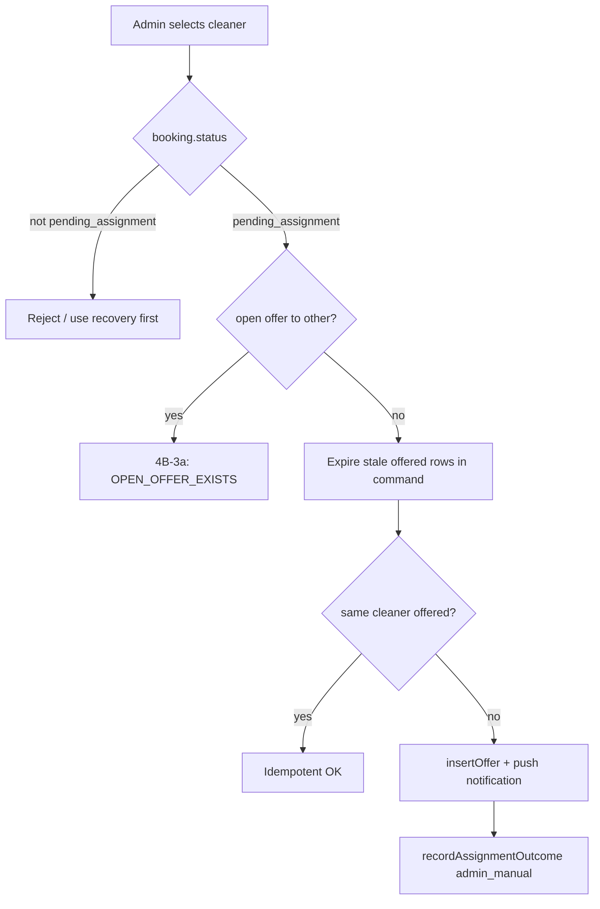
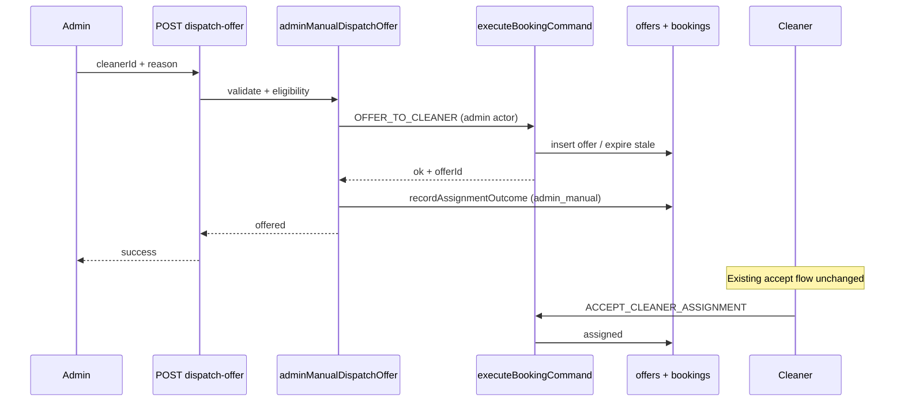

# Stage 4B-3 — Manual Cleaner Dispatch Design

**Date:** 2026-05-17  
**Type:** Design only — no implementation  
**Depends on:** Stage 4B-1 (operational panel), Stage 4B-2a (single-booking recovery), Stage 3B-2 (decline/redispatch policy), Stage 3C (one open offer per booking)

**Related:** [stage-4a-admin-dispatch-operational-control-audit.md](../audits/stage-4a-admin-dispatch-operational-control-audit.md), [stage-4b-2-single-booking-assignment-recovery-design.md](./stage-4b-2-single-booking-assignment-recovery-design.md), [admin-operational-dashboard.md](../operations/admin-operational-dashboard.md), [assignment-decline-redispatch.md](../operations/assignment-decline-redispatch.md)

---

## Executive summary

| Question | Answer |
|----------|--------|
| Offer or direct assign? | **Offer only** — `OFFER_TO_CLEANER`; cleaner accepts via existing `ACCEPT_CLEANER_ASSIGNMENT` |
| Safe to implement now? | **Yes**, as a narrow admin mutation behind strict eligibility + audit (after 4B-2a is stable) |
| Smallest safe slice (4B-3a) | `pending_assignment` + paid + no cleaner + **no open offer to another cleaner** + eligible target cleaner + mandatory reason → single POST + booking-detail picker |
| Out of scope for 4B-3a | Replace/cancel open offer, `confirmed` move+offer combo, max-attempt override, queue bulk actions, team dispatch |

**Hard constraints (from product rules):**

- Do **not** directly assign cleaners (`bookings.cleaner_id` without accept).
- Do **not** expose `ADMIN_OVERRIDE_STATUS` in admin UI.
- Do **not** change accept/decline semantics, payment finalize, earnings formulas, RLS, or team dispatch.

---

## Current admin limitations

After Stage 4B-1 and 4B-2a, admin can:

| Capability | Status |
|------------|--------|
| See operational issues, assignment visibility keys, open offers | Yes (read-only) |
| Recover post-payment dispatch failures (`confirmed` → engine) | Yes (4B-2a) |
| View assignment state, audits, idempotency keys | Yes |
| See selected-cleaner / max-attempts / needs-assignment cases | Yes (badges + runbooks) |
| **Choose a cleaner and send an offer** | **No** |
| Cancel or replace an open offer from UI | **No** |
| Accept/decline on behalf of cleaner | **No** |
| Override booking status | **No** (command exists; not exposed) |

**Engine facts relevant to manual dispatch:**

- `OFFER_TO_CLEANER` requires booking status `pending_assignment` (guard in `bookingCommandGuards.ts`).
- Admin is already authorized for `OFFER_TO_CLEANER` (`systemish` actor policy); today offers are created with **service** actor via `createDispatchOffer`.
- One **open** offer per booking (command `OPEN_OFFER_EXISTS` + DB partial unique — Stage 3C).
- Idempotency per cleaner: `assignment:offer:{bookingId}:{cleanerId}`.
- Stale `offered` rows past expiry are auto-marked `expired` inside `OFFER_TO_CLEANER` before evaluating open offers.
- Selected-cleaner path does **not** auto-redispatch; admin attention is intentional.
- Max **5** offer rows per booking triggers `attention_required` on further auto-redispatch (decline/expiry orchestrator).

**API today:** `getBookingCleaners` allows **admin** to list cleaners with eligibility for a `bookingId` (service-role read). No admin dispatch route exists.

---

## Recommended manual dispatch policy

### Decision: offer only (never direct assign)

| Approach | Verdict |
|----------|---------|
| Direct assign (`cleaner_id` without accept) | **Forbidden** — breaks accept semantics, earnings lock-in, and audit trail |
| `OFFER_TO_CLEANER` + cleaner accept | **Required** — same path as automated dispatch |

Manual dispatch is **admin-initiated offer creation**, not assignment completion. Booking becomes `assigned` only when the cleaner accepts (unchanged).

### Booking statuses that allow manual dispatch

| Status | Manual dispatch? | Notes |
|--------|------------------|-------|
| `pending_assignment` | **Yes** (primary) | Normal post-payment dispatch state |
| `confirmed` | **No** in 4B-3a | Use **4B-2a recovery** first (`MOVE_TO_PENDING_ASSIGNMENT` + engine). Optional 4B-3b: combined orchestrator |
| `assigned`, `in_progress`, `completed`, `payout_ready`, `paid_out` | **No** | Already assigned or terminal progress |
| `draft`, `pending_payment` | **No** | Not paid / not confirmed |
| `payment_failed`, `cancelled` | **No** | Terminal / invalid for dispatch |

**Additional preconditions (all slices):**

| Rule | Check |
|------|--------|
| Payment | ≥1 `payments.status = paid` for booking |
| Cleaner on booking | `bookings.cleaner_id` is null |
| Not terminal | Status not in cancelled / paid_out / payment_failed |

### Assignment metadata / visibility states that allow manual dispatch

Manual dispatch is an **ops action when automation cannot finish**, not a replacement for cron redispatch.

| Visibility / ops state | Allow manual dispatch? | Rationale |
|------------------------|------------------------|-----------|
| `selected_declined_admin` | **Yes** | Primary use case — customer’s cleaner declined |
| `max_attempts_admin` | **Yes** (4B-3a with policy choice below) | Automation exhausted; admin picks next cleaner |
| `needs_assignment` | **Yes** | Generic attention (expiry, no eligible auto pick) |
| `dispatch_not_started` | **No** — use 4B-2a | Still `confirmed`; recovery engine first |
| `finding_cleaner` / `offer_sent` / `decline_redispatched` | **No** in 4B-3a if open offer exists | System still searching; wait or replace in 4B-3b |
| `already_assigned` | **No** | — |

**Assignment metadata `status`:** Manual dispatch allowed when booking is `pending_assignment` and ops panel shows `manualInterventionNeeded` **or** explicit allow-list of visibility keys above. Do **not** key solely on raw `metadata.assignment.status` (can be stale vs offers).

### Selected-cleaner declined → another cleaner

| Question | Policy |
|----------|--------|
| Allow offer to a different cleaner? | **Yes** — core value of manual dispatch |
| Auto-change customer preference lock? | **No** in 4B-3a — do not rewrite `cleanerPreference` / preferred cleaner in booking lock without a dedicated product decision |
| Assignment path after admin offer | Record outcome with path **`admin_manual`** (new `AssignmentPath` value) or reuse `best_available` with reason prefix `Admin manual dispatch:` |

**Recommendation:** Add `admin_manual` to `AssignmentPath` and set `metadata.assignment` via `recordAssignmentOutcome` after successful offer:

```ts
{
  status: "offered",
  path: "admin_manual",
  cleanerId: <target>,
  offerId: <new>,
  reason: <admin reason>,
  lastOfferOutcome: null, // or preserve prior in extended metadata if needed later
}
```

This preserves audit distinction from auto `best_available` redispatch and prevents `processBookingAfterOfferEnded` from treating the booking as auto-redispatch-eligible on the wrong path.

**Selected path preservation:** Keep historical `path: selected` in audit timeline via prior rows; new snapshot uses `admin_manual`. Customer copy unchanged (see below).

### `pending_assignment` with open offer

| Scenario | 4B-3a | 4B-3b (later) |
|----------|-------|----------------|
| Open offer to cleaner A; admin wants cleaner B | **Block** — `OPEN_OFFER_EXISTS` | Optional `replaceOpenOffer: true` after cancel/expire A with audit |
| Open offer to same cleaner A (retry) | **Allow** (idempotent) | Same |
| Stale open offer (past TTL) | **Allow** — command expires stale rows first | Same |

**Rationale for blocking replace in 4B-3a:** No admin-safe cancel-offer command in UI today; ad-hoc DB updates bypass command layer. Safer to wait for decline/expiry/cron or implement explicit cancel in 4B-3b.

### Max dispatch attempts (5 offers)

| Option | Recommendation |
|--------|----------------|
| Block admin dispatch when `offers.length >= 5` | Too strict — admin is the escape hatch |
| Allow with mandatory reason mentioning override | **Preferred for 4B-3a** |
| Silent unlimited offers | **Reject** — keep cap as soft guard with audit |

Orchestrator should:

1. If `offers.length >= ASSIGNMENT_MAX_DISPATCH_ATTEMPTS_PER_BOOKING`, require reason to include token `max attempts` (or dedicated checkbox `acknowledgeMaxAttempts: true`).
2. Log `admin_manual_dispatch_max_attempts_override` in structured log.
3. Still use normal `OFFER_TO_CLEANER` insert (6th row) — cap in `processBookingAfterOfferEnded` counts rows; admin offer does not bypass DB.

Auto-redispatch after admin offer decline: if path is `admin_manual`, treat like `best_available` for redispatch eligibility **or** escalate to attention again — **recommend** redispatch-eligible with exclude list (same as `best_available`) so one admin pick does not block all automation forever. Document in 4B-3a implementation notes; optional small follow-up to add `admin_manual` to `REDISPATCH_ELIGIBLE_PATHS`.

---

## Eligibility rules (cleaner target)

Reuse existing eligibility stack — **no new ad-hoc rules in UI only**.

| Check | Source | Block if fails |
|-------|--------|----------------|
| Cleaner exists | `loadCleanerCandidates` | `CLEANER_NOT_FOUND` |
| Active | `evaluateCleanerEligibility` | `inactive` |
| Not suspended | `isCleanerSuspended` | `suspended` |
| Service capability | metadata + query | `no_service_capability` |
| Service area | metadata + query | `outside_service_area` |
| Availability window | slot vs windows | `outside_availability_window` |
| Time off | slot vs blocks | `time_off` |
| Schedule conflict | `loadConflictingCleanerIds` (excludes current booking) | `schedule_conflict` |
| Prior offer to same cleaner | `OFFER_TO_CLEANER` idempotent | OK (no-op success) |
| Open offer to **other** cleaner | command guard | `OPEN_OFFER_EXISTS` |

**Unavailable / inactive cleaners:**

| State | UI | Server |
|-------|-----|--------|
| `inactive` | Show in list, **disabled**, reason | Reject |
| `suspended` | Disabled | Reject |
| Ineligible (area, time, conflict) | Disabled + code | Reject |

**Do not** allow admin to force-offer ineligible cleaners in 4B-3a (no “override eligibility” flag). If ops must bypass, that is a separate privileged design with legal/ops sign-off.

**Implementation:** Call `isCleanerEligibleForAssignment(client, context, cleanerId)` after `loadAssignmentContext`. Picker data from existing `getBookingCleaners` for the booking (admin role already supported).

**Exclude cleaners with declined offers?** Auto-redispatch excludes prior `declined` / `expired` / `cancelled` on same booking. For admin manual:

- **Recommend:** Show all eligible cleaners in picker; **warn** (not block) if target had `declined` on this booking unless reason explains re-offer.
- Optional 4B-3b: block re-offer to same decliner without `allowRepeatDeclinedCleaner: true`.

---

## Open offer handling



| Action | Mechanism |
|--------|-----------|
| Expire stale | Existing logic in `OFFER_TO_CLEANER` |
| Cancel open offer to other | **Not in 4B-3a** — new `CANCEL_ASSIGNMENT_OFFER` or service `updateOffer` wrapper in 4B-3b |
| Customer notification | Existing `assignment_offer` push template on create |

---

## API contract (proposed)

### `POST /api/admin/bookings/[bookingId]/dispatch-offer`

**Auth:** Admin session only (same pattern as recover-assignment).

**Body:**

```json
{
  "cleanerId": "uuid",
  "reason": "string (8–500 chars, trimmed)",
  "acknowledgeMaxAttempts": false
}
```

**Success (200):**

```json
{
  "ok": true,
  "status": "offered",
  "bookingId": "uuid",
  "bookingStatus": "pending_assignment",
  "cleanerId": "uuid",
  "offerId": "uuid",
  "idempotent": false,
  "message": "Offer sent to cleaner."
}
```

**Result statuses:**

| `status` | Meaning |
|----------|---------|
| `offered` | New offer created |
| `already_offered` | Idempotent — same cleaner, open or accepted offer |
| `not_eligible` | Preconditions failed (see codes) |
| `error` | Engine/command failure |

**Failure codes (4xx):**

| Code | HTTP | When |
|------|------|------|
| `BOOKING_NOT_FOUND` | 404 | — |
| `NOT_ELIGIBLE` | 409 | Wrong status, unpaid, cleaner assigned, open offer to other, ineligible cleaner |
| `OPEN_OFFER_EXISTS` | 409 | Another cleaner has open offer |
| `CLEANER_NOT_ELIGIBLE` | 422 | Failed eligibility checks |
| `MAX_ATTEMPTS_REASON_REQUIRED` | 400 | ≥5 offers and reason missing override acknowledgment |
| `VALIDATION_ERROR` | 400 | Reason length, missing cleanerId |

**Orchestrator:** `adminManualDispatchOffer` (mirror `adminAssignmentRecovery.ts`):

1. Validate admin + reason (+ max-attempts acknowledgment).
2. Load booking, payments, offers (service role).
3. Assert eligibility table above.
4. `createAdminDispatchOffer` → `executeBookingCommand` with **admin** actor (`profileId` set), not service actor.
5. `recordAssignmentOutcome` with `path: admin_manual`.
6. Structured log: `admin_manual_dispatch` (bookingId, adminProfileId, cleanerId, offerId, idempotent, visibility key before/after).

**Does not call:** `runAssignmentAfterPayment`, `recoverAssignmentForBooking`, `ADMIN_OVERRIDE_STATUS`, `ACCEPT_CLEANER_ASSIGNMENT`.

### Idempotency key strategy

| Layer | Key | Purpose |
|-------|-----|---------|
| Command | `assignment:offer:{bookingId}:{cleanerId}` | **Keep** — dedupe retries to same cleaner |
| Admin API request | `admin:dispatch-offer:{bookingId}:{cleanerId}:{adminProfileId}` optional header `Idempotency-Key` | Dedupe double-clicks / network retry from same admin session |
| Audit | Store both command key and API key on `booking_state_audits` when present |

**Cross-cleaner:** Different cleaners → different command keys → second cleaner blocked if first offer still open (by design).

**Replace flow (4B-3b):** New command key prefix `admin:cancel-offer:{offerId}` + then reuse offer key for new cleaner.

---

## Audit and reason requirements

| Field | Rule |
|-------|------|
| `reason` | Required, 8–500 chars, trimmed (match 4B-2a) |
| Actor | `admin` + `profileId` on `OFFER_TO_CLEANER` audit row |
| Command reason | Prefix: `Admin manual dispatch: {user reason}` |
| Max attempts | If `offers.length >= 5`, require `acknowledgeMaxAttempts: true` **or** reason contains agreed phrase |
| Structured log | `admin_manual_dispatch` JSON (no PII beyond ids) |
| `RECORD_ASSIGNMENT_ATTENTION` | **Do not** pre-write; only `recordAssignmentOutcome` after successful offer |

**Forbidden audit patterns:**

- Using `ADMIN_OVERRIDE_STATUS` to skip to `assigned`.
- Service actor without admin profile for manual ops (loses accountability).

---

## UI contract

### Where

| Surface | 4B-3a | Later |
|---------|-------|-------|
| `/admin/bookings/[id]` operational panel | **Yes** — primary | — |
| `/admin/assignments` queue | Read-only link to detail | Optional inline dispatch 4B-3c |

### When visible

Show **“Send offer to cleaner”** when **all**:

- `booking.status === pending_assignment`
- `cleaner_id` null
- Paid
- `manualInterventionNeeded === true` **OR** visibility in (`selected_declined_admin`, `max_attempts_admin`, `needs_assignment`)
- **No** open offer to a *different* cleaner (show message: “Waiting on open offer to {name} — wait for response or use replace (future)”)

Hide when:

- Recovery eligible (`confirmed`) — show recover only
- Open offer and auto-search still appropriate (`offer_sent`, `decline_redispatched`) unless policy adds “replace offer”
- Already assigned

### Panel contents

1. **Cleaner picker** — fetch `GET` booking cleaners API with `bookingId`; sort eligible first; disabled rows with `eligibilityCode`.
2. **Selected cleaner summary** — display name, eligibility, optional earnings preview (admin-only, already on card).
3. **Reason** — required textarea, min length hint.
4. **Max attempts banner** — if ≥5 prior offers, checkbox + warning copy.
5. **Submit** — POST dispatch-offer; show result + refresh operational panel / audit timeline.
6. **Runbook link** — [assignment-decline-redispatch.md](../operations/assignment-decline-redispatch.md).

**Do not show:** `ADMIN_OVERRIDE_STATUS`, raw command names to customer-facing sections, team dispatch controls.

### Distinction vs Recover (4B-2a)

| Control | When |
|---------|------|
| Recover assignment | `confirmed`, paid, past grace, dispatch not started |
| Send offer to cleaner | `pending_assignment`, admin must pick cleaner |

---

## Customer-facing behavior

**No change to accept flow.** Customer does not pick cleaner in admin UI.

| Situation | Customer sees |
|-----------|----------------|
| New offer after admin dispatch | Same as auto: push/email `assignment_offer` if configured; status label remains calm “finding cleaner” / “reviewing availability” per [assignment-decline-redispatch.md](../operations/assignment-decline-redispatch.md) |
| Selected declined → admin offers another | **Do not** expose “your cleaner declined”; keep *We're reviewing cleaner availability for your booking.* until assigned |
| Admin activity | **No** “admin override” or internal reason in customer APIs |

---

## Test plan

### Unit — orchestrator

| Case | Expected |
|------|----------|
| Happy path — eligible cleaner, `pending_assignment` | `offered`, offer row, `admin_manual` metadata |
| Idempotent same cleaner | `already_offered`, no duplicate row |
| `OPEN_OFFER_EXISTS` other cleaner | `NOT_ELIGIBLE` / 409 |
| Inactive / suspended / conflict cleaner | `CLEANER_NOT_ELIGIBLE` |
| `confirmed` status | `NOT_ELIGIBLE` |
| Assigned booking | `NOT_ELIGIBLE` |
| Unpaid | `NOT_ELIGIBLE` |
| ≥5 offers without acknowledgment | `MAX_ATTEMPTS_REASON_REQUIRED` |
| ≥5 offers with acknowledgment | Success (6th offer) |
| Reason too short | 400 |

### Integration — API route

| Case | Expected |
|------|----------|
| Non-admin | 403 |
| Invalid bookingId | 404 |
| Audit row actor admin + idempotency key | Present |

### Regression

| Area | Assert |
|------|--------|
| `executeBookingCommand` OFFER_TO_CLEANER | Unchanged semantics |
| Auto redispatch | Unaffected for non-admin paths |
| 4B-2a recovery | Still exclusive for `confirmed` |
| Customer `getBookingCleaners` | Unchanged authorization |

### E2E (manual QA)

1. Selected cleaner declines → admin offers eligible cleaner B → B accepts → `assigned`.
2. Admin dispatch while open offer to A → blocked in 4B-3a.
3. Double-submit same cleaner → one offer, idempotent response.

---

## What must remain forbidden

| Action | Why |
|--------|-----|
| Set `bookings.cleaner_id` without accept | Breaks assignment contract |
| `ADMIN_OVERRIDE_STATUS` in UI | Explicit out of scope |
| Admin accept/decline on behalf of cleaner | Changes accept semantics |
| Payment finalize / retry from dispatch UI | Out of scope |
| Earnings formula / payout edits from dispatch | Out of scope |
| RLS changes | Out of scope |
| Team / multi-cleaner dispatch | Out of scope |
| Bypass eligibility without new design | Safety |
| Batch manual dispatch from queue | Defer to 4B-3c |

---

## Risks and mitigations

| Risk | Mitigation |
|------|------------|
| Admin offers ineligible cleaner (schedule conflict) | Server-side `isCleanerEligibleForAssignment`; UI disable |
| Race: cron redispatch + admin offer | `OPEN_OFFER_EXISTS` + DB unique; orchestrator re-check offers at start |
| Accountability: service actor for offers | Admin actor + profileId on manual path only |
| Max attempts bypass abuse | Acknowledgment + structured log + audit reason |
| Selected path confusion | `admin_manual` path + clear visibility copy |
| Customer sees “failed” | Reuse existing calm copy; no new error strings |
| Re-offer to decliner annoys cleaner | UI warning; optional block in 4B-3b |
| Stuck with open offer to wrong cleaner | Document wait/decline; 4B-3b replace |

---

## Architecture diagram



---

## Final recommendation

### Is manual dispatch safe to implement now?

**Yes**, provided implementation follows **4B-3a** only:

1. New orchestrator + admin POST route (pattern from 4B-2a).
2. Reuse `OFFER_TO_CLEANER` — **no** direct assign, **no** guard/RLS/payment/accept changes.
3. Strict eligibility: `pending_assignment`, paid, no cleaner, target cleaner eligible, **no open offer to another cleaner**.
4. Mandatory reason + admin actor audits + `admin_manual` assignment path metadata.
5. UI on booking detail only, wired to existing cleaner list API.

**Prerequisite:** Stage 4B-2a stable in production-like testing so admins do not confuse Recover vs Send offer.

### Smallest safe slice (4B-3a)

| In | Out |
|----|-----|
| POST `dispatch-offer` | Replace/cancel open offer |
| Booking detail picker + reason | Assignment queue inline action |
| `admin_manual` path metadata | `confirmed` move+offer in one click |
| Eligibility-enforced target | Force ineligible / force assign |
| Max-attempts with acknowledgment | Team dispatch |
| Reuse push `assignment_offer` | Change accept or payment |

### Follow-ups (4B-3b+)

- **Replace open offer:** cancel/expire other cleaner’s open offer then offer (new command + audit).
- **`admin_manual` in redispatch policy:** explicit `REDISPATCH_ELIGIBLE_PATHS` behavior on decline.
- **Queue shortcut:** dispatch from `/admin/assignments` with same guards.
- **Re-offer declined cleaner:** optional explicit flag.

---

## Design audit answers (quick reference)

| # | Question | Answer |
|---|----------|--------|
| 1 | Booking statuses | **`pending_assignment` only** (4B-3a); `confirmed` → use 4B-2a first |
| 2 | Assignment states | Attention cases + `needs_assignment` / selected declined / max attempts; not while auto-search with open offer (4B-3a) |
| 3 | Offer vs assign | **Offer only** |
| 4 | Eligibility checks | Full `evaluateCleanerEligibility` / `isCleanerEligibleForAssignment` |
| 5 | Inactive/unavailable | **Blocked** server-side; shown disabled in UI |
| 6 | Selected declined → another | **Yes** |
| 7 | `pending_assignment` + open offer | **Block** if offer to other cleaner (4B-3a) |
| 8 | Existing open offers | Wait, idempotent same cleaner, or 4B-3b replace |
| 9 | Idempotency | Keep `assignment:offer:{bookingId}:{cleanerId}`; optional API key |
| 10 | Audit reason | Required 8–500 chars; `Admin manual dispatch: …`; admin actor |
| 11 | Admin UI | Booking detail picker when manual intervention needed |
| 12 | Customer | Calm existing copy; no internal decline/admin details |
| 13 | Tests | Orchestrator matrix + route auth + idempotency + regression |
| 14 | Forbidden | Direct assign, override status, accept on behalf, payment/earnings/RLS/team |
