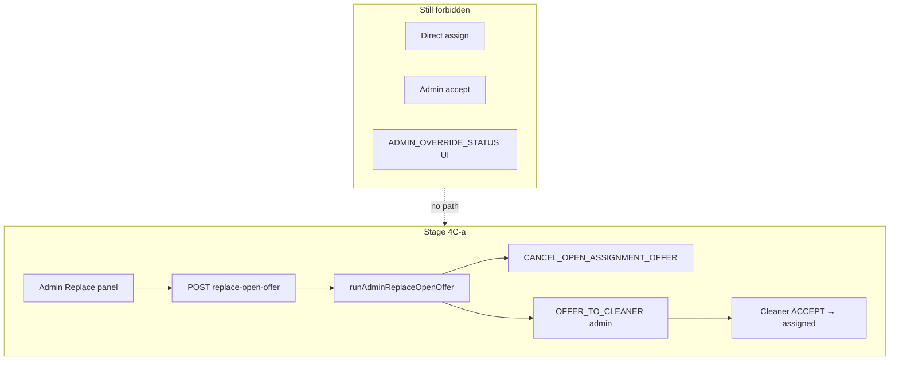

# Stage 4C — Cancel/Replace Open Offer Design

**Date:** 2026-05-17  
**Type:** Design only — no implementation  
**Depends on:** Stage 4B-3a (manual dispatch offer), Stage 3C (one open offer per booking), Stage 3B-2 (decline/expiry orchestrator)

**Related:** [stage-4b-3-manual-cleaner-dispatch-design.md](./stage-4b-3-manual-cleaner-dispatch-design.md), [stage-4b-admin-operational-control-final-audit.md](../audits/stage-4b-admin-operational-control-final-audit.md), [assignment-decline-redispatch.md](../operations/assignment-decline-redispatch.md), [stage-3c-offer-race-global-duplicate-protection-design.md](./stage-3c-offer-race-global-duplicate-protection-design.md)

---

## Executive summary

| Question | Answer |
|----------|--------|
| Safe to implement now? | **Yes**, after 4B-3a is stable in production — requires a **new booking command** for cancel (no command exists today) |
| Smallest safe slice (4C-a) | **One** admin POST `replace-open-offer` orchestrator: cancel single ops-open offer → `OFFER_TO_CLEANER` to eligible cleaner B; mandatory reason; no auto-redispatch on cancel |
| One action or two? | **One atomic admin action** (single API + orchestrator); optional read-only “cancel only” deferred |
| Offer status for cancel | **`cancelled`** (existing enum); set `responded_at` |
| Still offer-only? | **Yes** — replacement uses `OFFER_TO_CLEANER`; assignment only on cleaner accept |

**Hard constraints (unchanged):** No direct assign, no `ADMIN_OVERRIDE_STATUS` UI, no admin accept/decline, no payment/earnings/RLS/team changes.

---

## Current limitation (Stage 4B-3a)

| Situation | Today |
|-----------|--------|
| Open offer to cleaner A, admin wants cleaner B | **Blocked** — `OPEN_OFFER_EXISTS` in `runAdminManualDispatchOffer` and `OFFER_TO_CLEANER` |
| Wait for A to decline | Works but slow; customer waits |
| Wait for expiry cron | 48h TTL (`ASSIGNMENT_OFFER_TTL_HOURS`); may auto-redispatch to random eligible cleaner (not B) |
| Cancel A’s offer from admin UI | **Not possible** — no `CANCEL_*` assignment command |

**Existing code that touches `cancelled` (not admin-exposed):**

- `expireOtherOpenOffers()` in `executeBookingCommand.ts` — sets sibling `offered` → `cancelled` **after** one cleaner **accepts** (not an admin cancel path).
- Enum `assignment_offer_status` includes `cancelled` (`20260515201500_core_foundation.sql`).
- `processBookingAfterOfferEnded` **excludes** cleaners with prior `cancelled` offers from auto-redispatch pool (same as declined/expired).

**Critical gap:** Offer row updates today for decline/accept go through `backend.updateOffer` inside commands, but there is **no** `CANCEL_ASSIGNMENT_OFFER` (or similar) in `BOOKING_COMMAND_TYPES`. Admin cancel must **not** bypass the command layer with raw Supabase updates.

---

## Design audit answers

### 1. When should admin be allowed to cancel/replace?

**Allow replace** when all hold at request time:

| Rule | Check |
|------|--------|
| Booking status | `pending_assignment` only |
| Payment | ≥1 paid payment |
| Assigned cleaner | `bookings.cleaner_id` is null |
| Open offers | **Exactly one** ops-open offer (`isOfferOpenForOps`) for the booking |
| Target cleaner | Eligible via `isCleanerEligibleForAssignment`; **must differ** from open-offer cleaner |
| Terminal booking | Not `cancelled`, `payment_failed`, etc. |

**Encourage replace (UI visible)** when:

- `openOfferCount === 1` and manual dispatch is blocked solely due to open offer, **or**
- Visibility `offer_sent` / `finding_cleaner` / `decline_redispatched` with ops still waiting on A, **or**
- `selected_declined_admin` / `needs_assignment` / `max_attempts_admin` **and** an accidental open offer blocks a new pick (edge case)

**Discourage / block replace** when:

| Case | Action |
|------|--------|
| `confirmed` (dispatch not started) | Use **4B-2a recovery** first |
| Already `assigned`+ | Not eligible |
| Zero open offers | Use **4B-3a** manual dispatch (no cancel step) |
| Two+ ops-open offers | **Should not happen** after 3C index — treat as data incident; block and alert |
| Open offer past TTL but row still `offered` | Prefer: cancel step expires stale → `expired` **or** use existing `OFFER_TO_CLEANER` stale-expiry path; document ops: if only stale row, 4B-3a may already work |

### 2. One action vs two separate actions?

| Approach | Verdict |
|----------|---------|
| **Two APIs:** `POST cancel-offer` then `POST dispatch-offer` | **Reject for 4C-a** — race: second admin, cron expiry, or auto-redispatch between calls |
| **One API:** `POST replace-open-offer` | **Required** — single orchestrator, ordered steps, one idempotency key, one audit narrative |

Optional **4C-b:** read-only cancel-only for investigation (no replacement) — lower priority.

### 3. What booking statuses allow replacement?

Same as 4B-3a manual dispatch: **`pending_assignment` only**.

### 4. What offer status should cancelled offers use?

| Status | When |
|--------|------|
| **`cancelled`** | Admin (or system) withdraws an open offer before accept — **recommended** |
| `expired` | Time-based only (cron / TTL) — **do not** use for admin withdraw |
| `declined` | Cleaner-initiated only — preserves semantic meaning |

Set `responded_at` and `updated_at` on cancel (mirror decline).

**Do not** delete offer rows — keep audit trail and max-attempts count.

### 5. What audit reason is required?

| Field | Rule |
|-------|------|
| `reason` | Required, 8–500 chars (reuse 4B validators) |
| Cancel command reason | `Admin cancelled open offer: {reason}` |
| Offer command reason | `Admin replace offer: {reason}` (or combined prefix on both) |
| Actor | `admin` + `profileId` on **both** command audit rows |
| Structured log | `admin_replace_open_offer` JSON: `bookingId`, `adminProfileId`, `cancelledOfferId`, `cancelledCleanerId`, `newCleanerId`, `resultStatus` |

### 6. Should cleaner A be notified?

| Option | 4C-a recommendation |
|--------|---------------------|
| Push `assignment_offer_withdrawn` | **Defer (4C-b)** — no template in codebase today |
| Silent cancel | **Yes for 4C-a** — A’s app should hide offer when status ≠ `offered` (existing list filters) |
| Email | Defer |

**Rationale:** Avoid scope creep; cancel is ops-correctness. Add notification when product defines copy and template.

### 7. How to prevent double-open offers during replace?

**Defense in depth (ordered):**

```mermaid
sequenceDiagram
  participant Orch as adminReplaceOpenOffer
  participant Cancel as CANCEL_OPEN_ASSIGNMENT_OFFER
  participant DB as assignment_offers
  participant Offer as OFFER_TO_CLEANER

  Orch->>Orch: Re-read offers; assert exactly 1 ops-open
  Orch->>Cancel: cancel offer A
  Cancel->>DB: offered → cancelled
  Orch->>Orch: Re-read; assert 0 ops-open
  Orch->>Offer: offer cleaner B
  Offer->>DB: insert offered (unique index)
```

| Layer | Mechanism |
|-------|-----------|
| Orchestrator | Serial cancel → offer; re-check between steps |
| Command | `OFFER_TO_CLEANER` existing `OPEN_OFFER_EXISTS` + stale expiry |
| Database | `idx_assignment_offers_one_open_per_booking` (partial unique on `offered`) |
| Idempotency | Whole-operation key (see §11) |

**Must not** call `processBookingAfterOfferEnded` after admin cancel — that could auto-offer cleaner C while admin intended B.

### 8. Should selected-cleaner bookings allow replacement?

**Yes.**

| Scenario | Policy |
|----------|--------|
| Customer selected A; A not responding | Admin replaces with eligible B — primary 4C use case |
| Customer preference lock | **Do not** rewrite lock in 4C-a |
| Assignment path after replace | `admin_manual` (same as 4B-3a) via `recordAssignmentOutcome` after successful offer |

Selected path does not auto-redispatch; admin replace is the intended escape hatch when the selected cleaner holds an open offer too long.

### 9. Should max attempts require acknowledgement?

**Yes** — same rule as 4B-3a:

- If `assignment_offers` row count ≥ `ASSIGNMENT_MAX_DISPATCH_ATTEMPTS_PER_BOOKING` (5), require `acknowledgeMaxAttempts: true` before replace.
- Replace adds **one** new offer row (6th+); ops must explicitly acknowledge.

### 10. Should replacement use OFFER_TO_CLEANER after cancellation?

**Yes.** Reuse `createAdminDispatchOffer` (admin actor) after cancel completes.

**Do not** invent a new insert path or set `bookings.cleaner_id`.

Post-condition assert: `booking.cleaner_id` still null; `booking.status` still `pending_assignment`.

### 11. Idempotency strategy

| Layer | Key | Behavior |
|-------|-----|----------|
| **Whole operation** | `admin:replace-offer:{bookingId}:{openOfferId}:{newCleanerId}` | Retry-safe; store in audit |
| Cancel step | `admin:cancel-offer:{offerId}` | Second call: offer already `cancelled` → idempotent success |
| Offer step | `assignment:offer:{bookingId}:{newCleanerId}` | Existing canonical key |

**Partial failure:**

| State after failure | Retry |
|---------------------|-------|
| Cancelled, offer not created | Retry with same key → cancel idempotent, offer proceeds |
| Offer created | Return `already_offered` / success |
| Cancel failed | No offer attempted |

### 12. What should customer see?

**No new customer-facing “offer replaced” copy.**

| Phase | Customer message (unchanged from 3B-2b) |
|-------|------------------------------------------|
| After replace | Continue calm copy: *We're finding another available cleaner.* or *We're reviewing cleaner availability…* |
| Assigned | Normal assigned flow after B accepts |

Customer must **not** see cleaner A cancelled or admin intervention details.

### 13. What should admin see?

| Element | Content |
|---------|---------|
| Panel title | **Replace open offer** (distinct from “Send offer” when no open offer) |
| Current offer | Cleaner A name, offered at, expires at |
| Picker | Eligible cleaners; **disable cleaner A**; show ineligibility reasons |
| Reason | Required textarea |
| Max attempts | Checkbox when ≥5 rows |
| Success | “Open offer to {A} cancelled; offer sent to {B}. Booking pending acceptance.” |
| Failure codes | `OPEN_OFFER_NOT_FOUND`, `MULTIPLE_OPEN_OFFERS`, `SAME_CLEANER`, `CLEANER_NOT_ELIGIBLE`, etc. |

**Visibility:** `computeReplaceOfferEligible` (new) on operational panel:

```ts
pending_assignment && paid && !cleaner_id && openOfferCount === 1
```

Hide 4B-3a “Send offer” when `openOfferCount > 0`; show replace panel instead.

### 14. What tests are required?

**Orchestrator (`adminReplaceOpenOffer.test.ts`):**

| Case | Expected |
|------|----------|
| Non-admin | `FORBIDDEN` |
| Reason too short | `INVALID_PAYLOAD` |
| Happy path A open → cancel → offer B | B has `offered`; A `cancelled`; booking unassigned |
| `confirmed` booking | `NOT_ELIGIBLE` |
| No open offer | `NOT_ELIGIBLE` / use dispatch path |
| Two open offers (simulate) | `MULTIPLE_OPEN_OFFERS` |
| Target = same as A | `SAME_CLEANER` |
| Target ineligible | `CLEANER_NOT_ELIGIBLE` |
| Open offer to A, replace B while… | `OPEN_OFFER_EXISTS` if cancel skipped (regression) |
| Max attempts without ack | `MAX_ATTEMPTS_REACHED` |
| With ack | Success |
| Idempotent retry after full success | No duplicate offers |
| Cancel idempotent + offer succeeds on retry | Partial recovery |

**Command (`executeBookingCommand` — new cancel type):**

| Case | Expected |
|------|----------|
| Admin can cancel ops-open offer | `cancelled` |
| Cleaner cannot use cancel command | `FORBIDDEN` |
| Customer cannot | `FORBIDDEN` |
| Cancel already cancelled | Idempotent |
| Cancel accepted offer | `OFFER_NOT_OPEN` |
| **Does not** call `processBookingAfterOfferEnded` | Spy |

**API route:** auth 401; admin 200; body validation.

**UI:** `showAdminReplaceOfferPanel` when `openOfferCount === 1`; manual dispatch hidden.

**Regression:** 4B-3a dispatch tests still pass; `adminApiRoutes.test.ts` allowlist +1 POST.

### 15. What must remain forbidden?

| Forbidden | Notes |
|-----------|-------|
| Direct `cleaner_id` assignment | Same as 4B |
| `ADMIN_OVERRIDE_STATUS` in UI | |
| Admin `ACCEPT` / `DECLINE` on behalf of cleaner | |
| Raw `updateOffer` from admin API bypassing commands | |
| `processBookingAfterOfferEnded` on admin cancel | Prevents unwanted auto-redispatch |
| Payment finalize / retry | |
| Earnings formula edits | |
| RLS changes | |
| Team / parallel multi-offer | |
| Replacing without reason | |

---

## Recommended policy (consolidated)

### New booking command: `CANCEL_OPEN_ASSIGNMENT_OFFER`

Add to `BOOKING_COMMAND_TYPES` (name TBD; keep consistent with existing verbs).

| Property | Value |
|----------|-------|
| Actor | **Admin only** (`adminOnly` policy) |
| Input | `bookingId`, `offerId`, `reason` |
| Preconditions | Booking `pending_assignment`; offer exists; offer `status === 'offered'`; `isOfferOpenForOps(offer)` (or expire stale first — pick one policy and test) |
| Effect | `status → cancelled`, `responded_at = now` |
| Booking status | **Unchanged** (`pending_assignment`) |
| Side effects | **No** decline follow-up; **no** `processBookingAfterOfferEnded` |
| Audit | Booking state audit row with command name + reason + idempotency |

**Alternative considered:** Reuse `DECLINE_CLEANER_ASSIGNMENT` with admin actor — **reject**; semantically wrong and may wire decline follow-up.

### Orchestrator: `runAdminReplaceOpenOffer`

```
1. Validate admin, reason, newCleanerId, acknowledgeMaxAttempts
2. Load booking, payments, offers
3. Assert eligibility (§1)
4. Resolve single open offer (by offerId param or sole ops-open row)
5. Assert newCleanerId !== openOffer.cleaner_id
6. Assert newCleanerId eligible
7. executeBookingCommand CANCEL_OPEN_ASSIGNMENT_OFFER
8. Re-list offers; assert no ops-open except cancelled A
9. createAdminDispatchOffer → OFFER_TO_CLEANER
10. Assert booking.cleaner_id still null
11. recordAssignmentOutcome { status: offered, path: admin_manual, ... }
12. Log admin_replace_open_offer
```

### Cancellation semantics vs expiry/decline

| Event | Offer status | Auto-redispatch? |
|-------|--------------|------------------|
| TTL cron | `expired` | Yes (path-dependent) |
| Cleaner decline | `declined` | Yes (path-dependent) |
| Accept winner | other `offered` → `cancelled` | N/A |
| **Admin replace (cancel step)** | **`cancelled`** | **No** — admin controls next offer |

---

## API contract (proposed)

### `POST /api/admin/bookings/[bookingId]/replace-open-offer`

**Auth:** `requireApiUser(["admin"])`

**Body:**

```json
{
  "offerId": "uuid (optional if exactly one ops-open offer)",
  "newCleanerId": "uuid",
  "reason": "string (8–500)",
  "acknowledgeMaxAttempts": false
}
```

**Success (200):**

```json
{
  "ok": true,
  "status": "replaced",
  "bookingId": "...",
  "bookingStatus": "pending_assignment",
  "cancelledOfferId": "...",
  "cancelledCleanerId": "...",
  "cleanerId": "...",
  "offerId": "...",
  "idempotent": false,
  "message": "Open offer cancelled and new offer sent."
}
```

**Failure codes:** `NOT_ELIGIBLE`, `NOT_FOUND`, `MULTIPLE_OPEN_OFFERS`, `OFFER_NOT_OPEN`, `SAME_CLEANER`, `CLEANER_NOT_ELIGIBLE`, `MAX_ATTEMPTS_REACHED`, `OPEN_OFFER_EXISTS` (should not occur if ordering correct), `FORBIDDEN`, `INVALID_PAYLOAD`

**Allowlist:** Add to `ALLOWED_ADMIN_POST_ROUTES` in `adminApiRoutes.test.ts` (5th mutation route).

---

## UI contract

| State | Panel |
|-------|-------|
| `manualDispatchEligible` (no open offer) | Existing **Send offer to cleaner** (4B-3a) |
| `replaceOfferEligible` (`openOfferCount === 1`, same booking gates) | **Replace open offer** |
| Both false | Neither panel |

Submit → `POST replace-open-offer` → refresh booking detail.

---

## Architecture diagram



---

## Risks and mitigations

| Risk | Mitigation |
|------|------------|
| Cancel triggers auto-redispatch | Do not invoke `processBookingAfterOfferEnded` on admin cancel |
| Race with expiry cron | Cancel uses `status = offered` guard; retry idempotency; unique index |
| Race: A accepts during replace | Accept needs open offer; cancel uses conditional update; second step fails safely — surface clear error |
| Two open offers in DB | Block with `MULTIPLE_OPEN_OFFERS`; ops runbook |
| Cleaner A confused | Defer push; offer disappears from cleaner pending list |
| Max attempts exceeded | Acknowledgement + audit |
| No audit for offer cancel | New command writes `booking_state_audit` |
| Bypass command layer | Orchestrator only uses `executeBookingCommand` |

---

## Final recommendation

### Is cancel/replace safe to implement now?

**Yes**, after **4B-3a** is deployed and ops-trained, because:

- DB already supports `cancelled` and one-open-offer unique index.
- Replacement reuses proven `OFFER_TO_CLEANER` + admin dispatch patterns.
- Main new surface is one **admin-only cancel command** with strict guards and **no** auto-redispatch hook.

**Prerequisite:** Implement cancel as a first-class **booking command** — do not patch offers via service-role SQL from the API.

### Smallest safe slice (4C-a)

| In | Out |
|----|-----|
| `CANCEL_OPEN_ASSIGNMENT_OFFER` command + tests | Cancel-only API |
| `runAdminReplaceOpenOffer` orchestrator | Replace from assignment queue |
| `POST replace-open-offer` | Cleaner A push notification |
| Booking detail **Replace open offer** UI | Changing selected-cleaner lock |
| Reuse max-attempts ack + eligibility from 4B-3a | `admin_manual` auto-redispatch policy (document; optional 4C-b) |
| `adminApiRoutes` allowlist + docs update | Team dispatch |

### Suggested implementation order

1. Command + unit tests (cancel semantics, no follow-up).
2. Orchestrator + integration tests (cancel → offer).
3. API route + allowlist.
4. UI panel + operational `replaceOfferEligible`.
5. Update [admin-operational-dashboard.md](../operations/admin-operational-dashboard.md) and [assignment-decline-redispatch.md](../operations/assignment-decline-redispatch.md).

### Stage 4C-b (follow-up)

- Push notification to withdrawn cleaner.
- `admin_manual` path in `REDISPATCH_ELIGIBLE_PATHS` policy when B declines.
- Assignment queue inline replace.
- Optional `POST cancel-open-offer` read-only ops action.

---

## Quick reference (audit checklist)

| # | Question | Answer |
|---|----------|--------|
| 1 | When allowed? | `pending_assignment`, paid, unassigned, exactly one ops-open offer |
| 2 | One or two steps? | **One** admin action |
| 3 | Booking statuses? | `pending_assignment` only |
| 4 | Cancel status? | **`cancelled`** |
| 5 | Audit reason? | Required 8–500 chars on both steps |
| 6 | Notify A? | **Defer** (4C-b) |
| 7 | Double-open prevention? | Ordered cancel → offer + DB unique + guards |
| 8 | Selected cleaner? | **Yes** |
| 9 | Max attempts ack? | **Yes** (≥5 rows) |
| 10 | Use OFFER_TO_CLEANER? | **Yes** |
| 11 | Idempotency? | `admin:replace-offer:…` + per-step keys |
| 12 | Customer UX? | Unchanged calm copy |
| 13 | Admin UX? | Replace panel with current offer + picker |
| 14 | Tests? | Command, orchestrator, API, UI visibility, regression |
| 15 | Forbidden? | Direct assign, override UI, admin accept/decline, bypass commands, auto-redispatch on cancel |
