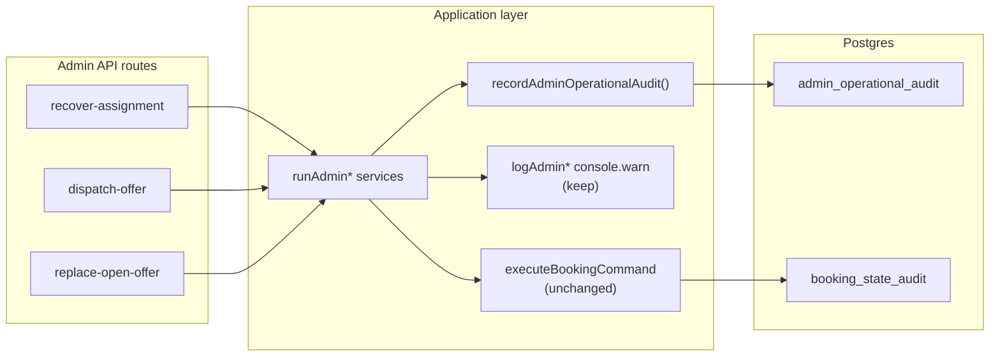

# Stage 5B-1 — Durable Admin Operational Audit Design

**Date:** 2026-05-17  
**Status:** Design only — no implementation  
**Depends on:** [stage-5a-security-governance-audit.md](../audits/stage-5a-security-governance-audit.md), [stage-4a-admin-dispatch-operational-control-audit.md](../audits/stage-4a-admin-dispatch-operational-control-audit.md)

**Goal:** Persist admin operational actions that today only emit `console.warn` JSON, without changing lifecycle commands, payment finalize, assignment accept semantics, or earnings formulas.

---

## Executive summary

| Decision | Recommendation |
|----------|----------------|
| Storage | **New append-only `admin_operational_audit` table** |
| Do not use | `booking_state_audit` / `RECORD_ASSIGNMENT_ATTENTION` for human admin ops |
| Phase 1 actions | Assignment recovery, manual dispatch, replace open offer |
| Writes | Server-only via service role helper (no authenticated insert RLS) |
| Reads | Admin-only RLS; merge into booking detail timeline |
| Backfill | **None** |
| Lifecycle | Unchanged — optional **dual write** (command audit + admin audit) where commands already run |

---

## Current audit gaps

### What is durable today

| Source | Captures | Visible to |
|--------|----------|------------|
| `booking_state_audit` | Booking **status** transitions via commands/RPCs | Customer, cleaner, admin (scoped by booking) |
| `RECORD_ASSIGNMENT_ATTENTION` | System/service assignment metadata on booking (no status change) | Same as above |
| `payment_events` | Raw Paystack webhook payloads | Customer (own booking), admin |
| Payout commands | `MARK_BOOKING_PAYOUT_READY` / `MARK_BOOKING_PAID_OUT` in `booking_state_audit` | Admin UI “State audit” |

### What is console-only today

Three admin flows call `console.warn(JSON.stringify({ event: … }))` on success, failure, and not-eligible paths:

| Function | Event key | File |
|----------|-----------|------|
| `logAdminAssignmentRecovery` | `admin_assignment_recovery` | `adminAssignmentRecovery.ts` |
| `logAdminManualDispatch` | `admin_manual_dispatch` | `adminManualDispatchOffer.ts` |
| `logAdminReplaceOpenOffer` | `admin_replace_open_offer` | `adminReplaceOpenOffer.ts` |

**Fields logged today (stdout):** `bookingId`, `adminProfileId`, `reason`, result status/code, `cleanerId` / offer ids, engine outcome summary, `idempotent` flag, ISO timestamp.

### Gaps for production forensics

1. **No DB query** — cannot answer “who dispatched cleaner X and why?” without log aggregation.
2. **No UI** — admin booking detail “State audit” shows lifecycle commands only; admin ops invisible.
3. **No correlation** — hard to tie admin action to resulting `assignment_offers` row or command idempotency keys.
4. **Failed / not-eligible attempts** — logged to console but not durable (important for disputes and training).
5. **Reason text** — validated (8–500 chars) in API but not stored durably.
6. **Payout buttons** — lifecycle audited, but admin **reason** not collected today (out of 5B-1 scope unless API gains a reason field later).

### Why not overload `booking_state_audit`

| Concern | Detail |
|---------|--------|
| **Semantics** | Table models lifecycle: `from_status`, `to_status`, `command` = booking command name. Admin ops are often **no status change** (dispatch, replace) or **indirect** (recovery engine). |
| **RLS** | Customers and cleaners **can SELECT** audit rows for bookings they can access (`booking_state_audit_select_customer` / `_cleaner`). Admin free-text **reasons** are internal ops notes — should not appear in customer-visible audit. |
| **Actor confusion** | `RECORD_ASSIGNMENT_ATTENTION` uses `actor_type: service`. Admin ops need `actor_type: admin` + `admin_profile_id`. |
| **Timeline pollution** | `buildLifecycleTimeline` iterates `booking_state_audit` and surfaces `to_status` — fake “admin dispatch” rows would confuse customer/admin lifecycle views. |
| **Idempotency index** | Partial unique `(booking_id, idempotency_key)` on `booking_state_audit` is owned by payment/finalize/cron — mixing admin keys increases collision and support burden. |
| **Scope creep** | Extending `executeBookingCommand` with `RECORD_ADMIN_OPERATION` couples governance to command layer versioning. |

`RECORD_ASSIGNMENT_ATTENTION` remains correct for **automated** assignment engine outcomes (cron redispatch, max attempts). Human admin actions are a different domain.

---

## Recommended storage model

### New table: `admin_operational_audit`

Append-only, booking-scoped, admin-attributed operational log. **Not** a replacement for `booking_state_audit`.



**Principles**

- **Dual write where applicable:** If a command already runs (`OFFER_TO_CLEANER`, `CANCEL_OPEN_ASSIGNMENT_OFFER`, recovery engine), keep command + lifecycle audit as-is; add **one** admin operational row per API request.
- **Insert-only:** Mirror `booking_state_audit` append-only trigger pattern.
- **Service role writes:** Same trust boundary as booking commands (server routes already use service role for orchestration).
- **Admin-only reads:** Unlike `booking_state_audit`, customers/cleaners never see ops reasons.

---

## Table / schema proposal

### Enum-like text constraints (app-enforced; CHECK optional in migration)

**`action`** (Phase 1):

| Value | API / service |
|-------|----------------|
| `assignment_recovery` | `POST …/recover-assignment` |
| `manual_dispatch_offer` | `POST …/dispatch-offer` |
| `replace_open_offer` | `POST …/replace-open-offer` |

**`outcome`**:

| Value | Meaning |
|-------|---------|
| `succeeded` | Mutation or engine completed as intended |
| `idempotent` | No-op replay (already recovered / offer already open / command idempotent) |
| `not_eligible` | Guard rejected (wrong status, no paid payment, etc.) |
| `failed` | Unexpected error or command failure |

### DDL sketch

```sql
create table public.admin_operational_audit (
  id bigint generated always as identity primary key,

  booking_id uuid not null
    references public.bookings (id) on delete cascade,

  admin_profile_id uuid not null
    references public.profiles (id) on delete restrict,

  action text not null,
  outcome text not null,

  -- Validated admin reason (8–500 chars); required for every row
  reason text not null,

  -- Optional correlation / targets
  cleaner_id uuid null references public.cleaners (id) on delete set null,
  offer_id uuid null references public.assignment_offers (id) on delete set null,
  cancelled_offer_id uuid null references public.assignment_offers (id) on delete set null,
  cancelled_cleaner_id uuid null references public.cleaners (id) on delete set null,

  -- Snapshot for forensics (not authoritative lifecycle state)
  booking_status_before public.booking_status null,
  booking_status_after public.booking_status null,

  result_code text null,          -- e.g. OPEN_OFFER_EXISTS, MAX_ATTEMPTS_REACHED
  result_message text null,       -- short safe message; no stack traces

  idempotency_key text null,      -- correlates to command keys when present
  command_idempotency_key text null, -- optional explicit command key copy

  metadata jsonb not null default '{}'::jsonb,

  created_at timestamptz not null default now(),

  constraint admin_operational_audit_reason_length
    check (char_length(trim(reason)) >= 8 and char_length(reason) <= 500)
);

comment on table public.admin_operational_audit is
  'Append-only log of human admin operational actions (dispatch, recovery, replace). Not a lifecycle audit.';

-- Dedupe only when caller supplies a key for success/idempotent replays
create unique index admin_operational_audit_idempotency_unique
  on public.admin_operational_audit (booking_id, idempotency_key)
  where idempotency_key is not null
    and outcome in ('succeeded', 'idempotent');

create index idx_admin_operational_audit_booking_created
  on public.admin_operational_audit (booking_id, created_at desc);

create index idx_admin_operational_audit_admin_created
  on public.admin_operational_audit (admin_profile_id, created_at desc);

create index idx_admin_operational_audit_action_created
  on public.admin_operational_audit (action, created_at desc);
```

### Field mapping (design questions 3–4)

| Field | Source |
|-------|--------|
| `admin_profile_id` | `user.profileId` from `requireApiUser(["admin"])` |
| `booking_id` | Route param |
| `reason` | Validated `validateAdminRecoveryReason` (shared 8–500) |
| `action` | Fixed per route |
| `outcome` | Mapped from `resultStatus` / `ok` / `httpStatus` |
| `cleaner_id` | Target cleaner (dispatch, replace) |
| `offer_id` | Created or existing offer after success |
| `cancelled_offer_id` / `cancelled_cleaner_id` | Replace flow only |
| `booking_status_before` | Booking row before operation |
| `booking_status_after` | Booking row after operation (re-read or result) |
| `result_code` | `code` from failure objects |
| `idempotency_key` | See idempotency section |
| `metadata` | Safe structured extras only |

---

## Action taxonomy

### Phase 1 (5B-1 implement)

| Action | Record on | Include failed / not_eligible? |
|--------|-----------|--------------------------------|
| `assignment_recovery` | Every `runAdminSingleBookingAssignmentRecovery` exit | **Yes** — all paths that call `logAdminAssignmentRecovery` today |
| `manual_dispatch_offer` | Every `runAdminManualDispatchOffer` exit | **Yes** |
| `replace_open_offer` | Every `runAdminReplaceOpenOffer` exit | **Yes** |

### Phase 2 (later slices; design hooks only)

| Action | Notes |
|--------|-------|
| `mark_payout_ready` | Only if API adds optional reason; lifecycle already in `booking_state_audit` |
| `mark_paid_out` | Same |
| `cancel_open_offer` | If exposed as standalone admin API |
| `batch_assignment_recovery` | Cron/script — use `actor_type: system` + `admin_profile_id` null OR separate `initiator` field (defer) |

### Out of scope

- `ADMIN_OVERRIDE_STATUS`
- Cron-only sweeps (unless explicitly product-required later)
- Cleaner/customer actions

---

## Idempotency strategy

### Goals

1. **Forensics:** Every admin API attempt should be auditable (including `not_eligible`).
2. **Dedup:** Replay that returns `idempotent: true` should not create duplicate **success** rows.

### Proposed keys (correlate with command layer)

| Action | `idempotency_key` when outcome ∈ {succeeded, idempotent} | Notes |
|--------|----------------------------------------------------------|-------|
| `manual_dispatch_offer` | `admin:dispatch:{bookingId}:{cleanerId}` | Aligns with `assignment:offer:{bookingId}:{cleanerId}` command key |
| `replace_open_offer` | `admin:replace:{bookingId}:{cancelledOfferId}:{targetCleanerId}` | One row per replace attempt |
| `assignment_recovery` | `admin:recovery:{bookingId}:{adminProfileId}:{paidPaymentUpdatedAt}` or `admin:recovery:{bookingId}` | Prefer stable “recovery attempt” key; if engine returns idempotent, same key |

For **`not_eligible`** and **`failed`**: set `idempotency_key` **null** (always insert) so operators see every rejected attempt.

### Relationship to commands

- Store optional `command_idempotency_key` in metadata or column when a command ran (e.g. `assignment:offer:…`).
- **Do not** require command changes for 5B-1 — keys are computed in the admin service layer.

---

## Safe metadata policy

Reuse and extend patterns from `adminOperationalHelpers.ts` (`SENSITIVE_METADATA_KEYS`).

### Allowed in `metadata` (allowlist)

| Key | Example |
|-----|---------|
| `acknowledge_max_attempts` | `true` |
| `dispatch_offer_count` | `3` |
| `open_offer_count` | `1` |
| `engine_outcome` | `offered`, `attention_required` |
| `engine_idempotent` | `true` |
| `result_status` | `already_offered` (mirror console `resultStatus`) |
| `http_status` | `409` |
| `cancelled_offer_id` | UUID (duplicate of column OK for JSON consumers) |

### Forbidden (never store)

- Paystack/webhook raw payloads, signatures, card data
- `authorization`, `secret`, `token`, `password`, `raw`, full `payload`
- Full `booking.metadata` or `payment_events.payload`
- Stack traces, env vars, service role keys
- Entire request bodies

### `reason` column

- Store **admin-entered reason** verbatim (already length-limited).
- Treat as **ops-internal** — not shown to customers.
- Optional future: PII warning in admin UI (“do not enter card numbers”).

---

## Append-only enforcement

**Yes** — required.

```sql
-- Same pattern as booking_state_audit
create trigger admin_operational_audit_append_only
  before update or delete on public.admin_operational_audit
  for each row execute function public.forbid_booking_state_audit_mutation();
```

(Reuse existing `forbid_booking_state_audit_mutation` or rename to generic `forbid_append_only_mutation` in implementation.)

---

## RLS proposal

**Narrow, additive** — one new table only; no changes to existing admin `FOR ALL` policies.

```sql
alter table public.admin_operational_audit enable row level security;

-- Admin: read all operational audit rows (global ops visibility)
create policy admin_operational_audit_select_admin
  on public.admin_operational_audit
  for select to authenticated
  using (public.auth_is_admin());

-- No INSERT/UPDATE/DELETE policies for authenticated
-- Inserts via service_role (bypass RLS) from server routes only
```

### Access matrix (design questions 8–10)

| Role | SELECT | INSERT |
|------|--------|--------|
| Admin | All rows | No (service role only) |
| Customer | **None** | No |
| Cleaner | **None** | No |
| Anon | **None** | No |
| Service role | All | Yes |

**Should admins read all audit rows?** **Yes** — any admin can read the full `admin_operational_audit` table (and per-booking via detail). Fine-grained “assigned ops manager” is out of scope.

**Should normal users read any?** **No.**

---

## Write helper proposal

**Module (proposed):** `src/features/admin/server/recordAdminOperationalAudit.ts`

```typescript
// Pseudocode — not implemented
recordAdminOperationalAudit(client, {
  bookingId,
  adminProfileId,
  action: "manual_dispatch_offer",
  outcome: "succeeded",
  reason,
  cleanerId,
  offerId,
  bookingStatusBefore,
  bookingStatusAfter,
  resultCode,
  resultMessage,
  idempotencyKey,
  metadata: { engine_outcome: "offered" },
});
```

**Rules**

1. Called from the **same branches** as `logAdmin*` (success, not_eligible, failed).
2. Uses **service role** client (already available in admin services).
3. On DB insert failure: log error + **still** `console.warn` (do not fail the user mutation if audit insert fails — match “audit best effort” pattern used elsewhere; document in ops).
4. Keep `logAdmin*` for log pipeline compatibility (Datadog/Vercel).

**Additive to lifecycle:** No new `BookingCommand` types; no changes to `executeBookingCommand` switch.

---

## UI / read-model proposal

### Data loading

Extend `getAdminBookingDetail` (`adminOperationsReadModel.ts`):

1. Query `admin_operational_audit` where `booking_id = :id` order by `created_at asc`.
2. Map to `AdminOperationalAuditEntry` (new type in `dashboards/server/types.ts`).

### Display (design question 11)

**Option A (recommended for 5B-1):** Separate section on booking detail page.

- **“Admin operations”** below “State audit”, above “Lifecycle”.
- Component: `AdminOperationalTimeline` (parallel to `AdminAuditTimeline`).
- Row format: `action` label · `outcome` badge · timestamp · admin (profile id or resolved name if cheap join) · **Reason** · cleaner/offer links · `result_code` if failed.

**Option B (later):** Unified “Operations timeline” merging `booking_state_audit` + `admin_operational_audit` sorted by `created_at`, with `kind` discriminator and filters.

Keep **Lifecycle** timeline unchanged (customer-oriented status labels).

### Enrichments (optional 5B-1.1)

- Resolve `admin_profile_id` → `profiles.full_name` in read model (admin-only).
- Link `offer_id` to offer summary already on page.

### Payout actions

Continue showing payout transitions in **State audit** only until reason field exists on payout APIs.

---

## Backfill policy (design question 12)

**Do not backfill.**

| Approach | Rationale |
|----------|-----------|
| No migration of stdout logs | Log retention may be short; keys incomplete |
| UI note | Optional footnote: “Admin operations audit available from May 2026” |
| Forward-only | Every new action after deploy is durable |

Historical investigation remains **console/log search** for pre-cutoff period.

---

## Test plan (design question 13)

### Unit tests

| Test | Assert |
|------|--------|
| `recordAdminOperationalAudit` mapping | All fields serialized; metadata allowlist strips forbidden keys |
| Outcome mapping | `resultStatus` → `outcome` enum |
| Idempotency | Second insert with same key + succeeded → unique violation handled or skipped |

### Integration tests (Supabase)

| Test | Assert |
|------|--------|
| Service role insert | Row created with valid FKs |
| Admin JWT SELECT | Can read row for booking |
| Customer JWT SELECT | **Zero rows** |
| Cleaner JWT SELECT | **Zero rows** |
| Append-only trigger | UPDATE/DELETE raises |

### Service-level tests (existing files extended)

| File | Assert |
|------|--------|
| `adminManualDispatchOffer.test.ts` | Mock helper called on success + not_eligible |
| `adminReplaceOpenOffer.test.ts` | Same |
| `adminAssignmentRecovery.test.ts` | Same |

### Read-model test

| Test | Assert |
|------|--------|
| `dashboardReadModels.test.ts` | Detail includes `operationalAudits[]` merged in order |

---

## Rollout plan

| Step | Deliverable | Risk |
|------|-------------|------|
| 1 | Migration: table + indexes + RLS + append-only trigger | Low |
| 2 | `recordAdminOperationalAudit` + types | Low |
| 3 | Wire three `runAdmin*` services (parallel to `logAdmin*`) | Low |
| 4 | Extend `getAdminBookingDetail` + API JSON | Low |
| 5 | `AdminOperationalTimeline` on booking detail page | Low |
| 6 | Integration tests + security test for RLS | Low |
| 7 | Docs: ops runbook “where to find admin audit” | Low |

**Deploy order:** Migration first → app deploy (helper no-ops if table missing is **not** allowed — deploy atomically).

**Feature flag:** Optional `ADMIN_OPERATIONAL_AUDIT_ENABLED` default true in production; only if rollback without migration drop is needed.

---

## Risks and mitigations

| Risk | Mitigation |
|------|------------|
| Audit insert fails after successful mutation | Best-effort insert + error log; alert on insert failure rate |
| Sensitive text in `reason` | Admin training + UI hint; admin-only RLS |
| Volume growth | Indexed by `booking_id`; archive policy later |
| Duplicate rows on retries | Partial unique on `(booking_id, idempotency_key)` for success/idempotent |
| Confusion with lifecycle audit | Separate UI section + naming (“Admin operations”) |
| Scope creep into command layer | Explicit “no new BookingCommand” rule for 5B-1 |

---

## Keeping lifecycle commands unchanged (design question 14)

| Concern | Approach |
|---------|----------|
| New command type | **Do not add** `RECORD_ADMIN_OPERATION` |
| `OFFER_TO_CLEANER` / cancel / recovery engine | Unchanged |
| `booking_state_audit` writes | Still produced by existing commands/RPCs |
| Admin audit | **Sidecar insert** after command returns |
| Payment finalize / accept / earnings | **No touch** |

---

## Design question answers (1–14)

1. **booking_state_audit vs new table?** → **New `admin_operational_audit`** (see final recommendation).
2. **Which actions first?** → Recovery, manual dispatch, replace open offer.
3. **Required fields?** → `booking_id`, `admin_profile_id`, `action`, `outcome`, `reason`; optional targets/outcome codes/idempotency.
4. **How to store ids?** → Dedicated nullable UUID columns + `metadata` for extras.
5. **Safe metadata?** → Allowlist; no provider payloads.
6. **Avoid secrets?** → Blocklist keys; never copy `payment_events` / webhook bodies.
7. **Append-only?** → Yes, DB trigger.
8. **RLS?** → Admin SELECT only; writes via service role.
9. **Admins read all?** → Yes (SELECT all rows).
10. **Users read any?** → No.
11. **UI?** → New “Admin operations” timeline on booking detail; extend read model.
12. **Backfill?** → No.
13. **Tests?** → Unit helper, RLS integration, service mocks, read-model.
14. **Additive lifecycle?** → Sidecar writes only; no command changes.

---

## Final recommendation

### Should Stage 5B-1 implement a new `admin_operational_audit` table or extend `booking_state_audit`?

**Implement a new append-only `admin_operational_audit` table.**

**Reasons:**

1. **Privacy** — `booking_state_audit` is readable by customers/cleaners for their bookings; admin reasons must stay admin-only.
2. **Semantics** — Lifecycle audit is about `booking_status` and domain commands; admin ops are API-level decisions with richer outcome taxonomy.
3. **UI clarity** — Avoid polluting lifecycle timeline and `AdminAuditTimeline` command/from/to display.
4. **Safety** — No changes to `executeBookingCommand`, `RECORD_ASSIGNMENT_ATTENTION`, or RLS on existing tables.
5. **Evolution** — Future admin actions (payout approval notes, break-glass tools) fit naturally without stretching `from_status`/`to_status`.

Keep `console.warn` **and** add DB persistence (dual observability). Keep `booking_state_audit` as the authoritative **lifecycle** record; use `admin_operational_audit` as the authoritative **human admin intervention** record.

---

## Related files (implementation reference)

| Area | Path |
|------|------|
| Console logging | `adminManualDispatchOffer.ts`, `adminReplaceOpenOffer.ts`, `adminAssignmentRecovery.ts` |
| Admin detail + audits | `adminOperationsReadModel.ts`, `adminOperationalHelpers.ts` |
| UI | `app/(admin)/admin/bookings/[bookingId]/page.tsx`, `AdminAuditTimeline.tsx` |
| Lifecycle audit schema | `supabase/migrations/20260515203000_booking_command_layer.sql`, `20260516160000_rls_role_security.sql` |
