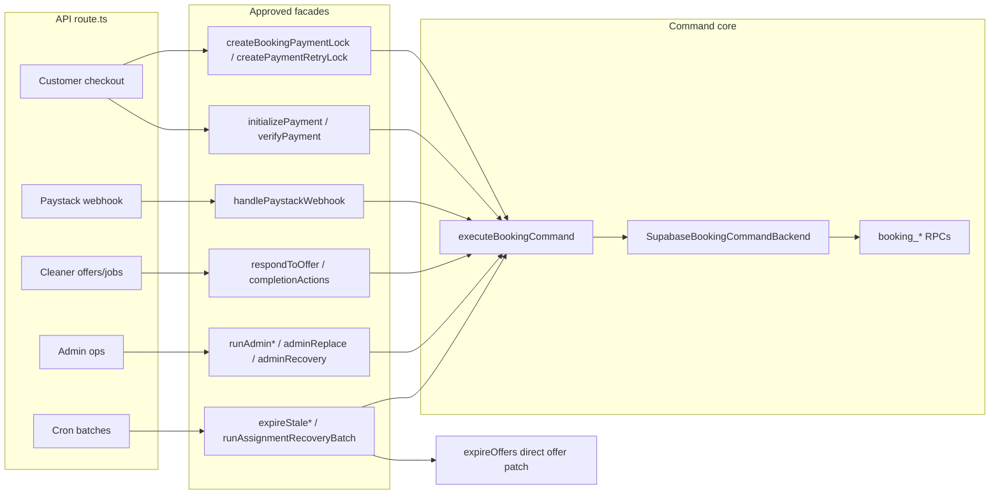

# Stage 5B-2b — Mutation Route Command Boundary Assertions (Design)

**Date:** 2026-05-17  
**Status:** Design only — **no implementation**  
**Depends on:** [stage-5b-2-command-boundary-guard-audit.md](../audits/stage-5b-2-command-boundary-guard-audit.md), [command-boundary-static-guards.md](../security/command-boundary-static-guards.md) (5B-2a)

**Goal:** Design static, runtime-light tests that prove **mutating API routes** delegate to approved command/service facades — not direct lifecycle table writes — without changing production behavior.

**Constraints (unchanged):** No RLS changes, no route refactors, no payment finalize / accept semantics / earnings formula changes, no `ADMIN_OVERRIDE_STATUS` exposure.

---

## Executive summary

| Decision | Recommendation |
|----------|----------------|
| Test style | **Static source assertions** on `route.ts` files (no HTTP integration in 5B-2b) |
| Source of truth | Single **`mutationRouteBoundaryManifest.ts`** shared with allowlist tests where possible |
| What routes assert | **Required facade import** + **forbidden patterns** (direct table DML, service role in wrong routes) |
| What routes skip | Read-only POST aliases (`pricing/quote`, cleaner eligibility POST-as-GET) |
| Cron | **Separate policy**: may import `createServiceRoleClient`; must call approved batch orchestrator |
| Webhook | **Separate policy**: must call `handlePaystackWebhook` only; route must **not** import service role |
| Brittleness mitigation | Assert **facade names**, not `executeBookingCommand` in every route file |
| Smallest slice (5B-2b) | Manifest + one guard test file + webhook allowlist test; docs cross-link |

---

## Relationship to Stage 5B-2a

| 5B-2a (done) | 5B-2b (this design) |
|--------------|---------------------|
| Table-level: no direct `payments.status` / `assignment_offers.status` patches in `src/` | Route-level: mutation routes must import approved facades |
| Service-role **module** registry | Service-role **route** policy (cron only) |
| POST route **existence** allowlists | POST route **boundary** assertions per route file |

5B-2b does not duplicate table guards; it closes the gap where a new route could call `createServiceRoleClient()` and `.from("payments").update(...)` directly (today no API route does — keep it that way).

---

## 1. Mutation route inventory

### HTTP methods in `src/app/api`

There are **no `PATCH`, `PUT`, or `DELETE`** handlers under `src/app/api` today. Governance focuses on **`POST`** (plus noting **`GET`** twins on cron/verify/cleaners).

### Lifecycle-mutating POST routes (17)

| Route file | Auth | Lifecycle impact | Approved facade (must import) |
|------------|------|------------------|--------------------------------|
| `bookings/lock/route.ts` | Customer | `CREATE_BOOKING_DRAFT`, lock row | `createBookingPaymentLock` |
| `bookings/[bookingId]/payment-retry-lock/route.ts` | Customer | `MARK_PAYMENT_PENDING` (retry), lock | `createPaymentRetryLock` |
| `paystack/initialize/route.ts` | Customer | `MARK_PAYMENT_PENDING` | `initializePayment` |
| `paystack/verify/route.ts` | Customer | `FINALIZE_PAYMENT_SUCCESS` (+ assignment orchestration) | `verifyPayment` |
| `paystack/webhook/route.ts` | HMAC | Finalize / failure commands | `handlePaystackWebhook` |
| `cleaner/offers/[offerId]/accept/route.ts` | Cleaner | `ACCEPT_CLEANER_ASSIGNMENT` | `acceptCleanerOffer` (+ `createBookingCommandBackend`) |
| `cleaner/offers/[offerId]/decline/route.ts` | Cleaner | `DECLINE_CLEANER_ASSIGNMENT` + follow-up | `declineCleanerOffer`, `handleOfferDeclinedFollowUp` |
| `cleaner/jobs/[bookingId]/start/route.ts` | Cleaner | `MARK_BOOKING_IN_PROGRESS` | `startCleanerJob` |
| `cleaner/jobs/[bookingId]/complete/route.ts` | Cleaner | `MARK_BOOKING_COMPLETED`, earnings | `completeCleanerJob` |
| `admin/bookings/[bookingId]/payout-ready/route.ts` | Admin | `MARK_BOOKING_PAYOUT_READY` | `markBookingPayoutReadyAdmin` |
| `admin/bookings/[bookingId]/mark-paid-out/route.ts` | Admin | `MARK_BOOKING_PAID_OUT` | `markBookingPaidOutAdmin` |
| `admin/bookings/[bookingId]/dispatch-offer/route.ts` | Admin | `OFFER_TO_CLEANER` (admin actor) | `runAdminManualDispatchOffer` |
| `admin/bookings/[bookingId]/replace-open-offer/route.ts` | Admin | `CANCEL_OPEN_ASSIGNMENT_OFFER` + `OFFER_TO_CLEANER` | `runAdminReplaceOpenOffer` |
| `admin/bookings/[bookingId]/recover-assignment/route.ts` | Admin | `runAssignmentAfterPayment` engine | `runAdminSingleBookingAssignmentRecovery` |
| `cron/expire-pending-payments/route.ts` | `CRON_SECRET` | `MARK_PAYMENT_FAILED` batch | `expireStalePendingPayments` |
| `cron/expire-assignment-offers/route.ts` | `CRON_SECRET` | Offer expiry + command follow-up | `expireStaleAssignmentOffers` |
| `cron/recover-assignment-after-payment/route.ts` | `CRON_SECRET` | Assignment recovery batch | `runAssignmentRecoveryBatch` |

**Downstream command/RPC spine (for reviewers, not asserted in route file):**

```text
Facades → executeBookingCommand / createBookingCommandBackend → SupabaseBookingCommandBackend → booking_* RPCs
Payment facades → requireServiceRoleClient (inside feature modules, not routes)
expireStaleAssignmentOffers → direct offer status update (approved exception) → processBookingAfterOfferExpiry → commands
```

### Read-only POST routes (3) — POST used as GET alias

| Route file | Behavior | Lifecycle? |
|------------|----------|--------------|
| `pricing/quote/route.ts` | `calculateQuote` only | **No** |
| `cleaners/available/route.ts` | `getAvailableCleaners` (reads + eligibility) | **No** booking/payment mutation |
| `booking/cleaners/route.ts` | `getBookingCleaners` | **No** |

These should appear on a **`READ_ONLY_POST_ROUTES`** list so boundary tests **do not** require command facades. Optional separate test: assert they **never** import lifecycle facades or service role.

### Non-API mutation entry points (out of 5B-2b scope, documented)

| Entry | Notes |
|-------|-------|
| `src/app/(customer)/customer/setup/actions.ts` | `ensure_customer_provisioned` RPC — provisioning, not booking lifecycle |
| `src/app/payment/success/*` | Already guarded by `PaymentSuccessVerifier.test.ts` (no `executeBookingCommand` in page) |
| Ops scripts | Covered by 5B-2a service-role registry |

---

## 2. Approved boundary map

High-level: routes are **thin HTTP adapters**; boundaries live in `@/features/*`.



### Facade → command mapping (reference)

| Facade module | Commands / orchestration invoked |
|---------------|----------------------------------|
| `createBookingPaymentLock` | `CREATE_BOOKING_DRAFT`; `booking_locks` insert (service role) |
| `createPaymentRetryLock` | `MARK_PAYMENT_PENDING`; lock reuse |
| `initializePayment` | `MARK_PAYMENT_PENDING`; `payment_link_expires_at` patch (infra) |
| `verifyPayment` | `processPaystackChargeSuccess` → `finalizePaidBooking` → `FINALIZE_PAYMENT_SUCCESS` |
| `handlePaystackWebhook` | `processPaystackChargeSuccess` / `processPaystackChargeFailure` |
| `acceptCleanerOffer` / `declineCleanerOffer` | `ACCEPT_*` / `DECLINE_*` |
| `handleOfferDeclinedFollowUp` | `processBookingAfterOfferEnded` → commands |
| `startCleanerJob` / `completeCleanerJob` | `MARK_BOOKING_IN_PROGRESS` / `MARK_BOOKING_COMPLETED` |
| `markBookingPayoutReadyAdmin` / `markBookingPaidOutAdmin` | `MARK_BOOKING_PAYOUT_READY` / `MARK_BOOKING_PAID_OUT` |
| `runAdminManualDispatchOffer` | `createAdminDispatchOffer` → `OFFER_TO_CLEANER` |
| `runAdminReplaceOpenOffer` | `createAdminCancelOpenOffer` + `createAdminDispatchOffer` |
| `runAdminSingleBookingAssignmentRecovery` | `recoverAssignmentForBooking` → `runAssignmentAfterPayment` |
| `expireStalePendingPayments` | `MARK_PAYMENT_FAILED` per row |
| `expireStaleAssignmentOffers` | Direct offer `expired` + `processBookingAfterOfferExpiry` |
| `runAssignmentRecoveryBatch` | `runAssignmentAfterPayment` per candidate |

---

## 3. Exception map

| Exception | Where | Why valid | Route test treatment |
|---------|-------|-----------|----------------------|
| Offer cron direct status update | `expireOffers.ts` (called from cron route) | Documented in 5B-2a; row guard `status = offered` | Route must import `expireStaleAssignmentOffers`, **not** duplicate DML in `route.ts` |
| Service role in cron `route.ts` | 3 cron routes | Batch jobs need bypass RLS; client passed into orchestrators | `mayImportServiceRole: true` on cron manifest entries only |
| Service role inside payment/lock facades | `initializePayment`, `finalizePaidBooking`, etc. | Hidden from routes | Routes must **not** import `@/lib/supabase/serviceRole` |
| `payment_link_expires_at` patch | `initializePayment` | Non-status infra field | Not visible at route layer |
| Admin pre-flight reads | `adminManualDispatchOffer`, etc. | Eligibility checks before commands | Encapsulated in facade; route stays thin |
| Read-only POST | quote / cleaners | Client convenience | Excluded from mutation manifest |
| `createBookingCommandBackend` in cleaner accept/decline routes | Cleaner routes | Backend injection for `respondToOffer` | Allow as optional second import alongside `acceptCleanerOffer` / `declineCleanerOffer` |

**Invalid exceptions (never allow in route files):**

- `executeBookingCommand` with `ADMIN_OVERRIDE_STATUS`
- Direct `.from("bookings"|"payments"|"assignment_offers"|"earning_lines")` in `src/app/api/**/route.ts`
- `createServiceRoleClient` in customer, cleaner, admin, paystack (except cron) route files

---

## 4. Service-role import policy

### Routes that **may** import service role

| Route | Import | Pass client to |
|-------|--------|----------------|
| `cron/expire-pending-payments/route.ts` | `createServiceRoleClient` | `expireStalePendingPayments(client, backend)` |
| `cron/expire-assignment-offers/route.ts` | `createServiceRoleClient` | `expireStaleAssignmentOffers(client, backend)` |
| `cron/recover-assignment-after-payment/route.ts` | `createServiceRoleClient` | `runAssignmentRecoveryBatch(client, backend)` |

All three also import `createBookingCommandBackend` — acceptable.

### Routes that **must never** import service role

- All **customer** mutation routes (`bookings/*`, `paystack/initialize`, `paystack/verify`)
- All **cleaner** mutation routes
- All **admin** mutation routes
- **`paystack/webhook/route.ts`** — service role stays inside `finalizePaidBooking` / `processPaystackChargeFailure`

### Feature modules (not route-tested in 5B-2b)

Already on [5B-2a service-role registry](../security/command-boundary-static-guards.md). Route tests add the rule: **lifecycle mutation must not start in `route.ts` via service role** except cron.

---

## 5. Read-only POST policy

**Problem:** `POST /api/cleaners/available` and `POST /api/booking/cleaners` mirror GET for clients that prefer JSON bodies. They are **not** lifecycle mutations.

**Design:**

1. Maintain `READ_ONLY_POST_ROUTES` in manifest.
2. Assert **forbidden** on those routes:
   - `executeBookingCommand`, `createBookingCommandBackend`
   - `initializePayment`, `finalizePaidBooking`, `handlePaystackWebhook`
   - `createServiceRoleClient`, `requireServiceRoleClient`
   - `.from("bookings")`, `.from("payments")`, etc.
3. Assert **required** import: `calculateQuote` or `getAvailableCleaners` / `getBookingCleaners` respectively.

**Optional later:** rename to GET-only in API docs (behavior change — not 5B-2b).

---

## 6. Proposed tests (static / runtime-light)

### 6.1 Single manifest (recommended)

**File:** `src/tests/security/mutationRouteBoundaryManifest.ts`

```ts
export type MutationRouteRule = {
  /** Path under src/app/api, e.g. "bookings/lock/route.ts" */
  routeFile: string;
  category: "customer" | "cleaner" | "admin" | "paystack" | "cron";
  /** At least one must match route source */
  requiredFacadeImports: string[];
  /** If true, route may import @/lib/supabase/serviceRole */
  mayImportServiceRole?: boolean;
};

export const MUTATION_ROUTE_RULES: MutationRouteRule[] = [ /* 17 entries */ ];
export const READ_ONLY_POST_ROUTE_RULES = [ /* 3 entries */ ];
```

**File:** `src/tests/security/mutationRouteBoundaryGuard.test.ts`

For each `MUTATION_ROUTE_RULES` entry:

1. Read `src/app/api/${routeFile}`.
2. **Assert** `requiredFacadeImports` some match `from "@/features/.../${name}"` or `from '...'`.
3. **Assert** `mayImportServiceRole` — if false/undefined, source must not match `from "@/lib/supabase/serviceRole"`.
4. **Assert forbidden patterns** (shared):
   - `/\.from\s*\(\s*["'](bookings|payments|assignment_offers|earning_lines)["']\s*\)/`
   - `/executeBookingCommand\s*\(/` in route file (force facade indirection)
   - `/ADMIN_OVERRIDE_STATUS/`

For `READ_ONLY_POST_ROUTE_RULES`:

- Invert: must **not** import mutation facades; must import read facade.

**Coherence with 5B-2a allowlists:**

- Test that every file in `ALLOWED_CUSTOMER_POST_ROUTES` (+ paystack subpaths) has a manifest entry and vice versa (mutation subset).
- Same for cleaner, cron, admin.

### 6.2 Paystack webhook allowlist (dedicated small test)

**File:** `src/app/api/paystack/paystackMutationRoutes.test.ts`

```ts
const ALLOWED_PAYSTACK_POST_MUTATION = ["webhook/route.ts", "initialize/route.ts", "verify/route.ts"];
```

Ensures new `paystack/*/route.ts` POST handlers are reviewed (webhook vs customer payment).

### 6.3 Optional: facade re-export guard (5B-2c+)

Static test on **facade modules** (not routes): e.g. `initializePayment.ts` must call `executeBookingCommand` or `runBookingCommand`. Deferred — higher churn, routes are the security perimeter for HTTP.

### 6.4 What we explicitly do **not** do in 5B-2b

| Approach | Why defer |
|----------|-----------|
| HTTP integration calling routes | Slow, env-heavy; not “runtime-light” |
| Mocking Supabase in route tests | Duplicates feature tests |
| Asserting full call graph | Brittle |
| Vitest `import()` route handlers + spy on `executeBookingCommand` | Runtime coupling; save for targeted route integration if needed |

---

## 7. Cron route policy (separate rules)

| Rule | Detail |
|------|--------|
| Auth | Must reference `verifyCronSecret` in route source |
| Service role | **Allowed** in `route.ts` only for the 3 cron paths |
| Facade | Must call exactly one batch orchestrator per route |
| Direct DML in route | **Forbidden** — even offer expiry must stay in `expireOffers.ts` |
| GET + POST | Both allowed for manual/pg_net invoke; boundary rules apply to shared handler body |

**Manifest flags:** `category: "cron"`, `mayImportServiceRole: true`.

---

## 8. Webhook route policy (separate rules)

| Rule | Detail |
|------|--------|
| Entry | `handlePaystackWebhook` only |
| No service role in route | Finalize/failure modules own `requireServiceRoleClient` |
| No JSON command construction in route | No `executeBookingCommand({ type: "FINALIZE_...` in route file |
| Signature | Route delegates to handler that calls `verifyPaystackWebhookSignature` |
| Allowlist | Dedicated paystack POST mutation list (webhook + initialize + verify) |

**Failure modes caught:**

- New `paystack/foo/route.ts` that calls `finalizePaidBooking` directly without webhook mapping layer.
- Webhook route importing service role for “quick fix”.

---

## 9. Avoiding brittle tests

| Risk | Mitigation |
|------|------------|
| Requiring `executeBookingCommand` in every route | Require **facade** imports only; command usage stays in features |
| Manifest drift vs allowlist tests | `mutationRouteBoundaryGuard.test.ts` cross-checks manifest ↔ 5B-2a allowlist sets |
| Comment/string false positives | Match import lines with regex `from ["']@/features/...` not bare substring search for command names in comments |
| Refactor moving facade path | Update one manifest entry; single PR review |
| Legitimate new route | Add manifest row + allowlist entry + registry if new service-role module |

**Anti-pattern:** Snapshot entire `route.ts` files.

**Preferred:** Declarative manifest reviewed in PR template checklist.

---

## 10. Audit question answers

| # | Question | Answer |
|---|----------|--------|
| 1 | Which routes mutate lifecycle state? | 17 POST routes — see §1 table; no PATCH/DELETE |
| 2 | Which boundary per route? | See §2 facade map |
| 3 | Which routes may use service role directly? | **Cron routes only** (3); feature modules elsewhere |
| 4 | Which routes must never import service role? | Customer, cleaner, admin, paystack webhook/initialize/verify routes |
| 5 | Read-only POST? | `pricing/quote`, `cleaners/available`, `booking/cleaners` |
| 6 | Which tests assert command imports? | Assert **facade** imports, not raw `executeBookingCommand` in routes |
| 7 | Valid exceptions? | §3 — expireOffers via cron facade; service role in cron routes only |
| 8 | Avoid brittleness? | §9 — manifest + facade-first |
| 9 | Cron separate rules? | §7 — yes |
| 10 | Webhook separate rules? | §8 — yes |

---

## Risks and mitigations

| Risk | Impact | Mitigation |
|------|--------|------------|
| Developer bypasses route layer (Server Action) | Medium | Document non-API entry points; optional 5B-2c Server Action scan |
| Facade grows direct DML | High | 5B-2a table guards remain backstop |
| Manifest out of date | Medium | Cross-test with allowlists; PR checklist |
| False sense of security | Medium | Docs state: static guards ≠ RLS; 5B-3+ still needed |
| Over-restricting cron | Low | Explicit `mayImportServiceRole` flag |

---

## Things not to touch (5B-2b implementation)

- Payment finalize RPC and `finalizePaidBooking` body
- `ACCEPT_CLEANER_ASSIGNMENT` semantics
- `recordEarningsForBooking` / payout amounts
- `expireOffers.ts` implementation
- RLS policies
- Route handler behavior and response shapes
- `ADMIN_OVERRIDE_STATUS`

---

## Final recommendation: smallest safe implementation slice for 5B-2b

**Ship in one PR (detection-only, ~3 files + doc link):**

### Slice 5B-2b (minimal)

1. **`src/tests/security/mutationRouteBoundaryManifest.ts`**
   - `MUTATION_ROUTE_RULES` (17 rows)
   - `READ_ONLY_POST_ROUTE_RULES` (3 rows)
   - Shared `FORBIDDEN_ROUTE_PATTERNS` constant

2. **`src/tests/security/mutationRouteBoundaryGuard.test.ts`**
   - Validates every manifest route file on disk
   - Forbidden patterns + service-role policy
   - Cross-check: manifest mutation routes = union of admin + customer + cleaner + cron allowlists (+ paystack webhook/initialize/verify)

3. **`src/app/api/paystack/paystackPostRoutes.test.ts`** (or fold into guard test)
   - Allowlist: `initialize`, `verify`, `webhook` only under `paystack/**/route.ts` POST

4. **Docs:** Update [command-boundary-static-guards.md](../security/command-boundary-static-guards.md) with “Route boundary assertions (5B-2b)” section and link to this design.

**Explicitly defer to 5B-2c+:**

- Facade-internal `executeBookingCommand` assertions
- Server Action / `app/(customer)` boundary scan
- Route integration tests with mocked auth
- Actor-policy tightening (`admin` on accept)
- Command import requirements inside `adminManualDispatchOffer.ts` etc.

**Why this slice:** It proves the **HTTP perimeter** delegates to known facades with the same risk profile as 5B-2a (zero runtime change), closes the “new route + service role + direct `.from()`” foot-gun, and stays maintainable via one manifest file.

---

## References

- 5B-2a audit: [stage-5b-2-command-boundary-guard-audit.md](../audits/stage-5b-2-command-boundary-guard-audit.md)
- Static guards doc: [command-boundary-static-guards.md](../security/command-boundary-static-guards.md)
- Command layer: [booking-command-execution-layer.md](./booking-command-execution-layer.md)
- Admin POST allowlist: `src/app/api/admin/adminApiRoutes.test.ts`
- Cleaner read-only precedent: `src/features/cleaners/server/apiRoutes.test.ts`
