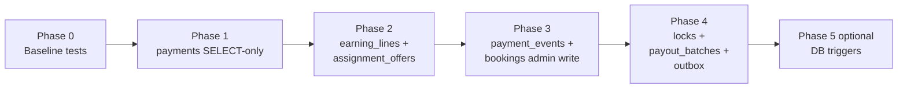

# Stage 5B-3 — RLS Tightening Design

**Date:** 2026-05-17  
**Status:** Design — **Phase 1 (5B-3a) implemented** in migration `20260518140000_rls_payments_admin_select_only.sql`; later phases not yet applied  
**Depends on:** [stage-5a-security-governance-audit.md](../audits/stage-5a-security-governance-audit.md), [stage-5b-2-command-boundary-guards-final-audit.md](../audits/stage-5b-2-command-boundary-guards-final-audit.md), [command-boundary-static-guards.md](../security/command-boundary-static-guards.md)

**Goal:** Design a **safe, staged** plan to narrow admin `FOR ALL` RLS policies on lifecycle-sensitive tables, closing the **PostgREST bypass** gap identified in Stage 5A, without breaking `executeBookingCommand`, `booking_*` RPCs, service-role orchestration, cron paths, Paystack finalize/failure, cleaner accept/decline, or `expireOffers`.

**Hard constraints (this stage):**

- Do **not** change `booking_finalize_payment_success`, `booking_record_payment_failure`, or `booking_apply_transition` bodies or grants.
- Do **not** change assignment **accept** semantics or cleaner offer field guard.
- Do **not** change earnings **formulas** (`recordEarningsForBooking`, amount splits).
- Do **not** expose `ADMIN_OVERRIDE_STATUS` via new policies or APIs.

---

## Executive summary

| Finding | Implication |
|---------|-------------|
| **12 tables** use admin `FOR ALL` (or equivalent) today | Primary latent risk: compromised **admin JWT** + PostgREST |
| Production admin **writes** already go through **service role** + commands | Narrowing admin RLS should **not** break current app routes |
| Admin **reads** use `createSupabaseServerClient()` (user JWT) | Must **retain admin `SELECT`** on operational tables |
| `service_role` **bypasses RLS** | Command/RPC/cron/lock/Paystack paths keep working after policy drops |
| `bookings.status` already blocked for authenticated | `bookings_admin_write` `FOR ALL` is redundant for status; still allows metadata tamper |
| No `cleaner_payouts` table | Payout data lives in **`earning_lines`** + **`payout_batches`** |

**Recommendation:** First implementation slice = **`payments` admin write removal** (SELECT-only for admin) + integration tests proving admin cannot patch `payments.status`. Defer DB triggers on `payments.status` to a later optional slice (5B-2f).

---

## 1. Current RLS map

**Sources:** `20260516160000_rls_role_security.sql`, `20260516190000_booking_payment_lock.sql`, `20260516210000_phase10_earnings_payouts.sql`, `20260518120000_admin_operational_audit.sql`, `20260516180000_cleaner_availability_eligibility.sql`

### Lifecycle & audit tables (in scope)

| Table | RLS | Customer | Cleaner | Admin authenticated | Service role | Triggers / notes |
|-------|-----|----------|---------|---------------------|--------------|------------------|
| `bookings` | Yes | `select` own; `update` own row (non-status fields) | `select` via offer/assignment | **`FOR ALL`** (`bookings_admin_write`) + `select` | Bypasses RLS | `guard_booking_status_change` blocks authenticated **status** |
| `payments` | Yes | `select` via booking ownership | — | **`FOR ALL`** + `select` | Bypasses RLS | No status trigger |
| `payment_events` | Yes | `select` via payment | — | **`FOR ALL`** + `select` | Bypasses RLS | Webhook inserts via service role |
| `assignment_offers` | Yes | `select` own booking | `select` own; **`update` own** (response fields) | **`FOR ALL`** + `select` | Bypasses RLS | `guard_assignment_offer_cleaner_update` (cleaner only) |
| `earning_lines` | Yes | — (customer policy dropped phase 10) | `select` own | **`FOR ALL`** + `select` | Bypasses RLS | Comment: app-only writes |
| `payout_batches` | Yes | — | — | **`FOR ALL`** | Bypasses RLS | No app mutation routes today |
| `booking_locks` | Yes | `select` own (+ admin read) | — | **`FOR ALL`** | **`ALL` granted** | Inserts via service role only in app |
| `booking_state_audit` | Yes | `select` | `select` | `select` | Bypasses RLS | **No insert** policy for `authenticated`; append-only trigger |
| `admin_operational_audit` | Yes | — | — | **`select` only** | **`insert` granted** | Append-only trigger; writes service role only |

### Admin `FOR ALL` inventory (question 1)

| # | Table | Policy name | Migration |
|---|-------|-------------|-----------|
| 1 | `services` | `services_admin_write` | `20260516160000` |
| 2 | `bookings` | `bookings_admin_write` | `20260516160000` |
| 3 | `payments` | `payments_admin_write` | `20260516160000` |
| 4 | `payment_events` | `payment_events_admin_write` | `20260516160000` |
| 5 | `assignment_offers` | `assignment_offers_admin_write` | `20260516160000` |
| 6 | `earning_lines` | `earning_lines_admin_write` | `20260516160000` |
| 7 | `notification_outbox` | `notification_outbox_admin` | `20260516160000` |
| 8 | `booking_locks` | `booking_locks_admin_write` | `20260516190000` |
| 9 | `payout_batches` | `payout_batches_admin` | `20260516210000` |
| 10–13 | `cleaner_service_areas`, `cleaner_service_capabilities`, `cleaner_availability`, `cleaner_time_off` | `*_admin_write` | `20260516180000` |

**Not `FOR ALL` (already tighter):** `profiles`, `customers`, `cleaners` (scoped insert/delete/update), all `booking_state_audit` / `admin_operational_audit` policies.

### RPC / role grants (unchanged in 5B-3 design)

| Function | Execute granted to |
|----------|-------------------|
| `booking_apply_transition` | `service_role` only |
| `booking_finalize_payment_success` | `service_role` only |
| `booking_record_payment_failure` | `service_role` only |

`REVOKE ALL FROM public` on these functions — **do not alter** in 5B-3.

---

## 2. Risk table by table

| Table | Latent bypass today | App path today | Target risk after tightening |
|-------|---------------------|----------------|------------------------------|
| `payments` | Admin sets `status=paid`, amount | Service role + RPC | **Low** (PostgREST closed) |
| `earning_lines` | Admin sets `payout_status`, amounts | Service role via command backend | **Low** |
| `assignment_offers` | Admin fake accept / reassign | Service role commands + cleaner RLS update | **Low** (admin); cleaner path unchanged |
| `payment_events` | Forge events | Service role webhook path | **Low** |
| `bookings` | Admin metadata/price tamper (`status` blocked) | Commands + customer update policy | **Low–medium** (metadata still via customer policy scope) |
| `booking_locks` | Admin lock tamper | Service role lock repo | **Low** |
| `payout_batches` | Admin batch tamper | None in API | **Low** |
| `booking_state_audit` | — | RPC / service role insert | **Already low** |
| `admin_operational_audit` | — | Service role insert | **Already low** |
| `services` / `notification_outbox` / cleaner eligibility | Catalog / ops config tamper | Mixed | **Out of slice 1** — lower lifecycle impact |

---

## 3. Proposed target policy by table

Legend: **S** = `SELECT` for `authenticated` admin via `auth_is_admin()`; **—** = no authenticated write; **SR** = writes via `service_role` (bypasses RLS).

| Table | Target admin (`authenticated`) | Target customer | Target cleaner | Writes |
|-------|------------------------------|-----------------|----------------|--------|
| `payments` | **S only** (drop `FOR ALL`) | S (existing) | — | **SR only** |
| `earning_lines` | **S only** | — | S (existing) | **SR only** |
| `assignment_offers` | **S only** | S (existing) | S + **UPDATE** (existing, unchanged) | Inserts/offer lifecycle: **SR**; accept/decline: **cleaner JWT** |
| `payment_events` | **S only** | S (existing) | — | **SR only** |
| `bookings` | **S only** (drop `bookings_admin_write`) | S + UPDATE own (existing) | S (existing) | Status: **RPC**; other booking writes: **SR** / commands |
| `booking_locks` | **S only** (optional: keep admin read in customer policy) | S (existing) | — | **SR only** |
| `payout_batches` | **S only** | — | — | **SR only** (future) |
| `booking_state_audit` | S (no change) | S | S | **SR / RPC only** |
| `admin_operational_audit` | S (no change) | — | — | **SR insert only** |
| `notification_outbox` | Defer or **S only** | — | — | **SR** when sending |

**Explicit non-goals for 5B-3:** Changing `services` / cleaner eligibility admin `FOR ALL` (operational config, not payment/assignment lifecycle).

---

## 4. Admin UI reads vs writes (questions 2–3)

### What admin UI actually needs (reads)

`adminOperationsReadModel.ts` and admin pages use **`createSupabaseServerClient()`** — admin **JWT** + RLS:

| Data | Tables read | Required policy |
|------|-------------|-----------------|
| Booking lists / detail | `bookings`, `payments`, `assignment_offers` | Admin **SELECT** (already present) |
| Audit timeline | `booking_state_audit` | Admin **SELECT** |
| Operational audit panel | `admin_operational_audit` | Admin **SELECT** |
| Earnings / payout display | `earning_lines` | Admin **SELECT** |

**Verified:** No `.insert` / `.update` / `.delete` in `src/app/(admin)` or `src/features/dashboards` — admin UI is **read-only** at the DB layer; mutations go through **API routes** → commands → **service role**.

### Admin policies that can be removed (writes)

| Policy to drop | Safe because |
|----------------|--------------|
| `payments_admin_write` | All payment lifecycle via command backend + RPC |
| `earning_lines_admin_write` | Payout transitions via `SupabaseBookingCommandBackend` + RPC |
| `assignment_offers_admin_write` | Offers via `OFFER_TO_CLEANER` / cancel commands (SR); not admin JWT |
| `payment_events_admin_write` | Events recorded server-side (webhook / SR) |
| `bookings_admin_write` | Admin transitions via commands; status already trigger-blocked |
| `booking_locks_admin_write` | Locks created/consumed only via SR in lock facades |
| `payout_batches_admin_write` | No production write path with admin JWT |

**Keep unchanged:** All `*_select_*` policies; `assignment_offers_update_cleaner`; customer booking/payment select/update; `profiles` / `customers` / `cleaners` admin provisioning policies.

---

## 5. Command / RPC compatibility (question 4)

All production **lifecycle writes** use `createBookingCommandBackend()` → `createServiceRoleClient()` → **`SupabaseBookingCommandBackend`**, which bypasses RLS.

| Flow | Command / module | Persistence | RLS impact of admin write drop |
|------|------------------|-------------|--------------------------------|
| Draft / pending payment | `CREATE_BOOKING_DRAFT`, `MARK_PAYMENT_PENDING` | SR + `booking_apply_transition` | None |
| Paystack success | `FINALIZE_PAYMENT_SUCCESS` | `booking_finalize_payment_success` RPC | None |
| Paystack failure | `MARK_PAYMENT_FAILED` | `booking_record_payment_failure` RPC | None |
| Accept / decline | `ACCEPT_*`, `DECLINE_*` | SR `updateOffer` / `applyTransition` | None |
| Job start / complete | `MARK_BOOKING_IN_PROGRESS`, `MARK_BOOKING_COMPLETED` | RPC | None |
| Admin payout | `MARK_BOOKING_PAYOUT_READY`, `MARK_BOOKING_PAID_OUT` | RPC + `earning_lines` via backend | None |
| Admin dispatch / replace | `OFFER_TO_CLEANER`, `CANCEL_OPEN_ASSIGNMENT_OFFER` | SR insert/update offer | None |
| Recovery | `runAssignmentAfterPayment` | SR commands | None |
| Cron expire payments | `MARK_PAYMENT_FAILED` per row | SR | None |
| Attention / metadata | `RECORD_ASSIGNMENT_ATTENTION`, `updateBookingMetadata` | SR | None |

**`ADMIN_OVERRIDE_STATUS`:** Remains command-layer only; no RLS policy should grant equivalent access to `authenticated`.

---

## 6. Service-role compatibility (question 4 continued)

| Path | Client | RLS |
|------|--------|-----|
| `runBookingCommand` / all API mutation facades | Service role | Bypass |
| `initializePayment` / `verifyPayment` / Paystack processors | Service role | Bypass |
| `createBookingPaymentLock` / `createPaymentRetryLock` | Service role | Bypass |
| Cron routes (`expire-*`, `recover-*`) | Service role passed into facades | Bypass |
| `expireOffers.ts` direct offer update | Service role (from cron route) | Bypass |
| `recordAdminOperationalAudit` | Service role | Bypass |
| Ops scripts (`recoverAssignmentAfterPayment`, repair) | Service role | Bypass |
| Integration tests / E2E helpers | Service role | Bypass |

**No migration in 5B-3 should revoke `service_role` table grants** on lifecycle tables. Current pattern: `GRANT ALL` or insert/update to `service_role` on selected tables (e.g. `booking_locks`).

---

## 7. Path-specific compatibility (questions 8–11)

### Payout actions (8)

```
POST admin/.../payout-ready  → markBookingPayoutReadyAdmin
  → executeBookingCommand(MARK_BOOKING_PAYOUT_READY)
  → booking_apply_transition + markBookingEarningsPayoutReady (SR → earning_lines)
```

Admin JWT is used only for **auth** in the route handler; **not** for `earning_lines` updates. Dropping `earning_lines_admin_write` is safe.

### Paystack finalize / failure (9)

```
Webhook / verify → processPaystackChargeSuccess | Failure
  → finalizePaidBooking | executeBookingCommand(MARK_PAYMENT_FAILED)
  → booking_finalize_payment_success | booking_record_payment_failure (SR RPC)
```

No admin or customer JWT on payment status. Dropping `payments_admin_write` is safe.

**Preserved exception:** `initializePayment` patches `payment_link_expires_at` via **service role** (not `status`) — unaffected.

### Assignment accept / decline (10)

```
Cleaner JWT → POST accept|decline → executeBookingCommand (backend still SR)
```

**Clarification:** Route uses user session for **authorization**; **persistence** uses service role backend. Cleaner **direct** RLS path also exists for offer row updates:

```
assignment_offers_update_cleaner  -- MUST NOT CHANGE
```

Do **not** remove or narrow cleaner update policy in 5B-3.

### `expireOffers` (11)

```
Cron route (SR client) → expireStaleAssignmentOffers
  → direct .update(assignment_offers) where status = offered
  → processBookingAfterOfferExpiry → commands
```

Runs as **service role** — unaffected by admin policy removal. Documented exception remains valid ([command-boundary-static-guards.md](../security/command-boundary-static-guards.md)).

---

## 8. Cleaner / customer policies (question 7)

| Policy group | Action in 5B-3 |
|--------------|----------------|
| `bookings_select_*`, `bookings_update_customer` | **Keep** |
| `payments_select_customer` | **Keep** |
| `assignment_offers_select_customer` | **Keep** |
| `assignment_offers_select_cleaner`, `assignment_offers_update_cleaner` | **Keep** |
| `earning_lines_select_cleaner` | **Keep** |
| `booking_state_audit_select_*` | **Keep** |
| `booking_locks_select_customer` | **Keep** |

---

## 9. Tables: SELECT-only vs no authenticated writes (questions 5–6)

| Table | Admin needs SELECT? | Authenticated writes allowed after tighten |
|-------|-------------------|---------------------------------------------|
| `payments` | Yes | **None** (customer read-only) |
| `earning_lines` | Yes | **None** (cleaner read-only) |
| `assignment_offers` | Yes | **Cleaner UPDATE only** (response fields) |
| `payment_events` | Yes (support) | **None** |
| `bookings` | Yes | Customer UPDATE own row; **no admin write** |
| `booking_locks` | Optional read | **None** |
| `payout_batches` | If admin UI added later | **None** until product needs it |
| `booking_state_audit` | Yes | **None** (already) |
| `admin_operational_audit` | Yes | **None** (already) |

---

## 10. Staged migration plan



| Phase | Migration content | Risk | Rollback |
|-------|-------------------|------|----------|
| **0** | No policy change; add verification tests | None | N/A |
| **1** | `DROP POLICY payments_admin_write`; confirm `payments_select_admin` | **Lowest** | Recreate `FOR ALL` policy from `20260516160000` |
| **2** | Drop `earning_lines_admin_write`, `assignment_offers_admin_write` | Low | Recreate both policies |
| **3** | Drop `payment_events_admin_write`, `bookings_admin_write` | Low | Recreate policies |
| **4** | Drop `booking_locks_admin_write`, `payout_batches_admin` (→ select if needed) | Low | Recreate policies |
| **5** (optional, **not 5B-3 min**) | `payments.status` trigger (service role exempt) | Medium | `DROP TRIGGER` |

**One migration per phase** (or one PR per phase) with focused integration tests.

**Out of scope for 5B-3:** `services`, cleaner eligibility tables, `customers`/`cleaners` admin delete — address in **5B-3b** catalog/ops config if needed.

---

## 11. SQL verification test plan (question 12)

### A. Pre-migration catalog (automated or manual)

Extend `supabase/tests/rls_role_security_checks.sql`:

1. Assert RLS enabled on lifecycle tables (existing loop + add `booking_locks`, `payout_batches`, `admin_operational_audit`).
2. Query `pg_policies` — snapshot **policy names and `cmd`** per table; fail if unexpected `FOR ALL` remains after slice.
3. Assert `booking_*` functions still `GRANT EXECUTE` to `service_role` only.

### B. Integration tests (`rls-policies.integration.test.ts`)

Add cases **before and after** each slice:

| Test | Actor | Expect |
|------|-------|--------|
| Admin cannot `UPDATE payments` set `status` | Admin JWT | Error or 0 rows (RLS) |
| Admin cannot `INSERT` into `payments` | Admin JWT | Denied |
| Admin **can** `SELECT payments` for booking | Admin JWT | Success |
| Admin cannot `UPDATE earning_lines.payout_status` | Admin JWT | Denied |
| Admin cannot `UPDATE assignment_offers` | Admin JWT | Denied |
| Cleaner **can** decline offer (status + `responded_at`) | Cleaner JWT | Success (unchanged) |
| Cleaner cannot tamper `booking_id` | Cleaner JWT | `ASSIGNMENT_OFFER_FIELD_MUTATION_FORBIDDEN` (unchanged) |
| Service role can run `booking_finalize_payment_success` | SR | Success (unchanged) |
| Customer cannot patch `bookings.status` | Customer JWT | `BOOKING_STATUS_MUTATION_FORBIDDEN` (unchanged) |

### C. Application smoke (staging)

| Scenario | Verifier |
|----------|----------|
| Customer checkout → initialize → verify | Booking `confirmed`, payment `paid` |
| Cleaner accept offer | Booking `assigned` |
| Admin dispatch / replace / recovery | Offers + booking metadata |
| Admin payout-ready → paid-out | Booking status + `earning_lines` payout_status |
| Cron expire offers / pending payments | Batch JSON ok |
| Paystack webhook test event | Idempotent finalize |

### D. Static guards (CI, no DB)

Continue running full 5B-2 guard suite — ensures no new direct status patches in app code.

---

## 12. Rollback plan (question 13)

| Step | Action |
|------|--------|
| 1 | **Detect** — integration tests or staging smoke fail on admin read or command path |
| 2 | **Apply rollback migration** — `CREATE POLICY … FOR ALL` using exact definitions from `20260516160000_rls_role_security.sql` (copy-paste per dropped policy) |
| 3 | **Verify** — re-run `rls_role_security_checks.sql` + integration tests |
| 4 | **Deploy** — no app rollback required if only RLS changed |

**Forward-fix preferred over rollback** when only a missing `SELECT` policy was forgotten — add `SELECT` without restoring `FOR ALL`.

**Feature flags:** Not required; RLS is immediate per connection. Use staging apply + tests before production.

---

## 13. Risks and mitigations

| Risk | Mitigation |
|------|------------|
| Hidden admin UI write via user JWT | Grep / audit complete — none in admin dashboards; re-grep before each slice |
| Future admin feature uses PostgREST writes | PR checklist: no admin JWT writes on lifecycle tables; use API + commands |
| Break cleaner accept/decline | Do not touch `assignment_offers_update_cleaner`; integration test per release |
| Break `expireOffers` | Cron uses SR; integration test expire batch |
| Service role key leak | Unchanged exposure; 5B-2 registry + env isolation |
| Admin cannot read ops data | Keep explicit `*_select_admin` policies; test admin SELECT after each drop |
| Supabase Studio admin testing | Admins using Table Editor with their JWT lose write — **intended**; use service role key only in controlled ops |
| `bookings` metadata tamper via customer `update` policy | Existing; out of 5B-3 min — optional later column-level guard |

---

## 14. Audit question index

| # | Answer section |
|---|----------------|
| 1 | §1 Admin `FOR ALL` inventory |
| 2 | §4 Admin UI reads |
| 3 | §4 Policies removable |
| 4 | §5–6 Command + service role |
| 5 | §9 Admin SELECT-only tables |
| 6 | §9 No authenticated writes |
| 7 | §8 Cleaner/customer unchanged |
| 8 | §7 Payout paths |
| 9 | §7 Paystack paths |
| 10 | §7 Accept/decline |
| 11 | §7 expireOffers |
| 12 | §11 SQL verification |
| 13 | §12 Rollback |
| 14 | §10 + §15 First slice |

---

## 15. Final recommendation

### Is Stage 5B-3 design ready to implement?

**Yes**, in **phases**, starting with the smallest table-level blast radius.

### Safest first RLS tightening slice (question 14)

**Phase 1 — `payments` admin write removal only**

**Migration (conceptual):**

```sql
-- 5B-3 phase 1 (illustrative — do not apply from design doc alone)
drop policy if exists payments_admin_write on public.payments;
-- payments_select_admin and payments_select_customer remain
```

**Why this slice first:**

1. **Highest latent impact** — admin PostgREST can currently mark any payment `paid` without Paystack ([5A audit](../audits/stage-5a-security-governance-audit.md)).
2. **Zero production dependency on admin JWT writes** — all payment status changes use service role + RPC ([5B-2 audit](../audits/stage-5b-2-command-boundary-guard-audit.md)).
3. **Admin dashboards only SELECT payments** — read policies already exist.
4. **Does not touch** finalize RPC, offer accept, earnings formulas, or cleaner policies.
5. **Easy to verify** — one negative integration test (`admin` cannot `update payments.status`).
6. **Easy rollback** — single `CREATE POLICY payments_admin_write … FOR ALL` restore.

**Ship with Phase 1 (done — 5B-3a):**

- Migration SQL file `20260518140000_rls_payments_admin_select_only.sql`
- Extended `rls-policies.integration.test.ts` (admin payment write denied)
- Updated `supabase/tests/rls_role_security_checks.sql` policy catalog assertion
- Note in [command-boundary-static-guards.md](../security/command-boundary-static-guards.md) cross-linking RLS phase 1

**Second slice:** `earning_lines` + `assignment_offers` admin write drop (payout + dispatch read models still work; commands unchanged).

**Defer:** `payments.status` DB trigger (optional 5B-2f), `services` / cleaner eligibility `FOR ALL`, Server Actions RLS.

---

## References

| Artifact | Path |
|----------|------|
| RLS migration | `supabase/migrations/20260516160000_rls_role_security.sql` |
| Command RPC grants | `supabase/migrations/20260515203000_booking_command_layer.sql` |
| RLS SQL checks | `supabase/tests/rls_role_security_checks.sql` |
| RLS integration tests | `src/tests/security/rls-policies.integration.test.ts` |
| Admin read model | `src/features/dashboards/server/adminOperationsReadModel.ts` |
| 5B-2 final audit | `docs/audits/stage-5b-2-command-boundary-guards-final-audit.md` |
