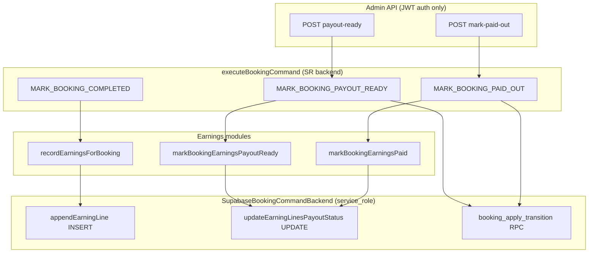

# Stage 5B-3b — earning_lines RLS Tightening (Design)

**Date:** 2026-05-17  
**Status:** Design — **Phase 5B-3b-a implemented** in `20260518150000_rls_earning_lines_admin_select_only.sql`  
**Depends on:** [stage-5b-3-rls-tightening-design.md](./stage-5b-3-rls-tightening-design.md), [stage-5b-3a payments slice](../operations/rls-tightening-rollbacks.md) (`20260518140000_rls_payments_admin_select_only.sql`), [stage-5a-security-governance-audit.md](../audits/stage-5a-security-governance-audit.md)

**Goal:** Remove **admin JWT / PostgREST write** access to `earning_lines` while preserving admin/cleaner **read** views and all **service-role / command** earning & payout flows — without changing earnings formulas, payout commands, or RPCs.

**Hard constraints:** No implementation in this stage; do not alter `recordEarningsForBooking` / `computeEarningsForBooking`, `MARK_BOOKING_PAYOUT_READY`, `MARK_BOOKING_PAID_OUT`, payment finalize, or assignment RLS.

---

## Executive summary

| Question | Answer |
|----------|--------|
| Safe to remove admin write now? | **Yes**, after **5B-3a** is applied in the target environment — same pattern as payments |
| Exact policy to drop | **`earning_lines_admin_write`** only |
| Admin reads | **Keep** `earning_lines_select_admin` |
| Cleaner reads | **Keep** `earning_lines_select_cleaner` (unchanged) |
| Customer reads | **None today** (customer policy already dropped in phase 10) |
| All writes | **Service role only** (via `SupabaseBookingCommandBackend` / tests) |
| Smallest migration | Single `DROP POLICY earning_lines_admin_write` migration + verification tests |

---

## 1. Current earning_lines RLS map

**Sources:** `20260516160000_rls_role_security.sql`, `20260516210000_phase10_earnings_payouts.sql`

| Policy | Command | Role | USING / WITH CHECK |
|--------|---------|------|-------------------|
| `earning_lines_select_cleaner` | `SELECT` | `authenticated` | `cleaner_id = auth_cleaner_id()` |
| `earning_lines_select_admin` | `SELECT` | `authenticated` | `auth_is_admin()` |
| **`earning_lines_admin_write`** | **`ALL`** | **`authenticated`** | **`auth_is_admin()`** (USING + WITH CHECK) |

**Historical note:** `earning_lines_select_customer` was **dropped** in phase 10 (`20260516210000_phase10_earnings_payouts.sql`). Customers do not read the ledger via RLS today (earnings preview comes from booking metadata / quote on dashboards).

**Related (out of 5B-3b scope):** `payout_batches` has `payout_batches_admin` **`FOR ALL`** — no app write routes; defer to a later slice if payout batch UI is added.

### Table columns relevant to RLS risk (phase 10)

| Column | Tamper risk if admin `FOR ALL` |
|--------|-------------------------------|
| `payout_status` | Mark `paid` without `MARK_BOOKING_PAID_OUT` |
| `payout_amount_cents` / `gross_amount_cents` / `amount_cents` | Ledger fraud |
| `payout_batch_id` | Link to fake batch |
| `cleaner_id` / `booking_id` | Reassign earnings |

**DB enforcement:** No trigger on `earning_lines` updates (foundation comment: app-layer until payouts phase). RLS narrowing is the right control for authenticated admin.

---

## 2. App read inventory (admin UI / API)

All production reads use **`createSupabaseServerClient()`** (admin or cleaner **JWT**, not service role).

| Consumer | Path | Query pattern | Policy used |
|----------|------|---------------|-------------|
| Admin booking detail | `adminOperationsReadModel.ts` | `SELECT` by `booking_id` | `earning_lines_select_admin` |
| Admin booking page | `(admin)/admin/bookings/[bookingId]/page.tsx` | Via read model earnings array | Admin SELECT |
| Admin payouts dashboard | `getAdminPayoutSummary` in `payoutReadModel.ts` | `SELECT *` limit 500 | `earning_lines_select_admin` |
| Admin payouts page | `(admin)/admin/payouts/page.tsx` | Via `getAdminPayoutSummary` | Admin SELECT |
| Admin payouts API | `GET /api/admin/payouts/route.ts` | Via `getAdminPayoutSummary` | Admin SELECT |
| Cleaner earnings list | `listCleanerEarnings` in `payoutReadModel.ts` | `SELECT *` where `cleaner_id` | `earning_lines_select_cleaner` |
| Cleaner earnings page | `(cleaner)/cleaner/earnings/page.tsx` | Via `listCleanerEarnings` | Cleaner SELECT |
| Cleaner job detail | `cleanerJobReadModel.ts` | `SELECT` by `booking_id` | `earning_lines_select_cleaner` |
| Cleaner job page | `(cleaner)/cleaner/jobs/[bookingId]/page.tsx` | Via job read model | Cleaner SELECT |

**Verified:** No `.insert` / `.update` / `.delete` on `earning_lines` under `src/app/(admin)` or `src/features/dashboards`.

---

## 3. App write inventory

| Writer | Module | Operation | Client |
|--------|--------|-----------|--------|
| Completion earnings | `recordEarningsForBooking.ts` | `INSERT` completion line | `backend.appendEarningLine` → SR |
| Job complete command | `executeBookingCommand` (`MARK_BOOKING_COMPLETED`) | Calls `recordEarningsForBooking` | SR backend |
| Payout ready | `markPayoutReady.ts` | `UPDATE payout_status` pending → payout_ready | SR `updateEarningLinesPayoutStatus` |
| Paid out | `markPaidOut.ts` | `UPDATE payout_status` payout_ready → paid (+ optional `payout_batch_id`) | SR backend |
| Admin API | `markBookingPayoutReadyAdmin` / `markBookingPaidOutAdmin` | Commands only | SR via `createBookingCommandBackend()` |
| Offer snapshot (optional) | `executeBookingCommand` `OFFER_TO_CLEANER` + `recordEarningsSnapshot` | `INSERT` | SR backend |
| Test / ops cleanup | `phase1IntegrationTestSupport`, `rlsTestSupport` | `DELETE` by `booking_id` | SR only |

**No production path** uses admin JWT to write `earning_lines`.

**Static guards (5B-2):** Repo-wide scan forbids `earning_lines` insert/update outside command backends; route/facade guards forbid direct DML in HTTP/facade layers.

---

## 4. Command / RPC / service-role compatibility



| Path | Touches `earning_lines`? | RLS after drop `earning_lines_admin_write` |
|------|--------------------------|--------------------------------------------|
| `MARK_BOOKING_COMPLETED` → `recordEarningsForBooking` | INSERT | **OK** (SR bypass) |
| `MARK_BOOKING_PAYOUT_READY` | UPDATE status | **OK** |
| `MARK_BOOKING_PAID_OUT` | UPDATE status (+ batch id) | **OK** |
| `booking_apply_transition` RPC | No direct DML on ledger | **OK** |
| Paystack finalize / assignment | No | **OK** |
| Cleaner JWT reads | SELECT only | **OK** (cleaner policy unchanged) |

**RPC bodies and grants:** Unchanged in 5B-3b.

---

## 5. Payout actions dependency analysis

| Product action | Booking command | Earning_lines effect | Booking status |
|----------------|-----------------|----------------------|----------------|
| Cleaner completes job | `MARK_BOOKING_COMPLETED` | INSERT `booking_completion` line, `payout_status = pending` | → `completed` |
| Admin payout-ready | `MARK_BOOKING_PAYOUT_READY` | pending → `payout_ready` | → `payout_ready` |
| Admin mark paid out | `MARK_BOOKING_PAID_OUT` | payout_ready → `paid` | → `paid_out` |

**Coupling:** Payout commands **fail** if expected lines are missing (`EARNINGS_NOT_FOUND` in `markPayoutReady` / `markPaidOut`). They do **not** depend on admin RLS write — only on SR backend visibility (unrestricted).

**Admin UI:** Payout queue (`getAdminPayoutSummary`) aggregates by `payout_status` — **SELECT only**.

**Optional `payoutBatchId` on paid-out:** Passed from `POST .../mark-paid-out` body into command → `updateEarningLinesPayoutStatus` — still SR.

---

## 6. Policy design answers (questions 6–8)

| # | Question | Recommendation |
|---|----------|----------------|
| 6 | Admin keep SELECT only? | **Yes** — retain `earning_lines_select_admin` |
| 7 | Customer/cleaner policies unchanged? | **Cleaner:** keep `earning_lines_select_cleaner`. **Customer:** no policy (unchanged). Do **not** reintroduce customer SELECT unless product requires it |
| 8 | INSERT/UPDATE/DELETE service-role only? | **Yes** for lifecycle writes. Test cleanup DELETE remains SR-only |

### Proposed target state

| Role | SELECT | INSERT | UPDATE | DELETE |
|------|--------|--------|--------|--------|
| `authenticated` admin | Yes (`earning_lines_select_admin`) | No | No | No |
| `authenticated` cleaner | Yes (own rows) | No | No | No |
| `authenticated` customer | No | No | No | No |
| `service_role` | Bypass RLS | Yes | Yes | Yes (tests/ops) |

**Single policy removal:** `earning_lines_admin_write`.

---

## 7. SQL verification test plan

### A. New file: `supabase/tests/earning_lines_rls_phase3b_checks.sql`

Run after forward migration (mirror `payments_rls_phase1_checks.sql`):

1. Assert **`earning_lines_admin_write` does not exist**
2. Assert **`earning_lines_select_admin`** exists with `cmd = SELECT`
3. Assert **`earning_lines_select_cleaner`** exists with `cmd = SELECT`
4. Assert **no** `authenticated` INSERT/UPDATE/DELETE/`ALL` policies on `earning_lines`
5. `SELECT policyname, cmd, roles FROM pg_policies WHERE tablename = 'earning_lines'`

### B. Extend `supabase/tests/rls_role_security_checks.sql`

Comment pointing to earning_lines phase checks after 5B-3b migration.

### C. Static manifest test: `src/tests/security/earningLinesRlsPhase3bPolicy.test.ts`

- Forward migration contains `drop policy ... earning_lines_admin_write`
- Migration does not drop select policies or touch `payments` / `assignment_offers`
- Rollback doc contains `CREATE POLICY earning_lines_admin_write`

---

## 8. Integration test plan

Extend `src/tests/security/rls-policies.integration.test.ts` with describe **`earning_lines RLS phase 3b (5B-3b)`**:

| Test | Actor | Expect |
|------|-------|--------|
| Admin can SELECT earning_lines | Admin JWT | Rows visible for test booking |
| Admin cannot INSERT earning_lines | Admin JWT | Error or no row created |
| Admin cannot UPDATE `payout_status` | Admin JWT | Status unchanged (probe row) |
| Admin cannot DELETE earning_lines | Admin JWT | Row still present (use dedicated probe line) |
| Cleaner can SELECT own line | Cleaner JWT | Success when `cleaner_id` matches |
| Cleaner cannot SELECT other cleaner line | Cleaner JWT | 0 rows |

**Migration probe:** Add `isEarningLinesRlsPhase3bApplied()` in `rlsTestSupport.ts` (admin JWT attempt `UPDATE payout_status`; SR resets row) — skip block if migration not applied (same pattern as 5B-3a payments).

**Command / payout regression (no DB role change):**

| Test file | Proves |
|-----------|--------|
| `src/features/earnings/server/earningsAndCompletion.test.ts` | Complete → earnings INSERT; payout_ready / paid_out status transitions |
| `src/features/earnings/server/earningsAndCompletion.test.ts` | `admin payout_ready and paid_out flow updates earnings status` |
| `src/features/bookings/server/commands/executeBookingCommand.test.ts` | Payout commands (if covered) |
| Facade guard: `completionActions.ts` | Admin routes still use `executeBookingCommand` |

**Optional E2E:** Admin booking detail still shows earnings after migration (manual or Playwright later).

---

## 9. Rollback SQL (documentation only)

Add to [docs/operations/rls-tightening-rollbacks.md](../operations/rls-tightening-rollbacks.md) when implementing:

```sql
-- Reverts 5B-3b forward migration
-- Source: 20260516160000_rls_role_security.sql

drop policy if exists earning_lines_admin_write on public.earning_lines;

create policy earning_lines_admin_write on public.earning_lines
  for all to authenticated
  using (public.auth_is_admin())
  with check (public.auth_is_admin());
```

**Forward migration (illustrative):**

```sql
-- 5B-3b: admin SELECT-only on earning_lines
drop policy if exists earning_lines_admin_write on public.earning_lines;

comment on table public.earning_lines is
  'Earnings ledger. Lifecycle writes via service_role + booking commands. Admin authenticated: SELECT only (5B-3b).';
```

---

## 10. Risks and mitigations

| Risk | Likelihood | Mitigation |
|------|------------|------------|
| Admin Table Editor could write ledger | Low in prod if admins use app only | Intended; use service role in controlled ops |
| Hidden admin JWT write in new code | Low | 5B-2 static guards + PR checklist |
| Payout API breaks | Very low | All writes via SR backend; run `earningsAndCompletion.test.ts` |
| Admin payouts page empty | Low if SELECT kept | Integration test admin SELECT |
| Cleaner earnings page breaks | Very low | Do not touch cleaner policy |
| Migration not applied in env | Medium in dev | Probe + skip integration tests with clear message |
| `payout_batches` still `FOR ALL` | Latent | Document; separate slice; optional `payout_batch_id` only set via SR today |

---

## 11. Staged placement in 5B-3 program

| Phase | Table | Status |
|-------|-------|--------|
| 5B-3a | `payments` | **Implemented** — `20260518140000_rls_payments_admin_select_only.sql` |
| **5B-3b** | **`earning_lines`** | **This design** |
| 5B-3c | `assignment_offers` | Design parent doc phase 2 |
| 5B-3d | `payment_events`, `bookings_admin_write`, locks | Later |

**Why 5B-3b is next:** Second-highest Stage 5A latent risk; same “admin UI read-only, commands write” shape as 5B-3a; no cross-table migration dependency beyond having 5B-3a applied first in each environment.

---

## 12. Audit question index

| # | Section |
|---|---------|
| 1 | §1 Current RLS map |
| 2 | §2 App read inventory |
| 3 | §3 App write inventory |
| 4 | §4 Command/RPC/SR compatibility |
| 5 | §5 Payout dependency |
| 6–8 | §6 Policy design |
| 9 | §7–8 SQL + integration tests |
| 10 | §9 Rollback |
| 11 | §13 Final recommendation (smallest slice) |

---

## 13. Final recommendation

### Is earning_lines admin write removal safe now?

**Yes**, provided:

1. **5B-3a** (`payments_admin_write` dropped) is already deployed or will be deployed before 5B-3b in the same environment (recommended order, not a hard dependency).
2. Implementation follows the **5B-3a playbook**: one migration, SQL catalog checks, integration negatives + migration probe, rollback doc entry.
3. **No changes** to payout command handlers, earnings formulas, or RPC definitions.

### Exact policy to drop

```sql
DROP POLICY IF EXISTS earning_lines_admin_write ON public.earning_lines;
```

**Do not drop:** `earning_lines_select_admin`, `earning_lines_select_cleaner`.

**Do not add** in 5B-3b: `earning_lines` status trigger, customer SELECT, or `payout_batches` changes.

### Smallest safe implementation slice (5B-3b-min)

| Deliverable | Detail |
|-------------|--------|
| Migration | `20260518XXXXXX_rls_earning_lines_admin_select_only.sql` — drop `earning_lines_admin_write` only |
| SQL checks | `supabase/tests/earning_lines_rls_phase3b_checks.sql` |
| Integration | `earning_lines` block in `rls-policies.integration.test.ts` + `isEarningLinesRlsPhase3bApplied` |
| Static | `earningLinesRlsPhase3bPolicy.test.ts` |
| Docs | Rollback section in `rls-tightening-rollbacks.md`; cross-link in `command-boundary-static-guards.md` |
| CI | `earningsAndCompletion.test.ts` + typecheck |

**Production impact:** Zero app code changes if migration-only; immediate effect is blocking compromised **admin JWT** from ledger tamper via PostgREST.

---

## References

| Resource | Path |
|----------|------|
| Parent 5B-3 design | `docs/architecture/stage-5b-3-rls-tightening-design.md` |
| Command backend DML | `src/features/bookings/server/commands/supabaseBookingCommandBackend.ts` |
| Payout helpers | `src/features/earnings/server/markPayoutReady.ts`, `markPaidOut.ts` |
| Admin reads | `src/features/dashboards/server/adminOperationsReadModel.ts`, `payoutReadModel.ts` |
| Payout lifecycle tests | `src/features/earnings/server/earningsAndCompletion.test.ts` |
| RLS base migration | `supabase/migrations/20260516160000_rls_role_security.sql` |
