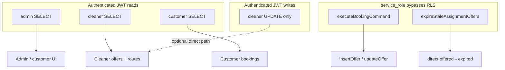

# Stage 5B-3c — assignment_offers RLS Tightening (Design)

**Date:** 2026-05-17  
**Status:** Design — **Phase 5B-3c-a implemented** in `20260518160000_rls_assignment_offers_admin_select_only.sql`  
**Depends on:** [stage-5b-3-rls-tightening-design.md](./stage-5b-3-rls-tightening-design.md), [stage-5b-3a](../operations/rls-tightening-rollbacks.md) (payments), [stage-5b-3b](./stage-5b-3b-earning-lines-rls-tightening-design.md) (earning_lines), [stage-5a-security-governance-audit.md](../audits/stage-5a-security-governance-audit.md)

**Goal:** Remove **admin JWT / PostgREST write** access to `assignment_offers` while preserving cleaner accept/decline, admin dispatch/replace via commands, cron `expireOffers`, and all **service-role** assignment orchestration — without changing accept/decline semantics, assignment commands, payments, or earnings.

**Hard constraints:** No implementation in this stage; do not alter `ACCEPT_CLEANER_ASSIGNMENT`, `DECLINE_CLEANER_ASSIGNMENT`, `OFFER_TO_CLEANER`, `CANCEL_OPEN_ASSIGNMENT_OFFER`, or `expireOffers` runtime behavior.

---

## Executive summary

| Question | Answer |
|----------|--------|
| Safe to remove admin write now? | **Yes**, after **5B-3a** and **5B-3b-a** in the target environment — same “admin read / commands write” pattern |
| Exact policy to drop | **`assignment_offers_admin_write`** only — **do not replace** with a narrower admin UPDATE |
| Admin reads | **Keep** `assignment_offers_select_admin` |
| Cleaner reads | **Keep** `assignment_offers_select_cleaner` |
| Cleaner writes (JWT) | **Keep** `assignment_offers_update_cleaner` (accept/decline field guard + optional direct UPDATE path) |
| Customer reads | **Keep** `assignment_offers_select_customer` |
| Cron / commands | **Unchanged** — service role bypasses RLS |
| Smallest migration | `DROP POLICY assignment_offers_admin_write` + verification tests |

---

## 1. Current assignment_offers RLS map

**Source:** `supabase/migrations/20260516160000_rls_role_security.sql`

| Policy | Command | Role | Predicate |
|--------|---------|------|-----------|
| `assignment_offers_select_cleaner` | `SELECT` | `authenticated` | `cleaner_id = auth_cleaner_id()` |
| `assignment_offers_select_customer` | `SELECT` | `authenticated` | `customer_owns_booking(booking_id)` |
| `assignment_offers_select_admin` | `SELECT` | `authenticated` | `auth_is_admin()` |
| `assignment_offers_update_cleaner` | `UPDATE` | `authenticated` | `cleaner_id = auth_cleaner_id()` (USING + WITH CHECK) |
| **`assignment_offers_admin_write`** | **`ALL`** | **`authenticated`** | **`auth_is_admin()`** (USING + WITH CHECK) |

**RLS enabled:** Yes (`alter table ... enable row level security` in same migration).

**DB trigger (cleaner only):** `guard_assignment_offer_cleaner_update` on `BEFORE UPDATE` — runs only when `auth_cleaner_id()` is non-null; blocks tampering with `booking_id`, `cleaner_id`, `offered_at`, `expires_at`, `created_at`. **Does not apply to admin JWT** (trigger returns early when cleaner id is null).

**Static guard (5B-2a):** Repo-wide scan forbids `assignment_offers.status` patches outside command backends + **`expireOffers.ts`** (documented cron exception).

### Latent risk today (`assignment_offers_admin_write`)

| Misuse (compromised admin JWT + PostgREST) | Effect |
|------------------------------------------|--------|
| `UPDATE status` → `accepted` | Fake assignment without cleaner consent |
| `INSERT` new `offered` row | Bypass `OFFER_TO_CLEANER` audit/eligibility (partially bounded by unique index) |
| `UPDATE cleaner_id` / `booking_id` | Reassign offers |
| `DELETE` offers | Disrupt dispatch / recovery |

Production **admin API routes do not use** admin JWT for these writes; they use **service role** + `executeBookingCommand`.

---

## 2. Admin / cleaner / system read–write inventory

### Admin reads (JWT — must keep SELECT)

| Consumer | Module / route | Pattern |
|----------|----------------|---------|
| Admin booking list/detail | `adminOperationsReadModel.ts` | `SELECT` by `booking_id`, status filters |
| Admin assignments queue | Same read model | Open offers, counts, replace-open-offer eligibility |
| Admin booking UI | `(admin)/admin/bookings/*` | Via read model |

**Note:** Admin **mutation** facades (`runAdminManualDispatchOffer`, `runAdminReplaceOpenOffer`, `runAdminSingleBookingAssignmentRecovery`) use **`createServiceRoleClient()`** for preflight reads (bookings, payments, offers) — not admin JWT. Admin **dashboard** reads still need `assignment_offers_select_admin`.

### Cleaner reads (JWT)

| Consumer | Module | Policy |
|----------|--------|--------|
| Offer inbox | `getCleanerOffers.ts` → `listOffersForCleaner` | `select_cleaner` |
| Accept/decline routes | `getOfferById` before command | `select_cleaner` (own offer) |
| Cleaner job/booking views | Indirect via `cleaner_can_access_booking` on bookings | Offers read where applicable |

### Customer reads (JWT)

| Consumer | Module | Policy |
|----------|--------|--------|
| Customer booking list/detail | `customerBookingReadModel.ts` | `select_customer` — offer status for assignment visibility |

### Cleaner updates (JWT — preserve policy)

| Path | Uses JWT UPDATE? | Notes |
|------|------------------|-------|
| **Production API** accept/decline | **No** for persistence | Route loads offer via JWT `SELECT`; **`createBookingCommandBackend()`** (service role) runs `ACCEPT_*` / `DECLINE_*` → `backend.updateOffer` |
| **RLS integration test** | **Yes** (documented) | Cleaner JWT can `UPDATE status` + `responded_at` on own row; field tamper blocked by trigger |
| Direct PostgREST (hypothetical) | Would use `update_cleaner` | Preserving policy maintains test + defense-in-depth for status/response fields |

**Design decision:** **Keep `assignment_offers_update_cleaner` unchanged.** Dropping it is **not required** for admin write removal and could break cleaner-scoped direct UPDATE expectations without changing command code.

### Service-role / command writes (bypass RLS)

| Writer | Operation | Commands / modules |
|--------|-----------|-------------------|
| Offer creation | `INSERT` | `OFFER_TO_CLEANER` → `insertOffer` (`createAdminDispatchOffer`, `createDispatchOffer`, `runAssignmentAfterPayment`) |
| Offer cancel | `UPDATE` status | `CANCEL_OPEN_ASSIGNMENT_OFFER` → `updateOffer` (`createAdminCancelOpenOffer`, replace flow) |
| Accept / decline | `UPDATE` status | `ACCEPT_CLEANER_ASSIGNMENT`, `DECLINE_CLEANER_ASSIGNMENT` → `updateOffer` |
| Cron expiry | `UPDATE` `offered` → `expired` | **`expireOffers.ts`** (client = service role from cron route) |
| Tests / cleanup | `DELETE` | `rlsTestSupport`, integration tests, phase1 helpers |

**Backend:** `SupabaseBookingCommandBackend.insertOffer` / `updateOffer` — all via **service role** client from `createBookingCommandBackend()`.

### offerRepository (read helper)

`offerRepository.ts` is **client-agnostic** — used with:

- **Cleaner JWT** — accept/decline routes, `getCleanerOffers`
- **Service role** — admin dispatch preflight (`listOffersForBooking` inside `runAdminManualDispatchOffer`)

No admin JWT writes through this module.

---

## 3. Command / service-role compatibility



| Flow | JWT role | RLS needed | After drop `admin_write` |
|------|----------|------------|-------------------------|
| Manual dispatch | Admin auth in API only | SR for reads/writes in facade | **OK** |
| Replace open offer | Admin auth | SR + commands | **OK** |
| Recovery / auto-offer | Admin/cron | SR + `runAssignmentAfterPayment` | **OK** |
| Cleaner accept/decline | Cleaner auth | SELECT + command SR | **OK** |
| Cron expire offers | Cron secret → SR client | Bypass | **OK** |
| Post-payment assignment | SR | Bypass | **OK** |

**RPCs:** Booking status changes use `booking_apply_transition` (service role only). Offer rows are separate DML on `assignment_offers` via backend — **no change** in 5B-3c.

---

## 4. Payout / payment / earnings (out of scope)

| Table | 5B-3 slice | Interaction with offers |
|-------|------------|-------------------------|
| `payments` | 5B-3a done | Admin dispatch preflight reads payments via **SR** |
| `earning_lines` | 5B-3b-a done | Created after job complete, not via offer RLS |
| `assignment_offers` | **5B-3c** | This design |

No cross-migration dependency beyond applying prior slices in each environment.

---

## 5. Manual dispatch & replace open offer (question 8)

| API route | Facade | Offer writes |
|-----------|--------|--------------|
| `POST .../dispatch-offer` | `runAdminManualDispatchOffer` | `createAdminDispatchOffer` → `OFFER_TO_CLEANER` → `insertOffer` (SR) |
| `POST .../replace-open-offer` | `runAdminReplaceOpenOffer` | `createAdminCancelOpenOffer` + `createAdminDispatchOffer` (SR commands) |

Admin JWT **never** inserts/updates offers in these flows. Dropping `assignment_offers_admin_write` **does not** affect them.

**Eligibility reads** on offers inside admin facades use **service role** `listOffersForBooking` — unaffected.

---

## 6. expireOffers cron (question 9)

```
POST /api/cron/expire-assignment-offers
  → createServiceRoleClient()
  → expireStaleAssignmentOffers(client, backend)
      → direct UPDATE assignment_offers (offered → expired)
      → processBookingAfterOfferExpiry → commands
```

- **Client:** Service role (cron route) — **bypasses RLS**
- **Exception:** Documented in 5B-2a static guard allowlist for `expireOffers.ts` only
- **5B-3c:** Do **not** move expiry into a new authenticated policy; do **not** restrict SR

---

## 7. One-open-offer constraint (question 10)

**Index:** `idx_assignment_offers_one_open_per_booking` on `(booking_id) WHERE status = 'offered'` (`20260517300000_assignment_offer_one_open_per_booking.sql`).

| Scenario | Interaction with admin write removal |
|----------|--------------------------------------|
| Command `OFFER_TO_CLEANER` | SR insert; unique index enforces ≤1 `offered` per booking |
| Admin PostgREST `INSERT` second `offered` | **Blocked by index** today — but first rogue insert still possible |
| Admin PostgREST `UPDATE` to `accepted` | **Bypasses** consent — **removed** when admin write dropped |
| Cron expiry | Updates only rows with `status = offered` guard in SQL |

**5B-3c does not change** the unique index or command idempotency behavior.

**Related index:** `idx_assignment_offers_one_open_per_cleaner` on `(booking_id, cleaner_id) WHERE status = 'offered'` — unchanged.

---

## 8. Proposed target policies

| Policy | Action |
|--------|--------|
| `assignment_offers_select_admin` | **Keep** |
| `assignment_offers_select_cleaner` | **Keep** |
| `assignment_offers_select_customer` | **Keep** |
| `assignment_offers_update_cleaner` | **Keep** (do not narrow in 5B-3c) |
| `assignment_offers_admin_write` | **Drop** |

**Target authenticated writes on `assignment_offers`:**

| Role | INSERT | UPDATE | DELETE |
|------|--------|--------|--------|
| Admin | No | No | No |
| Cleaner | No | Yes (own rows, `update_cleaner`) | No |
| Customer | No | No | No |
| Service role | Yes (bypass) | Yes (bypass) | Yes (tests/ops) |

**Do not add** `assignment_offers_insert_admin` or split policies in 5B-3c-min — that would re-open PostgREST write paths.

---

## 9. SQL / catalog verification test plan (question 11)

### New file: `supabase/tests/assignment_offers_rls_phase3c_checks.sql`

After forward migration:

1. RLS enabled on `public.assignment_offers`
2. `assignment_offers_admin_write` **must not exist**
3. `assignment_offers_select_admin` exists, `cmd = SELECT`
4. `assignment_offers_select_cleaner` exists, `cmd = SELECT`
5. `assignment_offers_select_customer` exists, `cmd = SELECT`
6. `assignment_offers_update_cleaner` exists, `cmd = UPDATE`
7. No other `authenticated` policies with `INSERT` / `DELETE` / `ALL` on `assignment_offers`
8. Listing of all policies on `assignment_offers`

### Static test: `assignmentOffersRlsPhase3cPolicy.test.ts`

- Forward migration drops only `assignment_offers_admin_write`
- SQL checks file documents required policies
- Rollback doc contains `CREATE POLICY assignment_offers_admin_write`
- Migration does not touch `payments`, `earning_lines`, `payout_batches`

---

## 10. RLS integration test plan (question 12)

Extend `rls-policies.integration.test.ts` with **`assignment_offers RLS phase 3c (5B-3c)`** (mirror 5B-3a/3b):

| Test | Actor | Expect |
|------|-------|--------|
| Admin can SELECT offers | Admin JWT | Row visible for test booking |
| Admin cannot INSERT offer | Admin JWT | Error / no row |
| Admin cannot UPDATE `status` | Admin JWT | Status unchanged (e.g. cannot set `accepted`) |
| Admin cannot DELETE offer | Admin JWT | Row still present (probe row) |
| Cleaner can SELECT own offer | Cleaner JWT | Success |
| Cleaner cannot SELECT other cleaner’s offer on other booking | Cleaner JWT | 0 rows |
| Cleaner can UPDATE response fields on own offer | Cleaner JWT | **Still passes** — `status` + `responded_at` (existing test pattern) |
| Cleaner cannot tamper `booking_id` | Cleaner JWT | `ASSIGNMENT_OFFER_FIELD_MUTATION_FORBIDDEN` (existing) |
| Customer can SELECT offers on own booking | Customer JWT | Success (if offer exists for booking) |
| Customer cannot SELECT offers on other booking | Customer JWT | 0 rows |

**Migration probe:** `isAssignmentOffersRlsPhase3cApplied()` — admin JWT attempt to `UPDATE status` to `accepted`; skip block if migration not applied.

**Preserve existing tests** in the same file (`cleaner can update offer response fields only`) — they remain valid after admin write drop.

### Command regression (no RLS role change)

| Test file | Coverage |
|-----------|----------|
| `expireOffers.test.ts` | Cron expiry DML + follow-up |
| `adminManualDispatchOffer.test.ts` | Dispatch command path |
| `adminReplaceOpenOffer.test.ts` | Cancel + offer |
| `processBookingAfterOfferEnded.test.ts` | Decline follow-up |
| `runAssignmentAfterPayment.openOffer.test.ts` | Engine offer creation |
| `respondToOffer` / accept route tests (if present) | Command accept |
| `assignmentOfferStatusMutationGuard.test.ts` | No new direct status patches in app |

---

## 11. Rollback SQL (question 13)

Document in [rls-tightening-rollbacks.md](../operations/rls-tightening-rollbacks.md) — **do not apply** in forward deploy:

```sql
-- Reverts 5B-3c forward migration
-- Source: 20260516160000_rls_role_security.sql

drop policy if exists assignment_offers_admin_write on public.assignment_offers;

create policy assignment_offers_admin_write on public.assignment_offers
  for all to authenticated
  using (public.auth_is_admin())
  with check (public.auth_is_admin());
```

**Forward migration (illustrative):**

```sql
drop policy if exists assignment_offers_admin_write on public.assignment_offers;
```

Optional table comment update noting admin SELECT-only (5B-3c).

---

## 12. Risks and mitigations

| Risk | Mitigation |
|------|------------|
| Accidentally drop `update_cleaner` | Migration SQL reviews only `admin_write`; catalog test asserts `update_cleaner` remains |
| Break cleaner accept API | Accept uses SR `updateOffer`; integration + route tests |
| Break admin dispatch | Facades already SR; `adminManualDispatchOffer.test.ts` |
| Break cron expiry | SR client unchanged; `expireOffers.test.ts` |
| Admin Table Editor write loss | Intended; ops use service role |
| New code uses admin JWT for offer insert | 5B-2 facade/route guards + PR checklist |
| Confusion: cleaner JWT UPDATE vs command | Document both paths; keep cleaner policy for semantics/tests |

---

## 13. Staged program position

| Phase | Table | Status |
|-------|-------|--------|
| 5B-3a | `payments` | Implemented |
| 5B-3b-a | `earning_lines` | Implemented |
| **5B-3c** | **`assignment_offers`** | **This design** |
| 5B-3d | `payment_events`, `bookings_admin_write`, `booking_locks` | Later |

---

## 14. Audit question index

| # | Section |
|---|---------|
| 1 | §1 Current RLS map |
| 2 | §2 Admin reads |
| 3 | §2 Cleaner updates |
| 4 | §2 Service-role writes |
| 5 | §2, §8 Cleaner UPDATE preservation |
| 6 | §8 Admin SELECT only |
| 7 | §8 Admin INSERT/UPDATE/DELETE removed |
| 8 | §5 Manual dispatch / replace |
| 9 | §6 Cron |
| 10 | §7 One-open-offer index |
| 11 | §9 SQL catalog |
| 12 | §10 Integration tests |
| 13 | §11 Rollback |
| 14 | §15 Final recommendation |

---

## 15. Final recommendation

### Is assignment_offers admin write removal safe now?

**Yes**, with the same prerequisites as 5B-3b:

1. **5B-3a** and **5B-3b-a** applied (recommended order; not a hard runtime dependency for offers).
2. Implementation drops **only** `assignment_offers_admin_write`.
3. **Preserves** all four SELECT/UPDATE cleaner/customer/admin read policies listed above.
4. **Does not** change assignment commands, accept/decline semantics, or `expireOffers`.

### Exact policy to drop or replace?

| Action | Policy |
|--------|--------|
| **DROP** | **`assignment_offers_admin_write`** |
| **Do not replace** | No new admin INSERT/UPDATE/DELETE policy |
| **Keep unchanged** | `assignment_offers_select_admin`, `assignment_offers_select_cleaner`, `assignment_offers_select_customer`, `assignment_offers_update_cleaner` |

### Smallest safe migration slice (5B-3c-min)

| Deliverable | Detail |
|-------------|--------|
| Migration | `20260518XXXXXX_rls_assignment_offers_admin_select_only.sql` — single `DROP POLICY` |
| SQL checks | `assignment_offers_rls_phase3c_checks.sql` |
| Static | `assignmentOffersRlsPhase3cPolicy.test.ts` |
| Integration | `assignment_offers` describe block + `isAssignmentOffersRlsPhase3cApplied` in `rlsTestSupport.ts` |
| Rollback doc | Phase 3 section in `rls-tightening-rollbacks.md` |
| CI | Existing assignment/admin/cron unit tests + typecheck |

**Explicitly defer:** Narrowing cleaner UPDATE to status-only via RLS `WITH CHECK`, moving `expireOffers` into a command type, admin `payout_batches` tightening, DB trigger for admin offer updates.

---

## References

| Resource | Path |
|----------|------|
| RLS base | `supabase/migrations/20260516160000_rls_role_security.sql` |
| One open offer | `supabase/migrations/20260517300000_assignment_offer_one_open_per_booking.sql` |
| expireOffers | `src/features/assignments/server/expireOffers.ts` |
| Command backend offers | `src/features/bookings/server/commands/supabaseBookingCommandBackend.ts` |
| Accept/decline | `src/features/assignments/server/respondToOffer.ts` |
| Admin dispatch | `src/features/assignments/server/adminManualDispatchOffer.ts` |
| Offer status guard | `src/features/assignments/server/assignmentOfferStatusMutationGuard.test.ts` |
| Parent 5B-3 | `docs/architecture/stage-5b-3-rls-tightening-design.md` |
