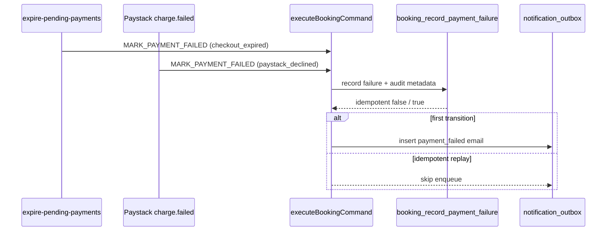

# Stage 5C-1b — `payment_failed` customer email (design)

**Date:** 2026-05-17  
**Status:** Design only — **no implementation in this pass**  
**Depends on:** Stage 5C-0 (enqueue idempotency), 5C-1a (`payment_confirmed` worker + Resend), 5C-1c (stale `processing` reclaim)  
**Inputs:** `docs/audits/stage-5c-notification-system-operational-messaging-audit.md`, `docs/operations/payment-failed-customer-retry.md`, `src/features/bookings/server/paymentFailureDisplay.ts`

---

## 1. Executive summary

Customers already see calm, reason-aware copy in the app when a booking becomes `payment_failed`. The outbox **already enqueues** `payment_failed` emails on the first successful `MARK_PAYMENT_FAILED`, but the worker **does not deliver** them yet.

**Recommendation:** Extend the existing notification worker with a **`payment_failed` email template** that:

1. Hydrates `failure_reason` from **`booking_state_audit`** (same as `resolvePaymentFailureReason`), not from outbox payload or Paystack fields.
2. Reuses **UI copy policy** from `paymentFailureDisplay.ts` (`checkout_expired` vs generic).
3. Links to **booking detail** (`/customer/bookings/{id}`) as the primary CTA; promotes same-booking retry only when `assessPaymentRetryEligibility` is true (no direct Paystack URL in email).
4. Skips send if booking is no longer `payment_failed` or a prior `payment_failed` email for that booking was already **`sent`**.
5. Rolls out on the **same `ENABLE_NOTIFICATION_DELIVERY` flag**, with an optional **template allowlist** env for staging-first enablement.

**Do not** change payment commands, assignment, earnings, or RLS. **Do not** add `failure_reason` to enqueue payload in v1 (audit hydration is safer and matches dashboards).

---

## 2. Audit answers (design questions)

### 2.1 Which command enqueues `payment_failed` today?

| Source | Command | Actor |
|--------|---------|-------|
| Abandoned checkout cron | `MARK_PAYMENT_FAILED` | `service` (`expirePendingPayments.ts`) |
| Paystack `charge.failed` webhook | `MARK_PAYMENT_FAILED` | `service` (`processPaystackChargeFailure.ts`) |
| Tests / manual admin paths | `MARK_PAYMENT_FAILED` | varies |

All paths go through `executeBookingCommand()` → `backend.recordPaymentFailure()` → enqueue block:

```276:285:src/features/bookings/server/commands/executeBookingCommand.ts
        await enqueueNotificationWhenNotIdempotent(
          backend,
          r.idempotent,
          "email",
          booking.customer_id,
          {
            template: "payment_failed",
            bookingId: booking.id,
          },
        );
```

**Enqueue is gated on `!r.idempotent`** (Stage 5C-0). Idempotent replays of the same `idempotency_key` do **not** insert a second row (`notificationEnqueueIdempotency.test.ts`).

### 2.2 What payload is currently available in `notification_outbox`?

Schema (`notification_outbox.payload` jsonb):

| Field in practice | Present? |
|-------------------|----------|
| `template` | `"payment_failed"` |
| `bookingId` | booking UUID |
| `failure_reason` | **No** |
| `paymentId` | **No** |
| Paystack reference / gateway text | **No** |

Example row at enqueue time:

```json
{
  "template": "payment_failed",
  "bookingId": "aaaaaaaa-bbbb-cccc-dddd-eeeeeeeeeeee"
}
```

`recipient` = `customers.id` (not email). Channel = `email`.

### 2.3 How can the worker determine `failure_reason` safely?

**Primary source (recommended):** `booking_state_audit` for the booking, filtered to `command = 'MARK_PAYMENT_FAILED'`, newest first, read `metadata.failure_reason` string — reuse **`resolvePaymentFailureReason()`** from `paymentFailureDisplay.ts`.

Known values today:

| Constant | Set by | Customer UI label |
|----------|--------|-------------------|
| `checkout_expired` | Expire-pending-payments cron | “Checkout expired” |
| `paystack_declined` | Paystack webhook failure path | “Payment failed” (generic) |
| *(missing / unknown)* | Legacy rows, tests | “Payment failed” |

**Do not** derive reason from:

- Outbox payload (not stored today; would require enqueue change).
- `payments` row alone (no `failure_reason` column).
- `payment_events` payload (Paystack refs, gateway_response — **internal only**).
- Raw audit `metadata` echoed into email body (risk of leaking `paystack_reference`, `source`, cron names).

### 2.4 Should it read `booking_state_audit` / payment metadata?

| Source | Use for email? |
|--------|----------------|
| `booking_state_audit` (`MARK_PAYMENT_FAILED`, `metadata.failure_reason`) | **Yes** — reason branch only |
| `bookings` (schedule, metadata, `price_cents`, status) | **Yes** — display snapshot + send guards |
| `payments` (status list) | **Yes** — retry eligibility (`assessPaymentRetryEligibility`) |
| `payment_events` | **No** — ops/audit only |
| Command `metadata` at enqueue time | **Defer** — optional future optimization if audit read is too heavy |

Audit write path already persists command metadata (RPC stores `v_meta` on audit row):

```269:275:supabase/migrations/20260515203000_booking_command_layer.sql
  insert into public.booking_state_audit (
    booking_id, from_status, to_status, command, actor_profile_id, payload,
    actor_type, reason, idempotency_key, metadata
  ) values (
    p_booking_id, 'pending_payment', 'payment_failed', p_command, p_actor_profile_id,
    v_meta, coalesce(p_actor_type, 'system'), p_reason, p_idempotency_key, v_meta
  );
```

### 2.5 Should `checkout_expired` and `paystack_declined` have different copy?

**Yes — two customer-facing variants, aligned with in-app panel copy:**

| Reason | Subject tone | Body emphasis |
|--------|--------------|---------------|
| `checkout_expired` | Neutral, time-based | Link expired before payment completed; no charge finalized |
| `paystack_declined` | Neutral, attempt-based | Payment could not be confirmed; invite retry |
| Unknown / null | Same as generic decline | Do not speculate about card/bank details |

**Do not** use scary language (“declined”, “rejected”, “fraud”), Paystack gateway strings, or admin vocabulary (“attention_required”, dispatch).

Reuse / mirror:

- `paymentIssuePanelCopy()` for body branching.
- `labelForCustomerBookingStatus()` only for internal logging, not necessarily email subject.

**Optional v1.1:** Slightly softer subject for `paystack_declined` (“Payment not completed”) — not required for first slice if generic copy is used.

### 2.6 Should the email link to retry payment or booking detail?

| Link | Use in email |
|------|----------------|
| **Booking detail** `{APP_BASE_URL}/customer/bookings/{bookingId}` | **Primary CTA** — always (matches `payment_confirmed` pattern) |
| Direct Paystack `authorization_url` | **No** — requires server-side retry-lock + initialize; cannot be precomputed at enqueue |
| `/customer/book` | **Secondary** — “Start a new booking” footer link |

Button label when retry eligible: **“Complete payment”** or **“View booking and retry”** → both land on detail page where `RetryPaymentButton` runs the API sequence.

### 2.7 Should same-booking retry be promoted?

**Conditionally — mirror UI, do not over-promise.**

Use existing **`assessPaymentRetryEligibility(booking, payments)`** (`paymentRetryEligibility.ts`):

- Requires `BOOKING_LOCK_REQUIRED=true`, `payment_failed`, no paid payment, future schedule, valid quote metadata, live quote price match.

| Eligible | Email copy |
|----------|------------|
| Yes | “You can retry payment on the same booking from your booking page.” + primary link to detail |
| No | Omit retry promise; keep detail link + “Start a new booking” to `/customer/book` |

Never email a retry CTA when UI would hide the button (stale quote, past schedule, locks disabled).

### 2.8 How to avoid duplicate failure emails?

**Layers (defense in depth):**

| Layer | Mechanism | Status |
|-------|-----------|--------|
| Enqueue | `enqueueNotificationWhenNotIdempotent(!r.idempotent)` | **Implemented** (5C-0) |
| Booking transition | Only one `pending_payment` → `payment_failed` per payment attempt; second path idempotent at command layer | **Implemented** |
| Cron + webhook race | Second `MARK_PAYMENT_FAILED` when already `payment_failed` → idempotent, **no enqueue** | **Implemented** |
| Delivery dedupe | Before send: skip if another row with same `bookingId` + `template=payment_failed` already `status=sent` | **Required in 5C-1b** |
| Send-time guard | Skip if `bookings.status !== 'payment_failed'` (customer paid/retried before worker ran) | **Required in 5C-1b** |
| DB unique index | `(booking_id, template)` on outbox — deferred | Future |

**Residual risk:** Multiple `pending` rows for same booking if enqueue bug or manual DB insert — delivery dedupe + sent guard limits to one email.

### 2.9 What templates are needed?

**One logical template name** in outbox: `payment_failed` (unchanged at enqueue).

**One renderer module** with reason branches (recommended path):

| Artifact | Purpose |
|----------|---------|
| `templates/paymentFailed.ts` | `buildPaymentFailedEmail({ booking, failureReason, canRetry, customerDisplayName, bookingDetailUrl, newBookingUrl, supportEmail })` |
| `config.ts` | `PAYMENT_FAILED_TEMPLATE = "payment_failed"` |
| Shared helpers | Reuse `shortBookingReference`, `parseBookingDisplay`, `formatScheduleRange`, `escapeHtml` from `paymentConfirmed.ts` |

**Not needed:** separate outbox template strings per reason (avoids enqueue/worker drift).

### 2.10 What tests are required?

| Area | Tests |
|------|-------|
| Template unit | `checkout_expired` vs generic vs unknown — subject/body contain no Paystack/cron tokens; HTML escaped |
| Reason resolution | Mock audits → `resolvePaymentFailureReason` integration in worker helper |
| Worker row processing | Happy path send; skip non-`payment_failed` template; skip when booking not `payment_failed`; skip when prior `sent` dedupe |
| Retry CTA | `canRetry=true` includes retry line; `false` omits it |
| Eligibility | Uses `assessPaymentRetryEligibility` — mock booking+payments |
| Idempotency | Two pending rows same booking → only one send |
| Registry | Extend route/registry tests if template allowlist env added |
| Typecheck | Full `npm run typecheck` |

Follow patterns in `paymentConfirmed.test.ts` and `processNotificationOutbox.test.ts`.

### 2.11 Same worker flag or separate flag?

| Approach | Recommendation |
|----------|----------------|
| **Same `ENABLE_NOTIFICATION_DELIVERY`** | Default — one cron, one ops knob |
| **Optional `NOTIFICATION_DELIVERY_TEMPLATES`** | `payment_confirmed,payment_failed` allowlist for staging partial rollout |
| Separate `ENABLE_PAYMENT_FAILED_EMAIL` | Only if compliance wants hard off-switch; otherwise redundant |

**5C-1b default:** extend existing worker; both templates require flag + Resend env. Optional allowlist documented in ops runbook.

### 2.12 Should `payment_failed` be enabled in staging first?

**Yes — mandatory.**

| Phase | Environment | Config |
|-------|-------------|--------|
| 1 | Staging | `ENABLE_NOTIFICATION_DELIVERY=true`, Resend sandbox, `APP_BASE_URL` = staging URL, allowlist includes `payment_failed` |
| 2 | Staging soak | Trigger cron expiry + test decline; verify single email, copy, links |
| 3 | Production | Enable after `payment_confirmed` stable; monitor `sent`/`failed` metrics |

Use test customers with known emails only. Do not point staging worker at production DB clone without scrubbing.

---

## 3. Current enqueue behavior (reference)



| Trigger | `metadata.failure_reason` | Typical idempotency key |
|---------|---------------------------|-------------------------|
| Cron | `checkout_expired` | `cron:expire-pending-payment:{paymentId}` |
| Webhook | `paystack_declined` | Per charge (`paystackFailureCommandIdempotencyKey`) |

---

## 4. Customer copy policy

### Tone

- Calm, factual, action-oriented.
- Assume no payment was completed unless reason is `paystack_declined` (still avoid card detail).
- Reinforce: **no cleaner assigned until payment succeeds** (matches `PaymentIssuePanel`).

### Allowed content

- Short booking reference (8-char derived id, same as confirmed email).
- Service label + schedule (from `parseBookingDisplay` / booking columns).
- Reason-appropriate one-liner (checkout expired vs generic).
- Link to booking detail; optional secondary link to new booking wizard.
- Support contact line (same as `payment_confirmed`).

### Forbidden content

| Category | Examples |
|----------|----------|
| Paystack | `reference`, `transaction_id`, `gateway_response` |
| Internal ops | `expire_pending_payment_cron`, `paystack_webhook`, idempotency keys |
| Admin/dispatch | `attention_required`, cleaner IDs, offer expiry, redispatch |
| Scary / blame | “Card declined”, “payment rejected”, fraud language |
| Amount charged | Do not imply money was taken on `checkout_expired` |

### Copy matrix (email)

| `failure_reason` | Subject (draft) | Body hook |
|------------------|-----------------|-----------|
| `checkout_expired` | Payment not completed — checkout link expired | Your checkout link expired before payment was completed. |
| `paystack_declined` | Payment not completed — action needed | We could not confirm payment for this booking. |
| `null` / other | Payment not completed | We could not confirm payment for this booking. |

Shared closing: booking reference, service, when, detail link, support line, thank-you/footer.

---

## 5. Retry link strategy

```
Email CTA (always)
    → GET /customer/bookings/{bookingId}
        → PaymentIssuePanel
            → RetryPaymentButton (if assessPaymentRetryEligibility)
                → POST payment-retry-lock → POST paystack/initialize → redirect
            → Start a new booking → /customer/book
```

| Decision | Rationale |
|----------|-----------|
| No Paystack URL in email | Lock + quote validation are server-side; URL would be stale/invalid |
| Promote same-booking retry when eligible | Reduces support load; matches 2B-2c product intent |
| Always include detail link | Customer can self-serve even when retry button hidden |

---

## 6. Template design (implementation sketch)

### Inputs (worker hydration)

```typescript
type PaymentFailedEmailInput = {
  booking: { id; scheduled_start; scheduled_end; metadata };
  failureReason: string | null; // from resolvePaymentFailureReason(audits)
  canRetry: boolean;          // assessPaymentRetryEligibility(booking, payments)
  customerDisplayName: string | null;
  bookingDetailUrl: string;
  newBookingUrl: string;      // `${appBaseUrl}/customer/book`
  supportEmail: string | null;
};
```

### Outputs

- `subject`, `html`, `text` (multipart, same as Resend path for confirmed).
- Plain-text part required for deliverability.

### HTML structure

Mirror `paymentConfirmed.ts`: minimal system font, single column, one primary button/link, muted footer.

---

## 7. Worker extension plan

Extend `processNotificationOutbox` (no new cron route):

1. **Reclaim** stale `processing` (5C-1c — already runs first).
2. **Select** pending email rows (existing batch query).
3. For each row:
   - If `template === payment_confirmed` → existing path.
   - If `template === payment_failed` → new path (only when delivery enabled + template allowed).
   - Else → `skipped`.
4. **`processPaymentFailedRow`** pipeline:
   - Parse `bookingId` from payload.
   - **Dedupe:** query outbox for `sent` + same `bookingId` + `payment_failed`.
   - Load booking; if `status !== 'payment_failed'` → mark skipped/failed (non-retryable) without send.
   - Load audits → `resolvePaymentFailureReason`.
   - Load payments for booking → `assessPaymentRetryEligibility`.
   - Resolve customer email (`resolveCustomerEmail`).
   - `buildPaymentFailedEmail` → `sendEmailViaResend`.
   - Mark `sent` / retryable `pending` / terminal `failed` (same helpers as confirmed).

### Send guards (required)

| Guard | Action if fails |
|-------|-----------------|
| Booking not found | `failed`, non-retryable |
| Booking status not `payment_failed` | **Skip send**, mark row `failed` or `sent` with `last_error: booking_no_longer_failed` (prefer skip without email — design choice: mark `failed` with reason to avoid infinite retry) |
| Prior `sent` dedupe | Skip, mark current row `failed` with `duplicate_delivery_suppressed` or delete — prefer **mark `sent` idempotently** without second email |
| No customer email | `failed`, non-retryable |

### Performance

- One audit query per row (`booking_state_audit` where `booking_id` = X, order `created_at desc`, limit ~10).
- One payments query per row.
- Acceptable within batch size 25; optimize later with shared loader if needed.

---

## 8. Idempotency / retry policy

| Concern | Policy |
|---------|--------|
| Outbox command enqueue | Already idempotent per command key |
| Worker delivery | Dedupe on `sent` per `(bookingId, payment_failed)` |
| Provider retry | Same exponential backoff as `payment_confirmed` (`NOTIFICATION_MAX_ATTEMPTS`, `NOTIFICATION_RETRY_BASE_MINUTES`) |
| Stale `processing` | 5C-1c reclaim |
| Customer retries payment after email queued | Send-time status guard prevents misleading email |

---

## 9. Tests (checklist)

- [ ] `paymentFailed.test.ts` — copy variants, no forbidden substrings, escapeHtml
- [ ] `processNotificationOutbox.test.ts` — deliver `payment_failed`, skip others, dedupe, status guard, reclaim still first
- [ ] `reclaim` + `payment_failed` integration unchanged
- [ ] Optional: extract `loadPaymentFailureContext(bookingId)` unit tests
- [ ] `npm run typecheck`
- [ ] Manual staging: cron expiry + webhook decline → at most one email each

---

## 10. Rollout plan

| Step | Action |
|------|--------|
| 1 | Implement template + worker branch + tests (5C-1b implementation pass) |
| 2 | Deploy to staging with delivery flag off; deploy code |
| 3 | Enable flag + allowlist `payment_failed`; run manual cron |
| 4 | Verify Resend dashboard + booking detail links on staging domain |
| 5 | Soak 48h — watch duplicate rate, bounce rate, support tickets |
| 6 | Production enable after `payment_confirmed` proven stable |
| 7 | Document ops query for backlog: `payload->>'template' = 'payment_failed'` |

### Ops monitoring

```sql
select status, count(*)
from notification_outbox
where payload->>'template' = 'payment_failed'
group by 1;
```

---

## 11. Risks and mitigations

| Risk | Severity | Mitigation |
|------|----------|------------|
| Email sent after customer already paid | Medium | Send-time `booking.status` guard |
| Duplicate emails (DB duplicates) | Medium | Delivery dedupe on prior `sent` |
| Wrong reason shown | Low | Use `resolvePaymentFailureReason`; unknown → generic |
| Paystack/cron leakage in copy | High | Central template; forbidden substring tests |
| Retry CTA when ineligible | Medium | `assessPaymentRetryEligibility` only |
| Backlog flood on first enable | Medium | Batch size 25; cron every 2–5 min; staging soak |
| Staging email to real customers | High | Staging DB scrub; Resend test mode |

---

## 12. Final recommendation

### Is `payment_failed` email safe to implement now?

**Yes, with conditions.**

| Prerequisite | Status |
|--------------|--------|
| Enqueue idempotency (5C-0) | Done |
| Worker + Resend + reclaim (5C-1a/1c) | Done |
| UI copy + retry eligibility (2B) | Done |
| Audit `failure_reason` populated | Done for cron + webhook |
| Delivery dedupe + send guards | **Must be part of 5C-1b implementation** |

**Not safe to skip:** send-time status check, delivery dedupe, audit-based reason (not Paystack payload), staging-first rollout.

### Smallest safe slice (5C-1b implementation scope)

1. **Single template** `buildPaymentFailedEmail` with **`checkout_expired` + generic** branches (covers `paystack_declined` and unknown).
2. **Worker branch** in existing `processNotificationOutbox` + same cron route.
3. **Hydrate** reason from audit via `resolvePaymentFailureReason`; **retry** via `assessPaymentRetryEligibility`.
4. **Guards:** `booking.status === payment_failed'`, prior `sent` dedupe.
5. **Same flag** `ENABLE_NOTIFICATION_DELIVERY`; optional `NOTIFICATION_DELIVERY_TEMPLATES` for staging.
6. **Tests** as §9; **no** enqueue payload changes, **no** payment/assignment/RLS changes.

**Defer to 5C-1b+ / later:** distinct `paystack_declined` subject line, `failure_reason` in enqueue payload, outbox unique index, separate enable flag, `payment_pending` email.

---

## Related documents

- [notification-outbox.md](../operations/notification-outbox.md)
- [notification-outbox-worker.md](../operations/notification-outbox-worker.md)
- [payment-failed-customer-retry.md](../operations/payment-failed-customer-retry.md)
- [stage-5c-notification-system-operational-messaging-audit.md](../audits/stage-5c-notification-system-operational-messaging-audit.md)
- [stage-5c-1-notification-worker-payment-confirmed-final-audit.md](../audits/stage-5c-1-notification-worker-payment-confirmed-final-audit.md)
