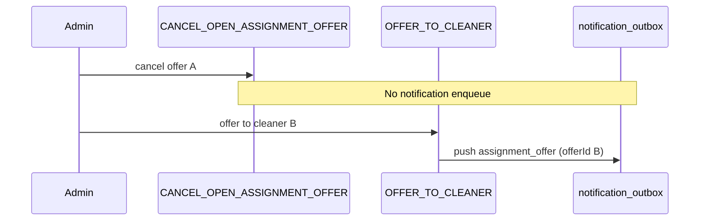
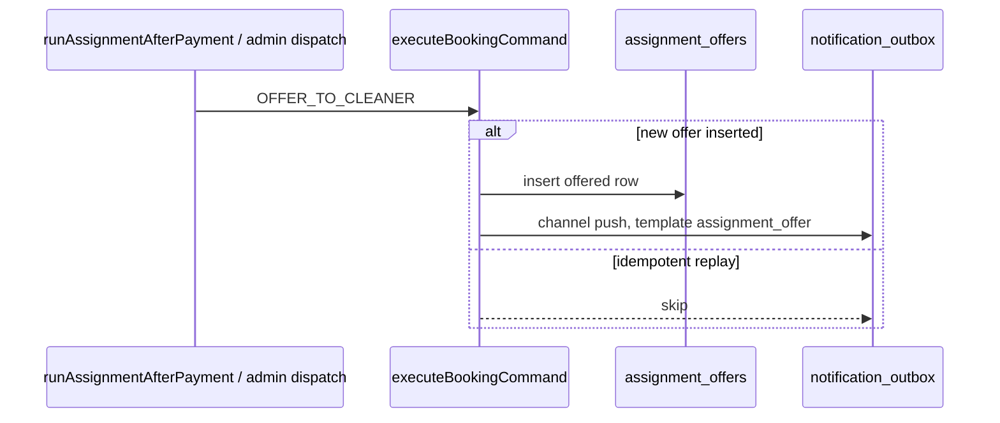
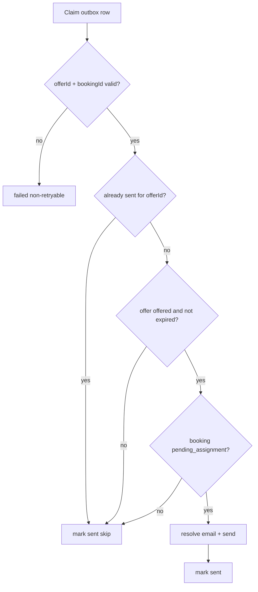

# Stage 5C-2 — Cleaner offer notification (design)

**Date:** 2026-05-17  
**Status:** Design only — **no implementation in this pass**  
**Depends on:** Stage 5C-0 (enqueue idempotency), 5C-1a (`payment_confirmed` worker + Resend), 5C-1b (`payment_failed` email), 5C-1c (stale `processing` reclaim)  
**Inputs:** `docs/audits/stage-5c-notification-system-operational-messaging-audit.md`, `docs/audits/cleaner-offer-expiration-system-audit.md`, `docs/operations/notification-outbox-worker.md`, `src/features/dashboards/server/cleanerJobReadModel.ts`

---

## 1. Executive summary

Cleaners are **not alerted outside the app** today. `OFFER_TO_CLEANER` already inserts `notification_outbox` rows (`channel: push`, `template: assignment_offer`), but the worker **skips all non-customer-email templates** — rows stay `pending` forever.

**Recommendation:** Extend the existing notification worker to deliver **`assignment_offer` as transactional email** (v1), reusing the same field hydration as the cleaner offers dashboard. Treat the historical `push` channel as an **email placeholder** until FCM/APNs exists — do **not** add a parallel `email` enqueue in v1.

**Guards before send:** offer row still `offered`, not past `expires_at`, booking still `pending_assignment`, recipient matches `offer.cleaner_id`, and no prior **`sent`** row for the same `offerId`.

**Do not** change assignment commands, accept/decline routes, earnings formulas, RLS, or enqueue idempotency. **Do not** notify on cancel/expire/decline/accept (v1).

**Smallest safe slice:** Email-only delivery for existing `assignment_offer` push rows, behind `ENABLE_NOTIFICATION_DELIVERY`, with offer-status guards and per-`offerId` send dedupe.

---

## 2. Audit answers (design questions)

### 2.1 Which command currently enqueues `assignment_offer`?

| Source | Command | When |
|--------|---------|------|
| Auto dispatch after payment | `OFFER_TO_CLEANER` | After successful `insertOffer` |
| Decline/expiry redispatch | `OFFER_TO_CLEANER` | Via `createDispatchOffer` → same command |
| Admin manual dispatch | `OFFER_TO_CLEANER` | `createAdminDispatchOffer` |
| Admin replace open offer | `OFFER_TO_CLEANER` | After `CANCEL_OPEN_ASSIGNMENT_OFFER` (cancel does **not** enqueue) |

**Single enqueue site** in the command executor:

```386:390:src/features/bookings/server/commands/executeBookingCommand.ts
        await enqueueNotificationWhenNotIdempotent(backend, false, "push", cmd.cleanerId, {
          template: "assignment_offer",
          bookingId: booking.id,
          offerId: oid,
        });
```

`OFFER_TO_CLEANER` idempotent replays (same cleaner, open offer already exists) return **before** insert — **no second outbox row** (`notificationEnqueueIdempotency.test.ts`).

### 2.2 What channel is used today: email, push, or other?

| Field | Value today |
|-------|-------------|
| `channel` | `"push"` |
| Actual push delivery | **None** — no FCM/APNs SDK, no device tokens |
| Worker behavior | Query filters `.eq("channel", "email")`; `isDeliverableEmailRow` returns false for push → **skipped**, status stays `pending` |

Test: `processNotificationOutbox.test.ts` — `skips assignment_offer push rows`.

### 2.3 What payload exists in `notification_outbox` for `assignment_offer`?

| Field | Present? |
|-------|----------|
| `template` | `"assignment_offer"` |
| `bookingId` | booking UUID |
| `offerId` | offer UUID (set at insert time) |
| `recipient` | `cleaners.id` (not profile id, not email) |
| Schedule / location / earnings | **No** — worker must hydrate |
| Assignment path (`selected` / `best_available`) | **No** |
| Customer PII | **No** |

Example at enqueue:

```json
{
  "template": "assignment_offer",
  "bookingId": "aaaaaaaa-bbbb-cccc-dddd-eeeeeeeeeeee",
  "offerId": "ffffffff-1111-2222-3333-444444444444"
}
```

### 2.4 How should cleaner recipient be resolved?

Mirror `resolveCustomerEmail` → new **`resolveCleanerEmail(cleaners.id)`**:

```
recipient (cleaners.id)
  → cleaners.profile_id
  → profiles.full_name (optional greeting)
  → auth.admin.getUserById(profile_id) → email
```

| Outcome | Worker behavior |
|---------|-----------------|
| Cleaner not found | `failed`, non-retryable (`CUSTOMER_NOT_FOUND` analogue) |
| No auth email | `failed`, non-retryable (`NO_EMAIL`) |
| Success | Send to resolved email only; never log email in `last_error` (existing sanitize) |

**Authorization at send time:** Reload `assignment_offers` where `id = payload.offerId` and verify `offer.cleaner_id === row.recipient` (outbox recipient must match offer row).

### 2.5 Should first version send email, push, WhatsApp, or dashboard-only?

| Channel | v1 recommendation |
|---------|-------------------|
| **Email** | **Yes** — reuse Resend path, same cron, lowest incremental risk |
| Push (FCM/APNs) | **No** — device registry, permissions, and payload signing are a separate project |
| WhatsApp | **No** — no provider integration; regulatory/consent surface |
| Dashboard-only | **Already exists** — `/cleaner/offers`; insufficient for cleaners who are not in-app |

**Do not** change enqueue channel in v1 (avoids duplicate rows). Worker delivers **`assignment_offer` rows with `channel = push` as email** until real push ships (document in ops runbook).

### 2.6 What booking/job details are safe to include?

Reuse the **same fields** as `listCleanerOffersForDashboard` / cleaner offers UI (`cleanerJobReadModel.ts` + `parseBookingDisplay` + `resolveCleanerEarningsDisplay`):

| Include | Source | Notes |
|---------|--------|-------|
| Service label | `parseBookingDisplay(metadata).serviceLabel` | Catalog label only |
| Schedule | `formatScheduleRange(scheduled_start, scheduled_end)` | Same as dashboard |
| Location summary | `parseBookingDisplay(metadata).locationSummary` | Suburb/city/line1 — **already shown to cleaners in UI** |
| Earnings label | `resolveCleanerEarningsDisplay(...)` | Preview or “Earnings being calculated” |
| Offer expiry | `assignment_offers.expires_at` | Human-readable en-ZA datetime |
| Short booking reference | Derived from `bookingId` (8-char, same pattern as customer emails) | Ops-friendly, not customer name |

| **Do not** include | Reason |
|--------------------|--------|
| Customer name, email, phone | Not in cleaner offer read model; privacy |
| `bookings.price_cents` (customer total) | `resolveCleanerEarningsDisplay` explicitly avoids exposing total |
| `metadata.assignment` path, reason, attempt counts | Admin/dispatch internals |
| `attention_required` / redispatch narrative | Ops-only |
| Paystack / payment ids | Irrelevant to cleaner |
| Other cleaners’ ids or offer history | Leakage |
| `specialInstructions` | Not on offer list UI; defer to post-accept job detail |
| Deep admin dispatch notes | Internal |

### 2.7 What cleaner acceptance link should be used?

| Link | Use in v1 |
|------|-----------|
| **Primary CTA:** `{APP_BASE_URL}/cleaner/offers` | **Yes** — matches product surface where accept/decline buttons live |
| Per-offer deep link | **Defer** — no `?offerId=` handling on offers page today |
| Direct `POST` accept URL in email | **Never** — must go through authenticated session + `OfferActions` / API routes |

Accept/decline remain:

- `POST /api/cleaner/offers/{offerId}/accept`
- `POST /api/cleaner/offers/{offerId}/decline`

(facades: `acceptCleanerOffer` / `declineCleanerOffer` — **unchanged**).

Optional secondary link: `{APP_BASE_URL}/cleaner` (home). No job detail link until offer accepted.

### 2.8 How to prevent duplicate offer notifications?

**Enqueue-side (already sufficient for same offer):**

| Mechanism | Effect |
|-----------|--------|
| `OFFER_TO_CLEANER` idempotent return when same cleaner has open `offered` | No second row for duplicate command |
| DB `idx_assignment_offers_one_open_per_booking` | One open offer per booking |

**Delivery-side (required for v1):**

| Mechanism | Purpose |
|-----------|---------|
| **`hasSentAssignmentOfferForOffer(client, offerId, excludeOutboxId?)`** | If any row with `payload.offerId` and `status = sent` exists, mark current row `sent` without resend (mirror `hasSentPaymentFailedForBooking`) |
| **Claim lease** | Existing `pending` → `processing` update |
| **Optional future:** partial unique index on `(payload->>'offerId')` WHERE `template = assignment_offer` AND `status IN ('pending','processing','sent')` | DB-level dedupe — defer to 5C-5 hygiene slice |

**Not sufficient alone:** enqueue idempotency does not dedupe **admin replace** (new `offerId`) or **redispatch to different cleaner** (intentionally separate emails).

### 2.9 How to avoid notifying after offer expired/cancelled/accepted/declined?

Before render/send, load `assignment_offers` by `payload.offerId`:

| Condition | Action |
|-----------|--------|
| Offer row missing | `failed`, non-retryable (`OFFER_NOT_FOUND`) |
| `offer.cleaner_id !== outbox.recipient` | `failed`, non-retryable (`RECIPIENT_MISMATCH`) |
| `offer.status !== 'offered'` | Mark `sent` **without send** (skipped) — terminal: `accepted`, `declined`, `expired`, `cancelled` |
| `isOfferPastExpiry(offer.expires_at)` | Mark `sent` without send (skipped) |
| `bookings.status !== 'pending_assignment'` | Mark `sent` without send (skipped) |

**Rationale:** Skipping stale rows as `sent` (not `failed`) drains backlog without alarming ops; matches `payment_failed` stale booking guard pattern.

**Timing race:** Cleaner accepts in app while worker runs → status no longer `offered` → no email (acceptable).

### 2.10 How to handle replace-open-offer cancellation?



| Party | Behavior |
|-------|----------|
| Cleaner A (cancelled offer) | May have **pending** outbox row for offer A → delivery guard sees `status = cancelled` → **no send** |
| Cleaner B | New row with new `offerId` → **one email** when guards pass |
| Customer | No notification in v1 |

**No** “offer withdrawn” email to cleaner A in v1 (product noise; they may never have opened the app).

### 2.11 Should `selected_cleaner` and `best_available` copy differ?

| Approach | Recommendation |
|----------|----------------|
| **v1: single template** | **Yes** — same subject/body structure for all paths |
| Optional v1.1 variant | One line in body: selected → “You were requested for this job”; best_available → “New assignment offer” — hydrate path from `metadata.assignment.path` or lock preference **only for this sentence**, not full reason text |

**Do not** expose customer-selected-cleaner identity or admin manual dispatch reasons in email.

### 2.12 Should earnings preview be included?

| Decision | **Yes**, when available — same policy as dashboard |

Use `resolveCleanerEarningsDisplay` with `earningLines: []` and `cleaner_id: null` (offer stage):

| Display | When |
|---------|------|
| Formatted ZAR from metadata quote preview or `computeCleanerEarningsPreview` | Quote/pricing input present |
| “Earnings being calculated” | Preview unavailable |

| Rule | |
|------|--|
| Never show customer booking total | |
| Do not change earnings formulas | |
| Label as “Your earnings (estimate)” in email copy | |

### 2.13 How should retry/failure handling work?

Reuse existing outbox semantics (`NOTIFICATION_MAX_ATTEMPTS`, exponential `next_retry_at`, stale reclaim):

| Error class | Retry? |
|-------------|--------|
| Resend 5xx / network | Yes |
| `NO_EMAIL` / `CUSTOMER_NOT_FOUND` / invalid payload / offer not found | No — `failed` |
| Stale offer (terminal status / expired / booking not pending_assignment) | No — mark `sent` skip |
| Send succeeded | `sent` |

Same cron route: `/api/cron/process-notification-outbox`. Extend batch selection to include deliverable `assignment_offer` rows (see §7).

### 2.14 What tests are required?

| Layer | Tests |
|-------|-------|
| `resolveCleanerEmail` | Found / not found / no email |
| `buildAssignmentOfferEmail` | Snapshot subject/html/text; forbidden strings absent (customer name, `attention_required`, `price_cents` total) |
| `hasSentAssignmentOfferForOffer` | Dedupes second pending row for same `offerId` |
| `processAssignmentOfferRow` guards | Terminal offer → skip send; expired → skip; wrong recipient → fail |
| `processNotificationOutbox` integration | Delivers push-channel `assignment_offer` when flag on; does not deliver when flag off; does not double-send |
| Regression | Existing `payment_confirmed` / `payment_failed` tests unchanged |

Follow patterns in `paymentConfirmed.test.ts`, `paymentFailed.test.ts`, `processNotificationOutbox.test.ts`.

### 2.15 Same `ENABLE_NOTIFICATION_DELIVERY` flag or separate flag?

| Approach | Recommendation |
|----------|----------------|
| **`ENABLE_NOTIFICATION_DELIVERY`** (same) | **Default** — one ops knob, one cron |
| **`NOTIFICATION_DELIVERY_TEMPLATES`** allowlist | Optional — e.g. `payment_confirmed,payment_failed,assignment_offer` for staging |
| Separate `ENABLE_CLEANER_OFFER_EMAIL` | Only if compliance needs hard isolation; otherwise redundant |

**Rollout:** Staging enable with allowlist including `assignment_offer` after customer emails are stable.

---

## 3. Current assignment_offer enqueue behavior



| Trigger | Enqueues? | Notes |
|---------|-----------|-------|
| First dispatch to cleaner | Yes | `idempotent: false` |
| Same cleaner, offer already `offered` | No | Early idempotent return |
| Redispatch to **different** cleaner | Yes | New `offerId` |
| Admin replace | Yes for new cleaner only | Cancel command has no enqueue |
| Offer expiry cron | No | May later trigger new `OFFER_TO_CLEANER` → new enqueue |
| Decline → redispatch | Yes for next cleaner | Path-aware orchestrator |

**TTL:** `ASSIGNMENT_OFFER_TTL_HOURS = 48` (`buildOfferExpiresAt`).

---

## 4. Recipient resolution strategy

```typescript
// Design sketch — mirror resolveCustomerEmail.ts
type ResolvedCleanerEmail = { email: string; displayName: string | null };

async function resolveCleanerEmail(
  client: SupabaseClient<Database>,
  cleanerId: string,
): Promise<
  | { ok: true; recipient: ResolvedCleanerEmail }
  | { ok: false; code: "CLEANER_NOT_FOUND" | "NO_EMAIL" }
>;
```

**Load context for template** (service role, after offer guards pass):

```typescript
type AssignmentOfferEmailInput = {
  offerId: string;
  bookingId: string;
  cleanerDisplayName: string | null;
  serviceLabel: string;
  scheduleLabel: string;
  locationSummary: string;
  earningsLabel: string;
  expiresAt: string | null;
  offersPageUrl: string; // `${appBaseUrl}/cleaner/offers`
  supportEmail: string | null;
  assignmentPathHint: "selected" | "best_available" | null; // optional copy variant only
};
```

Hydration should call shared helpers from `cleanerJobReadModel` / `parseBookingDisplay` / `resolveCleanerEarningsDisplay` — **extract a server-only `loadAssignmentOfferNotificationContext`** to avoid drift.

---

## 5. Email / push / channel recommendation

| Phase | Channel | Action |
|-------|---------|--------|
| **5C-2a (v1)** | Email via Resend | Process existing `push` + `assignment_offer` rows as email |
| **5C-2b (later)** | Real push | Device tokens, FCM/APNs, optional second enqueue or fan-out from one outbox row |
| **Later** | WhatsApp | Out of scope |

**Why email first:** Provider and worker already exist; cleaners have auth emails; push channel is a no-op placeholder; dashboard already proves copy adequacy.

**Worker query change (design):** Extend deliverable row predicate:

- `template === assignment_offer` AND `channel === push` (v1 email)
- Keep existing `channel === email` for customer templates

Alternatively, unify with `OR` filter in SQL and branch in `processOneRow`.

---

## 6. Template / copy policy

### Tone

- Short, actionable, professional.
- Emphasize time sensitivity (expiry) without urgency spam.
- No blame, no internal ops vocabulary.

### Subject (draft)

| Variant | Subject |
|---------|---------|
| Default | New Shalean job offer — respond within 48 hours |
| With expiry soon (< 6h) | Optional future: Reminder: job offer expires soon |

### Body (draft structure)

1. Greeting (`Hi {name}` or `Hi there`)
2. One sentence: new assignment offer available
3. Bullets: service, schedule, location summary, earnings estimate, expires at
4. Primary button: **View offers** → `/cleaner/offers`
5. Footer: support email, “You received this because you are a registered cleaner”

### Forbidden content

Same as audit § cleaner row: customer contact, payment details, dispatch path/reason, admin notes, other cleaners, raw `metadata` dump, Paystack, assignment attempt counts.

### `selected` vs `best_available` (optional one-liner)

| Path | Optional intro line |
|------|---------------------|
| `selected` | A customer requested you for an upcoming clean. |
| `best_available` / `fallback_best_available` / `admin_manual` | A new job matching your availability is available. |

If path cannot be resolved safely, use generic intro.

---

## 7. Worker extension plan

Extend `processNotificationOutbox` (no new cron):

1. **Reclaim** stale `processing` (unchanged).
2. **Select** pending rows where:
   - `(channel = email AND template IN (payment_confirmed, payment_failed))` **OR**
   - `(channel = push AND template = assignment_offer)`
3. For each row:
   - Branch `processAssignmentOfferRow` vs payment templates.
4. **`processAssignmentOfferRow`** steps:
   - Parse `bookingId`, `offerId` from payload
   - `hasSentAssignmentOfferForOffer` → skip send, mark `sent`
   - Load offer + booking; run §2.9 guards
   - `resolveCleanerEmail(recipient)`
   - `loadAssignmentOfferNotificationContext`
   - `buildAssignmentOfferEmail` → `sendEmailViaResend`
   - Mark `sent` / retry / `failed` per §2.13

**Feature flag:** `canRunNotificationDelivery()` unchanged.

**Optional allowlist:** Extend `NOTIFICATION_DELIVERY_TEMPLATES` parsing to include `assignment_offer`.

---

## 8. Earnings preview policy

| Principle | Implementation |
|-----------|----------------|
| Same numbers as dashboard | `resolveCleanerEarningsDisplay` |
| Label | “Your earnings (estimate)” when preview; omit cents in subject |
| Missing preview | Use `EARNINGS_BEING_CALCULATED_LABEL` verbatim |
| Post-accept | Out of scope — offer email only fires while `offered` |

**No changes** to `computeCleanerEarningsPreview` / `computeEarningsForBooking`.

---

## 9. Offer status guard (summary)



---

## 10. Duplicate-send protection (summary)

| Layer | Key |
|-------|-----|
| Command | One enqueue per new `offerId` |
| Delivery | One **send** per `offerId` (query `sent` rows by `payload->>'offerId'`) |
| Concurrency | `processing` claim + reclaim |

---

## 11. Test plan

| # | Scenario | Expected |
|---|----------|----------|
| 1 | Happy path: offered, valid email | Email sent, `sent` |
| 2 | Flag off | Row stays `pending` |
| 3 | Duplicate pending rows same `offerId` | First sends; second marked `sent` without send |
| 4 | Offer `cancelled` (replace) | No send, `sent` skip |
| 5 | Offer `expired` | No send |
| 6 | Offer `accepted` | No send |
| 7 | Wrong `recipient` vs offer.cleaner_id | `failed` |
| 8 | No cleaner email | `failed`, non-retryable |
| 9 | Resend error | `pending` + retry |
| 10 | Customer templates regression | Still work |

**Staging manual:** Create offer → verify email → accept in app → confirm no second email on cron replay.

---

## 12. Rollout plan

| Phase | Environment | Steps |
|-------|-------------|-------|
| 1 | Local / CI | Unit + integration tests |
| 2 | Staging | `ENABLE_NOTIFICATION_DELIVERY=true`, allowlist includes `assignment_offer`, Resend sandbox |
| 3 | Staging soak | Dispatch + replace + redispatch; monitor skips vs sends |
| 4 | Production | Enable after customer payment emails stable; watch backlog SQL |

**Ops query:**

```sql
select payload->>'template' as template,
       channel,
       status,
       count(*)
from notification_outbox
where payload->>'template' = 'assignment_offer'
group by 1, 2, 3;
```

**Do not** bulk-mark historical pending rows `sent` without processing — run worker once with flag on or accept one-time backlog burst.

---

## 13. Risks and mitigations

| Risk | Severity | Mitigation |
|------|----------|------------|
| Email to cleaner after offer already taken | Medium | Status + expiry guards before send |
| Duplicate emails same offer | Medium | `hasSentAssignmentOfferForOffer` |
| Stale pending rows after cancel (replace) | Low | Terminal status skip |
| Location/PII over-share | Medium | Reuse dashboard helpers only; no new fields |
| Earnings preview wrong vs payout | Low | Label as estimate; same as UI |
| Backlog burst on first enable | Medium | Batch 25; cron 2–5 min |
| Cleaner has no email | Low | `failed` + ops follow-up via admin |
| Push channel confusion | Low | Document: push rows = email until FCM |
| Race: accept vs worker | Low | Skip send if not `offered` |

---

## 14. Things not to touch (this stage)

| Area | Reason |
|------|--------|
| `OFFER_TO_CLEANER` / accept / decline command semantics | User constraint |
| Enqueue channel or payload shape | v1 uses existing rows |
| Earnings formulas | User constraint |
| RLS | User constraint |
| Cleaner API routes | User constraint |
| FCM / WhatsApp | Out of scope |
| Customer `pending_assignment` / `cleaner_assigned` emails | Separate slice (5C-2 customer) |
| Notify on cancel/expire/decline | v1 scope creep + noise |

---

## 15. Final recommendation

### Is cleaner offer notification safe to implement now?

**Yes, with conditions.**

| Prerequisite | Status |
|--------------|--------|
| Notification worker + Resend | Shipped (5C-1) |
| Enqueue idempotency for offers | Shipped (5C-0) |
| Cleaner dashboard offer UX | Shipped |
| Recipient resolver pattern | Proven for customers — copy for cleaners |
| Offer lifecycle commands stable | Shipped (3C, 4C) |

**Wait / reduce risk if:** production customer emails (`payment_confirmed` / `payment_failed`) are not yet soaked — fix ops monitoring first so offer emails inherit the same runbook.

### Smallest safe slice (5C-2a)

1. `resolveCleanerEmail`
2. `loadAssignmentOfferNotificationContext` (shared with dashboard helpers)
3. `buildAssignmentOfferEmail` + tests
4. `hasSentAssignmentOfferForOffer`
5. `processAssignmentOfferRow` + extend `processNotificationOutbox` to poll `push` + `assignment_offer`
6. Ops doc update: worker supports cleaner offer email; push channel = email placeholder
7. Staging enable via existing flag (+ optional template allowlist)

**Explicitly defer:** real push, WhatsApp, withdraw/cancel emails, per-offer deep links, `NOTIFICATION_DELIVERY_TEMPLATES` requirement (optional only), outbox RLS tightening (5C-5), enqueue channel rename.

---

## Related

- [notification-outbox.md](../operations/notification-outbox.md)
- [notification-outbox-worker.md](../operations/notification-outbox-worker.md)
- [stage-5c-notification-system-operational-messaging-audit.md](../audits/stage-5c-notification-system-operational-messaging-audit.md)
- [assignment-offer-race-protection.md](../operations/assignment-offer-race-protection.md)
- [assignment-decline-redispatch.md](../operations/assignment-decline-redispatch.md)
