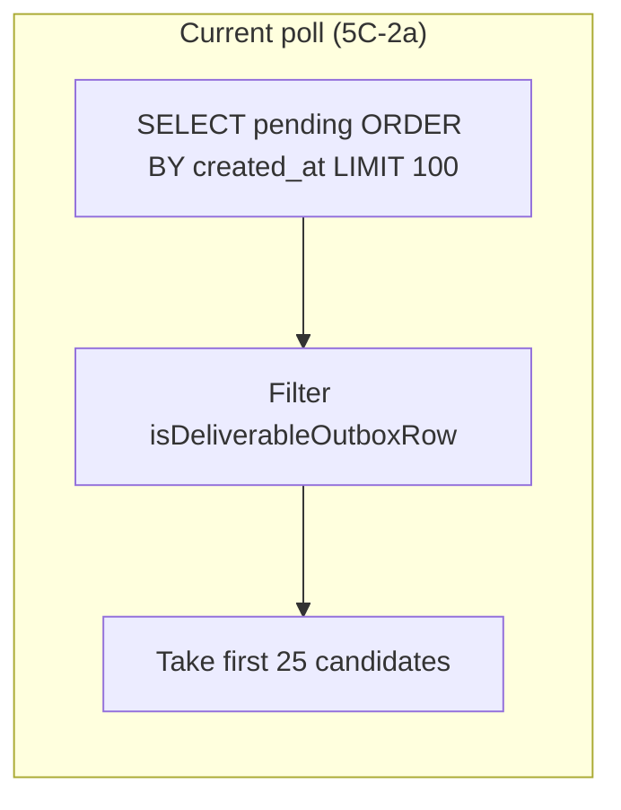

# Stage 5C-2b — Notification worker queue reachability (design)

**Date:** 2026-05-17  
**Status:** Design only — **no implementation in this pass**  
**Depends on:** Stage 5C-2a (cleaner offer email delivery), Stage 5C-2 staging soak  
**Inputs:** [stage-5c-2-cleaner-offer-email-staging-soak.md](../audits/stage-5c-2-cleaner-offer-email-staging-soak.md), [stage-5c-2-cleaner-offer-email-final-audit.md](../audits/stage-5c-2-cleaner-offer-email-final-audit.md)

---

## 1. Executive summary

Staging soak proved **5C-2a logic is correct in code and tests**, but **`assignment_offer` rows are not reachable** in production-like conditions because the worker loads the **oldest 100 `pending` rows of any template**, then filters in memory. **202** unsupported rows (`booking_draft_created`, `payment_pending`, etc.) sit ahead of the first offer in `created_at` order, so **zero deliverable rows** appear in the fetch window.

**Recommendation:** Change polling to query **`pending` rows for supported templates only** (allowlist), with explicit channel rules:

| Template | Channel |
|----------|---------|
| `payment_confirmed` | `email` |
| `payment_failed` | `email` |
| `assignment_offer` | `push` |

**Do not** mark unsupported templates `sent` or `failed`. Leave them `pending` for future slices.

**Prerequisite:** **5C-2a must be deployed** to Vercel before offer emails can send at all; 5C-2b fixes reachability only.

**Smallest safe slice:** Single-file change to `processNotificationOutbox` poll query + tests; deploy **5C-2a + 5C-2b** together to staging.

---

## 2. Staging soak findings (recap)

| Finding | Value / implication |
|---------|-------------------|
| Pending `assignment_offer` | **18** |
| Would send (guards pass) | **8** → `test_e2e_cleaner@shalean.co.za` only |
| Pending rows before first offer | **202** (unsupported templates) |
| Deliverable in oldest 100 `pending` | **0** |
| Cron run 1 | `scanned: 1`, `sent: 1` — `payment_confirmed`, not offer |
| Cron runs 2–6 | `scanned: 0` |
| Promoted offer row to front | Still `scanned: 0` → **hosted build likely lacks 5C-2a** |
| `assignment_offer` `sent` count after soak | **0** |

See [stage-5c-2-cleaner-offer-email-staging-soak.md](../audits/stage-5c-2-cleaner-offer-email-staging-soak.md) for full evidence.

---

## 3. Audit answers (design questions)

### 3.1 Is 5C-2a deployed on Vercel?

| Source | Assessment |
|--------|------------|
| Staging soak run 7 | One `assignment_offer` row `created_at` forced to `2020-01-01`; cron still `scanned: 0` → **strong evidence 5C-2a is not on `cleaning-service-software.vercel.app`** |
| Local repository | **5C-2a present** — `isDeliverableOutboxRow`, `processAssignmentOfferRow`, `assignmentOffer` template |
| Cron `deliveryEnabled: true` | Proves **5C-1** (customer email) env + worker cron exist, **not** 5C-2a specifically |

**Conclusion:** Treat deployment as **unconfirmed / likely missing** until verified via checklist in §8.

### 3.2 Does the hosted worker support `assignment_offer` with `channel = push`?

| Build | Behavior |
|-------|----------|
| Pre-5C-2 (5C-1 only) | Poll `.eq("channel", "email")` — **`push` rows never loaded** |
| 5C-2a (repo) | Poll all `pending`, filter `assignment_offer` + `push` + valid payload → **supported in code** |
| Hosted (soak) | **Not observed** — no offer row scanned |

**Conclusion:** Support exists **only after 5C-2a deploy**. Reachability fix (5C-2b) is additive on top.

### 3.3 Why does `scanned` become 0 after the first run?



| Run | What happened |
|-----|----------------|
| **Run 1** | Among first 100 `pending` (any template), **one** row passed filter — almost certainly **`payment_confirmed`** (`email`) that appeared early enough in the window, or transient queue state. Processed → `sent`. |
| **Runs 2–6** | First 100 `pending` rows are **only** `booking_draft_created` / `payment_pending` (and similar). Filter removes all → **`candidates.length === 0`** → `scanned: 0`. |

**Important:** `scanned` counts **deliverable candidates after filter**, not raw DB rows. Unsupported rows in the fetch window are **invisible** to metrics — they are never scanned.

This is **not** a bug in send logic; it is a **poll selection** bug.

### 3.4 Should the worker query deliverable templates directly instead of oldest pending rows?

**Yes — recommended.**

| Approach | Verdict |
|----------|---------|
| Oldest N pending → filter | **Reject** — head-of-line blocking (proven in soak) |
| **Pending + supported template/channel predicate in SQL** | **Accept** — matches user recommendation |
| Separate worker per template | Defer — unnecessary complexity for 3 templates |

### 3.5 Should unsupported pending rows remain pending or be skipped/ignored?

| Action | Policy |
|--------|--------|
| Mark `sent` | **Never** — would lie about delivery |
| Mark `failed` | **Never** in worker (soak SQL was ops-only optional drain, out of scope for product code) |
| **Remain `pending`** | **Yes** — until a future stage enables that template |
| Worker touches them | **No** — not selected by query |

Unsupported rows are **ignored by selection**, not by status mutation.

### 3.6 Should `booking_draft_created` / `payment_pending` remain pending until enabled?

**Yes.**

| Template | Stage | Worker action today |
|----------|-------|---------------------|
| `booking_draft_created` | Future (5C+) | Stay `pending` |
| `payment_pending` | Future | Stay `pending` |
| `pending_assignment` | Future | Stay `pending` |
| `cleaner_assigned` | Future | Stay `pending` |

Enqueue paths stay unchanged; only **delivery** is template-scoped.

### 3.7 Should worker fetch by supported template allowlist?

**Yes.** Centralize allowlist next to `config.ts` constants:

```typescript
// Design sketch — not implemented
export const DELIVERABLE_NOTIFICATION_SPECS = [
  { template: PAYMENT_CONFIRMED_TEMPLATE, channel: "email" as const },
  { template: PAYMENT_FAILED_TEMPLATE, channel: "email" as const },
  { template: ASSIGNMENT_OFFER_TEMPLATE, channel: "push" as const },
] as const;
```

`isDeliverableOutboxRow` remains the **single gate** for defense in depth (tests + processing loop).

### 3.8 Should `assignment_offer` push rows be included explicitly?

**Yes.**

| Rule | Reason |
|------|--------|
| `template = assignment_offer` **and** `channel = push` | Matches enqueue from `OFFER_TO_CLEANER`; push is email placeholder until FCM |
| Require `offerId` + `bookingId` in payload | Invalid rows → not selected (or fail at process time) |

Do **not** select `assignment_offer` on `email` channel (none enqueued today). Do **not** select other `push` templates.

### 3.9 How should the worker report skipped unsupported rows?

| Option | Recommendation |
|--------|----------------|
| Mark unsupported as `skipped` in cron JSON | **No** — worker never loads them |
| Add `unsupportedPending: N` to cron response | **Optional (5C-2b+)** — cheap `count` query for ops; not required for MVP |
| Logs only | **Optional** — `deliverablePending: X` in debug log |
| **Keep current response shape** | **Yes for 5C-2b MVP** — `scanned` / `sent` / `skipped` / `failed` refer to **deliverable rows only** |

Document in ops runbook:

- `scanned: 0` with large unsupported backlog is **normal** until those templates ship.
- Monitor deliverable backlog:  
  `select payload->>'template', count(*) from notification_outbox where status = 'pending' and ...`

### 3.10 What tests are required?

| Test | Purpose |
|------|---------|
| **Head-of-line** | Seed 150× `booking_draft_created` pending + 3× `assignment_offer` pending → worker processes offers, drafts stay pending |
| **Template allowlist** | Only supported templates in mock query results get `scanned > 0` |
| **`push` other template** | `push` + `future_alert` stays pending, not scanned |
| **Regression** | `payment_confirmed` / `payment_failed` still send |
| **`assignment_offer`** | Happy path, guards, dedupe (existing tests — keep) |
| **Query builder unit test** | `buildDeliverableOutboxQuery` or mock Supabase chain receives correct `.or()` filter |

---

## 4. Current worker polling behavior (5C-2a)

```510:522:src/features/notifications/server/processNotificationOutbox.ts
  const { data: rows, error } = await client
    .from("notification_outbox")
    .select("*")
    .eq("status", "pending")
    .or(`next_retry_at.is.null,next_retry_at.lte.${nowIso}`)
    .order("created_at", { ascending: true })
    .limit(batchSize * 4);

  const candidates = (rows ?? []).filter(isDeliverableOutboxRow).slice(0, batchSize);
```

| Property | Value |
|----------|-------|
| Batch size | `NOTIFICATION_OUTBOX_BATCH_SIZE` = **25** |
| Fetch limit | **100** (`batchSize * 4`) |
| Order | `created_at` ascending (global FIFO) |
| Post-filter | `isDeliverableOutboxRow` |

**Failure mode:** If the first 100 global pending rows contain **zero** deliverable rows, **no offers or payment emails** are processed that run, regardless of how many deliverable rows exist at positions 101+.

---

## 5. Recommended query strategy

### 5.1 Target behavior

Fetch up to **`batchSize`** rows that are already known to be deliverable:

```sql
-- Logical predicate (implementation via Supabase client)
WHERE status = 'pending'
  AND (next_retry_at IS NULL OR next_retry_at <= :now)
  AND (
    (channel = 'email' AND payload->>'template' IN ('payment_confirmed', 'payment_failed'))
    OR (channel = 'push' AND payload->>'template' = 'assignment_offer'
        AND payload->>'offerId' IS NOT NULL
        AND payload->>'bookingId' IS NOT NULL)
  )
ORDER BY created_at ASC
LIMIT :batchSize
```

### 5.2 Supabase JS sketch

```typescript
// Design only
.or(
  [
    `and(channel.eq.email,payload->>template.in.(${PAYMENT_CONFIRMED_TEMPLATE},${PAYMENT_FAILED_TEMPLATE}))`,
    `and(channel.eq.push,payload->>template.eq.${ASSIGNMENT_OFFER_TEMPLATE})`,
  ].join(","),
)
.order("created_at", { ascending: true })
.limit(batchSize);
```

Validate exact PostgREST filter syntax during implementation (may use `.filter()` or raw RPC if needed). Keep **`isDeliverableOutboxRow`** after fetch as a safety net.

### 5.3 Remove oversized pre-filter fetch

| Before | After |
|--------|-------|
| `limit(batchSize * 4)` + filter | `limit(batchSize)` on deliverable predicate only |
| Effective throughput ≤ 25 deliverable/run | Same |

Optional: use `limit(batchSize)` strictly; no multiplier needed when SQL pre-filters.

### 5.4 Index note

Existing index: `(status, next_retry_at)`. Template filter uses `payload` jsonb — acceptable at current volumes. If backlog grows, consider expression index on `(status, (payload->>'template'))` in a **later** migration (out of 5C-2b scope per RLS/migration rules).

---

## 6. Unsupported template policy

| Principle | Detail |
|-----------|--------|
| **No status mutation** | Worker never updates unsupported rows |
| **Stay `pending`** | Correct semantic: “not yet implemented” |
| **No mass SQL drain** | Per user rules — ops may run ad hoc reports only |
| **Future templates** | Add to allowlist + handler in their own stage |

| Template | Pending in soak DB | 5C-2b behavior |
|----------|-------------------|----------------|
| `booking_draft_created` | Many | Unchanged `pending` |
| `payment_pending` | Many | Unchanged `pending` |
| `pending_assignment` | Few | Unchanged `pending` |
| `cleaner_assigned` | Few | Unchanged `pending` |
| Unknown `push` | 0 today | Unchanged `pending` |

---

## 7. `assignment_offer` push handling

Unchanged from 5C-2a — 5C-2b only fixes **selection**:

| Step | Unchanged |
|------|-----------|
| Enqueue | `OFFER_TO_CLEANER` → `channel: push`, payload with `offerId` |
| Process | `processAssignmentOfferRow` → email via Resend |
| Guards | Offer `offered`, not expired, booking `pending_assignment`, dedupe by `offerId` |
| Channel note | Push = email placeholder until real push infrastructure |

---

## 8. Deployment verification checklist

Run **after** deploy to `https://cleaning-service-software.vercel.app`:

| # | Check | How |
|---|--------|-----|
| 1 | Build includes 5C-2a | Grep deployed source / deployment SHA vs git tag; or feature probe |
| 2 | Build includes 5C-2b | Poll query uses template filter (log or code inspection) |
| 3 | `ENABLE_NOTIFICATION_DELIVERY=true` | Cron `deliveryEnabled: true` |
| 4 | `APP_BASE_URL` | Vercel env = `https://cleaning-service-software.vercel.app` |
| 5 | Cron processes offer | `assignment_offer` row → `sent` without reordering `created_at` |
| 6 | Inbox | `test_e2e_cleaner@shalean.co.za` receives offer email |
| 7 | Dedupe | Second cron → no duplicate for same `offerId` |
| 8 | Unsupported unchanged | `booking_draft_created` still `pending` after cron |

**Probe query after cron (expect `sent` ≥ 1):**

```sql
select status, count(*)
from notification_outbox
where payload->>'template' = 'assignment_offer'
group by 1;
```

---

## 9. Test plan

| Layer | Cases |
|-------|--------|
| **Unit** | Query helper builds correct filter; `isDeliverableOutboxRow` aligned with allowlist |
| **Integration** | Mock Supabase: 200 unsupported + 5 offers → `scanned === 5`, offers processed |
| **Integration** | 68 `payment_confirmed` behind 200 drafts → still processes confirmations |
| **Regression** | All 46 existing notification tests pass |
| **Staging** | Re-run [stage-5c-2 soak checklist](../audits/stage-5c-2-cleaner-offer-email-staging-soak.md) without `created_at` hacks |

---

## 10. Risks and mitigations

| Risk | Severity | Mitigation |
|------|----------|------------|
| Deploy 5C-2b without 5C-2a | High | Deploy together; checklist §8 |
| Burst of 8 offer emails on staging | Medium | Expected once reachable; E2E inbox only |
| PostgREST filter syntax wrong | Medium | Integration test + staging cron |
| `hasSentAssignmentOfferForOffer` scans all `sent` | Low | Existing; optimize later |
| Unsupported backlog confusion in ops | Low | Runbook + SQL monitor deliverable vs total pending |
| Wrong `APP_BASE_URL` | Medium | Verify Vercel env before enable |

---

## 11. Things not to touch

| Area | Reason |
|------|--------|
| Enqueue paths | User rule |
| Assignment / payment commands | User rule |
| RLS | User rule |
| Unsupported row status | User rule — no mass delete/fail |
| New templates | User rule |
| Real push (FCM) | Out of scope |

---

## 12. Final recommendation

### Root cause (two parts)

1. **Reachability (5C-2b):** Poll design starves deliverable rows behind unsupported pending noise.  
2. **Deployment (5C-2a):** Hosted worker may not yet include offer handler at all.

Both must be resolved for staging offer emails.

### Recommended implementation (5C-2b)

1. Add `DELIVERABLE_NOTIFICATION_SPECS` (or equivalent) in `config.ts`.
2. Replace global oldest-100 fetch with **template/channel-filtered** pending query, `limit(batchSize)`.
3. Keep `isDeliverableOutboxRow` + existing processors unchanged.
4. Add head-of-line integration test.
5. Update [notification-outbox-worker.md](../operations/notification-outbox-worker.md) — polling section only.

### Smallest safe slice to unblock staging

| Step | Slice | Required? |
|------|-------|-----------|
| **A** | **Deploy 5C-2a** to Vercel (offer email handler + `isDeliverableOutboxRow`) | **Yes** |
| **B** | **5C-2b** — template-scoped poll query only (~1 file + tests) | **Yes** |
| C | Ops: confirm `APP_BASE_URL` + E2E cleaner inbox | Yes (ops) |
| D | Optional metrics `deliverablePendingCount` | No (defer) |
| E | Ops SQL mass-fail unsupported backlog | **No** (forbidden by rules) |

**Minimum code diff:** `processNotificationOutbox.ts` poll + test file — **no other behavior changes**.

**Minimum deploy unit:** Single Vercel deployment containing **5C-2a + 5C-2b** together, then one cron run should reach `assignment_offer` without manual `created_at` manipulation.

---

## Related

- [stage-5c-2-cleaner-offer-notification-design.md](./stage-5c-2-cleaner-offer-notification-design.md)
- [stage-5c-2-cleaner-offer-email-staging-soak.md](../audits/stage-5c-2-cleaner-offer-email-staging-soak.md)
- [notification-outbox-worker.md](../operations/notification-outbox-worker.md)
