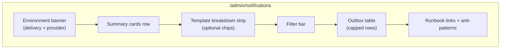

# Stage 5D-2 — Global Notification Health Page Design

**Date:** 2026-05-17  
**Status:** Design only — no implementation  
**Depends on:** [stage-5d-notification-admin-observability-design.md](./stage-5d-notification-admin-observability-design.md), [stage-5c-2b-notification-worker-queue-reachability-design.md](./stage-5c-2b-notification-worker-queue-reachability-design.md), [notification-outbox-worker.md](../operations/notification-outbox-worker.md)

**Goal:** Design a **read-only** admin page at `/admin/notifications` to monitor `notification_outbox` health globally — queue depth, failures, backlog, dry-run state, and worker configuration hints — without mutation, worker changes, or RLS changes.

**Non-goals:** Retry/resend buttons, outbox `UPDATE`/`INSERT` from UI, new cron behavior, `notification_worker_runs` table (optional later), email body preview, service-role reads from browser-facing routes.

---

## Executive summary

| Decision | Recommendation |
|----------|----------------|
| Route | `/admin/notifications` (admin layout + nav link) |
| Data | `notification_outbox` via admin JWT `SELECT` (same as 5D-1) |
| Mapper | **Reuse** `mapNotificationOutboxRowForAdmin()`; extend with `isDeliverable`, `deliveryClass`, optional `recipientLabel` |
| Counts | Parallel head/count queries with deliverable vs unsupported predicates |
| Default table view | **Needs attention** — deliverable `pending` / `processing` / `failed`, newest first, cap 100 |
| Unsupported backlog | **Separate card + filter**, not mixed into “action required” without toggle |
| Cron health | **Env/config banner only** in 5D-2; no live cron ping; no persisted last-run |
| Retry/resend | **Deferred** to Stage 5D-3+ |

---

## Current notification observability state

### Shipped (Stage 5D-1)

| Capability | Status |
|------------|--------|
| Per-booking history | Admin booking detail → **Notifications** section |
| Query | `payload->>bookingId` match, limit **25**, newest first |
| Mapper | `mapNotificationOutboxRowForAdmin.ts` — sanitized DTO, dry-run parse, email redaction |
| UI | `AdminBookingNotificationsSection` — compact table, empty state, no buttons |
| Global page | **Not implemented** |
| Admin home chip | **Not implemented** |

### Worker / ops (unchanged in 5D-2)

| Topic | Behavior |
|-------|----------|
| Deliverable templates | `payment_confirmed`, `payment_failed` (`email`); `assignment_offer` (`push`) |
| Unsupported (enqueue only) | `booking_draft_created`, `payment_pending`, `pending_assignment`, `cleaner_assigned`, unknown |
| Delivery gate | `ENABLE_NOTIFICATION_DELIVERY` + provider config |
| Stale reclaim | `processing` → `pending` after `NOTIFICATION_PROCESSING_STALE_MINUTES` (default 15) |
| Max attempts | 5 — then `failed` or stuck `processing` (no reclaim) |
| Cron | `/api/cron/process-notification-outbox` — response JSON not persisted |

### RLS (unchanged)

`notification_outbox_admin` — authenticated admin `FOR ALL`. **5D-2 must remain SELECT-only in application code** despite write-capable policy.

---

## Proposed page layout



### Section order (top → bottom)

| # | Section | Purpose |
|---|---------|---------|
| 1 | **Page title** | “Notification delivery” — subtitle: read-only queue health |
| 2 | **Environment banner** | Worker will run or no-op; `dry_run` vs `resend`; link to runbook |
| 3 | **Summary cards** | Platform counts (deliverable + unsupported split) |
| 4 | **Oldest pending age** (single metric line) | SLA signal for deliverable queue |
| 5 | **Template breakdown** | Small chips: count per template (deliverable statuses only) |
| 6 | **Filter bar** | Query params; “Reset” / “Show all” |
| 7 | **Outbox table** | Reuse/extend 5D-1 table component; booking links |
| 8 | **Footer notes** | Unsupported template explanation; no manual `UPDATE sent` |

**Nav:** Add **Notifications** to `DashboardShell` nav on all admin pages (Home, Bookings, Assignments, Payouts, **Notifications**).

**Optional 5D-2.1:** Home `/admin` chip — “N failed · M deliverable pending” linking here (deferred from 5D master design).

---

## Summary card definitions

Counts should be computed with the **same deliverable predicate** as the worker (`buildDeliverableOutboxTemplateOrFilter()` / `DELIVERABLE_NOTIFICATION_SPECS`).

### Primary cards (deliverable scope)

| Card | Query concept | Admin interpretation |
|------|-------------|----------------------|
| **Sent** | `status = sent` ∧ deliverable | Successfully processed (includes dry-run-marked-sent) |
| **Pending (actionable)** | `status = pending` ∧ deliverable ∧ (`next_retry_at` null OR ≤ now) | Worker will pick up on next cron |
| **Scheduled retry** | `status = pending` ∧ deliverable ∧ `next_retry_at` > now | Waiting for backoff — not stuck |
| **Processing** | `status = processing` ∧ deliverable | In flight — watch for stale |
| **Failed** | `status = failed` ∧ deliverable | Terminal — needs ops / future requeue |
| **Stale processing** | `status = processing` ∧ deliverable ∧ `updated_at` < now − stale minutes | Reclaim eligible on next cron |

### Secondary cards (context, not “broken”)

| Card | Query concept | Admin interpretation |
|------|-------------|----------------------|
| **Unsupported pending** | `status = pending` ∧ NOT deliverable | Expected backlog until future worker stage — **does not block queue** |
| **Dry-run rows** | deliverable ∧ (`last_error` LIKE `dry_run_sent%` OR dry-run preview pending) | Staging/test traffic — not live Resend |

### Derived metric (not a card — prominent text)

| Metric | Query concept |
|--------|---------------|
| **Oldest deliverable pending age** | `min(created_at)` where `status = pending` ∧ deliverable ∧ retry due |

Display as: “Oldest actionable pending: **2h 14m**” or “None” when zero.

### What admins should **not** misread

| Pitfall | UI mitigation |
|---------|----------------|
| Large unsupported `pending` | Separate card labeled “Unsupported (not delivered yet)” |
| `sent` with dry-run metadata | Badge on row + optional dry-run card count |
| `ENABLE_NOTIFICATION_DELIVERY=false` | Red/amber banner: “Delivery disabled — rows will not send” |
| Cron `scanned: 0` | Explain deliverable queue may be empty even if unsupported pending exists |

---

## Table / filter design

### Default view (“Needs attention”)

| Default | Value |
|---------|--------|
| `deliverable` | `true` |
| `status` | `pending,processing,failed` (multi or preset) |
| `sort` | `created_at desc` |
| `limit` | 100 |

Toggle: **Show all statuses** (includes `sent`), **Show unsupported only**.

### Filter parameters (query string)

| Param | Values | Priority |
|-------|--------|----------|
| `status` | `pending`, `processing`, `sent`, `failed` (comma-separated) | P0 |
| `deliverable` | `true` (default), `false`, `all` | P0 |
| `template` | Known templates + `unsupported` | P0 |
| `channel` | `email`, `push` | P1 |
| `dryRun` | `true` | P1 |
| `stuck` | `true` — stale `processing` OR (`pending` ∧ `attempts` ≥ max) | P1 |
| `bookingId` | UUID (deep link from booking detail) | P1 |
| `from` / `to` | `created_at` date (inclusive day, UTC or app TZ — match bookings list) | P2 |
| `recipientType` | `customer`, `cleaner` | P2 |

**Preset chips (UX):** Needs attention · Failed only · Pending only · Dry run · Unsupported backlog · Show all

### Table columns (global list)

| Column | Source | Notes |
|--------|--------|-------|
| Template | DTO `template` | Mono font |
| Status | DTO `status` + `deliveryClass` badge | Tone from class |
| Channel | DTO `channel` | |
| Recipient | `recipientType` + optional `recipientLabel` | **No email** |
| Booking | Link if `bookingId` | `/admin/bookings/{id}` |
| Offer | Short id if `offerId` | Tooltip full id |
| Attempts | `attemptCount` | |
| Next retry | `nextRetryAt` | Relative time |
| Updated | `updatedAt` | |
| Note | `statusNote` | Sanitized error or dry-run summary |
| Age | derived from `createdAt` | For pending rows especially |

**No action column.** No checkboxes for bulk retry.

### Component reuse (5D-2 implementation)

| Piece | Approach |
|-------|----------|
| Mapper | Extend `mapNotificationOutboxRowForAdmin` with `isDeliverable`, `deliveryClass` |
| Table | Generalize `AdminBookingNotificationsSection` → `AdminNotificationOutboxTable` with `showBookingLink` prop |
| Read model | New `notificationAdminReadModel.ts`: `getNotificationHealthSummary`, `listNotificationOutbox` |

---

## Safe field policy

### Expose (allowlist — same as 5D-1 plus global fields)

| Field | Global page |
|-------|-------------|
| `id`, `template`, `status`, `channel` | Yes |
| `bookingId`, `offerId` | Yes — **as links** |
| `recipientType` | Yes |
| `recipientLabel` | Optional P1 — batch join `customers` / `cleaners`+`profiles` (company name / full name) |
| `attemptCount`, `nextRetryAt`, `createdAt`, `updatedAt` | Yes |
| `lastError`, `statusNote`, `isDryRun`, `dryRun` | Yes |
| `isDeliverable`, `deliveryClass` | Yes (new) |
| `diagnosticCategory` | Yes for `failed` / stuck rows (derived) |

### Hide (never in API JSON or HTML)

| Field | Reason |
|-------|--------|
| Auth email addresses | PII |
| Raw `payload` JSON | Secrets / future keys |
| `recipient` UUID alone as “email” | Misleading — not an address |
| `RESEND_API_KEY`, `CRON_SECRET`, provider tokens | Secrets |
| Email HTML/text bodies | Not stored |
| Full webhook / payment event payloads | Out of scope |
| Internal env values beyond booleans/enums | Only `deliveryEnabled`, `emailProvider` |

### Sanitization (mandatory)

- Reuse `sanitizeNotificationLastError()` for all `last_error` display.
- Reuse `parseDryRunMetadataFromLastError()` — never show unparsed blob longer than one line in table.
- Assert in tests: `JSON.stringify(row).includes('@') === false` for fixture rows with emails in DB columns.

---

## Query strategy

### Access pattern

```
requireAdmin(user)
  → createSupabaseServerClient()  // admin JWT, RLS SELECT
  → parallel count queries + one list query
  → map each row with mapNotificationOutboxRowForAdmin()
```

**Do not** use service role on a user-facing page route.

### Deliverable predicate (shared)

Centralize in `isDeliverableOutboxRow()` (already exists on worker) or duplicate-safe SQL filter mirroring `buildDeliverableOutboxTemplateOrFilter()`:

```
(channel = email AND template IN (payment_confirmed, payment_failed))
OR (channel = push AND template = assignment_offer)
```

PostgREST: reuse `.or(buildDeliverableOutboxTemplateOrFilter())` for list/count when `deliverable=true`.

**Unsupported:** `deliverable=false` → `pending` rows NOT matching deliverable OR template not in supported set (app-side filter acceptable for unsupported-only view if SQL negation is awkward).

### Count queries

Run **parallel** head requests (or `select('*', { count: 'exact', head: true })`) — one per card — to avoid loading full table:

| Query | Filters |
|-------|---------|
| sent_deliverable | deliverable + status=sent |
| pending_actionable | deliverable + pending + retry due |
| … | (see summary cards) |

**Cap:** Counts are full-table aggregates — acceptable at current volume; revisit if outbox &gt; ~50k rows (materialized view or RPC later).

### List query

```ts
.from('notification_outbox')
.select('id, channel, recipient, payload, status, attempts, next_retry_at, last_error, created_at, updated_at')
// apply filters from query params
.order('created_at', { ascending: false })
.limit(GLOBAL_LIST_LIMIT)  // 100 default, max 200 hard cap
```

**Oldest pending age:** separate query:

```ts
.select('created_at')
.eq('status', 'pending')
// deliverable + retry due filters
.order('created_at', { ascending: true })
.limit(1)
.maybeSingle()
```

### Pagination

| Approach | Recommendation |
|----------|----------------|
| **5D-2 P0** | Fixed cap **100** (200 max), no cursor — matches admin bookings list pattern |
| **5D-2.1** | `?cursor=` on `created_at` + `id` if ops report truncation pain |

Show footer: “Showing latest **100** rows — refine filters or export via SQL for more.”

### Performance notes

- Index exists: `(status, next_retry_at)` — good for worker; global filters on `payload->>template` may seq-scan at scale — acceptable for 5D-2.
- Optional: add expression index `(payload->>'bookingId')` in a **future migration** (out of 5D-2 scope per “no RLS” — index-only migration could be 5D-2b).

---

## Cron health display

### Design question 11: Should this page include cron health status?

**Yes — partially, read-only, config-derived only in 5D-2.**

| Signal | 5D-2 source | Display |
|--------|-------------|---------|
| Delivery enabled | `canRunNotificationDelivery()` | Banner: enabled / disabled |
| Email provider | `getNotificationDeliveryConfig().emailProvider` | `dry_run` or `resend` badge |
| Provider ready | `providerReady` + missing env hints | “Resend not configured” when applicable |
| Stale threshold | `getProcessingStaleMinutes()` | Footnote: “Processing rows older than **15m** may be reclaimed” |
| Last cron run | **Not available** | Text: “Last cron run not recorded — invoke manually or check Vercel logs” |
| Last `reclaimed` / `scanned` | **Not available** | Defer to `notification_worker_runs` or external monitoring |

**Do not** call the cron route from the admin page (would require `CRON_SECRET` on server page or a side-effecting health check — rejected).

**Do not** impersonate cron from browser.

### Future cron panel (5D-3 / ops)

Persist last run in DB or poll Vercel cron logs API — show `reclaimed`, `scanned`, `sent`, `failed`, timestamp.

---

## Failed diagnostics policy

### Design question 4: How should failed rows be diagnosed safely?

| Layer | Behavior |
|-------|----------|
| **Row badge** | `diagnosticCategory` derived server-side (enum) |
| **Note column** | `statusNote` = sanitized `last_error` only |
| **Expandable detail** (optional P1) | Static text per category — no live email lookup in UI |
| **Runbook link** | Link to `notification-outbox-worker.md` § troubleshooting |

### `diagnosticCategory` mapping (reuse 5D master design)

| Category | When | Safe admin message |
|----------|------|-------------------|
| `delivery_disabled` | Env off + old pending | Delivery flag off — cron no-ops |
| `unsupported_template` | Not deliverable | Not delivered in current worker version |
| `no_recipient_email` | Failed after NO_EMAIL | Recipient has no auth email |
| `recipient_not_found` | CUSTOMER/CLEANER_NOT_FOUND | Invalid recipient id |
| `booking_not_found` | BOOKING_NOT_FOUND | Booking missing |
| `offer_not_found` | OFFER_NOT_FOUND | Offer missing |
| `stale_booking_state` | Stale guard messages | Booking state changed — send skipped/failed |
| `provider_send_failed` | SEND_FAILED, retryable | Provider error — will retry if attempts remain |
| `max_attempts_exhausted` | failed + attempts ≥ 5 | Retries exhausted |
| `stale_processing_reclaimed` | last_error reclaim text | Was stuck in processing — reclaimed |
| `dry_run` | dry_run_sent prefix | Test mode — no live email |
| `unknown` | else | Show sanitized note only |

**Never** show: stack traces, Resend API keys, raw provider JSON, customer email.

**Global page:** Failed filter preset + red **Failed** card count; clicking card applies `status=failed&deliverable=true`.

---

## Unsupported pending templates

### Design question 3: How should unsupported pending templates be shown?

| UX element | Treatment |
|------------|-----------|
| **Summary card** | Dedicated **Unsupported pending** count — muted/neutral tone |
| **Default table** | **Excluded** from “Needs attention” |
| **Preset filter** | “Unsupported backlog” sets `deliverable=false` or `template=unsupported` |
| **Row badge** | `deliveryClass: unsupported_queued` |
| **Copy** | “These rows are enqueued for future stages. Worker does not poll them (5C-2b).” |

### Template list (reference)

| Template | Channel | Worker |
|----------|---------|--------|
| `booking_draft_created` | email | Not delivered |
| `payment_pending` | email | Not delivered |
| `pending_assignment` | email | Not delivered |
| `cleaner_assigned` | email | Not delivered |
| `payment_confirmed` | email | **Delivered** |
| `payment_failed` | email | **Delivered** |
| `assignment_offer` | push | **Delivered** (as email) |

---

## Dry-run display

### Design question 5: How should dry-run rows be displayed?

| DB state | Badge | Note column |
|----------|-------|-------------|
| `sent` + `dry_run_sent;…` | **Dry run (marked sent)** | Parsed template / bookingId / recipientType |
| `pending` + `dry_run_sent;…` | **Dry run preview** | “Will run again on next cron” |
| Live `sent`, `last_error` null | **Sent (live)** | — |

**Filter:** `dryRun=true` → `last_error` ilike `dry_run_sent%` OR (`status=pending` AND dry-run metadata).

**Banner:** When `emailProvider === 'dry_run'`, show info banner: “Environment is in dry-run mode — emails are not sent via Resend.”

**Count card:** Optional “Dry-run rows” for staging visibility — avoid alarm styling (info tone).

---

## Processing-stale / reclaim status

### Design question 6: How should processing-stale/reclaim status be shown?

| State | Detection | UI |
|-------|-----------|-----|
| **Fresh processing** | `processing` ∧ `updated_at` within stale window | Warning badge “Processing” |
| **Stale processing** | `processing` ∧ `updated_at` older than stale minutes | Danger badge “Stale processing” + “Reclaim on next cron” |
| **Exhausted processing** | `processing` ∧ `attempts` ≥ 5 | “Stuck — max attempts” (matches worker: not reclaimed) |
| **Recently reclaimed** | `pending` + `last_error` = `Reclaimed stale processing notification` | Info badge “Reclaimed” |

**Card:** **Stale processing** count (deliverable).

**Filter preset:** `stuck=true` → stale processing OR failed OR pending with attempts ≥ max.

**Do not** expose a “Reclaim now” button in 5D-2.

---

## Booking / offer links

### Design question 7: Should booking/offer links be included?

**Yes.**

| Field | Link |
|-------|------|
| `bookingId` | `/admin/bookings/{bookingId}` — primary navigation |
| `offerId` | Same booking page (no per-offer route today) — anchor or scroll hint optional; minimum: tooltip full id |

Deep link **into** global page: `/admin/notifications?bookingId={uuid}` from booking detail (“View all notification rows” optional 5D-2.1 link).

---

## Audit / design question answers (1–12)

| # | Question | Answer |
|---|----------|--------|
| 1 | What counts should admin see? | Deliverable sent / pending (actionable) / scheduled retry / processing / failed / stale processing; plus unsupported pending and dry-run counts |
| 2 | What filters are needed first? | P0: `status`, `deliverable`, `template`; P1: `dryRun`, `stuck`, `bookingId`, `channel` |
| 3 | Unsupported pending? | Separate card + preset; excluded from default “needs attention” |
| 4 | Failed diagnosis? | `diagnosticCategory` + sanitized `statusNote` + runbook links — no PII |
| 5 | Dry-run display? | Badges + parsed metadata + env banner when provider is dry_run |
| 6 | Stale processing? | Stale card + row badge + reclaim note — no manual reclaim |
| 7 | Booking/offer links? | Yes — booking link required |
| 8 | Hidden fields? | Email, raw payload, secrets, bodies — see safe field policy |
| 9 | Query caps / pagination? | Default limit 100, max 200; counts via head queries; cursor later |
| 10 | Tests required? | See test plan |
| 11 | Cron health on page? | **Config-only banner** in 5D-2; last-run deferred |
| 12 | Defer to retry/resend? | All mutations, requeue API, “retry now”, manual status SQL, cron invoke from UI |

---

## Deferred actions (retry / resend phase)

| Capability | Target stage |
|------------|--------------|
| Requeue failed row | 5D-3 |
| “Retry now” (trigger worker batch) | 5D-3 |
| Admin home summary chip | 5D-2.1 (optional) |
| `notification_worker_runs` table + last cron JSON | 5D-3 / ops |
| Expression index on `payload->>'bookingId'` | Migration when volume warrants |
| `recipientLabel` batch join | 5D-2 P1 if table feels sparse |
| Export CSV | Out of scope unless ops request |

---

## Test plan

### Unit tests (`mapNotificationOutboxRowForAdmin` extensions)

| Test | Assert |
|------|--------|
| `isDeliverable` | true/false per template+channel matrix |
| `deliveryClass` | unsupported_queued, stale_processing, dry_run_preview, etc. |
| `diagnosticCategory` | Maps known `last_error` patterns |

### Read-model tests (`notificationAdminReadModel.test.ts`)

| Test | Assert |
|------|--------|
| `getNotificationHealthSummary` | Returns expected counts from mocked client |
| `listNotificationOutbox` | Applies `status`, `deliverable`, `template` filters |
| Oldest pending age | Correct `min(created_at)` behavior |
| Non-admin | Forbidden |
| List limit | Never exceeds 200 |

### Security / serialization tests

| Test | Assert |
|------|--------|
| Serialized list rows | No `@`, no `payload` key, no `recipient` key |
| No mutation methods | No POST route under `/api/admin/notifications` |

### UI tests (`AdminNotificationOutboxTable` / page)

| Test | Assert |
|------|--------|
| Empty state | Copy when no rows match filters |
| Renders booking links | `href` contains `/admin/bookings/` |
| No buttons | No retry/resend/submit controls |
| Env banner | Shows disabled delivery when config off |

### Integration (optional staging)

| Manual | Steps |
|--------|--------|
| Unsupported backlog | Confirm card &gt; 0 while deliverable pending = 0 |
| Dry-run staging | Rows show dry-run badges |
| Failed row | Category + sanitized note visible |

---

## Implementation reference (post-design)

| Artifact | Path |
|----------|------|
| Page | `src/app/(admin)/admin/notifications/page.tsx` |
| Read model | `src/features/notifications/server/notificationAdminReadModel.ts` |
| Mapper (extend) | `src/features/notifications/server/mapNotificationOutboxRowForAdmin.ts` |
| Table component | `src/components/dashboard/AdminNotificationOutboxTable.tsx` (generalize from booking section) |
| Health cards | `src/components/dashboard/AdminNotificationHealthCards.tsx` |
| Config banner | `src/components/dashboard/AdminNotificationDeliveryBanner.tsx` |
| Types | `src/features/notifications/server/notificationAdminTypes.ts` |
| Docs | `admin-operational-dashboard.md`, `notification-outbox-worker.md` |

---

## Risks and mitigations

| Risk | Mitigation |
|------|------------|
| Admin confuses unsupported pending with outage | Separate card + copy + default filter excludes them |
| Full-table count scans slow | Accept for now; monitor row count |
| RLS `FOR ALL` temptation | No write APIs; code review checklist |
| Dry-run `sent` looks like production success | Dry-run badge + provider banner |
| Table truncation at 100 | Footer + filters; cursor later |
| Missing cron last-run | Explicit “not recorded” copy |

---

## Final recommendation

### Should 5D-2 ship cron last-run on day one?

**No.** Ship **config-derived cron hints** only. Persisted last-run belongs in a later ops slice.

### What is the safest first implementation slice for Stage 5D-2?

**Slice A (recommended first): Route + nav + delivery banner + summary cards + attention-default table**

| Include | Exclude (later slice) |
|---------|------------------------|
| `/admin/notifications` route + nav | Admin home chip |
| `getNotificationHealthSummary` (core cards) | Date range filters |
| `listNotificationOutbox` with `status` + `deliverable` + `template` filters | `recipientLabel` joins |
| Reuse mapper + generalized table with **booking links** | Cursor pagination |
| Default “Needs attention” view (cap 100) | Full preset chip bar |
| Env banner (`deliveryEnabled`, `emailProvider`) | `diagnosticCategory` column (can use `statusNote` only in A) |
| Oldest actionable pending age (one line) | |

**Why this is safest**

1. **Reuses 5D-1** mapper and table — smallest new surface.
2. **Delivers ops value immediately** — failed/pending counts and row list without complex filter matrix.
3. **Avoids cron secret / side effects** — banner only.
4. **Unsupported backlog** included as **one summary card** + copy in banner/footer (no separate table mode required in slice A).
5. Easy to test: read-model mocks + existing mapper tests + static page render.

**Slice B:** Full filter presets, dry-run filter, stale/stuck presets, `diagnosticCategory`, template breakdown chips, `recipientLabel`.

**Slice C:** Admin home chip, `?bookingId=` deep links from booking detail, cursor pagination, optional cron last-run persistence.

---

## Related documents

| Doc | Role |
|-----|------|
| [stage-5d-notification-admin-observability-design.md](./stage-5d-notification-admin-observability-design.md) | Parent 5D design |
| [notification-outbox-worker.md](../operations/notification-outbox-worker.md) | Worker env, cron, dry-run |
| [admin-operational-dashboard.md](../operations/admin-operational-dashboard.md) | Admin routes (update when implementing) |
