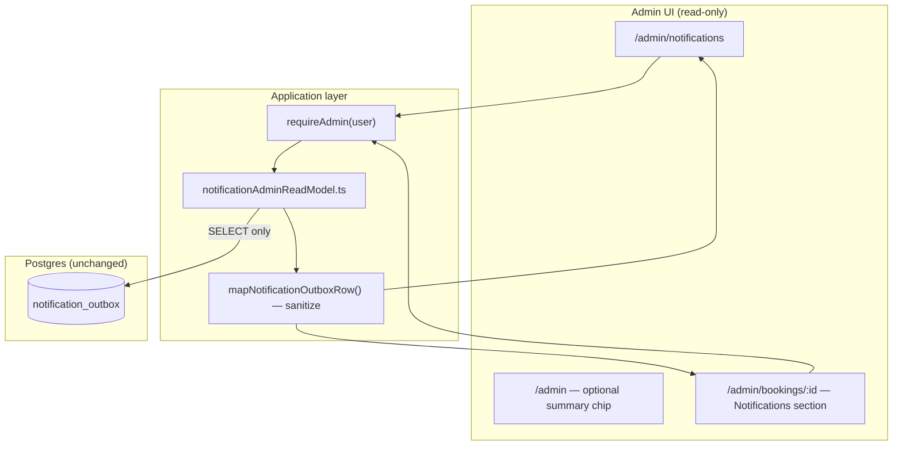

# Stage 5D — Notification Admin Observability Design

**Date:** 2026-05-17  
**Status:** Design only — no implementation  
**Depends on:** [stage-5c-notification-system-operational-messaging-audit.md](../audits/stage-5c-notification-system-operational-messaging-audit.md), [notification-outbox-worker.md](../operations/notification-outbox-worker.md), [notification-outbox.md](../operations/notification-outbox.md), [admin-operational-dashboard.md](../operations/admin-operational-dashboard.md)

**Goal:** Give admins a **read-only** way to see notification delivery health from the dashboard — without sending email, changing the worker, tightening RLS, or adding retry/resend actions.

**Non-goals (this stage):** Resend/retry buttons, outbox mutation from UI, worker logic changes, new migrations, RLS policy changes, provider webhooks in admin UI, email body preview.

---

## Executive summary

| Decision | Recommendation |
|----------|----------------|
| Data source | Existing `notification_outbox` table (admin RLS already allows `SELECT`) |
| Access pattern | **Server-only read models** + admin auth gate (same as `getAdminBookingDetail`) |
| New routes | `/admin/notifications` (global health) + **booking detail section** (per-booking history) |
| Email addresses | **Never** exposed in UI or API JSON |
| Recipient display | `recipientType` + resolved **label** (company name / cleaner name) — no raw auth email |
| Dry-run visibility | Parse safe `last_error` metadata (`dry_run_sent;…`) + optional env banner for provider mode |
| Retry/resend | **Deferred** to Stage 5D-2+ with audit + service-role command |
| RLS | **Unchanged** — UI must remain read-only even though policy is `FOR ALL` |

---

## Current notification worker status

As of Stage **5C-2b** + post-hotfix verification (2026-05-17):

| Capability | Status |
|------------|--------|
| Cron route | `GET`/`POST` `/api/cron/process-notification-outbox` — **implemented** |
| Delivery gate | `ENABLE_NOTIFICATION_DELIVERY=true` required; otherwise no-op |
| Provider | Resend when configured; `dry_run` default on non-prod / when Resend missing |
| Templates delivered | `payment_confirmed`, `payment_failed` (email), `assignment_offer` (push channel → email placeholder) |
| Templates enqueued but not delivered | `booking_draft_created`, `payment_pending`, `pending_assignment`, `cleaner_assigned` — stay **`pending`**, not polled |
| Polling | Template-scoped allowlist (5C-2b) — unsupported `pending` rows do **not** block deliverable queue |
| Stale reclaim | `processing` → `pending` after `NOTIFICATION_PROCESSING_STALE_MINUTES` (default 15) |
| Retries | Up to `NOTIFICATION_MAX_ATTEMPTS` (5); exponential backoff via `next_retry_at` |
| Dedupe at delivery | Per-booking (`payment_*`) and per-offer (`assignment_offer`) skip duplicate sends |
| Dry-run | `NOTIFICATION_DRY_RUN_MARK_SENT` controls `sent` vs `pending` + `last_error` preview metadata |

**Code references:**

| Piece | Path |
|-------|------|
| Worker | `src/features/notifications/server/processNotificationOutbox.ts` |
| Config / allowlist | `src/features/notifications/server/config.ts` |
| Dry-run metadata | `src/features/notifications/server/dryRunDelivery.ts` |
| Stale reclaim | `src/features/notifications/server/reclaimStaleProcessingNotifications.ts` |
| Ops runbook | `docs/operations/notification-outbox-worker.md` |

**Production verification (hosted):** Delivery enabled; dedupe probes pass; `APP_BASE_URL` must be set on Vercel so email links are not `localhost` ([stage-5c-post-hotfix-notification-verification.md](../audits/stage-5c-post-hotfix-notification-verification.md)).

---

## Admin visibility gaps

### What admins can see today

| Surface | Notification awareness |
|---------|------------------------|
| `/admin` summary cards | Payment / assignment counts only — **no outbox metrics** |
| `/admin/bookings` | Booking status implies *intent* to notify — **no delivery state** |
| Booking detail | Lifecycle audit, admin ops audit, offers — **no `notification_outbox` rows** |
| Runbooks / SQL | Operators must query Supabase or cron JSON manually |

### Operational questions that are hard to answer

1. Did `payment_confirmed` actually send for this booking, or is it still `pending` behind unsupported rows?
2. How many `failed` notifications exist platform-wide, and for which templates?
3. Is the worker stuck on `processing`, or is delivery disabled (`ENABLE_NOTIFICATION_DELIVERY`)?
4. Was staging exercise a **dry-run preview** (`last_error` metadata) vs real `sent`?
5. For a failed cleaner offer email, is the root cause **no email on profile**, **stale offer**, or **provider error**?
6. Are duplicate enqueue rows being **skipped** at delivery (dedupe) vs genuinely unsent?

### Security / policy gaps (observability-only; no RLS change in 5D)

| Gap | Detail | 5D mitigation |
|-----|--------|----------------|
| Admin `FOR ALL` on `notification_outbox` | Authenticated admin JWT can **write** outbox rows via Supabase client | UI + API **select-only**; no edit controls; document “do not mutate outbox in SQL” |
| `recipient` column | Stores `customers.id` / `cleaners.id` | Show **type + label**, not resolvable email in read model |
| `last_error` | May contain provider text; worker redacts `@` | Reuse `sanitizeErrorMessage` rules in read mapper |
| Cron JSON | Safe previews only | Optional read-only “last cron snapshot” is **out of scope** for 5D unless persisted later |

---

## Proposed dashboard / read-model design

### Architecture



**Principles**

- Mirror `adminOperationsReadModel.ts`: admin user → `createSupabaseServerClient()` → queries with admin JWT (RLS permits read).
- **No** service-role reads from browser-exposed routes unless existing admin APIs already do so for parity (prefer user-scoped admin client for consistency with booking detail).
- All shaping in **one mapper** so list and detail share sanitization rules.
- Cap row limits (e.g. global list 100–200, booking history 50) ordered by `created_at desc`.

### New module (implementation reference)

| Artifact | Purpose |
|----------|---------|
| `src/features/notifications/server/notificationAdminReadModel.ts` | `getNotificationHealthSummary`, `listNotificationOutbox`, `listNotificationsForBooking` |
| `src/features/notifications/server/mapNotificationOutboxRow.ts` | Safe DTO + diagnostics |
| `src/features/notifications/server/notificationAdminTypes.ts` | `AdminNotificationOutboxEntry`, filters, summary types |
| `src/components/dashboard/AdminNotificationOutboxTable.tsx` | Reusable table |
| `src/components/dashboard/AdminNotificationHealthCards.tsx` | Count cards |
| `src/app/(admin)/admin/notifications/page.tsx` | Global observability page |
| Booking detail | Section in `app/(admin)/admin/bookings/[bookingId]/page.tsx` |

### Global page: `/admin/notifications`

**Purpose:** Platform-wide delivery health at a glance.

| Section | Content |
|---------|---------|
| **Health cards** | Counts by `status` for **deliverable** templates only; separate card for **unsupported pending backlog** |
| **Environment banner** (server-derived, not secret) | `deliveryEnabled`, `emailProvider` (`dry_run` \| `resend`), link to worker runbook — from `getNotificationDeliveryConfig()` / `canRunNotificationDelivery()` |
| **Filters** | See [Filters and counts](#filters-and-counts) |
| **Table** | Paginated/capped outbox rows (newest first) |
| **Empty states** | Explain unsupported `pending` vs disabled delivery |

Nav: add **Notifications** to `DashboardShell` nav on admin layout pages (alongside Bookings, Assignments, Payouts).

### Booking detail: notification history section

**Purpose:** Support “why didn’t customer/cleaner get email?” during a single booking investigation.

| Field | Placement |
|-------|-----------|
| Section title | **Notifications** (below Admin operations / above or below State audit — recommend **after** operational panel, **before** lifecycle audit) |
| Rows | All outbox rows where `payload->>'bookingId' = :bookingId` |
| Correlation | Show `offerId` link to offer block on same page when present |
| Suggested action | Text-only runbook hints (no buttons): e.g. “Check cleaner profile email in Supabase Auth”, “Confirm `ENABLE_NOTIFICATION_DELIVERY`”, “See notification-outbox-worker.md” |

Extend `AdminBookingDetail` with `notifications: AdminNotificationOutboxEntry[]` via `getAdminBookingDetail` (single extra query).

### Optional home chip (5D.1 — not first slice)

Small card on `/admin`: “Notifications: N failed · M deliverable pending” linking to `/admin/notifications`. Defer until global page exists.

---

## Safe fields to expose

Mapped DTO: `AdminNotificationOutboxEntry`

| Field | Source | Notes |
|-------|--------|-------|
| `id` | `notification_outbox.id` | Link key for support tickets |
| `status` | `status` | `pending` \| `processing` \| `sent` \| `failed` |
| `channel` | `channel` | `email` \| `push` |
| `template` | `payload.template` | Known template string or `unknown` |
| `bookingId` | `payload.bookingId` | Link to admin booking detail |
| `offerId` | `payload.offerId` | Optional; link to offer context on booking page |
| `recipientType` | Derived | `customer` \| `cleaner` \| `unknown` (from template) |
| `recipientLabel` | Join | `customers.company_name` or cleaner `profiles.full_name` — **not** email |
| `recipientEntityId` | `recipient` | Full UUID ok for admin correlation; optional truncate in UI |
| `attempts` | `attempts` | |
| `nextRetryAt` | `next_retry_at` | Null when not scheduled |
| `createdAt` / `updatedAt` | timestamps | |
| `lastErrorSummary` | `last_error` | Sanitized, truncated (500 chars), emails redacted |
| `deliveryClass` | Derived | See below |
| `isDeliverableTemplate` | Derived | Matches worker allowlist |
| `isDryRunMetadata` | Derived | `last_error` starts with `dry_run_sent` or row left `pending` with preview metadata |
| `diagnosticCategory` | Derived | Enum for UI badge — see [Failed notification diagnostics](#failed-notification-diagnostics) |

### `deliveryClass` (derived, for UI tone)

| Value | Meaning |
|-------|---------|
| `unsupported_queued` | Template not in worker allowlist; `pending` expected |
| `queued` | Deliverable + `pending` + retry due or no `next_retry_at` |
| `scheduled_retry` | Deliverable + `pending` + `next_retry_at` in future |
| `in_flight` | `processing` |
| `delivered` | `sent` |
| `terminal_failure` | `failed` |
| `dry_run_recorded` | `sent` with dry-run metadata in `last_error` |
| `dry_run_preview` | `pending` + dry-run preview in `last_error` |
| `stale_processing` | `processing` + `updated_at` older than stale threshold |
| `skipped_dedupe` | `sent` quickly after duplicate enqueue — infer when multiple rows same template/booking and `last_error` null; optional 5D.1 heuristic |

---

## Fields to hide

| Field / data | Reason |
|--------------|--------|
| Auth **email addresses** | PII; not in outbox; resolver would duplicate worker sensitivity |
| Email **HTML / text body** | Not stored in outbox; preview would require worker re-run |
| Raw `payload` JSON blob | Future keys could leak internals; expose allowlisted keys only |
| Resend / provider message IDs | Not stored today; if added later, keep server-side only |
| `RESEND_API_KEY`, `CRON_SECRET` | Secrets |
| Full provider error stacks | Only sanitized `last_error` |
| Payment provider refs, webhook payloads | Unrelated columns |
| Customer phone, street address | Not needed for delivery debugging |
| Admin dispatch metadata | Not in outbox |

**Mapper rule:** Reuse worker `sanitizeErrorMessage` behavior (`@\S+` → `[redacted]`, max length 500).

---

## Filters and counts

### Summary counts (global health cards)

**Deliverable scope** (same SQL predicate as worker `buildDeliverableOutboxTemplateOrFilter()`):

```sql
-- Conceptual: count by status for deliverable rows only
select status, count(*)
from notification_outbox
where (
  (channel = 'email' and payload->>'template' in ('payment_confirmed', 'payment_failed'))
  or (channel = 'push' and payload->>'template' = 'assignment_offer')
)
group by status;
```

| Card | Metric |
|------|--------|
| **Sent** | `status = sent` (deliverable) |
| **Pending (deliverable)** | `status = pending` + deliverable filter |
| **Processing** | `status = processing` + deliverable filter |
| **Failed** | `status = failed` + deliverable filter |
| **Unsupported backlog** | `status = pending` + NOT deliverable filter |
| **Stale processing** | `processing` + `updated_at` < now() - stale minutes |
| **Retry waiting** | `pending` + `next_retry_at` > now() |

Optional breakdown row: **count by template** (deliverable only) for template filter chips.

### List filters (query params on `/admin/notifications`)

| Param | Values |
|-------|--------|
| `status` | `pending`, `processing`, `sent`, `failed` |
| `template` | All known templates + `unsupported` (not in allowlist) |
| `channel` | `email`, `push` |
| `recipientType` | `customer`, `cleaner` |
| `deliverable` | `true` (default), `false` (unsupported only), `all` |
| `dryRun` | `true` — `last_error` like `dry_run_sent%` or dry-run preview pending |
| `bookingId` | UUID — deep link from booking detail |
| `stuck` | `true` — stale `processing` OR `pending` with `attempts >= NOTIFICATION_MAX_ATTEMPTS` |
| `from` / `to` | `created_at` date range |

Default sort: `created_at desc`. Default filter: deliverable + `status` in (`pending`,`failed`,`processing`) for “needs attention” view; provide “show all” toggle.

### Dry-run previews visibility

| Worker mode | DB appearance | Admin display |
|-------------|---------------|-----------------|
| `dry_run` + `NOTIFICATION_DRY_RUN_MARK_SENT=true` | `sent`, `last_error` = `dry_run_sent;template=…;bookingId=…` | Badge **Dry run (marked sent)**; parse metadata columns |
| `dry_run` + `NOTIFICATION_DRY_RUN_MARK_SENT=false` | `pending`, `last_error` = preview metadata | Badge **Dry run preview**; explain row will run again |
| `resend` live | `sent`, `last_error` null | Badge **Sent (live)** |

Show parsed preview fields: `template`, `bookingId`, `offerId`, `recipientType` — matching cron `dryRunPreviews` shape (no email).

### Cron / worker health (read-only hints)

Without persisting cron results:

| Hint | Source |
|------|--------|
| Delivery disabled | `canRunNotificationDelivery() === false` → banner “Worker will no-op” |
| Provider mode | `emailProvider` from config |
| Stale processing count | Query `processing` older than threshold |

**Future (not 5D):** `notification_worker_runs` table or Vercel log drain for last `reclaimed` / `scanned` counts.

---

## Booking detail notification history

### Query

```sql
select *
from notification_outbox
where payload->>'bookingId' = :bookingId
order by created_at desc
limit 50;
```

### UI row format

| Column | Example |
|--------|---------|
| When | `createdAt` (relative + absolute) |
| Template | `payment_confirmed` |
| Status | Badge + `deliveryClass` |
| Recipient | `Customer — Acme Pty` |
| Channel | `email` |
| Attempts / next retry | `2` / `in 30 min` |
| Error | `lastErrorSummary` or dry-run metadata |
| Links | Offer id → scroll to offers panel |

### Correlation with lifecycle audit

| Lifecycle event | Expected notification |
|-----------------|----------------------|
| `FINALIZE_PAYMENT_SUCCESS` | `payment_confirmed` |
| `MARK_PAYMENT_FAILED` | `payment_failed` |
| `OFFER_TO_CLEANER` | `assignment_offer` |
| `CREATE_BOOKING_DRAFT` | `booking_draft_created` (unsupported — stays pending) |

Display a **static hint table** (not live join) so admins understand enqueue without reading command code.

### Empty state

“No notification rows for this booking” — distinguish from “notifications disabled” (env banner on global page only to avoid noise).

---

## Failed notification diagnostics

### `diagnosticCategory` mapping (from `status`, `last_error`, template, booking/offer context)

| Category | Detection | Admin-facing message (no secrets) |
|----------|-----------|-----------------------------------|
| `delivery_disabled` | Rows old `pending`, env off | Delivery flag off — cron will not send |
| `unsupported_template` | Template not in allowlist | Not delivered in current worker version |
| `no_recipient_email` | `last_error` / known codes `NO_EMAIL` | Recipient has no auth email |
| `recipient_not_found` | `CUSTOMER_NOT_FOUND` / `CLEANER_NOT_FOUND` | Invalid recipient id on row |
| `booking_not_found` | `BOOKING_NOT_FOUND` | Payload booking missing |
| `offer_not_found` | `OFFER_NOT_FOUND` | Offer id invalid |
| `stale_booking_state` | payment_failed sent path / failure message | Booking no longer in expected status |
| `provider_send_failed` | `SEND_FAILED`, retryable | Email provider error — will retry if attempts remain |
| `max_attempts_exhausted` | `failed` + `attempts >= 5` | Exhausted retries — manual ops |
| `stale_processing_reclaimed` | `last_error` = `Reclaimed stale processing notification` | Worker reclaimed stuck claim |
| `dry_run` | `dry_run_sent` prefix | Test mode — no live email |
| `dedupe_skip` | `sent` with no error shortly after duplicate row | Duplicate row drained without second send |
| `unknown` | else | Show `lastErrorSummary` |

**Troubleshooting panel (per failed row, text only):**

1. Confirm template is **deliverable** in current release.
2. Confirm `ENABLE_NOTIFICATION_DELIVERY` and provider on environment (link runbook).
3. For customer templates: booking still in expected status?
4. For `assignment_offer`: offer still `offered`? cleaner has profile email?
5. Check `attempts` / `next_retry_at` — will cron retry automatically?
6. If `stale_processing`, wait for reclaim or next cron.
7. **Do not** manually `UPDATE` status to `sent` (runbook warning).

No **Resend** button in 5D — ops use SQL only in break-glass (documented as anti-pattern in worker doc).

---

## Future retry / resend plan (Stage 5D-2+)

| Phase | Capability | Guardrails |
|-------|------------|------------|
| **5D-2** | Admin API `POST …/notifications/:id/requeue` | Service role; only `failed` or dry-run `sent`; sets `pending`, clears `last_error`, increments audit; **no** send in request |
| **5D-3** | “Retry now” triggers cron or inline worker batch size 1 | Same auth as cron; rate limited |
| **5E** | Idempotent “resend” with new outbox row + dedupe key | New migration optional unique index |
| **Never** | Blind `UPDATE status = 'sent'` | Blocks real delivery |

Record human actions in future `admin_operational_audit` action `notification_requeue` (align with 5B-1 pattern).

---

## Test plan

### Unit tests (`mapNotificationOutboxRow`)

| Case | Assert |
|------|--------|
| Sanitize email in `last_error` | No `@` in output |
| Parse `dry_run_sent` metadata | `isDryRunMetadata`, preview fields |
| Deliverable vs unsupported template | `isDeliverableTemplate`, `deliveryClass` |
| `assignment_offer` + `push` | `recipientType === cleaner` |
| Missing payload keys | `template === unknown`, safe defaults |

### Read-model tests

| Test | Assert |
|------|--------|
| `getNotificationHealthSummary` | Counts match fixture DB |
| `listNotificationOutbox` filters | Each query param restricts correctly |
| `listNotificationsForBooking` | Only matching `bookingId` |
| Non-admin user | Returns `ok: false` / forbidden |

### Integration / RLS

| Test | Assert |
|------|--------|
| Admin JWT `SELECT` on `notification_outbox` | Succeeds |
| Customer/cleaner JWT `SELECT` | **Zero rows** (verify existing RLS — customers should not see outbox) |
| No insert from UI routes | API does not call `insert`/`update` |

### Manual QA checklist

1. Staging with `dry_run`: global page shows dry-run badges; booking detail lists rows.
2. Live `resend`: one `sent` row appears as **Sent (live)** without email in UI.
3. Force `failed` row (fixture): diagnostic category and runbook hints render.
4. Booking with only `booking_draft_created` pending: shown as **unsupported queued**.
5. Confirm admin cannot see email in network tab (inspect API JSON).

---

## Risks and mitigations

| Risk | Mitigation |
|------|------------|
| Admin misreads unsupported `pending` as outage | Separate **unsupported backlog** card + `deliveryClass` |
| Accidental outbox mutation (RLS `FOR ALL`) | Read-only API + UI; ops doc warning |
| PII in `last_error` | Sanitize mapper; never join auth email |
| Large outbox table scan | Limits, indexes on `(status, next_retry_at)` already exist; filter by template in SQL |
| Confusion between enqueue dedupe and delivery dedupe | Copy in UI + link to worker doc |
| `APP_BASE_URL` misconfig | Env banner does not fix links but reminds ops to check Vercel env |

---

## Final recommendation

### Should Stage 5D add a new table or only read `notification_outbox`?

**Read `notification_outbox` only** — no new table in 5D. Optional later: `notification_worker_runs` for cron snapshots.

### Should admin use service role or admin JWT?

**Admin JWT** via `createSupabaseServerClient()` for consistency with booking detail and RLS tests — policy already grants admin `SELECT`.

### What is the safest first Stage 5D implementation slice?

**Slice 1 (recommended first): Booking detail notification history only**

| Why safest | Detail |
|------------|--------|
| Smallest blast radius | One query added to `getAdminBookingDetail`, one UI section |
| Highest support value | Admins already live on booking detail during incidents |
| No new route | No nav churn; no global aggregate queries on first deploy |
| Reuses patterns | Same auth, mapper, and table component later used by global page |
| Easy to verify | Compare row list to Supabase for a known booking |

**Deliverables for slice 1:**

1. `mapNotificationOutboxRow` + sanitization unit tests  
2. `listNotificationsForBooking(bookingId)`  
3. Extend `AdminBookingDetail.notifications`  
4. `AdminNotificationOutboxTable` (compact variant) on booking page  
5. Short ops cross-link in `admin-operational-dashboard.md` (when implementing, not in design-only phase)

**Slice 2:** `/admin/notifications` global health + summary counts + filters.

**Slice 3:** Admin home chip + optional stuck-processing alert threshold.

**Explicitly defer:** requeue API, cron snapshot persistence, email HTML preview, RLS tightening (separate security stage).

---

## Design checklist (requirements trace)

| Requirement | Section |
|-------------|---------|
| Current worker status | [Current notification worker status](#current-notification-worker-status) |
| Admin visibility gaps | [Admin visibility gaps](#admin-visibility-gaps) |
| Dashboard / read-model design | [Proposed dashboard / read-model design](#proposed-dashboard--read-model-design) |
| Safe fields | [Safe fields to expose](#safe-fields-to-expose) |
| Hidden fields | [Fields to hide](#fields-to-hide) |
| Filters / counts | [Filters and counts](#filters-and-counts) |
| Booking notification history | [Booking detail notification history](#booking-detail-notification-history) |
| Failed diagnostics | [Failed notification diagnostics](#failed-notification-diagnostics) |
| Future retry/resend | [Future retry / resend plan](#future-retry--resend-plan-staged-5d-2) |
| Test plan | [Test plan](#test-plan) |
| Final recommendation | [Final recommendation](#final-recommendation) |

---

## Related files

| Area | Path |
|------|------|
| Outbox schema | `supabase/migrations/20260515201500_core_foundation.sql` |
| RLS (unchanged in 5D) | `supabase/migrations/20260516160000_rls_role_security.sql` |
| Admin read model pattern | `src/features/dashboards/server/adminOperationsReadModel.ts` |
| Worker | `src/features/notifications/server/processNotificationOutbox.ts` |
| Types | `src/lib/database/types.ts` (`NotificationOutboxRow`) |
