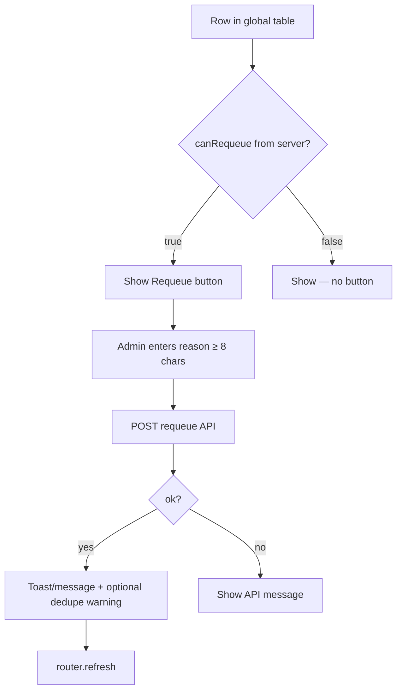

# Stage 5E-1b — Global Notification Requeue + Dry-run Sent Requeue Design

**Date:** 2026-05-17  
**Status:** Design only — no implementation  
**Depends on:** [stage-5e-notification-retry-resend-governance-design.md](./stage-5e-notification-retry-resend-governance-design.md), [stage-5e-1-failed-notification-requeue-final-audit.md](../audits/stage-5e-1-failed-notification-requeue-final-audit.md), [stage-5d-2-global-notification-health-page-design.md](./stage-5d-2-global-notification-health-page-design.md), [notification-outbox-worker.md](../operations/notification-outbox-worker.md)

**Goal:** Extend the safe in-place requeue capability from booking detail to `/admin/notifications`, and define how dry-run `sent` rows may be requeued — without bulk actions, live resend, cron triggers, worker changes, RLS changes, or PII exposure.

**Rules for this stage:** No code, no bulk requeue, no live `sent` resend, no cron-from-UI, no worker/RLS changes, no recipient emails or raw payloads in admin surfaces.

---

## Executive summary

| Decision | Recommendation |
|----------|----------------|
| Global requeue rows | **Same eligibility as booking detail** — failed deliverable + dry-run `sent` deliverable (once 1b ships) |
| Dry-run `sent` requeue | **Yes** — staging ops need to re-run worker after config fixes |
| Dry-run requeue reset | **Yes** — `pending`, `attempts = 0`, `next_retry_at = now()`, `last_error = admin_requeued` (clears `dry_run_sent;…`) |
| Live `sent` | **Blocked** — unchanged from 5E-1a |
| API | **Reuse** `POST /api/admin/notifications/[outboxId]/requeue` — extend helper preconditions only |
| `deliveryDedupeWouldBlock` | **Post-action warning** from API response; **no** per-row preflight on global list (defer) |
| Bulk requeue | **Deferred** — out of 5E-1b |
| `processing` / stale | **Not requeueable** — cron reclaim only |
| Admin reason | **Same 5B-1 contract** — 8–500 chars, required, audit-only |
| Smallest safe slice | **5E-1b-α:** global UI for **failed** only → **5E-1b-β:** helper + eligibility for **dry-run `sent`** |

---

## Current 5E-1a behavior (baseline)

### Shipped surfaces

| Surface | Behavior |
|---------|----------|
| Booking detail | `AdminBookingNotificationsSection` → `AdminNotificationOutboxTable` with `showRequeueActions` |
| Global `/admin/notifications` | Read-only table — `showRequeueActions` **not** passed |
| API | `POST /api/admin/notifications/[outboxId]/requeue` with `{ "reason": string }` |
| Write path | `adminRequeueNotificationOutbox` → service role only |
| Audit | `admin_operational_audit.action = notification_requeue` (migration `20260518190000_…`) |

### Helper preconditions (today)

| Check | Result |
|-------|--------|
| Admin role | 403 if not admin |
| Reason | `validateAdminRecoveryReason` — 8–500 chars, 400 on failure |
| Row exists | 404 if missing |
| `payload.bookingId` | 409 `MISSING_BOOKING_ID` if absent |
| `status` | **Only `failed`** — `sent` / `pending` / `processing` → 409 `INVALID_STATUS` |
| Template | `isDeliverableNotificationRow` — `payment_confirmed`, `payment_failed`, `assignment_offer` |
| Update | `status → pending`, `attempts → 0`, `next_retry_at → now()`, `last_error → admin_requeued` |
| Optimistic guard | `UPDATE … WHERE id = ? AND status = 'failed'` |
| Dedupe preflight | `computeDeliveryDedupeWouldBlock` — **warning only**, does not block requeue |
| Send in request | **None** — cron/worker delivers later |
| Dedupe at delivery | **Unchanged** — worker `hasSent*` may skip email |

### UI eligibility (today)

`computeNotificationRequeueEligibility` returns `canRequeue: true` only when:

- `options.bookingDetailContext === true` (global mapper omits this → always false)
- `status === 'failed'`
- deliverable template
- `bookingId` present

All `sent` rows → `requeueBlockReason: LIVE_ALREADY_SENT` (including dry-run).

`AdminNotificationRequeueAction` shows dedupe warning **after** successful POST when `deliveryDedupeWouldBlock === true`.

---

## Design question answers

### 1. Should global `/admin/notifications` show Requeue for the same rows as booking detail?

**Yes.** After 5E-1b, both surfaces must use the **same server-computed eligibility** (`canRequeue` on `AdminNotificationOutboxEntry`). Ops should not need to open booking detail to requeue a failed row visible on the global health page.

| Surface | Change |
|---------|--------|
| Global page | Pass `showRequeueActions` to `AdminNotificationOutboxTable` |
| Read model | Map rows with `requeueActionsEnabled: true` (rename from `bookingDetailContext`) for **both** `listNotificationsForBooking` and `notificationAdminReadModel` |
| Subtitle | Update from “Read-only” to “Queue health — requeue available for eligible failed rows” (and dry-run sent when β ships) |

**Do not** compute eligibility client-side from `status` alone.

### 2. Should dry-run `sent` rows be requeueable?

**Yes.** Dry-run `sent` means the worker marked the row `sent` with `last_error` prefixed `dry_run_sent;…` — no live email was delivered. Staging ops need to reset these rows after fixing provider/env without SQL.

Detection (already in mapper):

- `isDryRun === true` when `parseDryRunMetadataFromLastError(last_error)` is non-null
- Helper must mirror: `status === 'sent'` **and** `last_error` starts with `dry_run_sent`

### 3. If dry-run `sent` is requeued, should it reset to pending with attempts = 0?

**Yes — identical reset semantics to failed requeue.**

| Field | Value after requeue |
|-------|---------------------|
| `status` | `pending` |
| `attempts` | `0` |
| `next_retry_at` | `now()` |
| `last_error` | `admin_requeued` (replaces `dry_run_sent;…` so UI no longer shows dry-run badge until worker re-marks) |
| `updated_at` | `now()` |
| Unchanged | `channel`, `recipient`, `payload`, `created_at` |

Rationale: exhausted `attempts` on a prior failed path before dry-run mark must not block worker; clearing dry-run metadata avoids confusing “sent (dry run)” display on a `pending` row.

### 4. Should live `sent` rows remain blocked?

**Yes — hard block in helper and UI.**

| Row | Requeue |
|-----|---------|
| `sent` + `last_error` LIKE `dry_run_sent%` | Allowed (5E-1b-β) |
| `sent` + live delivery (`last_error` null or not dry-run prefix) | **Forbidden** — `LIVE_ALREADY_SENT` / `INVALID_STATUS` |

Live resend remains **Slice 3+** (`notification_force_resend` with dedupe bypass) — out of scope.

### 5. Should global requeue use the same API route?

**Yes.** Single route, single helper, single audit action:

`POST /api/admin/notifications/[outboxId]/requeue`

No booking-scoped alias required for 5E-1b (optional defense-in-depth in a later slice). Global and booking detail both POST the same `outboxId`.

### 6. How should UI show `deliveryDedupeWouldBlock`?

| When | Where | UX |
|------|-------|-----|
| **After successful requeue** | `AdminNotificationRequeueAction` success message | Keep 5E-1a pattern: append “Another row may already be sent — worker dedupe may skip email.” |
| **On eligibility (list)** | **Defer** | Per-row preflight requires N service-role queries on global page (up to 100 rows) — unacceptable for SSR |
| **Optional later** | Row tooltip on booking detail only | Prefetch `deliveryDedupeWouldBlock` for visible `canRequeue` rows if product demands pre-warning |

**Do not** add `deliveryDedupeWouldBlock` to `AdminNotificationOutboxEntry` for list rendering in 5E-1b.

Audit and API success body continue to record `deliveryDedupeWouldBlock` for forensics.

### 7. Should bulk requeue be deferred?

**Yes — explicitly out of 5E-1b.** No row checkboxes, no “requeue all failed”, no multi-select. Each action is one outbox id, one reason, one audit row.

### 8. Should processing/stale rows be requeueable or left to reclaim?

**Left to reclaim — not admin-requeueable.**

| Status | Admin action |
|--------|--------------|
| `processing` (non-stale) | Block — `PROCESSING` — race with worker claim |
| `processing` (stale) | **Automatic** `reclaimStaleProcessingNotifications` on cron — no UI button |
| `pending` | Block — worker will pick up; optional “retry now” is **5E-2** |

Admin requeue of `processing` could double-claim or fight the worker; stale reclaim is the supported recovery path.

### 9. What admin reason UX is needed?

**Reuse 5E-1a exactly** — no new fields.

| Requirement | Detail |
|-------------|--------|
| Control | Inline expand on row (existing `AdminNotificationRequeueAction`) |
| Validation | Client `minLength={8}`; server `validateAdminRecoveryReason` |
| Storage | `admin_operational_audit.reason` only — never on `notification_outbox` |
| Copy | Failed: “Requeue failed notification”; dry-run sent (β): “Requeue dry-run notification” |
| Confirm | Single confirm button — no second “force” checkbox in 5E-1b |

Global table: add **Actions** column when `showRequeueActions` — same component as booking detail.

### 10. What tests are required?

| Layer | New / updated cases |
|-------|---------------------|
| `computeNotificationRequeueEligibility` | `requeueActionsEnabled` (not booking-only); dry-run `sent` → `canRequeue: true`; live `sent` → `LIVE_ALREADY_SENT` |
| `mapNotificationOutboxRowForAdmin` | Global context sets `canRequeue` for eligible rows |
| `adminRequeueNotificationOutbox` | Dry-run `sent` → `pending`, attempts 0, `last_error = admin_requeued`; optimistic `WHERE status = 'sent' AND last_error LIKE 'dry_run_sent%'`; reject live `sent` |
| `auditAdminNotificationRequeue` | `oldStatus: sent` in metadata for dry-run path |
| API route | 200 for dry-run sent; 409 for live sent |
| `AdminNotificationOutboxTable` | With `showRequeueActions`, renders Requeue when `canRequeue`; global page integration test |
| Global read model | Mapped rows include `canRequeue` when failed + deliverable |
| Regression | Booking detail still works; global without flag still hides actions (until page wired) |

**Out of scope:** Worker integration tests, Resend live sends, bulk endpoints.

### 11. What should remain forbidden?

| Forbidden | Rationale |
|-----------|-----------|
| Requeue live `sent` | Duplicate customer/cleaner email risk |
| Force resend / dedupe bypass | Slice 3+ |
| Bulk requeue | Blast radius, weak audit per row |
| Cron / “run worker now” from UI | Rate limits, send-in-request smell |
| Browser JWT `UPDATE` on outbox | Break-glass RLS; service role only |
| New outbox rows from admin | Complicates dedupe lineage |
| `pending` / `processing` requeue | Worker/reclaim owns lifecycle |
| Unsupported templates | Worker never delivers |
| Expose `recipient`, raw `payload`, full `last_error` with emails | PII / secret leakage |
| Change worker, RLS, cron schedule | Explicit non-goals |
| `deliveryDedupeWouldBlock` blocking requeue | Warning-only by design |

---

## Eligibility matrix (5E-1b target)

Predicate: deliverable template (`payment_confirmed`, `payment_failed`, `assignment_offer`) **and** `payload.bookingId` present.

| Status | Dry-run? | `canRequeue` (UI) | Helper accepts | Notes |
|--------|----------|-------------------|----------------|-------|
| `failed` | any | **Yes** | **Yes** | Same as 5E-1a |
| `sent` | yes (`dry_run_sent%`) | **Yes** | **Yes** (β) | Label “Requeue (dry run)” |
| `sent` | no (live) | No | No | `LIVE_ALREADY_SENT` |
| `pending` | any | No | No | `PENDING` |
| `processing` | any | No | No | `PROCESSING` — use reclaim |
| `failed` | any | No | No | Unsupported template |
| any | any | No | No | Missing `bookingId` |

---

## Global page UI contract

### Page shell

| Element | 5E-1b change |
|---------|--------------|
| Title | Unchanged — “Notification delivery” |
| Subtitle | “Queue health across all bookings. Requeue eligible failed (and dry-run sent) rows — does not send email immediately.” |
| Banner / cards / filters | Unchanged (read-only aggregates) |
| Table | `showRequeueActions` + `showBookingLink` (already true) |

### Table columns

| Column | Notes |
|--------|-------|
| Existing columns | Template (with “(dry run)” suffix), status, channel, booking link, attempts, updated, note, offer |
| **Actions** | New when `showRequeueActions` — Requeue or em dash |

### Row action visibility



### Filters interaction

| Filter | Requeue visibility |
|--------|-------------------|
| Default “needs attention” (`failed`, `pending`, `processing`) | Requeue on **failed** rows only |
| Include `sent` + dry-run filter/card | Requeue on dry-run **sent** rows |
| Unsupported-only view | No requeue (never deliverable) |

No new filter required for 5E-1b — ops can use status=`sent` and dry-run card count to find dry-run rows.

### Accessibility / ops copy

- Dry-run button label: **“Requeue (dry run)”** when `notification.isDryRun && status === 'sent'`
- Tooltip on disabled live `sent`: not shown (no button) — optional future “Live sent cannot be requeued” in Note column only if confusion reported

---

## Dry-run sent policy

### Definition

A row is **dry-run sent** when:

- `status = 'sent'`
- `last_error` starts with `dry_run_sent` (worker: `NOTIFICATION_EMAIL_PROVIDER=dry_run` or dry-run mark-sent path)

### Why requeue is safe

| Risk | Mitigation |
|------|------------|
| Duplicate live email | No live send occurred; worker dedupe still applies on next run |
| Wrong template | Payload unchanged — same template/booking/offer |
| Production accident | Dry-run is staging/test traffic; live `sent` remains blocked |

### Helper extension (β)

```text
ALLOW requeue WHEN:
  (status = 'failed')
  OR (status = 'sent' AND last_error LIKE 'dry_run_sent%')

AND isDeliverableNotificationRow(row)
AND bookingId present

UPDATE guard:
  (status = 'failed') OR (status = 'sent' AND last_error LIKE 'dry_run_sent%')
```

Audit `metadata.oldStatus` records `sent` vs `failed`; `resultCode` remains `REQUEUED` on success.

### Dedupe interaction for dry-run sent

`hasSent*` queries `status = 'sent'` **without** excluding dry-run rows. A dry-run `sent` row may cause `deliveryDedupeWouldBlock: true` for a sibling **failed** row on the same booking — correct warning.

Requeuing the **dry-run sent row itself**: `excludeOutboxId` excludes self; if another **live** `sent` exists for same booking/template, dedupe warning applies and worker may skip — ops should resolve duplicate rows via existing runbook, not force resend.

---

## API reuse plan

| Component | 5E-1b action |
|-----------|--------------|
| `POST …/requeue/route.ts` | **No change** — thin wrapper stays |
| `adminRequeueNotificationOutbox.ts` | Extend status allowlist + optimistic WHERE for dry-run `sent` |
| `computeNotificationRequeueEligibility.ts` | Replace `bookingDetailContext` with `requeueActionsEnabled`; add dry-run `sent` branch |
| `mapNotificationOutboxRowForAdmin.ts` | Pass `requeueActionsEnabled` from both read models |
| `notificationAdminReadModel.ts` | `mapNotificationOutboxRowForAdmin(row, { requeueActionsEnabled: true })` |
| `listNotificationsForBooking.ts` | Same option (rename) |
| `(admin)/admin/notifications/page.tsx` | `showRequeueActions` on table |
| New routes | **None** |

Response shape unchanged:

```json
{
  "ok": true,
  "outcome": "requeued",
  "outboxId": "…",
  "bookingId": "…",
  "template": "…",
  "status": "pending",
  "deliveryDedupeWouldBlock": false,
  "message": "…"
}
```

---

## Audit behavior

Unchanged action: `notification_requeue`.

| Field | 5E-1b addition |
|-------|----------------|
| `metadata.oldStatus` | May be `sent` for dry-run path |
| `metadata.deliveryDedupeWouldBlock` | Still set on success/failure paths that reach preflight |
| `idempotency_key` | `notification_requeue:{outboxId}:{priorStatus}:{priorUpdatedAt}` — status `sent` vs `failed` distinguishes |
| Fail-soft | Unchanged — audit failure does not roll back requeue |

Rejected live `sent` attempt: audit `INVALID_STATUS`, outcome `rejected`.

---

## Test plan (checklist)

- [ ] Unit: eligibility — global context, failed, dry-run sent, live sent, pending, processing, unsupported
- [ ] Unit: helper — dry-run sent happy path; live sent 409; conflict when row flips to live sent mid-request
- [ ] Unit: mapper — `canRequeue` true on global read model path
- [ ] API: admin auth, reason validation, dry-run sent 200, live sent 409
- [ ] UI: global table shows Actions + Requeue when `canRequeue`
- [ ] UI: booking detail regression
- [ ] UI: success message includes dedupe warning when API flag true
- [ ] Migration: none required for 5E-1b (action already allowed)
- [ ] Manual smoke: requeue failed from `/admin/notifications`; requeue dry-run sent on staging; confirm row `pending`, audit row present

---

## Risks and mitigations

| Risk | Likelihood | Mitigation |
|------|------------|------------|
| Ops confuse requeue with “resend email now” | Medium | Copy in form + runbook; dedupe post-warning |
| Dry-run requeue on row that shares booking with live `sent` | Low | `deliveryDedupeWouldBlock` warning; worker skips send |
| Global page enables requeue on wrong rows | Low | Server-only `canRequeue`; never client inference |
| Double-click duplicate audit | Low | Existing idempotency key on success |
| Migration not applied (audit) | Low (deployed with 5E-1a) | Pre-deploy check; monitor `admin_operational_audit_persist_failed` |
| Admin JWT direct UPDATE still possible | Known | 5E-4 RLS tightening — separate stage |
| Performance: N dedupe prefetches | Avoided | No list-level preflight in 5E-1b |

---

## Final recommendation

| Topic | Decision |
|-------|----------|
| Global vs booking eligibility | **Identical** server rules, both surfaces wired |
| Dry-run `sent` | **Requeueable** with same pending reset |
| Live `sent` | **Blocked** |
| API | **Single reuse** — extend helper only |
| Bulk | **Deferred** |
| Processing/stale | **Reclaim only** |
| Dedupe UI | **Post-success warning** only |

### Smallest safe implementation slice for 5E-1b

Split delivery into two PRs to minimize blast radius:

| Slice | Scope | Risk |
|-------|--------|------|
| **5E-1b-α** (ship first) | Rename `bookingDetailContext` → `requeueActionsEnabled`; enable on global read model + `showRequeueActions` on `/admin/notifications`; **no helper change** (failed only) | **Low** — UI/read-model only; reuses proven API |
| **5E-1b-β** (ship second) | Extend `adminRequeueNotificationOutbox` + eligibility for dry-run `sent`; button label “Requeue (dry run)”; helper tests | **Medium** — new optimistic UPDATE branch |

**5E-1b-α alone** satisfies the primary ops gap (“I see failed rows on the global page but must open booking detail to requeue”). **5E-1b-β** completes the governance design promise for staging dry-run rows without touching worker or RLS.

Do **not** combine bulk requeue, retry-now, force resend, or list-level dedupe preflight into either slice.

---

## References (code)

| Piece | Path |
|-------|------|
| Requeue helper | `src/features/notifications/server/adminRequeueNotificationOutbox.ts` |
| Eligibility | `src/features/notifications/server/computeNotificationRequeueEligibility.ts` |
| API route | `src/app/api/admin/notifications/[outboxId]/requeue/route.ts` |
| UI action | `src/components/dashboard/AdminNotificationRequeueAction.tsx` |
| Table | `src/components/dashboard/AdminNotificationOutboxTable.tsx` |
| Global page | `src/app/(admin)/admin/notifications/page.tsx` |
| Global read model | `src/features/notifications/server/notificationAdminReadModel.ts` |
| 5E-1a audit | `docs/audits/stage-5e-1-failed-notification-requeue-final-audit.md` |
