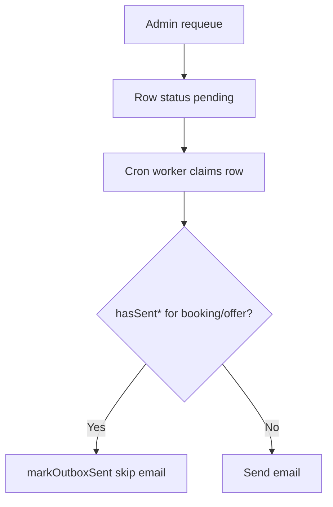
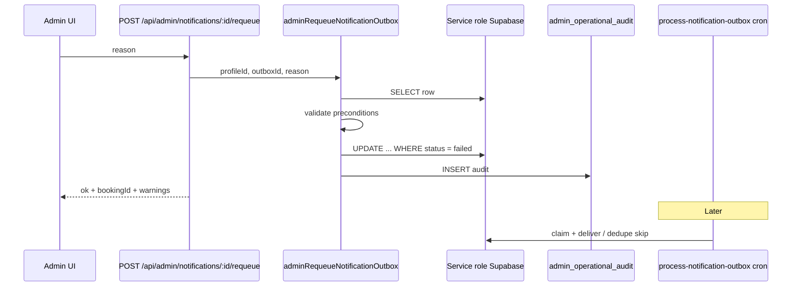

# Stage 5E — Notification Retry/Resend Governance Design

**Date:** 2026-05-17  
**Status:** Design only — no implementation  
**Depends on:** [stage-5d-notification-admin-observability-design.md](./stage-5d-notification-admin-observability-design.md), [stage-5d-2-global-notification-health-page-design.md](./stage-5d-2-global-notification-health-page-design.md), [stage-5d-notification-observability-final-audit.md](../audits/stage-5d-notification-observability-final-audit.md), [stage-5b-1-durable-admin-operational-audit-design.md](./stage-5b-1-durable-admin-operational-audit-design.md), [notification-outbox-worker.md](../operations/notification-outbox-worker.md)

**Goal:** Design safe admin retry/resend actions for `notification_outbox` without duplicate sends, unsafe mutations, or audit gaps.

**Rules for this stage:** No code, no outbox mutations, no email sends, no worker changes, no RLS changes, no exposure of raw payloads or recipient emails.

---

## Executive summary

| Decision | Recommendation |
|----------|----------------|
| Primary action (Slice 1) | **In-place requeue** — reset existing row to `pending`, clear `last_error`, reset `attempts` to `0`, set `next_retry_at` to now |
| Retryable statuses | `failed` (deliverable templates); `sent` only when **dry-run metadata** (`dry_run_sent%`); optional later: stale `processing` |
| Resend live `sent` | **Not in Slice 1–2**; gated **force resend** only in a later slice with explicit dedupe override + stronger audit |
| New outbox row | **Defer** — use only for future “true resend” with enqueue-level idempotency keys, not for routine retry |
| Writes | **Service role only** via server helper + admin API; never admin JWT `UPDATE` from browser |
| Audit | **Extend `admin_operational_audit`** with new actions; do not add a separate notification audit table in Slice 1 |
| Dedupe | **Keep worker `hasSent*` guards**; requeue does not bypass; force resend is a separate, rare path |
| Safest first slice | **5E-1a:** `POST …/notifications/:outboxId/requeue` for **`failed` + deliverable template** only, **booking detail UI first** |

---

## Current notification observability state (Stage 5D)

### Shipped surfaces

| Surface | Route / location | Capability |
|---------|------------------|------------|
| Booking detail | `AdminBookingNotificationsSection` on admin booking detail | Per-booking outbox history via `listNotificationsForBooking` |
| Global health | `/admin/notifications` | Summary cards, filters, delivery banner, table (limit 100) |
| Read model | `notificationAdminReadModel.ts`, `mapNotificationOutboxRowForAdmin.ts` | Sanitized DTOs; no email; dry-run parse |
| Aggregates | `notificationAdminAggregates.ts` | Sent, actionable pending, failed, stale processing, unsupported, dry-run counts |

### Worker and queue (unchanged by 5E design)

| Item | Current behavior |
|------|------------------|
| Deliverable templates | `payment_confirmed`, `payment_failed` (email); `assignment_offer` (push channel, email delivery) |
| Status enum | `pending` → `processing` → `sent` \| `failed` (with retry backoff on transient failures) |
| Max attempts | `NOTIFICATION_MAX_ATTEMPTS` = 5 |
| Stale reclaim | Cron/worker calls `reclaimStaleProcessingNotifications` — `processing` → `pending` after 15m |
| Delivery dedupe | `hasSentPaymentConfirmedForBooking`, `hasSentPaymentFailedForBooking`, `hasSentAssignmentOfferForOffer` — marks duplicate rows `sent` **without** second email |
| Dry-run | `NOTIFICATION_EMAIL_PROVIDER=dry_run`; `dry_run_sent;…` in `last_error` when marked sent |

### Security gap acknowledged in 5D audit

`notification_outbox_admin` is **`FOR ALL`** for authenticated admins ([`20260516160000_rls_role_security.sql`](../../supabase/migrations/20260516160000_rls_role_security.sql)). The UI is read-only, but a direct Supabase client could mutate rows. **5E must not rely on “admins won’t UPDATE”** — all governed writes go through service-role server paths with audit.

---

## Audit / design question answers

### 1. Which notification statuses should be retryable?

| Status | Retryable? | Notes |
|--------|------------|-------|
| `failed` | **Yes** (primary) | Exhausted or terminal errors; human requeue after fixing env/recipient |
| `pending` (deliverable, retry due) | **No admin action** | Worker will pick up on schedule |
| `pending` (deliverable, `next_retry_at` future) | **Optional Slice 2** (“retry now”) | Only sets `next_retry_at = now()` — no send in request |
| `pending` (unsupported template) | **No** | Worker never delivers; requeue is meaningless — ops need template/worker work, not requeue |
| `processing` (non-stale) | **No** | Race with worker claim |
| `processing` (stale) | **Automatic** via reclaim | Optional Slice 2: admin trigger reclaim for one id (same as cron, audited) |
| `sent` (live) | **No** (Slice 1–2) | See resend policy |
| `sent` (dry-run) | **Yes** | Requeue for staging re-validation |

**Slice 1 allowlist:** `status = 'failed'` AND `isDeliverableNotificationRow(row)`.

### 2. Should retry mean reset to pending, or create a new outbox row?

**Reset existing row to `pending` (in-place requeue).**

| Approach | Use |
|----------|-----|
| In-place requeue | Default **retry** — same `id`, auditable lineage, worker picks row on next cron |
| New outbox row | **Resend** semantics only — duplicates enqueue history, complicates dedupe; defer to Slice 3+ with explicit `admin_resend` action and metadata |

In-place update fields:

- `status` → `pending`
- `last_error` → `null` (prior error captured in `admin_operational_audit.metadata`)
- `attempts` → `0` (required — otherwise `failed` rows stay exhausted)
- `next_retry_at` → `now()` (immediate eligibility)
- `updated_at` → `now()`
- **Do not change:** `channel`, `recipient`, `payload`, `created_at`

Use optimistic concurrency: `UPDATE … WHERE id = $1 AND status = $2` so concurrent worker claim fails safely.

### 3. Should resend sent rows ever be allowed?

| Case | Allowed? |
|------|----------|
| `sent` + dry-run (`last_error` LIKE `dry_run_sent%`) | **Yes** — requeue in Slice 1b |
| `sent` + live delivery (`last_error` null, not dry-run) | **No** in Slice 1–2 |
| `sent` + live, business requires second email | **Slice 3+ only:** `force_resend` with mandatory reason, confirmation UI, audit `forced: true`, and explicit policy per template |

**Rationale:** Live resend risks duplicate payment/offer emails. Worker dedupe would often **skip** a requeued row anyway (mark `sent` without send), producing confusing ops outcomes unless dedupe is intentionally bypassed.

### 4. Which templates should be eligible first?

Restrict to the **worker deliverable allowlist** ([`config.ts`](../../src/features/notifications/server/config.ts)):

| Priority | Template | Channel | Slice |
|----------|----------|---------|-------|
| P0 | `payment_failed` | email | 1a (customer payment UX) |
| P0 | `payment_confirmed` | email | 1a |
| P0 | `assignment_offer` | push | 1a |
| — | All other templates | * | **Never** via requeue until worker supports them |

Unsupported templates (`booking_draft_created`, `payment_pending`, etc.) remain **observability-only**.

### 5. Should dry-run rows be retryable?

| Row state | Retryable? |
|-----------|------------|
| `sent` + `dry_run_sent;…` | **Yes** — Slice 1b; safe for staging |
| `pending` + dry-run preview (`NOTIFICATION_DRY_RUN_MARK_SENT=false`) | **No admin action needed** — already `pending`; cron will re-run |
| `sent` live in production | Treat as non-retryable unless `force_resend` |

UI: show **Requeue (dry run)** label when `isDryRun` from mapper.

### 6. What admin reason should be required?

Reuse the **5B-1 reason contract** ([`validateAdminRecoveryReason`](../../src/features/assignments/server/adminAssignmentRecovery.ts)):

- Required non-empty string
- Trimmed length **8–500** characters (`ADMIN_RECOVERY_REASON_MIN_LENGTH` / `MAX`)
- Reject control characters / obvious paste of emails (optional: reject `@` in reason to reduce PII leakage)

Store in `admin_operational_audit.reason`. Never store reason on `notification_outbox`.

### 7. What audit table should record retry/resend actions?

**`admin_operational_audit`** — one row per admin attempt (success, rejected, failed, idempotent).

Proposed metadata keys (allowlisted in `sanitizeAdminOperationalMetadata`):

| Key | Value |
|-----|-------|
| `outbox_id` | uuid |
| `template` | string |
| `channel` | string |
| `prior_status` | enum string |
| `prior_attempts` | number |
| `prior_last_error_code` | short code derived from `last_error` prefix, not full text |
| `action_subtype` | `requeue` \| `retry_now` \| `force_resend` |
| `delivery_dedupe_would_block` | boolean (pre-check for UI warnings) |

### 8. Should `admin_operational_audit` be extended or a new notification audit table?

**Extend `admin_operational_audit`** (migration alters `admin_operational_audit_action_check`).

| Option | Verdict |
|--------|---------|
| Extend `admin_operational_audit` | **Recommended** — same write path (`recordAdminOperationalAudit`), booking-scoped timeline, admin SELECT RLS |
| New `notification_admin_audit` | Only if we need outbox rows **without** `booking_id` — deliverable rows always have `payload.bookingId`; not needed for Slice 1 |

New actions (migration + TypeScript):

- `notification_requeue`
- `notification_retry_now` (Slice 2)
- `notification_force_resend` (Slice 3, optional)

`booking_id` NOT NULL: resolve from `payload.bookingId`; reject requeue if missing for deliverable templates.

Idempotency key pattern: `notification_requeue:{outboxId}:{prior_status}:{prior_updated_at}` — prevents double-click duplicate audit; attach only on `success` / `idempotent` outcomes.

### 9. How to prevent duplicate payment_confirmed / payment_failed / assignment_offer sends?

**Defense in depth:**



| Layer | Mechanism |
|-------|-----------|
| Enqueue | `shouldEnqueueNotificationForCommandResult` — no duplicate on idempotent command replay |
| Delivery | `hasSentPaymentConfirmedForBooking`, `hasSentPaymentFailedForBooking`, `hasSentAssignmentOfferForOffer` |
| Admin requeue | Does **not** remove existing `sent` rows |
| Force resend (future) | Must not be default; requires explicit bypass documented below |

**Safe scenario:** Requeue `failed` `payment_confirmed` when another row is already `sent` → worker skips, row becomes `sent` without second email. Ops should see `skipped`/dedupe in runbook, not “successfully resent.”

**Unsafe scenario:** Force resend bypasses dedupe → duplicate customer/cleaner email. **Out of Slice 1.**

### 10. Should dedupe helpers block resend unless forced?

| Action | Dedupe behavior |
|--------|-----------------|
| Requeue (`failed` / dry-run `sent`) | **Do not bypass** — rely on worker dedupe at delivery |
| Pre-flight API check | Return `deliveryDedupeWouldBlock: true` when `hasSent*` true (for UI warning on requeue of failed row when sibling `sent` exists) |
| Force resend (Slice 3) | **Only** path that may pass `skipDeliveryDedupe: true` to worker — behind env `ALLOW_ADMIN_FORCE_NOTIFICATION_RESEND` + second confirmation |

### 11. What service-role helper should mutate outbox?

**New module:** `src/features/notifications/server/adminRequeueNotificationOutbox.ts` (name illustrative)

Responsibilities:

1. Accept `SupabaseClient` from `requireServiceRoleClient()`
2. Load row by `id` (service role `select` — minimal columns: `id`, `status`, `channel`, `payload`, `attempts`, `last_error`, `updated_at`)
3. Validate preconditions (status allowlist, deliverable template, not `processing`)
4. Optional: `assertAdminRequeueReason(reason)`
5. Optimistic `update` with status guard
6. Call `recordAdminOperationalAudit` with outcome
7. Return `{ ok, outboxId, newStatus, idempotent?, auditId? }` — **no** email, **no** payload in response

**Do not** call `processNotificationOutbox` inline in Slice 1 (avoids send-in-request, rate limits, and timeout risk). Cron remains the delivery trigger.

Register helper in service-role lifecycle registry if project guard requires it (same pattern as payment finalize).

**Do not** expose helper to client bundles — `server-only`.

### 12. What API routes are needed?

| Route | Method | Slice | Body |
|-------|--------|-------|------|
| `/api/admin/notifications/[outboxId]/requeue` | POST | 1 | `{ "reason": string }` |
| `/api/admin/notifications/[outboxId]/retry-now` | POST | 2 | `{ "reason": string }` — only if `pending` + deliverable |
| `/api/admin/notifications/[outboxId]/force-resend` | POST | 3 | `{ "reason": string, "confirm": true }` |

**Auth:** `requireApiUser(["admin"])` — same as [`recover-assignment/route.ts`](../../src/app/api/admin/bookings/[bookingId]/recover-assignment/route.ts).

**Flow:**

1. Authenticate admin → `profileId`
2. `createServiceRoleClient()` — 503 if missing
3. Run helper
4. JSON `{ ok, outboxId, bookingId, template, status, outcome, message, deliveryDedupeWouldBlock? }`

**No GET mutations.** No query params for reason (body only).

Optional booking-scoped alias for defense in depth (Slice 2):  
`/api/admin/bookings/[bookingId]/notifications/[outboxId]/requeue` — verifies `payload.bookingId === bookingId`.

### 13. What UI controls are safe for Slice 1?

| Control | Slice 1 | Placement |
|---------|---------|-------------|
| **Requeue** button | Yes | Booking detail notifications table first; then global `/admin/notifications` |
| Modal: reason textarea + confirm | Yes | Min 8 chars client hint |
| Disabled states + tooltip | Yes | processing, sent (live), unsupported, non-deliverable |
| Warning when dedupe would block | Yes | “Another row already sent for this booking/offer; requeue will likely drain without email” |
| Retry now | No | Slice 2 |
| Force resend | No | Slice 3 |
| Inline “Run worker” | **Never** from admin UI | Cron only |
| Show raw payload / email | **Never** | |

Row actions column on `AdminNotificationOutboxTable` — pass `onRequeue` only when server marks `canRequeue: true` in DTO (computed server-side, not client inference).

After success: `router.refresh()` or revalidate read model; toast with outbox short id.

### 14. What RLS implications exist?

| Topic | Design |
|-------|--------|
| Slice 1 RLS | **No migration** — writes via service role bypass RLS |
| Admin JWT | Remains able to `FOR ALL` until Phase 5 RLS tightening — document break-glass risk |
| Future tightening | Replace `notification_outbox_admin` with `SELECT` only for authenticated; `INSERT/UPDATE` service role only |
| `admin_operational_audit` | Unchanged: admin `SELECT`, insert service role only |
| Customer/cleaner | Must continue to see **zero** outbox rows |

**5E implementation must not add browser-side Supabase mutations.**

### 15. What tests are required?

| Layer | Cases |
|-------|-------|
| **Unit — helper** | Requeue `failed` → `pending`, attempts 0; reject `processing`; reject unsupported template; reject live `sent`; allow dry-run `sent`; optimistic conflict when status changed |
| **Unit — audit** | Success/rejected/failed outcomes; metadata sanitized (no email); idempotency key on double submit |
| **Unit — dedupe preflight** | `deliveryDedupeWouldBlock` when sibling `sent` exists |
| **API route** | 401/403 non-admin; 400 short reason; 404 unknown id; 409 wrong status; 200 success |
| **Integration** | Admin JWT direct `update` on outbox still possible until RLS tightened (document); service role path succeeds |
| **Worker interaction (mock)** | After requeue, `processNotificationOutbox` processes row; when `hasSent*` true, no `sendEmail` call |
| **UI** | Button visible only when `canRequeue`; modal validation |

**Out of scope for 5E tests:** Changing worker batch logic, Resend integration tests in production.

---

## Eligible action matrix

| Status | Template | Dry-run? | Requeue | Retry now | Force resend | Worker sends? |
|--------|----------|----------|---------|-----------|--------------|---------------|
| `failed` | deliverable | any | **Yes** | — | No | On next cron if dedupe allows |
| `failed` | unsupported | any | No | — | No | Never |
| `pending` | deliverable | any | No* | Slice 2 | No | Scheduled |
| `pending` | unsupported | any | No | No | No | Never |
| `processing` | deliverable | any | No | No | No | In flight |
| `processing` stale | deliverable | any | Slice 2 (reclaim) | — | No | After reclaim |
| `sent` | deliverable | yes | **Yes** (1b) | No | No | On next cron |
| `sent` | deliverable | no | No | No | Slice 3 | Dedupe skips |
| `sent` | unsupported | any | No | No | No | N/A |

\*Exception: `pending` with dry-run preview already reruns without admin action.

---

## Retry vs resend policy

| Term | Definition | Implementation |
|------|------------|----------------|
| **Retry** | Give the **same** outbox row another delivery attempt | In-place requeue → `pending` |
| **Resend** | Intent to deliver **again** despite prior successful delivery | **Not** routine requeue; requires `force_resend` + dedupe bypass + possibly **new** row with new correlation id (Slice 3+) |

**Never** implement “retry” as `UPDATE status = 'sent'` (blocks real delivery and falsifies ops metrics).

**Never** implement blind `INSERT` duplicate rows from admin UI without enqueue idempotency keys.

---

## Service-role mutation strategy



| Principle | Detail |
|-----------|--------|
| Single write gateway | All outbox mutations from admin actions go through one helper |
| No send in request | Requeue only resets state |
| Concurrency | Status-qualified update; return `CONFLICT` if row moved to `processing` |
| Observability | Structured log `notification_admin_requeue` (no PII) |

---

## Audit strategy

| Field | Source |
|-------|--------|
| `booking_id` | `payload.bookingId` |
| `admin_profile_id` | API user `profileId` |
| `action` | `notification_requeue` |
| `outcome` | `success` \| `rejected` \| `failed` \| `idempotent` |
| `reason` | Admin input |
| `result_code` | e.g. `REQUEUED`, `INVALID_STATUS`, `NOT_DELIVERABLE` |
| `offer_id` | From `payload.offerId` when template is `assignment_offer` |
| `metadata` | Allowlisted safe fields only |

**Rejected attempts are audited** (e.g. ops clicked requeue on `sent` live) — matches 5B-1 forensic standard.

**Booking detail timeline:** Merge `notification_requeue` rows into admin operations read model (filter `action` prefix `notification_`) — Slice 2 UI polish.

---

## Dedupe strategy

| Question | Answer |
|----------|--------|
| Does requeue clear dedupe state? | **No** — dedupe reads other `sent` rows |
| Should API warn? | **Yes** when `hasSent*` true for same booking/offer + template |
| Enqueue vs delivery dedupe | UI copy links to [notification-outbox-worker.md](../operations/notification-outbox-worker.md) |
| Multiple `failed` rows same booking | Requeue one; others may still skip at delivery — ops should cancel/archive extras in a future slice (not DELETE without design) |

**assignment_offer extras:** If offer expired or booking assigned, worker may `skip` without send after requeue — audit still `success` on requeue; worker outcome is separate.

---

## UI / API design (consolidated)

### API response shape (safe)

```ts
{
  ok: true,
  outboxId: string,
  bookingId: string,
  template: string,
  status: "pending",
  outcome: "requeued",
  deliveryDedupeWouldBlock?: boolean,
  message: string
}
```

### DTO extension for 5E read path

Add to `AdminNotificationOutboxEntry` (server-computed):

- `canRequeue: boolean`
- `requeueBlockReason?: string` — e.g. `LIVE_ALREADY_SENT`, `UNSUPPORTED_TEMPLATE`, `PROCESSING`

Computed in `mapNotificationOutboxRowForAdmin` or read model — **not** client rules.

---

## RLS considerations (implementation phase)

| Phase | Change |
|-------|--------|
| 5E-1 | None — service role writes only |
| 5E-3 or Phase 5 | Migration: `notification_outbox_admin` → `SELECT` only; document break-glass service role |
| Audit table | Already correct — no authenticated insert |

---

## Phased implementation plan

| Phase | Scope | Delivers |
|-------|--------|----------|
| **5E-1a** | `failed` + deliverable, in-place requeue, audit, API, booking detail button | Safest production value |
| **5E-1b** | Dry-run `sent` requeue + global table actions | Staging ops |
| **5E-2a** | `retry_now` for `pending` deliverable (set `next_retry_at`) | Backoff bypass without resend |
| **5E-2b** | Admin-invoked stale `processing` reclaim (wrap existing `reclaimStaleProcessingNotifications`) | Stuck row recovery |
| **5E-3** | `force_resend` + env gate + dedupe bypass policy | Rare legal/support cases only |
| **5E-4** | RLS `SELECT`-only for admin on outbox | Tamper resistance |

**Explicitly deferred:** New outbox insert from admin, worker batch changes, unsupported template delivery, `notification_worker_runs` table.

---

## Tests (checklist)

- [ ] Helper unit tests (preconditions + update + conflict)
- [ ] Audit metadata sanitization (no `@`, no full `last_error` blob)
- [ ] API auth and reason validation
- [ ] Idempotent double POST
- [ ] Mock worker: requeued `failed` `payment_confirmed` with existing `sent` → no email
- [ ] `canRequeue` false for live `sent` in mapper tests
- [ ] Manual QA: staging dry-run requeue; production failed row after fixing `NO_EMAIL` cause

---

## Rollback plan

| Risk | Mitigation |
|------|------------|
| Bad requeue floods cron | Rate limit: max N requeues per admin per hour (optional env); audit trail for reversal |
| Duplicate emails after force resend | Slice 3 behind env flag default **off** |
| Code defect | Disable route via feature flag `ENABLE_ADMIN_NOTIFICATION_REQUEUE=false` |
| Data | Rows remain in `pending` — set back to `failed` via service-role script using audit `outbox_id` (break-glass, not UI) |
| Full rollback | Revert API + UI; helper unused; no schema change in 5E-1a beyond audit action enum migration (backward compatible if new actions unused) |

**Migration rollback:** New audit actions can remain in check constraint unused; do not remove enum values once deployed.

---

## Final recommendation

### Safest first Stage 5E implementation slice

**5E-1a — Failed deliverable requeue on booking detail only**

1. Migration: extend `admin_operational_audit.action` with `notification_requeue`.
2. Service helper: in-place requeue with status guard + attempts reset.
3. API: `POST /api/admin/notifications/[outboxId]/requeue` with required reason.
4. Audit every outcome via `recordAdminOperationalAudit`.
5. UI: single **Requeue** on booking detail for `canRequeue` rows only.
6. Pre-flight `deliveryDedupeWouldBlock` warning in modal.
7. **No** cron trigger, **no** live `sent` resend, **no** global page until 1b.

This slice fixes the highest-value incident (“payment failed email stuck in `failed` after we fixed Resend/recipient”) with minimal duplicate-send risk because worker dedupe and deliverable guards remain unchanged.

### Answers to the fifteen audit questions (quick reference)

| # | Answer |
|---|--------|
| 1 | `failed`; dry-run `sent`; later stale `processing` / `retry_now` for pending |
| 2 | Reset to `pending` in-place — not new row |
| 3 | Live `sent` — no (except future force resend) |
| 4 | `payment_failed`, `payment_confirmed`, `assignment_offer` only |
| 5 | Dry-run `sent` yes; dry-run preview `pending` needs no action |
| 6 | Required 8–500 char reason (reuse 5B-1 validation) |
| 7 | `admin_operational_audit` |
| 8 | Extend — no new table in Slice 1 |
| 9 | Worker `hasSent*` + enqueue idempotency |
| 10 | Yes — block force resend unless explicit Slice 3 bypass |
| 11 | `adminRequeueNotificationOutbox` + service role |
| 12 | `POST …/notifications/[outboxId]/requeue` (+ later retry-now, force-resend) |
| 13 | Requeue button + reason modal on booking detail first |
| 14 | No RLS change in 1a; service-role writes only |
| 15 | Helper, audit, API, dedupe mock, UI unit tests per above |

---

## Related documents

| Document | Role |
|----------|------|
| [stage-5d-notification-admin-observability-design.md](./stage-5d-notification-admin-observability-design.md) | Parent observability + deferred retry plan |
| [stage-5d-notification-observability-final-audit.md](../audits/stage-5d-notification-observability-final-audit.md) | Sign-off to proceed to 5E |
| [stage-5b-1-durable-admin-operational-audit-design.md](./stage-5b-1-durable-admin-operational-audit-design.md) | Audit table pattern |
| [notification-outbox-worker.md](../operations/notification-outbox-worker.md) | Worker, dedupe, dry-run |
| [stage-5c-notification-duplicate-cleaner-delivery-hotfix-audit.md](../audits/stage-5c-notification-duplicate-cleaner-delivery-hotfix-audit.md) | Why duplicate rows are dangerous |
