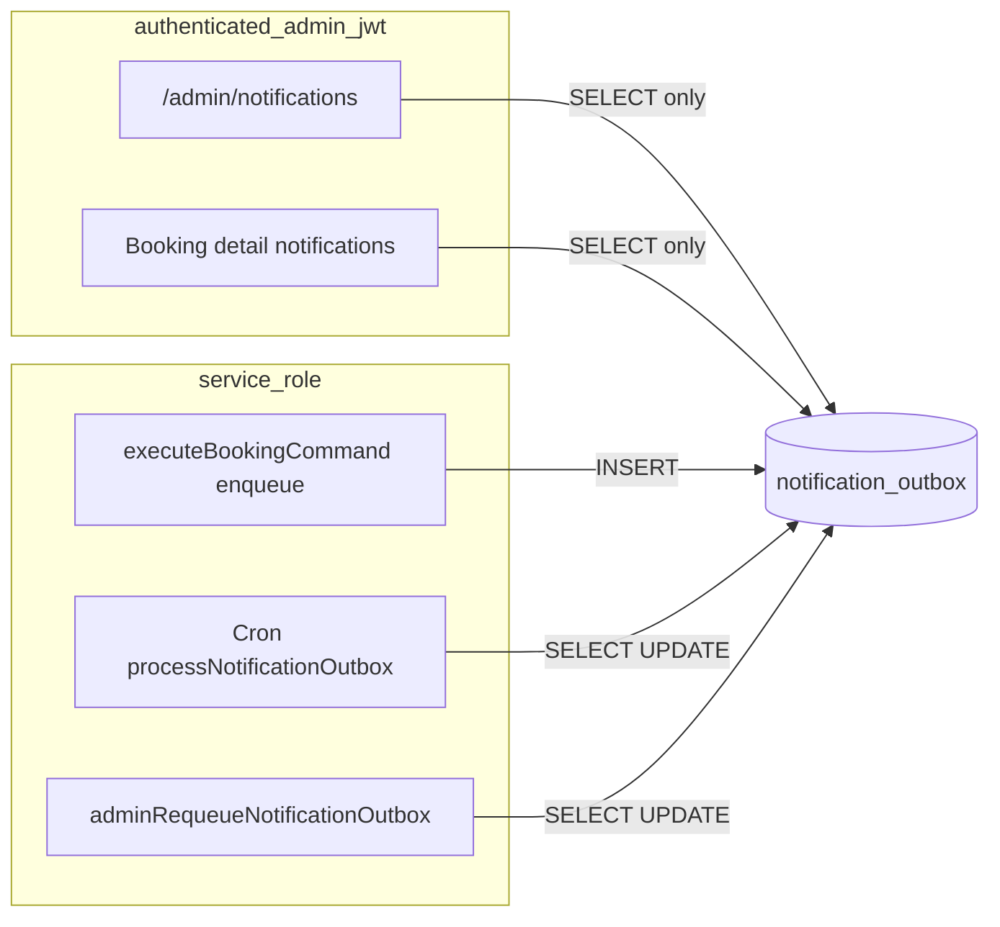

# Stage 5F — notification_outbox RLS Tightening Design

**Date:** 2026-05-17  
**Status:** Design only — **no implementation**  
**Depends on:** [stage-5e-notification-retry-resend-governance-design.md](./stage-5e-notification-retry-resend-governance-design.md), [stage-5e-notification-requeue-governance-final-audit.md](../audits/stage-5e-notification-requeue-governance-final-audit.md), [stage-5d-notification-admin-observability-design.md](./stage-5d-notification-admin-observability-design.md), [stage-5b-3-rls-tightening-design.md](./stage-5b-3-rls-tightening-design.md), [notification-outbox-worker.md](../operations/notification-outbox-worker.md)

**Goal:** Design a safe RLS tightening plan to remove **admin JWT / PostgREST write** access to `notification_outbox` while preserving admin read-only observability, governed requeue (service role), command enqueue, and cron/worker delivery.

**Hard constraints (this stage):**

- Do **not** implement migrations, app code, worker, enqueue, or requeue helper changes.
- Do **not** expose recipient emails or raw payloads in new surfaces.
- Do **not** add customer/cleaner read policies unless explicitly justified.

---

## Executive summary

| Finding | Implication |
|---------|-------------|
| `notification_outbox` has **one** RLS policy today: `notification_outbox_admin` **`FOR ALL`** | Unlike `payments` / `earning_lines`, there is **no** pre-existing `*_select_admin` policy — migration must **replace**, not only drop |
| All production **writes** already use **service role** (commands, cron worker, requeue helper) | Narrowing admin RLS should **not** break app routes |
| All production **admin reads** use `createSupabaseServerClient()` (admin JWT) | Must **add** `notification_outbox_select_admin` before or when dropping `FOR ALL` |
| Stage **5E** requeue is service-role + audited | Safe to remove admin JWT `UPDATE` without breaking requeue UI |
| No customer/cleaner policies today | Correct — outbox is ops-only; keep absent in 5F |

**Recommendation:** Single forward migration — **drop** `notification_outbox_admin`, **create** `notification_outbox_select_admin` (`FOR SELECT` only). Follow the 5B-3a playbook: SQL catalog checks, RLS integration negatives, migration probe, rollback doc entry.

**Is admin write removal safe now?** **Yes**, after **5E** is deployed in the target environment (audited requeue via service role). The exact change is **replace** `notification_outbox_admin` with admin **SELECT-only** policy (see §13).

---

## 1. Current notification_outbox RLS map (audit Q1)

**Sources:** `supabase/migrations/20260516160000_rls_role_security.sql`, `supabase/migrations/20260515201500_core_foundation.sql`

| Property | Value |
|----------|--------|
| Table | `public.notification_outbox` |
| RLS enabled | Yes (`alter table ... enable row level security`) |
| Enum | `notification_outbox_status`: `pending`, `processing`, `sent`, `failed` |
| Columns (lifecycle) | `channel`, `recipient`, `payload` (jsonb), `status`, `attempts`, `next_retry_at`, `last_error`, timestamps |

### Policies today

| Policy | Command | Role | Predicate |
|--------|---------|------|-----------|
| **`notification_outbox_admin`** | **`ALL`** | **`authenticated`** | `auth_is_admin()` (USING + WITH CHECK) |

**No other policies** on this table: no `SELECT` policy for customer, cleaner, or anon.

### Comparison to tightened lifecycle tables (5B-3)

| Table | Pre-slice SELECT policy | Write policy dropped |
|-------|-------------------------|----------------------|
| `payments` | `payments_select_admin` existed | `payments_admin_write` |
| `earning_lines` | `earning_lines_select_admin` existed | `earning_lines_admin_write` |
| **`notification_outbox`** | **None** — only `FOR ALL` | Must drop **`notification_outbox_admin`** and **create** SELECT policy |

### Latent risk today (`notification_outbox_admin` `FOR ALL`)

| Misuse (compromised admin JWT + PostgREST) | Effect |
|------------------------------------------|--------|
| `UPDATE status` → `sent` | Hide failures, skip worker, break dedupe assumptions |
| `UPDATE` without audit | Requeue outside `admin_operational_audit` (bypasses 5E governance) |
| `INSERT` fake rows | Pollute ops UI, trigger erroneous delivery attempts |
| `DELETE` rows | Destroy delivery audit trail |
| `UPDATE payload` / `recipient` | Misdirect or corrupt notifications |

Production admin UI and APIs are read-only or service-role for mutations; the gap is **direct Supabase client** access, same class as Stage 5A PostgREST bypass.

---

## 2. Admin UI paths that SELECT notification_outbox (audit Q2)

All paths use **admin JWT** via `createSupabaseServerClient()` unless noted.

| Surface | Route / entry | Module | Query pattern |
|---------|---------------|--------|----------------|
| Global notification health | `/admin/notifications` | `getAdminNotificationHealthPage` → `notificationAdminReadModel.ts` | `SELECT` counts + list (limit 100); filters on `status`, `payload->>template`, deliverable OR |
| Booking detail notifications | `/admin/bookings/[bookingId]` | `getAdminBookingDetail` → `listNotificationsForBooking.ts` | `SELECT` by `payload->>bookingId`, limit 25 |
| RLS smoke (integration) | — | `rls-policies.integration.test.ts` | Admin `SELECT id` limit 1 |

**DTO safety (app layer, unchanged by 5F):**

- `mapNotificationOutboxRowForAdmin.ts` — never returns raw `payload` or email; `recipientType` derived from template; `last_error` sanitized.
- Admin UI components: `AdminNotificationOutboxTable`, `AdminBookingNotificationsSection`, `AdminNotificationHealthCards`.

**Not reading outbox today:**

- `/admin` summary cards (`adminOperationalHelpers` — no outbox aggregates).
- Customer/cleaner dashboards.

**SELECT columns used by read models:**

```text
id, channel, recipient, payload, status, attempts, next_retry_at, last_error, created_at, updated_at
```

Server-side mapping strips sensitive fields before HTML/JSON; **RLS SELECT still exposes DB columns** to a JWT client that bypasses the app (residual risk — see §10).

---

## 3. App paths that INSERT notification_outbox rows (audit Q3)

| Path | Client | Module | Trigger |
|------|--------|--------|---------|
| Booking command enqueue | **Service role** (`SupabaseBookingCommandBackend` via `runBookingCommand` / `createBookingCommandBackend`) | `supabaseBookingCommandBackend.enqueueNotification` | `executeBookingCommand` after successful command steps |

**Templates inserted (via `enqueueNotificationWhenNotIdempotent`):**

| Command / case | Template | Channel | Recipient field |
|----------------|----------|---------|-----------------|
| `CREATE_BOOKING_DRAFT` | `booking_draft_created` | `email` | `customerId` |
| `MARK_PAYMENT_PENDING` | `payment_pending` | `email` | `customer_id` |
| `FINALIZE_PAYMENT_SUCCESS` | `payment_confirmed` | `email` | `customer_id` |
| `MARK_PAYMENT_FAILED` | `payment_failed` | `email` | `customer_id` |
| `MOVE_TO_PENDING_ASSIGNMENT` | `pending_assignment` | `email` | `customer_id` |
| `OFFER_TO_CLEANER` | `assignment_offer` | `push` | `cleanerId` |
| `ACCEPT_CLEANER_ASSIGNMENT` | `cleaner_assigned` | `email` | `customer_id` |

**Not production INSERT paths:**

- `InMemoryBookingCommandBackend` — unit/memory tests only.
- `phase1IntegrationTestSupport.ts` — test cleanup `DELETE` (service role / test client).

**No admin JWT INSERT** in application code.

---

## 4. Worker paths that UPDATE notification_outbox rows (audit Q4)

All use **service role** client passed into worker (cron does not use admin JWT).

| Operation | Function | Status transitions / fields |
|-----------|----------|---------------------------|
| Claim row | `claimOutboxRow` | `pending` → `processing` |
| Mark sent | `markOutboxSent` / `markOutboxSentAfterDelivery` | → `sent`; bump `attempts`; clear `last_error` |
| Mark failure / retry | `markOutboxFailure` | → `failed` or `pending` + backoff |
| Release claim | `releaseOutboxClaim` | `processing` → `pending` |
| Stale reclaim | `reclaimStaleProcessingNotifications` | `processing` → `pending` when `updated_at` stale |
| Dry-run paths | `dryRunDelivery.ts` | `sent` or `pending` + `last_error` metadata |
| Poll candidates | `processNotificationOutbox` | `SELECT` pending deliverable rows |
| Dedupe helpers | `hasSentPaymentConfirmedForBooking`, `hasSentPaymentFailedForBooking`, `hasSentAssignmentOfferForOffer` | `SELECT` only |

**Entry point:** `GET`/`POST` `/api/cron/process-notification-outbox` → `createServiceRoleClient()` → `processNotificationOutbox(client)`.

**Service role bypasses RLS** — worker unaffected by admin policy tightening.

---

## 5. Admin requeue path that UPDATEs notification_outbox (audit Q5)

| Step | Client | Module |
|------|--------|--------|
| `POST /api/admin/notifications/[outboxId]/requeue` | App auth: admin user JWT (route only) | `route.ts` |
| Load + update outbox | **Service role** | `adminRequeueNotificationOutbox.ts` |
| Audit row | **Service role** | `auditAdminNotificationRequeue` → `recordAdminOperationalAudit` |

**Update shape (governed):**

- `status` → `pending` (from `failed` or dry-run `sent`)
- `attempts` → `0`
- `next_retry_at` → now
- `last_error` → `admin_requeued`
- Optimistic: `WHERE status = expected`

**No browser/admin JWT UPDATE** in requeue flow.

---

## 6. Does any browser/admin JWT path need INSERT/UPDATE/DELETE? (audit Q6)

| Capability | Admin JWT needed? | Actual implementation |
|------------|-------------------|------------------------|
| View global health | **SELECT only** | `notificationAdminReadModel` |
| View booking notification history | **SELECT only** | `listNotificationsForBooking` |
| Requeue failed / dry-run sent | **No** | API → service role helper (5E) |
| Enqueue on booking lifecycle | **No** | Command backend service role |
| Worker delivery | **No** | Cron service role |
| Test cleanup | **No** (non-prod) | Integration support service role |

**Answer: No.** No production browser or admin JWT path requires `INSERT`, `UPDATE`, or `DELETE` on `notification_outbox`.

---

## 7. Should admin keep SELECT only? (audit Q7)

**Yes.**

| Role | 5F target |
|------|-----------|
| Admin (`authenticated` + `auth_is_admin()`) | **`SELECT` only** via new `notification_outbox_select_admin` |
| Customer | **No policy** (no access) |
| Cleaner | **No policy** (no access) |
| Anon | **No policy** (no access) |
| Service role | **Bypasses RLS** — all writes |

Admin operational visibility is a core 5D/5E requirement; SELECT must remain.

---

## 8. Service-role paths that must keep working (audit Q8)

| Path | Operations | 5F impact |
|------|------------|-----------|
| `runBookingCommand` → `enqueueNotification` | `INSERT` | None (SR bypasses RLS) |
| `processNotificationOutbox` + cron route | `SELECT`, `UPDATE` | None |
| `reclaimStaleProcessingNotifications` | `UPDATE` | None |
| `adminRequeueNotificationOutbox` | `SELECT`, `UPDATE` | None |
| `computeDeliveryDedupeWouldBlock` / `hasSent*` | `SELECT` | None |
| `auditAdminNotificationRequeue` | `INSERT` on `admin_operational_audit` | Unrelated table |
| Paystack / assignment / earnings commands | No direct outbox DML except enqueue | None |

**Registry:** `adminRequeueNotificationOutbox.ts` is already in `ALLOWED_SERVICE_ROLE_LIFECYCLE_IMPORTERS` (`serviceRoleLifecycleWriteRegistry.test.ts`).

---

## 9. Customer/cleaner read policies (audit Q9)

**Remain absent.**

| Rationale | Detail |
|-----------|--------|
| Data sensitivity | `recipient` holds internal ids; `payload` may contain booking/offer context |
| Product scope | Notifications are operational messaging, not end-user inbox |
| Existing pattern | Table comment in foundation migration: “RLS: deferred” then admin-only in `20260516160000` |
| No app reads | No customer/cleaner module queries `notification_outbox` |

**Do not add** customer/cleaner SELECT in 5F. If end-user notification history is needed later, use a **dedicated safe view/RPC** with column projection — out of scope here.

---

## 10. Proposed target policies

| Policy | Command | Role | Predicate | Notes |
|--------|---------|------|-----------|-------|
| **`notification_outbox_select_admin`** | **`SELECT`** | **`authenticated`** | `auth_is_admin()` | **New** — replaces read half of `FOR ALL` |
| ~~`notification_outbox_admin`~~ | ~~`ALL`~~ | — | — | **Drop** |

**No** `INSERT` / `UPDATE` / `DELETE` policies for `authenticated` on this table.

**Table comment (forward migration):**

```sql
comment on table public.notification_outbox is
  'Reliable outbound notifications with retries. Enqueue and delivery via service_role; admin authenticated: SELECT only (5F).';
```

### Illustrative forward migration (documentation only — do not apply in 5F)

```sql
-- Stage 5F: admin SELECT-only on notification_outbox
-- Rollback: docs/operations/rls-tightening-rollbacks.md

drop policy if exists notification_outbox_admin on public.notification_outbox;

create policy notification_outbox_select_admin on public.notification_outbox
  for select to authenticated
  using (public.auth_is_admin());

comment on table public.notification_outbox is
  'Reliable outbound notifications with retries. Enqueue and delivery via service_role; admin authenticated: SELECT only (5F).';
```

**Critical:** Do **not** drop `notification_outbox_admin` without creating `notification_outbox_select_admin` in the **same migration** — admin dashboards would lose all visibility.

---

## 11. SQL / catalog test plan (audit Q10)

**New file:** `supabase/tests/notification_outbox_rls_phase5f_checks.sql`  
**Run after:** forward migration `20260518XXXXXX_rls_notification_outbox_admin_select_only.sql`

| Check | Assertion |
|-------|-----------|
| Old policy gone | `notification_outbox_admin` must not exist in `pg_policies` |
| SELECT policy exists | `notification_outbox_select_admin` with `cmd = 'SELECT'` |
| No authenticated write policies | Count policies on `notification_outbox` where `cmd IN ('INSERT','UPDATE','DELETE','ALL')` and `'authenticated' = ANY(roles)` = **0** |
| RLS still enabled | `relrowsecurity` on `public.notification_outbox` |
| Listing | `SELECT policyname, cmd, roles FROM pg_policies WHERE tablename = 'notification_outbox'` |

**Extend** `supabase/tests/rls_role_security_checks.sql` header comment to reference 5F checks (optional).

**CI:** Run via `psql "$DATABASE_URL" -f supabase/tests/notification_outbox_rls_phase5f_checks.sql` after migration apply in staging/prod promotion checklist.

---

## 12. RLS integration test plan (audit Q11)

**Extend** `src/tests/security/rls-policies.integration.test.ts` with describe **`notification_outbox RLS phase 5F`**:

| Test | Actor | Expect |
|------|-------|--------|
| Admin can SELECT outbox | Admin JWT | `SELECT id` succeeds (existing test in “admin can access operational data” may suffice — add dedicated block) |
| Admin cannot INSERT | Admin JWT | Error or no row; no policy violation success |
| Admin cannot UPDATE status | Admin JWT | Row unchanged (use probe row: `failed` → `sent` attempt) |
| Admin cannot DELETE | Admin JWT | Row still present |
| Customer cannot SELECT | Customer JWT | 0 rows |
| Cleaner cannot SELECT | Cleaner JWT | 0 rows |
| Anon cannot SELECT | Anon | 0 rows |

**Migration probe:** Add `isNotificationOutboxRlsPhase5fApplied()` in `rlsTestSupport.ts`:

- Pattern: admin JWT `UPDATE notification_outbox SET status = 'sent' WHERE id = $probe` must fail or affect 0 rows; service role resets probe if needed.
- Skip describe block when migration not applied (same as `isPaymentsRlsPhase1Applied`, `isAssignmentOffersRlsPhase3cApplied`).

**Regression tests (no DB role change — run on every PR):**

| Suite | Proves |
|-------|--------|
| `adminRequeueNotificationOutbox.test.ts` | Requeue still uses service role |
| `notificationAdminReadModel.test.ts` | Read model unchanged |
| `dashboardReadModels.test.ts` | Booking detail notifications |
| `processNotificationOutbox.test.ts` | Worker logic |
| `notificationEnqueueIdempotency.test.ts` / command tests | Enqueue via backend |
| `serviceRoleLifecycleWriteRegistry.test.ts` | No new SR importers required |

**Optional static:** `notificationOutboxRlsPhase5fPolicy.test.ts` — assert migration file contains `drop policy ... notification_outbox_admin` and `notification_outbox_select_admin` (mirror payments phase tests if present).

---

## 13. Rollback SQL (audit Q12)

Add to [docs/operations/rls-tightening-rollbacks.md](../operations/rls-tightening-rollbacks.md) when implementing:

```sql
-- Reverts 5F forward migration
-- Source: 20260516160000_rls_role_security.sql

drop policy if exists notification_outbox_select_admin on public.notification_outbox;

drop policy if exists notification_outbox_admin on public.notification_outbox;

create policy notification_outbox_admin on public.notification_outbox
  for all to authenticated
  using (public.auth_is_admin())
  with check (public.auth_is_admin());
```

**Verify after rollback:**

```bash
psql "$DATABASE_URL" -f supabase/tests/rls_role_security_checks.sql
```

Expect `notification_outbox_admin` (`ALL`) in policy listing; `notification_outbox_select_admin` absent.

---

## 14. Smallest safe migration slice (audit Q13)

| Deliverable | Detail |
|-------------|--------|
| **Migration** | `20260518XXXXXX_rls_notification_outbox_admin_select_only.sql` — drop `notification_outbox_admin`; create `notification_outbox_select_admin`; update table comment |
| **SQL checks** | `supabase/tests/notification_outbox_rls_phase5f_checks.sql` |
| **Integration** | `notification_outbox RLS phase 5F` block + `isNotificationOutboxRlsPhase5fApplied` probe |
| **Docs** | Rollback section in `rls-tightening-rollbacks.md`; cross-link from `stage-5b-3-rls-tightening-design.md` deferred row |
| **App code** | **None** if migration-only |
| **Prerequisites** | **5E** deployed (`adminRequeueNotificationOutbox` + audit migration `20260518190000_*`); recommended: 5B-3a–c already in environment |

**Production impact:** Zero application deploy strictly required; immediate effect blocks compromised **admin JWT** from un audited outbox mutation via PostgREST.

**Deploy order:**

1. Apply 5E migrations + app (if not already).
2. Apply 5F migration.
3. Run SQL catalog checks + RLS integration suite.
4. Smoke: `/admin/notifications`, booking detail notifications, one requeue on staging failed row, trigger cron once.

---

## 15. Risks and mitigations

| Risk | Likelihood | Mitigation |
|------|------------|------------|
| Drop `FOR ALL` without adding SELECT | Low if review catches | Single migration transaction; catalog test requires `notification_outbox_select_admin` |
| Admin Table Editor / SQL console used for ops writes | Low | Document: use requeue API or controlled service-role scripts |
| New code uses admin JWT for outbox DML | Low | 5B-2 static guards culture; PR checklist; optional grep CI for `.from("notification_outbox").insert|update|delete` outside allowlist |
| Requeue breaks | Very low | 5E already SR-only; integration test unchanged |
| Worker / enqueue breaks | Very low | SR bypasses RLS |
| Admin JWT SELECT exposes `recipient` + raw `payload` via direct PostgREST | **Pre-existing** | App DTOs sanitize; **5F does not add column-level security** — defer view/RPC hardening if needed |
| Compromised admin marks rows `sent` today | Medium latent | **5F closes write bypass** — primary motivation |
| Migration not applied in dev | Medium | Probe + skip integration block with clear message |

---

## 16. Service-role compatibility analysis



| Consumer | JWT vs SR | Post-5F |
|----------|-----------|---------|
| Admin dashboards | JWT | SELECT allowed |
| Requeue API | SR for DML | Unchanged |
| Booking commands | SR | Unchanged |
| Notification cron | SR | Unchanged |
| Customer/cleaner | — | Still no access |

---

## 17. App read/write inventory (consolidated)

### Reads (admin JWT — preserve)

| Module | Op |
|--------|-----|
| `notificationAdminReadModel.ts` | SELECT (counts + list) |
| `listNotificationsForBooking.ts` | SELECT by booking |

### Writes (service role only — preserve)

| Module | Op |
|--------|-----|
| `supabaseBookingCommandBackend.ts` | INSERT |
| `processNotificationOutbox.ts` | SELECT, UPDATE |
| `reclaimStaleProcessingNotifications.ts` | UPDATE |
| `dryRunDelivery.ts` | UPDATE |
| `adminRequeueNotificationOutbox.ts` | SELECT, UPDATE |

### Writes that must be blocked (admin JWT)

| Op | Why block |
|----|-----------|
| INSERT | Forge notifications |
| UPDATE | Bypass 5E audit / worker |
| DELETE | Destroy audit trail |

---

## 18. Audit question index

| # | Section |
|---|---------|
| 1 | §1 Current RLS map |
| 2 | §2 Admin UI SELECT paths |
| 3 | §3 INSERT paths |
| 4 | §4 Worker UPDATE paths |
| 5 | §5 Admin requeue UPDATE |
| 6 | §6 Browser JWT write need |
| 7 | §7 Admin SELECT only |
| 8 | §8 Service-role compatibility |
| 9 | §9 Customer/cleaner policies |
| 10 | §11 SQL catalog tests |
| 11 | §12 Integration tests |
| 12 | §13 Rollback |
| 13 | §14 Smallest slice |
| Final | §19 Recommendation |

---

## 19. Final recommendation

### Is notification_outbox admin write removal safe now?

**Yes**, provided:

1. **Stage 5E** is live in the target environment (governed requeue + `notification_requeue` audit action).
2. Forward migration **atomically** replaces `notification_outbox_admin` with `notification_outbox_select_admin`.
3. Verification follows the **5B-3a** playbook (catalog SQL + integration negatives + staging smoke).

No worker, enqueue, or requeue code changes are required for 5F.

### What exact policy should be dropped or replaced?

| Action | Policy |
|--------|--------|
| **Drop** | `notification_outbox_admin` (`FOR ALL` to authenticated admin) |
| **Create** | `notification_outbox_select_admin` (`FOR SELECT` to authenticated admin, `USING (auth_is_admin())`) |

**Do not** add customer/cleaner policies. **Do not** add a narrower admin `UPDATE` policy — all mutations stay on **service role** paths with existing app governance (5E audit for requeue; worker for delivery; commands for enqueue).

### Placement in security program

| Phase | Table | Status |
|-------|-------|--------|
| 5B-3a–c | `payments`, `earning_lines`, `assignment_offers` | Implemented |
| 5E | Requeue governance | Implemented (app); RLS deferred |
| **5F** | **`notification_outbox`** | **This design** |
| 5B-3 Phase 4+ | `payment_events`, `bookings`, locks, … | Later |

**Why 5F now:** 5E closed the **intended** admin write path (service role + audit); `notification_outbox_admin` `FOR ALL` is the last **unaudited** admin JWT mutation surface for the notification system.

---

## References

| Resource | Path |
|----------|------|
| Base RLS | `supabase/migrations/20260516160000_rls_role_security.sql` |
| 5E requeue helper | `src/features/notifications/server/adminRequeueNotificationOutbox.ts` |
| Admin read models | `src/features/notifications/server/notificationAdminReadModel.ts`, `listNotificationsForBooking.ts` |
| Worker | `src/features/notifications/server/processNotificationOutbox.ts` |
| Enqueue | `src/features/bookings/server/commands/supabaseBookingCommandBackend.ts` |
| Cron | `src/app/api/cron/process-notification-outbox/route.ts` |
| RLS integration | `src/tests/security/rls-policies.integration.test.ts` |
| Payments slice template | `supabase/migrations/20260518140000_rls_payments_admin_select_only.sql` |
| 5E final audit | `docs/audits/stage-5e-notification-requeue-governance-final-audit.md` |
| Rollbacks | `docs/operations/rls-tightening-rollbacks.md` |
