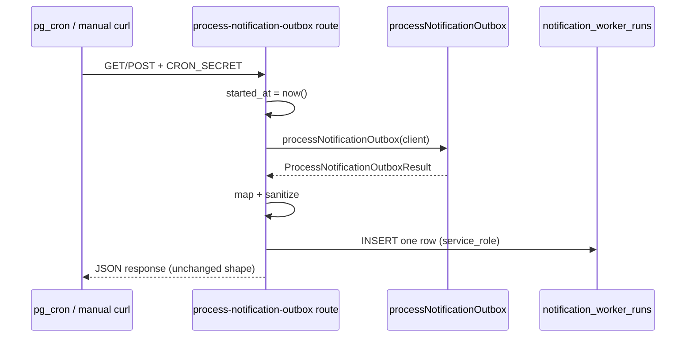

# Stage 5G — Notification Worker Run Logging & Cron Health Design

**Date:** 2026-05-17  
**Status:** Design only — **no implementation**  
**Depends on:** [stage-5d-2-global-notification-health-page-design.md](./stage-5d-2-global-notification-health-page-design.md), [stage-5f-notification-outbox-rls-tightening-design.md](./stage-5f-notification-outbox-rls-tightening-design.md), [notification-outbox-worker.md](../operations/notification-outbox-worker.md), [stage-5e-notification-retry-resend-governance-design.md](./stage-5e-notification-retry-resend-governance-design.md)

**Goal:** Design durable visibility into notification worker executions so admins can see whether cron is running, when it last ran, and what it processed — without changing delivery behavior, outbox RLS, or adding UI-triggered cron.

**Hard constraints (this stage):**

- Do **not** implement migrations, app code, or worker logic changes yet.
- Do **not** change notification worker delivery behavior (poll, claim, send, dedupe, reclaim).
- Do **not** trigger cron from the admin UI.
- Do **not** add retry/resend actions beyond existing 5E requeue.
- Do **not** change RLS on `notification_outbox` or any other existing table.

---

## Executive summary

| Question | Recommendation |
|----------|----------------|
| 1. New table? | **Yes** — `notification_worker_runs` (append-only run log) |
| 2. Fields? | Timing, outcome, config snapshot, counters, capped safe `errors` JSON — mirror `ProcessNotificationOutboxResult` |
| 3. Cron writes start/end? | **Single end-of-run INSERT** from cron route only (not start+update) |
| 4. Capture stats safely? | Typed integer columns + allowlisted `errors` array (max 10, truncated messages) |
| 5. Avoid PII? | Never store emails, `recipient`, raw `payload`, provider bodies, or `dryRunPreviews` in DB |
| 6–8. RLS | Admin **SELECT only**; **service_role INSERT only**; append-only trigger |
| 9. Admin UI | “Worker health” card on `/admin/notifications` — last run + cron freshness |
| 10. Stale cron | **Warning ≥ 10 min**, **critical ≥ 15 min** since last successful route completion (assumes 2–5 min schedule) |
| 11. Failed runs | `status` = `error` / `partial`; show summary + capped error codes; link runbook |
| 12. Manual invoke | **Yes** — `trigger_source` = `manual` when ops uses documented header |
| 13. Tests | Migration, RLS negatives, sanitizer unit, cron route integration, SQL catalog |
| 14. Rollback | Feature flag off → stop inserts; forward migration drop table; UI degrades gracefully |
| 15. Smallest slice | Table + RLS + cron-route-only persist + last-run card (no history table, no worker edits) |

---

## Current observability gap

### What admins have today (Stages 5C–5F)

| Capability | Source | Limitation |
|------------|--------|------------|
| Outbox queue health | `/admin/notifications` — counts, filters, table | Shows **what** is queued, not **whether worker ran** |
| Delivery config | `AdminNotificationDeliveryBanner` — env-derived | No proof cron invoked the route |
| Per-row diagnostics | `mapNotificationOutboxRowForAdmin` — `last_error`, status | Row-level only; no batch context |
| Requeue governance | 5E — `admin_operational_audit` + requeue API | Human actions only, not worker runs |
| Cron HTTP response | `GET/POST /api/cron/process-notification-outbox` | Ephemeral — Vercel/pg_net logs only |
| External monitoring | Vercel logs, Datadog (if wired) | Requires platform access; not in-product |

### What is missing

1. **Cron freshness** — “Has the worker run in the last N minutes?”
2. **Last run counters** — `reclaimed`, `scanned`, `sent`, `skipped`, `dryRun`, `failed` from the most recent execution
3. **Run failure visibility** — route `500` / `INTERNAL_ERROR` vs per-row failures inside an otherwise successful batch
4. **Manual vs scheduled distinction** — ops `curl` with `CRON_SECRET` looks identical to pg_cron in logs
5. **Historical trend** (optional later) — “failed count rising over last hour”

### Explicit non-gap (do not solve in 5G)

- Live email preview, Resend dashboard embedding, or calling cron from admin pages (rejected in 5D-2).
- Mutating outbox from run logs.
- Customer/cleaner visibility into worker runs.

---

## Audit / design questions

### 1. Should worker runs be stored in a new `notification_worker_runs` table?

**Yes.** A dedicated append-only table is the right fit:

| Alternative | Why not |
|-------------|---------|
| Reuse `admin_operational_audit` | Wrong domain — human admin actions with `booking_id` required; worker runs are platform automation |
| Reuse `notification_outbox` | Would require synthetic rows or abusing `last_error`; pollutes delivery queue |
| External-only (Vercel/Datadog) | Admins without platform access cannot see health in-product |
| JSON file / edge config | Not durable, not queryable from admin JWT |

`notification_worker_runs` follows the same security posture as `admin_operational_audit`: ops visibility, service-role writes, no authenticated mutation.

---

### 2. What fields should each run record?

**Core columns (typed, queryable):**

| Column | Type | Purpose |
|--------|------|---------|
| `id` | `uuid` PK | Row identity |
| `started_at` | `timestamptz` | Wall clock when cron handler began (before `processNotificationOutbox`) |
| `completed_at` | `timestamptz` | Wall clock when handler finished (success or catch) |
| `duration_ms` | `integer` | `completed_at - started_at` (bounded, for perf regression) |
| `status` | `text` enum | Run-level outcome (see below) |
| `trigger_source` | `text` enum | `scheduled` \| `manual` |
| `delivery_enabled` | `boolean` | Snapshot: was delivery gate open? |
| `email_provider` | `text` null | `dry_run` \| `resend` \| null (when disabled) |
| `reclaimed` | `integer` | From worker result |
| `scanned` | `integer` | Deliverable batch candidates |
| `sent` | `integer` | Rows marked sent |
| `skipped` | `integer` | Includes dedupe skips |
| `dry_run` | `integer` | Dry-run preview count |
| `failed` | `integer` | Rows marked failed in batch |
| `error_count` | `integer` | `errors.length` (denormalized for filters) |
| `error_summary` | `text` null | First safe code, e.g. `PROCESS_FAILED`, or `INTERNAL_ERROR` |
| `errors` | `jsonb` | Capped array of `{ outboxId, code, message }` — see § safe metadata |
| `created_at` | `timestamptz` | Insert time (default `now()`) |

**`status` enum values:**

| Value | When |
|-------|------|
| `success` | Route completed; `failed = 0` and `error_count = 0` |
| `partial` | Route completed; worker ran but `failed > 0` or `error_count > 0` |
| `skipped` | `delivery_enabled = false` — worker no-op (still proves cron ran) |
| `error` | Uncaught exception in route/worker **or** HTTP 500 path before normal result |

**Deferred columns (Slice 2+):**

| Column | Notes |
|--------|-------|
| `http_status` | Only if persisting auth failures (401) — default **omit** to avoid noise from scanners |
| `environment` | `production` / `preview` — optional label from `VERCEL_ENV` |
| `batch_size` | Constant 25 today — low value until configurable |

**Indexes:**

```text
idx_notification_worker_runs_completed_at desc  -- last run lookup
idx_notification_worker_runs_status_completed    -- filter failed/partial recent
```

---

### 3. Should the cron route write start/end records?

**No start/end pair. One INSERT at end of handler only.**

| Pattern | Pros | Cons |
|---------|------|------|
| Start + end (UPDATE) | In-flight “running” state | Needs UPDATE grant; orphan `running` rows on crash/timeout |
| **End-only INSERT** | Append-only; simple RLS; matches audit table pattern | No in-flight row (acceptable — use stale cron on absence) |
| Async queue | Decoupled | Overkill for 5G |

**Flow:**



On **uncaught exception**, route `catch` still INSERTs `status = error` with zero counters and `error_summary = INTERNAL_ERROR` before returning 500.

**401 / 503 paths:** Do **not** insert (unauthenticated or misconfigured deploy — not a “worker run”).

---

### 4. How to capture ok/scanned/sent/skipped/failed/dryRun/reclaimed/errors safely?

**Source of truth:** `ProcessNotificationOutboxResult` from `processNotificationOutbox.ts` — already returned to cron route unchanged.

| Field | Persistence rule |
|-------|------------------|
| `ok` | Not stored — derive `status` from counters + exception |
| `reclaimed` … `failed` | Copy integers as-is (always ≥ 0) |
| `errors` | Pass through `sanitizeWorkerRunErrors()` — max **10** entries, message max **200** chars, allow `outboxId` (uuid), `code`, `message` only |
| `dryRunPreviews` | **Do not persist** — store `dry_run` count only; admins use outbox dry-run rows for detail |

**`status` derivation (route layer):**

```text
if (uncaught exception) → error
else if (!deliveryEnabled) → skipped
else if (failed > 0 || error_count > 0) → partial
else → success
```

**Do not change** `processNotificationOutbox` return shape or per-row processing for 5G.

---

### 5. How to avoid storing emails or raw provider payloads?

**Safe metadata policy** (mandatory):

| Never store | Reason |
|-------------|--------|
| Email addresses | PII |
| `notification_outbox.recipient` | Profile id is borderline — omit from run log |
| `payload` jsonb | May contain booking/offer ids at volume — outbox table already has rows |
| Resend response bodies | May contain provider metadata |
| `dryRunPreviews` array | Contains `bookingId` / `offerId` — optional in Slice 2 as count-only |
| Stack traces | Noise + possible env leakage |
| `CRON_SECRET`, API keys | Credential leak |

**`errors[].message` sanitization:**

- Strip patterns matching email regex.
- Truncate to 200 characters.
- Drop entry if message empty after strip.
- Worker already uses operational codes (`PROCESS_FAILED`, etc.) — messages are short.

**Allowlist** (mirror `sanitizeAdminOperationalMetadata` style in `recordNotificationWorkerRun.ts`):

```text
errors[].keys: outboxId, code, message only
No nested objects, no arbitrary metadata jsonb on run row in Slice 1
```

---

### 6. What RLS should protect worker run logs?

Enable RLS on `notification_worker_runs`. **No policies for `anon`.** No customer/cleaner access.

---

### 7. Should admins have SELECT only?

**Yes.** Single policy:

```sql
notification_worker_runs_select_admin
  FOR SELECT TO authenticated
  USING (public.auth_is_admin());
```

Admin read model uses `createSupabaseServerClient()` (admin JWT) — same pattern as `notification_outbox` post-5F.

---

### 8. Should service role insert/update only?

| Operation | Role |
|-----------|------|
| INSERT | `service_role` only |
| SELECT | `authenticated` admin |
| UPDATE | **Forbidden** (append-only trigger) |
| DELETE | **Forbidden** (append-only trigger) |

```sql
grant select on notification_worker_runs to authenticated, service_role;
grant insert on notification_worker_runs to service_role;
-- no grant insert to authenticated
```

Reuse `forbid_admin_operational_audit_mutation()` pattern (shared function or duplicate trigger name scoped to table).

**No UPDATE policy** even for service_role — end-only insert keeps the model simple.

---

### 9. How should `/admin/notifications` show last run health?

Add a **Worker health** section between the delivery banner and summary cards (or directly under banner).

**Slice 1 — Last run card (required):**

| UI element | Data |
|------------|------|
| Headline | “Last worker run” + relative time (`3 minutes ago`) |
| Freshness badge | `healthy` / `warning` / `stale` / `unknown` from stale policy |
| Status chip | `success` / `partial` / `skipped` / `error` |
| Counter strip | `reclaimed · scanned · sent · skipped · dry-run · failed` |
| Config line | `delivery on/off · provider dry_run/resend` (from run snapshot, not live env) |
| Trigger | `Scheduled` or `Manual` |
| Error line | If `partial`/`error`: `error_summary` + “N row errors” |
| Empty state | “No worker runs recorded yet” + link to runbook |

**Slice 2 — Recent runs table (optional):**

| Column | Notes |
|--------|-------|
| Completed | Relative + absolute tooltip |
| Status | Chip |
| Counters | Compact |
| Trigger | Icon |
| Duration | ms |

Limit **20** rows, newest first. Read-only — no row actions.

**Do not:**

- Add “Run worker now” button.
- Call cron route from server component (no `CRON_SECRET` on page load).
- Poll cron on an interval from browser (unnecessary load).

**Read model additions** (`notificationAdminReadModel.ts`):

- `loadLastNotificationWorkerRun(client)`
- `loadRecentNotificationWorkerRuns(client, limit)` (Slice 2)
- `computeCronFreshness(lastRun.completed_at)` → `{ level, minutesSince, message }`

---

### 10. What is considered stale cron?

**Assumptions (from ops docs):**

- Scheduler: Supabase `pg_cron` + `pg_net` (or equivalent) targeting `/api/cron/process-notification-outbox` every **2–5 minutes**.
- Worker batch is independent of schedule.

**Policy (configurable constants in app, not env-required for 5G):**

| Level | Threshold | Admin message |
|-------|-----------|-----------------|
| `healthy` | Last run `completed_at` ≤ **10 minutes** ago | “Cron appears healthy” |
| `warning` | **> 10 min** and ≤ **15 min** | “No worker run in X min — check scheduler” |
| `stale` | **> 15 min** | “Worker may be down — verify pg_cron and CRON_SECRET” |
| `unknown` | No rows in `notification_worker_runs` | “No runs recorded — deploy 5G or invoke cron manually” |

**Edge cases:**

| Scenario | Treatment |
|----------|-----------|
| `delivery_enabled = false` but runs insert with `status = skipped` | Cron is **fresh** if recent — proves scheduler works |
| Deploy window / migration | Expect brief `unknown` or `stale` — runbook note |
| Manual invoke | Counts as freshing `completed_at` — same as scheduled |
| 401 noise from internet | No run row — does not affect freshness (by design) |

**Future:** `NOTIFICATION_CRON_STALE_MINUTES` env override for non-standard schedules.

---

### 11. How should failed runs be shown?

**Two failure layers:**

| Layer | DB signal | UI |
|-------|-----------|-----|
| **Run-level** | `status = error` | Red banner: “Last worker run failed” + `error_summary` |
| **Batch partial** | `status = partial`, `failed > 0` | Amber: “Worker completed with N failures” — link to outbox `status=failed` filter |
| **Delivery disabled** | `status = skipped` | Neutral: “Cron ran; delivery disabled” — not an incident |

**Do not** expand `errors` jsonb into a full table in Slice 1 — show count + first code; detail via outbox failed filter.

**Runbook link:** `docs/operations/notification-outbox-worker.md` § troubleshooting.

---

### 12. Should manual cron invocation be visible?

**Yes.** `trigger_source` column:

| Value | Detection |
|-------|-----------|
| `scheduled` | Default — pg_cron, Vercel cron, no override header |
| `manual` | Request includes `x-cron-invoke-source: manual` (document in runbook for ops `curl`) |

**Do not** use query params alone (log leakage). Header is explicit and optional.

**UI:** Small badge “Manual” vs “Scheduled” on last-run card.

**Security:** Header does not bypass `CRON_SECRET` — observability only.

---

### 13. What tests are required?

| Layer | Test | Path / pattern |
|-------|------|----------------|
| Migration | Table, constraints, indexes, append-only trigger | `src/tests/database/notification-worker-runs.migration.test.ts` |
| RLS | Admin SELECT ok; admin INSERT/UPDATE/DELETE denied; non-admin denied | `supabase/tests/notification_worker_runs_rls_phase5g_checks.sql` |
| RLS integration | JWT clients | Extend `rls-policies.integration.test.ts` |
| Sanitizer | `sanitizeWorkerRunErrors` strips email, caps count/length | `recordNotificationWorkerRun.test.ts` |
| Cron route | Successful run → insert called with mapped fields; 500 → error row; 401 → no insert | Extend `process-notification-outbox/route.test.ts` |
| Admin read model | Maps last run + freshness | `notificationAdminReadModel.workerRun.test.ts` |
| Service role registry | Cron persist helper listed | `serviceRoleLifecycleWriteRegistry.test.ts` |
| Static policy | Migration file names policies | Mirror `notificationOutboxRlsPhase5fPolicy.test.ts` |

**E2E (staging):** Manual cron with header → row with `manual`; verify admin page shows counters.

---

### 14. What rollback plan is needed?

| Step | Action |
|------|--------|
| 1. **Disable writes** | `NOTIFICATION_WORKER_RUN_LOGGING=false` (default **true** after bake-in) — cron route skips INSERT |
| 2. **Deploy** | Worker and outbox unchanged; zero risk to delivery |
| 3. **UI** | If flag off or table empty, show 5D-2 empty copy (“not recorded”) |
| 4. **DB rollback** | Forward migration `drop table notification_worker_runs` + drop policies (document in `docs/operations/rls-tightening-rollbacks.md`) |
| 5. **Code rollback** | Remove read model + UI card; remove `recordNotificationWorkerRun` |

**Data retention (ops, post-5G):** Optional pg_cron job to delete rows older than 90 days — **not** in Slice 1.

---

### 15. What is the smallest safe implementation slice?

See **Final recommendation** below.

---

## Proposed table / schema

```sql
-- Stage 5G-a: Notification worker run log (append-only, admin-read, service-role insert).

create table if not exists public.notification_worker_runs (
  id uuid primary key default gen_random_uuid(),

  started_at timestamptz not null,
  completed_at timestamptz not null,
  duration_ms integer not null
    check (duration_ms >= 0 and duration_ms <= 600000),

  status text not null
    check (status in ('success', 'partial', 'skipped', 'error')),

  trigger_source text not null
    check (trigger_source in ('scheduled', 'manual')),

  delivery_enabled boolean not null,
  email_provider text null
    check (email_provider is null or email_provider in ('dry_run', 'resend')),

  reclaimed integer not null default 0 check (reclaimed >= 0),
  scanned integer not null default 0 check (scanned >= 0),
  sent integer not null default 0 check (sent >= 0),
  skipped integer not null default 0 check (skipped >= 0),
  dry_run integer not null default 0 check (dry_run >= 0),
  failed integer not null default 0 check (failed >= 0),

  error_count integer not null default 0 check (error_count >= 0),
  error_summary text null,
  errors jsonb not null default '[]'::jsonb,

  created_at timestamptz not null default now()
);

comment on table public.notification_worker_runs is
  'Append-only log of notification outbox cron/worker executions. No PII; admin SELECT only.';

create index if not exists idx_notification_worker_runs_completed_at
  on public.notification_worker_runs (completed_at desc);

-- Append-only trigger (same pattern as admin_operational_audit)
-- RLS: notification_worker_runs_select_admin (SELECT authenticated admin)
-- Grants: SELECT authenticated+service_role; INSERT service_role only
```

**TypeScript mirror:** `NotificationWorkerRunRow`, `NotificationWorkerRunStatus`, `NotificationWorkerRunTriggerSource` in `notificationWorkerRunTypes.ts`.

---

## RLS proposal

| Policy | Command | Role | Predicate |
|--------|---------|------|-----------|
| `notification_worker_runs_select_admin` | SELECT | `authenticated` | `auth_is_admin()` |
| *(none)* | INSERT/UPDATE/DELETE | `authenticated` | Denied by default |
| *(implicit)* | INSERT | `service_role` | Bypass RLS |

**Grants:** Match `admin_operational_audit` — no authenticated INSERT.

**5F interaction:** None — `notification_outbox` policies unchanged.

---

## Worker instrumentation strategy

**Principle:** Observability at the **cron route boundary** only. Zero edits to `processNotificationOutbox`, reclaim, or send paths in Slice 1.

| Component | Change |
|-----------|--------|
| `process-notification-outbox/route.ts` | Wrap `handleProcess`: capture `started_at`, call worker, map result, `recordNotificationWorkerRun()` in `finally`-style path, respect feature flag |
| `recordNotificationWorkerRun.ts` | New — service_role insert, sanitization, never throws (log on failure like `recordAdminOperationalAudit`) |
| `processNotificationOutbox.ts` | **No change** |
| Enqueue / requeue | **No change** |

```typescript
// Pseudocode — route only
const startedAt = new Date();
let result: ProcessNotificationOutboxResult | null = null;
try {
  result = await processNotificationOutbox(client);
  return json({ ok: true, ...result });
} catch (e) {
  await recordNotificationWorkerRun(client, { startedAt, error: e, ... });
  throw;
} finally {
  if (result) await recordNotificationWorkerRun(client, { startedAt, result, request });
}
```

Use **one** insert per invocation (not both catch and finally).

**Feature flag:** `NOTIFICATION_WORKER_RUN_LOGGING` — when not `true`, skip INSERT (allows rollback without migration).

---

## Admin UI design

### Layout change on `/admin/notifications`

```text
[ Delivery configuration banner ]     ← existing (live env)
[ Worker health — last run card ]     ← NEW 5G
[ Summary health cards ]              ← existing
[ Filters + outbox table ]            ← existing
```

### `AdminNotificationWorkerHealthCard` (new component)

- Props from `AdminNotificationWorkerHealthModel` in `notificationAdminTypes.ts`
- Freshness drives border color: emerald / amber / red / zinc
- Clicking “View failed rows” deep-links to `?status=failed&deliverable=true` when `failed > 0`

### Copy examples

| State | Copy |
|-------|------|
| Healthy | “Last run 4m ago · sent 2 · scanned 5” |
| Stale | “No worker run in 22m — check pg_cron and deployment logs” |
| Skipped | “Cron ran 2m ago; delivery disabled (no-op)” |
| Partial | “Last run 1m ago · 1 failed — review failed queue below” |

---

## Safe metadata policy

| Data | Allowed in `notification_worker_runs` |
|------|--------------------------------------|
| UUIDs in `errors[].outboxId` | Yes |
| Operational error codes | Yes |
| Truncated operational messages | Yes, sanitized |
| Aggregate counts | Yes |
| `email_provider`, `delivery_enabled` | Yes (config snapshot) |
| Email addresses | **No** |
| Full `dryRunPreviews` | **No** (count only) |
| Raw webhook/provider JSON | **No** |

**Implementation:** `sanitizeWorkerRunErrors(errors: ProcessNotificationOutboxError[]): Json` with unit tests for email stripping and cap.

---

## Stale cron policy

| Constant | Default | Purpose |
|----------|---------|---------|
| `WORKER_RUN_HEALTHY_MAX_MINUTES` | 10 | Green |
| `WORKER_RUN_STALE_MINUTES` | 15 | Red |

Document in `notification-outbox-worker.md` and admin runbook:

- Expected schedule: 2–5 min
- Stale thresholds: 2×–3× max interval
- Manual invoke instructions with `x-cron-invoke-source: manual`

---

## Test plan

1. **Migration probe** — table exists, CHECK constraints reject bad `status`
2. **Append-only** — UPDATE/DELETE raise exception
3. **RLS SQL script** — admin read, admin write denied (mirror `notification_outbox_rls_phase5f_checks.sql`)
4. **Cron route tests** — mock `recordNotificationWorkerRun`, assert mapping for success / partial / disabled / throw
5. **Sanitizer tests** — email in message stripped, 11th error dropped
6. **Admin page** — snapshot or read-model unit test for freshness levels
7. **Staging soak** — run manual cron, confirm card updates within one page refresh

---

## Rollout plan

| Phase | Deliverable | Risk |
|-------|-------------|------|
| **5G-a** | Migration + RLS + `recordNotificationWorkerRun` + cron route hook + feature flag | Low — insert failure must not fail cron (swallow + log) |
| **5G-b** | Admin last-run card + read model | Low — read-only UI |
| **5G-c** | Recent runs table (20 rows) | Low |
| **5G-d** | Retention job + env-tunable stale minutes | Ops |

**Deploy order:**

1. Apply migration (table empty).
2. Deploy app with flag **off** in prod initially.
3. Enable flag in staging; manual cron; verify rows + UI.
4. Enable in production; monitor insert failures via structured log `notification_worker_run_persist_failed`.

**Do not** block 5G on pg_cron setup — manual cron proves the pipeline.

---

## Risks and mitigations

| Risk | Impact | Mitigation |
|------|--------|------------|
| Insert fails → cron fails | Delivery stops | **Never throw** from `recordNotificationWorkerRun`; log and continue |
| Table growth | Disk | 90d retention in 5G-d; ~288 rows/day at 5 min interval ≈ trivial |
| PII in `errors.message` | Compliance | Sanitizer + worker already avoids emails in messages |
| Admin confuses `skipped` with incident | Noise | Clear copy: “delivery disabled” |
| Stale false positive during deploy | Alert fatigue | Short window; `unknown` before first row |
| Duplicate rows on retry | Misleading counts | Acceptable — each cron invocation is one row; use `completed_at` for freshness |
| RLS misconfiguration | Admin blank / leak | SQL checks + integration test before merge |

---

## Final recommendation

### Safest first Stage 5G implementation slice (**5G-a + 5G-b minimal**)

1. **Migration** `notification_worker_runs` with RLS (admin SELECT, service_role INSERT, append-only).
2. **`recordNotificationWorkerRun`** — sanitization, feature flag, non-throwing insert.
3. **Cron route only** — single end-of-run persist; map `ProcessNotificationOutboxResult`; `trigger_source` from `x-cron-invoke-source`; catch path for `error` status.
4. **Admin UI** — one **Last worker run** card with freshness badge on `/admin/notifications` (no history table, no cron trigger).
5. **Tests** — migration, RLS SQL, sanitizer unit, cron route mock, read-model freshness.
6. **Docs** — runbook header for manual invoke; rollback entry in `rls-tightening-rollbacks.md`.

**Explicitly defer to 5G-c:** Recent runs table, retention cron, `NOTIFICATION_CRON_STALE_MINUTES` env, `environment` column, persisting `dryRunPreviews`.

**Do not ship in any 5G slice:** Worker logic changes, outbox RLS changes, admin cron trigger, retry/resend buttons, email content in run log.

---

## Related files (implementation reference)

| Area | Path |
|------|------|
| Worker result type | `src/features/notifications/server/processNotificationOutbox.ts` |
| Cron route | `src/app/api/cron/process-notification-outbox/route.ts` |
| Admin page | `src/app/(admin)/admin/notifications/page.tsx` |
| Admin read model | `src/features/notifications/server/notificationAdminReadModel.ts` |
| Audit pattern | `supabase/migrations/20260518120000_admin_operational_audit.sql` |
| Outbox RLS 5F | `supabase/migrations/20260518200000_rls_notification_outbox_admin_select_only.sql` |
| Prior deferral | `docs/architecture/stage-5d-2-global-notification-health-page-design.md` § Cron health |

---

## Answer: Safest first Stage 5G implementation slice

**Ship 5G-a + 5G-b minimal:** create `notification_worker_runs`, persist **one sanitized row per cron invocation** from the **cron route only** (feature-flagged, non-throwing), and add a **single last-run health card** on `/admin/notifications` with a 10/15-minute stale policy. Do not modify `processNotificationOutbox`, do not add a run history table, and do not expose cron invocation from the UI.
