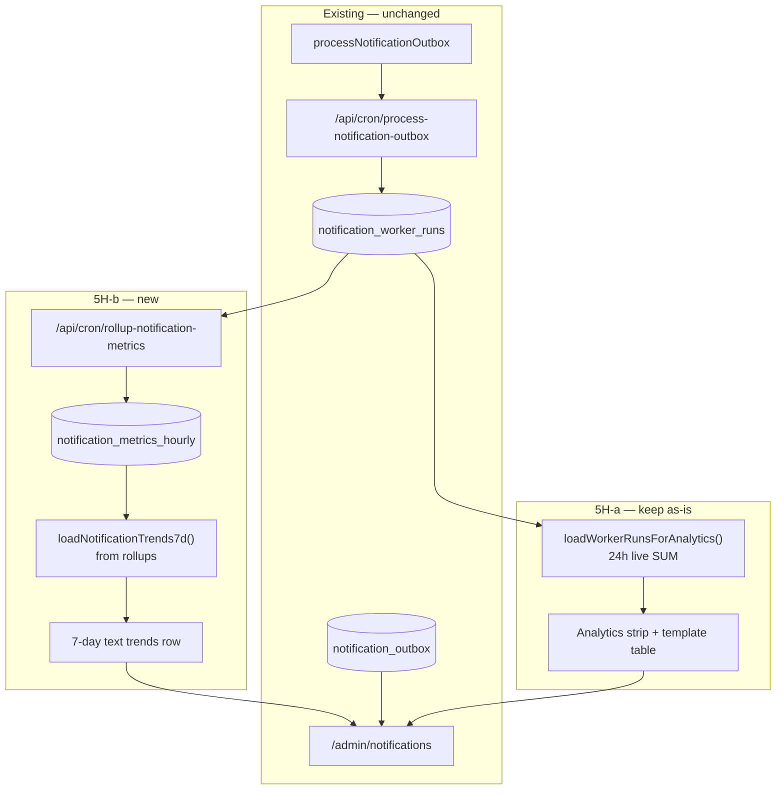

# Stage 5H-b — Notification Hourly Rollups & 7-Day Trends Design

**Date:** 2026-05-17  
**Status:** Design only — **no implementation**  
**Depends on:** [stage-5h-notification-analytics-metrics-design.md](./stage-5h-notification-analytics-metrics-design.md), [stage-5h-a-notification-analytics-mvp-final-audit.md](../audits/stage-5h-a-notification-analytics-mvp-final-audit.md), [stage-5g-notification-worker-run-logging-cron-health-design.md](./stage-5g-notification-worker-run-logging-cron-health-design.md), [notification-outbox-worker.md](../operations/notification-outbox-worker.md)

**Goal:** Design **persisted hourly notification metrics** and **7-day trend visibility** for admins without exposing raw payloads, recipient emails, or provider/`errors` JSON in browser-facing surfaces.

**Hard constraints (this stage):**

- Design only — no migrations, app code, charts, or worker delivery changes.
- Do **not** change `processNotificationOutbox`, reclaim, dedupe, or requeue behavior.
- Do **not** change RLS on `notification_outbox` or `notification_worker_runs`.
- Do **not** widen admin exposure of `notification_worker_runs.errors` or outbox `payload` / `recipient`.
- Do **not** add marketing analytics, open/click tracking, BI export, or home-dashboard widgets in the first 5H-b slice.

---

## Executive summary

| Question | Recommendation |
|----------|----------------|
| What 5H-b adds | Hourly **worker telemetry** buckets in Postgres + **text-only 7-day trends** on `/admin/notifications` |
| What stays from 5H-a | 24h live aggregates, template breakdown (live outbox counts), queue pressure, dry-run separation — **unchanged** |
| Rollup source (slice 1) | `notification_worker_runs` only — **no** `errors` column read |
| Rollup source (deferred) | Outbox queue-depth snapshots per hour |
| Generation | Dedicated cron route + `service_role` upsert — **not** inline in outbox worker |
| UI | Text lines (“Sent 7d: 142 · ↑ 8% vs prior week”) — **no charts** (5H-c) |
| RLS | Admin `SELECT` only; `service_role` insert/update for idempotent buckets |
| Retention | 13 months on rollups; purge job deferred (5H-e) |

---

## Context: what 5H-a already ships

| Capability | Mechanism | Window |
|------------|-----------|--------|
| Worker throughput | Live query on `notification_worker_runs` | 24h (`completed_at`) |
| Live success rate | In-memory aggregate; Resend + `delivery_enabled` only | 24h |
| Dry-run share | Separate ratio | 24h |
| Queue pressure | Derived from live outbox summary | Point-in-time |
| Template matrix | Parallel head counts on outbox | Point-in-time |
| Unsupported pending | Separate counts | Point-in-time |

**5H-b problem:** Re-scanning `notification_worker_runs` for 7×24h of history on every admin page load does not scale (~8k+ rows/month at 5-minute cron) and cannot cheaply answer “vs prior week” without storing buckets.

**5H-b solution:** A small, **PII-free hourly table** populated by cron; admin read model sums the last 7×24 buckets for trends.

---

## Architecture



### Layering rules

| Layer | 5H-a | 5H-b |
|-------|------|------|
| **24h worker cards** | Live from `notification_worker_runs` | **Keep live** — do not switch 24h to rollups in first slice (avoids drift while buckets backfill) |
| **7d trends** | N/A | Sum/average from `notification_metrics_hourly` |
| **Template breakdown** | Live outbox counts | **Keep live** — defer hourly template rollups |
| **Queue pressure** | Live summary | **Keep live** — defer `actionable_pending` hourly snapshots |

---

## Table design: `notification_metrics_hourly`

Prefer a **fixed wide row** per UTC hour (one primary key) over generic EAV `jsonb` dimensions — easier to type-check, audit, and forbid PII in code review.

### Schema (design)

```sql
create table public.notification_metrics_hourly (
  -- UTC hour start, inclusive lower bound for completed_at
  bucket_start timestamptz not null,

  -- Worker run aggregates (runs with completed_at in [bucket_start, bucket_start + 1 hour))
  run_count integer not null default 0 check (run_count >= 0),
  runs_ok_count integer not null default 0 check (runs_ok_count >= 0),

  sent_total integer not null default 0 check (sent_total >= 0),
  failed_total integer not null default 0 check (failed_total >= 0),
  dry_run_total integer not null default 0 check (dry_run_total >= 0),
  scanned_total integer not null default 0 check (scanned_total >= 0),
  skipped_total integer not null default 0 check (skipped_total >= 0),
  reclaimed_total integer not null default 0 check (reclaimed_total >= 0),

  -- Live delivery subset (same rules as 5H-a computeWorker24hAnalytics)
  live_sent_total integer not null default 0 check (live_sent_total >= 0),
  live_failed_total integer not null default 0 check (live_failed_total >= 0),

  -- Rollup job metadata (operational, not PII)
  source_run_rows integer not null default 0 check (source_run_rows >= 0),
  rolled_up_at timestamptz not null default now(),

  primary key (bucket_start)
);

comment on table public.notification_metrics_hourly is
  'Hourly notification worker telemetry buckets. No PII. Admin SELECT only (5H-b).';
```

### Columns intentionally omitted

| Omitted | Reason |
|---------|--------|
| `errors`, `error_count` detail | Never aggregate raw messages into rollups |
| `email_provider` per bucket | Optional later; first slice uses live/resend counters only |
| `payload`, `recipient`, `template` dimensions | Avoid outbox PII paths in v1 rollups |
| `booking_id`, `offer_id` | Not operational aggregates |
| Free-text `dimensions jsonb` | Hard to enforce allowlist; defer until template hourly is required |

### Idempotent upsert (not append-only)

Unlike `notification_worker_runs`, hourly buckets are **derived state** and must be **recomputable**:

| Approach | Verdict |
|----------|---------|
| Append-only trigger (5G pattern) | **No** — blocks service_role correction |
| `INSERT … ON CONFLICT (bucket_start) DO UPDATE` | **Yes** — `service_role` only via cron |
| Authenticated `UPDATE` | **Forbidden** — no grant |

```sql
-- RLS + grants (sketch)
alter table public.notification_metrics_hourly enable row level security;

create policy notification_metrics_hourly_select_admin
  on public.notification_metrics_hourly
  for select to authenticated
  using (public.auth_is_admin());

grant select on public.notification_metrics_hourly to authenticated, service_role;
grant insert, update on public.notification_metrics_hourly to service_role;
-- no insert/update/delete to authenticated
```

Optional hardening: wrap upsert in `security definer` SQL function `rollup_notification_metrics_hourly(p_bucket timestamptz)` callable only from cron; revoke direct `update` on table from `service_role` if desired — **not required for MVP**.

### Indexes

```sql
create index idx_notification_metrics_hourly_bucket_desc
  on public.notification_metrics_hourly (bucket_start desc);
```

---

## Rollup job design

### Route

`POST /api/cron/rollup-notification-metrics` (and `GET` for manual ops)

| Header | Purpose |
|--------|---------|
| `Authorization: Bearer $CRON_SECRET` | Same as other cron routes |
| `x-cron-secret` | Alternate |

### Schedule

| Environment | Cadence |
|-------------|---------|
| Production | **Hourly** at **:05** UTC (processes **previous closed hour**) |
| Staging | Same, or manual curl after soak |

**Do not** run inside `process-notification-outbox` — keeps worker scope clean (5G boundary).

### Bucket selection

```text
now = floor_to_utc_hour(now())
target_bucket = now - 1 hour    -- previous closed hour
window = [target_bucket, target_bucket + 1 hour)
```

Optional query param `?bucket=2026-05-17T10:00:00.000Z` for **backfill** (service_role only, cron secret required) — ops replays one hour.

### Source SQL (design — no `errors`)

Aggregate from `notification_worker_runs` where:

```sql
completed_at >= :bucket_start
and completed_at < :bucket_start + interval '1 hour'
```

| Output column | Aggregation |
|---------------|-------------|
| `run_count` | `count(*)` |
| `runs_ok_count` | `count(*) filter (where ok)` |
| `sent_total` | `sum(sent)` |
| `failed_total` | `sum(failed)` |
| `dry_run_total` | `sum(dry_run)` |
| `scanned_total` | `sum(scanned)` |
| `skipped_total` | `sum(skipped)` |
| `reclaimed_total` | `sum(reclaimed)` |
| `live_sent_total` | `sum(sent) filter (where delivery_enabled and email_provider = 'resend')` |
| `live_failed_total` | `sum(failed) filter (where delivery_enabled and email_provider = 'resend')` |
| `source_run_rows` | same as `run_count` |

**Never** `select errors` or `error_count` into application objects for rollup (DB-side sum only).

### Response (sanitized)

```json
{
  "ok": true,
  "bucketStart": "2026-05-17T10:00:00.000Z",
  "runCount": 12,
  "sentTotal": 34,
  "failedTotal": 2,
  "liveSentTotal": 30,
  "rolledUpAt": "2026-05-17T11:05:02.000Z"
}
```

### Failure behavior

| Failure | Behavior |
|---------|----------|
| DB upsert fails | HTTP 500; log structured event; **do not** affect outbox cron |
| No runs in hour | Upsert **zeros** — valid bucket (proves job ran) |
| Duplicate cron | Idempotent upsert — safe |
| Clock skew | Always use UTC hour boundaries |

### Backfill

1. On first deploy, run backfill for **last 7 days** of hours (168 buckets) via script or repeated `?bucket=` calls.
2. Until backfill completes, 7d UI shows partial data with footnote: “Trends available after hourly rollup backfill.”
3. Do **not** backfill from `errors` or outbox payloads.

### Environment flags

| Variable | Default | Purpose |
|----------|---------|---------|
| `NOTIFICATION_METRICS_ROLLUP_ENABLED` | `true` | Kill-switch |
| `NOTIFICATION_METRICS_ROLLUP_MAX_HOURS_PER_REQUEST` | `1` | Normal cron processes one hour; backfill script raises cap |

---

## 7-day trends (admin DTO + UI)

### Metrics to expose (text only)

Extend `AdminNotificationAnalytics` (or sibling `AdminNotificationTrends7d`) with **nullable** fields:

| Field | Definition |
|-------|------------|
| `sent7dTotal` | `sum(sent_total)` for buckets in `(now-7d, now]` |
| `sent7dPriorTotal` | `sum(sent_total)` for buckets in `(now-14d, now-7d]` |
| `sent7dDeltaPercent` | `round((sent7d - sentPrior) / sentPrior * 100, 1)` or `null` if prior = 0 |
| `failed7dTotal` | same pattern |
| `failed7dDeltaPercent` | same |
| `liveSuccessRate7dPercent` | `sum(live_sent) / (sum(live_sent) + sum(live_failed))` over 7d buckets |
| `liveSuccessRate7dPriorPercent` | prior 7d window |
| `liveSuccessRate7dDeltaPoints` | percentage-point delta (not ratio of ratios) |
| `rollupAsOf` | `max(rolled_up_at)` for buckets in window — staleness signal |
| `rollupCoverageHours` | count of buckets present in last 7d (expect ≤ 168) |

**Do not expose:** per-hour arrays to the client in slice 1 (keeps payload small; sparklines = 5H-c).

### UI placement

Under existing **Delivery analytics (24h)** section in `AdminNotificationAnalyticsPanel`:

```text
7-day trends (from hourly rollups · as of {rollupAsOf})
  Sent: 142 (↑ 8% vs prior week)
  Failed: 9 (↓ 18% vs prior week)
  Live success rate: 96.2% (+1.1 pts vs prior week)
```

| UI rule | Detail |
|---------|--------|
| Format | Plain text / metric cards — **no charts** in 5H-b |
| Null prior | Show “—” not `Infinity%` |
| Stale rollups | If `rollupAsOf` older than 2 hours, amber hint: “Hourly rollup may be delayed.” |
| Dry-run | Optional line: dry-run total 7d — **separate** from live success rate |
| Footnote | “Queue cards below are current state; trends are worker throughput only.” |

### Read path

```text
loadNotificationTrends7d(client, now):
  SELECT sum(...) FROM notification_metrics_hourly
  WHERE bucket_start > now() - interval '14 days'
  GROUP BY window (app-side or two SQL queries)
```

Target: **one** bounded query (or two) — not 168 round-trips.

---

## Sensitive data policy (5H-b)

Inherited from 5H-a — **no regression**:

| Artifact | Allowed in rollup table / 7d DTO | Forbidden |
|----------|-----------------------------------|-----------|
| Hourly row | Integer counters, UTC `bucket_start`, `rolled_up_at` | Emails, UUIDs of bookings/offers/recipients |
| Rollup job | Reads worker counters only | `SELECT errors`, outbox `payload`, `recipient` |
| Admin API | Sums, rates, delta percents, coverage metadata | Raw hour series with any string diagnostics |
| UI | Same as API | Error drill-down, provider bodies |

**Type-level guard (implementation):** `AdminNotificationTrends7d` must not include fields named `errors`, `payload`, `recipient`, `message`, or `email`.

---

## Dry-run, unsupported, and queue metrics

| Metric | 5H-b slice 1 | Deferred |
|--------|--------------|----------|
| Live success rate 7d | From `live_sent_total` / `live_failed_total` in rollups | — |
| Dry-run 7d total | `sum(dry_run_total)` text line | Trend % |
| Unsupported pending trend | **Not in rollups** | Hourly outbox snapshot table (5H-b2) |
| Queue pressure trend | **Not in rollups** | `actionable_pending` snapshot column |
| Per-template 7d | **Not in rollups** | `notification_metrics_hourly_by_template` or allowlisted `dimensions` |

**Rule:** Unsupported pending remains **live-only** (5H-a); never fold into failure-rate trends.

---

## Drift and reconciliation

| Drift type | Mitigation |
|-----------|------------|
| 24h live vs sum of last 24 hourly buckets | **Expected** near hour boundaries; 5H-a keeps live 24h; footnote in UI |
| Rollup lag | Show `rollupAsOf`; alert ops if > 2h |
| Missing buckets | Show `rollupCoverageHours / 168`; backfill job |
| Runs vs outbox sent | Document: rollups measure **worker counters**, not outbox terminal `sent` rows |

Optional **5H-b2** ops job: daily checksum `sum(worker sent 24h)` vs `count(outbox sent deliverable 24h)` — log only, no UI.

---

## Retention

| Dataset | Retention | Purge |
|---------|-----------|-------|
| `notification_metrics_hourly` | **13 months** | 5H-e — `service_role` delete `bucket_start < now() - interval '13 months'` |
| `notification_worker_runs` | 90d (existing ops guidance) | Unchanged |
| Rollup job logs | Vercel logs | Standard |

---

## Security & RLS

| Asset | Policy |
|-------|--------|
| `notification_outbox` | **No change** |
| `notification_worker_runs` | **No change** |
| `notification_metrics_hourly` | New: admin `SELECT` only; `service_role` insert/update for upsert |
| Cron routes | `CRON_SECRET` only; no admin UI trigger |
| Browser | Server Components / read model only — no client-side rollup queries |

**Tests:** `supabase/tests/notification_metrics_hourly_rls_phase5h_checks.sql` — admin can select; non-admin cannot; authenticated cannot insert/update/delete.

---

## What 5H-b does **not** include

- Charts / sparklines (5H-c)
- Admin home summary chip (5H-d)
- Purge cron (5H-e)
- Marketing / Resend webhook analytics
- Changing worker batch size, cron frequency, or delivery logic
- Exposing `notification_worker_runs.errors` in trends UI
- Export CSV / Metabase
- Per-recipient or per-booking dimensions in rollups

---

## Test strategy (implementation phase)

| Test | Scope |
|------|-------|
| Migration | Table, checks, RLS policies, grants |
| `rollupNotificationMetricsHourly()` unit | Bucket boundaries, live subset filter, zero-run hour |
| Cron route | Auth 401, upsert called, fail-soft logging |
| `computeTrends7dFromHourlyRows()` unit | Delta %, null prior, live rate, coverage |
| Read model integration | Trends present when buckets exist; no `errors`/`@`/`payload` in JSON |
| SQL policy catalog | `notification_metrics_hourly_rls_phase5h_checks.sql` |
| UI smoke | Renders “—” when no rollups; shows staleness hint |

---

## Phased rollout within 5H-b

| Sub-slice | Deliverable | New infra |
|-----------|-------------|-----------|
| **5H-b-α** | Table + migration + RLS + rollup cron + backfill script | `notification_metrics_hourly` |
| **5H-b-β** | 7d text trends in read model + analytics panel | Read query only |
| **5H-b-γ** (optional) | Hourly outbox snapshot columns (`actionable_pending`, `unsupported_pending`) | Schema migration + second rollup pass |
| **5H-c** | Sparklines from hourly series | Chart component |

Deploy **5H-b-α** before **5H-b-β** so trends never show empty without explanation.

---

## Code locations (planned)

| Piece | Path |
|-------|------|
| Migration | `supabase/migrations/20260518xxxxxx_notification_metrics_hourly.sql` |
| Rollup SQL / service | `src/features/notifications/server/rollupNotificationMetricsHourly.ts` |
| 7d pure functions | `src/features/notifications/server/notificationTrends7d.ts` |
| Cron route | `src/app/api/cron/rollup-notification-metrics/route.ts` |
| Read model extension | `notificationAdminReadModel.ts` — `loadNotificationTrends7d()` |
| Types | `notificationAdminTypes.ts` — `AdminNotificationTrends7d` |
| UI | `AdminNotificationAnalyticsPanel.tsx` — trends subsection |
| Ops doc | `notification-outbox-worker.md` — rollup cron section |

---

## Related documents

- [stage-5h-notification-analytics-metrics-design.md](./stage-5h-notification-analytics-metrics-design.md) — parent metrics architecture
- [stage-5h-a-notification-analytics-mvp-final-audit.md](../audits/stage-5h-a-notification-analytics-mvp-final-audit.md) — shipped MVP audit
- [stage-5g-notification-worker-run-logging-final-audit.md](../audits/stage-5g-notification-worker-run-logging-final-audit.md) — worker run source table
- [admin-operational-dashboard.md](../operations/admin-operational-dashboard.md) — admin UI map

---

## Final recommendation

### Safest smallest 5H-b implementation slice (**5H-b-α + 5H-b-β**)

Implement **only** worker-telemetry hourly rollups and **text** 7-day comparisons — no charts, no outbox snapshot columns, no template-dimensional rollups:

1. **Migration** — `notification_metrics_hourly` wide table (counters only), admin `SELECT`, `service_role` upsert, RLS tests.
2. **Cron** — `POST /api/cron/rollup-notification-metrics` processes **one closed UTC hour** per run; aggregates from `notification_worker_runs` **without** reading `errors`; idempotent upsert; fail-soft logging.
3. **Backfill** — ops script or authenticated cron calls for **last 168 hours** once after deploy.
4. **Read model** — single query for 14 days of buckets; compute `sent7d` / `sent7dDeltaPercent`, `failed7d`, `liveSuccessRate7d` + prior-week deltas; extend sanitization tests (no `@`, `payload`, `errors`).
5. **UI** — add a **7-day trends** text row under the existing 24h strip; keep 24h **live** from 5H-a unchanged; show `rollupAsOf` / coverage footnote.

**Defer to 5H-b-γ or later:** hourly outbox queue snapshots, per-template hourly buckets, sparklines (5H-c), admin home chip (5H-d), retention purge (5H-e).

This is the smallest increment that delivers **persisted trends** while preserving the 5H-a security model and leaving worker delivery, requeue, and existing RLS untouched.
