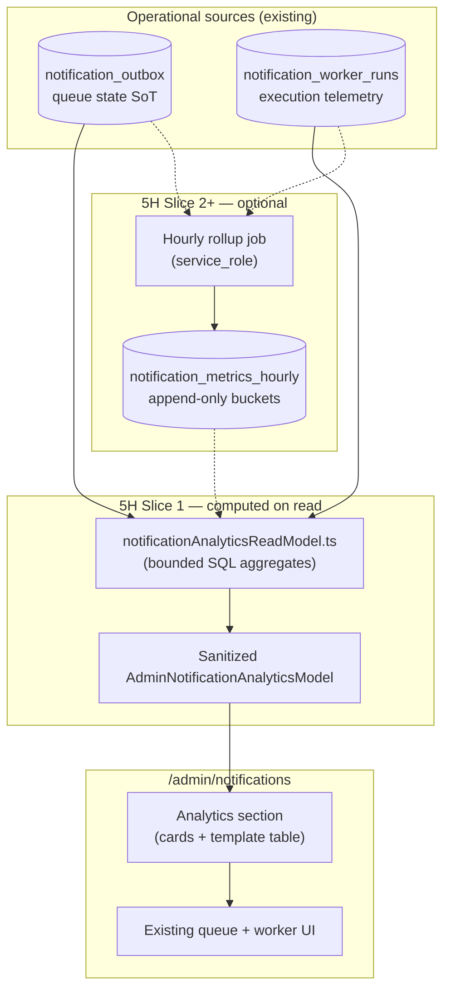

# Stage 5H — Notification Analytics & Metrics Design

**Date:** 2026-05-17  
**Status:** Design only — **no implementation**  
**Depends on:** [stage-5d-notification-admin-observability-design.md](./stage-5d-notification-admin-observability-design.md), [stage-5d-2-global-notification-health-page-design.md](./stage-5d-2-global-notification-health-page-design.md), [stage-5e-notification-retry-resend-governance-design.md](./stage-5e-notification-retry-resend-governance-design.md), [stage-5f-notification-outbox-rls-tightening-design.md](./stage-5f-notification-outbox-rls-tightening-design.md), [stage-5g-notification-worker-run-logging-cron-health-design.md](./stage-5g-notification-worker-run-logging-cron-health-design.md), [notification-outbox-worker.md](../operations/notification-outbox-worker.md)

**Goal:** Design **safe operational analytics** for the notification system using **aggregated operational signals** — not raw payloads, provider bodies, or unsanitized errors in browser-facing surfaces.

**Hard constraints (this stage):**

- Design only — no migrations, app code, charts, or worker changes.
- Do **not** change worker delivery, reclaim, dedupe, or requeue behavior.
- Do **not** change RLS on `notification_outbox` or `notification_worker_runs`.
- Do **not** expose recipient emails, raw `payload`, raw `errors` JSON, or provider responses in admin analytics.
- Do **not** add marketing analytics, open/click tracking, or recipient engagement metrics.

---

## Executive summary

| Question | Recommendation |
|----------|----------------|
| 1. Which metrics? | Two layers: **queue state** (outbox, point-in-time) + **throughput/reliability** (worker runs, time-windowed) |
| 2. Data sources | **Both** — outbox = queue SoT; worker_runs = execution telemetry |
| 3. Browser-safe? | Counts, rates, template keys, status buckets, env/provider mode — **never** row-level PII or raw errors |
| 4. Compute model | **Hybrid** — live aggregates for Slice 1; optional hourly rollups in Slice 2+ |
| 5. Smallest slice | 24h worker throughput + deliverable success rate + template count table — **no charts, no new tables** |
| 6. Outbox vs runs | Outbox for backlog/queue health; runs for sent/failed/dry-run **velocity** and cron reliability |
| 7. Dry-run | **Separate** metrics and UI badge; never mixed into live delivery success rate |
| 8. Unsupported pending | **Operational backlog** card; **excluded** from failure/retry rates |
| 9. Retention | Outbox: operational purge policy later; runs: 90d then archive; rollups: 13 months |
| 10. UI | Extend `/admin/notifications` — analytics section above existing cards; no new route |
| 11. Out of scope | Marketing, webhooks, BI export, live streaming, campaigns, email preview |
| 12. Tests | Aggregation unit tests, sanitization guards, read-model contract, stale-window behavior |
| 13. RLS | Admin SELECT-only on any new rollup table; service_role INSERT only; append-only |
| 14. Generation | Slice 1: **sync on page load** (bounded SQL); Slice 2: optional cron rollup job |
| 15. Biggest risks | Expensive full-table scans, dry-run/live confusion, analytics drift vs queue reality |

---

## Current observability state (Stages 5C–5G)

### Shipped capabilities

| Surface | Source | What it shows |
|---------|--------|----------------|
| `/admin/notifications` | `notification_outbox` + read model | Point-in-time summary cards (8 counts), oldest actionable pending age, filtered row table (cap 100), requeue actions (5E) |
| Per-booking section | `notification_outbox` | Up to 25 sanitized rows per booking |
| Delivery banner | Env / config | `ENABLE_NOTIFICATION_DELIVERY`, `dry_run` vs `resend`, `APP_BASE_URL` warning |
| Worker health card | `notification_worker_runs` (latest row) | Cron freshness (healthy / warning / critical), last-run counters |
| Recent worker runs table | `notification_worker_runs` (last 15) | Per-run `scanned`, `sent`, `failed`, `dry_run`, `ok`, provider — **no `errors` column in UI** |
| RLS | 5F + 5G | Admin **SELECT only** on outbox and worker runs; mutations via service_role only |

### Code references (current)

| Piece | Path |
|-------|------|
| Health page read model | `src/features/notifications/server/notificationAdminReadModel.ts` |
| Point-in-time summary | `loadNotificationHealthSummary()` — 8 parallel head counts |
| Pure aggregation (tests) | `src/features/notifications/server/notificationAdminAggregates.ts` |
| Worker run mapper (sanitized) | `src/features/notifications/server/mapNotificationWorkerRunForAdmin.ts` |
| Worker run persist | `src/features/notifications/server/recordNotificationWorkerRun.ts` — caps/sanitizes `errors` JSONB |
| Admin UI | `src/app/(admin)/admin/notifications/page.tsx` |

### Gaps 5H addresses

| Gap | Today | After 5H (target) |
|-----|-------|-------------------|
| Reliability over time | Only “right now” queue counts | 24h / 7d sent & failed totals, success rate |
| Throughput | Last run only | Rolling avg scanned/sent per run |
| Template mix | Filter by template on row table | Aggregated template × status matrix |
| Trends | None | Slice 1: text windows; Slice 2+: hourly snapshots |
| Queue pressure | Implicit in cards | Explicit composite score + optional trend |
| Worker uptime | Freshness of last run | % successful runs in window |

### Explicit non-gaps (unchanged)

- Row-level diagnostics, requeue, booking links — remain as today.
- Persisted `errors` JSONB in DB — remains **admin UI excluded**; ops use SQL/runbooks if needed.

---

## Proposed metrics architecture



### Source-of-truth roles

| Source | Role in analytics | Best for |
|--------|-------------------|----------|
| `notification_outbox` | **Queue state** — what is waiting, stuck, or terminal | Backlog, template distribution by **current status**, unsupported backlog, dry-run row count (via `last_error` prefix) |
| `notification_worker_runs` | **Execution telemetry** — what the worker did per cron tick | 24h/7d throughput, failure velocity, dry-run volume per run, cron reliability, avg scanned/sent |

**Rule:** Do not treat worker-run `sent` as the only “total sent” metric for all time — outbox `status = sent` is the durable delivery record. Worker runs measure **batch activity** in a time window; outbox measures **cumulative queue outcomes**.

---

## Safe metrics inventory

### Tier A — Safe for browser / admin API (5H target)

| Metric ID | Definition | Source | Window |
|-----------|------------|--------|--------|
| `queue.sent_deliverable` | Rows deliverable + `status = sent` | Outbox | Point-in-time |
| `queue.failed_deliverable` | Deliverable + `failed` | Outbox | Point-in-time |
| `queue.actionable_pending` | Deliverable + `pending` + retry due | Outbox | Point-in-time |
| `queue.scheduled_retry` | Deliverable + `pending` + retry future | Outbox | Point-in-time |
| `queue.processing` | Deliverable + `processing` | Outbox | Point-in-time |
| `queue.stale_processing` | Processing older than reclaim threshold | Outbox | Point-in-time |
| `queue.unsupported_pending` | Unsupported template + `pending` | Outbox | Point-in-time |
| `queue.dry_run_rows` | Deliverable + `last_error` like `dry_run_sent%` | Outbox | Point-in-time |
| `queue.oldest_actionable_pending_age` | Min `created_at` actionable pending | Outbox | Point-in-time |
| `queue.pressure_score` | `actionable_pending + processing + failed` (deliverable) | Derived | Point-in-time |
| `worker.last_run_age_minutes` | Age since latest `completed_at` | Worker runs | Point-in-time |
| `worker.runs_24h_total` | Count of runs in window | Worker runs | 24h |
| `worker.runs_24h_ok_pct` | % runs with `ok = true` | Worker runs | 24h |
| `worker.sent_24h` | `SUM(sent)` | Worker runs | 24h |
| `worker.failed_24h` | `SUM(failed)` | Worker runs | 24h |
| `worker.dry_run_24h` | `SUM(dry_run)` | Worker runs | 24h |
| `worker.scanned_24h` | `SUM(scanned)` | Worker runs | 24h |
| `worker.skipped_24h` | `SUM(skipped)` | Worker runs | 24h |
| `worker.reclaimed_24h` | `SUM(reclaimed)` | Worker runs | 24h |
| `worker.avg_sent_per_run_24h` | `sent_24h / runs_24h_total` | Derived | 24h |
| `worker.avg_scanned_per_run_24h` | `scanned_24h / runs_24h_total` | Derived | 24h |
| `delivery.success_rate_24h` | `sent_24h / (sent_24h + failed_24h)` when denominator > 0 | Derived | 24h, **live provider only** |
| `delivery.dry_run_ratio_24h` | `dry_run_24h / (sent_24h + dry_run_24h + failed_24h)` | Derived | 24h |
| `template.counts` | `GROUP BY payload->>'template'` × status bucket counts | Outbox | Point-in-time |
| `template.payment_vs_offer` | Rollup: payment templates vs `assignment_offer` | Outbox | Point-in-time |
| `env.delivery_enabled` | Config snapshot | Env | Point-in-time |
| `env.email_provider` | `dry_run` \| `resend` \| disabled | Env + last run | Point-in-time |

### Tier B — Safe but defer to Slice 2+ (needs rollups or heavier SQL)

| Metric ID | Definition | Why defer |
|-----------|------------|-----------|
| `queue.actionable_pending_trend` | Hourly snapshot of actionable pending | Requires time series storage or expensive historical replay |
| `queue.backlog_trend_7d` | Daily max pressure score | Hourly rollup table |
| `delivery.success_rate_7d` | 7-day rolling success rate | Same |
| `worker.sent_7d_by_day` | Daily bar series | Chart + rollup |
| `template.sent_7d` | Sent count per template per day | Rollup |
| `retry.volume_24h` | Rows with `attempts > 1` entering retry | Extra outbox predicate; OK in Slice 2 |
| `failure.rate_by_template` | Failed / (failed+sent) per template | Needs enough volume + careful dry-run exclusion |

### Tier C — Never in browser-facing analytics

| Data | Reason |
|------|--------|
| `recipient` UUID / resolvable identity | Indirect PII path |
| `payload` JSONB (full or partial) | May contain booking details, links with tokens |
| `last_error` raw text in aggregates | May contain provider snippets; row table already sanitizes |
| `notification_worker_runs.errors` JSONB | Capped but still row-level diagnostic; keep SQL-only |
| Email addresses, phone numbers | Hard exclude |
| Resend/provider response bodies | Security + noise |
| Per-recipient open/click rates | Marketing scope |
| Webhook delivery logs | Out of scope |

---

## Excluded / sensitive data inventory

| Field / artifact | In DB? | In admin row table? | In 5H analytics? |
|------------------|--------|---------------------|------------------|
| `notification_outbox.recipient` | Yes | Mapped to type/label only | **Never** aggregate by recipient |
| `notification_outbox.payload` | Yes | Template key + bookingId only | **Never** — use `payload->>'template'` only |
| `notification_outbox.last_error` | Yes | Sanitized per row | **Never** in aggregates; dry-run via prefix match only |
| `notification_worker_runs.errors` | Yes | Not in UI | **Never** in analytics API |
| Provider API keys / Resend IDs | Env | No | No |

**Sanitization contract (analytics read model):**

- All analytics DTOs are **numeric + enum + template key** only.
- Add a CI test that analytics types cannot include `string` fields matching `email`, `payload`, `errors`, `recipient` except allowlisted template keys and ISO timestamps.
- Reuse patterns from `mapNotificationOutboxRowForAdmin` and `sanitizeWorkerRunErrors` — analytics layer must not import row mappers for bulk export.

---

## Aggregation strategy

### Recommended model: **hybrid**

| Layer | Mechanism | When |
|-------|-----------|------|
| **L0 — Point-in-time queue** | Parallel head/count queries on outbox (existing `loadNotificationHealthSummary`) | Every page load |
| **L1 — Windowed worker telemetry** | Single SQL aggregate on `notification_worker_runs` with `completed_at >= now() - interval '24 hours'` | Slice 1 |
| **L2 — Template matrix** | One `GROUP BY payload->>'template', status` with deliverable filter | Slice 1 |
| **L3 — Hourly rollups** | Append-only `notification_metrics_hourly` filled by cron | Slice 2 when outbox > ~50k or trend queries > 200ms |
| **L4 — Materialized view** | Refresh on schedule | Only if rollups insufficient |

### Computed live vs persisted

| Approach | Pros | Cons | Use when |
|--------|------|------|----------|
| **Computed on read** | No drift, no new tables, simplest | Repeated work per page view; bounded windows only | Slice 1 (worker runs ≤ ~10k rows / 30d) |
| **Cached in memory** | Fast repeat views | Stale on multi-instance; not shared | **Avoid** for admin SSR |
| **Persisted hourly rollups** | Cheap trends; predictable perf | Drift if job fails; needs backfill | Slice 2+ |
| **Materialized view** | SQL-native | Refresh lag; still need RLS on view | High volume |

**Slice 1 default:** synchronous aggregation in `getAdminNotificationHealthPage` (or sibling `getAdminNotificationAnalytics`) — **one extra round-trip** with 2–3 bounded queries, not N+1.

**Slice 2 optional table sketch** (design only):

```sql
-- 5H-b (future): hourly operational metrics — no PII
create table public.notification_metrics_hourly (
  bucket_start timestamptz not null,
  metric_key text not null,
  dimensions jsonb not null default '{}'::jsonb,  -- e.g. {"template":"payment_confirmed"}
  value_numeric numeric not null,
  created_at timestamptz not null default now(),
  primary key (bucket_start, metric_key, dimensions)
);
-- dimensions allowlisted keys only: template, channel, provider_mode, scope
-- append-only trigger; admin SELECT; service_role INSERT
```

---

## Audit / design questions (1–15)

### 1. Which metrics should exist in 5H?

See **Safe metrics inventory** above. Grouped for operators:

| Category | Metrics |
|----------|---------|
| **Reliability** | `delivery.success_rate_24h` (live only), `worker.runs_24h_ok_pct`, `queue.failed_deliverable` |
| **Throughput** | `worker.sent_24h`, `worker.scanned_24h`, `worker.avg_sent_per_run_24h` |
| **Retries** | `queue.scheduled_retry`, `retry.volume` (Slice 2: deliverable rows with `attempts > 1`) |
| **Dry-run** | `queue.dry_run_rows`, `worker.dry_run_24h`, `delivery.dry_run_ratio_24h` |
| **Backlog** | `queue.actionable_pending`, `queue.pressure_score`, `queue.unsupported_pending` |
| **Templates** | `template.counts`, payment vs offer split |
| **Worker health** | `worker.last_run_age_minutes`, freshness level, 24h run totals |
| **Trends (later)** | Hourly actionable pending, 7d sent/failed series |

### 2. Which data sources should power metrics?

| Source | Use | Do not use for |
|--------|-----|----------------|
| `notification_outbox` | Queue depth, terminal state counts, template distribution, unsupported backlog | Per-run throughput (use runs) |
| `notification_worker_runs` | Windowed sent/failed/dry-run/scanned, cron reliability | Historical “all-time sent” without window |
| Derived / rollups | Trends, SLA charts | Raw row drill-down |
| Env config | Mode labeling (`dry_run` vs `resend`) | Secret values |

### 3. Which metrics are safe for browser/admin visibility?

**Include:** integers, percentages, template enum strings, status enums, `email_provider`, `delivery_enabled`, timestamps, health levels.

**Exclude:** everything in Tier C; never aggregate `errors` JSONB into UI; never show `error_count` as a proxy for “read the errors” — keep as a number only with link to runbook, not to raw JSON.

### 4. Should metrics be computed live, cached, persisted, MV, or hybrid?

**Hybrid** — see Aggregation strategy. Slice 1 = live with strict windows; Slice 2 = hourly rollups for trends.

### 5. Safest first implementation slice?

**5H-a (minimal):**

1. **Analytics strip** on `/admin/notifications` (above existing cards):
   - Last 24h: total runs, sum sent, sum failed, sum dry-run, success rate (live deliveries only).
   - Badge: current `email_provider` + warning if dry-run ratio > 0 in prod.
2. **Template breakdown table** — deliverable rows only: columns `template`, `sent`, `failed`, `pending`, `processing` (counts).
3. **Queue pressure** — single derived number + label (reuse existing card inputs).

**Explicitly not in 5H-a:** charts, 7d trends, new tables, cron jobs, home dashboard chip, exporting.

### 6. Should analytics use worker runs, outbox, or both?

**Both**, with clear labeling:

| Question | Primary source |
|----------|----------------|
| “Is the queue stuck?” | Outbox |
| “Did cron send anything today?” | Worker runs |
| “How many payment_confirmed are pending?” | Outbox template GROUP BY |
| “Is delivery succeeding?” | Worker runs (24h) + outbox failed count (point-in-time) |

### 7. How should dry-run metrics behave?

| Rule | Detail |
|------|--------|
| **Separate** | Dedicated metrics and UI badge — “Dry-run mode” |
| **Not in live success rate** | `delivery.success_rate_24h` uses runs where `email_provider = 'resend'` AND `delivery_enabled` OR filter `dry_run = 0` in numerator/denominator |
| **Combined display OK** | Show dry-run count **adjacent** to live sent, not added into “delivered” |
| **Prod warning** | If `email_provider = dry_run` on last run in production → amber banner (config issue, not failure) |
| **Outbox dry-run rows** | Keep `queue.dry_run_rows` separate; explain they are preview metadata, not failures |

### 8. How should unsupported pending appear?

| Treatment | Detail |
|-----------|--------|
| **Operational backlog** | Own card + template table section “Not yet delivered by worker” |
| **Excluded from failure rates** | Never in `failed` rate or `success_rate` |
| **Excluded from pressure score** | Optional: include in “informational backlog” only |
| **Copy** | “Enqueue-only — not a delivery failure” (already on page) |

### 9. Retention policy (later ops)

| Dataset | Suggested retention | Notes |
|---------|---------------------|-------|
| `notification_outbox` | 90–180d terminal rows; keep pending/failed longer | Purge job via service_role; audit before delete |
| `notification_worker_runs` | 90d hot; archive to cold storage optional | ~8k rows/month at 5-min cron |
| `notification_metrics_hourly` | 13 months | Small rows; drives trends |
| Analytics API | N/A | Always computed from retained data |

**5H:** document only — no purge implementation.

### 10. What UI surfaces should exist?

Extend existing page — **no new route**.

```
/admin/notifications
├── [existing] Delivery banner
├── [existing] Worker health card
├── [NEW 5H] Analytics section
│   ├── Row: 24h reliability cards (4–5 numbers)
│   ├── Row: Queue pressure + dry-run badge
│   └── Table: Template × status counts (deliverable)
├── [existing] Point-in-time health cards (8)
├── [existing] Recent worker runs table
└── [existing] Filtered outbox table
```

**No charts in Slice 1** — numbers and tables only. Slice 2 may add sparklines from hourly rollups.

### 11. What remains out of scope?

- Marketing / campaign analytics
- Recipient engagement (open, click, unsubscribe)
- Provider webhook analytics (Resend events)
- Live streaming / WebSocket dashboards
- BI exports (CSV, Metabase)
- Real-time sub-second charts
- Cross-tenant benchmarking
- Alerting/PagerDuty wiring (separate ops stage)
- Changing worker batch size or cron schedule
- Exposing `errors` JSONB in UI

### 12. What tests would 5H require?

| Test type | Scope |
|-----------|-------|
| **Aggregation unit** | `computeNotificationAnalyticsFromWorkerRuns()`, template matrix from fixture rows |
| **Sanitization** | Analytics DTO snapshot has no forbidden keys; worker aggregate query does not SELECT `errors` |
| **Read-model integration** | Admin user gets analytics; non-admin 403 |
| **Window boundary** | Runs at `completed_at = now() - 24h` included/excluded correctly |
| **Dry-run exclusion** | Success rate ignores dry_run batches when provider is dry_run |
| **Unsupported exclusion** | Template matrix does not count unsupported templates in “failed rate” |
| **Stale behavior** | Empty worker history → null rates, not divide-by-zero |
| **SQL policy** | If rollup table added: RLS negative tests (non-admin insert/update) |
| **UI smoke** | Analytics section renders zeros gracefully |

### 13. RLS / security posture

| Asset | Policy |
|-------|--------|
| Existing tables | **No change** — admin SELECT only |
| New rollup table (optional) | `SELECT` authenticated + `auth_is_admin()`; `INSERT` service_role only; append-only trigger |
| Analytics API | Server-only; `requireAdmin`; never expose service_role to client |
| Aggregates | No per-recipient dimensions; no free-text dimensions in rollup `jsonb` |

**Aggregates append-only:** yes — same pattern as `notification_worker_runs` and `admin_operational_audit`.

### 14. How should analytics be generated?

| Slice | Mechanism |
|-------|-----------|
| **5H-a** | Synchronously in `getAdminNotificationHealthPage` (extend) — 2–3 extra queries, < 100ms target |
| **5H-b** | Optional `POST /api/cron/rollup-notification-metrics` — hourly bucket insert |
| **Not** | Opportunistic writes from worker (keeps worker scope clean per 5G) |
| **Not** | Client-side aggregation of outbox rows |

### 15. Biggest risks and mitigations

| Risk | Impact | Mitigation |
|------|--------|------------|
| Expensive full-table scans on outbox | Slow admin page | Bounded template GROUP BY; defer trends to rollups; monitor row count |
| Leaking PII via `payload` in GROUP BY | Compliance | Only `payload->>'template'`; never select full payload in analytics queries |
| Dry-run vs live confusion | False incidents | Separate metrics + banner; document in UI |
| Analytics drift (runs vs outbox) | Mistrust | Label sources; reconciliation doc; optional daily checksum job later |
| Stale rollups | Wrong trends | `as_of` timestamp on analytics section; job failure alert in ops |
| Exposing `errors` via future feature creep | Leak | Type-level ban in analytics DTO; code review checklist |
| Dividing by zero | UI NaN | Null-safe formatters (“—”) |

---

## Operational UI proposal

### Analytics section copy

| Element | Content |
|---------|---------|
| Section title | “Delivery analytics (24h)” |
| Subtitle | “Aggregated from worker runs. Queue cards below are current state.” |
| Success rate footnote | “Excludes dry-run and unsupported templates.” |
| Dry-run badge | “Dry-run active” when `email_provider === 'dry_run'` |

### Template breakdown table

| Column | Source |
|--------|--------|
| Template | `payload->>'template'` |
| Sent | count `status = sent` |
| Failed | count `status = failed` |
| Pending | actionable + scheduled |
| Processing | count |
| Deliverable? | yes/no chip |

**Section 2 (informational):** Unsupported templates — pending counts only.

### Queue pressure indicator

```
pressure = actionable_pending + processing + failed  (deliverable only)
```

| Level | Threshold (initial) |
|-------|---------------------|
| Normal | 0 failed, actionable < 10 |
| Elevated | actionable ≥ 10 OR processing ≥ 5 |
| Critical | failed ≥ 5 OR stale_processing ≥ 1 |

Display as labeled badge, not a gauge chart.

---

## Phased rollout

| Phase | Deliverable | New infra |
|-------|-------------|-----------|
| **5H-a** | 24h worker aggregates + template table + pressure badge | None — SQL on read |
| **5H-b** | 7d trend text (“↑ 12% vs prior 7d”) | Hourly rollup table + cron |
| **5H-c** | Small charts (sparklines) | Rollups + chart component |
| **5H-d** | Admin home chip linking to notifications | Read model only |
| **5H-e** | Retention purge jobs | Ops migration |

---

## Test strategy (summary)

1. **Fixtures:** synthetic worker runs spanning 25h boundary; outbox rows across templates/statuses.
2. **Golden DTO snapshots** for analytics model.
3. **RLS regression** unchanged for existing tables; new table gets `supabase/tests/*_phase5h_checks.sql`.
4. **Performance budget:** page load analytics queries < 200ms p95 at 10k outbox / 5k runs (load test optional).

---

## Final recommendation

### Safest smallest 5H implementation slice (**5H-a**)

Implement **only** on the existing `/admin/notifications` page, **without** new tables, charts, cron jobs, or worker changes:

1. **24-hour worker telemetry row** — `SUM(sent|failed|dry_run|scanned)`, run count, ok%, avg sent/run from `notification_worker_runs` where `completed_at >= now() - interval '24 hours'`. Query must **not** select `errors`.
2. **Live delivery success rate (24h)** — `sum(sent) / (sum(sent) + sum(failed))` for runs with `delivery_enabled` and `email_provider = 'resend'` (or `dry_run = 0`).
3. **Template × status count table** — one grouped query on outbox (deliverable filter + separate unsupported section).
4. **Queue pressure badge** — derived from existing summary fields.
5. **Dry-run / provider badge** — reuse banner + 24h dry-run sum.

This gives operators **reliability and throughput context** plus **template mix** while staying within aggregate-only, admin-gated, read-model boundaries established in 5D–5G.

**Defer to 5H-b:** hourly rollups, 7d trends, charts, home dashboard chip, retry volume metric, archival.

---

## Related documents

| Doc | Relevance |
|-----|-----------|
| [stage-5d-2-global-notification-health-page-design.md](./stage-5d-2-global-notification-health-page-design.md) | Page layout baseline |
| [stage-5g-notification-worker-run-logging-cron-health-design.md](./stage-5g-notification-worker-run-logging-cron-health-design.md) | Worker run schema & freshness thresholds |
| [stage-5f-notification-outbox-rls-tightening-design.md](./stage-5f-notification-outbox-rls-tightening-design.md) | SELECT-only outbox |
| [notification-outbox-worker.md](../operations/notification-outbox-worker.md) | Runbook for ops interpretation |
