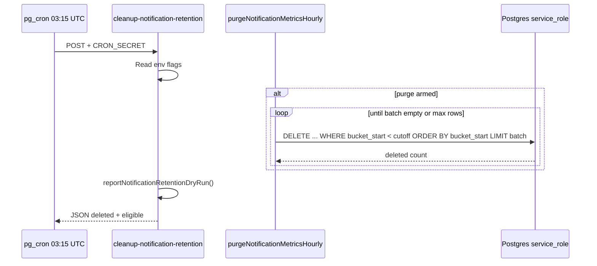

# Stage 5I-β — Metrics-Only Retention Purge Design

**Status:** Design only — **no destructive cleanup in this document**  
**Date:** 2026-05-17  
**Depends on:** Stage **5I-α** dry-run soak complete ([notification-retention-cleanup-cron.md](../operations/notification-retention-cleanup-cron.md))  
**Parent:** [stage-5i-notification-retention-cleanup-design.md](./stage-5i-notification-retention-cleanup-design.md)  
**Audit:** [stage-5i-alpha-retention-dry-run-final-audit.md](../audits/stage-5i-alpha-retention-dry-run-final-audit.md)

---

## Executive summary

Stage **5I-β** is the first **destructive** retention slice. It deletes rows from **`notification_metrics_hourly` only**, where `bucket_start` is older than **13 months**, using **service-role batched DELETE** behind multiple env kill-switches. It reuses the **same cutoff and count logic** as 5I-α so dry-run eligible counts match purge deletes.

**Why metrics-only first:** no PII, no payloads, no recipient data, no requeue dependency, no worker delivery dependency, no append-only trigger bypass, admin UI is SELECT-only today.

**Do not implement** until soak sign-off. This doc answers the 15 design questions and defines the smallest safe implementation slice.

---

## Current 5I-α dry-run state

| Artifact | Role |
|----------|------|
| `POST/GET /api/cron/cleanup-notification-retention` | Cron auth via `CRON_SECRET`; always calls `reportNotificationRetentionDryRun()` |
| `reportNotificationRetentionDryRun.ts` | Read-only counts; **never** `.delete()` / `.update()` |
| `getNotificationRetentionPolicy()` | Cutoffs including `metricsHourlyBefore` = `subtractMonths(now, metricsMonths)` (default **13**) |
| Metrics eligibility | `bucket_start < metricsHourlyBefore` → `eligible.metricsHourly.olderThanPolicy` |
| Admin panel | `AdminNotificationRetentionDryRunPanel` on `/admin/notifications` — counts only, no buttons |
| pg_cron | Job `notification-retention-dry-run-daily` at **03:15 UTC** → HTTP dry-run |
| Response contract | `dryRun: true`, `deleted: 0` always (success and error paths) |
| Logging | `notification_retention_dry_run` JSON to Vercel |

**Schema today (`notification_metrics_hourly`):**

- PK: `bucket_start` (UTC hour bucket)
- Integer counters only — **no PII**
- RLS: admin **SELECT** only (`notification_metrics_hourly_select_admin`)
- Grants: `service_role` has **SELECT, INSERT, UPDATE** — **not DELETE** yet (`20260518220000_notification_metrics_hourly.sql`)

**Rollup dependency:** 7-day trends read rollups; 24h worker cards remain **live** from `notification_worker_runs`. Purging buckets **older than 13 months** does not affect the live 7d window or rollup cron input for recent hours.

---

## Design question answers

### 1. What exact cutoff should be used for `notification_metrics_hourly`?

**Predicate (must match 5I-α):**

```sql
bucket_start < :metricsHourlyBefore
```

Where `:metricsHourlyBefore` is the ISO timestamp from `getNotificationRetentionPolicy().cutoffs.metricsHourlyBefore`, defaulting to **13 calendar months** before `asOf` via `subtractMonths(now, NOTIFICATION_RETENTION_METRICS_MONTHS)` (default **13**).

**Never delete** rows with `bucket_start >= metricsHourlyBefore`. The cutoff is **exclusive** on the upper bound (strictly older buckets only).

### 2. Should cutoff be calendar-month based or `now - 13 months`?

**Use the existing calendar-month subtraction** (`setUTCMonth(getUTCMonth() - months)`) — **not** a fixed `interval '13 months'` in SQL and **not** `now() - 395 days`.

| Approach | Verdict |
|----------|---------|
| Calendar-month (`subtractMonths`) | **Yes** — already used in 5I-α dry-run; purge must use **identical** function so `eligible.metricsHourly.olderThanPolicy` equals rows targeted by DELETE |
| Fixed 395-day window | **No** — drift vs dry-run |
| SQL `interval '13 months'` | **No** — can differ from JS month arithmetic at month boundaries |

**Edge case:** On days like 2026-03-31, subtracting 13 UTC months lands on 2025-02-28/29. Document in ops runbook; acceptable if dry-run and purge share the same code path.

### 3. What batch size is safe?

| Parameter | Recommended default | Rationale |
|-----------|---------------------|-----------|
| `NOTIFICATION_RETENTION_BATCH_SIZE` | **500** | Aligns with parent 5I design; ~21 days of hourly rows per batch |
| `NOTIFICATION_RETENTION_MAX_ROWS_PER_RUN` | **5000** | Caps total deleted per cron invocation (10 batches) |
| First production enable | **200** batch / **1000** max | Conservative first run; raise after one clean week |

**Delete pattern:** ordered by `bucket_start ASC`, `LIMIT batch`, loop until 0 rows or max cap. Small rows (~20 integers + timestamps) — low lock time per batch.

**Volume expectation:** ~24 rows/day ≈ **8.8k rows/year**; after 13 months retention, steady-state eligible backlog ≈ **one month of hours (~720 rows)** per day of “newly expired” buckets, often **0** until the table has been live for 13+ months.

### 4. Should cleanup require an explicit env flag?

**Yes — layered flags (all must pass for DELETE):**

| Variable | Default | Purpose |
|----------|---------|---------|
| `NOTIFICATION_RETENTION_CLEANUP_ENABLED` | `false` | Master kill-switch for any destructive retention |
| `NOTIFICATION_RETENTION_METRICS_PURGE_ENABLED` | `false` | Table-scoped: only `notification_metrics_hourly` |
| `NOTIFICATION_RETENTION_DRY_RUN` | `true` | When `true`, run counts only (same as 5I-α behavior for metrics path) |
| `NOTIFICATION_RETENTION_METRICS_PURGE_CONFIRM` | unset | Optional third latch: must be exactly `true` in production |

**Staging:** may set shorter `NOTIFICATION_RETENTION_METRICS_MONTHS` (e.g. 3) for integration tests — never in production without explicit ops approval.

### 5. Should cron default to dry-run unless CONFIRM flag is true?

**Yes.**

| `DRY_RUN` | `METRICS_PURGE_ENABLED` | `CLEANUP_ENABLED` | `METRICS_PURGE_CONFIRM` | Behavior |
|-----------|-------------------------|-------------------|-------------------------|----------|
| `true` (default) | any | any | any | **Dry-run only** — `deleted.metricsHourly = 0` |
| `false` | `false` | any | any | **Dry-run only** (metrics purge disabled) |
| `false` | `true` | `false` | any | **Dry-run only** (master disabled) |
| `false` | `true` | `true` | not `true` (if CONFIRM required) | **Dry-run only** or **503 + log** — fail closed |
| `false` | `true` | `true` | `true` | **Batched DELETE** for metrics only |

**Cron default in all environments:** `NOTIFICATION_RETENTION_DRY_RUN=true` until soak sign-off and explicit ops enable.

Query string `?dry_run=1` must **not** override env to enable deletes (parent design: prevent prod accidents via URL alone).

### 6. Should deletion use service role only?

**Yes.**

| Caller | DELETE allowed |
|--------|----------------|
| `createServiceRoleClient()` in cron route | **Yes** (after migration grants or SECURITY DEFINER wrapper) |
| Authenticated admin JWT | **No** — RLS has no DELETE policy; keep it that way |
| `anon` | **No** |
| Postgres cron HTTP | Same as app — Bearer `CRON_SECRET` → service role |

**Implementation options (pick one in 5I-β implementation):**

| Option | Pros | Cons |
|--------|------|------|
| **A — Grant `DELETE` to `service_role` on table only** | Simple; matches rollup INSERT/UPDATE pattern | Broader than single function |
| **B — `SECURITY DEFINER` function `purge_notification_metrics_hourly_before(cutoff, batch)`** | Revoke direct DELETE; single audited entry point | Extra migration + SQL tests |

**Recommendation:** **Option A** for 5I-β (metrics table has no append-only trigger). Option B reserved for `notification_worker_runs` in 5I-γ.

**Required migration (5I-β):** `grant delete on public.notification_metrics_hourly to service_role;` — **do not** grant DELETE to `authenticated`.

### 7. Should deleted count be returned?

**Yes.** Extend cron JSON (when not in pure 5I-α mode):

```json
{
  "ok": true,
  "dryRun": false,
  "deleted": {
    "metricsHourly": 720,
    "outbox": 0,
    "workerRuns": 0
  },
  "eligible": { "...": "same shape as 5I-α post-run" },
  "purge": {
    "metricsHourly": {
      "cutoff": "2025-04-17T03:15:01.234Z",
      "batches": 2,
      "stoppedReason": "batch_empty"
    }
  }
}
```

Log event: `notification_retention_cleanup` with `deleted`, `dryRun`, `durationMs`, `cutoff`, `batches`.

### 8. Should cleanup be idempotent?

**Yes.**

- Predicate is stable for a given `asOf` and policy env.
- Re-running after success deletes **0** rows.
- Partial run (timeout): next run continues from oldest remaining `bucket_start < cutoff`.
- No “soft delete” or tombstones — **hard DELETE** only.

### 9. Should there be an audit/run log for cleanup?

**5I-β minimum:** structured **Vercel logs** + JSON response (no new table required).

**5I-γ optional:** `notification_retention_runs` append-only table (parent design) with columns: `id`, `started_at`, `completed_at`, `dry_run`, `deleted_metrics_hourly`, `cutoff`, `batch_size`, `error`.

| Field | Source |
|-------|--------|
| Who triggered | `source` from cron body (`pg_cron` / `manual`) |
| What deleted | `deleted.metricsHourly` |
| Policy | `policy.metricsMonths` |
| Failure | HTTP 500 + partial `deleted` if fail-soft per batch |

**Do not** write to `admin_operational_audit` for routine metrics purge (noise). Reserve audit for admin actions.

### 10. Should cleanup share `/api/cron/cleanup-notification-retention` or have a metrics-only mode?

**Share the same route** with **table-scoped env flags** — do **not** add a second public cron URL in 5I-β.

| Mode | Flags | Behavior |
|------|-------|----------|
| **5I-α (current)** | `DRY_RUN=true` (default), all purge flags off | Full eligibility report; `deleted: 0` |
| **5I-β metrics purge** | `CLEANUP_ENABLED` + `METRICS_PURGE_ENABLED` + `DRY_RUN=false` + confirm | Run `purgeNotificationMetricsHourly()` then **always** run dry-run report for parity snapshot |
| **Future 5I-γ/δ** | `OUTBOX_ENABLED`, `RUNS_ENABLED` | Additional purge steps; same route |

**Execution order in 5I-β:**

1. Validate `CRON_SECRET`
2. If metrics purge armed → batched DELETE (metrics only)
3. Always → `reportNotificationRetentionDryRun()` for response `eligible` / `protected`
4. Return combined JSON

**pg_cron:** keep single job `notification-retention-dry-run-daily` until ops enables purge flags on Vercel; no migration change required for URL secret.

### 11. What tests are required?

| Layer | Test |
|-------|------|
| **Unit** | `purgeNotificationMetricsHourly()` — respects cutoff, batch cap, max rows, returns deleted count; uses same `getNotificationRetentionPolicy()` cutoff |
| **Unit** | Flag matrix: all combinations → no DELETE when any guard false |
| **Unit** | Idempotency: second call deletes 0 |
| **Route** | `cleanup-notification-retention/route.test.ts` — purge enabled mock deletes N; response `deleted.metricsHourly === N`; still includes `eligible` |
| **Route** | Default env → `dryRun: true`, `deleted: 0` (regression) |
| **Static** | Purge module must not import outbox/worker purge in 5I-β |
| **Migration** | `grant delete ... service_role` on `notification_metrics_hourly`; authenticated still no DELETE policy |
| **SQL** | Extend `notification_metrics_hourly_rls_phase5h_checks.sql` — authenticated has no DELETE grant |
| **Integration (optional)** | Local Supabase: insert old buckets, purge, assert count 0 |

**Parity test (critical):**

```text
eligible.metricsHourly.olderThanPolicy (before purge)
  === deleted.metricsHourly (first purge run)
  === rows with bucket_start < cutoff (when table static during run)
```

### 12. What rollback is possible after deletion?

| Recovery | Possible? |
|----------|-----------|
| In-app undelete | **No** |
| Reconstruct deleted buckets from `notification_worker_runs` | **No** for buckets older than **90d** (runs already gone or will be purged later) |
| Re-run rollup cron | Only recreates buckets if source runs still exist |
| Supabase PITR / backup restore | **Yes** — only operational rollback |
| Forward fix | Disable purge flags; dry-run continues |

**Impact of deletion:**

- 7d trends: **unaffected** (reads last 7 days)
- Historical ops review beyond 13mo: **permanent gap** (acceptable by policy)
- Worker run purge (5I-γ): **unaffected** — rollup prerequisite uses buckets in retention window

### 13. How should admin dry-run panel reflect purge readiness?

Extend `AdminNotificationRetentionDryRunPanel` (read-only, no action buttons):

| UI element | Source |
|------------|--------|
| **Purge readiness badge** | Env snapshot from server: `metricsPurgeArmed: boolean` (computed server-side, never trust client) |
| **Copy when not armed** | “Metrics purge disabled — dry-run only” |
| **Copy when armed** | “Metrics purge enabled in cron — last run see logs” (no delete button in UI) |
| **Eligible metrics card** | Existing `eligible.metricsHourly.olderThanPolicy` + oldest bucket date |
| **Post-purge (later)** | Optional `lastCleanup` from logs/table — defer to 5I-γ |

**Never add** a “Purge now” button in 5I-β (ops enable via Vercel env + cron only).

### 14. What soak evidence is required before enabling?

From [notification-retention-cleanup-cron.md](../operations/notification-retention-cleanup-cron.md):

| Evidence | Requirement |
|----------|-------------|
| Daily dry-run runs | **≥ 3** consecutive days (5 recommended) |
| Response invariants | Every run: `dryRun: true`, `deleted: 0` |
| Metrics eligible count | Stable or slowly growing; **0 is normal** until table age > 13mo |
| Admin vs cron parity | Same-window counts match |
| Worker rollup health | `protectedMissingRollup` not persistently high |
| Red flags | None from soak doc §5 |
| Written sign-off | Team log: “enable 5I-β metrics purge” |

**Additional before first DELETE:**

- [ ] Snapshot: `select count(*), min(bucket_start), max(bucket_start) from notification_metrics_hourly`
- [ ] Confirm `eligible.metricsHourly` matches manual `count(*) where bucket_start < cutoff`
- [ ] Enable on **staging** first with `METRICS_MONTHS=3`, small batch, verify trends UI
- [ ] Production: `BATCH_SIZE=200`, `MAX_ROWS=1000` first day; review logs; then raise to defaults

### 15. What should remain forbidden?

| Forbidden in 5I-β | Notes |
|---------------------|-------|
| Purge `notification_outbox` | 5I-δ |
| Purge `notification_worker_runs` | 5I-γ — needs append-only bypass |
| Purge `admin_operational_audit` | Never in 5I |
| Purge `booking_state_audit` | Out of scope |
| Change worker / requeue behavior | — |
| Change RLS policies | Except `grant delete` to `service_role` on metrics table only |
| Archive / export to S3 | Phase 2 |
| Admin-triggered DELETE from browser | — |
| DELETE via `authenticated` role | — |
| Query-string-only enable of destructive mode | — |
| Second cron URL without review | — |

---

## Metrics-only purge policy

| Property | Value |
|----------|-------|
| Table | `public.notification_metrics_hourly` |
| Retention anchor | `bucket_start` |
| Duration | **13 months** (configurable via `NOTIFICATION_RETENTION_METRICS_MONTHS`) |
| Action | `DELETE` batched |
| Prerequisites | None (no rollup coverage check) |
| PII risk | **None** |
| Delivery impact | **None** |

---

## Service-role delete strategy



**SQL shape (conceptual):**

```sql
delete from public.notification_metrics_hourly
where bucket_start in (
  select bucket_start
  from public.notification_metrics_hourly
  where bucket_start < $1::timestamptz
  order by bucket_start asc
  limit $2
);
```

Implement via Supabase client or RPC; prefer **single-table** module `purgeNotificationMetricsHourly.ts` colocated with `reportNotificationRetentionDryRun.ts`.

---

## Safety flags (reference)

```bash
# Master — must be true for any DELETE
NOTIFICATION_RETENTION_CLEANUP_ENABLED=false

# Table scope — 5I-β only touches metrics when this is true
NOTIFICATION_RETENTION_METRICS_PURGE_ENABLED=false

# Default stays true until soak sign-off
NOTIFICATION_RETENTION_DRY_RUN=true

# Optional production latch
NOTIFICATION_RETENTION_METRICS_PURGE_CONFIRM=true

# Policy (shared with 5I-α)
NOTIFICATION_RETENTION_METRICS_MONTHS=13

# Batching
NOTIFICATION_RETENTION_BATCH_SIZE=500
NOTIFICATION_RETENTION_MAX_ROWS_PER_RUN=5000
```

---

## Cron / API contract

**Route:** `POST /api/cron/cleanup-notification-retention` (unchanged path)  
**Auth:** `CRON_SECRET` (Bearer or `x-cron-secret`)  
**Scheduler:** existing `notification-retention-dry-run-daily` — same Vault URL

### Response shape (5I-β when purge runs)

```json
{
  "ok": true,
  "dryRun": false,
  "deleted": {
    "metricsHourly": 480,
    "outbox": 0,
    "workerRuns": 0
  },
  "asOf": "2026-05-17T03:15:01.234Z",
  "policy": { "metricsMonths": 13, "...": "..." },
  "eligible": { "metricsHourly": { "olderThanPolicy": 0 }, "...": "..." },
  "protected": { "...": "..." },
  "oldestEligible": { "...": "..." },
  "purge": {
    "metricsHourly": {
      "cutoff": "2025-04-17T03:15:01.234Z",
      "batches": 1,
      "stoppedReason": "batch_empty"
    }
  }
}
```

When purge **not** armed, preserve **5I-α** shape: `dryRun: true`, `deleted: 0` (number) for backward compatibility, or introduce `deleted` object with zeros — **implementation must pick one and update tests**; recommend `deleted: { metricsHourly: 0, outbox: 0, workerRuns: 0 }` with TypeScript union for migration window.

---

## Test plan (implementation checklist)

1. Migration: `grant delete on public.notification_metrics_hourly to service_role`
2. `purgeNotificationMetricsHourly.test.ts` — batching, cap, cutoff, idempotency
3. `notificationRetentionFlags.test.ts` — env parsing
4. Route tests — armed vs disarmed
5. SQL policy catalog — no authenticated DELETE
6. Manual staging: insert buckets at `now - 4 months`, purge with `METRICS_MONTHS=3`, verify 7d UI

---

## Soak checklist (gate before 5I-β code deploy)

Copy from [notification-retention-cleanup-cron.md](../operations/notification-retention-cleanup-cron.md) §6:

- [ ] ≥ 3 daily dry-runs recorded
- [ ] `dryRun: true`, `deleted: 0` every time
- [ ] No red flags
- [ ] Protected counts match ops intuition
- [ ] Explicit team sign-off logged
- [ ] Staging purge drill completed
- [ ] Production env flags documented in runbook

---

## Rollback limitations

| Action | Effect |
|--------|--------|
| Set `NOTIFICATION_RETENTION_DRY_RUN=true` | Stops future DELETEs |
| Set `NOTIFICATION_RETENTION_METRICS_PURGE_ENABLED=false` | Stops metrics DELETEs |
| Unschedule pg_cron job | Stops HTTP trigger; manual curl still possible if secrets leak — rotate `CRON_SECRET` if concerned |
| Restore deleted rows | **PITR / backup only** |
| Fix wrong cutoff | Future runs use new env; **already deleted data not restored** |

---

## Phased implementation plan

| Phase | Deliverable | Destructive? |
|-------|-------------|--------------|
| **5I-α** (done) | Dry-run reporter, admin panel, pg_cron soak | No |
| **5I-β-1** | Migration: `grant delete` to `service_role` | No |
| **5I-β-2** | `purgeNotificationMetricsHourly()` + unit tests | Staging only |
| **5I-β-3** | Extend cron route + flag module + route tests | Staging → prod |
| **5I-β-4** | Admin panel purge-readiness badge | No |
| **5I-β-5** | Ops runbook update + first prod run checklist | Prod DELETE |
| **5I-γ** | `notification_worker_runs` + optional `notification_retention_runs` | Yes |
| **5I-δ** | Outbox tiered purge + eligibility view | Yes |

---

## Final recommendation

1. **Keep cutoff identical to 5I-α** — `subtractMonths` / `metricsHourlyBefore` / `bucket_start < cutoff`.
2. **Default cron to dry-run** until four env conditions pass (master + table + `DRY_RUN=false` + optional CONFIRM).
3. **Service-role DELETE only** via dedicated purge module; grant DELETE on metrics table only.
4. **Reuse single cron route**; metrics-only via `NOTIFICATION_RETENTION_METRICS_PURGE_ENABLED`.
5. **Return `deleted.metricsHourly`** and log `notification_retention_cleanup`.
6. **Do not** add `notification_retention_runs` table in the first 5I-β slice — logs suffice.
7. **Complete soak sign-off** before flipping any prod flag.

---

## Smallest safe 5I-β implementation slice (after soak approval)

After soak sign-off, ship **only** this minimal vertical slice:

| # | Change | Out of scope |
|---|--------|--------------|
| 1 | Migration: `grant delete on public.notification_metrics_hourly to service_role` | Worker runs, outbox |
| 2 | `purgeNotificationMetricsHourly(client, { cutoff, batchSize, maxRows })` | Other tables |
| 3 | `isNotificationMetricsPurgeArmed()` from env flags | UI delete button |
| 4 | Cron route: if armed → purge then dry-run report; else current 5I-α only | New pg_cron job |
| 5 | Tests: purge unit + route flag matrix + migration grant check | `notification_retention_runs` table |
| 6 | Ops: enable staging `METRICS_MONTHS=3`, one manual POST, verify counts | Archive export |

**First production enable:** one day with `BATCH_SIZE=200`, `MAX_ROWS_PER_RUN=1000`, all flags on, review `notification_retention_cleanup` log, confirm `eligible.metricsHourly.olderThanPolicy` → 0, then raise batch defaults.

This is the **smallest safe destructive slice**: one table, one predicate, no RLS change, no worker/outbox coupling, full parity with existing dry-run counts.
