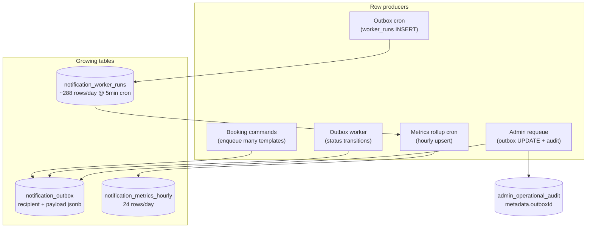
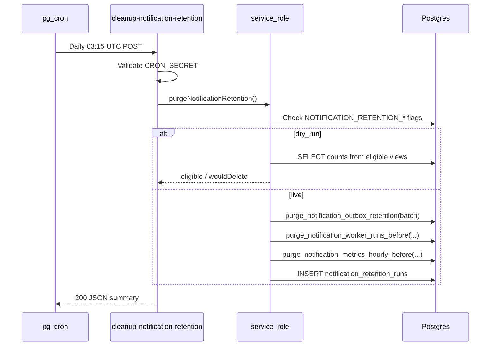
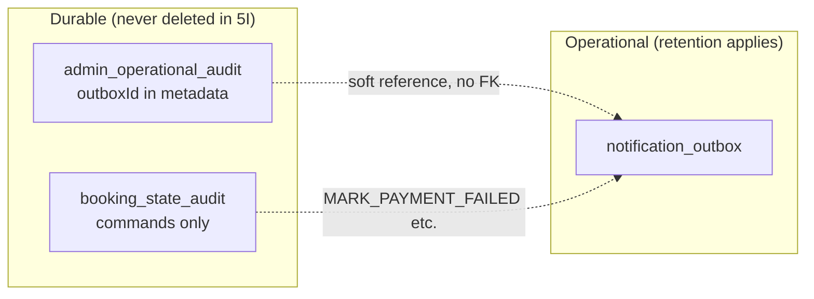

# Stage 5I — Notification Retention & Cleanup Design

**Date:** 2026-05-17  
**Status:** Design only — **no implementation**  
**Depends on:** [stage-5c-2b-notification-worker-queue-reachability-design.md](./stage-5c-2b-notification-worker-queue-reachability-design.md), [stage-5d-notification-admin-observability-design.md](./stage-5d-notification-admin-observability-design.md), [stage-5e-notification-retry-resend-governance-design.md](./stage-5e-notification-retry-resend-governance-design.md), [stage-5f-notification-outbox-rls-tightening-design.md](./stage-5f-notification-outbox-rls-tightening-design.md), [stage-5g-notification-worker-run-logging-cron-health-design.md](./stage-5g-notification-worker-run-logging-cron-health-design.md), [stage-5h-notification-analytics-metrics-design.md](./stage-5h-notification-analytics-metrics-design.md), [stage-5h-b-notification-hourly-rollups-7-day-trends-design.md](./stage-5h-b-notification-hourly-rollups-7-day-trends-design.md), [notification-outbox-worker.md](../operations/notification-outbox-worker.md)

**Goal:** Design safe retention, cleanup, and archival policy for notification operational tables without changing delivery, requeue, worker behavior, or RLS in this stage.

**Hard constraints (this stage):**

- Design only — no migrations, app code, cron routes, or data deletion.
- Do **not** change `processNotificationOutbox`, reclaim, dedupe, or requeue helpers.
- Do **not** change RLS policies on existing tables (cleanup grants/functions are a later migration).
- Do **not** delete or mutate production data during design.

---

## Executive summary

| Question | Recommendation |
|----------|----------------|
| 1. `notification_outbox` retention | **Tiered by status + deliverability** — see retention matrix (§3) |
| 2. `notification_worker_runs` retention | **90 days** hot store; delete after rollups exist for affected hours |
| 3. `notification_metrics_hourly` retention | **13 months** (aligns with 5H-b) |
| 4. Delete vs archive vs compact | **Delete** in-app for ops tables; rollups **compact** worker history; optional **cold export** later |
| 5. Rows never deleted (audit linkage) | **Active queue rows**; optional **30-day post-requeue shield**; **never** delete `admin_operational_audit` |
| 6. Shorter retention for sent/dry-run? | **Yes** — terminal `sent` (especially dry-run) shorter than actionable `failed` |
| 7. Failed until resolved? | **Yes** — retain deliverable `failed` until status changes or **365d cap** |
| 8. Unsupported `pending`? | **Yes, separate long retention** (180d) — informational purge, not failure cleanup |
| 9. Metrics longer than worker runs? | **Yes** — 13 months vs 90 days |
| 10. Cleanup cron | **Daily** dedicated HTTP route + Supabase `pg_cron` (off-peak UTC) |
| 11. Safety guards | Kill-switch, batch caps, dry-run, rollup prerequisite, exclusion SQL |
| 12. Dry-run first? | **Mandatory** for rollout — counts-only mode before any DELETE |
| 13. Admin visibility | Eligibility summary + last cleanup run on `/admin/notifications` |
| 14. RLS / service role | **SECURITY DEFINER** purge functions; `service_role` only; no admin JWT DELETE |
| 15. Rollback after cleanup | **No row-level undelete** — rely on PITR/backups; audit rows remain |

**Safest first implementation slice:** **5I-α — dry-run eligibility reporter only** (counts per tier, no DELETE), then **5I-β — `notification_metrics_hourly` purge only** (13 months, no append-only trigger, no PII).

---

## Context: tables and growth risks

### Operational tables (Stages 5C–5H)

| Table | Purpose | Append-only | PII risk | Write path |
|-------|---------|-------------|----------|------------|
| `notification_outbox` | Delivery queue + history | **No** | **High** (`recipient`, `payload`) | Service role (enqueue, worker, requeue) |
| `notification_worker_runs` | Cron batch telemetry | **Yes** (trigger) | Low (capped `errors` JSON) | Service role INSERT |
| `notification_metrics_hourly` | Hourly rollups for 7d trends | **No** | **None** | Service role upsert |
| `admin_operational_audit` | Human ops incl. `notification_requeue` | **Yes** | Medium (`reason` text) | Service role INSERT |
| `booking_state_audit` | Lifecycle commands | **Yes** | Low–medium | Command layer |

### Current growth risks



| Risk | Driver | Severity | Notes |
|------|--------|----------|-------|
| **Outbox table bloat** | Every booking lifecycle command can enqueue a row; unsupported templates stay `pending` forever | **High** | Dominated by `payload` + `recipient`; admin UI lists only 100 rows but DB holds full history |
| **Unsupported pending backlog** | `booking_draft_created`, `payment_pending`, etc. never drained by worker | **Medium** | Inflates “pending” counts; not failures but consume storage and confuse ops if unbounded |
| **Duplicate / dedupe drain rows** | Hotfix paths mark extra rows `sent` without send | **Medium** | Many terminal rows per booking for same template |
| **Worker runs volume** | 5-minute cron ≈ 288 inserts/day ≈ **8.6k/month** | **Low** | Small rows; append-only trigger blocks naive DELETE |
| **Hourly metrics volume** | 24 buckets/day ≈ **8.8k rows/year** | **Very low** | Fixed-width integers; long retention is cheap |
| **Admin audit immutability** | `notification_requeue` stores `metadata.outboxId` without FK | **Low** | Deleting outbox does not break audit; orphan UUID references acceptable after snapshot metadata |
| **Index churn** | `idx_notification_outbox_status_next_retry` | **Medium** | Large deletes should be batched to avoid long locks |
| **Analytics drift** | Purging worker runs before rollups backfilled | **Medium** | 7d trends read rollups, not raw runs — prerequisite checks required |
| **PII exposure in backups** | Outbox retention extends backup sensitivity window | **High** | Shorter terminal retention reduces blast radius |

### Order-of-magnitude sizing (planning)

Assumptions: ~100 bookings/day, ~6 enqueue events/booking, 5-minute worker cron.

| Dataset | Approx. daily new rows | ~90d rows | Row width |
|---------|------------------------|-----------|-----------|
| `notification_outbox` | 600–1,200 | 54k–108k | Large (jsonb + email) |
| `notification_worker_runs` | 288 | ~26k | Small |
| `notification_metrics_hourly` | 24 | ~2.2k | Tiny |

Outbox is the **primary disk and compliance** concern; worker runs are secondary; hourly metrics are negligible even at 13 months.

---

## Audit / design question answers

### 1. What retention should apply to `notification_outbox`?

**Tiered policy** — retention starts from `updated_at` (last state change), not `created_at`, so requeued rows get a fresh clock.

| Class | Status / shape | Retention | Auto-delete? |
|-------|----------------|-----------|--------------|
| **A — Active deliverable queue** | `pending` or `processing`, deliverable template | **Indefinite** | **Never** |
| **B — Actionable failed** | `failed`, deliverable, `attempts >= max` or terminal error | **Until resolved or 365d** | After cap only |
| **C — Terminal sent (live)** | `sent`, not dry-run (`last_error` not `dry_run_sent%`) | **90 days** | Yes |
| **D — Terminal sent (dry-run)** | `sent`, `dry_run_sent%` | **60 days** | Yes |
| **E — Terminal sent (dedupe skip)** | `sent`, dedupe path, no provider send | **90 days** | Yes (same as C) |
| **F — Unsupported pending** | `pending`, non-deliverable template | **180 days** | Yes (informational) |
| **G — Stale unsupported** | Same as F, `created_at` very old | **180 days** | Yes — ops runbook documents meaning |
| **H — Abandoned processing** | `processing`, `updated_at` older than reclaim window + 7d | **Do not delete** — fix via reclaim | Reclaim first; if still stuck, manual ops |

**Configurable env (implementation):** prefix `NOTIFICATION_RETENTION_OUTBOX_*` per class, with **staging shorter** than production for soak tests.

### 2. What retention should apply to `notification_worker_runs`?

| Parameter | Value |
|-----------|--------|
| Hot retention | **90 days** from `completed_at` |
| Prerequisite | Hourly bucket exists in `notification_metrics_hourly` for each UTC hour touched by runs being deleted (or hour is older than 7d live window + backfill complete) |
| Rationale | Matches 5G/5H ops guidance; raw runs needed for 24h **live** admin cards and rollup backfill |

### 3. What retention should apply to `notification_metrics_hourly`?

| Parameter | Value |
|-----------|--------|
| Retention | **13 months** from `bucket_start` |
| Rationale | 5H-b 7-day trends + YoY-ish comparison headroom; rows are PII-free |
| UI impact | Trends older than 13 months fall off — acceptable |

### 4. Should rows be deleted, archived, or compacted?

| Strategy | Tables | Recommendation |
|----------|--------|----------------|
| **Compact** | `notification_worker_runs` → `notification_metrics_hourly` | **Already designed** (5H-b rollups). Cleanup **deletes** raw runs after retention once rollups exist. |
| **Delete** | All three notification ops tables | **Default for Slice 1–3** — simplest, matches no cold-store infra today |
| **Archive (cold)** | `notification_outbox` (optional later) | **Defer** — export redacted CSV/Parquet to object storage if compliance requires multi-year proof of delivery |
| **Archive (in-DB)** | None | **Not recommended** — duplicate storage; outbox still holds PII |

**PII note:** Any future archive of outbox rows must **omit or hash** `recipient` and strip `payload` to allowlisted metadata (`template`, `bookingId`, `offerId`, status transitions).

### 5. Which rows must never be deleted while linked to admin requeue/audit?

| Rule | Detail |
|------|--------|
| **Never delete `admin_operational_audit`** | Append-only governance; cleanup does not touch this table |
| **Never delete `booking_state_audit`** | Indirect notification context only; unrelated to outbox cleanup |
| **Never delete active queue rows** | Classes A, B (until cap), H |
| **Requeue linkage** | `admin_operational_audit.metadata.outboxId` has **no FK** — forensic value lives in audit row (`template`, `oldStatus`, `resultCode`, `reason`) |
| **Optional shield (recommended)** | Do not delete outbox row if `notification_requeue` audit with `outcome IN ('success','idempotent')` references `outboxId` and audit `created_at` within **30 days** |
| **After shield expires** | Safe to delete terminal outbox if retention met — audit remains |

Rows that **must never be deleted solely because of audit**:

- Not required forever — audit is the durable record; outbox is operational cache.

### 6. Should sent/dry-run rows have shorter retention than failed/pending?

**Yes.**

| Status | Relative retention |
|--------|-------------------|
| `pending` / `processing` (deliverable) | Longest — indefinite |
| `failed` (deliverable) | Long — until resolved or 365d cap |
| `sent` live | Medium — 90d |
| `sent` dry-run | Shortest terminal — 60d |

### 7. Should failed rows be retained until resolved?

**Yes, with a maximum cap.**

| State | Policy |
|-------|--------|
| Deliverable `failed`, still actionable for requeue | **Retain** until status → `pending`/`sent` or admin resolves underlying issue |
| Deliverable `failed`, older than **365 days** | **Eligible for purge** — export audit trail already in `admin_operational_audit` / logs if requeued |
| `failed` with non-retryable error (worker marked terminal) | Same — ops may still want history; cap applies |

“Resolved” = `status` changed from `failed` OR row deleted after cap (document in runbook).

### 8. Should unsupported pending rows be cleaned or kept?

**Clean on a separate, longer informational schedule — do not conflate with failure cleanup.**

| Topic | Policy |
|-------|--------|
| Worker behavior | **Unchanged** — still never delivers unsupported templates |
| Ops meaning | Backlog of “enqueue-only” rows — not incidents |
| Retention | **180 days** from `created_at` (class F/G) |
| Preconditions | Exclude if booking still `draft`/`payment_pending` and created in last 30d (optional guard) |
| UI | Global health page already separates unsupported — post-purge counts should drop without affecting deliverable metrics |

### 9. Should `metrics_hourly` be retained longer than raw worker runs?

**Yes — 13 months vs 90 days.**

| Layer | Retention | Consumer |
|-------|-----------|----------|
| `notification_worker_runs` | 90d | 24h live worker cards, rollup input |
| `notification_metrics_hourly` | 13mo | 7d trends, future monthly ops review |

Deleting worker runs **must not** delete hourly buckets for the same period.

### 10. What cron should perform cleanup?

**Dedicated daily job** — separate from outbox worker and metrics rollup.

| Property | Value |
|----------|--------|
| Route | `POST /api/cron/cleanup-notification-retention` |
| Scheduler | Supabase `pg_cron` + `pg_net` HTTP (same pattern as [expire-assignment-offers-cron.md](../operations/expire-assignment-offers-cron.md)) |
| Schedule | **Daily 03:15 UTC** (after rollup at :05, outbox worker continuous) |
| Vault secret | `cleanup_notification_retention_cron_url` |
| Auth | `CRON_SECRET` Bearer |
| Execution order | (1) Verify flags → (2) outbox eligible batches → (3) worker_runs → (4) metrics_hourly |
| Batch size | Default **500** rows per table per run (`NOTIFICATION_RETENTION_BATCH_SIZE`) |

**Why not piggyback on outbox worker cron?**

- Avoid coupling delivery latency to purge work
- Failed purge must not block sends
- Different failure semantics and alerting

### 11. What safety guards are needed?

| Guard | Purpose |
|-------|---------|
| `NOTIFICATION_RETENTION_CLEANUP_ENABLED` | Master kill-switch (default `false`) |
| `NOTIFICATION_RETENTION_DRY_RUN` | When `true`, compute counts only |
| Per-table enable flags | `..._OUTBOX_ENABLED`, `..._RUNS_ENABLED`, `..._METRICS_ENABLED` |
| `NOTIFICATION_RETENTION_BATCH_SIZE` | Cap rows per DELETE statement |
| `NOTIFICATION_RETENTION_MAX_ROWS_PER_RUN` | Cap total deleted per invocation |
| Rollup coverage check | Before deleting worker runs, assert hourly bucket exists for each UTC hour in delete window (or hour < now() - 8d) |
| Exclusion predicates | Central SQL view `notification_outbox_retention_eligible` — single source of truth |
| Requeue shield | LEFT JOIN audit exclusion for 30d post-success requeue |
| Never delete `processing` younger than reclaim SLA + buffer | Default: 15m reclaim + 1d buffer |
| Structured logging | JSON event `notification_retention_cleanup` with counts, duration, dryRun |
| Fail-soft per table | Outbox failure does not skip metrics purge |
| Staging shorter TTLs | Env-specific overrides for soak |
| Migration: append-only bypass | `notification_worker_runs` DELETE only via `SECURITY DEFINER` function setting `app.retention_cleanup = on` checked by trigger |

### 12. Should cleanup be dry-run first?

**Yes — mandatory rollout discipline.**

| Phase | Behavior |
|-------|----------|
| Week 1 | `ENABLED=true`, `DRY_RUN=true` — daily counts only, ops compares to expectations |
| Week 2 | Enable **metrics_hourly** delete only, dry-run off for that table |
| Week 3+ | Enable worker_runs, then outbox tiers incrementally |

Dry-run response shape (for cron JSON body):

```json
{
  "dryRun": true,
  "eligible": {
    "outbox": { "sentLive": 120, "sentDryRun": 45, "unsupportedPending": 300, "failedExpired": 0 },
    "workerRuns": 8200,
    "metricsHourly": 0
  },
  "wouldDelete": { "outbox": 0, "workerRuns": 0, "metricsHourly": 0 },
  "excluded": { "activeQueue": 12, "requeueShield": 2 }
}
```

### 13. What admin visibility is needed before/after cleanup?

**Read-only panel on `/admin/notifications`** (no cron trigger from UI).

| Element | Source | When |
|---------|--------|------|
| **Eligibility snapshot** | Query `notification_outbox_retention_eligible` aggregates + counts | Always visible |
| **Retention policy summary** | Static copy from env/config | Always |
| **Last cleanup run** | New append-only `notification_retention_runs` (Slice 2) or structured logs | After 5I-γ |
| **Before/after delta** | Compare `eligible` vs `deleted` from last run | After cleanup enabled |
| **Trends footnote** | “Hourly metrics retained 13 months; worker detail 90 days” | Near 7d trends |
| **Unsupported pending** | Show count separately — purges must not imply delivery failures | Always |

**Do not expose:** `recipient`, raw `payload`, or per-row delete buttons in Slice 1.

### 14. What RLS/service-role pattern should cleanup use?

| Layer | Pattern |
|-------|---------|
| **Caller** | Cron route → `createServiceRoleClient()` **or** Postgres `SECURITY DEFINER` function invoked from SQL cron |
| **Admin JWT** | **No** DELETE/UPDATE on ops tables |
| **RLS** | Unchanged on existing tables; service role bypasses RLS |
| **Grants** | Do **not** grant broad `DELETE` to `service_role` on append-only tables |
| **Purge API** | `public.purge_notification_worker_runs_before(timestamptz, batch int)` — SECURITY DEFINER, revokes PUBLIC, sets session flag, DELETE in batches |
| **Outbox purge** | `public.purge_notification_outbox_retention(batch int)` — reads eligible view |
| **Metrics purge** | `public.purge_notification_metrics_hourly_before(timestamptz)` — simple DELETE |
| **Audit trail** | Optional INSERT into `notification_retention_runs` via service role |

Authenticated admins retain **SELECT-only** on outbox, worker runs, and metrics (current policies).

### 15. What rollback/recovery is possible after cleanup?

| Scenario | Recovery |
|----------|----------|
| Rows deleted | **No in-app undelete** — restore from Supabase PITR / backup if within RPO |
| Wrong tier deleted | Post-mortem via `notification_retention_runs` + logs; tighten exclusions |
| Analytics gap | Re-backfill hourly rollups from remaining worker runs if still within 90d; otherwise gap permanent for fine-grained history |
| Audit | `admin_operational_audit` unaffected — still shows requeue actions |
| Booking forensics | `booking_state_audit` + `listNotificationsForBooking` may show fewer rows — acceptable after retention |

**Pre-delete checklist (ops):** confirm dry-run counts stable 3 days; confirm 7d trends `rollupCoverageHours` healthy; snapshot row counts.

---

## Retention policy matrix

| Table | Segment | Retention anchor | Duration | Action | Prerequisite |
|-------|---------|------------------|----------|--------|--------------|
| `notification_outbox` | Active deliverable `pending`/`processing` | — | ∞ | **Keep** | — |
| `notification_outbox` | Deliverable `failed` | `updated_at` | Until resolved, max **365d** | Delete | Not in 30d requeue shield |
| `notification_outbox` | Live `sent` | `updated_at` | **90d** | Delete | — |
| `notification_outbox` | Dry-run `sent` | `updated_at` | **60d** | Delete | — |
| `notification_outbox` | Unsupported `pending` | `created_at` | **180d** | Delete | Optional: active draft booking guard |
| `notification_worker_runs` | All runs | `completed_at` | **90d** | Delete | Hourly rollup exists for that UTC hour |
| `notification_metrics_hourly` | All buckets | `bucket_start` | **13 months** | Delete | None |
| `admin_operational_audit` | All | — | ∞ | **Keep** | Never purge in 5I |
| `booking_state_audit` | All | — | ∞ | **Keep** | Out of scope |

### Environment overrides (staging)

| Variable | Production default | Staging suggestion |
|----------|-------------------|-------------------|
| `NOTIFICATION_RETENTION_OUTBOX_SENT_DAYS` | 90 | 14 |
| `NOTIFICATION_RETENTION_OUTBOX_DRY_RUN_SENT_DAYS` | 60 | 7 |
| `NOTIFICATION_RETENTION_OUTBOX_UNSUPPORTED_PENDING_DAYS` | 180 | 30 |
| `NOTIFICATION_RETENTION_OUTBOX_FAILED_MAX_DAYS` | 365 | 90 |
| `NOTIFICATION_RETENTION_WORKER_RUNS_DAYS` | 90 | 30 |
| `NOTIFICATION_RETENTION_METRICS_MONTHS` | 13 | 3 |

---

## Deletion vs archival recommendation

| Approach | Verdict | When |
|----------|---------|------|
| **In-DB DELETE (batched)** | **Primary** | 5I-β through 5I-δ |
| **Hourly rollups as long-term telemetry** | **Keep** | Already PII-free; 13mo |
| **S3 / export archive** | **Optional Phase 2** | Regulatory retention > 90d for proof of delivery |
| **Anonymize-in-place** | **Alternative to delete** | If delete blocked — `recipient := '[redacted]'`, `payload := '{}'` then retain shell row (more complex; defer) |

**Recommendation:** Implement **batched DELETE** with dry-run and eligibility view. Defer archival exports until a compliance review requires multi-year delivery proof.

---

## Cleanup cron design



### Eligibility view (design)

```sql
-- Conceptual — implementation in 5I-β+
create view public.notification_outbox_retention_eligible as
select
  o.id,
  o.status,
  o.updated_at,
  o.created_at,
  o.last_error,
  (payload->>'template') as template,
  case
    when o.status in ('pending', 'processing')
      and public.is_deliverable_outbox_row(o.channel, o.payload) then 'exclude_active'
    when exists (
      select 1 from public.admin_operational_audit a
      where a.action = 'notification_requeue'
        and a.outcome in ('success', 'idempotent')
        and a.metadata->>'outboxId' = o.id::text
        and a.created_at > now() - interval '30 days'
    ) then 'exclude_requeue_shield'
    when o.status = 'failed'
      and public.is_deliverable_outbox_row(o.channel, o.payload)
      and o.updated_at > now() - interval '365 days' then 'exclude_failed_active'
  -- ... tier predicates for sent / unsupported ...
  end as retention_class
from public.notification_outbox o;
```

Deliverability should mirror `isDeliverableNotificationRow` / worker SQL allowlist.

### Append-only bypass for worker runs (design)

`notification_worker_runs` uses `forbid_admin_operational_audit_mutation()` on UPDATE/DELETE.

**Implementation approach (5I-γ):**

1. Replace trigger function with `forbid_notification_worker_runs_mutation()` that allows DELETE when `current_setting('app.notification_retention_cleanup', true) = 'on'`.
2. `purge_notification_worker_runs_before()` sets `set_config('app.notification_retention_cleanup', 'on', true)` inside SECURITY DEFINER transaction.
3. Only that function has EXECUTE granted to `service_role`.

---

## Dry-run mode

| Aspect | Design |
|--------|--------|
| Env | `NOTIFICATION_RETENTION_DRY_RUN=true` |
| HTTP | `?dry_run=1` only if env also allows (prevent prod accidents via query string alone) |
| Output | Counts by `retention_class` and table |
| Side effects | **Zero** DELETE; optional INSERT into `notification_retention_runs` with `dry_run=true` |
| Ops workflow | Compare daily dry-run JSON in logs for 7 days before enabling deletes |

---

## Safety exclusions (consolidated)

Never eligible for automated DELETE:

1. `notification_outbox.status IN ('pending', 'processing')` for deliverable rows  
2. `notification_outbox.status = 'failed'` deliverable with `updated_at` within failed max window **unless** explicitly past cap  
3. Rows under **30-day requeue shield** (successful/idempotent audit)  
4. `processing` rows within reclaim SLA + buffer (force reclaim path first)  
5. Any table under master kill-switch `NOTIFICATION_RETENTION_CLEANUP_ENABLED=false`  
6. `admin_operational_audit`, `booking_state_audit`  
7. Hours of worker runs where `notification_metrics_hourly` bucket missing and hour within last **8 days** (rollup lag buffer)

---

## Audit interaction



| Interaction | Behavior |
|-------------|----------|
| `notification_requeue` success | Audit stores `outboxId`, template, statuses — **sufficient after outbox purge** |
| Rejected requeue | No shield; row follows normal retention |
| `booking_state_audit` | Payment-failed email context from audit, not outbox — **unaffected** |
| Idempotency key on audit | `notification_requeue:{outboxId}:...` — historical reference only |

**Rule:** Cleanup **never** mutates audit tables. Optional future **5I-e** could add `metadata.purgedAt` via new audit action — **out of scope**.

---

## Admin visibility proposal

### Slice 1 (with dry-run)

| UI block | Content |
|----------|---------|
| Retention policy | Human-readable table of tiers and durations |
| Eligibility counts | Cards: `sentLiveEligible`, `sentDryRunEligible`, `unsupportedEligible`, `failedExpiredEligible`, `excludedActive` |
| Last dry-run | Timestamp + JSON summary from logs (manual) |

### Slice 2 (with live cleanup)

| UI block | Content |
|----------|---------|
| Last cleanup run | From `notification_retention_runs`: `completed_at`, `dry_run`, per-table `deleted_count`, `duration_ms` |
| Health footnote | Under 7d trends: “Worker run detail: 90 days; hourly trends: 13 months” |

### `notification_retention_runs` table (optional, 5I-γ)

| Column | Type | Notes |
|--------|------|-------|
| `id` | uuid | PK |
| `completed_at` | timestamptz | |
| `dry_run` | boolean | |
| `outbox_deleted` | integer | |
| `worker_runs_deleted` | integer | |
| `metrics_deleted` | integer | |
| `excluded_counts` | jsonb | Snapshot |
| `error_summary` | text null | |

Admin SELECT only; service role INSERT — same pattern as worker runs.

---

## Test plan (implementation phase)

| Test | Scope |
|------|-------|
| Eligibility unit | Fixture rows per tier → expected class / exclude |
| Dry-run integration | Cron route returns counts; **zero** row count change |
| Requeue shield | Success audit within 30d → row not eligible |
| Failed cap | `failed` older than 365d → eligible |
| Unsupported pending | 181d old non-deliverable → eligible; deliverable pending → not |
| Worker runs purge | Append-only bypass only inside purge function; direct DELETE still fails |
| Rollup prerequisite | Run without bucket → worker run not deleted |
| Metrics purge | Bucket older than 13mo deleted; 12mo kept |
| RLS negative | Authenticated admin cannot DELETE on all three tables |
| Batch limit | 10k eligible → only `BATCH_SIZE` deleted per run |
| Staging env | Shorter TTL env vars honored |
| UI smoke | Eligibility cards render; no PII fields |

SQL catalog: `supabase/tests/notification_retention_phase5i_checks.sql` (planned).

---

## Phased implementation plan

| Slice | Deliverable | Risk | Depends on |
|-------|-------------|------|------------|
| **5I-α** | Dry-run cron + eligibility view + admin counts | **Lowest** | None |
| **5I-β** | `notification_metrics_hourly` DELETE (13mo) + `notification_retention_runs` log | Low | 5H-b rollups stable |
| **5I-γ** | Worker runs purge + trigger bypass migration | Medium | Rollup coverage check |
| **5I-δ** | Outbox tiered purge (sent → unsupported → failed cap) | **Highest** | 5I-α soak complete |
| **5I-ε** (optional) | Cold archive export before outbox delete | Low | Compliance need |

**Deploy order:** α → β → γ → δ. Enable production deletes one table at a time with dry-run parity checks.

---

## Final recommendation

1. **Adopt tiered DELETE policies** in the matrix above; do not use one global TTL for `notification_outbox`.  
2. **Treat hourly metrics as the long-term telemetry layer** (13 months); purge raw worker runs at 90 days only after rollup coverage checks.  
3. **Never auto-delete active deliverable queue rows** or recent post-requeue rows (30-day shield).  
4. **Purge unsupported pending separately** with clear ops labeling so it is not confused with failure resolution.  
5. **Roll out with mandatory dry-run** and per-table enable flags; start with metrics-only deletes.  
6. **Implement purge via SECURITY DEFINER functions**, not ad-hoc service-role DELETE from scattered code.  
7. **Keep `admin_operational_audit` immutable** — it remains the durable record when outbox rows are gone.

---

## Safest first Stage 5I implementation slice

**5I-α: Dry-run eligibility reporter only**

| Includes | Excludes |
|----------|----------|
| `notification_outbox_retention_eligible` view (or query module) | Any DELETE |
| `GET/POST /api/cron/cleanup-notification-retention` with `DRY_RUN=true` | Append-only trigger changes |
| Admin eligibility count cards on `/admin/notifications` | Outbox / worker_runs purge |
| Structured logs + JSON response | `notification_retention_runs` table (optional) |
| Ops doc in `docs/operations/` | RLS changes |

**Why this is safest:** Validates classification SQL against real data, gives ops visibility into what *would* be removed, and touches no append-only triggers or PII deletion paths. The first **destructive** slice should be **5I-β (`notification_metrics_hourly` only)** — no recipient data, no audit shield logic, no worker-run trigger bypass, aligned with 5H-b deferred “5H-e purge” intent.

---

## Code locations (planned)

| Piece | Path |
|-------|------|
| Design | `docs/architecture/stage-5i-notification-retention-cleanup-design.md` |
| Migration (view + functions) | `supabase/migrations/20260519xxxxxx_notification_retention_cleanup.sql` |
| Purge service | `src/features/notifications/server/purgeNotificationRetention.ts` |
| Eligibility | `src/features/notifications/server/notificationOutboxRetention.ts` |
| Cron route | `src/app/api/cron/cleanup-notification-retention/route.ts` |
| Admin read model | `notificationAdminReadModel.ts` — `loadNotificationRetentionEligibility()` |
| UI | `AdminNotificationRetentionPanel.tsx` |
| Ops doc | `docs/operations/notification-retention-cleanup-cron.md` |
| SQL tests | `supabase/tests/notification_retention_phase5i_checks.sql` |

---

## Related deferred work

| Item | Stage |
|------|-------|
| Hourly outbox queue snapshots | 5H-b-γ |
| Cold archive export | 5I-ε |
| Per-template retention overrides | Post-5I |
| Customer-visible delivery history | Out of scope — booking audit only |
