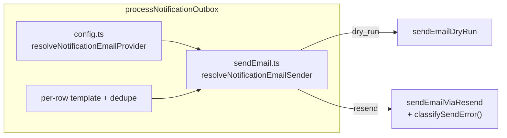
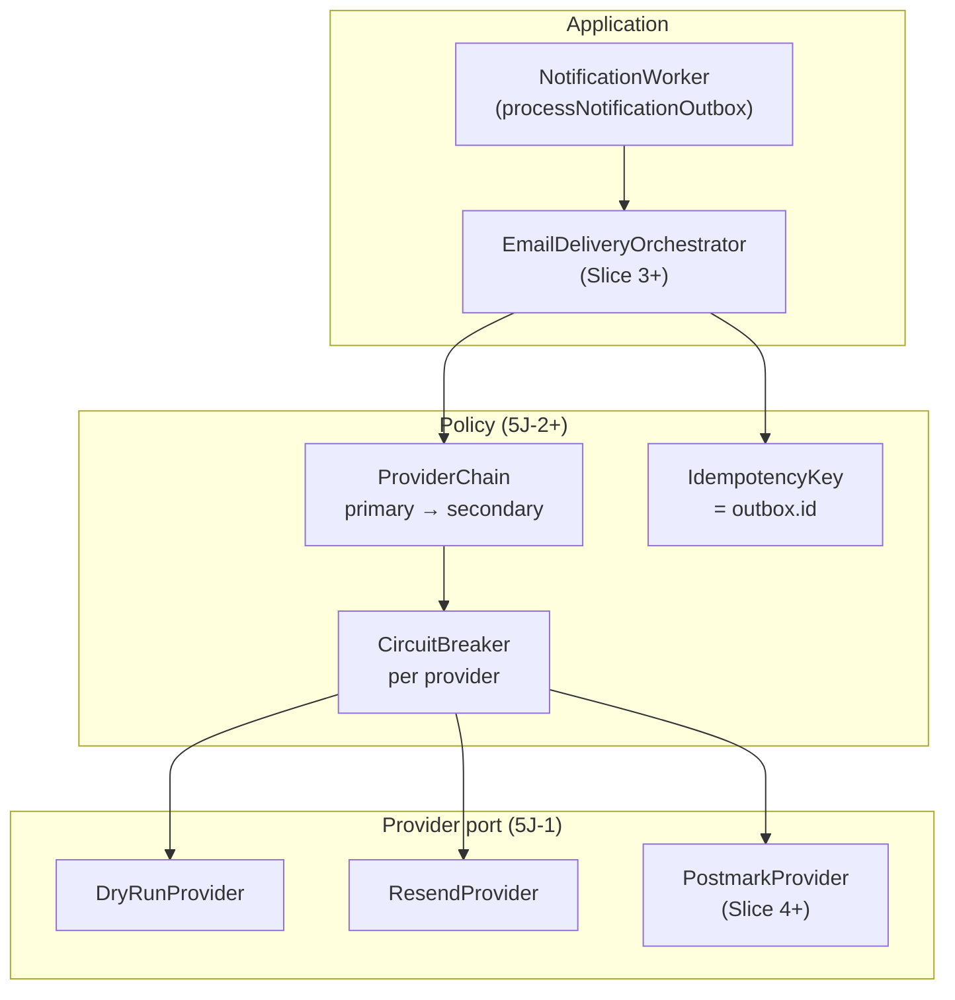
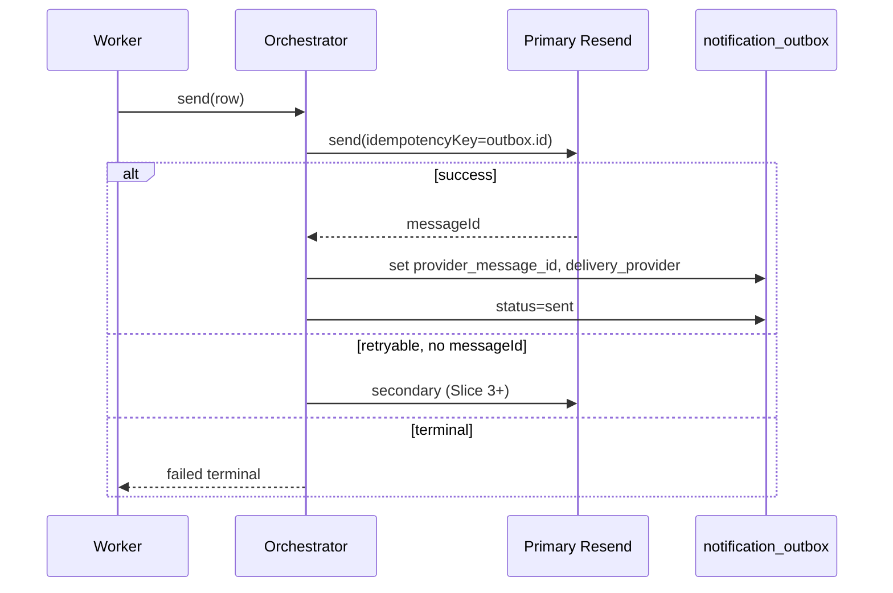

# Stage 5J — Notification Provider Abstraction & Failover Design

**Date:** 2026-05-17  
**Status:** Design — **5J-1a implemented** (provider port refactor only; failover deferred)  
**Depends on:** [stage-5c-2b-notification-worker-queue-reachability-design.md](./stage-5c-2b-notification-worker-queue-reachability-design.md), [stage-5d-2-global-notification-health-page-design.md](./stage-5d-2-global-notification-health-page-design.md), [stage-5e-notification-retry-resend-governance-design.md](./stage-5e-notification-retry-resend-governance-design.md), [stage-5g-notification-worker-run-logging-cron-health-design.md](./stage-5g-notification-worker-run-logging-cron-health-design.md), [stage-5h-notification-analytics-metrics-design.md](./stage-5h-notification-analytics-metrics-design.md), [notification-outbox-worker.md](../operations/notification-outbox-worker.md)

**Goal:** Design a safer long-term **email provider layer** for `dry_run`, `resend`, and future **Postmark / failover** — without changing delivery behavior, worker semantics, requeue, or RLS in this stage.

**Hard constraints (this stage):**

- Design only — no migrations, app code, or env changes.
- Do **not** add Postmark SDK or live failover yet.
- Do **not** change `processNotificationOutbox` claim/send/dedupe/reclaim behavior.
- Do **not** change admin requeue (5E) or outbox / worker-run RLS.
- Do **not** store provider API bodies, recipient emails, or raw payloads in new tables.

---

## Executive summary

| # | Question | Recommendation |
|---|----------|----------------|
| 1 | Add Postmark as backup? | **Yes, later** — secondary transactional provider after abstraction + idempotency; not in Slice 1 |
| 2 | Provider priority | **Primary → secondary chain** for live send; `dry_run` is a **mode**, never in the chain |
| 3 | Avoid duplicate sends on failover | **Outbox-scoped idempotency key** + persist `provider` / `provider_message_id` before marking `sent`; failover only when primary has **no accepted send** |
| 4 | Retryable vs terminal | **Structured `ProviderFailureKind`** per provider; worker retry backoff unchanged; failover only on **transient / provider-outage** kinds |
| 5 | Admin provider health | **Provider health strip** on `/admin/notifications` — config + last-run signals + circuit state (no live provider ping in Slice 1) |
| 6 | Keep `dry_run` first-class? | **Yes** — explicit env mode, separate metrics, never auto-failover target |
| 7 | Env vars | See § Environment variables |
| 8 | Tests | Port contract, classifier tables, orchestrator mocks, regression on dedupe — no real provider APIs |
| — | **Safest first slice** | **5J-1a:** Behavior-preserving provider port + shared failure taxonomy + tests — **no Postmark, no failover, no schema** |

### 5J-1a implementation status (shipped)

| Item | Path |
|------|------|
| Provider types + port | `src/features/notifications/server/notificationEmailProviderTypes.ts` |
| Failure classification | `src/features/notifications/server/classifyProviderFailure.ts` |
| `DryRunProvider` | `src/features/notifications/server/dryRunProvider.ts` |
| `ResendProvider` | `src/features/notifications/server/resendProvider.ts` |
| Factory | `src/features/notifications/server/notificationEmailProviderFactory.ts` |
| Public re-exports | `src/features/notifications/server/sendEmail.ts` |
| Readiness | `providerReady` uses Resend key only (Postmark token ignored until 5J-4) |

---

## Current provider layer (as of Stage 5I)

### Architecture today



| Piece | Path | Behavior |
|-------|------|----------|
| Provider enum | `config.ts` | `NotificationEmailProvider = "dry_run" \| "resend"` |
| Resolution | `resolveNotificationEmailProvider()` | Explicit env, else Resend-if-configured, prod → `resend`, else `dry_run` |
| Send port | `sendEmail.ts` | `EmailSender` = `(params) => Promise<SendEmailResult>` |
| Result shape | `SendEmailResult` | `{ ok, messageId }` or `{ ok: false, error, retryable }` |
| Classification | `classifySendError()` in `sendEmail.ts` | String heuristics on Resend errors only |
| Worker injection | `processNotificationOutbox(client, { emailSender? })` | Defaults to `resolveNotificationEmailSender()` once per batch |
| Outbox persistence | `notification_outbox` | **No** `provider`, **no** `message_id` columns — only `last_error`, `status`, `attempts` |
| `providerReady` | `getNotificationDeliveryConfig()` | `dry_run` always ready; live needs `NOTIFICATION_FROM_EMAIL` + (`RESEND_API_KEY` **or** `POSTMARK_SERVER_TOKEN`) |
| Postmark | — | Token counted for readiness; **not wired** to send (audit note in 5C-1) |

### Gaps (motivation for 5J)

| Gap | Risk |
|-----|------|
| Single provider per process | Resend outage → all rows retry until exhausted |
| No circuit breaker | Thundering herd against failing API |
| No provider health surface | Admins see “provider not ready” but not **degraded / failing / failover active** |
| Ad-hoc `retryable` boolean | Inconsistent failover vs row-retry decisions |
| No send lineage on outbox | Failover or crash after accept → **duplicate email** risk |
| `POSTMARK_SERVER_TOKEN` in readiness | Misconfiguration: “ready” without a working sender |

### What must not regress

| Invariant | Source |
|-----------|--------|
| Template dedupe (`hasSent*`) | Marks duplicate rows `sent` without second send |
| Max attempts + exponential backoff | `NOTIFICATION_MAX_ATTEMPTS`, `NOTIFICATION_RETRY_BASE_MINUTES` |
| Dry-run preview mode | `NOTIFICATION_DRY_RUN_MARK_SENT=false` leaves row `pending` |
| 5E requeue | Does not bypass dedupe; no duplicate live send from requeue alone |
| 5F / 5G RLS | Service-role writes only for worker + requeue |

---

## Target architecture

### Layered model



**Principles:**

1. **Worker stays dumb about vendors** — it calls one orchestrator that returns the same `SendEmailResult` shape (extended with optional metadata).
2. **`dry_run` is not failover** — it replaces the entire live chain when selected.
3. **Failover is synchronous within one claim** — try secondary only in the same processing attempt after primary failure; do not leave row `processing` across providers.
4. **Row-level dedupe remains authoritative** for business duplicates; provider layer prevents **transport** duplicates.

---

## Design questions

### 1. Should Postmark be added as backup provider?

**Yes — as a secondary transactional provider in a later slice, not in 5J-1.**

| Criterion | Postmark as backup |
|-----------|-------------------|
| Resend outage / rate limit | Good fit — independent API and reputation |
| Same From domain | Requires domain verification on **both** providers before failover is safe |
| Operational cost | Second secret, second dashboard, bounce/suppression split |
| Alternative | Queue pause + alert only — simpler but no delivery during outage |

**Recommendation:** Add Postmark **after**:

- Provider port + failure taxonomy (5J-1a)
- Outbox send lineage columns (5J-2)
- Circuit breaker on primary (5J-1b)

**Do not** enable Postmark via `POSTMARK_SERVER_TOKEN` alone until `PostmarkProvider` exists — tighten readiness in the same slice that wires send (see § Environment variables).

**Not recommended:** Parallel dual-send (both providers) for “reliability” — guarantees duplicates.

---

### 2. How should provider priority work?

**Live sending:** ordered **provider chain** configured by env.

| Mode | Chain |
|------|-------|
| `NOTIFICATION_EMAIL_PROVIDER=dry_run` | `[DryRunProvider]` only |
| Live (default prod) | `[ResendProvider, PostmarkProvider?]` — secondary omitted if not configured |
| Explicit override (optional) | `NOTIFICATION_EMAIL_PROVIDER_CHAIN=resend,postmark` |

**Priority rules:**

| Rule | Detail |
|------|--------|
| Primary | First configured live provider (default **Resend**) |
| Secondary | Used only when orchestrator invokes failover (see §3) |
| `dry_run` | Never appended to chain; selecting `dry_run` skips live providers entirely |
| Per-template priority | **Defer** — all templates share chain in 5J; special cases add complexity without current need |
| Worker run snapshot | Continue `notification_worker_runs.email_provider` as **mode** (`dry_run` / `resend`) in 5J-1; extend later with `provider_chain`, `failover_count` JSON if needed |

**Config resolution (target):**

```
resolveEmailDeliveryMode() → "dry_run" | "live"
resolveLiveProviderChain() → ["resend"] | ["resend", "postmark"]  // when Postmark configured
```

Existing `resolveNotificationEmailProvider()` remains the **mode** selector until chain is implemented; avoid breaking analytics that bucket on `dry_run` vs `resend`.

---

### 3. How should failover avoid duplicate sends?

Duplicate risk appears when:

1. Primary **accepts** message (HTTP 2xx / message id) but worker **crashes** before `status = sent`.
2. Primary times out — unknown whether send completed.
3. Row is **reclaimed** from `processing` and retried while primary actually sent.
4. Failover tries secondary after primary already delivered.

**Strategy (defense in depth):**

| Layer | Mechanism |
|-------|-----------|
| **Idempotency key** | Stable per outbox row: `notification:{outboxId}` passed to Resend/Postmark idempotency headers (provider-specific) |
| **Persist accept before `sent`** | New columns (Slice 2): `delivery_provider`, `provider_message_id`, `provider_accepted_at` — written when provider returns success, **in same transaction path** as status update (or immediately before `markOutboxSent`) |
| **Failover gate** | Secondary called **only if** `provider_message_id` is null for this attempt **and** primary failure is `retryable` + `failoverEligible` |
| **Ambiguous timeout** | Treat as **retryable** for row backoff; **do not** failover until idempotency replay on primary returns definitive status (provider-specific “get message” deferred to Slice 4+) |
| **Business dedupe** | Unchanged — `hasSentPaymentConfirmedForBooking`, etc. |
| **Requeue (5E)** | Unchanged — does not clear `provider_message_id` in Slice 1–2; later “force resend” must clear lineage explicitly with audit |



**Explicit non-goal:** Cross-provider dedupe by subject/recipient hash — too fragile; idempotency + lineage is sufficient.

---

### 4. What failures are retryable vs terminal?

Replace boolean `retryable` with structured classification; map to worker actions:

| `ProviderFailureKind` | Row retry (backoff) | Failover to secondary | Circuit breaker |
|----------------------|---------------------|------------------------|-----------------|
| `rate_limited` | Yes | No (same provider after backoff) | Count failure |
| `provider_timeout` | Yes | Yes if no `messageId` | Count failure |
| `provider_5xx` | Yes | Yes if no `messageId` | Count failure |
| `provider_outage` (connection) | Yes | Yes if no `messageId` | Count failure |
| `invalid_recipient` | No → `failed` | No | No |
| `domain_not_verified` | No → `failed` | No | No |
| `content_rejected` | No → `failed` | No | No |
| `auth_configuration` (missing key) | No → `failed` | No | No |
| `idempotency_conflict` | Treat as **success** if id maps to sent | No | No |

**Provider-specific mapping (design targets):**

| Signal | Resend (indicative) | Postmark (indicative) |
|--------|---------------------|------------------------|
| Rate limit | 429 / “rate limit” | 429 / ErrorCode 506 |
| 5xx | API 5xx | 500/503 |
| Invalid email | 422 validation | ErrorCode 300 |
| Domain | “not verified” | 400 signature/domain |
| Auth | 401/403 | 401 |

**Worker mapping (unchanged semantics):**

- `retryable: true` on `SendEmailResult` ← any kind in {rate_limited, provider_timeout, provider_5xx, provider_outage}
- `retryable: false` ← terminal kinds
- **Failover** ← subset: {provider_timeout, provider_5xx, provider_outage} **and** circuit open on primary (Slice 3)

Keep `classifySendError` string heuristics as **fallback** only; prefer HTTP status + provider error codes when available.

**Non-retryable business failures** (existing, not provider): `NO_EMAIL`, `INVALID_PAYLOAD`, `BOOKING_NOT_FOUND` — remain terminal without provider call.

---

### 5. How should provider health be shown in `/admin/notifications`?

Extend existing banner + worker health — **read-only**, no “test send” button.

**Proposed “Email providers” card** (below delivery banner or merged):

| Field | Source (Slice 1) | Source (Slice 2+) |
|-------|------------------|-------------------|
| Mode | `dry_run` / `live` | same |
| Primary | env + configured? | same |
| Secondary | hidden until Postmark slice | configured? / omitted |
| Primary circuit | — | `closed` / `open` / `half-open` + `open until` |
| Last primary success | — | from worker run aggregates or `notification_provider_health` |
| Last primary failure kind | — | safe code only, no message body |
| Failover events (24h) | — | count from worker run metadata |
| Action hint | Link runbook | “Check Resend status page” / “Postmark backup active” |

**Slice 1 (no new table):** Extend banner model:

- `primaryProvider: "resend" | null`
- `secondaryProvider: "postmark" | null` (display “not configured”)
- `providerReady: boolean` (per provider, not OR of tokens)
- `readinessWarning?: string` — e.g. Postmark token set but Resend missing and chain is Resend-only

**Do not:** call Resend/Postmark APIs from the admin page (SSR with admin JWT) — secrets must not leave worker/cron context; optional **cron-side probe** in Slice 4+ writing sanitized health rows.

**Analytics (5H):** Add optional `failover_count` / `secondary_send_count` to hourly rollups in a later slice; keep `dry_run` metrics separate.

---

### 6. Should `dry_run` remain first-class?

**Yes.** It is a **delivery mode**, not a stub provider to delete.

| Requirement | Detail |
|-------------|--------|
| Explicit env | `NOTIFICATION_EMAIL_PROVIDER=dry_run` |
| Default non-prod | Unconfigured Resend → `dry_run` (preserve current behavior) |
| Preview-only | `NOTIFICATION_DRY_RUN_MARK_SENT=false` — row stays `pending`, `last_error` metadata |
| Metrics | `dry_run` counter on worker runs; never counted as live send failure |
| Failover | **Never** chain to Resend/Postmark when mode is `dry_run` |
| Tests | All existing `processNotificationOutbox` dry_run tests remain golden |

`DryRunProvider` implements the same port as Resend but **never** increments circuit breakers or failover counters.

---

### 7. What env vars are needed?

#### Existing (keep)

| Variable | Purpose |
|----------|---------|
| `ENABLE_NOTIFICATION_DELIVERY` | Master gate |
| `NOTIFICATION_EMAIL_PROVIDER` | `dry_run` \| `resend` (mode / primary selector until chain exists) |
| `NOTIFICATION_FROM_EMAIL` | From address (all live providers) |
| `NOTIFICATION_SUPPORT_EMAIL` | Template copy |
| `RESEND_API_KEY` | Resend auth |
| `NOTIFICATION_DRY_RUN_MARK_SENT` | Preview vs mark sent |
| `NOTIFICATION_PROCESSING_STALE_MINUTES` | Reclaim threshold |
| `APP_BASE_URL` | Link generation |

#### New (design — implement in slices)

| Variable | Slice | Purpose |
|----------|-------|---------|
| `NOTIFICATION_EMAIL_PROVIDER_CHAIN` | 3 | e.g. `resend,postmark` — ordered live chain |
| `POSTMARK_SERVER_TOKEN` | 4 | Postmark send (already referenced for readiness — **tighten**) |
| `POSTMARK_MESSAGE_STREAM` | 4 | Optional stream (default `outbound`) |
| `NOTIFICATION_PROVIDER_FAILOVER_ENABLED` | 3 | `true` / `false` — default `false` until lineage shipped |
| `NOTIFICATION_PROVIDER_CIRCUIT_FAILURE_THRESHOLD` | 2 | Failures before open (default `5`) |
| `NOTIFICATION_PROVIDER_CIRCUIT_OPEN_SECONDS` | 2 | Cooldown (default `300`) |
| `NOTIFICATION_PROVIDER_PRIMARY_PROBE_ENABLED` | 4+ | Optional cron health probe |

**Readiness rule change (when Postmark ships):** `providerReady` for live mode = `fromEmail` + **at least one configured provider in the active chain**, not `resend OR postmark` unless that provider is in the chain.

---

### 8. What tests are required?

| Area | Tests |
|------|-------|
| **Port contract** | Each provider returns `SendEmailResult`; dry_run never calls HTTP |
| **Failure taxonomy** | Table-driven: Resend/Postmark error fixtures → `ProviderFailureKind` → `retryable` + `failoverEligible` |
| **Orchestrator** | Mock providers: primary fail → secondary called once; primary success → secondary not called |
| **Idempotency** | Same `outboxId` twice → primary called with same key; second accept does not double-send in mock |
| **Circuit breaker** | N failures → primary skipped; after TTL → half-open single attempt |
| **Worker integration** | Extend `processNotificationOutbox.test.ts`: inject orchestrator; assert `markOutboxFailure` / pending unchanged |
| **Dedupe regression** | Existing `hasSent*` tests unchanged and passing |
| **Config** | `config.test.ts`: chain parsing, dry_run never live-ready without from |
| **Admin read model** | Banner/card fields sanitized; no secrets |
| **No network** | Zero real Resend/Postmark calls in CI |

**SQL / RLS:** Only if `notification_outbox` gains columns (Slice 2) — migration test + no change to 5F select-only policy.

---

## Proposed provider port (TypeScript sketch)

Design-only — not implemented.

```ts
type ProviderId = "dry_run" | "resend" | "postmark";

type ProviderFailureKind = /* see §4 */;

type SendEmailResult =
  | { ok: true; messageId: string; provider: ProviderId }
  | {
      ok: false;
      error: string;
      kind: ProviderFailureKind;
      retryable: boolean;
      failoverEligible: boolean;
      provider: ProviderId;
    };

interface NotificationEmailProviderPort {
  readonly id: ProviderId;
  send(params: SendEmailParams, ctx: { idempotencyKey: string }): Promise<SendEmailResult>;
}
```

`EmailDeliveryOrchestrator` (Slice 3+) implements `EmailSender` for the worker.

---

## Schema changes (deferred slices)

**Slice 2 — outbox lineage (optional but recommended before failover):**

| Column | Type | Notes |
|--------|------|-------|
| `delivery_provider` | `text` null | `resend` \| `postmark` \| null |
| `provider_message_id` | `text` null | Provider’s id |
| `provider_accepted_at` | `timestamptz` null | When accept recorded |

Do not store subject, body, or recipient.

**Slice 4+ — optional `notification_provider_health`:** cron-written snapshots for admin card (provider, circuit_state, last_error_code, checked_at). Service-role insert only; admin select.

---

## Implementation slices (ordered)

| Slice | Scope | Behavior change? |
|-------|--------|------------------|
| **5J-1a** | Extract `NotificationEmailProviderPort`; `DryRunProvider` + `ResendProvider` wrapping current functions; central `classifyProviderFailure`; unit tests | **None** |
| **5J-1b** | In-memory circuit breaker per live provider; expose state on worker run metadata + admin card | **None** (skip open circuit still tries until 1b — or 1b only logs) |
| **5J-2** | Migration: outbox lineage columns; write on success before `sent` | **None** for failure paths; reduces duplicate risk |
| **5J-3** | `EmailDeliveryOrchestrator` + `NOTIFICATION_PROVIDER_FAILOVER_ENABLED` + chain env | **Yes** — failover when enabled |
| **5J-4** | `PostmarkProvider` + tighten readiness + runbook | **Yes** — new provider |
| **5J-5** | Optional cron provider probe table + 5H rollup fields | **None** on send path |

---

## Rollback / feature flags

| Flag | Effect |
|------|--------|
| `NOTIFICATION_PROVIDER_FAILOVER_ENABLED=false` | Chain collapses to primary only |
| Remove Postmark from chain env | Secondary never invoked |
| `NOTIFICATION_EMAIL_PROVIDER=dry_run` | Instant safe rollback for live send |

---

## Safest first 5J implementation slice

**Ship 5J-1a only:**

1. Introduce `NotificationEmailProviderPort` + `ResendProvider` / `DryRunProvider` adapters moved from `sendEmail.ts` / `config.ts` resolution.
2. Replace `resolveNotificationEmailSender()` with a factory that returns **the same** single-provider behavior as today.
3. Extract `classifyProviderFailure(message, status?, providerErrorCode?)` with table-driven tests covering current `classifySendError` behavior **plus** explicit kinds for future failover.
4. Add admin banner fields: `primaryProvider`, `liveProviderReady` (split Resend vs “token present but unwired”).
5. **Do not** add Postmark SDK, orchestrator failover, circuit breaker side effects, or outbox migrations.

**Why this slice:** Zero delivery semantic change, removes the `POSTMARK_SERVER_TOKEN` readiness trap in documentation-only until 5J-4, establishes the port and taxonomy all later slices depend on, and is fully testable without network or RLS changes.

**Second slice:** 5J-2 (outbox lineage) before enabling any failover — duplicate prevention is harder to retrofit than the port.

---

## References (current code)

| Piece | Path |
|-------|------|
| Provider config | `src/features/notifications/server/config.ts` |
| Send + classify | `src/features/notifications/server/sendEmail.ts` |
| Worker | `src/features/notifications/server/processNotificationOutbox.ts` |
| Dry-run delivery | `src/features/notifications/server/dryRunDelivery.ts` |
| Admin banner | `src/components/dashboard/AdminNotificationDeliveryBanner.tsx` |
| Provider tests | `src/features/notifications/server/sendEmailProvider.test.ts` |

---

## Out of scope (5J)

- SMS / push native providers (assignment_offer uses email transport today)
- Webhook ingestion from Resend/Postmark
- Marketing campaigns / templates in provider dashboards
- Changing 5E requeue rules or 5F RLS
- Admin-triggered “send test email”
- Multi-region provider routing
