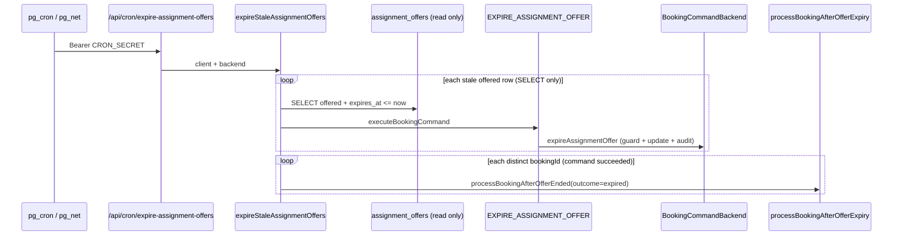
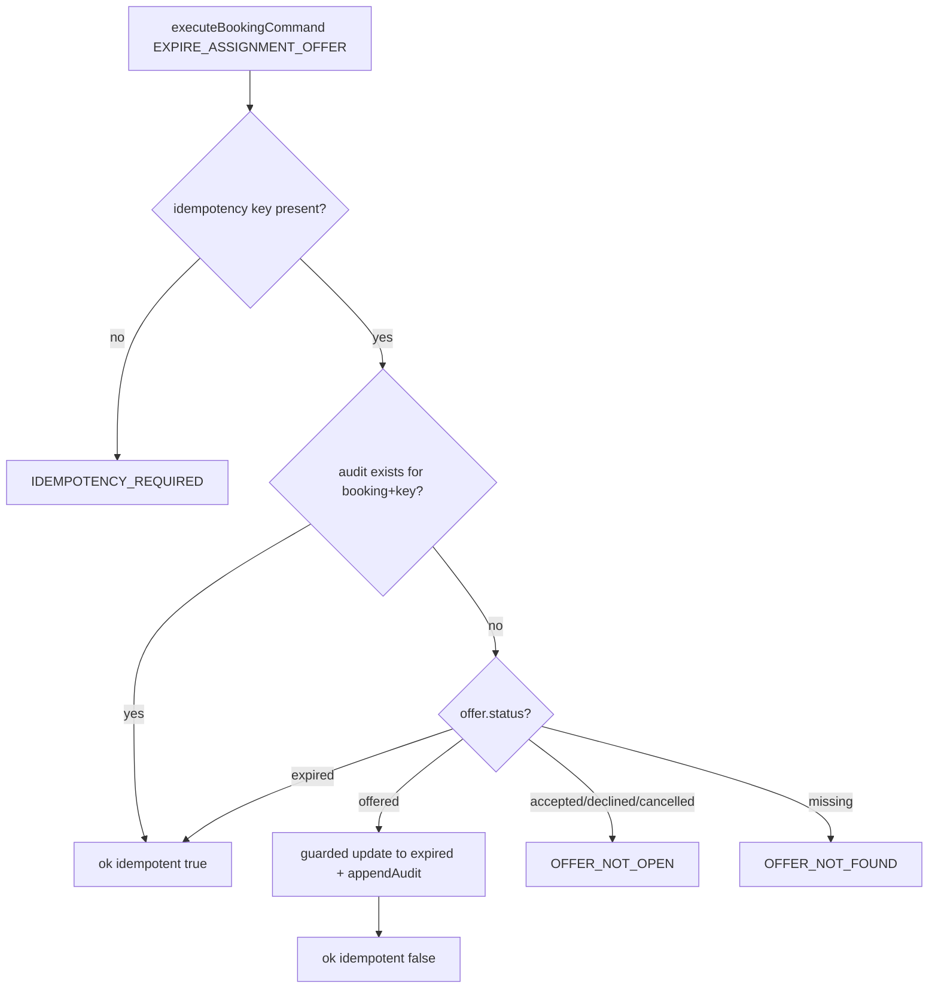

# Stage 5K-2 — Command-Owned Assignment Offer Expiry Design

**Date:** 2026-05-17  
**Status:** **5K-2a implemented** (command-owned cron expiry; DB RPC deferred to 5K-2b)  
**Depends on:** [stage-5k-assignment-expiry-audit-convergence-design.md](./stage-5k-assignment-expiry-audit-convergence-design.md) (5K-1a **shipped**), [stage-5b-2c-facade-command-boundary-guard-design.md](./stage-5b-2c-facade-command-boundary-guard-design.md), [stage-2b-2-abandoned-checkout-expiry-design.md](./stage-2b-2-abandoned-checkout-expiry-design.md) (payment reference)  
**Audit baseline:** [stage-5k-1a-assignment-offer-expiry-audit-final-audit.md](../audits/stage-5k-1a-assignment-offer-expiry-audit-final-audit.md)

**Goal:** Design the migration from **direct cron DML** in `expireOffers.ts` to a **command-owned** `EXPIRE_ASSIGNMENT_OFFER` flow, aligned with `MARK_PAYMENT_FAILED` / `expireStalePendingPayments`, without changing expiry timing, redispatch policy, accept/decline, earnings, RLS, or notifications.

**Hard constraints (this stage):**

- Design only — no migrations or app code.
- Do **not** change when offers expire, redispatch rules, or path policy.
- Do **not** change `ACCEPT_CLEANER_ASSIGNMENT` / `DECLINE_CLEANER_ASSIGNMENT` behavior (5K-1c is separate).
- Do **not** change notification enqueue or delivery.
- Do **not** change RLS policies.
- Do **not** change admin copy semantics (labels may gain a new command alias only).

---

## Executive summary

| # | Design question | Recommendation |
|---|-----------------|----------------|
| 1 | Replace or wrap `RECORD_ASSIGNMENT_OFFER_EXPIRED`? | **Replace on cron path** — one command owns transition + audit. **Keep** `RECORD_ASSIGNMENT_OFFER_EXPIRED` for audit-after-DML paths until 5K-1c unifies them. |
| 2 | Command owns `offered` → `expired`? | **Yes** — via guarded `backend.expireAssignmentOffer` (or equivalent), not Supabase client in `expireOffers.ts`. |
| 3 | Guard conditions? | Offer exists; `booking_id` match; `status === offered` (or idempotent replay); optional `expires_at <= now`; actor `service`; required idempotency key; booking unchanged. |
| 4 | Already `expired`? | **Idempotent success** if audit key exists; else skip/no-op without new audit (cron scan won't select). |
| 5 | `accepted` / `declined` / `cancelled`? | **Fail closed** — `OFFER_NOT_OPEN`; cron counts as skip, no DML. |
| 6 | Cron idempotency key? | **Unchanged:** `cron:expire-offer:{offerId}` |
| 7 | Who calls `processBookingAfterOfferExpiry`? | **Cron still calls** after per-offer command success, per distinct `bookingId` — unchanged orchestration split. |
| 8 | Transactional expiry + audit? | **Target:** single backend operation (ideally DB RPC in 5K-2b); **5K-2a minimum:** sequential guarded update + audit in one backend method with shared idempotency pre-check. |
| 9 | Backend shape? | **Yes** — new `expireAssignmentOffer` on `BookingCommandBackend`; Supabase impl mirrors `recordPaymentFailure` pattern. |
| 10 | Fail-soft? | **Invert 5K-1a asymmetry** — command failure means offer stays `offered`; batch continues. No “expired without audit” on happy-path command success. |
| 11 | Prove no duplicate audits? | Idempotency key tests + audit count assertions per `offerId`; cron double-run regression. |
| 12 | Static guard change? | **Remove** `expireOffers.ts` from allowlist; tier-D → tier-A (`command_required`). |
| 13 | Fate of `RECORD_ASSIGNMENT_OFFER_EXPIRED`? | **Retain** for accept/decline/dispatch-sweep until 5K-1c; **deprecate for cron**; admin label maps both command names to same strings. |
| 14 | Admin labels unchanged? | Map `EXPIRE_ASSIGNMENT_OFFER` to identical **Cleaner offer expired** title/description in `describeBookingStateAuditDisplay`. |
| 15 | Smallest safe slice? | **5K-2a only** — command + cron refactor + guards/tests; **no** RPC migration, **no** accept/decline, **no** notification changes. |

### Final answer

**Is `EXPIRE_ASSIGNMENT_OFFER` safe to implement now?**  
**Yes**, after 5K-1a is verified in production (audit rows visible for cron expiry). 5K-1a deliberately separated audit from DML to reduce risk; 5K-2 closes the ordering gap without touching redispatch policy.

**Smallest safe slice:** **5K-2a** — introduce `EXPIRE_ASSIGNMENT_OFFER`, refactor `expireStaleAssignmentOffers` to call `executeBookingCommand` per candidate (read-only scan stays in facade), retire tier-D DML and `recordAssignmentOfferExpiredAudit` on the cron path, update static guards and regression tests. Defer DB RPC atomicity (5K-2b) and non-cron expiry paths (5K-1c) unless blocking.

---

## Current 5K-1a architecture

### End-to-end flow (cron — as shipped)

```mermaid
sequenceDiagram
  participant PG as pg_cron / pg_net
  participant RT as /api/cron/expire-assignment-offers
  participant EX as expireStaleAssignmentOffers
  participant DB as assignment_offers (SR client)
  participant AUD as RECORD_ASSIGNMENT_OFFER_EXPIRED
  participant PAE as processBookingAfterOfferExpiry

  PG->>RT: Bearer CRON_SECRET
  RT->>EX: client + backend
  loop each stale offered row
    EX->>DB: UPDATE offered → expired (tier-D DML)
    EX->>AUD: executeBookingCommand (fail-soft)
    Note over EX,AUD: Audit skipped on failure; offer stays expired
  end
  loop each distinct bookingId
    EX->>PAE: processBookingAfterOfferEnded(outcome=expired)
    Note over PAE: RECORD_ASSIGNMENT_ATTENTION / OFFER_TO_CLEANER unchanged
  end
  RT-->>PG: JSON counts
```

### Code map (5K-1a)

| Layer | File | Role |
|-------|------|------|
| Cron route | `src/app/api/cron/expire-assignment-offers/route.ts` | Auth + batch orchestrator |
| Offer DML + audit hook | `src/features/assignments/server/expireOffers.ts` | Tier-D `offered` → `expired`; then `recordAssignmentOfferExpiredAudit` |
| Audit helper | `src/features/assignments/server/recordAssignmentOfferExpiredAudit.ts` | Wraps `RECORD_ASSIGNMENT_OFFER_EXPIRED` with `cron:expire-offer:{offerId}` |
| Audit command | `executeBookingCommand` case `RECORD_ASSIGNMENT_OFFER_EXPIRED` | Audit-only; requires offer already `expired` |
| Booking follow-up | `processBookingAfterOfferExpiry.ts` | Unchanged wrapper → `processBookingAfterOfferEnded` |
| Admin labels | `adminOperationalHelpers.ts` | **Cleaner offer expired** for `RECORD_ASSIGNMENT_OFFER_EXPIRED` |
| Static guard | `assignmentOfferStatusMutationGuard.test.ts` | Allows DML only in backends + **`expireOffers.ts`** |

### 5K-1a invariants (must preserve in 5K-2)

| Invariant | 5K-1a behavior | 5K-2 requirement |
|-----------|----------------|------------------|
| Expiry selection | `status=offered`, `expires_at` not null, `expires_at <= now`, batch limit | **Same** — read query stays in facade |
| Row guard | Update only when `status=offered` | **Same** — inside command/backend |
| Redispatch / attention | `processBookingAfterOfferExpiry` policy | **Unchanged** |
| Cron JSON | `expiredCount`, `bookingIds`, `redispatchedBookingIds`, `attentionBookingIds` | **Unchanged** |
| Notifications | None on expiry audit path | **Unchanged** |
| Idempotency key | `cron:expire-offer:{offerId}` | **Unchanged** |
| Admin copy | Cleaner offer expired | **Same strings** (command column may differ) |

### Known 5K-1a gap (motivation for 5K-2)

| Failure mode | 5K-1a | 5K-2 target |
|--------------|-------|-------------|
| DML succeeds, audit fails | Offer `expired`, no audit (fail-soft) | Command fails atomically (or no DML) — no orphaned expiry without audit on success path |
| DML outside command layer | Tier-D exception in static guards | Offer status writes only via command backends |
| Two-step ordering | Caller must expire before audit command | Single command owns both |

---

## Target command-owned architecture

### Reference: payment expiry (converged pattern)

`expireStalePendingPayments` performs a **read-only** candidate scan, then per row:

```text
executeBookingCommand(MARK_PAYMENT_FAILED, idempotencyKey: cron:expire-pending-payment:{paymentId})
  → backend.recordPaymentFailure (RPC: payment + booking + audit)
```

No direct `payments.status` or `bookings.status` DML in the facade.

### Target: assignment offer expiry



### Facade tier change

| Before (5K-1a) | After (5K-2a) |
|----------------|---------------|
| Tier **D** `offer_expiry_exception` — direct DML in `expireOffers.ts` | Tier **A** `command_required` — `executeBookingCommand` per row |
| `allowedDirectWriteException: true` in facade manifest | `allowedDirectWriteException: false` |

`expireOffers.ts` retains **only** the service-role **read** query (same as `expirePendingPayments.ts`); all writes go through the command backend.

---

## Design question answers

### 1. Should `EXPIRE_ASSIGNMENT_OFFER` replace `RECORD_ASSIGNMENT_OFFER_EXPIRED` or wrap it?

| Path | Recommendation |
|------|----------------|
| **Cron (`expireStaleAssignmentOffers`)** | **Replace** — one command performs guarded expiry + audit. Do **not** chain `EXPIRE_ASSIGNMENT_OFFER` → `RECORD_ASSIGNMENT_OFFER_EXPIRED` (duplicate audit risk, two idempotency stories). |
| **Accept/decline/dispatch inline expiry (5K-1c)** | **Keep** `RECORD_ASSIGNMENT_OFFER_EXPIRED` until those paths call `EXPIRE_ASSIGNMENT_OFFER` or a shared backend helper. Those paths already mutate the offer inside another command; audit-only remains valid there. |
| **Internal implementation** | `EXPIRE_ASSIGNMENT_OFFER` handler may **reuse** audit envelope builder/metadata shape from `RECORD_ASSIGNMENT_OFFER_EXPIRED`; audit row `command` column = **`EXPIRE_ASSIGNMENT_OFFER`**. |

**Rationale:** Payment does not use “record failure” after a separate cron patch — `MARK_PAYMENT_FAILED` is the single durable event. Cron assignment expiry should match.

### 2. Should the command own `assignment_offers.status` `offered` → `expired`?

**Yes.** This is the core 5K-2 deliverable.

- Executor calls `backend.expireAssignmentOffer(cmd, bookingId, offerId)` (name TBD).
- Implementation applies `UPDATE … WHERE id = ? AND status = 'offered'` (or equivalent ORM guard).
- Sets `updated_at` (and optionally aligns `expiredAt` in metadata with row timestamp).
- **No** Supabase `.from("assignment_offers").update` in `expireOffers.ts` after 5K-2a.

### 3. What guard conditions are required?

**Preconditions (fail closed unless idempotent replay):**

| Guard | Code / behavior |
|-------|-----------------|
| `idempotencyKey` present | `IDEMPOTENCY_REQUIRED` |
| Booking exists | `BOOKING_NOT_FOUND` |
| Offer exists for `bookingId` | `OFFER_NOT_FOUND` |
| `offer.cleaner_id === cmd.cleanerId` | `INVALID_PAYLOAD` |
| Offer `status === 'offered'` for mutation | If not offered, see §4–5 |
| Actor authorized | `service` / `system` only (`bookingCommandGuards` — same policy as `RECORD_ASSIGNMENT_OFFER_EXPIRED`) |
| Booking status | **No booking status transition** — typically `pending_assignment`; command does not call `applyTransition` |

**Optional strictness (cron may pre-filter):**

| Guard | Recommendation |
|-------|----------------|
| `expires_at IS NOT NULL AND expires_at <= expiredAt` | **Enforce in command** for `source: cron` metadata — prevents manual/command misuse from expiring early. Accept/decline paths may pass `source: accept_reject` without TTL check when inline-expiring past-deadline offers. |

**Not in scope:** changing `expires_at` computation (`buildOfferExpiry.ts`), batch size, or redispatch eligibility.

### 4. What should happen if the offer is already `expired`?

| Scenario | Behavior |
|----------|----------|
| Cron re-run / concurrent worker | Row not in SELECT (`status=offered`) — **no command invoked** |
| Command invoked with `status=expired` + **existing** idempotency key | **Idempotent success** (`ok: true`, `idempotent: true`) — same as `RECORD_ASSIGNMENT_OFFER_EXPIRED` today |
| Command invoked with `status=expired` + **no** audit key | **Idempotent success without new audit** — treat as already terminal; do not fail batch (forensic gap acceptable for race: expired by accept/decline between SELECT and command) |
| Command invoked with `status=expired` + wrong cleanerId | `INVALID_PAYLOAD` |

Prefer **idempotent success** over errors for cron robustness.

### 5. What should happen if the offer is `accepted` / `declined` / `cancelled`?

| Status | Behavior |
|--------|----------|
| `accepted` | **Fail** `OFFER_NOT_OPEN` — cron increments skip counter; no mutation, no audit |
| `declined` | **Fail** `OFFER_NOT_OPEN` — same |
| `cancelled` | **Fail** `OFFER_NOT_OPEN` — same |

Cron batch should **not** treat these as hard errors in HTTP 500 — mirror `expireStalePendingPayments` `skipped.commandRejected` pattern (log + continue).

**Important:** This is unchanged from today's DML guard (zero rows updated → `continue`) — only categorization becomes explicit command result.

### 6. What idempotency key should cron use?

**Keep the 5K-1a key:**

```text
cron:expire-offer:{offerId}
```

| Property | Detail |
|----------|--------|
| Scope | Per offer, per booking (audit table unique on `(booking_id, idempotency_key)`) |
| Stability | Must not include timestamp buckets — offer id alone |
| Cross-command | After 5K-2a, **only** `EXPIRE_ASSIGNMENT_OFFER` uses this key for cron — retire `RECORD_ASSIGNMENT_OFFER_EXPIRED` for the same key on cron path to avoid two command types fighting one key |

**5K-1c keys (unchanged, out of scope for 5K-2a):**

- `offer:expire-on-accept:{offerId}`
- `offer:expire-on-decline:{offerId}`
- `offer:expire-on-dispatch:{offerId}`

### 7. Should the command call `processBookingAfterOfferExpiry`, or should cron still call it?

**Cron still calls it** — **outside** the offer command.

| Concern | Owner |
|---------|--------|
| Offer row terminal state + per-offer audit | `EXPIRE_ASSIGNMENT_OFFER` |
| Booking metadata, redispatch, `RECORD_ASSIGNMENT_ATTENTION` | `processBookingAfterOfferExpiry` → `processBookingAfterOfferEnded` |

**Ordering (unchanged from 5K-1a):**

1. Complete per-offer expiry commands for all rows in batch.
2. Collect distinct `bookingId`s where command succeeded (including idempotent replay).
3. Run `processBookingAfterOfferExpiry(client, backend, bookingId, now)` once per booking.

**Do not** embed redispatch inside `EXPIRE_ASSIGNMENT_OFFER` — would couple offer lifecycle to path policy and complicate testing.

### 8. Should expiry + audit be transactional?

**Design intent: yes. Implementation phased.**

| Phase | Approach | Atomicity |
|-------|----------|-----------|
| **5K-2a (minimum)** | `expireAssignmentOffer` in TypeScript backend: idempotency pre-check → guarded `updateOffer` → `appendAudit` | **Best-effort** — same class of gap as pre-RPC payment work; crash between steps leaves rare inconsistency |
| **5K-2b (recommended follow-up)** | New `booking_expire_assignment_offer` RPC (security definer, `service_role` only) — single transaction: offer update + audit insert | **Strong** — mirrors `booking_record_payment_failure` |

**5K-2a acceptance criteria:** Happy path never produces `expired` without audit when command returns `ok` and `idempotent: false`. Failed command never mutates offer from `offered`.

**Rollback:** If `appendAudit` fails after `updateOffer` in 5K-2a without RPC, either (a) roll back offer in catch (complex), or (b) treat as command failure and **document** ops repair — prefer **(b) only if RPC deferred**; prefer RPC in 5K-2b before production if 5K-2a uses sequential TS.

### 9. Should the command backend update the offer and append `booking_state_audit` in one operation?

**Yes** — expose one backend method:

```ts
expireAssignmentOffer(
  cmd: BookingCommand & { type: "EXPIRE_ASSIGNMENT_OFFER" },
  bookingId: string,
  offerId: string,
): Promise<{ expired: boolean; idempotent: boolean }>;
```

**Responsibilities:**

1. `findAuditsByBookingAndKey` — early idempotent return.
2. Load offer + booking; run guards (§3–5).
3. Guarded status transition `offered` → `expired`.
4. `appendAudit` with `from_status` = `to_status` = current booking status.
5. Return `{ expired: true, idempotent: false }` or idempotent shortcut.

`executeBookingCommand` case stays thin — delegate to backend (like `MARK_PAYMENT_FAILED` → `recordPaymentFailure`).

### 10. How should fail-soft behavior work?

| Layer | 5K-1a | 5K-2a |
|-------|-------|-------|
| Per-offer audit after DML | Fail-soft (`console.warn`, offer stays expired) | **Removed on cron path** — unified command |
| Per-offer command failure | N/A | **Fail-soft at batch level** — log structured event, continue batch (same as payment cron errors array) |
| Booking orchestration | Errors propagate per existing tests | **Unchanged** — failure in `processBookingAfterOfferExpiry` does not roll back offer expiry |

**Structured log event (proposed):** `assignment_offer_expire_command_failed` with `bookingId`, `offerId`, `code`, `message`.

**HTTP cron route:** Still returns 200 with counts unless catastrophic query failure — align with `expire-pending-payments` semantics.

### 11. How should tests prove no duplicate audit rows?

| Test | Assertion |
|------|-----------|
| `EXPIRE_ASSIGNMENT_OFFER` unit | Second call with same `cron:expire-offer:{id}` → `idempotent: true`, audit count **1** |
| `expireOffers` integration | Full batch twice → one audit per offerId; `expiredCount` second run **0** or idempotent only |
| Command rejection | `declined` offer → **0** new audit rows |
| DB constraint | Rely on `booking_state_audit` unique `(booking_id, idempotency_key)` — second insert must not occur on success path |
| Regression | Existing `recordAssignmentOfferExpiredCommand.test.ts` patterns ported to new command; keep RECORD tests until command removed |

**Explicit assertion helper:**

```ts
expect(audits.filter(a => a.idempotency_key === `cron:expire-offer:${offerId}`)).toHaveLength(1);
```

### 12. How should the assignment offer status mutation guard change?

**`assignmentOfferStatusMutationGuard.test.ts`:**

```diff
- "features/assignments/server/expireOffers.ts",
+ (removed — no direct offer status patches in facade)
```

**Allowed writers after 5K-2a:**

- `inMemoryBookingCommandBackend.ts`
- `supabaseBookingCommandBackend.ts` (and RPC impl if 5K-2b)
- `rlsTestSupport.ts`
- SQL migrations allowlist (unchanged unless new RPC migration adds SQL — then allowlist that migration only)

**`facadeCommandBoundaryManifest.ts`:**

- `expireOffers.ts`: `tier: "command_required"`, `allowedDirectWriteException: false`

**`command-boundary-static-guards.md`:** Update tier-D cron exception paragraph to state offer expiry is command-owned.

### 13. What should happen to the existing `RECORD_ASSIGNMENT_OFFER_EXPIRED` command?

| Action | Detail |
|--------|--------|
| **Cron path** | **Stop calling** — remove `recordAssignmentOfferExpiredAudit` usage from `expireOffers.ts` |
| **Command type** | **Keep registered** until 5K-1c paths migrate |
| **Executor case** | Unchanged behavior for audit-after-DML |
| **Deprecation comment** | Mark as “secondary path — prefer EXPIRE_ASSIGNMENT_OFFER when command owns DML” |
| **Removal** | Only after accept/decline/dispatch-sweep emit audit via `EXPIRE_ASSIGNMENT_OFFER` or shared backend (5K-1c + 5K-2c) |

**Idempotency collision rule:** Never run both commands with the same `cron:expire-offer:{offerId}` on one offer.

### 14. How should admin labels remain unchanged?

**`describeBookingStateAuditDisplay`** should treat both commands identically:

```ts
if (
  row.command === "RECORD_ASSIGNMENT_OFFER_EXPIRED" ||
  row.command === "EXPIRE_ASSIGNMENT_OFFER"
) {
  return {
    displayTitle: "Cleaner offer expired",
    displayDescription: "An assignment offer expired before the cleaner accepted.",
  };
}
```

| Surface | Change |
|---------|--------|
| Admin booking State audit | **No copy change** — only `command` monospace line may show new type |
| `selected_expired_admin` visibility | **Unchanged** — driven by booking metadata, not audit command name |
| Assignment events timeline (future) | May list either command with same title |

Historical rows with `RECORD_ASSIGNMENT_OFFER_EXPIRED` remain valid.

### 15. What is the smallest safe implementation slice?

**5K-2a only (recommended PR scope):**

1. Add `EXPIRE_ASSIGNMENT_OFFER` to `BOOKING_COMMAND_TYPES` + `BookingCommand` union.
2. Register actor policy + guards (`systemish`, no booking transition).
3. Implement `backend.expireAssignmentOffer` (in-memory + Supabase sequential).
4. Add `executeBookingCommand` case delegating to backend.
5. Refactor `expireStaleAssignmentOffers`: SELECT unchanged; per row `executeBookingCommand`; remove direct `.update` and `recordAssignmentOfferExpiredAudit`.
6. Update static guards + facade manifest tier.
7. Tests: new command tests + update `expireOffers.test.ts`, `expireOffers.auditFailSoft.test.ts` (expect command-level failure semantics), security guard test.
8. Ops doc tweak: [assignment-offer-expiry-audit.md](../operations/assignment-offer-expiry-audit.md) — command-owned transition.

**Explicitly defer:**

- 5K-2b DB RPC atomicity
- 5K-1c accept/decline/dispatch audit wiring
- 5K-3 `OFFER_TO_CLEANER` audit
- Removing `RECORD_ASSIGNMENT_OFFER_EXPIRED` type entirely

---

## Command contract

### Type definition (proposed)

```ts
export type ExpireAssignmentOfferCommand = BaseCommand & {
  type: "EXPIRE_ASSIGNMENT_OFFER";
  bookingId: BookingId;
  offerId: string;
  cleanerId: string;
  /** ISO timestamp used for updated_at + audit metadata (cron: batch `now`). */
  expiredAt: string;
  /** Required — e.g. cron:expire-offer:{offerId} */
  idempotencyKey: string;
  metadata?: {
    expirySource: "cron" | "accept_reject" | "dispatch_sweep";
    expiresAt?: string | null;
    previousOfferStatus?: "offered";
  } | null;
};
```

### Result semantics

| Field | Meaning |
|-------|---------|
| `ok: true`, `idempotent: false` | Offer transitioned `offered` → `expired`; audit appended |
| `ok: true`, `idempotent: true` | Audit key already present and/or already expired safely |
| `ok: false`, `OFFER_NOT_OPEN` | Terminal non-offered state — cron skip |
| `ok: false`, `IDEMPOTENCY_REQUIRED` | Missing key |
| `ok: false`, `PERSISTENCE_ERROR` | Backend/RPC failure — offer must not be left `expired` without audit on failed non-idempotent path |

### Audit row shape

| Column | Value |
|--------|-------|
| `command` | `EXPIRE_ASSIGNMENT_OFFER` |
| `from_status` / `to_status` | Current `bookings.status` (both same) |
| `actor_type` | `service` (cron) |
| `idempotency_key` | `cron:expire-offer:{offerId}` |
| `metadata` | Same allowlist as 5K-1a: `offerId`, `cleanerId`, `expiredAt`, `expirySource`, `previousOfferStatus` |

**No** `admin_operational_audit` row.

**No** notification enqueue.

---

## Guard / idempotency model



**Cron batch idempotency (two layers):**

1. **Selection** — only `offered` rows (today).
2. **Command** — `cron:expire-offer:{offerId}` prevents duplicate audit on replay.

---

## Transaction / audit model

| Model | Offer update | Audit append | Consistency |
|-------|--------------|--------------|-------------|
| 5K-1a | Facade DML | Separate command | Expired without audit possible |
| 5K-2a TS backend | Backend `updateOffer` | Backend `appendAudit` | Improved; not serializable across round-trips |
| 5K-2b RPC | SQL `UPDATE` + `INSERT` | Same transaction | Target parity with `booking_record_payment_failure` |

**RPC sketch (5K-2b — design only):**

- `p_offer_id`, `p_booking_id`, `p_expected_status offered`, `p_expired_at`, audit fields mirroring existing RPC args.
- Early return if idempotency key exists in `booking_state_audit`.
- `UPDATE assignment_offers SET status = expired WHERE id = ? AND status = offered` — if `NOT FOUND` and already expired, return idempotent success.

---

## Cron integration plan

### Before (5K-1a)

```text
for offer in staleOffers:
  client.update(offered → expired)   // tier-D
  recordAssignmentOfferExpiredAudit() // fail-soft
for bookingId in bookingIds:
  processBookingAfterOfferExpiry()
```

### After (5K-2a)

```text
for offer in staleOffers:   // SELECT only via client
  result = executeBookingCommand(EXPIRE_ASSIGNMENT_OFFER, {
    actor: service,
    bookingId, offerId, cleanerId,
    expiredAt: nowIso,
    idempotencyKey: `cron:expire-offer:${offerId}`,
    metadata: { expirySource: "cron", expiresAt: offer.expires_at, ... },
  })
  if result.ok: expiredCount++; bookingIds.add(bookingId)
  else if skippable: continue
  else: errors.push(...)

for bookingId in bookingIds:
  processBookingAfterOfferExpiry(client, backend, bookingId, now)
```

### Files touched (implementation checklist — not done in design pass)

| File | Change |
|------|--------|
| `expireOffers.ts` | Remove DML + audit helper; command per row |
| `recordAssignmentOfferExpiredAudit.ts` | Keep for 5K-1c; optional deprecation note |
| `executeBookingCommand.ts` | New case |
| `bookingCommandBackend.ts` | `expireAssignmentOffer` |
| `supabaseBookingCommandBackend.ts` | Implement (+ optional RPC call in 5K-2b) |
| `inMemoryBookingCommandBackend.ts` | Implement |
| `types.ts` | New command type |
| `bookingCommandGuards.ts` | Policy registration |
| `assignmentOfferStatusMutationGuard.test.ts` | Remove expireOffers allowlist |
| `facadeCommandBoundaryManifest.ts` | Tier A |
| `adminOperationalHelpers.ts` | Label alias for new command |
| Tests listed in § Tests required |

**Unchanged:** `expire-assignment-offers/route.ts` auth and response shape; pg_cron migration; RLS.

---

## Static guard changes

| Guard / manifest | 5K-1a | 5K-2a |
|------------------|-------|-------|
| `assignmentOfferStatusMutationGuard` | Allows `expireOffers.ts` | **Remove** |
| `facadeCommandBoundaryGuard` | Tier D exception | Tier A command required |
| `mutationRouteBoundaryManifest` | Cron → facade only | **No change** (route still imports facade) |
| `serviceRoleLifecycleWriteRegistry` | Cron routes | **No change** |

---

## Tests required

| Area | Tests |
|------|-------|
| **Command unit** | Success `offered` → `expired` + audit; idempotent replay; missing key; wrong booking; wrong cleaner; `OFFER_NOT_OPEN` for declined/accepted/cancelled; no notification enqueue |
| **Backend unit** | Guarded update returns 0 rows → idempotent or `OFFER_NOT_OPEN` per policy |
| **expireOffers integration** | Audit exists with `cron:expire-offer:{id}`; second batch no duplicate audits; redispatch/attention outcomes unchanged |
| **Remove / replace fail-soft test** | `expireOffers.auditFailSoft.test.ts` → command persistence failure does not expire offer (or documents RPC-era behavior) |
| **processBookingAfterOfferEnded** | Regression — no changes to policy tests |
| **Admin helpers** | `EXPIRE_ASSIGNMENT_OFFER` maps to same display strings |
| **Static guards** | Violation if `expireOffers.ts` patches `status` |
| **Cron route** | `expire-assignment-offers/route.test.ts` — JSON contract unchanged |
| **Security manifest sync** | Facade tier D → A |

---

## Phased rollout

| Slice | Deliverable | Behavior change? |
|-------|-------------|------------------|
| **5K-2a** | `EXPIRE_ASSIGNMENT_OFFER` + cron refactor + guards/tests + admin label alias | **Refactor only** — same expiry/redispatch outcomes |
| **5K-2b** | `booking_expire_assignment_offer` RPC + backend delegates to RPC | Stronger atomicity; still no policy change |
| **5K-1c** | Accept/decline/dispatch audit via `RECORD_*` or `EXPIRE_*` | Observability only |
| **5K-2c** | Remove `RECORD_ASSIGNMENT_OFFER_EXPIRED` when all paths unified | Cleanup |
| **5K-3** | `OFFER_TO_CLEANER` audit | Observability only |

**Deploy order:** 5K-2a app-only deploy (no migration) → verify audit `command = EXPIRE_ASSIGNMENT_OFFER` in production → optional 5K-2b migration.

**Backfill:** Historical `RECORD_ASSIGNMENT_OFFER_EXPIRED` rows remain valid; **no** backfill required. Optional ops query to find `expired` offers without either command (5K-1a fail-soft orphans) — repair out of scope.

---

## Risks and mitigations

| Risk | Likelihood | Mitigation |
|------|------------|------------|
| TS two-step backend leaves expired-without-audit on crash | Low in 5K-2a | 5K-2b RPC; monitor `assignment_offer_expire_command_failed` |
| Duplicate audit if both command types use same key | Medium if mis-implemented | Cron uses only `EXPIRE_*`; code review + idempotency tests |
| `expiredCount` diverges from 5K-1a (skip vs update) | Low | Map `OFFER_NOT_OPEN` to same `continue` semantics; integration tests |
| Breaking static CI | Expected | Update allowlists in same PR |
| Admin confusion from new `command` string | Low | Same `displayTitle`; document in ops runbook |
| Race: offer accepted between SELECT and command | Very low | Command fails `OFFER_NOT_OPEN` — no expiry; acceptable |
| Race: offer expired by inline path without audit key | Low | Idempotent success without second audit — acceptable |

---

## Final recommendation

### Replace vs wrap

**Replace** the cron two-step flow with **`EXPIRE_ASSIGNMENT_OFFER`**. Do not wrap `RECORD_ASSIGNMENT_OFFER_EXPIRED` on the cron path. Retain `RECORD_ASSIGNMENT_OFFER_EXPIRED` for non-cron audit-after-DML until 5K-1c.

### Safe to implement now?

**Yes.** 5K-1a provides the audit schema, idempotency key, admin labels, and tests. 5K-2a is a bounded refactor with no policy change and clear rollback (revert PR).

### Smallest safe slice

**5K-2a:** command + backend method + `expireOffers.ts` cron refactor + static guards + tests + admin label alias. Ship without RPC; plan **5K-2b** if production requires transactional parity with payment failure RPC.

### Success criteria (5K-2a)

- [ ] No `assignment_offers.status` updates in `expireOffers.ts` (CI guard passes).
- [ ] Cron produces exactly one audit row per expired offer with `cron:expire-offer:{offerId}`.
- [ ] `expiredCount` / redispatch / attention behavior matches pre-change integration tests.
- [ ] Admin UI still shows **Cleaner offer expired** for new audit rows.
- [ ] No notification, RLS, or earnings diff.

---

## References

| Piece | Path |
|-------|------|
| 5K master design | [stage-5k-assignment-expiry-audit-convergence-design.md](./stage-5k-assignment-expiry-audit-convergence-design.md) |
| 5K-1a audit | [stage-5k-1a-assignment-offer-expiry-audit-final-audit.md](../audits/stage-5k-1a-assignment-offer-expiry-audit-final-audit.md) |
| Cron expiry (current) | `src/features/assignments/server/expireOffers.ts` |
| Audit helper (cron today) | `src/features/assignments/server/recordAssignmentOfferExpiredAudit.ts` |
| Payment expiry pattern | `src/features/payments/server/expirePendingPayments.ts` |
| Payment failure RPC | `supabase/migrations/20260515203000_booking_command_layer.sql` |
| Booking follow-up | `src/features/assignments/server/processBookingAfterOfferExpiry.ts` |
| Static guards | `src/features/assignments/server/assignmentOfferStatusMutationGuard.test.ts` |
| Facade manifest | `src/tests/security/facadeCommandBoundaryManifest.ts` |
| Ops | [assignment-offer-expiry-audit.md](../operations/assignment-offer-expiry-audit.md) |

---

## 5K-2a implementation status (shipped)

| Item | Path |
|------|------|
| Command | `EXPIRE_ASSIGNMENT_OFFER` in `types.ts`, `executeBookingCommand.ts` |
| Backend | `expireAssignmentOffer` in `inMemoryBookingCommandBackend.ts`, `supabaseBookingCommandBackend.ts` |
| Cron | `expireOffers.ts` — read-only scan + `executeBookingCommand` per row |
| Idempotency | `cron:expire-offer:{offerId}` via `recordAssignmentOfferExpiredAudit.ts` helper |
| Static guards | `expireOffers.ts` removed from offer status allowlist; facade tier A |
| Admin labels | `describeBookingStateAuditDisplay` aliases `EXPIRE_ASSIGNMENT_OFFER` |
| Tests | `expireAssignmentOfferCommand.test.ts`, updated `expireOffers*.test.ts` |
| Ops | [assignment-offer-expiry-audit.md](../operations/assignment-offer-expiry-audit.md) |

`RECORD_ASSIGNMENT_OFFER_EXPIRED` retained for non-cron paths. DB RPC deferred to 5K-2b.

---

## Verification note (design review)

Design derived from 5K-1a baseline; 5K-2a implementation matches §5K-2a scope above.
