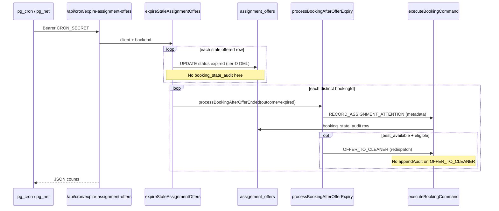

# Stage 5K — Assignment Expiry Audit Convergence Design

**Date:** 2026-05-17  
**Status:** Design — **5K-1a implemented** (per-offer cron audit rows); 5K-2+ deferred  
**Depends on:** [stage-3b-2-decline-redispatch-policy-design.md](./stage-3b-2-decline-redispatch-policy-design.md), [stage-5b-1-durable-admin-operational-audit-design.md](./stage-5b-1-durable-admin-operational-audit-design.md), [stage-5b-2c-facade-command-boundary-guard-design.md](./stage-5b-2c-facade-command-boundary-guard-design.md), [cleaner-offer-expiration-system-audit.md](../audits/cleaner-offer-expiration-system-audit.md), [expire-assignment-offers-cron.md](../operations/expire-assignment-offers-cron.md)

**Goal:** Close the original Stage 5 assignment/cron convergence gap by designing **durable audit behavior** for assignment offer expiry — without changing expiry outcomes, accept/decline semantics, earnings, RLS, or notification logic.

**Hard constraints (this stage):**

- Design only — no migrations or app code.
- Do **not** change when offers expire, redispatch rules, or path policy.
- Do **not** change `ACCEPT_CLEANER_ASSIGNMENT` / `DECLINE_CLEANER_ASSIGNMENT` behavior.
- Do **not** change notification enqueue or delivery.
- Do **not** change RLS policies in this stage.

---

## Executive summary

| # | Question | Recommendation |
|---|----------|----------------|
| 1 | Where is `assignment_offers.status` set to `expired`? | **Four paths** — cron DML, accept/decline hard reject, `OFFER_TO_CLEANER` inline sweep, (tests only) |
| 2 | `booking_state_audit` on cron expiry? | **Partial** — only via downstream `RECORD_ASSIGNMENT_ATTENTION`; **no per-offer expiry row** |
| 3 | `admin_operational_audit` on expiry? | **No** — correct; cron is not an admin action |
| 4 | New booking command? | **Yes** — `RECORD_ASSIGNMENT_OFFER_EXPIRED` (Slice 1); optional later `EXPIRE_ASSIGNMENT_OFFER` folding tier-D DML |
| 5 | Audit granularity | **Per offer** for expiry event; **per booking** for outcome (`RECORD_ASSIGNMENT_ATTENTION`) — keep both |
| 6 | Actor | **`service`** for cron/system expiry; **`cleaner`** only when accept/decline command sets expired inline |
| 7 | `processBookingAfterOfferExpiry` | **Stay separate** — booking-level orchestration after offer rows are terminal |
| 8 | Selected-cleaner expiry in admin UI | **Assignment events** timeline + visibility key `selected_expired_admin` |
| 9 | Best_available redispatch after expiry | Show **offer expired** then **auto-redispatch** (`OFFER_TO_CLEANER` audit gap — optional Slice 2) |
| 10 | Max-attempts expiry | Existing metadata reason + **`max_attempts_admin`** visibility; add explicit audit title |
| 11 | Customer copy | **No new expiry-specific copy** in v1; reuse existing `resolveAssignmentVisibility` messages |
| 12 | Idempotency key | `cron:expire-offer:{offerId}` per offer; tighten `RECORD_ASSIGNMENT_ATTENTION` keys |
| 13 | Cron rerun duplicates | Per-offer idempotency + status guard on DML |
| 14 | RLS | Append-only `booking_state_audit` via service role; sanitize payload (no email) |
| 15 | Smallest safe slice | **5K-1a:** audit-only command after cron DML + admin assignment timeline labels |

---

## Current expiry architecture

### End-to-end flow (cron — primary gap)



### Code map

| Layer | File | Role |
|-------|------|------|
| Cron route | `src/app/api/cron/expire-assignment-offers/route.ts` | Auth + `expireStaleAssignmentOffers` |
| Offer DML | `src/features/assignments/server/expireOffers.ts` | `offered` → `expired` with status guard |
| Booking follow-up | `src/features/assignments/server/processBookingAfterOfferExpiry.ts` | Wrapper → `processBookingAfterOfferEnded` |
| Path policy | `src/features/assignments/server/processBookingAfterOfferEnded.ts` | Redispatch / `attention_required` |
| Metadata audit | `src/features/assignments/server/recordAssignmentOutcome.ts` | `RECORD_ASSIGNMENT_ATTENTION` |
| TTL | `src/features/assignments/server/buildOfferExpiry.ts` | 48h default |
| Scheduler | `supabase/migrations/20260516220000_expire_assignment_offers_cron.sql` | Hourly pg_cron |

### All paths that set `assignment_offers.status = 'expired'`

| # | Trigger | Location | Audit today? |
|---|---------|----------|--------------|
| A | **Cron** (`expires_at` passed) | `expireOffers.ts` L45–50 | **No** per-offer row |
| B | **Accept** past `expires_at` | `executeBookingCommand.ts` `ACCEPT_CLEANER_ASSIGNMENT` | **No** (failed accept, offer patched) |
| C | **Decline** past `expires_at` | `executeBookingCommand.ts` `DECLINE_CLEANER_ASSIGNMENT` | **No** |
| D | **Dispatch** inline sweep | `OFFER_TO_CLEANER` before new offer | **No** |
| E | Booking follow-up | `processBookingAfterOfferEnded` | **`RECORD_ASSIGNMENT_ATTENTION`** only (booking-level) |

**Note:** Successful **decline** (in time) sets `declined`, not `expired`; follow-up uses same orchestrator with `outcome: "declined"`.

### Cron HTTP response (unchanged in 5K design)

```json
{
  "ok": true,
  "expiredCount": 2,
  "bookingIds": ["…"],
  "redispatchedBookingIds": ["…"],
  "attentionBookingIds": ["…"]
}
```

### Operational behavior (working — out of scope to change)

| Policy | Behavior |
|--------|----------|
| TTL | 48h (`ASSIGNMENT_OFFER_TTL_HOURS`) |
| Batch | `EXPIRE_OFFERS_BATCH_SIZE` = 100 |
| Idempotent DML | Select `status=offered`; update with `.eq("status","offered")` |
| Selected path | Expiry → `attention_required` (no auto-redispatch) |
| Best available | Expiry → auto `OFFER_TO_CLEANER` if eligible and under max attempts |
| Max attempts | `ASSIGNMENT_MAX_DISPATCH_ATTEMPTS_PER_BOOKING` → attention |

---

## Current audit gaps

### What is durable today

| Source | What it records | Expiry relevance |
|--------|-----------------|------------------|
| `booking_state_audit` | Lifecycle commands + `RECORD_ASSIGNMENT_ATTENTION` | Booking-level metadata after cron follow-up only |
| `bookings.metadata.assignment` | Engine snapshot (`status`, `path`, `reason`, `lastOfferOutcome`) | Updated by `recordAssignmentOutcome` |
| `assignment_offers` row | `status`, `expires_at`, `updated_at` | Source of truth for offer state |
| `admin_operational_audit` | Human admin ops (recovery, dispatch, replace) | **Not** for cron |
| Cron JSON / Vercel logs | Batch counts | Ephemeral |

### Gaps vs Stage 5 convergence intent

| Gap | Impact |
|-----|--------|
| **No per-offer expiry audit** | Cannot answer “when did offer X expire?” from audit alone |
| **Cron DML outside command layer** | Documented tier-D exception; no `booking_state_audit` at mutation time |
| **Timeline shows `RECORD_ASSIGNMENT_ATTENTION`** | Admin “State audit” lists command name; does not say “Offer expired (cron)” |
| **Selected + expired** | `resolveAssignmentVisibility` has `selected_declined_admin` but **no** `selected_expired_admin` — expired selected bookings fall through to generic `needs_assignment` |
| **`OFFER_TO_CLEANER` unaudited** | Auto-redispatch after expiry invisible in state audit (same for decline redispatch) |
| **`RECORD_ASSIGNMENT_ATTENTION` idempotency** | Key `assignment:meta:{bookingId}:{status}:{path}` — collisions if same status/path recorded twice with different reasons |
| **Accept/decline expiry reject** | Offer set `expired` without audit row (low volume; still a forensic hole) |
| **Partial failure** | Offer expired in DB but crash before follow-up → metadata/audit lag until next cron or admin action |

### Comparison: payment expiry (reference pattern)

`expireStalePendingPayments` uses **`MARK_PAYMENT_FAILED`** per payment with idempotency `cron:expire-pending-payment:{paymentId}` → durable `booking_state_audit` + status transition.

**5K target:** Offer expiry should converge toward the same **command + idempotency + audit** pattern, without necessarily moving DML in Slice 1.

---

## Audit / design question answers

### 1. Where does offer expiry currently update `assignment_offers.status`?

See table § “All paths that set expired”. **Primary production path:** `expireStaleAssignmentOffers` in `expireOffers.ts`.

### 2. Does expiry currently create `booking_state_audit` rows?

| Path | `booking_state_audit`? |
|------|------------------------|
| Cron offer DML | **No** |
| Cron → `processBookingAfterOfferExpiry` | **Yes**, if follow-up runs — command `RECORD_ASSIGNMENT_ATTENTION`, `from_status` = `to_status` = `pending_assignment` |
| Accept/decline past expiry | **No** |
| Inline sweep on dispatch | **No** |

### 3. Does expiry currently create `admin_operational_audit` rows?

**No** — and it should **not** for cron/system expiry. `admin_operational_audit` remains for **authenticated admin** actions only ([stage-5b-1](./stage-5b-1-durable-admin-operational-audit-design.md)).

### 4. Should expiry become a new booking command type?

**Yes — two-layer model:**

| Command | Purpose | Slice |
|---------|---------|-------|
| **`RECORD_ASSIGNMENT_OFFER_EXPIRED`** | Durable audit (+ safe payload) after offer is `expired`; idempotent per `offerId` | **5K-1a** (audit-only; DML stays in `expireOffers.ts`) |
| **`EXPIRE_ASSIGNMENT_OFFER`** (optional) | Atomic offer transition + audit; replaces tier-D DML long-term | **5K-2+** |

Do **not** overload `RECORD_ASSIGNMENT_ATTENTION` as the only expiry record — it is booking-metadata oriented, not offer-lifecycle oriented.

### 5. Should expired offers create one audit row per offer, per booking, or both?

**Both:**

| Granularity | Row type | When |
|-------------|----------|------|
| **Per offer** | `RECORD_ASSIGNMENT_OFFER_EXPIRED` | Each time an offer row becomes `expired` (cron, inline, accept/decline reject) |
| **Per booking outcome** | `RECORD_ASSIGNMENT_ATTENTION` (existing) | After `processBookingAfterOfferEnded` sets metadata (`attention_required`, redispatch `offered`, etc.) |

This mirrors payment (per-payment fail command + booking state).

### 6. Should expiry audit be service actor or system actor?

| Source | `actor_type` | `actor_profile_id` |
|--------|--------------|-------------------|
| Cron / `expireOffers` | **`service`** | `null` |
| Accept/decline reject (past expiry) | **`cleaner`** | cleaner’s profile id |
| Inline sweep during `OFFER_TO_CLEANER` | **`service`** | `null` (same cron/dispatch automation) |
| Admin manual expire (future) | **`admin`** | admin profile id |

Use existing `BookingCommandActor` — no new actor enum required.

### 7. Should `processBookingAfterOfferExpiry` stay separate or be invoked from a command?

**Stay separate** as booking-level orchestration:

- **Offer terminal state** = command/audit at offer granularity.
- **Booking policy** (redispatch vs attention) = `processBookingAfterOfferEnded` / `processBookingAfterOfferExpiry` unchanged.

Optional later: invoke orchestrator from a single `EXPIRE_ASSIGNMENT_OFFER` command **after** offer update — still two concerns, one cron entrypoint.

### 8. How should selected cleaner expiry appear in admin timeline?

| Surface | Design |
|---------|--------|
| **New subsection** | “Assignment events” on admin booking detail (below State audit or merged into Lifecycle) |
| **Event title** | “Assignment offer expired (selected cleaner)” |
| **Detail** | Safe metadata: `offerId`, `cleanerId` (label resolved server-side), `expiresAt`, `source: cron` |
| **Badge** | Add visibility key **`selected_expired_admin`**: “Selected cleaner did not accept in time — admin action needed” |
| **Offers table** | Already shows `expired` status — keep |

Do **not** rely on raw `RECORD_ASSIGNMENT_ATTENTION` in the monospace State audit list alone.

### 9. How should best_available expiry redispatch appear?

| Step | Admin-visible event (proposed) |
|------|--------------------------------|
| 1 | Offer expired (cron) — `RECORD_ASSIGNMENT_OFFER_EXPIRED` |
| 2 | Assignment attention updated — existing `RECORD_ASSIGNMENT_ATTENTION` with `lastOfferOutcome: expired` |
| 3 | Auto-redispatch — **Slice 2:** audit on `OFFER_TO_CLEANER` or child `RECORD_ASSIGNMENT_OFFER_CREATED` |

Slice 1 can ship step 1–2; step 3 closes the “invisible redispatch” gap.

### 10. How should max-attempts expiry appear?

| Signal | Today | 5K |
|--------|-------|-----|
| Metadata `reason` | “Maximum assignment dispatch attempts reached after offer expiry.” | Unchanged |
| Visibility | `max_attempts_admin` when reason matches | Unchanged |
| Timeline | Generic `RECORD_ASSIGNMENT_ATTENTION` | Title: **“Max dispatch attempts reached (offer expired)”** via assignment-events mapper |

### 11. What should customers see, if anything?

**No new customer-facing expiry copy in 5K v1.**

| Role | Policy |
|------|--------|
| Customer | Continue `resolveAssignmentVisibility` messages (“We're reviewing cleaner availability…”, “We're finding another available cleaner.”) |
| Cleaner | Offers list already soft-hides past-expiry `offered` rows; `/cleaner/offers` unchanged |
| Admin | Primary audience for new audit/timeline |

Avoid customer timeline entries like “Offer expired” — booking status does not change on expiry alone.

### 12. What idempotency key should expiry audit use?

| Event | Key pattern | Example |
|-------|-------------|---------|
| Cron/system offer expiry | `cron:expire-offer:{offerId}` | `cron:expire-offer:550e8400-e29b-…` |
| Accept reject (expired) | `offer:expire-on-accept:{offerId}` | Same offer always one row |
| Decline reject (expired) | `offer:expire-on-decline:{offerId}` | Same |
| Inline dispatch sweep | `offer:expire-on-dispatch:{offerId}` | Same |
| Assignment metadata | **Tighten** to `assignment:meta:{bookingId}:{status}:{path}:{lastOfferOutcome}:{offerId\|none}` or include `attemptedAt` bucket | Prevents silent collision |

Keys must satisfy `booking_state_audit` partial unique index `(booking_id, idempotency_key)`.

### 13. How to avoid duplicate audit rows on cron reruns?

| Layer | Mechanism |
|-------|-----------|
| DML | Already idempotent — `status = offered` guard |
| Per-offer audit | `RECORD_ASSIGNMENT_OFFER_EXPIRED` with `cron:expire-offer:{offerId}` — second insert no-ops (command returns idempotent success) |
| Booking metadata | Refine `RECORD_ASSIGNMENT_ATTENTION` idempotency or allow command to detect unchanged metadata and skip append |
| Orchestrator | `processBookingAfterOfferEnded` early exit if open offer still exists — already present |

### 14. What RLS/security implications exist?

| Topic | Implication |
|-------|-------------|
| Writes | Service role from cron route only — same as today |
| Reads | `booking_state_audit` visible to customer/cleaner for their bookings — **payload must not include email, phone, or free-text admin notes** |
| Payload allowlist | `offerId`, `cleanerId`, `bookingId`, `source`, `expiresAt`, `trigger` (`cron` \| `accept_reject` \| `dispatch_sweep`) |
| `admin_operational_audit` | Do not write cron events here |
| Command guards | New command type registered in `bookingCommandGuards.ts`; tier-D `expireOffers.ts` remains until 5K-2 |
| Static guards | Update allowlists only if DML moves into command backend |

---

## Proposed audit model

### Command: `RECORD_ASSIGNMENT_OFFER_EXPIRED` (Slice 1)

```ts
type RecordAssignmentOfferExpiredCommand = {
  type: "RECORD_ASSIGNMENT_OFFER_EXPIRED";
  actor: BookingCommandActor; // service | cleaner
  bookingId: string;
  offerId: string;
  cleanerId: string;
  expiresAt: string | null;
  source: "cron" | "accept_reject" | "dispatch_sweep";
  idempotencyKey: string;
};
```

**Behavior (design):**

1. Verify offer exists, `booking_id` matches, `status === 'expired'` (fail closed if not yet expired — caller order matters).
2. `appendAudit` with `from_status` = `to_status` = current booking status (typically `pending_assignment`).
3. `command` column = `RECORD_ASSIGNMENT_OFFER_EXPIRED`.
4. `metadata` = allowlisted JSON for UI mapper.
5. **Does not** change offer row (Slice 1) — DML remains in `expireOffers` / existing command paths.

### Cron integration (Slice 1)

```text
expireStaleAssignmentOffers:
  for each expired offer (after successful UPDATE):
    executeBookingCommand(RECORD_ASSIGNMENT_OFFER_EXPIRED)
  for each bookingId (unchanged):
    processBookingAfterOfferExpiry(...)
```

### Longer-term: `EXPIRE_ASSIGNMENT_OFFER` (Slice 2+)

Single command performs guarded `offered` → `expired` via `backend.updateOffer` + audit append — **then** tier-D exception can be removed from `expireOffers.ts` and static guards updated.

Aligns with payment `MARK_PAYMENT_FAILED` convergence.

---

## Command vs sidecar decision

| Approach | Pros | Cons |
|----------|------|------|
| **A. Audit-only command after tier-D DML (5K-1a)** | No behavior change; smallest diff; fast | Two steps; exception file remains |
| **B. Full `EXPIRE_ASSIGNMENT_OFFER` command (5K-2)** | Full convergence; one transaction possible | Touches guards, backends, tests |
| **C. New `assignment_offer_audit` table** | Offer-native history | Extra RLS, UI merge, duplication with `booking_state_audit` |
| **D. `admin_operational_audit` for cron** | — | Wrong semantics (not admin) |

**Recommendation:** **A now, B later.** Keep `processBookingAfterOfferExpiry` as booking orchestrator outside offer command.

---

## Admin UI visibility design

### Assignment events timeline (admin booking detail)

Parse `booking_state_audit` rows where `command` in:

- `RECORD_ASSIGNMENT_OFFER_EXPIRED` (new)
- `RECORD_ASSIGNMENT_ATTENTION` (existing — map to human titles by metadata)
- `OFFER_TO_CLEANER` (Slice 2 — optional)
- `DECLINE_CLEANER_ASSIGNMENT` / `ACCEPT_CLEANER_ASSIGNMENT` (optional Slice 3)

| Command / metadata | Title | Audience |
|--------------------|-------|----------|
| `RECORD_ASSIGNMENT_OFFER_EXPIRED` + `source=cron` | Cleaner offer expired (scheduled) | Admin |
| `RECORD_ASSIGNMENT_ATTENTION` + `lastOfferOutcome=expired` + `path=selected` | Selected cleaner expired — needs admin | Admin |
| `RECORD_ASSIGNMENT_ATTENTION` + redispatch reason | Auto-redispatch after expiry | Admin |
| `RECORD_ASSIGNMENT_ATTENTION` + max attempts reason | Max attempts after expiry | Admin |

Keep existing **State audit** monospace list for engineers; add friendly **Assignment events** list for ops.

### Assignment queue (`/admin/assignments`)

No change required in 5K-1a — already uses `resolveAssignmentVisibility`. Add `selected_expired_admin` key in 5K-1b for queue label parity.

---

## Customer copy policy

| Scenario | Customer UI |
|----------|-------------|
| Offer expired, best_available redispatch | “We're finding another available cleaner.” (existing `finding_cleaner` / `decline_redispatched` patterns) |
| Selected cleaner expired | “We're reviewing cleaner availability for your booking.” (same as other `attention_required`) |
| Max attempts | Existing `max_attempts_admin` message |

**No** dedicated “Your cleaner’s offer expired” string in 5K.

---

## Tests required

| Area | Tests |
|------|-------|
| Command | `RECORD_ASSIGNMENT_OFFER_EXPIRED` — success, idempotent replay, wrong status, wrong booking |
| `expireOffers` integration | After cron expire, audit row exists with `cron:expire-offer:{id}`; second cron run does not duplicate |
| Orchestrator regression | Existing `expireOffers.test.ts`, `processBookingAfterOfferEnded.test.ts` — unchanged outcomes |
| Accept/decline reject | Optional 5K-1b — audit on inline expire |
| Admin mapper | Unit tests for assignment event titles (selected / redispatch / max attempts) |
| Visibility | `selected_expired_admin` when `lastOfferOutcome=expired` + `path=selected` |
| RLS | Service role insert; customer SELECT does not expose forbidden payload keys |
| Static guards | If DML moves: update `assignmentOfferStatusMutationGuard` allowlist |
| Cron route | `expire-assignment-offers/route.test.ts` — unchanged JSON contract |

---

## Phased rollout

| Slice | Deliverable | Behavior change? |
|-------|-------------|------------------|
| **5K-1a** | `RECORD_ASSIGNMENT_OFFER_EXPIRED` + call from `expireOffers` after successful DML + admin assignment-events labels for new command | **No** expiry/redispatch policy change |
| **5K-1b** | `selected_expired_admin` visibility + map `RECORD_ASSIGNMENT_ATTENTION` expiry reasons in timeline | **No** |
| **5K-1c** | Audit on accept/decline/dispatch-sweep expire paths (same command, different keys) | **No** |
| **5K-2** | `EXPIRE_ASSIGNMENT_OFFER` owns DML; retire tier-D patch in `expireOffers.ts` | **Refactor only** — same guards |
| **5K-3** | `OFFER_TO_CLEANER` appendAudit or `RECORD_ASSIGNMENT_OFFER_CREATED` | Observability only |
| **5K-4** | Optional `assignment_offer_audit` only if `booking_state_audit` insufficient | Defer |

---

## Risks and mitigations

| Risk | Mitigation |
|------|------------|
| Audit without expiry (ordering bug) | Command requires `status === expired` before append |
| Duplicate metadata audits | Tighten idempotency key on `RECORD_ASSIGNMENT_ATTENTION` |
| Customer sees internal cron detail | Restrict rich titles to admin assignment-events component |
| Partial cron failure | Per-offer audit immediately after DML; orchestrator retried on next booking pass |
| Command guard drift | Register new type; document in `command-boundary-static-guards.md` |
| Payload PII | Allowlist only ids + timestamps |

---

### 5K-1a implementation status (shipped)

| Item | Path |
|------|------|
| Audit command | `RECORD_ASSIGNMENT_OFFER_EXPIRED` in `executeBookingCommand.ts` |
| Cron hook | `recordAssignmentOfferExpiredAudit` from `expireOffers.ts` |
| Idempotency | `cron:expire-offer:{offerId}` |
| Admin labels | `describeBookingStateAuditDisplay` in `adminOperationalHelpers.ts` |
| Visibility | `selected_expired_admin` in `resolveAssignmentVisibility.ts` |
| Ops doc | [assignment-offer-expiry-audit.md](../operations/assignment-offer-expiry-audit.md) |

---

## Final recommendation

### Safest smallest implementation slice: **5K-1a** (shipped)

1. Add booking command type **`RECORD_ASSIGNMENT_OFFER_EXPIRED`** (audit append only, service actor from cron).
2. In **`expireOffers.ts`**, after each successful `offered` → `expired` update, call `executeBookingCommand` with idempotency **`cron:expire-offer:{offerId}`**.
3. Leave **`processBookingAfterOfferExpiry`** and **`RECORD_ASSIGNMENT_ATTENTION`** unchanged in the same pass.
4. Add admin **assignment-events** labels (read model only) for the new command + existing attention rows with `lastOfferOutcome: expired`.
5. **Do not** move tier-D DML, change RLS, or add `admin_operational_audit` rows.

This closes the core Stage 5 gap — **durable, idempotent per-offer expiry audit on the cron path** — with zero change to assignment policy and a clear path to full command convergence in 5K-2.

---

## References (current code)

| Piece | Path |
|-------|------|
| Cron expiry | `src/features/assignments/server/expireOffers.ts` |
| Booking follow-up | `src/features/assignments/server/processBookingAfterOfferEnded.ts` |
| Metadata command | `src/features/assignments/server/recordAssignmentOutcome.ts` |
| Payment expiry pattern | `src/features/payments/server/expirePendingPayments.ts` |
| Admin booking detail | `src/app/(admin)/admin/bookings/[bookingId]/page.tsx` |
| Visibility | `src/features/assignments/server/resolveAssignmentVisibility.ts` |
| Tier-D policy | `docs/security/command-boundary-static-guards.md` |

---

## Verification note (5K design audit)

Baseline tests run during design review (2026-05-17): `npm run typecheck` pass; assignment expiry tests (`expireOffers`, `processBookingAfterOfferEnded`, `expire-assignment-offers` route) pass. No code changes in this document.
