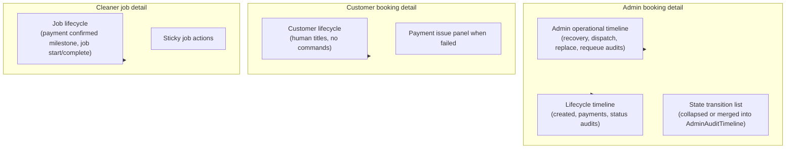

# Stage 6 — Safe UX/UI Improvements Design

**Date:** 2026-05-17  
**Status:** Design — **6A-1**, **6D-1**, and **6B** implemented (see [stage-6-ui-polish.md](../operations/stage-6-ui-polish.md))  
**Depends on:** Stage 5 completion (payment safety, assignment recovery, command convergence, notification delivery + observability, RLS hardening, retention dry-run, command-owned assignment expiry), [customer-cleaner-admin-dashboards.md](../dashboards/customer-cleaner-admin-dashboards.md), [admin-operational-dashboard.md](../operations/admin-operational-dashboard.md), [payment-failed-customer-retry.md](../operations/payment-failed-customer-retry.md)

**Goal:** Improve platform usability, clarity, mobile polish, and admin operational UX **without changing backend business logic** — presentation and read-model shaping only.

**Non-goals (this stage):** Booking lifecycle transitions, payment commands, assignment dispatch/recovery logic, notification worker/enqueue, RLS policies, earnings calculations, cron schedules, new command types, schema migrations (except optional read indexes if strictly required for export performance — defer by default).

---

## Executive summary

| Decision | Recommendation |
|----------|----------------|
| Scope boundary | UI components, copy, layout, `loading.tsx`, read-model **filtering/pagination** only — no command or worker changes |
| Highest ops friction | Admin booking detail (unmounted ops panel), capped in-memory filters, long detail scroll, no loading feedback |
| Safest first slice | **6A-1 Presentation primitives** — skeletons, empty-state parity, role-aware timeline labels, customer terminal-status copy |
| Second slice | **6D-1 Wire `AdminOperationalStatusPanel`** on booking detail (component + data already exist) |
| Filters/search | Move preset + date filters to SQL in read model; keep search as server-side `ilike` on safe fields; add honest “loaded N of cap” UX before true pagination |
| Timeline | Role-specific mappers; hide raw `command` for customer/cleaner; admin keeps ops + lifecycle sections with collapsible layout |
| CSV export | New **read-only** admin API route; same auth + field allowlist as list; hard row cap + rate limit; no service role in browser |
| Explicitly defer | DB pagination cursors, full-text search engine, notification table redesign, mobile native app shell |

---

## Current UX pain points

### Cross-cutting

| Pain point | Evidence | Impact |
|------------|----------|--------|
| No route-level loading UX | No `loading.tsx` under `(admin)`, `(customer)`, `(cleaner)`; only sign-up skeleton | Full-page blank wait on navigation and filter apply |
| Inconsistent empty states | `EmptyState` on some routes; plain `
` on customer home and admin home previews | Weak guidance when lists are empty |
| Status badge drift | `StatusBadge` + `statusLabels.ts`; notification tables use local tone helpers; assignment tone duplicated in list pages | Inconsistent colors/labels across roles |
| Timeline leaks ops detail | `buildLifecycleTimeline` sets `detail: audit.command` for all roles | Customers/cleaners see `MARK_PAYMENT_FAILED` etc. |
| Mobile = responsive Tailwind only | `DashboardShell` `max-w-5xl`, horizontal-scroll tables on admin notifications | Usable but not operationally polished on phones |

### Admin

| Pain point | Evidence | Impact |
|------------|----------|--------|
| **Operational panel not rendered** | `AdminOperationalStatusPanel.tsx` exists; `getAdminBookingDetail` returns `operational`; `[bookingId]/page.tsx` does not mount panel | Recover / manual dispatch / replace actions documented but **unreachable in UI** |
| Booking list cap + in-memory filter | `ADMIN_BOOKINGS_LIST_LIMIT = 200`; `filterAdminBookings()` after fetch | Filters/search misleading beyond 200 rows; no pagination |
| Footer copy ambiguity | “Showing X of Y loaded bookings” where Y is pre-filter load count | Operators may think Y is total in DB |
| Booking detail scroll fatigue | Lifecycle + inline state audit + `AdminOperationalTimeline` + notifications + payout | Hard to find the right section during incidents |
| Unused `AdminAuditTimeline` | Built but not imported | Drift risk; duplicate inline audit markup on detail page |
| No CSV export | Notifications page defers to SQL | Bulk ops still require Supabase console |
| Admin home empty copy | Plain text for clear queue / no recent bookings | Missed CTAs to filtered list routes |

### Customer

| Pain point | Evidence | Impact |
|------------|----------|--------|
| Home vs list inconsistency | Home omits assignment warning copy and payment-failed helper present on `/customer/bookings` | Surprises when drilling into detail |
| Internal statuses visible | `labelForCustomerBookingStatus` falls through to `labelForBookingStatus` for `payout_ready` / `paid_out` | Customers see ops-oriented “Payout ready” |
| Redundant badges on `payment_failed` | Booking failure badge + payment badge + `PaymentIssuePanel` | Visual noise |
| `/payment/failed` orphaned | `PAYMENT_FAILED_PATH` unused; Paystack callback only targets success | Weak failure journey vs booking detail retry |
| Error conflated with empty | `bookings/page.tsx` uses same `EmptyState` when `!result.ok` | Auth/read errors look like “no bookings” |
| Sorting mental model | Home: upcoming + `updatedAt`; list: `scheduled_start` desc | “Recent” ≠ “scheduled soon” |

### Cleaner (mobile-primary role)

| Pain point | Evidence | Impact |
|------------|----------|--------|
| No dedicated mobile shell | Same `DashboardShell` as customer/admin | Accept/complete actions not thumb-optimized |
| Nav inconsistency | Home shows Earnings; offers/jobs detail nav omits it | Extra taps |
| “Active jobs” heuristic | Home filters `status !== "completed"` only | `payout_ready` / `paid_out` still appear as active |
| Timeline missing payment context | `cleanerJobReadModel` passes `payments: []` to timeline builder | Cleaners lack payment-confirmed milestone |
| Offer cards not deep-linkable | Home links to `/cleaner/offers` list only | Slower offer triage on phone |

---

## Safest UI-only surfaces

These changes touch **components, copy, CSS, and `loading.tsx` only** — no read-model queries, APIs, or commands.

| Surface | Safe changes | Risk |
|---------|--------------|------|
| `StatusBadge` / tone classes | Size, contrast, optional `size="sm"`, `aria-label` | **Low** |
| `EmptyState` | Copy, CTAs, icons (no logic) | **Low** |
| `DashboardShell` | Mobile nav wrap, active link style, sticky subheader | **Low** |
| `loading.tsx` + `DashboardPageSkeleton` | Placeholder cards matching list layout | **Low** |
| `/payment/failed` | Copy, layout, links (no new payment logic) | **Low** |
| `LifecycleTimeline` presentation | Hide `detail` for non-admin; icons per `kind` | **Low** |
| Customer terminal labels | Map `payout_ready` / `paid_out` → “Completed” in `paymentFailureDisplay` or new `labelForCustomerBookingStatus` branch | **Low** |
| Admin home / customer home empty | Swap plain `
` for `EmptyState` | **Low** |
| Badge deduplication on customer detail | Hide payment badge when `payment_failed` | **Low** |
| Notification table → card stack on `sm` | CSS/layout only in existing table components | **Low–medium** (layout regression) |

### Safe with read-model **shaping only** (no new commands)

| Surface | Safe changes | Risk |
|---------|--------------|------|
| Timeline event mapper | Role-specific `detail`/`title`; optional derived assignment events from existing read-model fields | **Low–medium** |
| Admin booking filters | Apply `filter` + date range in SQL `WHERE` (same cap) | **Medium** (wrong filter = wrong list) |
| Admin search `q` | Server `ilike` on booking id prefix, customer company name (fields already on list row) | **Medium** |
| Mount `AdminOperationalStatusPanel` | Single JSX addition; actions already command-backed | **Medium** (exposes actions — intended) |
| CSV export route | SELECT-only export mapper | **Medium** (PII/cap discipline) |

### Not safe for Stage 6 (out of scope)

| Surface | Why excluded |
|---------|--------------|
| New booking/payment/assignment commands | Business logic |
| Notification requeue / retry from UI | Stage 5 governance; command-owned |
| RLS policy changes | Security stage |
| Worker/cron tuning | Operational backend |
| Real cursor pagination without design | Needs count strategy + index review |
| Auto-wire Paystack `callbackUrl` to `/payment/failed` | Payment integration / checkout contract change |

---

## Design question answers

### 1. Which areas are safest because they are presentation-only?

**Tier 0 (safest):** Skeleton loaders, empty-state parity, badge styling, customer payout label mapping, hide timeline `command` detail for non-admin, `/payment/failed` copy/layout, `DashboardShell` mobile polish, dedupe redundant customer badges.

**Tier 1 (read-model display only):** Role-aware timeline titles; cleaner timeline payment milestone from existing admin-visible payment summary fields if already on job row (or single joined payment status, not full payment rows).

**Tier 2 (read-model query shape, still no commands):** Server-side admin filters; CSV export; honest cap messaging.

### 2. Which pages currently have the highest operational friction?

| Rank | Page | Why |
|------|------|-----|
| 1 | `/admin/bookings/[bookingId]` | Ops panel not mounted; long multi-audit scroll; primary incident surface |
| 2 | `/admin/bookings` | 200-row cap + in-memory filter/search; no loading state on filter submit |
| 3 | `/admin/notifications` | Many panels; wide tables on mobile; export gap |
| 4 | `/admin/assignments` | Empty state can imply “all clear” while edge bookings exist outside queue heuristics |
| 5 | `/customer/bookings/[bookingId]` | Payment retry lives here but `/payment/failed` does not deep-link |
| 6 | `/cleaner` + `/cleaner/offers` | Mobile triage; nav/deep-link gaps |

### 3. Which filters/searches should be server-side vs client-side?

| Input | Recommendation | Rationale |
|-------|----------------|-----------|
| Admin preset filters (`payment_failed`, `recovery_needed`, …) | **Server-side SQL** | Matches ops intent; reduces wrong results within cap |
| Admin date range `from` / `to` | **Server-side SQL** on `scheduled_start` | Already URL-driven; should not fetch 200 then drop |
| Admin search `q` | **Server-side** `ilike` on allowlisted columns: booking id, customer display name, payment `provider_ref` | Avoid filtering 200 rows in memory |
| Admin sort | **Server-side** default `updated_at desc`; optional `scheduled_start` later | Single source of truth |
| Admin home previews (5 rows) | **Server-side** fetch only | Already capped |
| Client-side filter | **Defer** — only acceptable for instant toggle on **already-rendered** small lists if we add client preview later | Not needed for Stage 6 MVP |
| Customer/cleaner lists | **No search in Stage 6** | Low volume per user; RLS-scoped |

**Pagination:** Stage 6 should **not** promise full DB pagination. Phase 6C improves honesty:

- Keep `ADMIN_BOOKINGS_LIST_LIMIT` (200) initially.
- Apply filters in SQL so the 200 rows are the **newest 200 matching** the filter, not newest 200 globally then filtered.
- Footer: “Showing up to 200 bookings matching filters (newest first).”

True cursor pagination → Stage 6+ or separate “admin scale” stage.

### 4. What timeline UX should admins/customers/cleaners see?

| Role | Sections | Event sources | Hide |
|------|----------|---------------|------|
| **Admin** | (1) Lifecycle (2) Admin operations (3) Optional collapsible “State audit” | `buildLifecycleTimeline` + `admin_operational_audit` + `booking_state_audit` | Nothing critical; sanitize metadata |
| **Customer** | Single “Booking activity” timeline | created, payments, audits → customer labels | `command`, idempotency keys, raw metadata |
| **Cleaner** | Single “Job activity” timeline | created, **payment confirmed** (derived), assignment accepted, in_progress, completed | Admin ops, customer PII, payment refs |

**Implementation shape (design):**

- Add `buildRoleLifecycleTimeline({ role, ... })` wrapper or `mapLifecycleEventForRole(event, role)` in `lifecycleTimeline.ts`.
- Replace inline audit list on admin detail with `AdminAuditTimeline` **or** merge into one tabbed component `AdminBookingTimelineTabs`.
- Remove duplicate “Current:” redundancy: show current status in header badges only; timeline ends at last real event unless status changed without audit (keep one synthetic current row only when needed).

### 5. Which pages need skeleton loaders most?

| Priority | Route | Skeleton pattern |
|----------|-------|------------------|
| P0 | `/admin/bookings` | 6–8 card rows + filter bar placeholder |
| P0 | `/admin/bookings/[bookingId]` | Header + 3 section blocks |
| P0 | `/customer/bookings` | Card list |
| P0 | `/customer/bookings/[bookingId]` | Header + timeline block |
| P1 | `/cleaner/offers`, `/cleaner/jobs` | Card list |
| P1 | `/cleaner/jobs/[bookingId]` | Header + action bar placeholder |
| P1 | `/admin/assignments` | Queue cards |
| P2 | `/admin`, `/customer`, `/cleaner` home | Summary cards + 3 list placeholders |
| P2 | `/payment/failed` | Match `/payment/success` Suspense/spinner pattern for consistency |

Shared component: `DashboardPageSkeleton` in `src/components/dashboard/` (variant prop: `list | detail | summary`).

### 6. Which empty states need operational guidance?

| Location | Current | Proposed guidance |
|----------|---------|-------------------|
| `/admin/bookings` (filtered) | Generic empty | “No bookings match these filters” + **Clear filters** + link to ops summary cards |
| `/admin/assignments` | “Queue is clear” | Add caveat: “Confirmed bookings outside the queue may still need attention” + link to `?filter=assignment_attention` on bookings |
| `/admin` home (no recent) | Plain text | `EmptyState` + link to all bookings |
| `/admin/payouts` | Empty queue | Link to bookings with `payout_ready` when filter exists |
| Customer `/customer` home | Plain text | `EmptyState` + **Book a clean** CTA (match `/customer/bookings`) |
| Customer bookings (error) | Same as empty | **Separate** error panel when `!result.ok` |
| Cleaner offers | Empty | “No open offers” + link to jobs |
| Cleaner jobs | Empty | “No jobs yet” + explain offers → jobs flow |
| Notification outbox table | Plain paragraph | “No rows for filters” + suggest widening date/template filter |
| `LifecycleTimeline` | “No timeline events yet.” | Role-specific: “Activity will appear after payment or assignment updates.” |

### 7. What status badge system should be standardized?

**Single source:** extend `src/features/bookings/server/statusLabels.ts` (or `src/features/dashboards/server/badgeLabels.ts` if cross-domain) with:

| Domain | Functions | Notes |
|--------|-----------|-------|
| Booking | `labelForBookingStatus`, `toneForBookingStatus` | Existing |
| Customer booking | `labelForCustomerBookingStatus` | Add `payout_ready` / `paid_out` → “Completed” |
| Payment | `labelForPaymentStatus`, `toneForPaymentStatus` | Existing |
| Offer | `labelForOfferStatus`, `toneForOfferStatus` | Existing |
| Payout / earning | `labelForPayoutStatus`, `toneForPayoutStatus` | Existing |
| Assignment attention | `labelForAssignmentVisibilityKey` | **Single** tone helper `toneForAssignmentVisibilityKey` |
| Notification outbox | `labelForNotificationStatus`, `toneForNotificationStatus` | Move from `AdminNotificationOutboxTable` |
| Worker run | `labelForNotificationWorkerRunStatus` | Align with worker health card |

**Display rules (per card/row):**

| Role | Max primary badges | Order |
|------|-------------------|-------|
| Admin list | 3 visible + optional overflow “+1” | Booking → Payment → Assignment attention |
| Customer list | 2 | Booking → Assignment warning (hide payment if `payment_failed`) |
| Cleaner list | 2 | Booking/job status → Offer status (offers only) |

**Component enhancement (optional):** `StatusBadge` accepts `title` for tooltip with full status key for support staff.

### 8. How should mobile cleaner flows improve?

| Improvement | Type | Detail |
|-------------|------|--------|
| Sticky bottom action bar | Layout | `JobCompletionActions` / `OfferActions` fixed above safe-area on `sm` and below |
| Touch targets | A11y | Min 44×44px; full-width primary buttons on narrow screens |
| Offer card deep links | Navigation | `/cleaner/offers?highlight=` or `/cleaner/offers/[offerId]` (read-only route) — **no new commands** |
| Active jobs filter | Read-model filter | `assigned`, `in_progress` only on home “Active”; completed/payout on separate section |
| Earnings in subnav | Shell | Consistent fifth nav item on all cleaner routes |
| Pull-to-refresh | Defer | Requires client wrapper; optional 6F |
| Card density | CSS | Single-column, larger scheduled time typography |

### 9. How should CSV export work safely?

**Route:** `GET /api/admin/export/bookings.csv` (or `.json` with `Content-Disposition: attachment`).

| Control | Rule |
|---------|------|
| Auth | `requireProfileRole(["admin"])` — same as pages |
| Data access | Server Supabase user client (admin JWT), **not** service role in browser |
| Fields allowlist | Mirror `AdminBookingListItem`: id, status, payment status, customer display name, scheduled_start, updated_at, assignment visibility key, service label — **no** auth emails, tokens, raw metadata, full audit |
| Filters | Same query params as `/admin/bookings` (`filter`, `q`, `from`, `to`) |
| Row cap | `min(requested, 500)` hard max; default 200 |
| Rate limit | e.g. 10 exports / admin / hour (edge config or in-memory — document for MVP) |
| Audit | Optional `admin_operational_audit` entry `EXPORT_BOOKINGS_CSV` with filter summary — **requires new audit command type → defer to 6E-2**; MVP logs structured server log only |
| UI | “Export CSV” on `/admin/bookings` disabled when list empty; explains cap in helper text |
| Notifications export | **Defer** — separate allowlist; higher PII risk in `last_error` |

**Never export:** `recipient` raw ids linked to email, `authorization` fields, payment card data, full `metadata` JSON.

### 10. What should explicitly NOT change in Stage 6?

| Area | Do not change |
|------|----------------|
| Booking lifecycle | Status transition rules, command handlers, guards |
| Payments | Paystack initialize/verify/webhook, retry-lock, `MARK_PAYMENT_FAILED` semantics |
| Assignment | Dispatch, recovery, decline-redispatch, offer expiry **logic** |
| Notifications | Worker, enqueue, requeue commands, template delivery |
| RLS | Policies, grants, security invoker views |
| Earnings | Payout calculation, earning line creation |
| Cron | Schedules, retention dry-run execution |
| Command architecture | Facades, mutation routes, idempotency |
| Checkout URLs | Changing Paystack `callbackUrl` contract without dedicated payment stage |

---

## Proposed improvements (by primary target)

### 1. Cleaner dashboard mobile polish

- `DashboardShell` cleaner variant: bottom nav on `max-sm`, larger tap targets.
- Sticky `OfferActions` / `JobCompletionActions` on small viewports.
- Home sections: “Needs attention” (open offers) vs “Active jobs” vs “Completed recently”.
- Unify nav items across cleaner routes.

### 2. Admin booking filters/search

- Move `filterAdminBookings` predicates into SQL in `listAdminBookings`.
- Server-side `q` search on allowlisted columns.
- URL remains source of truth (`AdminBookingsFilters` unchanged UX).
- Footer honesty + link from admin home summary cards to pre-filtered list.

### 3. Booking timeline display

- `mapLifecycleEventForRole`.
- Admin: `AdminBookingTimelineTabs` — Lifecycle | Admin ops | State audit.
- Wire `AdminAuditTimeline`; remove duplicate inline markup.
- Customer/cleaner: no `command` in `detail`.

### 4. Skeleton loaders

- `DashboardPageSkeleton` + route `loading.tsx` for P0/P1 routes (see §5).

### 5. Empty states

- Standardize on `EmptyState` with operational CTAs (see §6).
- Distinct error state for customer list fetch failure.

### 6. Better status badges

- Centralize notification/worker/assignment tones.
- Customer terminal status mapping.
- List badge budget rules.

### 7. Customer dashboard clarity

- Home cards show same assignment/payment hints as list.
- Sort label: “Upcoming” vs “All bookings by date”.
- `assignedCleanerLabel` → “Cleaner assigned” (name deferred until policy allows).

### 8. `/payment/failed` redesign

| Element | Proposal |
|---------|----------|
| Layout | Match success page: icon, clear headline, supportive body |
| `reason` param | Document allowed values; map to `paymentIssuePanelCopy` keys |
| Primary CTA | If `?bookingId=` present → “View booking” → detail with retry panel |
| Secondary | “Book again” → `/customer/book` |
| Retry | **Do not** embed Paystack on failed page — link to detail only |
| Integration | **6B done** — `/payment/failed` copy + booking deep link via query params; Paystack `callbackUrl` wiring unchanged |

### 9. Admin CSV export

- See §9 above; ship in **6E** after server-side filters (6C).

### 10. Admin operational UX (critical fix)

- Mount `AdminOperationalStatusPanel` on `[bookingId]/page.tsx` with `bookingId` + `result.booking.operational`.
- Place above or beside payout actions; sticky “Suggested next step” on wide screens optional.

---

## Risk classification

| ID | Change | Risk | Mitigation |
|----|--------|------|------------|
| R1 | Mount ops panel | Medium | Actions already exist; QA accept/decline not affected; test booking with recovery eligible |
| R2 | Server-side admin filters | Medium | Parity tests: filter results match legacy `filterAdminBookings` on fixture set |
| R3 | CSV export | Medium | Allowlist columns; cap; manual inspect download |
| R4 | Timeline role mapper | Low–medium | Snapshot tests per role |
| R5 | Skeleton loaders | Low | Visual regression on key routes |
| R6 | Customer status label changes | Low | Unit tests in `paymentFailureDisplay.test.ts` |
| R7 | `/payment/failed` redesign | Low | No API changes in 6A |
| R8 | Notification table → cards | Medium | Test horizontal scroll removed without losing columns on desktop |
| R9 | SQL search `ilike` | Medium | Escape `%`; limit columns; cap rows |

---

## Phased roadmap

| Phase | ID | Deliverables | Depends on |
|-------|-----|--------------|------------|
| **6A** | Presentation primitives | Skeleton, empty states, badge tones, customer labels, hide timeline commands | — |
| **6B** | Customer payment journey | `/payment/failed` redesign; optional `bookingId` query; error vs empty on bookings | 6A |
| **6C** | Admin list read-model | SQL filters, server search, honest cap copy | — |
| **6D** | Admin detail ops UX | Mount `AdminOperationalStatusPanel`; timeline tabs; `AdminAuditTimeline` | — |
| **6E** | Admin CSV export | Export route + button | 6C |
| **6F** | Mobile polish | Cleaner sticky actions, notification cards on mobile, shell nav | 6A |

**Parallelization:** 6A and 6D-1 (panel mount) can ship independently. 6E requires 6C.

---

## Mobile-first priorities

1. Cleaner offer/job actions (sticky, full-width).
2. Admin bookings list cards (already card-based — add skeleton + filter feedback).
3. Admin notifications: responsive card view for outbox/worker tables below `md`.
4. Customer booking list + detail (thumb-friendly CTAs).
5. Admin booking detail: collapsible sections before sticky ops (avoid endless scroll on phone).

---

## Accessibility considerations

| Item | Requirement |
|------|-------------|
| Status badges | `aria-label` including machine status for screen readers |
| Skeletons | `aria-busy="true"`, `role="status"`, avoid motion > 2s without `prefers-reduced-motion` |
| Focus order | Sticky cleaner actions must not trap focus; remain in tab order after main content |
| Color | Badge tones meet contrast on zinc/amber/red backgrounds; do not rely on color alone — label text must differ |
| Tables → cards | Preserve table semantics on `md+`; cards use headings for row identity |
| Export button | `aria-describedby` for cap/limit helper text |
| Payment failed page | Single `h1`, logical heading order, link purpose clear (“View booking” not “Click here”) |

---

## Test strategy

### Unit tests

| Area | Tests |
|------|-------|
| `labelForCustomerBookingStatus` | `payout_ready` / `paid_out` → “Completed” |
| `mapLifecycleEventForRole` | Admin sees command; customer/cleaner do not |
| `toneForAssignmentVisibilityKey` | All visibility keys mapped |
| `filterAdminBookings` vs SQL | Golden fixture parity after 6C |
| CSV mapper | Column allowlist; no forbidden keys |

### Component / visual

| Area | Tests |
|------|-------|
| `DashboardPageSkeleton` | Renders list variant without layout shift |
| `EmptyState` | CTA links resolve |
| Admin timeline tabs | Keyboard navigable |

### Integration

| Area | Tests |
|------|-------|
| Export route | Non-admin → 403; admin → CSV content-type + row cap |
| `listAdminBookings` with `filter=recovery_needed` | SQL path returns subset |

### Manual QA checklist

1. Admin booking detail shows ops panel with suggested next step for recovery candidate.
2. Customer timeline has no `MARK_*` strings.
3. Filter `/admin/bookings?filter=payment_failed` returns only failed rows within cap message.
4. CSV download opens in Excel; no email columns.
5. Cleaner job detail: start/complete buttons reachable one-handed on 375px width.
6. `/payment/failed?bookingId=` navigates to detail (when implemented in 6B).
7. `loading.tsx` appears on slow 3G throttle for bookings list.

---

## Rollout strategy

| Step | Action |
|------|--------|
| 1 | Ship **6A** behind no flag (presentation-only) |
| 2 | Ship **6D-1** (ops panel) — announce in ops doc changelog |
| 3 | Ship **6C** — compare admin counts before/after on staging |
| 4 | Ship **6B** payment failed page |
| 5 | Ship **6E** CSV with rate limit; monitor export volume |
| 6 | Ship **6F** mobile tables/cards |

**Rollback:** Each phase is independently revertible via UI/routes only. No migrations required for Stage 6 MVP.

**Feature flags:** Optional `ENABLE_ADMIN_BOOKINGS_EXPORT` for 6E only; not required for 6A–6D.

---

## Final recommendation

### Safest first implementation slice: **6A-1 Presentation primitives pack**

| Deliverable | Why first |
|-------------|-----------|
| `DashboardPageSkeleton` + `loading.tsx` for `/admin/bookings`, `/customer/bookings`, `/customer/bookings/[bookingId]` | Highest traffic; zero business logic |
| Hide `audit.command` in timeline for customer/cleaner | Fixes confusing UX immediately |
| Customer `payout_ready` / `paid_out` → “Completed” labels | Aligns with Phase 10 doc intent |
| `EmptyState` on customer home + distinct error on bookings list | Low risk, high clarity |
| Admin/customer badge dedupe rules on `payment_failed` detail | Pure presentation |

**Do not bundle** CSV export or SQL filter migration in the first PR — keeps review focused and regression surface minimal.

### Second slice (highest ops value, still small): **6D-1 Mount `AdminOperationalStatusPanel`**

One file change on `src/app/(admin)/admin/bookings/[bookingId]/page.tsx` — restores documented admin workflows without new backend work.

### Third slice: **6C Server-side admin filters** before **6E CSV**.

---

## Design checklist (requirements trace)

| Requirement | Section |
|-------------|---------|
| Current UX pain points | [Current UX pain points](#current-ux-pain-points) |
| Safest UI-only surfaces | [Safest UI-only surfaces](#safest-ui-only-surfaces) |
| Proposed improvements | [Proposed improvements](#proposed-improvements-by-primary-target) |
| Risk classification | [Risk classification](#risk-classification) |
| Phased roadmap | [Phased roadmap](#phased-roadmap) |
| Mobile-first priorities | [Mobile-first priorities](#mobile-first-priorities) |
| Accessibility | [Accessibility considerations](#accessibility-considerations) |
| Test strategy | [Test strategy](#test-strategy) |
| Rollout strategy | [Rollout strategy](#rollout-strategy) |
| Final recommendation | [Final recommendation](#final-recommendation) |
| Design Q1–Q10 | [Design question answers](#design-question-answers) |

---

## Related files

| Area | Path |
|------|------|
| Admin read model | `src/features/dashboards/server/adminOperationsReadModel.ts` |
| Admin filters | `src/features/dashboards/server/adminOperationalHelpers.ts` |
| Customer read model | `src/features/dashboards/server/customerBookingReadModel.ts` |
| Cleaner read model | `src/features/dashboards/server/cleanerJobReadModel.ts` |
| Timeline builder | `src/features/dashboards/server/lifecycleTimeline.ts` |
| Status labels | `src/features/bookings/server/statusLabels.ts` |
| Customer labels | `src/features/bookings/server/paymentFailureDisplay.ts` |
| Ops panel (unmounted) | `src/components/dashboard/AdminOperationalStatusPanel.tsx` |
| Shell | `src/components/dashboard/DashboardShell.tsx` |
| Payment failed | `src/app/payment/failed/page.tsx` |
| Dashboard docs | `docs/dashboards/customer-cleaner-admin-dashboards.md` |
| Ops runbook | `docs/operations/admin-operational-dashboard.md` |
