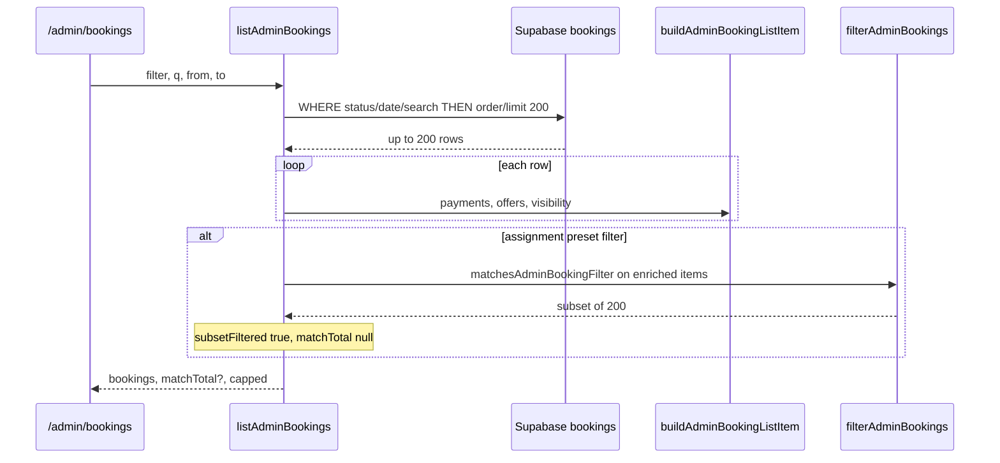

# Stage 6C-3 — Server-Side Assignment Visibility Filters Design

**Date:** 2026-05-17  
**Status:** **6C-3a/3b/3c/3d shipped** — all assignment presets on `/admin/bookings` are server-side  
**Depends on:** [stage-6c-server-side-admin-booking-filters-design.md](./stage-6c-server-side-admin-booking-filters-design.md) (6C-1 + 6C-2 shipped), [stage-6-safe-ux-ui-improvements-design.md](./stage-6-safe-ux-ui-improvements-design.md)

**Goal:** Move admin assignment visibility preset filters on `/admin/bookings` from in-memory subset filtering (after `LIMIT 200`) to server-side SQL where parity with `matchesAdminBookingFilter` / `resolveAssignmentVisibility` can be proven — **read-model / presentation only**.

**Non-goals:** Assignment engine behavior, recovery/dispatch commands, RLS, schema migrations (unless optional indexes deferred), CSV (6E), pagination, admin home summary card fixes, new filter chips.

---

## Executive summary

| Decision | Recommendation |
|----------|----------------|
| Source of truth for filter semantics | `matchesAdminBookingFilter` + `resolveAssignmentVisibility` + `computeDispatchNotStarted` / `computeRecoveryEligibility` (existing TS) |
| Safest first SQL slice (**6C-3a**) | `max_attempts` + `selected_declined` via `bookings.metadata.assignment` JSON paths on `pending_assignment` |
| Second slice (**6C-3b**) | `dispatch_not_started` via metadata reason + paid/no-cleaner/no-open-offer EXISTS (grace-aware) |
| Third slice (**6C-3c**) | `recovery_needed` as SQL union of 6C-3b predicates + recovery-candidate EXISTS |
| Broadest / last (**6C-3d**) | `assignment_attention` as OR of 6C-3a predicates + metadata `attention_required` |
| Offer-dependent visibility | `decline_redispatched`, `finding_cleaner`, `offer_sent` are **not** admin list filters today — out of scope |
| `matchTotal` | Honest only when SQL parity proven; until then optional dev-only post-enrich guard or `subsetFiltered` if any in-memory refinement remains |
| Indexes | Defer new indexes; use existing `(status, scheduled_start)`, `assignment_offers(booking_id)`, `payments(booking_id)` unless EXPLAIN shows pain |

---

## Current assignment filter behavior

### Data flow today (6C-1 + 6C-2 shipped)



### Code references

| Piece | Path | Role |
|-------|------|------|
| Filter allowlist | `src/components/dashboard/AdminBookingsFilters.tsx` | UI presets |
| In-memory matcher | `src/features/dashboards/server/adminOperationalHelpers.ts` | `matchesAdminBookingFilter`, `filterAdminBookings` |
| Visibility resolver | `src/features/assignments/server/resolveAssignmentVisibility.ts` | Derives `assignmentVisibilityKey` |
| List enrichment | `src/features/dashboards/server/adminOperationsReadModel.ts` | `buildAdminBookingListItem` loads payments + offers, sets `dispatchNotStarted`, `recoveryEligible`, visibility key |
| SQL helpers (6C-1/2) | `src/features/dashboards/server/adminBookingsListQuery.ts` | `needsInMemoryRefinement` = true for assignment presets |
| Metadata reader | `src/features/assignments/server/assignmentMetadata.ts` | `bookings.metadata.assignment` |

### `matchesAdminBookingFilter` semantics (authoritative for list filters)

| `filter` | Match condition (on enriched `AdminBookingListItem`) |
|----------|------------------------------------------------------|
| `assignment_attention` | `assignmentVisibilityKey` ∈ `needs_assignment`, `selected_declined_admin`, `max_attempts_admin` **OR** `assignmentAttention === "attention_required"` |
| `dispatch_not_started` | `assignmentVisibilityKey === "dispatch_not_started"` **OR** `dispatchNotStarted === true` |
| `selected_declined` | `assignmentVisibilityKey === "selected_declined_admin"` |
| `max_attempts` | `assignmentVisibilityKey === "max_attempts_admin"` |
| `recovery_needed` | `recoveryEligible === true` **OR** `assignmentVisibilityKey === "dispatch_not_started"` |

**Not admin list filters:** `decline_redispatched`, `finding_cleaner`, `offer_sent`, `selected_expired_admin` (visibility keys exist on detail/queue but no bookings-page preset).

### How visibility keys are computed (enrichment required)

For each booking row, `buildAdminBookingListItem`:

1. Loads **payments** (`payments.*` by `booking_id`).
2. Loads **assignment_offers** (`status`, `expires_at` by `booking_id`).
3. Computes `dispatchNotStarted` = `isDispatchNotStartedAttentionReason(reason)` **OR** `isAssignmentRecoveryCandidate(...)` (`computeDispatchNotStarted`).
4. Computes `recoveryEligible` = `computeRecoveryEligibility(...).eligibility === "eligible"` (same recovery candidate predicate, only on `confirmed` + paid).
5. Calls `resolveAssignmentVisibility({ bookingStatus, metadata, hasOpenOffer, offerStatuses, dispatchNotStarted })`.

**`hasOpenOffer`:** any offer with `status === "offered"` and `expires_at` not past now (`isOfferOpenForOps`).

**`inferLastOfferOutcome`:** prefers `metadata.assignment.lastOfferOutcome`; else infers from `reason` text or `offerStatuses` (e.g. includes `"declined"`).

### Failure mode (why 6C-3 matters)

Assignment presets still run **after** `LIMIT 200`. A `?filter=recovery_needed` deep link from `AdminOpsSummaryCards` only searches the 200 newest-by-`updated_at` bookings — same bug class 6C-1 fixed for `payment_failed`.

---

## Design question answers

### 1. Which assignment filters can be represented safely in SQL using booking columns/metadata?

| Filter | Booking columns | `metadata.assignment` JSON | Safe SQL without offers? |
|--------|-----------------|---------------------------|-------------------------|
| `max_attempts` | Usually `status = pending_assignment` | `reason` ILIKE `%maximum assignment dispatch attempts%` | **Yes** — key is reason-driven (`isMaxAttemptsReason`) |
| `selected_declined` | `status = pending_assignment` | `status = attention_required`, `path = selected`, (`lastOfferOutcome = declined` OR `reason` ILIKE `%declined%`) | **Mostly** — see offer-gap below |
| `dispatch_not_started` | `status = confirmed`, `cleaner_id IS NULL` | `reason` ILIKE `%dispatch not started%` | **Partial** — recovery path needs payments + offers |
| `recovery_needed` | Same as dispatch + recovery | Reason optional | **Partial** — union of recovery candidate + dispatch key predicates |
| `assignment_attention` | Often `pending_assignment` | `status = attention_required` and/or reason/path/outcome bundles | **Partial** — union of sub-presets; may include rows with open offers if metadata still `attention_required` |

**There is no `assignment_attention` column on `bookings`.** All assignment snapshot fields live under `bookings.metadata.assignment` (`status`, `path`, `reason`, `lastOfferOutcome`, …) per `readAssignmentMetadata`.

### 2. Which require offer history enrichment and should remain in-memory?

| Scenario | Why offers matter | Keep in-memory? |
|----------|-------------------|-----------------|
| `selected_declined` when `lastOfferOutcome` absent but `offerStatuses` includes `declined` | `inferLastOfferOutcome` falls back to offer rows | **Parity risk** — SQL may under-match; optional post-enrich guard until parity tests cover fixtures |
| `dispatch_not_started` / `recovery_needed` recovery path | `isAssignmentRecoveryCandidate` rejects open `offered` (non-expired) and `accepted` offers | **Requires** `assignment_offers` EXISTS or pre-query booking id set |
| Visibility keys `decline_redispatched`, `offer_sent`, `finding_cleaner` | Depend on `hasOpenOffer` + path + offer mix | **Not list filters** — no 6C-3 work |
| `assignment_attention` with open offer + `metadata.assignment.status = attention_required` | Matcher uses `assignmentAttention === "attention_required"` even when key is `finding_cleaner` | SQL on metadata `attention_required` **matches** this (do not require “no open offer”) |

**Recommendation:** Do not keep whole-filter in-memory once SQL parity tests pass. Use a **temporary dev-only post-enrich drop** (log drift) only during rollout, not production `subsetFiltered` for assignment presets.

### 3. Which filters need `assignment_offers` EXISTS queries?

| Filter | Needs offers? | Predicate sketch |
|--------|---------------|------------------|
| `max_attempts` | No (typical) | Metadata reason only |
| `selected_declined` | Optional fallback | Prefer metadata; optional `EXISTS (offers WHERE status = declined)` OR metadata |
| `dispatch_not_started` | **Yes** (recovery path) | `NOT EXISTS` open offer (`status = offered` AND `expires_at > now()`) AND `NOT EXISTS` accepted |
| `recovery_needed` | **Yes** (same) | Recovery candidate branch |
| `assignment_attention` | Only if mimicking visibility keys that require offer state | Prefer metadata-first OR bundle |

**Open offer SQL (mirror `isOfferOpenForOps`):**

```text
EXISTS (
  SELECT 1 FROM assignment_offers o
  WHERE o.booking_id = bookings.id
    AND o.status = 'offered'
    AND (o.expires_at IS NULL OR o.expires_at > now())
)
```

Use parameterized Supabase filters / `.not` / `.filter` — no string-interpolated SQL.

### 4. Which filters need `bookings.metadata.assignment` / assignment_attention fields?

| Field / path | Used by filters |
|--------------|-----------------|
| `metadata.assignment.status` | `assignment_attention` (as `attention_required`), `selected_declined`, components of visibility |
| `metadata.assignment.path` | `selected_declined` (`selected`) |
| `metadata.assignment.reason` | `max_attempts`, `dispatch_not_started`, decline/expired inference |
| `metadata.assignment.lastOfferOutcome` | `selected_declined` (preferred over reason text) |

PostgREST-style filters (conceptual):

- `metadata->assignment->>status` eq `attention_required`
- `metadata->assignment->>path` eq `selected`
- `metadata->assignment->>lastOfferOutcome` eq `declined`
- `metadata->assignment->>reason` ilike `%declined%` / `%maximum assignment dispatch attempts%` / `%dispatch not started%`

### 5. Which filters need recovery eligibility computation and should remain read-model only?

| Computation | Used for | SQL feasible? |
|-------------|----------|---------------|
| `isAssignmentRecoveryCandidate` | `dispatchNotStarted`, `recoveryEligible`, `recovery_needed` | **Yes** with payments + offers + grace cutoff (same as cron `findAssignmentRecoveryCandidates`) |
| `computeRecoveryEligibility` → `grace_period` | Detail UI only | **Not** part of `recovery_needed` list filter |
| `resolveAssignmentVisibility` full tree | All keys | **Partial** — dispatch branch short-circuits before `pending_assignment` checks |

**`recovery_needed` list filter** = `recoveryEligible` OR `dispatch_not_started` key — **not** the same as “grace period” or “in progress” states.

**Do not reimplement recovery commands** — only mirror read predicates for listing.

### 6. How should `matchTotal` behave for mixed server/in-memory filters?

| Mode | When | `matchTotal` | `subsetFiltered` | Footer |
|------|------|--------------|------------------|--------|
| **Honest (target)** | SQL predicates proven ≡ `matchesAdminBookingFilter` | Exact `count: exact, head: true` with same WHERE | `undefined` | “Showing X of Y matching bookings.” |
| **Rollout guard** | SQL pre-filter + post-enrich drop mismatches (dev/staging only) | Exact on SQL (may over-count if pre-filter broad) | `true` if post-filter shrinks | Loaded-subset copy (avoid in prod) |
| **Current** | Assignment presets | `null` | `true` | “Showing N matching bookings in the newest 200 loaded…” |

**Combined with 6C-2 search:** Assignment SQL must **AND** with existing search OR / status / date predicates on the same builder before count + list.

**Rule:** Once a preset is server-side, remove it from `needsInMemoryRefinement` and include it in `hasHonestMatchTotal` (same as `payment_failed` + `q` today).

### 7. Can `selected_declined` and `max_attempts` use `metadata.lastOfferOutcome`?

| Filter | `lastOfferOutcome` | Notes |
|--------|-------------------|--------|
| `selected_declined` | **Yes — primary** | Align with `resolveAssignmentVisibility`: `path = selected`, `status = attention_required`, `lastOfferOutcome = declined` OR reason contains `declined` |
| `max_attempts` | **No** | Matcher uses visibility key `max_attempts_admin` from `isMaxAttemptsReason(reason)` only — `lastOfferOutcome` irrelevant |

**Gap:** If engine wrote `declined` only to offer rows and not metadata, in-memory `inferLastOfferOutcome` still matches; SQL should add optional `EXISTS (offer declined)` OR metadata clause to close gap.

### 8. Can `dispatch_not_started` use paid + no cleaner + no offer?

**Yes for the recovery-candidate path** — that is exactly `isAssignmentRecoveryCandidate`:

- `status = confirmed`
- `cleaner_id IS NULL`
- EXISTS paid payment with `updated_at` / `created_at` older than grace window (`ASSIGNMENT_RECOVERY_GRACE_MINUTES`, default 3)
- NOT EXISTS open offer (`offered` + unexpired)
- NOT EXISTS accepted offer

**Also match** metadata reason containing `dispatch not started` (`DISPATCH_NOT_STARTED_REASON` / `isDispatchNotStartedAttentionReason`) — may apply before recovery window elapses.

**Combine with OR** in SQL to mirror `computeDispatchNotStarted`.

### 9. What indexes are needed, if any?

| Index | Status | Use |
|-------|--------|-----|
| `idx_bookings_status_scheduled_start` | **Exists** | Narrow `pending_assignment` / `confirmed` + date filters |
| `idx_assignment_offers_booking_cleaner` | **Exists** | `booking_id` lookups for EXISTS |
| `idx_payments_*` on `booking_id` | **Exists** | Paid payment EXISTS |
| `idx_payments_provider_ref` | **Exists** | 6C-2 search (orthogonal) |
| GIN on `bookings.metadata` | **Defer** | Only if JSON path filters seq-scan |
| Partial index `(status) WHERE status = confirmed` | **Defer** | Recovery/dispatch candidate scans |
| `idx_bookings_updated_at DESC` | **Defer** (6C-4 optional) | Sort already used for list cap |

**No migration required for 6C-3a.** Revisit after staging EXPLAIN on `dispatch_not_started` / `recovery_needed`.

### 10. What tests prove parity with current `filterAdminBookings`?

| Layer | Tests |
|-------|--------|
| **Golden fixtures** | Catalog of synthetic bookings: metadata variants × payment rows × offer rows → expected `matchesAdminBookingFilter` per preset |
| **Parity assertion** | For each preset: `SQL booking ids` === `filterAdminBookings(enrich(all fixtures))` ids (fixtures beyond 200, varied `updated_at`) |
| **Unit** | `buildAdminAssignmentFilterSql(filter)` → PostgREST filter fragments; date/grace boundaries |
| **Integration** | `listAdminBookings(admin, { filter })` returns only matching statuses/keys; booking outside global top-200 by `updated_at` still appears |
| **Count** | `matchTotal` equals fixture count; `capped` when count > 200 |
| **Regression** | 6C-1/2 filters unchanged; `filterAdminBookings` tests remain for fixture oracle |
| **API** | `GET /api/admin/bookings?filter=selected_declined` forwards param; non-admin 403 |
| **No behavior change** | No new tests on assignment commands, recovery cron, or RLS |

**Fixture sources:** extend `adminOperationalHelpers.test.ts` list items into full row + payment + offer shapes; add edge cases from `resolveAssignmentVisibility.test.ts` if present.

---

## SQL feasibility table (per filter)

| Filter | SQL verdict | Primary predicates | Offer/payment joins | Parity risk |
|--------|-------------|-------------------|---------------------|-------------|
| `max_attempts` | **High — ship in 6C-3a** | `status = pending_assignment` AND `metadata.assignment.reason` ILIKE max-attempts string | None | Low |
| `selected_declined` | **Medium-high — ship in 6C-3a** | `pending_assignment` + `attention_required` + `path = selected` + (`lastOfferOutcome = declined` OR reason ILIKE declined OR EXISTS declined offer) | Optional EXISTS | Medium (offer inference) |
| `dispatch_not_started` | **Medium — ship in 6C-3b** | OR(metadata reason, recovery candidate EXISTS) | Paid payment + offers | Medium (grace time, open offer expiry) |
| `recovery_needed` | **Medium — ship in 6C-3c** | OR(recovery candidate EXISTS, dispatch_not_started SQL bundle) | Same as dispatch | Medium (overlap with dispatch) |
| `assignment_attention` | **Lower — ship in 6C-3d** | OR(6C-3a bundles, `metadata.assignment.status = attention_required` on `pending_assignment`) | Light | Medium-high (broader OR) |

---

## Server-side vs in-memory decision

| Filter | Decision | Rationale |
|--------|----------|-----------|
| `max_attempts` | **Server-side** | Reason string in metadata is authoritative in engine |
| `selected_declined` | **Server-side** (+ parity tests) | Mostly metadata; optional offer EXISTS for gap closure |
| `dispatch_not_started` | **Server-side** after 6C-3b | Needs payments/offers; mirror recovery candidate |
| `recovery_needed` | **Server-side** after 6C-3c | Union of proven SQL branches |
| `assignment_attention` | **Server-side** after sub-presets | OR of proven predicates; ship last |

**Remain in-memory only if:** parity tests fail after good-faith SQL — then document drift and keep `subsetFiltered` until fixed (time-boxed).

**Remove from hot path:** `needsInMemoryRefinement` for each preset as it graduates.

---

## Query strategy

### Module layout (implementation phase — not now)

| Module | Responsibility |
|--------|----------------|
| `adminBookingsListQuery.ts` (extend) | `ASSIGNMENT_SERVER_SIDE_FILTERS`, `resolveAdminAssignmentFilterSql`, integrate into `applyAdminBookingsSqlFilters` |
| `adminAssignmentFilterSql.ts` (new, optional) | Pure builders + testable predicate trees mirroring visibility docs |
| `adminOperationsReadModel.ts` | Await assignment SQL resolution; apply before `order`/`limit`; count with identical filters |
| `adminOperationalHelpers.ts` | Keep `matchesAdminBookingFilter` as parity oracle |

### Execution order (single list query)

```text
1. normalizeAdminBookingsQuery (existing)
2. resolveAdminBookingsSearchSql (6C-2, if q)
3. resolveAdminAssignmentFilterSql (6C-3, if assignment preset)
   - may issue 1–2 helper queries (e.g. booking ids from payments) — prefer EXISTS on main query
4. applyAdminBookingsSqlFilters + applyAdminBookingsSearchSql + applyAssignmentFilterSql
5. order updated_at desc, limit 200
6. parallel count exact head with identical filters
7. enrich returned rows only
8. (dev only) optional filterAdminBookings drop + log parity drift
```

### Predicate bundles (conceptual)

**`max_attempts`:**

```text
status = pending_assignment
AND metadata.assignment.reason ILIKE '%maximum assignment dispatch attempts%'
```

**`selected_declined`:**

```text
status = pending_assignment
AND metadata.assignment.status = attention_required
AND metadata.assignment.path = selected
AND (
  metadata.assignment.lastOfferOutcome = declined
  OR metadata.assignment.reason ILIKE '%declined%'
  OR EXISTS (assignment_offers WHERE booking_id AND status = declined)
)
```

**`dispatch_not_started`:**

```text
(
  metadata.assignment.reason ILIKE '%dispatch not started%'
)
OR (
  status = confirmed AND cleaner_id IS NULL
  AND EXISTS (payments paid older than grace)
  AND NOT EXISTS (open offer)
  AND NOT EXISTS (accepted offer)
)
```

**`recovery_needed`:**

```text
( recovery_candidate_sql )
OR ( dispatch_not_started_sql )
```

Note: `recovery_candidate_sql` ≈ second branch of dispatch without requiring reason text. `recoveryEligible` excludes grace_period — candidate predicate only.

**`assignment_attention`:**

```text
( selected_declined_sql OR max_attempts_sql OR needs_assignment_sql )
```

Where `needs_assignment_sql` ≈ `pending_assignment` + `metadata.assignment.status = attention_required` (may over-include sub-states; parity test against OR of keys).

### PostgREST / Supabase constraints

- Use `.filter()` on JSON paths or `.or()` strings with encoded literals (same pattern as 6C-2).
- No raw SQL strings in application code.
- Grace cutoff: compute `now - ASSIGNMENT_RECOVERY_GRACE_MINUTES` in TS, pass ISO timestamp to `.lte` on `payments.updated_at`.
- Cap helper query results (e.g. payment pre-query) if ever needed — prefer correlated EXISTS.

---

## Count contract

| Case | `matchTotal` | `capped` | Footer |
|------|--------------|----------|--------|
| Assignment preset, exact SQL parity | Exact | `matchTotal > returnedCount` | “Showing X of Y matching bookings.” |
| + search/date/status AND | Exact on combined WHERE | Same | Same |
| Parity not yet proven (rollout) | `null` + `subsetFiltered: true` | — | Loaded-subset copy (temporary) |

**Do not** show exact `matchTotal` if post-enrich filtering still removes rows in production.

---

## Risks

| ID | Risk | Mitigation |
|----|------|------------|
| R1 | SQL bundle diverges from `resolveAssignmentVisibility` | Golden parity fixtures; dev-only drift log |
| R2 | `selected_declined` misses offer-only declined | Optional `EXISTS` declined offer; parity tests |
| R3 | Grace window uses server `now` vs cron skew | Use same constant `ASSIGNMENT_RECOVERY_GRACE_MINUTES`; document env alignment |
| R4 | Open-offer expiry boundary | Mirror `isOfferOpenForOps` exactly in SQL; fixture at expiry ±1s |
| R5 | `assignment_attention` over/under counts | Ship after sub-presets; broad OR + tests |
| R6 | Slow EXISTS on large tables | EXPLAIN in staging; defer indexes |
| R7 | Operators see count change vs 6C-2 subset copy | Ops doc + footer unchanged when honest |

---

## Phased implementation plan

| Phase | ID | Scope | Risk |
|-------|-----|-------|------|
| **6C-3a** | Metadata presets | SQL `max_attempts`, `selected_declined`; parity tests; honest `matchTotal`; remove from `needsInMemoryRefinement` | **Low** — **shipped** |
| **6C-3b** | Dispatch | SQL `dispatch_not_started` (reason + recovery EXISTS); parity with `computeDispatchNotStarted` | **Medium** — **shipped** |
| **6C-3c** | Recovery list | SQL `recovery_needed` aliases 6C-3b bundle | **Medium** — **shipped** |
| **6C-3d** | Attention bundle | SQL `assignment_attention` OR bundle; full preset parity suite | **Medium** |
| **6C-3e** (optional) | Cleanup | Remove dev post-enrich guard; deprecate assignment branch of `filterAdminBookings` in production path | **Low** |

**Parallelization:** 6C-3a can ship alone. 6C-3b/3c depend on offer/payment EXISTS patterns from 6C-3b. 6C-3d depends on 6C-3a.

**6E CSV:** Wait until assignment presets used in exports need same SQL bundles (minimum 6C-3a for parity with ops filters).

---

## Tests (checklist)

- [ ] Golden parity catalog per assignment preset
- [ ] `max_attempts`: reason-only fixture matches SQL + memory
- [ ] `selected_declined`: metadata `lastOfferOutcome` + offer-only declined fixture
- [ ] `dispatch_not_started`: reason path + recovery candidate path + grace boundary
- [ ] `recovery_needed`: eligible vs grace_period (excluded) vs dispatch key
- [ ] `assignment_attention`: union matches `matchesAdminBookingFilter`
- [ ] Integration: target booking not in global top-200 `updated_at` still returned
- [ ] `matchTotal` / `capped` with >200 matches
- [ ] Combined: `filter` + `q` + `from`/`to`
- [ ] API passthrough unchanged
- [ ] No mutation / command / RLS test changes

---

### 6C-3a implementation notes (shipped)

| Area | Path / behavior |
|------|-----------------|
| Module | `src/features/dashboards/server/adminAssignmentFilterSql.ts` |
| `max_attempts` | `status = pending_assignment` AND `metadata.assignment.reason` ILIKE `%maximum assignment dispatch attempts%` |
| `selected_declined` | `pending_assignment` + `assignment.status = attention_required` + `path = selected` + OR(`lastOfferOutcome = declined`, reason ILIKE `%declined%`, `id IN` declined-offer bookings) |
| Parity oracle | `matchesBookingRowForAssignmentFilterSql` vs `matchesAdminBookingFilter` on visibility-enriched fixtures |
| Count | Honest `matchTotal`; `subsetFiltered` cleared for these presets |
| Deferred | `assignment_attention`; no new indexes |

### 6C-3c implementation notes (shipped)

| Area | Behavior |
|------|----------|
| Filter | `filter=recovery_needed` — **aliases** `dispatch_not_started` SQL via `applyDispatchOrRecoveryNeededFilterSql` |
| Design | [stage-6c-3c-recovery-needed-server-filter-design.md](./stage-6c-3c-recovery-needed-server-filter-design.md) |

### 6C-3b implementation notes (shipped)

| Area | Behavior |
|------|----------|
| Filter | `filter=dispatch_not_started` — Branch A reason ILIKE + Branch B recovery candidate booking ids |
| Module | `adminAssignmentFilterSql.ts` (`buildRecoveryCandidateBookingIds`, `matchesDispatchNotStartedBookingRow`) |
| Count | Honest `matchTotal`; combines with 6C-1/2 filters |
| Design | [stage-6c-3b-dispatch-not-started-server-filter-design.md](./stage-6c-3b-dispatch-not-started-server-filter-design.md) |

---

## Final recommendation

### Safest smallest **6C-3** implementation slice: **6C-3a — `max_attempts` + `selected_declined`** (shipped)

Ship together in one PR:

1. **`buildAdminAssignmentFilterSql`** for `max_attempts` and `selected_declined` only (metadata JSON + optional declined-offer EXISTS).
2. Wire into **`listAdminBookings`** before `LIMIT` (alongside 6C-1/2 predicates).
3. **`matchTotal`** exact count with same WHERE; clear `subsetFiltered` for these presets.
4. **Golden parity tests** against `matchesAdminBookingFilter` on enriched fixtures (include offer-only declined edge case).
5. **Docs** update in stage-6c design + stage-6-ui-polish.

**Why this slice first:**

- Fixes the most common **admin manual-dispatch** deep links (`selected_declined`, `max_attempts`) with **low regression risk** — predicates already documented in ops runbooks as metadata-driven.
- No grace clock or paid-payment EXISTS yet (defers to 6C-3b/3c).
- Establishes assignment SQL module + parity harness for harder presets.

**Do not start with** `recovery_needed` or `assignment_attention` — broadest predicates and highest parity risk.

**Do not start with** `dispatch_not_started` alone — valuable but requires payment/offer EXISTS; best as **6C-3b** immediately after 6C-3a.

---

## References

| Artifact | Path |
|----------|------|
| Parent 6C design | `docs/architecture/stage-6c-server-side-admin-booking-filters-design.md` |
| List read model | `src/features/dashboards/server/adminOperationsReadModel.ts` |
| Filter matcher | `src/features/dashboards/server/adminOperationalHelpers.ts` |
| Visibility | `src/features/assignments/server/resolveAssignmentVisibility.ts` |
| Recovery candidate | `src/features/assignments/server/isAssignmentRecoveryCandidate.ts` |
| Metadata | `src/features/assignments/server/assignmentMetadata.ts` |
| Ops runbook | `docs/operations/admin-operational-dashboard.md` |
| Assignment decline ops | `docs/operations/assignment-decline-redispatch.md` |
