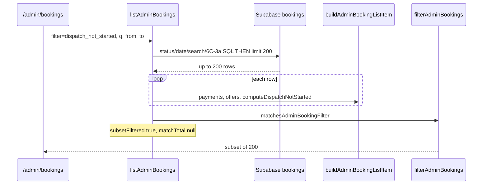

# Stage 6C-3b — Server-Side Assignment Filter: `dispatch_not_started` Design

**Date:** 2026-05-17  
**Status:** **6C-3b shipped** — `dispatch_not_started` server-side filter  
**Depends on:** [stage-6c-server-side-admin-booking-filters-design.md](./stage-6c-server-side-admin-booking-filters-design.md) (6C-1/2), [stage-6c-3-server-side-assignment-visibility-filters-design.md](./stage-6c-3-server-side-assignment-visibility-filters-design.md) (6C-3a shipped)

**Goal:** Move `filter=dispatch_not_started` on `/admin/bookings` from in-memory subset filtering (after `LIMIT 200`) to server-side SQL where parity with `computeDispatchNotStarted` / `matchesAdminBookingFilter` can be proven — **read-model / presentation only**.

**Non-goals:** Assignment engine, recovery/dispatch commands, RLS, schema migrations/indexes, CSV (6E), pagination, `recovery_needed` / `assignment_attention` (6C-3c/3d), admin home summary card fixes.

---

## Executive summary

| Question | Answer |
|----------|--------|
| Safe to graduate now? | **Yes**, with a **two-branch SQL bundle** (metadata reason OR recovery-candidate id set) and golden parity tests — same risk class as 6C-3a’s declined-offer pre-query |
| Smallest shippable slice | **Full bundle in one PR** — reason-only SQL would under-match the common “paid confirmed, past grace, no offers” path |
| Grace period | **Must be honored** on recovery path; reason path bypasses grace |
| PostgREST strategy | Pre-query helper ids (payments + offers), then `.or()` on `bookings` — not a DB migration |
| `matchTotal` | Exact count with same predicates as list query; `subsetFiltered` false |

---

## Design question answers

### 1. What is the exact current `computeDispatchNotStarted` / `matchesAdminBookingFilter` behavior?

**Authoritative matcher** (`matchesAdminBookingFilter`, filter `dispatch_not_started`):

```text
assignmentVisibilityKey === "dispatch_not_started"
OR dispatchNotStarted === true
```

**`dispatchNotStarted`** is set in `buildAdminBookingListItem` via `computeDispatchNotStarted`:

```text
dispatchNotStarted =
  isDispatchNotStartedAttentionReason(assignmentReason)
  OR isAssignmentRecoveryCandidate({ booking, payments, offers, graceMinutes })
```

| Function | Location | Semantics |
|----------|----------|-----------|
| `computeDispatchNotStarted` | `adminOperationalHelpers.ts` | Boolean OR of reason + recovery candidate |
| `isDispatchNotStartedAttentionReason` | `isAssignmentRecoveryCandidate.ts` | `reason.includes("dispatch not started")` — **case-sensitive** substring |
| `isAssignmentRecoveryCandidate` | `isAssignmentRecoveryCandidate.ts` | Paid `confirmed` booking past grace with no cleaner and no open/accepted offers |
| `resolveAssignmentVisibility` | `resolveAssignmentVisibility.ts` | If `dispatchNotStarted` **or** reason matches → `key: "dispatch_not_started"` **before** `pending_assignment` visibility tree |
| `matchesAdminBookingFilter` | `adminOperationalHelpers.ts` | Key **or** `dispatchNotStarted` flag (equivalent in practice after enrichment) |

**Canonical reason string** (written on post-payment failure):  
`"Paid but dispatch not started; assignment recovery pending."` (`DISPATCH_NOT_STARTED_REASON`)

**Visibility label:** `"Paid — dispatch not started"`

### 2. Which fields does it require?

| Path | Required data |
|------|----------------|
| **Reason** | `bookings.metadata.assignment.reason` (via `readAssignmentMetadata`) |
| **Recovery candidate** | `bookings.status`, `bookings.cleaner_id`, `payments[]` (status, `updated_at`, `created_at`), `assignment_offers[]` (`status`, `expires_at`), `now`, `ASSIGNMENT_RECOVERY_GRACE_MINUTES` |

No customer profile, audit, or command tables for the list filter.

### 3. Does it require paid payment confirmation?

| Path | Paid payment required? |
|------|------------------------|
| **Reason** | **No** — metadata alone can match (e.g. after `recordPostPaymentAssignmentDispatchFailure`) |
| **Recovery candidate** | **Yes** — `payments.some(p => p.status === "paid")` via `.find()` |

### 4. Does it require `booking.status = confirmed` or `pending_assignment`?

| Path | Status constraint |
|------|-------------------|
| **Reason** | **None** — `resolveAssignmentVisibility` evaluates dispatch **before** the `pending_assignment` branch |
| **Recovery candidate** | **`confirmed` only** — `pending_assignment` rows never match this branch |

Typical ops cases are **`confirmed`** (stuck after payment). A `pending_assignment` row can still match **only** via reason text, not via recovery candidate.

### 5. Does it require no `cleaner_id`?

| Path | `cleaner_id` |
|------|--------------|
| **Reason** | **Not checked** |
| **Recovery candidate** | **Required null** |

### 6. Does it require no offered/accepted `assignment_offers`?

| Path | Offers |
|------|--------|
| **Reason** | **Not checked** |
| **Recovery candidate** | **No accepted**; **no open offered** (`status === "offered"` AND `expires_at` not past — `isOfferOpenForOps`) |

Expired `offered` rows do **not** block. Terminal offer rows (`declined`, `expired`, `cancelled`) alone do **not** block.

### 7. Does grace period matter?

**Yes — on the recovery-candidate path only.**

| State | `isAssignmentRecoveryCandidate` | `dispatchNotStarted` | List filter match |
|-------|--------------------------------|----------------------|-------------------|
| Paid `confirmed`, inside grace (~3 min default) | `false` | `false` (unless reason set) | `false` |
| Paid `confirmed`, past grace, no blocking offers | `true` | `true` | `true` |
| Reason contains `dispatch not started` | N/A | `true` | `true` (even inside grace) |

`computeRecoveryEligibility` → `grace_period` affects detail UI copy only; it does **not** set `dispatchNotStarted` or list filter match.

Grace constant: `ASSIGNMENT_RECOVERY_GRACE_MINUTES` (env, default **3**) — `src/features/assignments/server/constants.ts`.

Paid timestamp: `new Date(paidPayment.updated_at \|\| paidPayment.created_at)` compared to `now - graceMinutes * 60_000`.

Cron pre-query (`findAssignmentRecoveryCandidates`) uses `payments.updated_at <= graceCutoffIso` — align implementation with **`isAssignmentRecoveryCandidate`** (uses `updated_at \|\| created_at`), not only cron’s `updated_at` filter, to avoid drift.

### 8. Can it be expressed safely with SQL EXISTS / NOT EXISTS?

**Yes — via application-layer id sets + PostgREST filters**, mirroring 6C-3a (`selected_declined` declined-offer pre-query).

PostgREST/Supabase JS does not expose arbitrary correlated subqueries on the main `bookings` select. Safe pattern:

1. **Resolve helper sets in TS** (service role / admin client):
   - `recoveryCandidateBookingIds` — bookings satisfying recovery branch
   - Optional: `openOfferBookingIds`, `acceptedOfferBookingIds` for exclusion
2. **Apply on bookings query:**
   - Branch A: `metadata->assignment->>reason` ILIKE `%dispatch not started%`
   - Branch B: `status=confirmed`, `cleaner_id` null, `id.in.(recoveryCandidateBookingIds)`
   - Combine: `.or(reasonFilter, id.in.(...))`
3. **AND** with existing 6C-1/2 filters (status presets, dates, `q`) on the same builder before `limit` + `count: exact`.

**Not required:** new SQL functions, views, or migrations for 6C-3b.

### 9. Should it remain in-memory if grace or payment logic is too complex?

**No — keep server-side** once parity tests pass. Grace is a single cutoff timestamp in TS; offer openness mirrors `isOfferOpenForOps` with `expires_at > now()`.

Remain in-memory only if:

- Parity tests fail and production would show wrong `matchTotal`, or
- Helper pre-queries are unbounded and need caps (mitigate with same patterns as cron batch limits + indexed columns already used by recovery cron).

**Do not** ship reason-only SQL as the final state — it would miss the majority of live rows that match only via recovery candidate (no metadata reason yet).

### 10. What parity tests are needed?

See [Parity test matrix](#parity-test-matrix). Minimum:

- New `adminDispatchFilterSql.test.ts` (or extend `adminAssignmentFilterSql.ts` module) with **pure oracle** `matchesBookingRowForDispatchFilterSql` ≡ `computeDispatchNotStarted` on fixture rows
- Golden cases from `assignmentRecovery.test.ts` (`isAssignmentRecoveryCandidate`)
- Integration tests in `adminOperationsReadModel.test.ts` (mock client, SQL before limit, honest counts)
- `adminBookingsListQuery.test.ts`: `needsInMemoryRefinement({ filter: "dispatch_not_started" }) === false`
- API route passthrough test

### 11. How should `matchTotal` behave?

Same contract as 6C-1/2/3a:

| Field | Value when `filter=dispatch_not_started` |
|-------|------------------------------------------|
| `matchTotal` | Exact DB count (`count: exact, head: true`) with **identical** WHERE as list query |
| `returnedCount` | Rows returned (≤ 200) |
| `capped` | `matchTotal > returnedCount` |
| `subsetFiltered` | **Omitted / false** — no in-memory `filterAdminBookings` |
| Footer | `adminBookingsFooterCopy` — “Showing X of Y matching bookings…” |

Combined filters (`q`, `from`/`to`, `payment_failed`, etc.) must AND into both count and list.

**Do not** emit exact `matchTotal` while post-enrich filtering still drops rows in production.

### 12. What should be deferred?

| Item | Stage | Why |
|------|-------|-----|
| `recovery_needed` | 6C-3c | Union of `recoveryEligible` + dispatch; reuse 6C-3b recovery id resolution |
| `assignment_attention` | 6C-3d | OR of 6C-3a presets + metadata; depends on stable sub-predicates |
| DB indexes on `payments(updated_at)`, `assignment_offers(booking_id, status)` | Post-EXPLAIN | No migration in 6C-3b |
| Admin home / summary `matchTotal` beyond list cap | Out of 6C | Separate scope |
| Customer email in search | Deferred | 6C-2 note |
| CSV / pagination | 6E | — |

---

## Current behavior inventory

### Data flow today (after 6C-3a)



### Code references

| Piece | Path |
|-------|------|
| Filter allowlist | `AdminBookingsFilters.tsx`, `admin/bookings/page.tsx`, `api/admin/bookings/route.ts` |
| `computeDispatchNotStarted` | `adminOperationalHelpers.ts` |
| Recovery predicate | `isAssignmentRecoveryCandidate.ts` |
| Visibility | `resolveAssignmentVisibility.ts` (early `dispatch_not_started` return) |
| Cron alignment | `findAssignmentRecoveryCandidates.ts` |
| In-memory gate | `adminBookingsListQuery.ts` → `needsInMemoryRefinement` still **true** for `dispatch_not_started` |
| 6C-3a pattern | `adminAssignmentFilterSql.ts` |

### Failure mode (same class as pre-6C-1)

`?filter=dispatch_not_started` only searches the **200 newest-by-`updated_at`** bookings after other SQL filters. Stuck paid bookings older in the sort order are invisible — ops deep links and summary cards under-count.

---

## SQL feasibility decision

| Criterion | Assessment |
|-----------|------------|
| Parity with TS | **Achievable** — two explicit branches mirror `computeDispatchNotStarted` |
| Grace | **Expressible** — `graceCutoff = now - graceMinutes` in TS; filter payments/bookings by paid timestamp |
| Offers | **Expressible** — pre-query open (`offered` + `expires_at > now`) and `accepted` booking ids to exclude |
| RLS | **Unchanged** — admin session already reads `payments` / `assignment_offers` in enrichment |
| Performance | **Acceptable for 6C-3b** — 2–3 helper queries per list request (same order as per-row enrichment today, but batched); revisit indexes after EXPLAIN |
| PostgREST limits | **Workaround** — id sets + `.or()` / `.in()` like 6C-3a |

**Decision:** **Proceed with server-side filtering in 6C-3b** using helper pre-queries + bookings `.or()`. Do **not** defer whole filter to in-memory unless parity tests fail.

---

## Proposed SQL predicate

### Branch A — Metadata reason (any status)

```text
metadata->assignment->>reason ILIKE '%dispatch not started%'
```

**Parity note:** TS uses case-sensitive `.includes("dispatch not started")`. Prefer ILIKE with lowercase fragment for stability; document acceptable negligible case drift, or use `.filter(..., "like", ...)` if PostgREST supports case-sensitive like.

Matches `DISPATCH_NOT_STARTED_REASON` and manual/audit variants containing that substring.

### Branch B — Recovery candidate

**Step B1 — Paid past grace (helper query on `payments`):**

```text
status = 'paid'
AND coalesce(updated_at, created_at) <= graceCutoffIso
```

Collect distinct `booking_id` values. When multiple paid rows exist, apply **`payments.find(p => p.status === 'paid')`** semantics in TS when building the candidate set (document order: match enrichment — first paid row in array returned by query; consider `order by updated_at desc` + distinct on `booking_id` for stability).

**Step B2 — Exclude offer blockers (helper queries on `assignment_offers`):**

```text
open: status = 'offered' AND (expires_at IS NULL OR expires_at > now())
accepted: status = 'accepted'
```

**Step B3 — Bookings filter:**

```text
status = 'confirmed'
AND cleaner_id IS NULL
AND id IN recoveryCandidateBookingIds
```

Where:

```text
recoveryCandidateBookingIds =
  paidPastGraceBookingIds
  MINUS openOfferBookingIds
  MINUS acceptedOfferBookingIds
```

(Compute set difference in TS.)

### Combined bookings WHERE

```text
( branch_A_reason )
OR ( branch_B_recovery )
```

Then **AND** with existing `applyAdminBookingsSqlFilters` + search + assignment 6C-3a filters (if ever combined — mutually exclusive filter param today).

### Module shape (implementation guide — not built in design stage)

| Piece | Suggested location |
|-------|-------------------|
| `resolveAdminDispatchFilterSql(client, filter, now?)` | Extend `adminAssignmentFilterSql.ts` or `adminDispatchFilterSql.ts` |
| `applyAdminDispatchFilterSql(builder, dispatchSql)` | Same |
| `matchesBookingRowForDispatchFilterSql(row, payments, offers, now?)` | Parity oracle for tests |
| Wire into `resolveAdminAssignmentFilterSql` / `applyAdminAssignmentFilterSql` | `adminBookingsListQuery.ts`, `adminOperationsReadModel.ts` |
| Extend `SERVER_SIDE_ASSIGNMENT_FILTERS` / `isServerSideAdminBookingFilter` | Include `dispatch_not_started` |

### Proposed resolver flow

```text
1. normalizeAdminBookingsQuery
2. resolveAdminBookingsSearchSql (if q)
3. resolveAdminAssignmentFilterSql (6C-3a presets)
4. resolveAdminDispatchFilterSql (if filter === dispatch_not_started)  ← new
5. applyAdminBookingsSqlFilters + search + assignment + dispatch
6. order updated_at desc, limit 200
7. parallel count exact
8. enrich rows only (no filterAdminBookings for this preset)
```

---

## Cases that must remain excluded

| Scenario | Must NOT match `dispatch_not_started` | Why |
|----------|--------------------------------------|-----|
| Paid `confirmed`, inside grace, no reason | ✓ excluded | Recovery candidate false; ops should wait |
| Paid `confirmed`, open `offered` not expired | ✓ excluded | Dispatch in progress |
| Paid `confirmed`, `accepted` offer | ✓ excluded | Assignment progressing |
| `cleaner_id` set | ✓ excluded (recovery path) | Already assigned |
| `pending_assignment` + max attempts reason | ✓ excluded | Visibility → `max_attempts_admin`; not dispatch |
| `pending_assignment` + selected declined | ✓ excluded | Visibility → `selected_declined_admin` |
| `payment_failed` | ✓ excluded (typical) | Unless erroneous reason substring — rare |
| Unpaid `confirmed` | ✓ excluded (recovery path) | No paid payment |
| `cancelled` / `completed` / etc. | ✓ excluded (recovery path) | Wrong status |
| Auto-decline redispatch in progress (`finding_cleaner`, `offer_sent`) | ✓ excluded | Open offer or non-dispatch visibility |
| Ordinary `pending_assignment` needs_assignment | ✓ excluded | No dispatch reason; not confirmed candidate |

**Included (must match):**

| Scenario | Match via |
|----------|-----------|
| Post-payment failure metadata reason | Branch A |
| Paid `confirmed`, past grace, no cleaner, no open/accepted offers | Branch B |
| Same as cron `findAssignmentRecoveryCandidates` | Branch B (parity with `isAssignmentRecoveryCandidate`) |
| Expired offers only, past grace | Branch B |

---

## Parity test matrix

| # | Fixture | Payments | Offers | Status | Reason | Expected |
|---|---------|----------|--------|--------|--------|----------|
| 1 | Recovery golden | paid, past grace | none | `confirmed` | null | **true** |
| 2 | Inside grace | paid, 1 min ago | none | `confirmed` | null | **false** |
| 3 | Open offer | paid, past grace | `offered`, future `expires_at` | `confirmed` | null | **false** |
| 4 | Accepted offer | paid, past grace | `accepted` | `confirmed` | null | **false** |
| 5 | Cleaner assigned | paid, past grace | none | `confirmed` | cleaner set | **false** |
| 6 | Reason only | none | none | `pending_assignment` | `DISPATCH_NOT_STARTED_REASON` | **true** |
| 7 | Max attempts | any | any | `pending_assignment` | max attempts string | **false** |
| 8 | Selected declined | any | declined | `pending_assignment` | declined | **false** |
| 9 | Expired offer only | paid, past grace | `offered`, past `expires_at` | `confirmed` | null | **true** |
| 10 | `payment_failed` | failed | none | `payment_failed` | null | **false** |
| 11 | Mixed `q` + dispatch | — | — | `confirmed` | — | SQL **AND** search; count = intersection |
| 12 | Date range + dispatch | — | — | `confirmed` | — | `scheduled_start` bounds **AND** dispatch predicate |

**Assertions per case:**

- `matchesBookingRowForDispatchFilterSql(...) === computeDispatchNotStarted(...)`
- `matchesAdminBookingFilter(enrichedItem, "dispatch_not_started")` when enriched from same fixture
- `resolveAssignmentVisibility(...).key === "dispatch_not_started"` iff expected (visibility parity)

**Integration:**

- Mock Supabase: helper queries return ids → list query `.or()` applied **before** `.limit(200)`
- `matchTotal` / `returnedCount` / `capped` / no `subsetFiltered`

---

## Count contract

| Field | `filter=dispatch_not_started` (target) |
|-------|----------------------------------------|
| `matchTotal` | Exact |
| `returnedCount` | `bookings.length` |
| `capped` | `matchTotal > 200` |
| `subsetFiltered` | **undefined** |
| `hasHonestMatchTotal` | **true** |
| Footer | Exact copy via `adminBookingsFooterCopy` |

Rollout guard (staging only, optional): if post-enrich drift detected, log and keep `subsetFiltered: true` — **do not** use in production once parity green.

---

## Risks and mitigations

| ID | Risk | Mitigation |
|----|------|------------|
| R1 | Helper id query unbounded | Cap helper rows (e.g. 2000) + monitor; same tables cron uses |
| R2 | `payments.find` vs cron `updated_at` cutoff drift | Single shared helper `buildRecoveryCandidateBookingIds()` used by list SQL + tests; document `updated_at \|\| created_at` |
| R3 | ILIKE reason over-matches case variants | Accept or use case-sensitive filter; test canonical `DISPATCH_NOT_STARTED_REASON` |
| R4 | Reason branch matches non-ops statuses | Parity with TS (intentional); ops rarely rely on this |
| R5 | `expires_at IS NULL` treated as open | Mirror `isOfferOpenForOps` exactly in open-offer pre-query |
| R6 | Count/list predicate mismatch | One resolver object applied to both builders |
| R7 | Performance on large offer tables | Defer indexes; batch helper queries; EXPLAIN in staging |

---

## Implementation checklist (6C-3b — shipped)

- [x] Dispatch SQL + parity oracle in `adminAssignmentFilterSql.ts`
- [x] `dispatch_not_started` in `SERVER_SIDE_ASSIGNMENT_FILTERS`; removed from `needsInMemoryRefinement`
- [x] `listAdminBookings` + exact count query wired
- [x] Golden + integration tests (parity matrix + outside top-200)
- [x] API route passthrough test
- [x] Docs updated

**Unchanged:** assignment commands, recovery cron route, RLS, `ASSIGNMENT_RECOVERY_GRACE_MINUTES` behavior. No migrations/indexes.

### 6C-3b implementation notes (shipped)

| Area | Behavior |
|------|----------|
| Branch A | `metadata->assignment->>reason` ILIKE `%dispatch not started%` |
| Branch B | `buildRecoveryCandidateBookingIds` (paid past grace, exclude open `offered` + `accepted`) + `.or(..., and(status.eq.confirmed,cleaner_id.is.null,id.in.(...)))` |
| Parity oracle | `matchesDispatchNotStartedBookingRow` ≡ `computeDispatchNotStarted` |
| Count | Honest `matchTotal`; no `subsetFiltered` |
| Deferred | `recovery_needed`, `assignment_attention`; indexes |

---

## Final recommendation

### Is `dispatch_not_started` safe to graduate to server-side filtering now?

**Yes.** Predicates are documented, bounded, and aligned with existing cron recovery detection. The main work is **batched helper queries + parity tests**, not new business rules.

### Smallest implementation slice

| Slice | Scope | Ship alone? |
|-------|-------|-------------|
| **A — Reason only** | Branch A ILIKE on `metadata.assignment.reason` | **No** — under-matches live queue |
| **B — Full 6C-3b (recommended)** | Branch A + Branch B (recovery id set with grace + offer exclusions) | **Yes** — single PR |
| **C — + shared recovery helper** | Extract `buildRecoveryCandidateBookingIds` for cron/list parity | Optional refactor in same PR |

**Recommended:** Ship **slice B** in one change set, reusing patterns from `adminAssignmentFilterSql.ts` (6C-3a). Add `dispatch_not_started` to `SERVER_SIDE_ASSIGNMENT_FILTERS` and remove from `needsInMemoryRefinement`.

**Do not** block on migrations. Revisit indexes only if staging EXPLAIN shows list latency regression.

### Answer to design questions 8–9 (short)

- **SQL EXISTS:** express via **pre-query id sets**, not inline SQL migrations.  
- **In-memory fallback:** only during failed parity rollout — not the target state.

---

## Related docs

- [assignment-recovery.md](../operations/assignment-recovery.md) — detection rules (ops source of truth)
- [stage-6c-3-server-side-assignment-visibility-filters-design.md](./stage-6c-3-server-side-assignment-visibility-filters-design.md) — parent 6C-3 plan
- [stage-6-ui-polish.md](../operations/stage-6-ui-polish.md) — UI count contract
