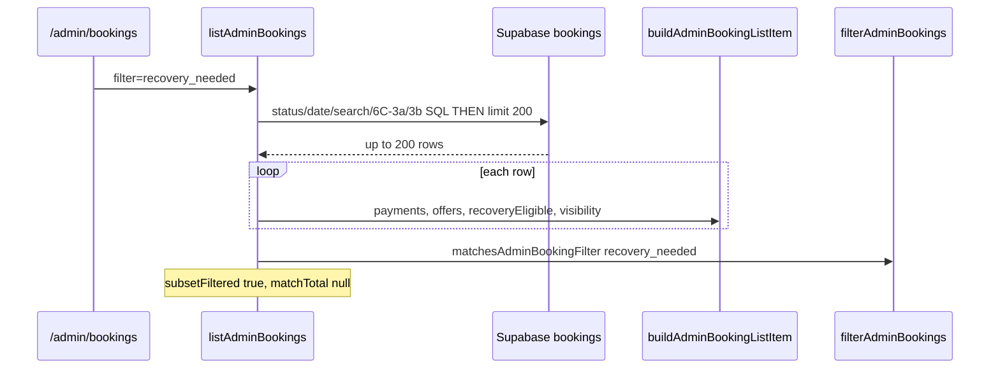

# Stage 6C-3c — Server-Side Assignment Filter: `recovery_needed` Design

**Date:** 2026-05-17  
**Status:** **6C-3c shipped** — `recovery_needed` server-side filter (aliases 6C-3b predicate bundle)  
**Depends on:** [stage-6c-server-side-admin-booking-filters-design.md](./stage-6c-server-side-admin-booking-filters-design.md) (6C-1/2), [stage-6c-3-server-side-assignment-visibility-filters-design.md](./stage-6c-3-server-side-assignment-visibility-filters-design.md) (6C-3a/3b shipped), [stage-6c-3b-dispatch-not-started-server-filter-design.md](./stage-6c-3b-dispatch-not-started-server-filter-design.md) (6C-3b shipped)

**Goal:** Decide whether `filter=recovery_needed` on `/admin/bookings` can move from in-memory subset filtering (after `LIMIT 200`) to server-side SQL with exact `matchTotal` — **read-model / presentation only**.

**Non-goals:** Recovery commands, assignment engine, RLS, migrations/indexes, CSV/pagination, `assignment_attention` (6C-3d), admin home summary card totals beyond list scope.

---

## Executive summary

| Question | Answer |
|----------|--------|
| Safe to graduate now? | **Yes — high confidence** after 6C-3b; list predicate is **equivalent** to `dispatch_not_started` SQL bundle for enriched rows |
| Smallest slice | **Reuse** `buildRecoveryCandidateBookingIds` + same `.or()` as 6C-3b (extract shared helper); add `recovery_needed` to `SERVER_SIDE_ASSIGNMENT_FILTERS`; parity tests proving ≡ `matchesAdminBookingFilter` |
| Overlap with 6C-3b | **Full** — Branch B = `isAssignmentRecoveryCandidate`; Branch A covers visibility `dispatch_not_started` / reason path |
| `matchTotal` | **Exact** — same count contract as 6C-3a/3b |
| Remain in-memory | Only `assignment_attention` after 6C-3c |

---

## Design question answers

### 1. What exact function defines `recovery_needed`?

**Authoritative list matcher:** `matchesAdminBookingFilter` (`adminOperationalHelpers.ts`), case `recovery_needed`:

```text
item.recoveryEligible === true
OR item.assignmentVisibilityKey === "dispatch_not_started"
```

**Supporting computations** (set during `buildAdminBookingListItem` in `adminOperationsReadModel.ts`):

| Field | Source |
|-------|--------|
| `recoveryEligible` | `computeRecoveryEligibility(...).eligibility === "eligible"` |
| `assignmentVisibilityKey` | `resolveAssignmentVisibility(...).key` |

**Admin home summary** (`computeAdminOperationsSummary`) uses the **same union**:

```text
b.recoveryEligible || b.assignmentVisibilityKey === "dispatch_not_started"
```

There is no separate `matchesRecoveryNeeded` function — the filter is this two-term OR on enriched list items.

### 2. Is it identical to `isAssignmentRecoveryCandidate` or `recoveryEligibility === "eligible"`?

**Not identical to `isAssignmentRecoveryCandidate` alone.**

| Predicate | Scope |
|-----------|--------|
| `isAssignmentRecoveryCandidate` | Paid `confirmed`, no cleaner, past grace, no open/accepted offers — **subset** of `recovery_needed` |
| `recoveryEligibility === "eligible"` | **Same** as `isAssignmentRecoveryCandidate` when `bookingStatus === "confirmed"` and `cleanerId` is null (see `computeRecoveryEligibility`) |
| **`recovery_needed` list filter** | **`eligible` OR `assignmentVisibilityKey === "dispatch_not_started"`** |

The second disjunct adds bookings that show the **dispatch-not-started visibility badge** but are **not** `eligible` (e.g. inside grace with `DISPATCH_NOT_STARTED_REASON` metadata, or reason-only on non-`confirmed` status).

**`computeRecoveryEligibility` states excluded from `recovery_needed`:**

| `eligibility` | In `recovery_needed`? |
|---------------|----------------------|
| `eligible` | **Yes** (via `recoveryEligible`) |
| `grace_period` | **No** (unless visibility key is `dispatch_not_started` via reason) |
| `in_progress` | **No** |
| `not_applicable` | **No** (unless key is `dispatch_not_started`) |

### 3. Which SQL predicates are needed?

**Same bundle as 6C-3b `dispatch_not_started`:**

**Branch A — metadata / visibility reason path**

```text
metadata->assignment->>reason ILIKE '%dispatch not started%'
```

**Branch B — recovery candidate path**

```text
status = confirmed
AND cleaner_id IS NULL
AND id IN (recoveryCandidateBookingIds)
```

Where `recoveryCandidateBookingIds` = output of `buildRecoveryCandidateBookingIds()` (paid past grace, minus open `offered` / `accepted` offers).

**Combined bookings WHERE:**

```text
( branch_A_reason )
OR ( branch_B_recovery )
```

No third branch required for `recovery_needed` if parity with enriched `matchesAdminBookingFilter` is the goal.

### 4. Does it overlap with `dispatch_not_started` Branch B?

**Yes — Branch B is exactly the `isAssignmentRecoveryCandidate` / `recoveryEligible === "eligible"` path** (for `confirmed` bookings).

| Path | `dispatch_not_started` (6C-3b) | `recovery_needed` |
|------|-------------------------------|-------------------|
| Branch B (recovery ids) | Yes | Yes (`recoveryEligible`) |
| Branch A (reason ILIKE) | Yes | Yes (`key === "dispatch_not_started"`, includes grace + reason-only cases) |

### 5. Should `recovery_needed` reuse `buildRecoveryCandidateBookingIds`?

**Yes — mandatory reuse.** Already implemented in `adminAssignmentFilterSql.ts` for 6C-3b.

| Helper | Role |
|--------|------|
| `buildRecoveryCandidateBookingIds(client, { now?, graceMinutes? })` | Pre-query paid payments + all offers; return booking ids for Branch B |
| Shared `applyDispatchOrRecoveryFilterSql(builder, recoveryCandidateBookingIds)` | Apply Branch A + Branch B `.or()` (extract from 6C-3b `dispatch_not_started` case to avoid duplication) |

`resolveAdminAssignmentFilterSql` for `recovery_needed` should call the same resolver as `dispatch_not_started` (identical `AdminAssignmentFilterSql` payload: `recoveryCandidateBookingIds` only; filter label may differ for logging/tests).

### 6. What differences exist between “dispatch not started” and “recovery needed”?

**UI / ops semantics differ; list filter predicates are equivalent after enrichment.**

| Aspect | `dispatch_not_started` | `recovery_needed` |
|--------|------------------------|-------------------|
| **Matcher** | `key === "dispatch_not_started"` **OR** `dispatchNotStarted === true` | `recoveryEligible` **OR** `key === "dispatch_not_started"` |
| **Ops label** | “Paid — dispatch not started” | “Recovery needed” (filter + home card) |
| **Detail panel** | `computeDispatchNotStarted`, recovery runbook | `computeRecoveryEligibility` → eligible / grace_period / in_progress |
| **Cron** | Same recovery candidate detection | Deep link to list filter |

**Enrichment invariant:** For rows built by `buildAdminBookingListItem`, when `recoveryEligible === true`, `computeDispatchNotStarted` is true and `assignmentVisibilityKey === "dispatch_not_started"`. When `key === "dispatch_not_started"`, `matchesAdminBookingFilter(..., "dispatch_not_started")` is true.

**Therefore:** Any row matching `recovery_needed` also matches `dispatch_not_started`, and vice versa, for consistently enriched items.

**Matcher asymmetry (theoretical only):** `recovery_needed` does not read `dispatchNotStarted`; `dispatch_not_started` does not read `recoveryEligible`. Equivalence holds because visibility + eligibility are computed from the same payment/offer/reason inputs.

### 7. How should grace period be handled?

| Path | Grace |
|------|--------|
| **Branch B** (`isAssignmentRecoveryCandidate`) | **Inside grace → excluded** (`paidAt` within `ASSIGNMENT_RECOVERY_GRACE_MINUTES`, default 3) |
| **Branch A** (reason ILIKE) | **Grace bypass** — metadata reason can match before grace elapses |
| **`grace_period` eligibility** | **Excluded** from `recovery_needed` unless Branch A or key matches |

Same as 6C-3b. Do **not** SQL-filter `grace_period` rows without reason — they correctly **fail** both filters.

### 8. What should happen with `pending_assignment` rows?

| Case | `recovery_needed` |
|------|-------------------|
| `pending_assignment`, no dispatch reason | **false** — not `confirmed`; `recoveryEligible` false; key not `dispatch_not_started` |
| `pending_assignment` + `DISPATCH_NOT_STARTED_REASON` | **true** — visibility short-circuit → `key === "dispatch_not_started"`; Branch A SQL matches |
| `pending_assignment` + max_attempts / selected declined | **false** — different visibility keys |

**No** broad `pending_assignment` SQL branch for this filter.

### 9. What payment statuses qualify?

| Status | Qualifies |
|--------|-----------|
| `paid` | **Yes** — `payments.find(p => p.status === "paid")` / Branch B pre-query `.eq("status", "paid")` |
| `initialized`, `pending`, `failed`, `refunded` | **No** |

Unpaid `confirmed` → `recoveryEligible` not applicable; no Branch B id unless Branch A reason exists.

### 10. What offer statuses exclude recovery?

Mirror `computeRecoveryEligibility` + `isAssignmentRecoveryCandidate` + `isOfferOpenForOps`:

| Offer state | Effect |
|-------------|--------|
| `offered` + `expires_at` in the future (or null per `isOfferOpenForOps`) | **Blocks** — `in_progress` / excluded from candidate ids |
| `accepted` | **Blocks** |
| `declined`, `expired`, `cancelled` | **Does not block** (unless also an open `offered` row) |
| `offered` + past `expires_at` | **Does not block** |

Same exclusion set as `buildRecoveryCandidateBookingIds` (6C-3b).

### 11. Can `matchTotal` be exact?

**Yes.** Apply the same WHERE to list + `count: exact, head: true`; set `subsetFiltered` false; use honest footer copy — identical contract to 6C-3a/3b.

Combined with 6C-2 `q` and 6C-1 date/status filters: AND into both queries.

**Out of scope:** Admin home `recoveryNeededTotal` still counts only loaded preview bookings until a separate home-summary project — not a blocker for list filter `matchTotal`.

### 12. What parity tests are required?

See [Parity test matrix](#parity-test-matrix). Minimum:

1. **Equivalence suite:** For each fixture, assert  
   `matchesRecoveryNeededOracle(row) === matchesAdminBookingFilter(enrichedItem, "recovery_needed")`  
   **and**  
   `matchesRecoveryNeededOracle(row) === matchesDispatchNotStartedBookingRow(row, ctx)` (6C-3b oracle).
2. **Negative cases:** grace without reason, open offer, accepted, inside grace, max_attempts, selected_declined, unpaid, terminal status.
3. **Positive cases:** eligible candidate, reason-only, reason + grace, outside top-200 integration.
4. **Combined:** `recovery_needed` + `q` + date range.
5. **API:** `?filter=recovery_needed` passthrough.
6. **Classification:** `needsInMemoryRefinement({ filter: "recovery_needed" }) === false`.

### 13. What should remain in-memory?

| Item | After 6C-3c |
|------|-------------|
| `assignment_attention` | **Yes** — 6C-3d |
| `recovery_needed` | **No** — move to SQL |
| `filterAdminBookings` for assignment presets | Production path skips when `!needsInMemoryRefinement` |

Optional dev-only post-enrich drift log during rollout — not production `subsetFiltered`.

### 14. What should be deferred to 6C-3d?

| Item | Stage |
|------|-------|
| `assignment_attention` | 6C-3d — OR of 6C-3a presets + `metadata.assignment.status = attention_required` |
| DB indexes / GIN on metadata | Post-EXPLAIN |
| Admin home summary exact totals | Out of 6C list scope |
| CSV / pagination | 6E |
| Refactor cron to import `buildRecoveryCandidateBookingIds` | Optional hygiene, not required for 6C-3c |

---

## Current behavior inventory

### Data flow today (after 6C-3b)



### Code references

| Piece | Path |
|-------|------|
| Matcher | `adminOperationalHelpers.ts` — `matchesAdminBookingFilter`, `computeRecoveryEligibility` |
| Recovery candidate | `isAssignmentRecoveryCandidate.ts` |
| Dispatch / visibility | `resolveAssignmentVisibility.ts`, `computeDispatchNotStarted` |
| 6C-3b SQL | `adminAssignmentFilterSql.ts` — `buildRecoveryCandidateBookingIds`, `applyAdminAssignmentFilterSql` |
| In-memory gate | `adminBookingsListQuery.ts` — `needsInMemoryRefinement` **true** for `recovery_needed` |
| Deep link | `AdminOpsSummaryCards.tsx` → `/admin/bookings?filter=recovery_needed` |

### Failure mode

Same as pre-6C-3 presets: `?filter=recovery_needed` only searches **200 newest-by-`updated_at`** after other SQL filters — stuck recovery bookings can be missing from deep links.

---

## Overlap with `dispatch_not_started`

```text
recovery_needed
├── recoveryEligible === true
│   └── computeRecoveryEligibility.eligible
│       └── isAssignmentRecoveryCandidate (confirmed, paid, past grace, no blocking offers)
│           └── ≡ dispatch_not_started Branch B (for confirmed)
└── assignmentVisibilityKey === "dispatch_not_started"
    └── resolveAssignmentVisibility early return
        └── dispatchNotStarted OR reason contains "dispatch not started"
            └── ≡ dispatch_not_started Branch A (+ Branch B when candidate)
```

**SQL implication:** Do not invent a new predicate. **Alias `recovery_needed` to the shipped 6C-3b bundle.**

| Filter | SQL WHERE (conceptual) |
|--------|------------------------|
| `dispatch_not_started` | `OR(reason_ilike, confirmed ∧ ¬cleaner ∧ id ∈ recoveryIds)` |
| `recovery_needed` | **Same** |

**Count note:** `matchTotal` for `recovery_needed` and `dispatch_not_started` should be **equal** on the same database snapshot (same booking set). UI labels differ; filters are ops aliases.

---

## Proposed SQL / pre-query strategy

### Resolver flow (6C-3c)

```text
1. normalizeAdminBookingsQuery
2. resolveAdminBookingsSearchSql (if q)
3. resolveAdminAssignmentFilterSql (if recovery_needed)
   → buildRecoveryCandidateBookingIds(client)   // same as 6C-3b
4. applyAdminBookingsSqlFilters + search + assignment
   → applyRecoveryNeededFilterSql(builder, recoveryCandidateBookingIds)
       // identical .or() to dispatch_not_started
5. order updated_at desc, limit 200
6. parallel count exact
7. enrich rows only (no filterAdminBookings)
```

### Module changes (implementation guide — not built in design stage)

| Change | Detail |
|--------|--------|
| `SERVER_SIDE_ASSIGNMENT_FILTERS` | Add `recovery_needed` |
| `ServerSideAssignmentFilter` / `AdminAssignmentFilterSql` | Add `"recovery_needed"` or use shared `dispatchOrRecovery` mode |
| `resolveAdminAssignmentFilterSql` | `recovery_needed` → same payload as `dispatch_not_started` |
| `applyAdminAssignmentFilterSql` | Extract `applyDispatchNotStartedOrRecoverySql(builder, recoveryIds)`; call for both filters |
| `matchesRecoveryNeededBookingRow` | Parity oracle: `eligible || key dispatch` or delegate to dispatch oracle + prove equivalence |
| `needsInMemoryRefinement` | `false` for `recovery_needed` |

**No new migrations. No RLS changes. No command changes.**

---

## Exact eligibility rules (reference)

A booking appears in `filter=recovery_needed` when **either**:

**Rule R1 — Recovery eligible**

- `bookings.status = confirmed`
- `bookings.cleaner_id IS NULL`
- At least one `payments.status = paid` with `coalesce(updated_at, created_at)` ≤ `now - ASSIGNMENT_RECOVERY_GRACE_MINUTES`
- No `assignment_offers` row with `status = accepted`
- No open `assignment_offers` row (`status = offered` AND not past `expires_at` per `isOfferOpenForOps`)

**Rule R2 — Dispatch-not-started visibility**

- `assignmentVisibilityKey === "dispatch_not_started"` after enrichment

**Practical SQL (Rule R2 without enrichment):**

- `metadata.assignment.reason` ILIKE `%dispatch not started%` (covers canonical `DISPATCH_NOT_STARTED_REASON` and variants)

**Explicit exclusions**

- `payment_failed`, unpaid `confirmed`, `completed`, `cancelled`, etc. (unless Rule R2 reason)
- Inside grace **without** dispatch reason
- Open or accepted offers (Rule R1; Rule R2 may still apply if reason set)
- Ordinary `pending_assignment` attention (max attempts, selected declined, needs assignment) without dispatch reason

---

## Parity test matrix

| # | Fixture | Payments | Offers | Status | Reason / key | `recovery_needed` | Notes |
|---|---------|----------|--------|--------|--------------|-------------------|-------|
| 1 | Eligible candidate | paid, past grace | none | `confirmed` | — | **true** | Rule R1 |
| 2 | Inside grace | paid, 1 min ago | none | `confirmed` | — | **false** | |
| 3 | Inside grace + reason | paid, 1 min ago | none | `confirmed` | `DISPATCH_NOT_STARTED_REASON` | **true** | Rule R2 / Branch A |
| 4 | Open offer | paid, past grace | open `offered` | `confirmed` | — | **false** | `in_progress` |
| 5 | Accepted offer | paid, past grace | `accepted` | `confirmed` | — | **false** | |
| 6 | Cleaner assigned | paid, past grace | none | `confirmed` | cleaner set | **false** | |
| 7 | Unpaid | none | none | `confirmed` | — | **false** | |
| 8 | Terminal | paid | none | `completed` | — | **false** | |
| 9 | Max attempts | any | any | `pending_assignment` | max attempts | **false** | |
| 10 | Selected declined | any | declined | `pending_assignment` | declined | **false** | |
| 11 | Reason on `pending_assignment` | — | — | `pending_assignment` | dispatch reason | **true** | Rule R2 |
| 12 | Expired offer only | paid, past grace | expired `offered` | `confirmed` | — | **true** | Rule R1 |
| 13 | Equivalence | — | — | * | * | **same** | `recovery_needed` === `dispatch_not_started` |
| 14 | `q` + filter | paid | none | `confirmed` | — | **AND** search | |
| 15 | Date range + filter | paid | none | `confirmed` | — | **AND** dates | |
| 16 | Outside top 200 | paid | none | `confirmed` | — | visible | SQL before LIMIT |

**Assertions per case**

- `matchesRecoveryNeededBookingRow(...) === matchesAdminBookingFilter(enriched, "recovery_needed")`
- `matchesRecoveryNeededBookingRow(...) === matchesDispatchNotStartedBookingRow(...)` (equivalence)
- Integration: `matchTotal` exact, `subsetFiltered` undefined

---

## Count contract

| Field | `filter=recovery_needed` (target) |
|-------|-------------------------------------|
| `matchTotal` | Exact |
| `returnedCount` | Rows returned (≤ 200) |
| `capped` | `matchTotal > returnedCount` |
| `subsetFiltered` | **undefined** |
| `hasHonestMatchTotal` | **true** |
| Footer | “Showing X of Y matching bookings…” |

**Expected:** `matchTotal` equals `dispatch_not_started` on the same data.

---

## Risks and mitigations

| ID | Risk | Mitigation |
|----|------|------------|
| R1 | Matcher uses `recoveryEligible` not `dispatchNotStarted` — theoretical drift | Golden tests on **enriched** items; prove equivalence with dispatch oracle |
| R2 | `recoveryEligible` / visibility computed with `payments.find` order | Reuse `buildRecoveryCandidateBookingIds`; document same as 6C-3b |
| R3 | Operators expect `recovery_needed` ⊃ `dispatch_not_started` | Document equality; different labels only |
| R4 | Home card total still subset-based | Out of scope; list filter honest counts |
| R5 | Helper query volume (payments + offers) | Same as 6C-3b; defer indexes |
| R6 | Duplicate SQL maintenance | Extract shared `applyDispatchNotStartedOrRecoverySql` |

---

## Implementation checklist (6C-3c — shipped)

- [x] `recovery_needed` in `SERVER_SIDE_ASSIGNMENT_FILTERS`
- [x] Shared `applyDispatchOrRecoveryNeededFilterSql` + `usesDispatchOrRecoveryPredicateBundle`
- [x] `matchesRecoveryNeededBookingRow` delegates to dispatch oracle; equivalence tests
- [x] `listAdminBookings` + exact count; `needsInMemoryRefinement` false
- [x] Integration + API passthrough tests
- [x] Docs updated

**Unchanged:** recovery cron, `recoverAssignmentForBooking`, RLS, `ASSIGNMENT_RECOVERY_GRACE_MINUTES` behavior. No migrations/indexes.

### 6C-3c implementation notes (shipped)

| Area | Behavior |
|------|----------|
| Predicate | **Identical** to `dispatch_not_started` — `applyDispatchOrRecoveryNeededFilterSql` |
| Resolver | `resolveAdminAssignmentFilterSql("recovery_needed")` → same `buildRecoveryCandidateBookingIds` |
| Parity | `matchesRecoveryNeededBookingRow` ≡ `matchesDispatchNotStartedBookingRow` ≡ `matchesAdminBookingFilter(..., "recovery_needed")` on enriched fixtures |
| Deferred | `assignment_attention` (6C-3d) |

---

## Final recommendation

### Is `recovery_needed` safe to graduate to server-side filtering now?

**Yes.** 6C-3b already ships the hard part (paid/grace/offer pre-queries + Branch A/B `.or()`). The `recovery_needed` matcher is a **union of outcomes already covered** by that SQL bundle for list purposes.

### Smallest implementation slice

| Slice | Scope | Ship alone? |
|-------|-------|-------------|
| **A — Reuse 6C-3b SQL (recommended)** | `recovery_needed` → same `buildRecoveryCandidateBookingIds` + same `.or()`; extract shared apply helper | **Yes** — single small PR |
| **B — Equivalence tests only** | Prove `recovery_needed` ≡ `dispatch_not_started` on golden fixtures | **Required in same PR** |
| **C — Separate SQL predicate** | New Branch C for `recoveryEligible` only | **No** — duplicates 6C-3b and risks drift |

**Recommended:** Slice A + B. No migrations. No assignment/recovery behavior changes.

### What remains after 6C-3c

- **`assignment_attention`** — last in-memory assignment preset (6C-3d)
- Optional index/EXPLAIN follow-up
- Admin home summary beyond list cap

---

## Related docs

- [assignment-recovery.md](../operations/assignment-recovery.md) — ops detection rules
- [stage-6c-3b-dispatch-not-started-server-filter-design.md](./stage-6c-3b-dispatch-not-started-server-filter-design.md) — Branch A/B reference implementation
- [stage-6-ui-polish.md](../operations/stage-6-ui-polish.md) — count contract / UI
