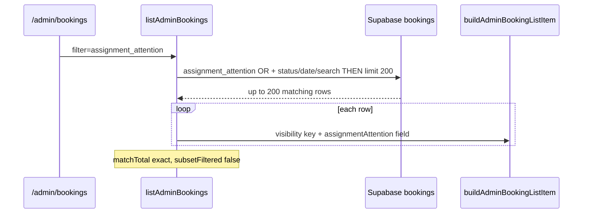

# Stage 6C-3d — Server-Side Assignment Filter: `assignment_attention` Design

**Date:** 2026-05-17  
**Status:** **Shipped (6C-3d)** — golden parity passed; server-side with exact `matchTotal`  
**Depends on:** [stage-6c-server-side-admin-booking-filters-design.md](./stage-6c-server-side-admin-booking-filters-design.md) (6C-1/2), [stage-6c-3-server-side-assignment-visibility-filters-design.md](./stage-6c-3-server-side-assignment-visibility-filters-design.md) (6C-3a/3b/3c shipped)

**Goal:** Decide whether `filter=assignment_attention` on `/admin/bookings` can move from in-memory subset filtering (after `LIMIT 200`) to server-side SQL with exact `matchTotal` — **read-model / presentation only**.

**Non-goals:** Assignment engine, recovery/dispatch commands, RLS, migrations/indexes, CSV/pagination, admin assignment **queue** query semantics (separate code path).

---

## Executive summary

| Question | Answer |
|----------|--------|
| Safe to graduate now? | **Yes — shipped** after golden parity passed |
| Is it `OR(max_attempts, selected_declined, dispatch, recovery)`? | **No** — explicitly **excludes** `dispatch_not_started` and `recovery_needed` |
| Reuse server-side predicates? | **Yes** — composed OR of 6C-3a fragments + `needs_assignment` + confirmed metadata edge |
| `matchTotal` | **Exact** (`subsetFiltered` omitted) |
| Parity outcome | `matchesAssignmentAttentionSqlBranches` ≡ `matchesBookingRowForAssignmentAttentionSql` ≡ `matchesAdminBookingFilter` on golden matrix |
| Migrations / indexes | **None** (read-model only) |

---

## Design question answers

### 1. What exact behavior defines `assignment_attention`?

**Authoritative matcher** — `matchesAdminBookingFilter` (`adminOperationalHelpers.ts`), case `assignment_attention`:

```typescript
assignmentVisibilityKey === "needs_assignment"
  || assignmentVisibilityKey === "selected_declined_admin"
  || assignmentVisibilityKey === "max_attempts_admin"
  || assignmentAttention === "attention_required"
```

**List item shape** (`buildAdminBookingListItem`):

```typescript
assignmentAttention: display.assignmentVisibilityKey ?? display.assignmentAttention
assignmentVisibilityKey: display.assignmentVisibilityKey
```

The fourth disjunct uses the **display field** `assignmentAttention`, not raw metadata alone. After enrichment, that field is usually the **visibility key string** (`needs_assignment`, `max_attempts_admin`, …), not the literal `"attention_required"`.

**Effective fourth disjunct:**

```text
assignmentVisibilityKey === null
  AND readAssignmentMetadata(metadata)?.status === "attention_required"
```

(because visibility keys are never the literal string `"attention_required"`).

Visibility is computed by `resolveAssignmentVisibility` (with `dispatchNotStarted` from `computeDispatchNotStarted`) only when `booking.status` is `pending_assignment` or `confirmed`.

### 2. Which visibility keys are included?

| `assignmentVisibilityKey` | Included in `assignment_attention`? |
|---------------------------|--------------------------------------|
| `needs_assignment` | **Yes** (disjunct 1) |
| `selected_declined_admin` | **Yes** (disjunct 2) |
| `max_attempts_admin` | **Yes** (disjunct 3) |
| `dispatch_not_started` | **No** |
| `selected_expired_admin` | **No** |
| `decline_redispatched` | **No** |
| `finding_cleaner` | **No** |
| `offer_sent` | **No** |
| `null` | **Only if** metadata `assignment.status === "attention_required"` (disjunct 4) |

Ops copy ([admin-operational-dashboard.md](../operations/admin-operational-dashboard.md)): *“Needs assignment, selected declined, or max attempts”* — aligns with the three keys, not dispatch/recovery/expired.

### 3. Is it exactly `OR(max_attempts, selected_declined, dispatch_not_started, recovery_needed)`?

**No.**

| Filter | Overlap with `assignment_attention` |
|--------|-------------------------------------|
| `max_attempts` | **Subset** — `max_attempts_admin` key |
| `selected_declined` | **Subset** — `selected_declined_admin` key |
| `dispatch_not_started` | **Disjoint** (typical) — `dispatch_not_started` key; list `assignmentAttention` becomes `"dispatch_not_started"` |
| `recovery_needed` | **Disjoint** (typical) — uses `recoveryEligible` / `dispatch_not_started` key, not the three admin keys |

A booking can match `recovery_needed` and **not** `assignment_attention` (paid `confirmed`, dispatch-not-started visibility).

### 4. Does it include other `attention_required` metadata states?

**Partially — only when the visibility key does not subsume them.**

| Scenario | `metadata.assignment.status` | Visibility key | Matches? |
|----------|------------------------------|----------------|----------|
| Generic needs assignment | `attention_required` | `needs_assignment` | Yes (key) |
| Max attempts | `attention_required` | `max_attempts_admin` | Yes (key) |
| Selected declined | `attention_required` | `selected_declined_admin` | Yes (key) |
| Selected expired | `attention_required` | `selected_expired_admin` | **No** |
| Decline redispatch in progress | often `offered` | `decline_redispatched` | **No** |
| Finding cleaner / offer sent | may be `offered` or other | `finding_cleaner` / `offer_sent` | **No** |
| Dispatch not started | often `attention_required` | `dispatch_not_started` | **No** |
| Stale metadata on `confirmed` | `attention_required` | `null` | **Yes** (disjunct 4) |

**Important:** A broad SQL clause `pending_assignment AND metadata.status = attention_required` **alone** would **over-match** `selected_expired_admin`, some `decline_redispatched`, and possibly `finding_cleaner` rows versus the current matcher. Sub-predicates must **exclude** those visibility branches (mirror `resolveAssignmentVisibility` order).

### 5. Does it include payment failed or non-assignment states?

| State | Included? |
|-------|-----------|
| `payment_failed` | **No** |
| `completed`, `cancelled`, `assigned`, etc. | **No** (visibility `null`; unless disjunct 4 with stale metadata — rare) |
| `confirmed` + dispatch | **No** (key `dispatch_not_started`) |
| `confirmed` + metadata `attention_required`, no dispatch | **Possible** (disjunct 4) |

Payment failure is a separate filter (`status = payment_failed`).

### 6. Can it reuse already-server-side predicates?

**Yes — compose, do not alias.**

| Component | Reuse from 6C-3a/3b/3c |
|-----------|-------------------------|
| `max_attempts` | **Yes** — same `pending_assignment` + max-attempts reason ILIKE |
| `selected_declined` | **Yes** — same metadata + declined-offer id pre-query |
| `dispatch_not_started` / `recovery_needed` | **No** — not in matcher |
| `needs_assignment` | **New composed predicate** — see below |
| Disjunct 4 (confirmed + metadata) | **Small additional branch** |

Extract shared OR fragments (e.g. `buildMaxAttemptsOrFragment`, `buildSelectedDeclinedOrFragment`) from `applyAdminAssignmentFilterSql` so `assignment_attention` and single presets stay in sync.

### 7. How should `matchTotal` behave?

Same contract as 6C-3a–3c:

| Field | Target |
|-------|--------|
| `matchTotal` | Exact DB count (identical WHERE on list + count) |
| `returnedCount` | Rows returned (≤ 200) |
| `capped` | `matchTotal > returnedCount` |
| `subsetFiltered` | **Omitted / false** |
| Footer | Honest “Showing X of Y matching bookings…” |

AND with 6C-2 `q` and 6C-1 schedule/status filters.

**Do not** emit exact `matchTotal` until enrichment parity tests pass.

### 8. What parity tests are required?

See [Parity test matrix](#parity-test-matrix). Minimum:

1. **Golden enrichment oracle** — full row + payments + offers → `buildAdminBookingListItem` fields → `matchesAdminBookingFilter(..., "assignment_attention")` vs `matchesBookingRowForAssignmentAttentionSql`.
2. **Reuse 6C-3a fixtures** — max_attempts, selected_declined true/false.
3. **Exclusion fixtures** — dispatch, recovery, selected_expired, decline_redispatched, finding_cleaner, offer_sent, payment_failed.
4. **Disjunct 4** — `confirmed` + metadata `attention_required`, visibility `null`.
5. **Integration** — booking outside global top-200; `matchTotal` exact; combined `q` + dates.
6. **Non-regression** — all 6C-3a–3c tests still pass.

### 9. What cases are risky to over-match?

| Risk | Cause | Mitigation |
|------|-------|------------|
| **R1 Over-match** | `pending_assignment` + `metadata.status = attention_required` includes `selected_expired_admin` | Exclude selected+expired sub-predicate (mirror visibility) |
| **R2 Over-match** | Same broad clause includes `decline_redispatched` / open-offer rows | Exclude `metadata.status = offered` + open-offer ids; or accept only if product intends (current matcher: **exclude**) |
| **R3 Over-match** | Include `dispatch_not_started` via metadata `attention_required` | Exclude dispatch reason ILIKE; exclude dispatch/recovery SQL bundles |
| **R4 Under-match** | Disjunct 4 `confirmed` + stale `attention_required` | Add small confirmed + metadata branch |
| **R5 Under-match** | `selected_declined` offer-only gap (6C-3a) | Reuse declined-offer id pre-query from 6C-3a |
| **R6 Drift** | Duplicated OR strings across presets | Extract shared fragment builders |

### 10. Should it remain in-memory if parity is not exact?

**Yes.** If golden tests show SQL ⊃ or SQL ⊂ memory:

- **Production:** keep `subsetFiltered: true` and `matchTotal: null` until fixed, **or** block server-side registration.
- **Staging/dev:** optional post-enrich drop + log drift (same rollout pattern as 6C-3 parent doc).

Do **not** ship honest counts with known over-match.

---

## Current behavior inventory

### Data flow (shipped 6C-3d)



### Code references

| Piece | Path |
|-------|------|
| Matcher | `adminOperationalHelpers.ts` — `matchesAdminBookingFilter` |
| Visibility | `resolveAssignmentVisibility.ts` |
| List enrichment | `adminOperationsReadModel.ts` — `buildAdminBookingListItem` |
| Display | `parseBookingDisplay.ts` — `enrichBookingDisplayWithAssignmentVisibility` |
| SQL presets | `adminAssignmentFilterSql.ts` (6C-3a–3c) |
| Gate | `adminBookingsListQuery.ts` — `needsInMemoryRefinement` **false** for `assignment_attention` |
| SQL | `adminAssignmentFilterSql.ts` — `applyAssignmentAttentionFilterSql`, `buildAssignmentAttentionOrParts` |

### Relation to assignment queue

`/admin/assignments` uses **`listAdminAssignmentQueue`** with different inclusion rules (`needsAttention`, open offers, `pending_assignment`, `dispatchNotStarted`). Home card **`assignmentAttentionTotal`** uses **queue length**, not `filter=assignment_attention` count.

**6C-3d scope:** `/admin/bookings?filter=assignment_attention` only.

---

## Visibility key matrix

Legend: **Y** = matches `assignment_attention` on enriched list item; **N** = no match.

| Key | Typical `booking.status` | `metadata.assignment.status` | Matcher path | In proposed SQL bundle? |
|-----|--------------------------|------------------------------|--------------|-------------------------|
| `needs_assignment` | `pending_assignment` | `attention_required` | Key disjunct 1 | **Y** — `needs_assignment_sql` |
| `selected_declined_admin` | `pending_assignment` | `attention_required` | Key disjunct 2 | **Y** — `selected_declined_sql` |
| `max_attempts_admin` | `pending_assignment` | `attention_required` | Key disjunct 3 | **Y** — `max_attempts_sql` |
| `selected_expired_admin` | `pending_assignment` | `attention_required` | — | **N** — must **not** match |
| `dispatch_not_started` | `confirmed` (typical) | `attention_required` | — | **N** |
| `decline_redispatched` | `pending_assignment` | `offered` (typical) | — | **N** |
| `finding_cleaner` | `pending_assignment` | varies | — | **N** |
| `offer_sent` | `pending_assignment` | `offered` | — | **N** |
| `null` | `confirmed` (edge) | `attention_required` | Disjunct 4 | **Y** — `confirmed_attention_sql` (optional branch) |

---

## Proposed OR predicate

### Conceptual WHERE (single `.or()` on `bookings`)

```text
assignment_attention_sql =
  OR(
    max_attempts_sql,              -- reuse 6C-3a
    selected_declined_sql,         -- reuse 6C-3a (+ declined-offer ids)
    needs_assignment_sql,          -- new (narrow)
    confirmed_attention_metadata_sql   -- disjunct 4 edge (optional but recommended)
  )
```

### `max_attempts_sql` (reuse)

```text
status = pending_assignment
AND metadata.assignment.reason ILIKE '%maximum assignment dispatch attempts%'
```

### `selected_declined_sql` (reuse)

```text
status = pending_assignment
AND metadata.assignment.status = attention_required
AND metadata.assignment.path = selected
AND OR(
  lastOfferOutcome = declined,
  reason ILIKE '%declined%',
  id IN (declined_offer_booking_ids)
)
AND NOT max_attempts_reason
```

(Align with existing `applyAdminAssignmentFilterSql` / `matchesSelectedDeclinedBookingRow`.)

### `needs_assignment_sql` (new — mirror visibility fallback)

Visibility assigns `needs_assignment` when `pending_assignment`, no open offer, `metadata.status = attention_required`, and not max-attempts / selected-declined / selected-expired branches.

```text
status = pending_assignment
AND metadata.assignment.status = attention_required
AND NOT metadata.assignment.reason ILIKE '%maximum assignment dispatch attempts%'
AND NOT (
  metadata.assignment.path = selected
  AND (
    metadata.assignment.lastOfferOutcome = declined
    OR metadata.assignment.reason ILIKE '%declined%'
    OR id IN (declined_offer_booking_ids)
  )
)
AND NOT (
  metadata.assignment.path = selected
  AND (
    metadata.assignment.lastOfferOutcome = expired
    OR metadata.assignment.reason ILIKE '%expired%'
  )
)
```

**Note:** Do **not** require “no open offer” in SQL if product accepts metadata-only match for rows that still have open offers but visibility key `needs_assignment` — current visibility tree returns `finding_cleaner` / `offer_sent` **before** `needs_assignment` when `hasOpenOffer`. Those rows **fail** the matcher today → SQL must **not** match them (visibility order implies open-offer rows are not `needs_assignment`).

**Practical mitigation:** `needs_assignment_sql` cannot be only `pending_assignment + attention_required`. Exclusions above are **required** for parity.

**Open-offer gap:** Full parity may require a pre-query `openOfferBookingIds` set (same helper pattern as declined offers) and `NOT id IN (openOfferBookingIds)` on the needs_assignment branch — mirror `isOfferOpenForOps`. Evaluate in implementation if golden tests fail without it.

### `confirmed_attention_metadata_sql` (disjunct 4)

```text
status = confirmed
AND cleaner_id IS NULL
AND metadata.assignment.status = attention_required
AND NOT metadata.assignment.reason ILIKE '%dispatch not started%'
```

Excludes bookings that would have `dispatch_not_started` visibility. Narrow; low volume.

### Explicitly excluded from bundle

| Predicate | Why |
|-----------|-----|
| `dispatch_not_started` / `recovery_needed` SQL | Not in matcher |
| `payment_failed` | Different filter |
| `pending_assignment` alone | Too broad |
| `metadata.status = attention_required` alone | Over-matches expired/decline-redispatch/dispatch |

---

## Excluded states (must not match)

- `payment_failed`, `completed`, `cancelled`, `assigned` (normal path)
- `dispatch_not_started` / `recovery_needed` visibility (even if metadata `attention_required`)
- `selected_expired_admin`, `decline_redispatched`, `finding_cleaner`, `offer_sent`
- Unpaid `confirmed` without metadata attention
- Inside post-payment grace **without** dispatch reason (dispatch filter only — not assignment_attention)

---

## Parity strategy

### Oracle function (implementation guide)

```text
matchesBookingRowForAssignmentAttentionSql(row, payments, offers, helperIds, now)
  ≡ matchesAdminBookingFilter(
       enrichListItemFromRow(row, payments, offers, now),
       "assignment_attention"
     )
```

Prefer **full enrichment** in tests (same as 6C-3a dispatch parity), not metadata-only shortcuts.

### Resolver flow

```text
1. normalizeAdminBookingsQuery
2. resolveAdminBookingsSearchSql (if q)
3. resolveAdminAssignmentFilterSql("assignment_attention")
   - buildDeclinedOfferBookingIds()     // reuse 6C-3a
   - optionally buildOpenOfferBookingIds()  // if parity requires
4. applyAdminBookingsSqlFilters + search
   - applyAssignmentAttentionFilterSql(builder, helper ids)
5. limit 200 + exact count
6. enrich only (no filterAdminBookings)
```

### Shared helpers (recommended)

| Helper | Purpose |
|--------|---------|
| `buildMaxAttemptsOrClause()` | Fragment for OR string |
| `buildSelectedDeclinedOrClause(declinedIds)` | Fragment |
| `buildNeedsAssignmentOrClause(declinedIds, openOfferIds?)` | Fragment |
| `buildConfirmedAttentionOrClause()` | Disjunct 4 |
| `applyAssignmentAttentionFilterSql(builder, ctx)` | Combines fragments |
| `applyDispatchOrRecoveryNeededFilterSql` | Unchanged |

---

## Parity test matrix

| # | Scenario | Expected |
|---|----------|----------|
| 1 | `needs_assignment` key | **true** |
| 2 | `selected_declined_admin` key | **true** |
| 3 | `max_attempts_admin` key | **true** |
| 4 | `dispatch_not_started` key | **false** |
| 5 | `recoveryEligible` + dispatch key | **false** for assignment_attention |
| 6 | `selected_expired_admin` | **false** |
| 7 | `decline_redispatched` + open offer | **false** |
| 8 | `finding_cleaner` / `offer_sent` | **false** |
| 9 | `payment_failed` | **false** |
| 10 | `confirmed` + metadata `attention_required`, no dispatch reason, key null | **true** (disjunct 4) |
| 11 | `max_attempts` filter true → assignment_attention true | **true** |
| 12 | `selected_declined` filter true → assignment_attention true | **true** |
| 13 | `dispatch_not_started` filter true, dispatch key | **false** for assignment_attention |
| 14 | Outside top-200 by `updated_at` | included when matching |
| 15 | `q` + date range + assignment_attention | AND intersection |

---

## Count contract

| Field | `filter=assignment_attention` (target) |
|-------|----------------------------------------|
| `matchTotal` | Exact |
| `subsetFiltered` | false |
| `hasHonestMatchTotal` | true |
| Footer | Exact matching copy |

**Not required:** `matchTotal` equals union of other filter counts (filters are different sets).

---

## Risk analysis

| ID | Severity | Risk | Mitigation |
|----|----------|------|------------|
| R1 | High | Broad `attention_required` over-match | Narrow `needs_assignment_sql` + exclusions; open-offer id set if needed |
| R2 | Medium | Duplicated OR fragments drift from 6C-3a | Extract shared clause builders |
| R3 | Medium | PostgREST `.or()` length / complexity | Same pattern as 6C-3b; split helper queries only |
| R4 | Low | Disjunct 4 confirmed edge | Explicit branch + fixture |
| R5 | Low | `selected_expired` product ambiguity | Document N in matrix; ops copy excludes expired |
| R6 | Low | Performance (multiple pre-queries) | Reuse declined ids; optional open-offer ids; defer indexes |

---

## Implementation checklist (6C-3d — shipped)

- [x] Extract shared OR fragments from 6C-3a (`buildMaxAttemptsAttentionOrPart`, `buildSelectedDeclinedAttentionOrPart`)
- [x] Implement `buildNeedsAssignmentAttentionOrPart` + `buildConfirmedAttentionMetadataOrPart` + `applyAssignmentAttentionFilterSql`
- [x] Pre-queries: `buildDeclinedOfferBookingIds`, `buildOpenOfferBookingIds`
- [x] Add `assignment_attention` to `SERVER_SIDE_ASSIGNMENT_FILTERS`
- [x] Golden enrichment parity suite (`adminAssignmentFilterSql.test.ts`)
- [x] Integration tests (`adminOperationsReadModel.test.ts`)
- [x] Docs updated; all assignment presets on `/admin/bookings` now server-side

**Unchanged:** assignment engine, recovery cron, RLS, commands, UI controls.

---

## Final recommendation

### Is `assignment_attention` safe to graduate to server-side filtering now?

**Yes — now that 6C-3a ships `max_attempts` and `selected_declined`.** Risk is **medium** (composed OR + visibility exclusions), not **low** like 6C-3c (alias). It is still justified: this is the **last** assignment preset on `/admin/bookings`, completing the 6C-3 program.

**Do not** implement as:

- `OR(dispatch_sql, recovery_sql, max_attempts, selected_declined)` — **wrong**
- `pending_assignment AND metadata.status = attention_required` only — **over-matches**

### Smallest implementation slice

| Slice | Scope | Ship alone? |
|-------|-------|-------------|
| **A (recommended)** | Extract shared 6C-3a OR fragments + `needs_assignment_sql` + optional `confirmed` branch + `applyAssignmentAttentionFilterSql` + golden parity | **Yes** — one PR |
| **B** | Add open-offer booking id exclusion only if golden tests fail | Conditional |
| **C** | Refactor 6C-3a apply paths to use shared fragments | Same PR as A (avoid drift) |

**After 6C-3d:** All assignment dropdown presets on `/admin/bookings` are server-side; `filterAdminBookings` assignment branch removed from hot path for presets.

**Parity passed** — `assignment_attention` is server-side with honest counts. No in-memory refinement on the hot path for assignment presets.

---

## Related docs

- [stage-6c-3-server-side-assignment-visibility-filters-design.md](./stage-6c-3-server-side-assignment-visibility-filters-design.md)
- [stage-6c-3a / 3b / 3c](./stage-6c-3-server-side-assignment-visibility-filters-design.md) — shipped sub-predicates
- [stage-6-ui-polish.md](../operations/stage-6-ui-polish.md)
