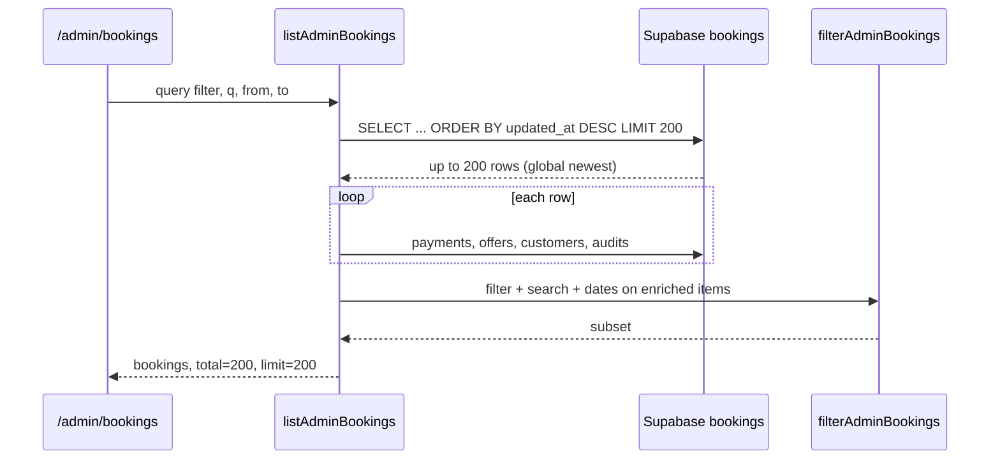
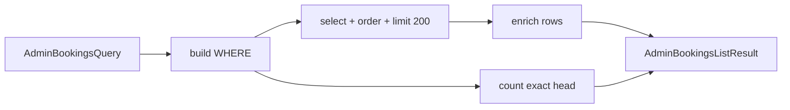

# Stage 6C — Server-Side Admin Booking Filters/Search Design

**Date:** 2026-05-17  
**Status:** Design + **6C-1 shipped** + **6C-2 shipped** (server-side search)  
**Depends on:** [stage-6-safe-ux-ui-improvements-design.md](./stage-6-safe-ux-ui-improvements-design.md), [admin-operational-dashboard.md](../operations/admin-operational-dashboard.md), [customer-cleaner-admin-dashboards.md](../dashboards/customer-cleaner-admin-dashboards.md)

**Goal:** Replace misleading in-memory filtering on `/admin/bookings` with server-side filters, accurate match counts, and honest cap messaging — **read-model / presentation only**.

**Non-goals (this stage):** Booking lifecycle transitions, payment/assignment commands, RLS policy changes, new admin mutations, schema migrations (except optional read indexes deferred by default), CSV export (**6E**), cursor pagination beyond the existing cap, admin home summary logic changes, full-text search engine.

---

## Executive summary

| Decision | Recommendation |
|----------|----------------|
| Problem | Today the list loads **200 newest by `updated_at`**, then filters in memory — filters/search only see that subset; `total` is pre-filter load count |
| Count shown | **`matchTotal`** (DB count for current filters) + **`returnedCount`** (rows returned, ≤ cap) — never imply `matchTotal` equals “all bookings in DB” when capped |
| Date field | **`scheduled_start`** (already labeled “Schedule from/to” in UI) |
| Default sort | **`updated_at DESC`** (unchanged — ops “recent activity” mental model) |
| Cap | Keep **`ADMIN_BOOKINGS_LIST_LIMIT = 200`** in 6C; true cursor pagination deferred |
| Search fields | Booking **ID prefix**, customer **`company_name`**, payment **`provider_ref`** — **not** email (not on RLS-visible tables) |
| Complex filters | Require SQL `WHERE` **before** `LIMIT`; phased: status + dates first, then search joins, then assignment visibility SQL |
| Safest first slice | **6C-1:** SQL `payment_failed` / `pending_assignment` + scheduled date range + `matchTotal` + honest footer + API query passthrough |

---

## Current filtering problem

### Data flow today



### Code references

| Piece | Path | Behavior |
|-------|------|----------|
| Page + URL params | `src/app/(admin)/admin/bookings/page.tsx` | `filter`, `q`, `from`, `to` |
| Filters UI | `src/components/dashboard/AdminBookingsFilters.tsx` | Same params; footer: “Showing {visible} of {total} **loaded** bookings” |
| Read model | `src/features/dashboards/server/adminOperationsReadModel.ts` | `listAdminBookings` — fetch 200, enrich, then `filterAdminBookings` |
| In-memory filter | `src/features/dashboards/server/adminOperationalHelpers.ts` | `filterAdminBookings`, `matchesAdminBookingFilter` |
| Cap constant | `ADMIN_BOOKINGS_LIST_LIMIT = 200` | |
| API (ignores query) | `src/app/api/admin/bookings/route.ts` | `listAdminBookings(user)` with no query |

### Failure modes

| Scenario | What admin sees | Why it is wrong |
|----------|-----------------|-----------------|
| `?filter=payment_failed` when 50 failures exist but none in the latest 200 updates | Empty or sparse list | Failures older/lower in `updated_at` order were never loaded |
| `?q=<provider_ref>` for a booking outside the 200 | “No matching bookings” | Search only scans loaded rows |
| Footer “Showing 3 of 200 loaded” | Thinks 3 failures exist platform-wide | `total` is pre-filter fetch size, not match count |
| `?filter=recovery_needed` | Under-count vs home card | Home summary counts within loaded set; list filter further narrows in memory |
| Date range on busy week | Missing rows scheduled that week but not in global top 200 | Date filter applied after global cap |

### Enrichment cost (unchanged in 6C scope)

Each list row still calls `buildAdminBookingListItem`, which loads **payments**, **assignment_offers**, and **customer/cleaner labels** per booking. 6C changes **which rows are selected**, not the enrichment pipeline. Reducing N+1 queries is out of scope for 6C (optional future optimization).

---

## Design question answers

### 1. Which filters should be server-side first?

**Priority order** (apply in SQL `WHERE` before `ORDER BY` / `LIMIT`):

| Priority | Filter | SQL expressibility | Notes |
|----------|--------|-------------------|--------|
| P0 | `payment_failed` | `status = 'payment_failed'` | Trivial; high ops value |
| P0 | `pending_assignment` | `status = 'pending_assignment'` | Trivial |
| P0 | `from` / `to` (scheduled) | `scheduled_start` range | Already intended; index `idx_bookings_status_scheduled_start` |
| P1 | `q` booking ID | `id::text ilike $prefix%` or UUID parse | Exact/prefix only; reject invalid UUID fragments early |
| P1 | `q` customer name | `EXISTS (SELECT 1 FROM customers c WHERE c.id = bookings.customer_id AND c.company_name ILIKE ...)` | No email column on `customers` |
| P1 | `q` provider ref | `EXISTS (SELECT 1 FROM payments p WHERE p.booking_id = bookings.id AND p.provider_ref ILIKE ...)` | Index `idx_payments_provider_ref` |
| P2 | `selected_declined` | `status = 'pending_assignment'` + metadata/offer predicates | Mirror `resolveAssignmentVisibility` / `matchesAdminBookingFilter` |
| P2 | `max_attempts` | metadata `assignment.reason` ILIKE `%maximum assignment dispatch attempts%` | Same |
| P2 | `assignment_attention` | Union of visibility predicates OR `status IN (...)` narrow + post-check | Broader SQL pre-filter + parity tests |
| P2 | `dispatch_not_started` | `confirmed`, paid payment exists, no cleaner, no open offer, grace elapsed | Joins/subqueries; mirror `computeDispatchNotStarted` / recovery helpers |
| P2 | `recovery_needed` | `recoveryEligible OR dispatch_not_started` | Strictest; ship after dispatch SQL proven |

**Do not** “filter in memory after LIMIT” for any filter that remains in the 6C scope — that preserves the bug.

### 2. Which filters already exist in the UI?

All of the following are **already implemented** in the UI and URL (no new filter chips in 6C):

| UI control | Query param | Values |
|------------|-------------|--------|
| Filter dropdown | `filter` | `payment_failed`, `pending_assignment`, `assignment_attention`, `dispatch_not_started`, `selected_declined`, `max_attempts`, `recovery_needed` |
| Search input | `q` | Free text; placeholder: “Booking ID, customer, payment ref” |
| Schedule from | `from` | `type=date` → ISO date |
| Schedule to | `to` | `type=date` → ISO date |
| Clear | — | Removes all params |

Deep links already used: `/admin/bookings?filter=payment_failed`, `?filter=recovery_needed` from `AdminOpsSummaryCards`.

### 3. What query params should be supported?

**Keep existing names** (bookmark compatibility):

| Param | Type | Validation | Server use |
|-------|------|------------|------------|
| `filter` | enum | Allowlist matching `AdminBookingFilter` | Maps to SQL predicate bundle |
| `q` | string | Trim; max length 64; min length **3** for fuzzy name/ref search (ID prefix may be 8+ hex) | Search bundle |
| `from` | date | `YYYY-MM-DD`; invalid → ignore + optional dev warning | `scheduled_start >= fromT00:00Z` (timezone: **UTC** for v1) |
| `to` | date | Same | `scheduled_start < (to + 1 day)` inclusive end-of-day UTC |

**Deferred params** (document only, do not implement in 6C):

| Param | Purpose |
|-------|---------|
| `sort` | `updated_at` (default), `scheduled_start` |
| `dir` | `desc` (default), `asc` |
| `cursor` / `page` | Cursor pagination past 200 |
| `limit` | Client-tunable cap (admin-only API might use fixed cap) |

**API alignment:** `GET /api/admin/bookings` should accept the **same** query string as the page (for future 6E CSV and tooling), returning `{ ok, bookings, matchTotal, returnedCount, limit, capped }`.

### 4. What count should be displayed: total matching vs loaded count?

| Field | Meaning |
|-------|---------|
| `matchTotal` | Rows in DB matching current filters/search/date (from `count: 'exact', head: true` with identical `WHERE`) |
| `returnedCount` | `bookings.length` after enrich (≤ `limit`) |
| `limit` | `ADMIN_BOOKINGS_LIST_LIMIT` (200) |
| `capped` | `matchTotal > returnedCount` OR `returnedCount === limit` (when exact count unavailable, treat as capped) |

**Footer copy (recommended):**

- No filters: `Showing up to {returnedCount} bookings (newest by last update, limit {limit}).`
- With filters, `matchTotal ≤ limit`: `Showing {returnedCount} of {matchTotal} matching bookings.`
- With filters, `matchTotal > limit`: `Showing {returnedCount} of {matchTotal} matching bookings (newest {limit} by last update).`

Remove the word **“loaded”** — it implied the wrong denominator.

**Do not** use pre-filter fetch size as `total`. Deprecate overloading `total` in `AdminBookingsListResult`; add `matchTotal` + `returnedCount` explicitly.

### 5. Should search cover booking ID, customer name, email, provider ref?

| Field | Include in 6C? | Rationale |
|-------|----------------|-----------|
| Booking ID | **Yes** | Primary ops lookup; prefix match on UUID text |
| Customer name | **Yes** | `customers.company_name` already resolved in list row |
| Customer email | **No (defer)** | Not on `customers` / `profiles`; `auth.users.email` is outside admin RLS read model |
| Payment provider ref | **Yes** | Already in `searchText` today; use `payments.provider_ref` EXISTS |
| Cleaner name | **Defer** | Extra join; not in current placeholder |
| Service label | **Defer** | Lives in JSON metadata; expensive |

Search semantics:

- Trim and lowercase for name/ref `ILIKE`.
- Escape `%` and `_` in user input.
- Combine predicates with **OR** inside a single search group; AND with filter/date predicates.
- If `q` parses as UUID prefix (≥ 8 hex chars), try ID match **first** (cheap, index-friendly).

### 6. Should date filters use scheduled date or created date?

**`scheduled_start`** — matches existing UI labels (“Schedule from/to”), ops runbooks, and index `idx_bookings_status_scheduled_start`.

Inclusive calendar dates in UTC:

- `from`: `scheduled_start >= from::date at time zone 'UTC'`
- `to`: `scheduled_start < (to::date + 1 day) at time zone 'UTC'`

**Do not** switch to `created_at` without UI label change (would confuse).

### 7. What default sort/order should be used?

**`updated_at DESC`** — unchanged.

Rationale: admin list is an **activity feed** for incidents; scheduled date sort is useful later via optional `sort=scheduled_start` (deferred).

When `filter` is set and `matchTotal` is large, still use `updated_at DESC` for the capped page so operators see recently touched cases first.

### 8. What caps/pagination should exist?

| Rule | Value |
|------|-------|
| Page cap | **200** (`ADMIN_BOOKINGS_LIST_LIMIT`) |
| Pagination | **None** in 6C — single page |
| `capped` flag | `true` when `matchTotal > returnedCount` |
| Empty state | Unchanged UX; honest copy when `matchTotal === 0` |

**Deferred:** keyset cursor (`?cursor=<updated_at,id>`), page numbers, export cap (6E may use 5k with separate rate limit).

### 9. How to avoid expensive queries?

| Technique | Application |
|-----------|-------------|
| Filter before limit | All supported `filter` / date / search predicates in one `WHERE` |
| Parallel count | `select('*', { count: 'exact', head: true })` with same filters — acceptable at admin scale for v1 |
| Narrow selects | List query keeps minimal booking columns; enrichment only for returned rows |
| Search minimum length | `q.length >= 3` for `ILIKE` on name/ref (except UUID prefix path) |
| ID fast path | UUID / prefix on `bookings.id` avoids scanning customers/payments |
| EXISTS vs JOIN | Prefer `EXISTS` subqueries for payments/customers when filtering |
| Cap exact count | Optional: if `filter` empty and no `q`, skip exact count and show `matchTotal: null`, `capped: returnedCount === limit` — **defer** unless profiling shows pain |
| Indexes | Existing: `(status, scheduled_start)`, `payments(provider_ref)`, `payments(booking_id)` — **defer** new `idx_bookings_updated_at` unless EXPLAIN shows seq scan |
| No service role in browser | Server read model only (unchanged) |

**Anti-patterns to forbid:**

- Fetch 200 → enrich all → filter in memory (current bug).
- `ILIKE '%' || q || '%'` on unbounded table without other predicates when `q` is short.
- Loading full payment rows when only `provider_ref` needed for search (use subquery).

### 10. What tests are required?

| Layer | Tests |
|-------|-------|
| **Parity (golden)** | For each `AdminBookingFilter` + date + search fixture set: SQL path result IDs === `filterAdminBookings` on fully-enriched fixtures (same inputs) |
| **Unit** | `buildAdminBookingsWhere(query)` (new helper) — param validation, date boundaries, search escaping |
| **Unit** | `matchesAdminBookingFilter` tests remain; add SQL parity cases for P2 filters |
| **Integration** | `listAdminBookings(admin, { filter: 'payment_failed' })` returns only failed; `matchTotal` matches mock count |
| **Integration** | Search by `provider_ref` and `company_name` returns booking outside “global top 200” fixture ordering |
| **Component** | `AdminBookingsFilters` footer strings for capped / uncapped / zero |
| **API** | `GET /api/admin/bookings?filter=payment_failed` forwards query; non-admin 403 |
| **Regression** | Admin home `listAdminBookings(user)` without query **unchanged** (still global 200 for summary cards) |

**Out of scope for 6C tests:** RLS policy changes, command routes, lifecycle transitions.

### 11. What should be deferred to CSV export (6E)?

| Capability | 6C | 6E CSV |
|------------|-----|--------|
| Same filter/search params | Yes (read model) | Yes (reuse `AdminBookingsQuery`) |
| Row cap | 200 on screen | Higher export cap (e.g. 5k) + rate limit |
| Columns | List card fields | Allowlisted export columns |
| `matchTotal` display | Yes | Export header metadata row optional |
| Email / PII columns | Not in search | Still **excluded** per Stage 6 security table |
| Streaming download | N/A | New route |

6C must make the read model **honest** so 6E exports the same predicate semantics, not the old in-memory subset.

---

## Proposed query params (canonical)

```
/admin/bookings
  ?filter=payment_failed|pending_assignment|assignment_attention|dispatch_not_started|selected_declined|max_attempts|recovery_needed
  &q=<search>
  &from=YYYY-MM-DD
  &to=YYYY-MM-DD
```

Example:

```
/admin/bookings?filter=payment_failed&from=2026-05-01&to=2026-05-31
/admin/bookings?q=paystack_tx_abc123
/admin/bookings?q=550e8400-e29b
```

---

## Server read-model changes

### New / updated types

```ts
// adminOperationalHelpers.ts (conceptual)
export type AdminBookingsQuery = {
  filter?: AdminBookingFilter;
  search?: string;
  scheduledFrom?: string;
  scheduledTo?: string;
};

export type AdminBookingsListResult = {
  bookings: AdminBookingListItem[];
  matchTotal: number | null;   // exact count when affordable
  returnedCount: number;
  limit: number;
  capped: boolean;
};
```

### New internal helper

`buildAdminBookingsListQuery(supabase, query)` → `{ bookingIdsQuery, countQuery }` or PostgREST filter builder:

1. Apply **filter SQL** for `filter` param.
2. Apply **scheduled_start** range.
3. Apply **search** OR group.
4. `order('updated_at', { ascending: false })`.
5. `limit(ADMIN_BOOKINGS_LIST_LIMIT)`.
6. Run **count** with identical filters (parallel).

Then:

7. For each row in result, **`buildAdminBookingListItem`** (unchanged).
8. **Optional P2 guard:** run `matchesAdminBookingFilter` on enriched rows and drop mismatches; log parity drift in dev — safety net during SQL migration only, remove once parity tests pass.

### Filter → SQL mapping (target end state)

| `filter` | SQL strategy (high level) |
|----------|----------------------------|
| `payment_failed` | `status = 'payment_failed'` |
| `pending_assignment` | `status = 'pending_assignment'` |
| `selected_declined` | `status = 'pending_assignment'` AND metadata path `selected` AND declined outcome (mirror TS) |
| `max_attempts` | `status = 'pending_assignment'` AND reason contains max-attempts string |
| `assignment_attention` | OR of `needs_assignment`, `selected_declined`, `max_attempts` predicates |
| `dispatch_not_started` | `status = 'confirmed'`, no `cleaner_id`, paid payment, no open offer, grace window (mirror recovery helpers) |
| `recovery_needed` | `dispatch_not_started` OR recovery eligibility predicate |

Exact SQL should be generated from shared documentation of `matchesAdminBookingFilter` and `resolveAssignmentVisibility` — **not** duplicated ad hoc in three places. Prefer a single `adminBookingFilterSql.ts` module tested against golden fixtures.

### Files to touch (implementation phase — not now)

| File | Change |
|------|--------|
| `adminOperationsReadModel.ts` | `listAdminBookings` uses SQL filters + new counts |
| `adminOperationalHelpers.ts` | Keep `filterAdminBookings` for tests/parity; deprecate production path |
| `adminOperationalHelpers.test.ts` | Parity + SQL builder tests |
| `types.ts` | `AdminBookingsListResult` fields |
| `AdminBookingsFilters.tsx` | Footer copy |
| `page.tsx` | Pass new result fields |
| `api/admin/bookings/route.ts` | Forward `searchParams` |

### Explicitly unchanged

| Area | Reason |
|------|--------|
| `getAdminBookingDetail` | Detail path unchanged |
| `getAdminOperationsSummary` / `/admin` home | Still uses unfiltered `listAdminBookings` for card totals within cap — document limitation; fixing home counts is separate |
| `listAdminAssignmentQueue` | Different surface |
| RLS policies | Stage 6 boundary |
| Commands / mutations | Stage 6 boundary |

---

## Count strategy



| Case | `matchTotal` | `capped` | Footer |
|------|--------------|----------|--------|
| 12 matches, 12 returned | 12 | false | “Showing 12 of 12 matching…” |
| 500 matches, 200 returned | 500 | true | “Showing 200 of 500 matching (newest 200…)” |
| 0 matches | 0 | false | Empty state |
| Count skipped (deferred optimization) | `null` | `returnedCount === limit` | “Showing up to 200…” |

---

## Pagination / cap strategy

- **Single page**, max **200** rows.
- Sort: **`updated_at DESC`**.
- When `capped`, show explicit hint that older/low-activity matches may exist beyond the cap.
- Do **not** add “Load more” in 6C (mobile polish / 6F can revisit UX).

---

## Search strategy

1. Normalize `q` (trim).
2. If matches UUID prefix pattern → `bookings.id::text ilike q%` (or equality if full UUID).
3. Else if `length < 3` → ignore fuzzy search (return filter-only results); optionally show inline hint “Enter at least 3 characters”.
4. Else OR:
   - `customers.company_name ILIKE %q%`
   - `EXISTS payments WHERE provider_ref ILIKE %q%`
5. AND with `filter` + date predicates.

Security: search is admin-only; still no email exposure; do not return extra columns.

---

## UI behavior

| Behavior | Detail |
|----------|--------|
| Submit | Unchanged — GET form pushes query string (full navigation) |
| `loading.tsx` | Already recommended in Stage 6A — shows during filter apply |
| Footer | Use `matchTotal` / `returnedCount` / `capped` (see §4) |
| Empty filtered | Keep “Clear filters” CTA |
| Invalid `filter` | Ignore silently (current behavior) |
| Search placeholder | Optional tweak: remove “email” implication — “Booking ID, customer name, payment ref” |
| Summary cards on `/admin` | No change in 6C — still link to filtered list URLs |

---

## Tests (summary checklist)

- [ ] Golden parity: each filter vs `filterAdminBookings` on fixture catalog
- [ ] Date boundary: inclusive `to` / `from` in UTC
- [ ] Search: provider ref finds booking not in unfiltered top-200-by-updated_at
- [ ] Search: company name partial match
- [ ] Search: UUID prefix
- [ ] Count: `matchTotal` matches mock Supabase count
- [ ] API: query passthrough + 403 for non-admin
- [ ] Footer: capped vs uncapped strings
- [ ] Home path: unfiltered list still returns ≤ 200 for summary (documented limitation)

---

## Phased implementation plan

| Phase | ID | Scope | Risk |
|-------|-----|-------|------|
| **6C-1** | Status + dates + counts | SQL `payment_failed`, `pending_assignment`, `from`/`to`; `matchTotal`/`capped`; footer + API passthrough; remove misleading `total` | **Low** — **shipped** |
| **6C-2** | Search | ID prefix, `company_name`, `provider_ref` EXISTS; min length; escape | **Medium** — **shipped** |
| **6C-3** | Assignment filters | SQL for `selected_declined`, `max_attempts`, `assignment_attention`, `dispatch_not_started`, `recovery_needed`; full parity tests; remove in-memory filter from hot path | **Medium–high** |
| **6C-4** (optional) | Performance | `idx_bookings_updated_at desc`, enrich batching | **Low** (migration optional) |

**Parallelization:** 6C-1 can ship independently. 6E CSV should wait for **6C-2 minimum** (search parity for exports).

### 6C-2 implementation notes (shipped)

| Area | Path / behavior |
|------|-----------------|
| Min length | `MIN_ADMIN_BOOKING_SEARCH_LENGTH = 3` — shorter `q` ignored (no ILIKE) |
| Search fields | Booking `id` prefix (8+ hex / UUID-like), `customers.company_name` ILIKE, `payments.provider_ref` ILIKE |
| Combination | Search OR-group AND-ed with 6C-1 status + `scheduled_start` range before `LIMIT 200` |
| Resolution | `resolveAdminBookingsSearchSql` — parallel customer/payment lookups, PostgREST `.or()` on bookings (no raw SQL strings) |
| Count contract | `matchTotal` exact when search + server filters without assignment preset refinement |
| Deferred | Customer email, assignment preset SQL (6C-3), pagination, CSV |

### 6C-1 implementation notes (shipped)

| Area | Path / behavior |
|------|-----------------|
| SQL filter helper | `src/features/dashboards/server/adminBookingsListQuery.ts` — `applyAdminBookingsSqlFilters`, `hasServerSideSqlFilters`, `needsInMemoryRefinement` |
| Read model | `listAdminBookings` applies SQL `WHERE` before `ORDER BY` / `LIMIT 200`, parallel exact count when only server-side filters |
| Count contract | `matchTotal`, `returnedCount`, `capped`, optional `subsetFiltered` for deferred in-memory refinement |
| API | `GET /api/admin/bookings?filter=&from=&to=` forwards params (search `q` accepted but still in-memory) |
| Footer | `AdminBookingsFilters` / `adminBookingsFooterCopy` — honest match vs loaded-subset copy |
| Deferred after 6C-3a | `dispatch_not_started`, `recovery_needed`, `assignment_attention` (6C-3b–3d); customer email; pagination; CSV; home summary counts |

### Rollout

1. Deploy 6C-1 to staging; compare `?filter=payment_failed` list length vs manual SQL count.
2. Deploy 6C-2; verify Paystack ref lookup from ops.
3. Deploy 6C-3; run full parity suite; spot-check assignment queue deep links.

Rollback: revert read-model + UI copy only; no migrations required for 6C-1–3.

---

## Risk classification

| ID | Risk | Mitigation |
|----|------|------------|
| R1 | SQL filter diverges from TS visibility logic | Golden parity tests; temporary post-enrich guard in dev |
| R2 | Count query slow | Monitor; defer count when unfiltered; index later |
| R3 | Search `%` injection | Escape; parameterized queries |
| R4 | Operators trust old “200 loaded” mental model | Footer copy + changelog in ops doc |
| R5 | Home summary still cap-bounded | Document in admin-operational-dashboard.md; out of 6C scope |

---

## Final recommendation

### Safest first implementation slice: **6C-1**

Ship together in one PR:

1. **`buildAdminBookingsListWhere`** (or equivalent) applying only:
   - `filter ∈ { payment_failed, pending_assignment }`
   - `scheduledFrom` / `scheduledTo` on `scheduled_start`
2. **`listAdminBookings`** uses WHERE → order → limit → enrich (no in-memory filter for these).
3. **`matchTotal`** via exact count with same WHERE.
4. **`AdminBookingsFilters`** footer uses `returnedCount` / `matchTotal` / `capped`.
5. **`GET /api/admin/bookings`** forwards query string (same allowlist).

**Explicitly out of 6C-1:** assignment presets, free-text search, sort options, pagination, CSV, home summary fix, schema migrations.

Why this slice first:

- Fixes the **highest-traffic misleading filters** (`payment_failed`, date range) with trivial SQL and low regression risk.
- Establishes the **count contract** and honest UX before harder assignment SQL.
- Keeps parity scope small (status + date tests only).
- Unblocks **6E** plumbing (API accepts query) without exporting yet.

**Second slice:** **6C-2** search (provider ref + customer name + ID prefix) — ops lookup without assignment SQL complexity.

**Third slice:** **6C-3** assignment filters — requires careful SQL translation and full golden parity with `matchesAdminBookingFilter`.

---

## Design checklist (requirements trace)

| Requirement | Section |
|-------------|---------|
| Current filtering problem | [Current filtering problem](#current-filtering-problem) |
| Proposed query params | [Proposed query params](#proposed-query-params-canonical) |
| Server read-model changes | [Server read-model changes](#server-read-model-changes) |
| Count strategy | [Count strategy](#count-strategy) |
| Pagination/cap strategy | [Pagination / cap strategy](#pagination--cap-strategy) |
| Search strategy | [Search strategy](#search-strategy) |
| UI behavior | [UI behavior](#ui-behavior) |
| Tests | [Tests](#tests-summary-checklist) |
| Phased implementation plan | [Phased implementation plan](#phased-implementation-plan) |
| Final recommendation | [Final recommendation](#final-recommendation) |
| Safest first slice (6C) | **6C-1** — status filters + scheduled dates + `matchTotal` + footer/API |

---

## References

| Artifact | Path |
|----------|------|
| Parent Stage 6 design | `docs/architecture/stage-6-safe-ux-ui-improvements-design.md` |
| Ops runbook | `docs/operations/admin-operational-dashboard.md` |
| List read model | `src/features/dashboards/server/adminOperationsReadModel.ts` |
| Filter helpers | `src/features/dashboards/server/adminOperationalHelpers.ts` |
| Visibility logic | `src/features/assignments/server/resolveAssignmentVisibility.ts` |
| Bookings indexes | `supabase/migrations/20260515201500_core_foundation.sql` |
