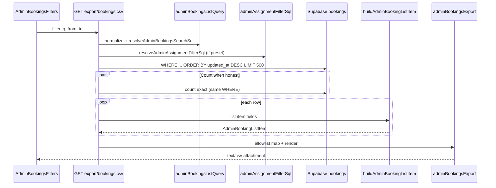

# Stage 6E — Admin Booking CSV Export Design

**Date:** 2026-05-17  
**Status:** **6E-1 shipped** (read-only CSV export); 6E-2+ deferred  
**Depends on:** [stage-6c-server-side-admin-booking-filters-design.md](./stage-6c-server-side-admin-booking-filters-design.md) (6C shipped), [stage-6c-server-side-admin-booking-filters-final-audit.md](../audits/stage-6c-server-side-admin-booking-filters-final-audit.md), [stage-6-safe-ux-ui-improvements-design.md](./stage-6-safe-ux-ui-improvements-design.md)

**Goal:** Define a **read-only** CSV export for `/admin/bookings` that uses the **same server-side filter/search semantics as 6C**, with a hard row cap, field allowlist, and no lifecycle/RLS/command changes.

**Non-goals:** Booking/payment/assignment mutations, RLS changes, schema migrations (unless a later slice adds audit action types), background/async export jobs, streaming megabyte dumps, notifications export, customer email discovery, changing 6C list filters or `ADMIN_BOOKINGS_LIST_LIMIT` (200).

---

## Executive summary

| Question | Recommendation |
|----------|----------------|
| Route | `GET /api/admin/export/bookings.csv` (dedicated export route; list route stays JSON) |
| Reuse 6C query builder? | **Yes** — shared `normalizeAdminBookingsQuery`, search resolution, assignment SQL, `applyAdminBookingsSqlFilters` + `applyAdminBookingsSearchSql` |
| First row cap | **500** hard max (not 1000; not streaming in v1) |
| Email in CSV? | **No** — excluded (not in 6C search; not on `customers` row) |
| Assignment/payment labels? | **Yes** — human labels via existing `statusLabels` helpers |
| Rate limit | **Yes** — ~10 exports / admin / hour (MVP in-memory or edge; document upgrade path) |
| Audit | **Structured server log in 6E-1**; durable `admin_operational_audit` in **6E-2** (schema gap) |
| Safest first slice | **6E-1 shipped** — see [6E-1 implementation](#6e-1-implementation-shipped) |

---

## Design question answers

### 1. Which route should serve CSV?

**Recommendation:** `GET /api/admin/export/bookings.csv`

| Option | Verdict | Why |
|--------|---------|-----|
| `GET /api/admin/export/bookings.csv` | **Preferred** | Clear `Content-Type: text/csv`, attachment disposition, separate from JSON list contract |
| `GET /api/admin/bookings?format=csv` | Avoid | Mixes JSON and CSV on one handler; harder caching and error shapes |
| Server Action from page | Avoid | Large binary responses fit Route Handlers better |
| New page route `/admin/bookings/export` | Optional UI trigger only | Still calls API route; do not generate CSV in RSC |

**Auth:** `requireApiUser(["admin"])` — same as `GET /api/admin/bookings`.

**Methods:** `GET` only. No `POST` / `PUT` / `PATCH` / `DELETE`.

---

### 2. Should export reuse the same admin booking query builder?

**Yes.** Extract or call the same primitives already used by `listAdminBookings`:

```text
normalizeAdminBookingsQuery(query)
  → resolveAdminBookingsSearchSql(client, query)     // when q ≥ 3
  → resolveAdminAssignmentFilterSql(client, filter)  // assignment presets
  → applyAdminBookingsSqlFilters(builder, query, assignmentSql)
  → applyAdminBookingsSearchSql(builder, searchSql)
  → order("updated_at", { ascending: false })
  → limit(EXPORT_CAP)                                 // 500, not 200
```

| Piece | Module | Reuse |
|-------|--------|-------|
| Param normalization | `adminBookingsListQuery.ts` | **Identical** |
| Status + schedule filters | `applyAdminBookingsSqlFilters` | **Identical** |
| Search OR / force-empty | `resolveAdminBookingsSearchSql` | **Identical** |
| Assignment predicates | `adminAssignmentFilterSql.ts` | **Identical** |
| Row enrichment | `buildAdminBookingListItem` | **Same labels as UI** (6E-1); batching optimization deferred |

**New export-only module (recommended):** `adminBookingsExport.ts`

- `buildAdminBookingsExportQuery(client, query)` → filtered Supabase builder + `matchTotal` count promise
- `mapAdminBookingListItemToCsvRow(item)` → allowlisted string columns
- `renderAdminBookingsCsv(rows, meta)` → RFC 4180 CSV with BOM optional for Excel

**Do not** call `filterAdminBookings` on export path — 6C removed in-memory refinement for all dropdown filters.

**Parity rule:** For any query where `matchTotal ≤ 500`, exported row **ids** must equal the set you would get from `listAdminBookings` if list limit were raised to 500 (same order: `updated_at DESC`).

---

### 3. What row cap is safe first: 500, 1000, or streamed?

| Option | Verdict | Notes |
|--------|---------|-------|
| **500 hard cap** | **Ship first (6E-1)** | Aligns with Stage 6 parent doc; ~2.5× list UI cap; bounded enrichment N+1 cost |
| 1000 | Defer (6E-3) | Doubles DB + enrichment load; needs batching or slimmer mapper |
| Streamed / unbounded | **Defer** | No background jobs per scope; sync stream still needs cap + backpressure; review in 6E+ only |

**Truncation policy:**

- Export **always** applies `limit(500)` after the same `WHERE` as 6C.
- When `matchTotal > 500` (filters active): include metadata that export is truncated (HTTP headers + optional CSV comment row).
- When **unfiltered** (no `filter` / `q` / dates): export newest **500** by `updated_at`; **omit** exact `matchTotal` in v1 (avoid full-table `count(*)` on every export) — same honesty class as 6C unfiltered list.

**Not in scope:** Keyset iteration to export all 2,000 matching rows in one download (defer to 6E-3 with explicit ops approval + higher cap).

---

### 4. Which columns should be allowed?

**Allowlist only** — mapper defines column order and headers. Proposed **6E-1** columns:

| CSV header | Source | Notes |
|------------|--------|-------|
| `booking_id` | `AdminBookingListItem.id` | UUID |
| `booking_status` | `status` | Raw enum |
| `booking_status_label` | `labelForBookingStatus(status)` | Human |
| `payment_status` | `paymentStatus` | Raw enum or empty |
| `payment_status_label` | `labelForPaymentStatus(paymentStatus)` | Human |
| `payment_failure_category` | `paymentFailureReason` | Categorized code/label only — not raw audit text |
| `customer_name` | `customerLabel` | `company_name` or fallback — same as list |
| `cleaner_name` | `cleanerLabel` | Display name or empty |
| `service` | `serviceLabel` | From parsed metadata display |
| `scheduled_start_utc` | `scheduledStart` | ISO 8601 |
| `scheduled_end_utc` | row `scheduled_end` | ISO 8601 (add to list item or read from row) |
| `price` | `priceLabel` | Formatted ZAR string (matches UI) |
| `assignment_visibility_key` | `assignmentVisibilityKey` | Raw key or empty |
| `assignment_label` | `labelForAssignmentVisibilityKey` / `labelForAssignmentAttention` | Same badge copy as admin list |
| `dispatch_not_started` | `dispatchNotStarted` | `yes` / `no` |
| `recovery_eligible` | `recoveryEligible` | `yes` / `no` |
| `latest_provider_ref` | latest payment `provider_ref` | Single ref — already used in 6C search; ops value |
| `updated_at_utc` | `updatedAt` | ISO 8601 |

**Optional 6E-2 columns (explicit approval):**

| Column | Defer reason |
|--------|--------------|
| `customer_id` / `cleaner_id` | Internal linkage — low ops value vs UUID leakage in spreadsheets |
| `price_cents` + `currency` | Redundant if `price` present; add only if finance asks |

---

### 5. Which sensitive fields should be excluded?

**Never export:**

| Category | Examples |
|----------|----------|
| Raw `bookings.metadata` JSON | Assignment engine blobs, wizard payloads, tokens |
| Auth / contact PII not shown on list | Email, phone (`customers.phone`), auth user ids |
| Payment secrets | Card numbers, CVV, authorization codes, full webhook payloads |
| Full `payments` row | Export at most **one** `provider_ref` column |
| Audit bodies | `booking_state_audit`, `admin_operational_audit` rows |
| Notification payloads | `notification_outbox` recipient addresses, `last_error` stacks |
| Service role fields | Anything requiring service role to read |
| Internal profile ids | Unless explicitly approved in 6E-2 |

Enforce via:

1. **Allowlist mapper** (no `...spread` of row objects).
2. Unit test that scans CSV output for forbidden substrings / keys.
3. Code review rule: export module must not import raw metadata readers except through `parseBookingDisplay` / list enrichment.

---

### 6. Should email be included or excluded?

**Excluded.**

| Fact | Implication |
|------|-------------|
| 6C search deliberately excludes email | Export must not be a backdoor for email discovery |
| `customers` has `company_name`, `phone` — no email column | No admin JWT path to `auth.users` |
| Profiles expose `full_name` only for cleaners | Cleaner email not available in list model |

If product later needs contact export, that is a **separate** gated stage with legal review — not 6E.

---

### 7. How should filters/search params be applied?

**Same query string as `/admin/bookings` and `GET /api/admin/bookings`:**

| Param | Maps to | Validation |
|-------|---------|------------|
| `filter` | `AdminBookingFilter` allowlist | Invalid → ignore (same as page) |
| `q` | `search` in `AdminBookingsQuery` | Min length **3** after normalize |
| `from` | `scheduledFrom` | `YYYY-MM-DD` UTC inclusive |
| `to` | `scheduledTo` | Exclusive upper bound via `scheduledToExclusiveUpper` |

**UI:** “Export CSV” builds URL from current filter form state (mirror `AdminBookingsFilters.buildHref`).

**Example:**

```http
GET /api/admin/export/bookings.csv?filter=assignment_attention&from=2026-05-01&to=2026-05-31&q=acme
```

**Unfiltered export:** Allowed but copy should warn: “Exports up to 500 newest bookings by last update.”

---

### 8. Should export include assignment status labels?

**Yes.**

Use the same derivation as the admin bookings table:

- `assignment_visibility_key` (raw)
- `assignment_label` from `labelForAssignmentVisibilityKey(assignmentVisibilityKey)` with fallback `labelForAssignmentAttention(assignmentAttention, reason)` when needed

Do **not** export raw `metadata.assignment.status` alone without visibility context — ops labels match what admins see in UI.

---

### 9. Should export include payment status labels?

**Yes.**

- `payment_status` (raw enum)
- `payment_status_label` via `labelForPaymentStatus`
- `payment_failure_category` via existing `paymentFailureReason` / `labelForAdminPaymentFailureAttention` — **not** full audit messages

---

### 10. How should filenames be generated?

**Pattern:**

```text
bookings-export-{scope}-{timestamp}.csv
```

| Part | Rule |
|------|------|
| `scope` | `all` if no filter; else filter slug (`payment-failed`, `assignment-attention`, …) |
| `timestamp` | UTC `YYYYMMDD-HHmmss` at export start |
| Example | `bookings-export-assignment-attention-20260517-143022.csv` |

**HTTP header:**

```http
Content-Disposition: attachment; filename="bookings-export-assignment-attention-20260517-143022.csv"
```

Optional: include `from`/`to` in slug when present (`...-20260501-20260531-...`) — keep under 120 chars.

---

### 11. Should export be rate-limited?

**Yes.**

| Tier | Limit | Response |
|------|-------|----------|
| **6E-1 MVP** | 10 exports / admin user / rolling hour | `429` JSON `{ ok: false, code: "RATE_LIMITED", message: "..." }` |
| Production hardening | Edge / Redis / Vercel KV | Same contract |

**Key:** admin `profileId` or `authUser.id` — not IP alone (shared NAT).

**Do not** rate-limit normal `GET /api/admin/bookings` list reads.

---

### 12. Should export be audited?

**Yes, in two phases.**

| Phase | Mechanism |
|-------|-----------|
| **6E-1** | Structured server log: `event: "admin_bookings_csv_export"`, `adminProfileId`, `filter`, `q` length hash (not full q in log if sensitive), `from`, `to`, `exportedRowCount`, `matchTotal`, `truncated` |
| **6E-2** | Durable audit — **blocked today** by `admin_operational_audit` schema: `action` enum has no export type; `booking_id` is required per row |

**6E-2 options (pick one later, needs migration):**

1. Add `export_bookings_csv` to `ADMIN_OPERATIONAL_ACTIONS` + nullable `booking_id` for platform-level events.
2. Separate `admin_export_audit` append-only table.

**Until then:** do not fake audit via service-role insert into booking-scoped audit with dummy `booking_id`.

---

### 13. What tests are required?

| Layer | Tests |
|-------|-------|
| **CSV mapper** | Column order fixed; RFC 4180 escaping (comma, quote, newline in `company_name`); no forbidden keys in output |
| **Query reuse** | Export query applies same `eq`/`gte`/`lt`/`or` chain as list for fixtures (mock Supabase builder calls) |
| **Parity** | Given fixture DB, export ids ⊂ list ids and equal when `matchTotal ≤ 500` |
| **Cap** | `matchTotal = 600` → 500 data rows + `truncated: true` |
| **Auth** | Non-admin → 403 |
| **Rate limit** | 11th request in window → 429 |
| **Route contract** | `Content-Type: text/csv`; `Content-Disposition: attachment`; no POST handler |
| **Search min length** | `q=ab` → ignored (same as 6C) |
| **Regression** | `adminBookingsListQuery` / `adminAssignmentFilterSql` tests unchanged |

**Out of scope for automated tests:** Excel-specific locale quirks (optional manual QA).

---

### 14. What should be deferred?

| Item | Stage | Reason |
|------|-------|--------|
| Streaming / chunked transfer | 6E+ | Complexity; cap makes buffer acceptable |
| 1000+ row cap | 6E-3 | Performance + ops approval |
| Keyset export of full `matchTotal` | 6E-3 | Multiple round-trips; honesty banner required |
| Email / phone columns | — | PII policy |
| Raw metadata / audit CSV columns | — | Security |
| Background email-with-attachment job | — | Explicit non-goal |
| Notifications / earnings export | — | Different allowlists |
| `admin_operational_audit` row | 6E-2 | Schema |
| Batch enrichment (single query for customers) | 6E-1b | Optimization |
| `sort` / `dir` params | — | Fixed `updated_at DESC` matches list |
| Export when list empty without warning modal | 6E-1 UI polish | UX only |

---

## CSV route contract

### Request

```http
GET /api/admin/export/bookings.csv?filter=&q=&from=&to=
Authorization: (session cookie / bearer — same as admin app)
```

### Success response

| Header | Value |
|--------|-------|
| `Content-Type` | `text/csv; charset=utf-8` |
| `Content-Disposition` | `attachment; filename="bookings-export-..."` |
| `X-Export-Row-Count` | Number of data rows (≤ 500) |
| `X-Export-Match-Total` | Exact count when `hasHonestMatchTotal`; omitted when unfiltered |
| `X-Export-Truncated` | `true` when `matchTotal > rowCount` |
| `X-Export-Cap` | `500` |

**Body:**

- Optional first line (comment): `# Exported {rowCount} of {matchTotal} matching bookings (cap 500).` when truncated.
- Header row + data rows.
- UTF-8 BOM optional (`\uFEFF`) for Excel — document choice in implementation.

### Error responses

| Status | `code` | When |
|--------|--------|------|
| 403 | `FORBIDDEN` | Non-admin |
| 429 | `RATE_LIMITED` | Rate limit exceeded |
| 500 | `PERSISTENCE_ERROR` | Supabase / search resolution failure |
| 503 | `AUTH_NOT_CONFIGURED` | No Supabase |

Errors return **JSON**, not CSV — so clients can distinguish failure from empty file.

---

## Filter/search reuse plan



**Constants:**

```ts
export const ADMIN_BOOKINGS_EXPORT_LIMIT = 500; // new — do not change LIST_LIMIT (200)
```

---

## Sensitive field policy (summary)

| Allowed | Excluded |
|---------|----------|
| Booking id, status labels, schedule ISO, display names | Email, phone |
| Payment status labels, failure **category** | Raw audit / webhook text |
| One `provider_ref` | Full payment rows, card data |
| Assignment visibility key + ops label | `metadata` JSON blob |
| `yes`/`no` flags for dispatch/recovery | Internal tokens, secrets |

---

## Cap / streaming policy

| Policy | Value |
|--------|-------|
| First-ship cap | **500** rows |
| Sort | `updated_at DESC` (fixed) |
| Streaming | **Not in 6E-1** — build CSV in memory (≤ ~500 rows × ~20 columns = safe) |
| Truncation | Headers + optional comment row; UI helper text |
| Unfiltered count | Skip exact `matchTotal` in 6E-1 |

---

## Rate-limit / audit recommendation

| Control | 6E-1 | 6E-2+ |
|---------|------|-------|
| Rate limit | 10/hour/admin (in-memory Map acceptable for single-instance MVP) | Durable store |
| Audit | `console`/structured log with filter summary | DB audit row or new table |
| Feature flag | Optional `ENABLE_ADMIN_BOOKINGS_CSV_EXPORT` | Kill switch without deploy |

---

## Test plan

1. **Unit:** `mapAdminBookingListItemToCsvRow` — allowlist, labels, booleans.
2. **Unit:** `renderAdminBookingsCsv` — escaping, header row.
3. **Unit:** `buildAdminBookingsExportQuery` — mirrors list SQL calls (mock).
4. **Integration:** export route auth + cap + truncated headers.
5. **Parity:** export ⊆ list for combined `filter + q + dates` fixture under cap.
6. **Security:** output must not match `/metadata|authorization|password|Bearer/i`.
7. **Regression:** full 6C vitest suites remain green.

---

## Phased implementation plan

| Slice | Deliverables | Risk |
|-------|--------------|------|
| **6E-1 (recommended first)** | `GET /api/admin/export/bookings.csv`; `ADMIN_BOOKINGS_EXPORT_LIMIT = 500`; shared 6C query helpers; CSV allowlist mapper; “Export CSV” on `/admin/bookings`; structured log; tests above | Medium (enrichment cost) |
| **6E-1b** | Batch customer/cleaner/payment lookups for export loop | Low–medium |
| **6E-2** | Rate limit hardening; durable audit migration; UI truncation modal | Low |
| **6E-3** | Raise cap to 1000 **or** keyset second page with zip — only if ops needs | Medium–high |

**Per-slice rules:**

- No mutation routes.
- No RLS migrations for 6E-1.
- No changes to `matchesAdminBookingFilter` or assignment commands.

---

## UI touchpoints (6E-1)

| Element | Behavior |
|---------|----------|
| Button | “Export CSV” near `AdminBookingsFilters` |
| `href` | `/api/admin/export/bookings.csv?` + current query params |
| `download` attribute | Optional — same-origin GET with cookie session works |
| Disabled | When `returnedCount === 0` and filters active (optional); always allow unfiltered with warning |
| Helper text | “Exports up to 500 matching rows (newest by last update).” |

---

## Final recommendation

### Safest first 6E implementation slice: **6E-1**

Ship **only**:

1. `GET /api/admin/export/bookings.csv` with admin auth.
2. Reuse **6C** `adminBookingsListQuery` + `adminAssignmentFilterSql` (no duplicate predicate strings).
3. Hard cap **500**, `updated_at DESC`.
4. Allowlisted columns with **assignment + payment labels**; **no email**, no raw metadata.
5. Filename + `Content-Disposition` + truncation headers.
6. Structured **log** audit (not DB audit table yet).
7. Vitest for mapper, auth, cap, and SQL reuse.

**Defer to 6E-2:** durable audit migration, production rate-limit store.  
**Defer to 6E-3:** 1000 cap or multi-page export.

This slice is the smallest surface that delivers ops value (**spreadsheet of the same filtered set they see on screen**) while respecting Stage 6 read-only boundaries and 6C parity.

### Is Stage 6E ready to implement after this design?

**Yes**, once 6C final audit is accepted (it is). No blockers except engineering capacity; watch **enrichment N+1** at 500 rows and plan 6E-1b if export latency exceeds ~3–5s in staging.

---

## 6E-1 implementation (shipped)

| Item | Detail |
|------|--------|
| Route | `GET /api/admin/export/bookings.csv` |
| Read model | `exportAdminBookingsCsv` in `adminOperationsReadModel.ts` |
| CSV module | `adminBookingsExport.ts` (escape, allowlist mapper, render) |
| Query params | `parseAdminBookingsQueryParams.ts` (shared with list API) |
| Cap | `ADMIN_BOOKINGS_EXPORT_LIMIT = 500` |
| UI | “Export CSV” link on `AdminBookingsFilters` |
| Audit | Structured `console.info` event `admin_bookings_csv_export` |
| Tests | `adminBookingsExport.test.ts`, `bookings.csv/route.test.ts`, export href tests |

**Deferred (6E-2+):** rate limit, durable `admin_operational_audit`, 1000 cap / keyset export, batch enrichment.

---

## Related docs

- [stage-6c-server-side-admin-booking-filters-final-audit.md](../audits/stage-6c-server-side-admin-booking-filters-final-audit.md)
- [stage-6-ui-polish.md](../operations/stage-6-ui-polish.md)
- [stage-6-safe-ux-ui-improvements-design.md](./stage-6-safe-ux-ui-improvements-design.md) §9 CSV export
