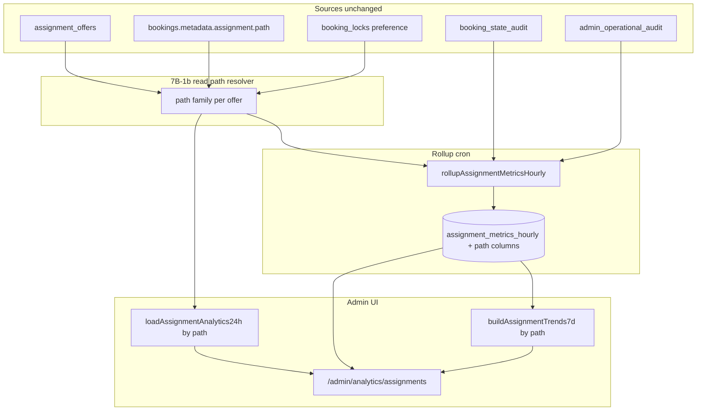

# Stage 7B-1b — Assignment Analytics Path Split Design

**Date:** 2026-05-18  
**Status:** **7B-1b-min shipped** — path-split offer created/accepted on rollups, live 24h, 7d text, admin UI  
**Depends on:** Stage **7B-1a** (shipped), [stage-7b-assignment-funnel-analytics-design.md](./stage-7b-assignment-funnel-analytics-design.md), [stage-7b-1a-assignment-funnel-analytics-final-audit.md](../audits/stage-7b-1a-assignment-funnel-analytics-final-audit.md)

**Goal:** Design **selected-cleaner vs best-available vs admin/manual** assignment funnel breakdowns so admins can compare dispatch paths **without changing assignment behavior**, offer creation, commands, or existing RLS (except additive rollup columns when implemented).

**Hard constraints (this stage):**

- Design only — no app code, migrations, charts, or command changes.
- Do **not** change offer accept/decline/expiry, redispatch, recovery, or cron assignment behavior.
- Do **not** add `assignment_path` to `assignment_offers` (deferred to **7B-4**).
- Do **not** expose `booking_id`, `cleaner_id`, `customer_id`, or raw metadata JSON in admin analytics DTOs.
- **Text/cards only** — no chart library.

---

## Executive summary — design question answers

| # | Question | Recommendation |
|---|----------|----------------|
| 1 | Which paths to split first? | **Tier 1:** `selected`, `best_available`. **Tier 2:** `admin_manual`. **Tier 3:** `fallback_best_available` (separate row or folded into “selected family” copy). Defer booking-level path splits until offer-path attribution is stable. |
| 2 | Where is path stored reliably today? | **`bookings.metadata.assignment.path`** written by `recordAssignmentOutcome` → `RECORD_ASSIGNMENT_ATTENTION`. **Not** on `assignment_offers`. Lock `booking_locks.locked_cleaner_preference` is stable for **initial** intent only. |
| 3 | Use `bookings.metadata.assignment.path`? | **Yes**, as primary rollup/live resolver, plus `resolveAssignmentPathForBooking()` fallback when `path` is null. Document **snapshot bias** (see §Data reliability). |
| 4 | Historical `assignment_offers` missing path? | **All** offer rows lack `assignment_path`; path must be **derived at read/rollup time** from booking metadata (or lock fallback). Pre-metadata bookings and erased paths → **`unknown`**. |
| 5 | Booking-level vs offer-level? | **Offer-level** for `offers_*` funnel metrics. **Global** (unsplit) for `bookings_assigned`, `redispatch`, `max_attempts`, `admin_intervention` in **7B-1b v1**; optional booking-level split in **7B-1c+**. |
| 6 | Selected-cleaner retries? | Same-cleaner idempotent re-offer = **one row**, one `offered_at`; no extra “retry” count. Selected decline/expiry = **no auto-redispatch**; next offer is usually **`admin_manual`** — attribute that offer to `admin_manual`, not `selected`. |
| 7 | Admin manual offers? | Count under path **`admin_manual`** when `metadata.assignment.path = admin_manual` at resolution time. Keep **`admin_intervention_count`** from `admin_operational_audit` as a separate ops metric (do not merge). |
| 8 | Rollup columns vs JSON? | **Flat integer columns** per path family (mirror 7B-1a / `notification_metrics_hourly`). Avoid JSON buckets in v1 — simpler 7d sums and CHECK constraints. |
| 9 | 24h live path split immediately? | **Yes**, using the **same** path resolver as rollup for parity; show **`unknown`** bucket + footnote on snapshot bias. |
| 10 | UI compare selected vs best-available? | Dedicated **path comparison** section: side-by-side text rows (volume, accept rate, decline rate) for 24h and 7d; “insufficient data” when terminal n &lt; 10. |
| 11 | What stays `unknown`? | `path` null and lock inference fails; legacy bookings; ambiguous multi-offer attribution when metadata path changed mid-booking (optional: count in `unknown` rather than wrong bucket). |
| 12 | Privacy rules? | Same as 7B-1a: integer counts only in rollups/DTOs; no identities; server may read `booking_id` internally; cron JSON unchanged. |
| 13 | Migration / RLS? | **Additive** columns on `assignment_metrics_hourly` only; existing RLS policy unchanged; `service_role` upsert only. |
| 14 | Tests? | Migration shape, path partition sums, golden rollup fixtures, live/rollup parity, DTO PII guard, RLS static catalog. |
| 15 | Smallest safe slice? | **7B-1b-min:** migration with `offers_created_*` + `offers_terminal_*` (or accepted-only) for `selected` / `best_available` / `admin_manual` / `unknown`; rollup + 24h + 7d text rows only for those metrics. See §Final recommendation. |

---

## Current 7B-1a baseline

### Shipped artifacts

| Component | Location / behavior |
|-----------|---------------------|
| Table | `assignment_metrics_hourly` — `supabase/migrations/20260520120000_assignment_metrics_hourly.sql` |
| Rollup | `rollupAssignmentMetricsHourly` — previous closed UTC hour, idempotent upsert |
| Cron | `GET/POST /api/cron/rollup-assignment-metrics` — `CRON_SECRET`, env `ASSIGNMENT_METRICS_ROLLUP_ENABLED` |
| Live 24h | `loadAssignmentAnalytics24h` — same aggregation as rollup over rolling 24h |
| 7d trends | `buildAssignmentTrends7d` — sums hourly buckets (14d lookback) |
| Admin UI | `/admin/analytics/assignments` — `AdminAssignmentAnalyticsPanel` (text cards, no charts) |
| Sources | `assignment_offers` (outcomes), `booking_state_audit` (`ACCEPT_CLEANER_ASSIGNMENT`), `admin_operational_audit` (interventions) |

### Current counters (path-agnostic)

| Column | Meaning |
|--------|---------|
| `offers_created_count` | Rows with `offered_at` in bucket |
| `offers_accepted_count` … `offers_cancelled_count` | Terminal outcomes by status timestamp rules |
| `bookings_assigned_count` | Distinct bookings with accept audit in bucket |
| `redispatch_booking_count` | Bookings with ≥2 offers where later `offered_at` in bucket |
| `max_attempts_booking_count` | Bookings whose 5th offer `offered_at` in bucket |
| `admin_intervention_count` | Admin audit actions (manual dispatch, replace, recovery) |

### Gap (7B-1b scope)

All metrics are **aggregated across assignment paths**. Admins cannot answer:

- Is low accept rate driven by **selected** jobs or **best-available** auto-dispatch?
- How much volume is **admin manual** dispatch after attention queues?
- Does **fallback** (selected ineligible → best) behave like selected or best-available?

---

## Path taxonomy

### Canonical path enum (application)

From `src/features/assignments/server/types.ts`:

| `AssignmentPath` | Set by (examples) | Auto-redispatch after decline/expiry? |
|------------------|-------------------|-------------------------------------|
| `selected` | `runAssignmentAfterPayment` → eligible selected cleaner | **No** — admin attention |
| `best_available` | `runAssignmentAfterPayment` → best eligible | **Yes** (same path preserved on redispatch) |
| `fallback_best_available` | Selected ineligible → dispatch to another cleaner | **Yes** |
| `admin_manual` | `adminManualDispatchOffer`, `adminReplaceOpenOffer` | **No** (not in `REDISPATCH_ELIGIBLE_PATHS`) |
| `null` | Missing context, legacy, or historical erase | Treated via `resolveAssignmentPathForBooking` or **`unknown`** |

### Rollup / UI path families (recommended)

| Family key | Includes `metadata.assignment.path` | Customer intent |
|------------|-----------------------------------|-----------------|
| `selected` | `selected` | Customer chose a named cleaner |
| `best_available` | `best_available` | System picks best eligible |
| `fallback` | `fallback_best_available` | Wanted selected; system fell back |
| `admin_manual` | `admin_manual` | Admin dispatched/replaced offer |
| `unknown` | `null` + unresolved inference | Legacy / ambiguous |

**First split for product questions:** `selected` | `best_available` | `admin_manual` (+ `unknown`).  
**Optional v1 row:** `fallback` separate from `selected` (ops cares that it auto-redispatches).

### Path vs lock preference

| Signal | Reliability | Use in analytics |
|--------|-------------|------------------|
| `metadata.assignment.path` | **High** when non-null after dispatch | Primary segment for offers tied to booking |
| `booking_locks.locked_cleaner_preference.mode` | **Stable** for checkout intent | Fallback only via `resolveAssignmentPathForBooking` |
| `metadata.assignment.attemptedAt` | Overwritten each engine touch | **Do not** use for historical cohorts |

```typescript
// resolveAssignmentPathForBooking — processBookingAfterOfferEnded.ts
// metadata.path ?? (lock.mode === "selected" ? "selected" : "best_available")
```

---

## Data reliability analysis

### Where path is **not** stored

| Store | Has per-offer path? | Notes |
|-------|---------------------|-------|
| `assignment_offers` | **No** | Only `booking_id`, `cleaner_id`, status, timestamps |
| `booking_state_audit` | **No** (for path) | `RECORD_ASSIGNMENT_ATTENTION` does not persist `assignment` in `payload` |
| `admin_operational_audit` | Action type only | Correlates with `admin_manual` path, not a substitute for offer path |

### Where path **is** stored

| Store | Field | Written when |
|-------|-------|--------------|
| `bookings.metadata` | `assignment.path` | Each `recordAssignmentOutcome` (dispatch, redispatch, attention, admin manual) |
| `bookings.metadata` | `assignment.status`, `offerId`, `cleanerId` | Same — **latest snapshot only** |

### Snapshot bias (critical)

When rollup/live logic loads `bookings.metadata` **at processing time** and attributes **all offers** for that booking to the current path:

| Scenario | Bias |
|----------|------|
| Single-offer booking, path never changes | **Accurate** |
| `best_available` redispatch (path preserved) | **Accurate** for offer-level path |
| `selected` → admin `admin_manual` second offer | First offer may be mis-tagged **`admin_manual`** if metadata already updated |
| `selected` attention → `fallback_best_available` offer | Earlier attention snapshot may be **`selected`**, later offers **`fallback`** — only latest path visible without history |
| Legacy decline that nulled path (pre–3B-2) | **`unknown`** or lock fallback |

**Conclusion:** `metadata.assignment.path` is **operationally reliable for current behavior** and **approximate for historical multi-offer bookings**. Accurate per-offer historical path requires **7B-4** (`assignment_path` on offer insert) — explicitly out of scope for 7B-1b implementation.

### Are historical `assignment_offers` rows “missing” path?

- **Schema:** Yes — no column ever existed.
- **Attribution:** Path can still be **inferred** for many rows from **current** booking metadata + lock fallback.
- **Gaps:** Bookings never run through `recordAssignmentOutcome`, or path permanently null → **`unknown`** bucket.
- **Do not** backfill offer rows in 7B-1b.

### Should 7B-1b use `bookings.metadata.assignment.path`?

**Yes**, with:

1. Resolver function shared by rollup and live read model (extract from `readAssignmentMetadata` + `resolveAssignmentPathForBooking` pattern).
2. Explicit **`unknown`** bucket and UI disclaimer.
3. Optional conservative rule: if booking has **&gt;1** offer and `attemptedAt` of metadata is **after** offer `offered_at`, treat offer as **`unknown`** unless 7B-4 — **defer** unless bias testing shows large error (adds query complexity).

---

## Offer-level vs booking-level attribution

| Metric | Level in 7B-1b | Path attribution |
|--------|----------------|------------------|
| `offers_created` | **Offer** | Path resolved per `booking_id` at `offered_at` processing time |
| Terminal offers (`accepted`, `declined`, …) | **Offer** | Same resolver at terminal event time (same booking snapshot — same bias) |
| `bookings_assigned` | **Booking** (global in v1) | Path at accept time would need audit/metadata join — **defer split** |
| `redispatch_booking_count` | **Booking** (global) | Naturally `best_available` / `fallback` heavy — optional note in UI |
| `max_attempts_booking_count` | **Booking** (global) | Same |
| `admin_intervention_count` | **Audit** (global) | Already path-agnostic ops signal; complements `admin_manual` **offer** volume |

**Rationale:** Admin questions are mostly **offer outcome rates by dispatch mode**. Booking-level splits double-count poorly when paths change mid-booking.

---

## Counting rules by path behavior

### Selected-cleaner flow

| Event | Counting |
|-------|----------|
| First dispatch `path: selected` | `offers_created_selected` |
| Cleaner declines / offer expires | Terminal outcome in **`selected`** if metadata still `selected` |
| Auto-redispatch | **Does not happen** |
| Admin manual dispatch | New offer → **`admin_manual`** (not selected) |
| Idempotent re-offer same cleaner | No new `offered_at` row — **not** a second create |

### Best-available flow

| Event | Counting |
|-------|----------|
| First dispatch `path: best_available` | `offers_created_best_available` |
| Decline/expiry → auto-redispatch | Subsequent offers stay **`best_available`** in metadata |
| Terminal outcomes | Bucket under **`best_available`** while path preserved |
| 5th offer / max attempts | Offer create still **`best_available`**; `max_attempts` booking counter stays global |

### Fallback flow

| Event | Counting |
|-------|----------|
| Customer selected, cleaner ineligible | Attention metadata may briefly show `selected`, then dispatch `fallback_best_available` |
| Offers after fallback dispatch | **`fallback`** bucket (recommended separate from `selected` for honest accept-rate compare) |

### Admin manual flow

| Event | Counting |
|-------|----------|
| `adminManualDispatchOffer` / `adminReplaceOpenOffer` | `recordAssignmentOutcome` sets `path: admin_manual` |
| Offer created | `offers_created_admin_manual` |
| Terminal outcomes | `offers_*_admin_manual` |
| `admin_intervention_count` | **Also** increment audit-based counter (already in 7B-1a) — two lenses: **audit events** vs **offers under admin path** |

---

## Rollup schema options

### Option A — Flat columns (recommended)

Add path-suffixed columns to `assignment_metrics_hourly` for each metric that gets split in the phase.

**Example (offer created + terminal accepted — minimal slice):**

```text
offers_created_selected_count
offers_created_best_available_count
offers_created_admin_manual_count
offers_created_fallback_count          -- optional tier 2
offers_created_unknown_count

offers_accepted_selected_count
offers_accepted_best_available_count
offers_accepted_admin_manual_count
offers_accepted_fallback_count
offers_accepted_unknown_count
```

Extend to `declined` / `expired` / `cancelled` in a follow-up sub-phase if accept-rate-by-path is insufficient.

**Properties:**

- `CHECK (count >= 0)` per column
- Partition identity: `sum(path columns) <= offers_created_count` (equality when every offer resolves to exactly one family)
- 7d trends: reuse `sumAssignmentMetricsCounters` over path columns

### Option B — JSONB `path_counts`

Example: `path_counts jsonb` keyed by path family.

| Pros | Cons |
|------|------|
| Fewer migrations when adding paths | Harder SQL constraints, trend sums, and migration tests |
| Flexible keys | Easy to accidentally store non-integer or PII if schema drifts |

**Recommendation:** **Option A** for 7B-1b.

### Option C — Child table `assignment_metrics_hourly_by_path`

Normalized `(bucket_start, path_family, metric_key, count)`.

| Pros | Cons |
|------|------|
| Very extensible | New table + RLS + more complex cron; heavier than needed for four paths |

**Defer** unless path cardinality grows beyond ~6 families.

---

## Live metrics strategy

### 24h live (`loadAssignmentAnalytics24h`)

| Topic | Approach |
|-------|----------|
| Include path split? | **Yes** — same resolver as rollup |
| Query pattern | Fetch offers in window (existing) → distinct `booking_id`s → batch load `bookings.metadata` (+ lock if needed for fallback) → map each offer to path family → aggregate |
| DTO shape | Add nested object, e.g. `live24h.byPath.selected.offersCreated`, `acceptRatePercent` — **numbers only** |
| Performance | One extra booking metadata query per distinct booking in window (bounded by offer volume; same order as 7B-1a) |
| Partial hour | Live window may include current hour; rollups still **closed hours only** — UI footnote already exists for 7d coverage |

### 7d trends

| Topic | Approach |
|-------|----------|
| Source | Sum path columns from `assignment_metrics_hourly` |
| Deltas | Per-path accept rate delta vs prior 7d (optional in min slice: volume only) |
| Coverage | Reuse `partialCoverageNote` from 7B-1a |

### Cron / rollup

- Extend `aggregateAssignmentMetricsHourly` (or sibling) to accept path-tagged offers.
- **No change** to cron auth, bucket selection, or assignment engine.
- Backfill: re-run `backfillAssignmentMetricsHourly` after migration to populate path columns for closed buckets (optional ops run).

---

## UI proposal (text only)

### Section: Path comparison (24h live)

Placement: below existing global 24h cards on `/admin/analytics/assignments`.

```text
Assignment by path (24h live)
  Selected cleaner
    Offers sent: N
    Accept rate: X% (terminal T)   [or "Insufficient data (<10 terminal)"]
  Best available
    Offers sent: N
    Accept rate: X%
  Admin manual
    Offers sent: N
    Accept rate: X%
  Unknown path
    Offers sent: N   [only show if > 0]
```

Copy footnote:

> Path is derived from booking assignment metadata at query time. Multi-offer bookings may be approximate until per-offer path is recorded (planned 7B-4).

### Section: Path comparison (7d trends)

Bulleted lines (mirror notification trends style):

- `Selected — offers sent (7d): N · accept rate: X%`
- `Best available — offers sent (7d): N · accept rate: X%`
- `Admin manual — offers sent (7d): N · accept rate: X%`

**No charts.** No links to individual bookings. No home-dashboard widget in min slice (optional 7B-1b+ teaser later).

### Sample size gate

| Rule | Value |
|------|-------|
| Show accept rate by path | Terminal offers in path ≥ **10** |
| Otherwise | “Insufficient data” |

---

## Privacy and safety rules

Inherit [stage-7b-assignment-funnel-analytics-design.md](./stage-7b-assignment-funnel-analytics-design.md) §Excluded / sensitive data:

| Rule | 7B-1b |
|------|-------|
| Rollup table columns | Non-negative integers + `bucket_start` timestamps only |
| Admin DTO | No UUIDs, emails, names, addresses, `metadata` JSON, audit `payload` |
| Cron response | Aggregate counts only (extend with path totals, not IDs) |
| Internal server queries | May use `booking_id` to join; never persist IDs in `assignment_metrics_hourly` |
| `assignment.reason` free text | **Not** exposed in analytics |

---

## Migration and RLS

### Migration (when implemented)

| Change | Allowed? |
|--------|----------|
| `ALTER TABLE assignment_metrics_hourly ADD COLUMN …` | **Yes** |
| New RLS policies on `assignment_offers` / `bookings` | **No** |
| Triggers on assignment engine | **No** |

RLS remains: `assignment_metrics_hourly_select_admin` → `auth_is_admin()`; `service_role` INSERT/UPDATE only.

### Application changes (when implemented)

| Area | Change |
|------|--------|
| `assignmentMetricsAggregate.ts` | Path-aware counting |
| `assignmentAnalyticsRollupQueries.ts` | Batch booking metadata fetch |
| `rollupAssignmentMetricsHourly.ts` | Write path columns |
| `assignmentAnalyticsReadModel.ts` | Path DTOs for 24h / 7d |
| `AdminAssignmentAnalyticsPanel.tsx` | Path text sections |
| `assignmentTrends7d.ts` | Optional path trend fields |

**No changes:** `createDispatchOffer`, `executeBookingCommand`, `respondToOffer`, `processBookingAfterOfferEnded`, offer cron.

---

## Tests (when implemented)

| Layer | Test |
|-------|------|
| Migration | New columns exist, `CHECK >= 0`, grants unchanged, static RLS catalog |
| Path resolver | Unit: metadata path, null + lock `selected`/`best_available`, `admin_manual` |
| Aggregate | Golden fixture: 3 offers, 3 paths → partition sums |
| Partition invariant | `sum(path created) === offers_created` when all resolved; `<=` when unknown excluded from equality |
| Rollup integration | Mock Supabase: booking metadata join, upsert includes path columns |
| Live vs rollup | Same fixture → same path counts for closed 24h window |
| Read model DTO | Serialized page has no `bookingId`, `cleanerId`, `email`, `payload` keys |
| Regression | 7B-1a global totals unchanged when path columns summed; assignment engine tests untouched |
| UI | Panel renders path section; no chart imports |

SQL policy file (mirror 5H / 7B-1a): `supabase/tests/assignment_metrics_hourly_rls_phase7b1b_checks.sql` (optional name).

---

## Phased rollout

| Phase | Scope | Risk |
|-------|-------|------|
| **7B-1b-min** | Migration: path columns for `offers_created` + `offers_accepted` (or all terminal) for `selected`, `best_available`, `admin_manual`, `unknown` (+ optional `fallback`). Rollup + backfill. Live 24h path block. 7d path lines for volume + accept rate. | Low |
| **7B-1b-full** | Decline/expire/cancel by path; fallback row in UI; conservative multi-offer unknown rule | Low–medium |
| **7B-1c** | Median latency cards (global + optional by path) | Low |
| **7B-4** | `assignment_offers.assignment_path` at insert — **requires approved command touch** | Medium — accuracy fix |

Each phase: read-only analytics; no assignment behavior change.

---

## Architecture (target state)



---

## Final recommendation

1. **Adopt flat path-suffixed columns** on `assignment_metrics_hourly` for offer funnel metrics first.
2. **Attribute at offer level** using `bookings.metadata.assignment.path` with `resolveAssignmentPathForBooking` fallback and an **`unknown`** bucket.
3. **Ship 24h and 7d path comparison together** so admins are not misled by rollup-only or live-only splits.
4. **Keep booking-level counters global** in the first slice; label redispatch/max-attempts as “all paths” in UI.
5. **Document snapshot bias** prominently; plan **7B-4** for accurate history without blocking 7B-1b value.
6. **Do not** use JSON rollups or alter assignment commands in 7B-1b.

---

## Final question: safest smallest 7B-1b implementation slice?

**7B-1b-min — Path-split offer funnel only (selected / best-available / admin-manual / unknown)**

1. **Migration:** Add **eight** columns to `assignment_metrics_hourly`:
   - `offers_created_{selected,best_available,admin_manual,unknown}_count`
   - `offers_accepted_{selected,best_available,admin_manual,unknown}_count`  
   (Terminal decline/expire/cancel by path can wait one beat.)
2. **Path resolver module** (read-only): given `booking_id` + booking row metadata (+ optional lock fetch), return path family — **no command changes**.
3. **Rollup + live:** Extend aggregation to tag each `offers_created` / accepted terminal offer; upsert new columns; batch-fetch metadata for distinct bookings in bucket/window.
4. **UI:** One “Assignment by path (24h)” block + three 7d bullet lines (selected / best available / admin manual) with sample-size gate; show `unknown` only if nonzero.
5. **Tests:** Migration static test, resolver unit tests, one golden aggregate fixture, DTO PII guard, `sum(path created) <= offers_created`.
6. **Docs:** Ops note under `admin-operational-dashboard.md` — path metrics approximate until 7B-4.

**Why this is safest**

- Additive schema + read-only joins; **no** offer lifecycle or RLS changes on operational tables.
- Delivers the core admin question: **accept rate and volume for selected vs best-available vs admin manual**.
- Limits column explosion (8 vs 20+).
- Surfaces **`unknown`** honestly instead of mis-labeling legacy data.
- Leaves **fallback** split, terminal-by-path decline/expire, booking-level path splits, charts, and **7B-4** offer column for follow-ups.

**Do not start 7B-1b with:** `assignment_path` on offers, JSON metric blobs, booking-assigned-by-path, or home-dashboard widgets.
