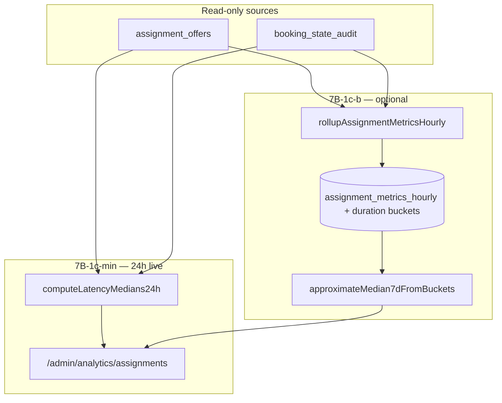

# Stage 7B-1c — Assignment Latency Metrics Design

**Date:** 2026-05-18  
**Status:** **7B-1c-min shipped** (live 24h global medians); **7B-1c-b deferred** (7d histogram rollups)  
**Depends on:** Stage **7B-1a** (shipped), **7B-1b-min** (shipped), [stage-7b-assignment-funnel-analytics-design.md](./stage-7b-assignment-funnel-analytics-design.md), [stage-7b-1b-assignment-path-split-analytics-design.md](./stage-7b-1b-assignment-path-split-analytics-design.md), [stage-7b-1b-assignment-path-split-analytics-final-audit.md](../audits/stage-7b-1b-assignment-path-split-analytics-final-audit.md)

**Goal:** Design **read-only** assignment **latency** metrics so admins understand how long assignment takes, **without** changing assignment behavior, exposing PII, or adding cleaner-level analytics.

**Hard constraints (7B-1c-min shipped slice):**

- Read-only app code only — **no migrations**, charts, or command changes in this slice.
- Do **not** change offer accept/decline/expiry, redispatch, recovery, or cron behavior.
- Do **not** change RLS on `assignment_offers`, `booking_state_audit`, `bookings`, or `payments`.
- Do **not** add mutation routes or admin actions from analytics UI.
- Do **not** expose `booking_id`, `cleaner_id`, `customer_id`, names, emails, or raw metadata/audit payloads in admin DTOs or rollup tables.
- Do **not** add cleaner-level latency or charts in 7B-1c.
- **Text/cards only** — same surface as 7B-1a/1b.

---

## Executive summary — design question answers

| # | Question | Recommendation |
|---|----------|----------------|
| 1 | Which latency metrics matter first? | **(1)** Median **time-to-assigned** (booking-level). **(2)** Median **cleaner response time** (offer-level, accept+decline). **(3)** Median **time-to-first-offer** (booking-level). Defer offer-open duration trends and paid→first-offer until a follow-up slice. |
| 2 | Measure time-to-first-offer? | **Yes** — `first_offered_at − entered_pending_at` per booking. Baseline = first `MOVE_TO_PENDING_ASSIGNMENT` audit, not payment time (v1). |
| 3 | Measure cleaner response time? | **Yes** — `responded_at − offered_at` for `accepted` and `declined` only. |
| 4 | Measure time-to-accept? | **Offer-level:** same as cleaner response for `accepted`. **Booking-level:** use **time-to-assigned** instead (cleaner + engine steps). Do not add a separate “time-to-accept” card in v1. |
| 5 | Measure time-to-assigned? | **Yes** — primary KPI: `ACCEPT_CLEANER_ASSIGNMENT.created_at − first MOVE_TO_PENDING_ASSIGNMENT.created_at`. |
| 6 | Which timestamps are reliable? | **High:** `assignment_offers.offered_at`, `responded_at` (accept/decline/cancel), `booking_state_audit.created_at`. **Fallback:** `updated_at` on `expired` offers. **Avoid v1:** `payments.updated_at`, `expires_at`, `metadata.assignment.attemptedAt`. |
| 7 | `assignment_offers` only, audit only, or both? | **Both:** offers for per-offer latency; audit for booking-level pending→assigned and pending→first-offer anchors. No new writes; read-only joins in server read model / rollup cron. |
| 8 | Average, median, or p90? | **Median (p50)** in UI for 24h live. **Defer p90** to 7B-1c+ or live-only with sample gate. **Do not** show mean alone (48h TTL and admin delays skew mean). |
| 9 | Global first or split by path? | **Global first** (7B-1c-min). Path-split latency in **7B-1d** after global medians are stable (same snapshot bias as 7B-1b). |
| 10 | Live only, rollup only, or both? | **Live 24h first** (matches parent 7B deferral). **7d latency trends** via rollup **histogram buckets** in **7B-1c-b** — not sum/count alone. |
| 11 | Rollups: sums/counts or percentile buckets? | **Neither mean-only sums** (cannot reconstruct median). Use **fixed duration histogram buckets** (counts per bucket) for 7d; optional `sample_count` per metric. Live 24h computes exact median in app memory. |
| 12 | Expired / no-response offers? | **Exclude** from cleaner response time. Report separately as **median offer open duration** (expired only): `coalesce(responded_at, updated_at) − offered_at`. Optional footnote count only in min slice. |
| 13 | Admin/manual offers? | **Same formulas**; include in global numerators. **Do not** path-split in 7B-1c-min. Expect long tails; footnote in UI. |
| 14 | Privacy risks? | Re-identification via rare booking traces if IDs leak; cleaner workload inference if per-cleaner stats added (out of scope). Mitigate: aggregates only in DTO/rollups, no UUID columns, no export. |
| 15 | Safest first implementation slice? | **7B-1c-min:** live 24h **global** median cards for time-to-assigned, cleaner response, time-to-first-offer; sample-size gate; no migration. See §Final recommendation. |

---

## Current 7B baseline

### Shipped (7B-1a)

| Component | Location / behavior |
|-----------|---------------------|
| Table | `assignment_metrics_hourly` — `supabase/migrations/20260520120000_assignment_metrics_hourly.sql` |
| Counters | Offer volumes, terminal outcomes, `bookings_assigned_count`, redispatch, max attempts, admin interventions |
| Rollup | `rollupAssignmentMetricsHourly` — previous closed UTC hour |
| Cron | `/api/cron/rollup-assignment-metrics` — `ASSIGNMENT_METRICS_ROLLUP_ENABLED` |
| Live 24h | `loadAssignmentAnalytics24h` |
| 7d trends | `buildAssignmentTrends7d` — sums hourly buckets |
| UI | `/admin/analytics/assignments` — `AdminAssignmentAnalyticsPanel` |

### Shipped (7B-1b-min)

| Component | Behavior |
|-----------|----------|
| Migration | `20260521103000_assignment_metrics_hourly_path_split.sql` — 8 path columns (`offers_created_*`, `offers_accepted_*`) |
| Path resolver | `resolveAssignmentAnalyticsPath` — read-only metadata + lock fallback |
| UI | Path breakdown (24h + 7d) for volume and accept rate |
| Limitation | Path from **current** metadata at read time (7B-4 deferred for per-offer snapshot) |

### Shipped (7B-1c-min)

| Component | Location / behavior |
|-----------|---------------------|
| Pure metrics | `assignmentLatencyMetrics.ts` — duration math, median, exclusions |
| DTO | `assignmentLatencyDto.ts` — `medianMinutes`, `sampleSize`, `status` (`ok` \| `insufficient_data`) |
| Read model | `assignmentLatencyReadModel.ts` + `loadAssignmentAnalytics24h` |
| UI | `/admin/analytics/assignments` — “Assignment latency (24h live)” section (3 stat cards) |
| Tests | `assignmentLatencyMetrics.test.ts`, `assignmentLatencyDto.test.ts`, `assignmentLatencyReadModel.test.ts`, panel + read-model guards |

**No migration**, no rollup/cron changes, no assignment command or RLS changes.

### Gap (7B-1c-b+)

7d latency trends (histogram buckets), expired open-duration median, p90, path-split latency (7B-1d).

---

## Proposed latency metrics

### Tier 1 — ship in 7B-1c-min (global, 24h live)

| Metric key | Level | Definition | Start | End | Denominator |
|------------|-------|------------|-------|-----|-------------|
| `median_time_to_assigned` | Booking | First assignment completion | First `booking_state_audit` row with `command = 'MOVE_TO_PENDING_ASSIGNMENT'` for booking | First `command = 'ACCEPT_CLEANER_ASSIGNMENT'` | Bookings with accept audit `created_at` in 24h window |
| `median_cleaner_response_time` | Offer | Cleaner decision latency | `assignment_offers.offered_at` | `assignment_offers.responded_at` | Terminal offers with `status IN ('accepted','declined')` and non-null `responded_at`, terminal event in 24h window |
| `median_time_to_first_offer` | Booking | Engine dispatch latency after entering assignment | First `MOVE_TO_PENDING_ASSIGNMENT.created_at` | `min(offered_at)` over offers for booking | Bookings whose **first** `offered_at` falls in 24h window |

**Display:** Human-readable duration (e.g. `4.2 h`, `38 min`) — not raw milliseconds in UI.

**Sample gate (match 7B-1b):** If denominator &lt; **10**, show “Insufficient data” instead of a median.

### Tier 2 — follow-up (7B-1c-b or 7B-1c-full)

| Metric key | Definition | Notes |
|------------|------------|-------|
| `median_offer_open_duration_expired` | `coalesce(responded_at, updated_at) − offered_at` where `status = 'expired'` | Cron batch expiry skews `updated_at` slightly after `expires_at`; document in footer |
| 7d trend lines | Median approximated from rollup histogram or “live-only 7d” second pass | See §Rollup schema options |
| `median_time_to_first_offer_from_paid` | `min(offered_at) − payments.updated_at` where `status = 'paid'` | Extra join; payment retry/idempotency edge cases — defer |
| p90 cards | 90th percentile on same samples as Tier 1 | Live computation only; gate at n ≥ 30 |

### Tier 3 — defer (7B-1d+)

| Item | Reason |
|------|--------|
| Latency by assignment path | Snapshot bias on multi-offer bookings (same as 7B-1b) |
| Latency by redispatch attempt index | Needs booking-level sequence logic + larger samples |
| Cleaner-level response time | Privacy / workload inference |
| Charts / home teaser | Explicitly out of scope for 7B-1c |

### Explicit non-metrics (do not add in 7B-1c)

| Anti-metric | Reason |
|-------------|--------|
| Per-booking SLA breach list | Operational queue (7A), not analytics |
| Open-offer age distribution (point-in-time) | Different question from terminal latency; confuses “still waiting” with “slow outcome” |
| `expires_at − offered_at` as “response time” | Scheduled TTL, not observed behavior |
| Double-counting audit `EXPIRE_ASSIGNMENT_OFFER` + offer row | Offer row is source of truth (7B-1a rule) |

---

## Timestamp reliability analysis

### `assignment_offers`

| Column | Reliability | Use for latency |
|--------|-------------|-----------------|
| `offered_at` | **High** — set at dispatch insert | Start of offer-level metrics |
| `responded_at` | **High** for `accepted`, `declined`, `cancelled` — set in `executeBookingCommand` | End of cleaner response (accept/decline only in v1) |
| `responded_at` on `expired` | **Usually null** — `EXPIRE_ASSIGNMENT_OFFER` updates `status` + `updated_at` only (`supabaseBookingCommandBackend.expireAssignmentOffer`) | Do not use for cleaner response; use `updated_at` fallback only for **expired open duration** |
| `updated_at` | **High** for expiry completion time; **low** for other statuses (may change without terminal event) | `coalesce(responded_at, updated_at)` for expired terminal bucket only (already used in `terminalEventTimestamp`) |
| `created_at` | ≈ `offered_at` | Redundant — prefer `offered_at` |
| `expires_at` | Scheduled bound (default **48h** — `ASSIGNMENT_OFFER_TTL_HOURS`) | Not observed latency |

### `booking_state_audit`

| Command | Reliability | Use for latency |
|---------|-------------|-----------------|
| `MOVE_TO_PENDING_ASSIGNMENT` | **High** — one per post-payment assignment entry (idempotent replay does not shift first timestamp if keyed) | Booking-level **start** for time-to-first-offer and time-to-assigned |
| `ACCEPT_CLEANER_ASSIGNMENT` | **High** — booking transitions to `assigned` | Booking-level **end** for time-to-assigned |
| `OFFER_TO_CLEANER` | **Not written** to audit | Cannot use audit for offer create |
| `EXPIRE_ASSIGNMENT_OFFER` | **High** for expiry *event* time | Optional cross-check only; prefer offer row |
| `DECLINE_CLEANER_ASSIGNMENT` | **Not written** | Use offer `responded_at` |

**Idempotency:** For booking-level metrics, use **`min(created_at)`** per `(booking_id, command)` among rows in scope, not “latest” audit row.

### `payments`

| Field | Reliability | 7B-1c use |
|-------|-------------|-----------|
| `updated_at` when `status = 'paid'` | **Medium** — finalize path sets paid; retries may add noise | Defer **paid → first offer** to Tier 2 |
| Multiple payment rows per booking | Possible edge case | Requires `min(paid transition)` rule before use |

### `bookings.metadata.assignment`

| Field | Reliability | Use |
|-------|-------------|-----|
| `attemptedAt` | **Low** — overwritten on each engine touch | **Do not use** |
| `path` | Snapshot at read time | Path latency deferred |

### Cross-source consistency checks (read model only, not UI)

| Check | Action if mismatch |
|-------|-------------------|
| `responded_at` on accepted offer vs `ACCEPT_CLEANER_ASSIGNMENT.created_at` | Expect small delta (same transaction order); large drift → log internal diagnostic only |
| First `offered_at` before `MOVE_TO_PENDING_ASSIGNMENT` | Exclude booking from time-to-first-offer (data anomaly) or clamp — document exclusion rule in tests |

---

## Average vs median decision

| Statistic | Verdict | Rationale |
|-----------|---------|-----------|
| **Median (p50)** | **Primary for UI** | Robust to 48h expiry tails, admin manual delays, and redispatch loops |
| **Mean (average)** | **Do not show in v1** | A few multi-day expiries distort mean; admins misread “average” as typical |
| **p90** | **Defer** or live-only with **n ≥ 30** | Useful for ops SLOs later; needs sample discipline |
| **Min / max** | **Never** | Outlier-driven; privacy-sensitive anecdotes |

**Rollup implication:** Storing `sum_duration_ms` + `count` enables **mean only**, not median. Exact medians over 7d require either:

- Re-scanning source rows (expensive — already avoided for counts in 7B-1a), or
- **Histogram buckets** (recommended for 7B-1c-b), or
- **Quantile sketches** (overkill for v1).

**7B-1c-min:** Compute medians in the **live 24h** read model over a bounded offer/audit fetch (same pattern as existing `loadAssignmentAnalytics24h`).

---

## Live vs rollup strategy



| Window | 7B-1c-min | 7B-1c-b |
|--------|-----------|---------|
| **24h** | Exact median in server read model | Same |
| **7d** | Text: “7d latency trends require rollup buckets (coming soon)” or omit section | Sum buckets across 168 hours; approximate p50 from histogram |
| **Cron** | Unchanged | Extend rollup payload only — no new cron route |

**Parity rule:** When rollups ship, document that 7d median is **approximate** (histogram), while 24h is **exact** (sort-based median).

---

## Rollup schema options

### Option A — Duration histogram buckets (recommended for 7B-1c-b)

Add integer columns per metric — counts of observations falling into fixed buckets (no IDs).

**Example bucket boundaries (minutes):**  
`0–15`, `15–60`, `1–4h`, `4–12h`, `12–24h`, `24–48h`, `48h+`

| Column pattern | Type |
|----------------|------|
| `time_to_assigned_bucket_*_count` | int ≥ 0 |
| `cleaner_response_bucket_*_count` | int ≥ 0 |
| `time_to_first_offer_bucket_*_count` | int ≥ 0 |
| `*_sample_count` | int ≥ 0 (optional integrity check = sum of buckets) |

**Pros:** Additive across hours; admin SELECT still PII-free; can approximate p50/p90.  
**Cons:** Migration width (~7 buckets × 3 metrics = 21 columns); median is approximate.

### Option B — sum_ms + count (not recommended alone)

| Pros | Cons |
|------|------|
| Small schema | Only **mean**; misleading for assignment latency |

### Option C — Percentile sketch columns (e.g. t-digest)

**Defer** — operational complexity, harder migration tests, no existing pattern in repo.

### Option D — Child table `assignment_latency_hourly`

Normalized `(bucket_start, metric_key, duration_bucket, count)`.

**Defer** unless column explosion becomes unmaintainable.

**Recommendation:** **7B-1c-min = no migration.** **7B-1c-b = Option A** on `assignment_metrics_hourly`.

---

## Source selection: offers vs audit

| Metric | Primary source | Secondary / anchor |
|--------|----------------|-------------------|
| Cleaner response time | `assignment_offers` | — |
| Offer open duration (expired) | `assignment_offers` | — |
| Time-to-first-offer | `assignment_offers` (`min(offered_at)`) | `booking_state_audit` (`MOVE_TO_PENDING_ASSIGNMENT`) |
| Time-to-assigned | `booking_state_audit` (`ACCEPT_CLEANER_ASSIGNMENT`) | Optional sanity check: accepted offer `responded_at` |

**Do not** derive offer create times from audit. **Do not** change commands to add audit rows for latency.

### Booking-level join strategy (server-only)

1. Fetch terminal offers and assigned booking audits in 24h window (bounded queries, same as 7B-1a).
2. Collect distinct `booking_id` internally — **strip before DTO serialization**.
3. Batch-fetch first `MOVE_TO_PENDING_ASSIGNMENT` per booking (`min(created_at)`).
4. Compute durations in pure functions (`assignmentLatencyMetrics.ts` — proposed).
5. Return **medians + sample counts** only.

---

## Expired and no-response offers

| Outcome | Cleaner response metric | Separate “open duration” metric |
|---------|-------------------------|----------------------------------|
| `accepted` | Include (`responded_at − offered_at`) | — |
| `declined` | Include | — |
| `cancelled` | **Exclude** in v1 (often admin-driven; mixes friction with cleaner speed) | Optional later |
| `expired` | **Exclude** | Include in Tier 2: `coalesce(responded_at, updated_at) − offered_at` |
| Still `offered` | **Exclude** (open offers) | Not a terminal latency |

**No-response** is represented by **expired** after TTL; do not invent synthetic `responded_at`.

**Cron expiry lag:** `updated_at` may be slightly **after** `expires_at` (batch cron). Footnote: “Expired offers use completion time when cleaner did not respond.”

---

## Admin / manual offers

| Topic | Policy |
|-------|--------|
| Inclusion | Include admin_manual offers in **global** cleaner response and offer-duration stats |
| Interpretation | Long tails expected; UI footnote: “Manual dispatch included; not isolated until path-split latency (7B-1d).” |
| Cancelled after admin replace | Excluded from cleaner response if `cancelled`; counts toward ops friction elsewhere (volumes already in 7B-1a) |
| time-to-assigned | Includes admin-heavy bookings — reflects **real** customer wait |

**Do not** add admin-only latency cards in 7B-1c-min (sample sizes too small).

---

## Privacy policy

| Rule | 7B-1c enforcement |
|------|-------------------|
| Rollup / DTO columns | Non-negative integers, durations as formatted strings or rounded numbers — **no UUIDs** |
| Server internal queries | May use `booking_id` / `offer.id` for joins; never persist in `assignment_metrics_hourly` |
| Cleaner/customer identity | **No** names, emails, phones, addresses |
| Cleaner-level breakdown | **Forbidden** in 7B-1c (infers individual performance) |
| Audit `payload` / booking `metadata` JSON | **Not** exposed |
| Small-n re-identification | Sample gate n ≥ 10; do not show max latency or single-booking examples |
| Export / API | Same DTO as page — no bulk ID export |

**Threat model note:** Even aggregate medians by path + rare geography could be sensitive at small scale — path-split latency waits for 7B-1d with same gates as accept rate.

---

## UI proposal (text only)

**Placement:** New section on `/admin/analytics/assignments` below **Assignment funnel (24h live)** and above path breakdown.

```text
Assignment latency (24h live)
  Median time to first offer: 12 min (n=47)
  Median cleaner response time: 3.4 h (n=52)   [accepted + declined only]
  Median time to assigned: 5.1 h (n=41)

Footnotes:
  - Medians use booking/offer timestamps; open offers excluded.
  - Cleaner response excludes expired and cancelled offers.
  - Manual dispatch and multi-offer bookings included in global figures.
  - Path-specific latency deferred.
```

**7d (7B-1c-b only):**

```text
7-day latency (from hourly rollups, approximate)
  Median time to assigned: ~4.8 h
  Median cleaner response: ~3.1 h
```

**No charts.** No links to booking detail. No home-dashboard widget.

---

## Test plan (when implemented)

| Layer | Test |
|-------|------|
| Pure functions | Median of empty → null; odd/even length; duration math with fixed ISO timestamps |
| Golden fixtures | 3 bookings: fast accept, slow decline, expired excluded from response median |
| time-to-assigned | Requires audit rows; idempotent double accept ignored |
| time-to-first-offer | Second offer ignored for “first”; `offered_at` before pending excluded |
| DTO guard | Serialized page JSON has no `booking_id`, `cleaner_id`, `email`, `payload` |
| Sample gate | n=9 → “Insufficient data” label |
| Regression | 7B-1a/1b counts unchanged; assignment command tests untouched |
| Rollup buckets (7B-1c-b) | Bucket sums match live median band on fixture hour |
| RLS | No new policies on operational tables; histogram migration admin SELECT only |

---

## Phased rollout

| Phase | Scope | Risk |
|-------|-------|------|
| **7B-1c-min** | Live 24h global median cards (3 metrics); read model only; **no migration** | **Lowest** |
| **7B-1c-b** | Histogram columns on `assignment_metrics_hourly` + rollup + approximate 7d text | Low |
| **7B-1c-full** | Expired open-duration median + optional p90 live + paid→first-offer | Low–medium |
| **7B-1d** | Path-split latency (same resolver caveats as 7B-1b) | Medium (interpretation) |
| **7B-4** | Per-offer `assignment_path` at insert — improves path latency accuracy | Medium (schema; not 7B-1c) |

Each phase: read-only; no assignment engine changes.

---

## Risks and mitigations

| Risk | Mitigation |
|------|------------|
| Expired offers lack `responded_at` | Exclude from cleaner response; use `updated_at` only for expired-duration metric |
| Cron expiry batches cluster `updated_at` | Footnote; optional Tier 2 compare to `expires_at` for skew monitoring (internal) |
| Multi-offer booking skews time-to-assigned | Median + footnote; 7B-4 later |
| `MOVE_TO_PENDING` missing on legacy booking | Exclude from booking-level metrics; count in internal `excludedCount` only if needed |
| Heavy 24h query | Reuse bounded fetches; compute medians in memory over ≤ few thousand terminal rows |
| Confusion with 7A queue counts | Section title “historical latency”; link to funnel section |
| Mean vs median misuse | Never show mean in v1 |
| Path snapshot bias (7B-1d) | Defer path-split latency until global metrics validated |

---

## Final recommendation

1. **Ship 7B-1c-min without a migration:** three **global** median cards on `/admin/analytics/assignments` for **24h live** only.
2. **Use `assignment_offers` + `booking_state_audit`** — offers for per-offer intervals; audit for booking-level pending→assigned and pending→first-offer.
3. **Report median (p50)** with **n ≥ 10** sample gate; exclude expired/cancelled from cleaner response.
4. **Defer** 7d latency rollups until **histogram buckets** (7B-1c-b); do not store sum/count-only rollups.
5. **Defer** path-split, p90, paid baseline, charts, and cleaner-level stats.
6. **Do not** change commands, offer lifecycle, RLS, or cron behavior.

---

## Final question: safest smallest 7B-1c implementation slice?

**7B-1c-min — Live 24h global latency medians (read model only)**

1. **Read model module** (proposed `assignmentLatencyMetrics.ts` + extend `loadAssignmentAnalytics24h`):
   - Compute **median time-to-assigned**, **median cleaner response time** (accept+decline), **median time-to-first-offer** over rolling 24h UTC window.
   - Internal `booking_id` joins only; DTO exposes formatted durations + sample counts.
2. **UI:** Three `MetricCard`s in a new “Assignment latency (24h live)” section; footnotes per §UI proposal.
3. **Tests:** Pure median/duration tests; golden fixture; DTO PII guard; sample gate.
4. **Docs:** Add subsection under `admin-operational-dashboard.md` §Assignment funnel analytics.
5. **Explicitly out of scope for this slice:** migration, rollup cron changes, 7d latency trends, path split, p90, expired-duration card, charts.

**Why this is safest**

- **Additive read-only** logic on data admins can already SELECT — no new tables, RLS, or engine touches.
- Delivers the core admin question: **“How long does assignment take?”** without misleading 7d approximations on day one.
- Avoids rollup schema mistakes (mean-only columns that cannot reproduce median).
- Keeps path-split and expired-offer nuance for follow-ups once global numbers are trusted in ops review.

**Do not start 7B-1c with:** histogram migration, path-split latency, paid→first-offer joins, cleaner-level stats, or home-dashboard widgets.
