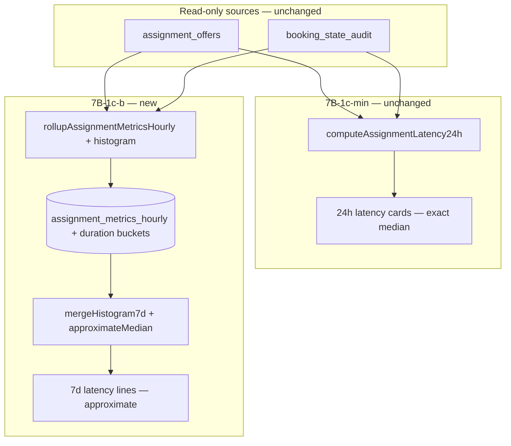

# Stage 7B-1c-b — Assignment Latency Histogram Rollups Design

**Date:** 2026-05-18  
**Status:** **7B-1c-b shipped** — all three global 7d latency histograms (time-to-assigned, cleaner response, time-to-first-offer)  
**Depends on:** Stage **7B-1a** (shipped), **7B-1b-min** (shipped), **7B-1c-min** (shipped), [stage-7b-1c-assignment-latency-metrics-design.md](./stage-7b-1c-assignment-latency-metrics-design.md), [stage-7b-assignment-funnel-analytics-design.md](./stage-7b-assignment-funnel-analytics-design.md), [stage-7b-1b-assignment-path-split-analytics-design.md](./stage-7b-1b-assignment-path-split-analytics-design.md)

**Goal:** Design **7-day assignment latency trends** using **hourly histogram rollups**, without exposing PII, changing assignment behavior, or adding charts.

**Hard constraints (this design):**

- Read-only analytics — **no** assignment command, offer lifecycle, recovery, or cron **route** changes.
- **No** raw duration samples in storage or admin DTOs.
- **No** `booking_id`, `cleaner_id`, `customer_id`, names, emails, or audit payloads in rollup rows or serialized admin output.
- **No** path-split latency (deferred until per-offer `assignment_path` snapshot exists).
- **No** charts, home teaser, p90, or cleaner-level breakdown in 7B-1c-b.
- RLS: **additive columns only** on existing admin-SELECT rollup table; **no** policy changes on operational tables.

---

## Executive summary — design question answers

| # | Question | Recommendation |
|---|----------|----------------|
| 1 | Which latency metrics get 7d rollups first? | Same **Tier 1** trio as 7B-1c-min (global): **time-to-assigned** (primary), **cleaner response**, **time-to-first-offer**. Defer expired open-duration, paid baseline, and p90. |
| 2 | Buckets or raw duration samples? | **Fixed histogram buckets** (integer counts per bucket). **Never** store raw samples, min/max, or per-entity durations in rollup storage. |
| 3 | What bucket ranges are operationally useful? | **One shared 7-bucket scheme** (minutes): `0–15`, `15–60`, `1–4h`, `4–12h`, `12–24h`, `24–48h`, `48h+`. Aligns with 48h offer TTL and admin “same-day vs multi-day” mental model. |
| 4 | Store p50/p90 directly or compute from histogram? | **Compute at read time** from merged bucket counts. Do **not** store p50/p90 columns (not additive across hours). **p90 deferred** entirely in 7B-1c-b. |
| 5 | Rollups stay global only? | **Yes** for 7B-1c-b. Path-split histogram columns deferred to **7B-1d** after `assignment_path` snapshot (7B-4). |
| 6 | Defer path-split latency until snapshot? | **Yes.** Same snapshot bias as 7B-1b path funnel; multi-offer bookings make path-at-read-time wrong for historical latency. |
| 7 | Safest migration shape? | Single **additive** `ALTER TABLE assignment_metrics_hourly` migration: `NOT NULL DEFAULT 0`, `CHECK (>= 0)`, column comments, **no** RLS/policy changes. |
| 8 | Same table or separate? | **Extend `assignment_metrics_hourly`** (flat bucket columns). Matches 7B-1a/1b cron, backfill, and admin RLS. Defer normalized child table unless column count becomes unmaintainable. |
| 9 | How should rollup cron compute buckets? | Extend **`rollupAssignmentMetricsHourly`** only: reuse existing hourly fetches + 7B-1c duration collectors → map each duration to bucket index → increment counts + `*_sample_count`. Same terminal-event-in-bucket rules as live 24h. |
| 10 | How should 7d latency display in UI? | New text section **below** 24h latency cards: three **approximate** median lines + total `n` + rollup coverage footnote. Prefix `~` on medians. **No charts.** Optional prior-7d delta in a follow-up slice. |
| 11 | Minimum sample size? | **n ≥ 10** total across 7d (`ASSIGNMENT_LATENCY_MIN_SAMPLE`) before showing a median — same gate as 24h live. Hourly buckets may be sparse; aggregation sums `*_sample_count`. |
| 12 | Privacy protections? | Integer bucket counts only in DB/DTO; no UUIDs; no cleaner-level dimensions; no export of underlying rows; document approximate median + small-n gate. |
| 13 | Tests required? | Migration catalog, bucket-mapping + approximate-median pure functions, rollup golden hour, 7d read-model gate/coverage, RLS unchanged, DTO PII guard, regression that funnel counters unchanged. |
| 14 | Backfill behavior? | Reuse **`backfillAssignmentMetricsHourly`** (default **168h**). Idempotent upsert per `bucket_start`. Ops: apply migration → run backfill → hourly cron maintains tail. |
| 15 | What remains deferred? | Path-split latency, p90, expired open-duration, paid→first-offer, charts, child table, cleaner-level stats, home teaser, per-hour exact median re-scan. |

---

## Current 7B baseline

### Shipped — 7B-1a (funnel foundation)

| Component | Location / behavior |
|-----------|---------------------|
| Table | `assignment_metrics_hourly` — `supabase/migrations/20260520120000_assignment_metrics_hourly.sql` |
| Counters | Offer volumes, terminal outcomes, assignments, redispatch, max attempts, admin interventions |
| Rollup | `rollupAssignmentMetricsHourly` — previous closed UTC hour |
| Cron | `/api/cron/rollup-assignment-metrics` — `ASSIGNMENT_METRICS_ROLLUP_ENABLED` |
| Backfill | `backfillAssignmentMetricsHourly` — up to **168h**, concurrency 8 |
| 7d funnel trends | `buildAssignmentTrends7d` — **sums** hourly counter columns |
| RLS | `assignment_metrics_hourly_select_admin` → `auth_is_admin()`; `service_role` INSERT/UPDATE only |

### Shipped — 7B-1b-min (path split)

| Component | Behavior |
|-----------|----------|
| Migration | `20260521103000_assignment_metrics_hourly_path_split.sql` — 8 path-suffixed funnel columns |
| Resolver | `resolveAssignmentAnalyticsPath` — read-time metadata + lock fallback |
| UI | Path breakdown (24h live + 7d summed counters) |
| Caveat | Path from **current** booking metadata (7B-4 snapshot deferred) |

### Shipped — 7B-1c-min (live 24h latency)

| Component | Location / behavior |
|-----------|---------------------|
| Pure metrics | `assignmentLatencyMetrics.ts` — duration math, exclusions, `medianOfValues` |
| DTO | `assignmentLatencyDto.ts` — `medianMinutes`, `sampleSize`, `status` |
| Read model | `assignmentLatencyReadModel.ts` → `loadAssignmentAnalytics24h.latency24h` |
| UI | `AdminAssignmentAnalyticsPanel` — “Assignment latency (24h live)” (3 cards) |
| Sample gate | `ASSIGNMENT_LATENCY_MIN_SAMPLE = 10` |
| Tests / audit | [stage-7b-1c-live-assignment-latency-final-audit.md](../audits/stage-7b-1c-live-assignment-latency-final-audit.md) |

**No** latency columns on `assignment_metrics_hourly` today. UI footnote: *“7-day latency trends require hourly rollup histograms (deferred).”*

### Shipped — 7B-1c-b-min

| Component | Location / behavior |
|-----------|---------------------|
| Migration | `20260522120000_assignment_metrics_hourly_time_to_assigned_histogram.sql` — 8 columns |
| Histogram pure | `assignmentLatencyHistogram.ts` — bucket map, merge, approximate median |
| Rollup | `rollupAssignmentMetricsHourly` — populates time-to-assigned histogram per closed hour |
| 7d read model | `assignmentLatencyTrends7d.ts` — merge 168h buckets → `latencyTrends7d` on analytics page |
| UI | “Assignment latency (7d rollup)” — one approximate median card |

### Shipped — 7B-1c-b (full)

| Component | Location / behavior |
|-----------|---------------------|
| Migration | `20260522130000_assignment_metrics_hourly_latency_histograms.sql` — 16 columns (cleaner response + time-to-first-offer) |
| Rollup | Same cron — all three histogram families per closed hour |
| 7d read model | `latencyTrends7d.timeToAssigned`, `.cleanerResponse`, `.timeToFirstOffer` |
| UI | Three approximate median cards in 7d rollup section |

### Gap — deferred

| Missing | Impact |
|---------|--------|
| Path-split latency | Deferred to 7B-1d |

---

## Histogram strategy

### Why histograms (not sum/count, not raw samples)

| Approach | Verdict | Reason |
|----------|---------|--------|
| `sum_duration_ms` + `count` | **Reject** | Enables **mean only**; misleading with 48h expiry tails and admin delays |
| Raw duration samples in rollup table | **Forbidden** | PII/re-identification risk; not additive; violates project rules |
| Stored p50/p90 per hour | **Reject** | Percentiles are **not additive** across hours; merge logic is wrong |
| **Fixed histogram bucket counts** | **Adopt** | Additive across 168 hours; PII-free; approximate p50 at read time |
| Quantile sketches (t-digest) | **Defer** | No existing pattern; harder to test and explain |

### Parity between live 24h and rollup 7d

| Window | Source | Median quality |
|--------|--------|----------------|
| **24h live** | In-memory sort of durations from bounded queries | **Exact** p50 (existing 7B-1c-min) |
| **7d rollup** | Sum of hourly histogram buckets over 168 closed hours | **Approximate** p50 (bucket midpoint / interpolated rank) |

**UI must label 7d figures as approximate** and keep 24h as the precision reference for incident response.

### Histogram merge algorithm (read model — pure function)

1. Select hourly rows with `bucket_start` in rolling 7d UTC window (same partition logic as `buildAssignmentTrends7d`).
2. For each metric, **sum** `bucket_*_count` across hours → merged histogram `H[0..6]`.
3. `sampleSize = sum(*_sample_count)` (or sum of bucket counts; both should match if rollup is consistent).
4. If `sampleSize < 10` → `insufficient_data`.
5. Else compute **approximate median**:
   - Find smallest bucket index `k` where cumulative count ≥ `ceil(sampleSize / 2)`.
   - Report **bucket midpoint** as `medianMinutes` (document in UI/tests).
   - Optional refinement (same slice): linear interpolation within bucket using rank position — still approximate; keep v1 simple (midpoint).

**Do not** claim exact parity with live 24h on the same window; tests should assert band consistency (median falls in same bucket as exact median on fixture data).



---

## Metric definitions (7d rollup scope)

Definitions **must match** 7B-1c-min exactly; only the **aggregation window** and **median method** differ.

| Metric key | Level | Definition | Inclusion rules (same as live) |
|------------|-------|------------|--------------------------------|
| `time_to_assigned` | Booking | `ACCEPT_CLEANER_ASSIGNMENT.created_at − first MOVE_TO_PENDING_ASSIGNMENT.created_at` | Accept audit terminal event in **hour bucket**; requires pending anchor |
| `cleaner_response_time` | Offer | `responded_at − offered_at` | `status IN ('accepted','declined')`, non-null `responded_at`, terminal in bucket |
| `time_to_first_offer` | Booking | `min(offered_at) − first MOVE_TO_PENDING` | First `offered_at` in bucket; exclude if before pending |

**Per-hour attribution:** Use the same `isTimestampInBucket` terminal-event rules as `collectCleanerResponseDurationsMinutes` and siblings — an observation is counted in the UTC hour where its **end event** falls (accept audit / responded_at / first offered_at), not where the booking started.

**Excluded (unchanged):** open offers, expired/cancelled for cleaner response, negative durations, missing pending anchor, `offered_at` before pending.

**Deferred metrics:** `median_offer_open_duration_expired`, paid→first-offer, p90, path-split variants.

---

## Bucket design

### Shared boundaries (all three metrics)

Use **one** bucket definition in code (`ASSIGNMENT_LATENCY_DURATION_BUCKETS`) to limit schema width and simplify rollup/read-model sharing.

| Index | Label | Minutes (inclusive lower, exclusive upper) | Rationale |
|-------|-------|---------------------------------------------|-----------|
| 0 | `0_15m` | `[0, 15)` | Fast dispatch / quick cleaner action |
| 1 | `15_60m` | `[15, 60)` | Sub-hour ops friction |
| 2 | `1_4h` | `[60, 240)` | Same-shift delays |
| 3 | `4_12h` | `[240, 720)` | Multi-hour / overnight |
| 4 | `12_24h` | `[720, 1440)` | Full-day waits |
| 5 | `24_48h` | `[1440, 2880)` | Aligns with default offer TTL window |
| 6 | `48h_plus` | `[2880, ∞)` | Stuck assignment / redispatch loops |

**Mapping rule:** `durationMinutes >= 0` → highest index `i` where `durationMinutes >= bucket.lowerBoundMinutes` and (`upper` is null or `durationMinutes < upper`). Clamp invalid negatives out (do not increment any bucket).

**Midpoints for approximate median display:**

| Index | Midpoint (minutes) |
|-------|-------------------|
| 0 | 7.5 |
| 1 | 37.5 |
| 2 | 150 |
| 3 | 480 |
| 4 | 1080 |
| 5 | 2160 |
| 6 | 4320 (cap display at `48h+` label; footnote that tail is open-ended) |

### Why not per-metric bucket schemes?

| Option | Verdict |
|--------|---------|
| Tighter buckets for time-to-first-offer only | **Defer** — adds columns (21 → 28+) and cognitive load for admins |
| Log-scale buckets | **Defer** — harder to explain in text UI |
| Unified 7 buckets | **Adopt** — good enough for ops trends; matches 7B-1c Option A |

---

## Schema options

### Option A — Flat columns on `assignment_metrics_hourly` (recommended)

Add **24 columns** (7 buckets × 3 metrics + 3 sample counts):

| Column pattern | Type | Notes |
|----------------|------|-------|
| `time_to_assigned_duration_{label}_count` | `integer not null default 0 check (>= 0)` | Seven labels from bucket table |
| `cleaner_response_duration_{label}_count` | same | |
| `time_to_first_offer_duration_{label}_count` | same | |
| `time_to_assigned_sample_count` | `integer not null default 0 check (>= 0)` | Sum of buckets; used for UI gate |
| `cleaner_response_sample_count` | same | |
| `time_to_first_offer_sample_count` | same | |

**Pros:** Same table, cron, backfill, RLS, and `METRICS_HOURLY_SELECT` pattern as 7B-1a/1b; additive upsert per hour.  
**Cons:** Wide migration (~24 columns); approximate median only.

### Option B — Child table `assignment_latency_histogram_hourly`

`(bucket_start, metric_key, duration_bucket_index, observation_count)` + optional `sample_count` per metric per hour.

**Pros:** Narrower conceptual model; easier to add metrics later.  
**Cons:** New table + RLS mirror + join in read model; **new** migration surface; out of pattern for 7B so far.

### Option C — Store p50/p90 per hour

**Reject** — cannot sum/average percentiles across hours for a true 7d percentile.

### Recommendation

**Option A** on `assignment_metrics_hourly`. **No RLS change** — existing `assignment_metrics_hourly_select_admin` covers new columns automatically.

---

## Rollup / backfill strategy

### Cron (no new route)

Extend **`rollupAssignmentMetricsHourly`** only:

1. Keep existing funnel + path counter logic **unchanged**.
2. After counters computed, for the same bucket window:
   - `fetchAcceptAssignmentAuditsInBucket` (already available via assigned-booking path; use full audit rows for latency).
   - `fetchFirstPendingAssignmentAuditByBookingIds` for booking ids touched in bucket (same set as live latency).
   - Reuse `collectCleanerResponseDurationsMinutes`, `collectTimeToFirstOfferDurationsMinutes`, `collectTimeToAssignedDurationsMinutes`.
3. New pure module e.g. `assignmentLatencyHistogram.ts`:
   - `durationsToHistogramCounts(durations, buckets) → counts[7]`
   - `buildLatencyHistogramRowFields(...)` → column object merged into upsert row.
4. Upsert includes new columns; `onConflict: bucket_start` remains.

**Performance:** Same query footprint as 7B-1c-min live path per hour — acceptable for hourly cron. No full-table scan.

**Feature flag (optional):** `ASSIGNMENT_LATENCY_HISTOGRAM_ROLLUP_ENABLED` default true when columns exist — allows rollback of **writes** without migration revert. Not required for min slice if ops prefer simplicity.

### Backfill

| Step | Action |
|------|--------|
| Post-migration | Run existing backfill endpoint/CLI with `hours=168` (max already `ASSIGNMENT_METRICS_MAX_BACKFILL_HOURS`) |
| Idempotency | Re-running backfill overwrites same `bucket_start` — safe |
| Partial hours | Skip current partial UTC hour (`resolveRollupBucketStart` rule unchanged) |
| Coverage UI | Reuse `coverageHours7d` / `partialCoverageNote` pattern from funnel trends — latency section cites same rollup completeness |

**Do not** add a one-off SQL backfill from raw offers in migration — keep all duration logic in TypeScript next to 7B-1c-min for testability.

### Rollup integrity checks (application-level)

| Check | When |
|-------|------|
| `sample_count === sum(bucket counts)` per metric per hour | After histogram build in rollup; log internal warning on mismatch |
| All bucket columns ≥ 0 | DB `CHECK` constraints |

---

## UI proposal (text only — no charts)

**Placement:** New subsection on `/admin/analytics/assignments` **immediately below** “Assignment latency (24h live)” and **above** path breakdown.

```text
7-day latency (hourly rollups, approximate)
  Median time to first offer: ~12 min (n=412)
  Median cleaner response: ~3.2 h (n=508)
  Median time to assigned: ~4.9 h (n=391)

Footnotes:
  - Medians are approximate (fixed duration buckets), unlike exact 24h live figures above.
  - Based on assignment_metrics_hourly — run rollup cron / backfill for coverage.
  - Same inclusion rules as 24h (expired/cancelled excluded from cleaner response).
  - Path-specific latency deferred.
```

**Display rules:**

| Field | Rule |
|-------|------|
| Median | Prefix `~`; use `formatLatencyMinutes` on approximate `medianMinutes` |
| Sample | Show total `n` across 7d |
| Insufficient data | Same copy as 24h when `n < 10` |
| Coverage | If `coverageComplete === false`, show amber note linking to funnel trends coverage (shared rollup health) |
| Prior 7d delta | **Defer** to 7B-1c-b+ (optional `%` change vs prior window) |

**Reuse:** `LatencyMetricCard` component with `approximate?: boolean` prop or separate `LatencyTrendMetricLine` — **no chart library**.

---

## Privacy policy

| Rule | 7B-1c-b enforcement |
|------|----------------------|
| Rollup storage | Non-negative **integers** only — bucket counts + sample counts |
| No entity identifiers | No `booking_id`, `cleaner_id`, `customer_id`, offer id in `assignment_metrics_hourly` |
| Server cron queries | May use IDs internally for joins; **never** persist in rollup row |
| Admin DTO | `medianMinutes`, `sampleSize`, `status`, `approximate: true` — no UUIDs, no raw timestamps |
| Cleaner/customer dimensions | **Forbidden** |
| Small-n | Gate at **n ≥ 10** on 7d totals; do not show bucket breakdown to admins (would aid re-identification on quiet hours) |
| Export | Same as page — no bulk underlying export |
| Path-split | Deferred — rare path × small n increases re-identification risk |

---

## Test plan (implementation phase)

| Layer | Test |
|-------|------|
| Migration static | All 24 columns exist, `NOT NULL DEFAULT 0`, `CHECK >= 0`, no new RLS policies |
| `durationToBucketIndex` | Boundaries: 0, 14.9, 15, 59.9, 2880, 10000 minutes |
| `mergeHistogramCounts` | Sums across fixture hours |
| `approximateMedianFromHistogram` | Known distribution → expected bucket/midpoint; empty → null |
| Rollup golden hour | Given fixture offers/audits, bucket counts match live collectors for that hour |
| Sample integrity | `sample_count` equals sum of buckets per metric |
| 7d read model | 168h merge + gate at n=9 vs n=10 |
| Coverage | Partial buckets → `partialCoverageNote` surfaces in latency section |
| DTO PII | Serialized page JSON: no `booking_id`, `cleaner_id`, ISO timestamps |
| Regression | Funnel/path 7d sums unchanged; `assignmentLatencyMetrics` median tests unchanged |
| RLS | `assignmentMetricsHourlyRlsPhase7bPolicy.test.ts` still passes — no policy edits |

Optional SQL file: `supabase/tests/assignment_metrics_hourly_latency_histogram_phase7b1c_checks.sql` (column presence only).

---

## Phased implementation plan

| Phase | Scope | Risk |
|-------|-------|------|
| **7B-1c-b-min** | Migration + rollup + read model + UI for **`time_to_assigned` only** (8 columns) | **Lowest** |
| **7B-1c-b** | Add remaining two metrics (16 columns) + UI lines | Low |
| **7B-1c-b+** | Prior-7d median delta, coverage badge polish | Low |
| **7B-1c-full** | Expired open-duration histogram (4th metric family) | Low–medium |
| **7B-1d** | Path-split latency histograms (after 7B-4 snapshot) | Medium |
| **7B-4** | `assignment_path` at offer insert | Medium — prerequisite for path latency |

Each phase: read-only analytics; **no** command/RLS changes on operational tables.

### Suggested file touch list (implementation — not now)

| Area | Files (indicative) |
|------|-------------------|
| Migration | `supabase/migrations/20260522*_assignment_metrics_hourly_latency_histogram.sql` |
| Histogram pure | `assignmentLatencyHistogram.ts` |
| Rollup | `rollupAssignmentMetricsHourly.ts`, types |
| 7d read model | `assignmentLatencyTrends7d.ts`, extend `getAdminAssignmentAnalyticsPage` |
| UI | `AdminAssignmentAnalyticsPanel.tsx` |
| Tests | migration test, histogram tests, rollup test, panel test |

---

## What remains deferred

| Item | Target stage | Reason |
|------|--------------|--------|
| Path-split latency histograms | 7B-1d | Snapshot bias; user rule forbids in 7B-1c-b |
| p90 / percentile cards | 7B-1c-full+ | Needs higher n and clearer approx error |
| Expired offer open-duration | 7B-1c-full | Separate metric family |
| Paid → first offer | 7B-1c-full | Extra join + payment edge cases |
| Charts / sparklines | Later | Explicitly out of scope |
| Child table normalization | Only if column explosion | 24 columns acceptable |
| Cleaner-level latency | Never in 7B | Privacy |
| Home dashboard teaser | Later | Scope |
| Exact 7d median via re-scan | Never for rollup path | Defeats purpose of hourly rollups |
| New cron route | Never | Extend existing rollup |

---

## Risks and mitigations

| Risk | Mitigation |
|------|------------|
| Approximate 7d median ≠ exact re-scan | Label UI `~`; keep 24h exact; document in footnotes |
| Wide migration | Phased 7B-1c-b-min (one metric); single ALTER |
| Rollup/query cost | Reuse bounded per-hour fetches already paid for funnel |
| Cron expiry clusters `updated_at` | Unchanged from 7B-1c — expired still excluded from cleaner response |
| Admins confuse funnel 7d sums with latency 7d | Distinct section title + “approximate” |
| `sample_count` drift from buckets | Assert in rollup tests; optional dev-only warning |
| Backfill not run after deploy | Coverage note + ops doc step (same as 7B-1a) |

---

## Final recommendation

1. **Store fixed histogram bucket counts** on `assignment_metrics_hourly` — **not** raw samples, **not** sum/count means, **not** stored p50/p90.
2. **Roll up all three Tier 1 metrics** in production, but **implement in two code phases**: **7B-1c-b-min** (time-to-assigned only) then **7B-1c-b** (add cleaner response + time-to-first-offer).
3. **Compute approximate p50 at read time** from merged 168-hour buckets; keep **24h live exact** medians unchanged.
4. **Global only** — defer path-split to **7B-1d** after assignment path snapshot.
5. **Extend existing rollup cron and backfill** — no new routes, no assignment behavior changes, **no RLS policy edits**.
6. **UI:** text-only 7d section with `~` medians, `n`, shared coverage footnote — **no charts**.

---

## Final question: safest smallest 7B-1c-b implementation slice?

**7B-1c-b-min — Global time-to-assigned histogram only**

| Deliverable | Detail |
|-------------|--------|
| Migration | **8 columns**: seven `time_to_assigned_duration_*_count` + `time_to_assigned_sample_count` |
| Pure functions | `durationToBucketIndex`, `durationsToHistogramCounts`, `approximateMedianFromHistogram`, `mergeHistogram7d` |
| Rollup | Extend `rollupAssignmentMetricsHourly` to populate **only** time-to-assigned histogram for closed UTC hours |
| Read model | `latencyTrends7d.timeToAssigned` on `AdminAssignmentAnalyticsPage` (approximate median + sample + status) |
| UI | **One** 7d line under 24h section (or compact 3-line block with two “Coming after backfill” placeholders **not** recommended — prefer shipping one complete metric) |
| Backfill | Run 168h backfill after migration |
| Tests | Migration static + histogram median fixture + rollup golden hour + DTO PII guard |

**Explicitly out of scope for 7B-1c-b-min:**

- Cleaner response and time-to-first-offer histogram columns (add in **7B-1c-b** immediately after min validates in ops)
- Path-split, p90, expired-duration, charts, new table, new cron route, operational RLS changes

**Why this is the safest slice**

- **Smallest schema blast radius** (8 vs 24 columns) while proving end-to-end rollup → merge → approximate median → UI.
- Targets the **primary admin KPI** (customer wait to assigned) called out in 7B-1c.
- Reuses **identical** pending/accept audit logic already audited in 7B-1c-min.
- Failure modes are visible (coverage note, n gate) without misleading multi-metric approximations on day one.
- Adding the other two metrics is a **follow-on migration + rollup fields + UI lines** with no redesign.

**Do not start 7B-1c-b with:** path-split columns, p90 storage, raw samples, separate child table, charts, or a second cron job.
