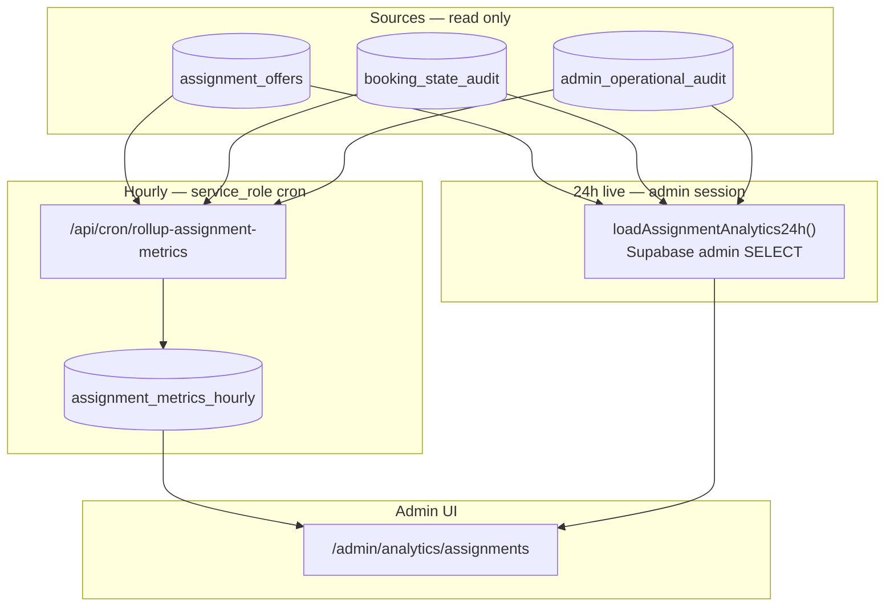

# Stage 7B — Assignment Funnel Analytics Design

**Date:** 2026-05-18  
**Status:** **7B-1a shipped** — hourly rollups + dedicated analytics page; **7B-1b-min shipped** — path-split offer created/accepted; **7B-1c-min shipped** — live 24h median latency cards; **7B-1c-b shipped** — all three 7d latency histograms  
**Depends on:** Stage **7A** (operational queue intelligence — shipped), [stage-6c-server-side-admin-booking-filters-design.md](./stage-6c-server-side-admin-booking-filters-design.md), [stage-5h-b-notification-hourly-rollups-7-day-trends-design.md](./stage-5h-b-notification-hourly-rollups-7-day-trends-design.md), [admin-operational-dashboard.md](../operations/admin-operational-dashboard.md), [stage-7a-operational-queue-intelligence-final-audit.md](../audits/stage-7a-operational-queue-intelligence-final-audit.md)

### Shipped in 7B-1a

| Item | Status |
|------|--------|
| `assignment_metrics_hourly` migration | **Shipped** |
| `rollupAssignmentMetricsHourly` + cron route | **Shipped** |
| `getAdminAssignmentAnalyticsPage` (24h live + 7d trends) | **Shipped** |
| `/admin/analytics/assignments` | **Shipped** |
| Path-split rollup columns (created + accepted) | **Shipped (7B-1b-min)** — see [stage-7b-1b-assignment-path-split-analytics-design.md](./stage-7b-1b-assignment-path-split-analytics-design.md) |
| Median latency cards (24h live) | **Shipped (7B-1c-min)** — see [stage-7b-1c-assignment-latency-metrics-design.md](./stage-7b-1c-assignment-latency-metrics-design.md) |
| 7d latency histogram rollups (all three Tier 1 metrics) | **Shipped (7B-1c-b)** — see [stage-7b-1c-b-assignment-latency-histogram-rollups-design.md](./stage-7b-1c-b-assignment-latency-histogram-rollups-design.md) |
| Home summary teaser | **Deferred** |

**Goal:** Design **read-only** assignment funnel analytics so admins understand dispatch performance, offer outcomes, and time-to-assign **without changing assignment behavior**.

**Hard constraints:**

- Design only — no app code, migrations, charts, or command changes in this doc.
- Do **not** change offer accept/decline/expiry, redispatch, recovery, or cron behavior.
- Do **not** change RLS on `assignment_offers`, `booking_state_audit`, or `bookings`.
- Do **not** add mutation routes or admin actions from analytics UI.
- Do **not** expose customer/cleaner PII (names, emails, phone) in analytics DTOs or rollup tables.
- **Text/cards first** — no chart library in 7B v1 (mirror 5H-b trends).

---

## Executive summary — design question answers

| # | Question | Recommendation |
|---|----------|----------------|
| 1 | Most useful metrics? | Offer volume & outcome rates, time-to-first-offer, time-to-accept, redispatch rate, max-attempts hit rate, path-segmented accept rate, admin intervention counts |
| 2 | `assignment_offers` vs `booking_state_audit`? | **Primary: `assignment_offers`** for outcomes & timing; **supplement: audit** for booking status transitions; **do not** rely on audit for offer create/decline |
| 3 | Time windows first? | **24h live** + **7d from hourly rollups**; defer 30d/90d |
| 4 | Selected vs best-available split? | Segment by `metadata.assignment.path` + lock `cleanerPreference.mode`; rollup columns per path family |
| 5 | Offer outcome counting? | Terminal `status` on offer row; bucket by status-specific timestamp (see §Offer outcomes) |
| 6 | Redispatch counting? | `offer_sequence > 1` per booking after first terminal outcome, path-eligible only; cap awareness at 5 rows/booking |
| 7 | Avg cleaner response time? | Median/avg of `(responded_at − offered_at)` for `accepted`/`declined`; expired uses `coalesce(responded_at, updated_at) − offered_at` |
| 8 | Avg assignment time? | Median/avg `(accept_event_at − entered_pending_assignment_at)` per booking; accept from audit or accepted offer |
| 9 | Cleaner-level metrics? | **Defer to 7B-2** (leaderboard / per-cleaner accept rate) |
| 10 | Team assignments? | **Defer** — schema is single-cleaner / one open offer |
| 11 | Home vs dedicated page? | **Dedicated** `/admin/analytics/assignments` for full text analytics; **home: 2–3 summary lines** max (optional 7B-1b) |
| 12 | Privacy exclusions? | No emails, names, addresses, raw metadata JSON, audit `payload`, cleaner UUIDs in browser DTOs for v1 |
| 13 | Live vs rollups? | **Hybrid:** 24h aggregates live SQL; 7d+ trends from `assignment_metrics_hourly` cron rollups |
| 14 | RLS model? | Mirror `notification_metrics_hourly`: admin `SELECT` only; `service_role` upsert via cron |
| 15 | Safest first slice? | **7B-1a:** rollup table + cron from `assignment_offers` only + dedicated page with 24h text cards |

---

## Relationship to Stage 7A

| Layer | 7A (shipped) | 7B (this design) |
|-------|--------------|------------------|
| Question | “How many bookings need attention **now**?” | “How well did assignment perform **over time**?” |
| Data | Point-in-time SQL `count(*)` per filter | Time-bucketed offer/audit aggregates |
| UI | Strip + explainability | Text metrics + trends |
| Coupling | **Separate** read model — do not fold funnel metrics into `getAdminOperationalQueueCounts` |

7A queue chips remain the **operational triage** surface. 7B analytics explain **throughput and friction** behind those queues.

---

## Current data sources

### Primary: `assignment_offers`

| Column | Analytics use |
|--------|----------------|
| `id`, `booking_id`, `cleaner_id` | Volume, sequence, redispatch (internal only — no `cleaner_id` in admin UI v1) |
| `status` | `offered` \| `accepted` \| `declined` \| `expired` \| `cancelled` |
| `offered_at` | Offer created, funnel start per attempt |
| `responded_at` | Accept/decline/cancel response time (**often null on `expired`**) |
| `expires_at` | TTL (48h default), open-offer window |
| `updated_at` | Expiry completion when `responded_at` missing |
| `created_at` | Row insert (usually ≈ `offered_at`) |

**Constraints affecting metrics:**

- At most one `status = 'offered'` per booking (partial unique index).
- Max **5** offer rows per booking (`ASSIGNMENT_MAX_DISPATCH_ATTEMPTS_PER_BOOKING`).
- Re-offer same cleaner is idempotent (same row); new cleaner = new row.

**Types:** `src/lib/database/types.ts` — `AssignmentOfferRow`, `AssignmentOfferStatus`.

### Supplementary: `booking_state_audit`

| Command | Use in 7B |
|---------|-----------|
| `MOVE_TO_PENDING_ASSIGNMENT` | `entered_pending_assignment_at` |
| `ACCEPT_CLEANER_ASSIGNMENT` | `assigned_at` (booking-level) |
| `EXPIRE_ASSIGNMENT_OFFER` | Expiry event count (optional cross-check) |
| `CANCEL_OPEN_ASSIGNMENT_OFFER` | Admin cancel count (optional) |
| `RECORD_ASSIGNMENT_ATTENTION` | Sparse; prefer metadata snapshot |

**Not audited:** `OFFER_TO_CLEANER`, `DECLINE_CLEANER_ASSIGNMENT` — **offer table required** for dispatch/decline volumes.

### Snapshot only: `bookings.metadata.assignment`

| Field | Use |
|-------|-----|
| `path` | `selected` \| `best_available` \| `fallback_best_available` \| `admin_manual` |
| `status` | Current engine outcome (`offered`, `attention_required`, …) |
| `lastOfferOutcome` | `declined` \| `expired` \| `cancelled` |
| `attemptedAt` | Last engine touch (overwrites — **not historical**) |

**Gap:** No version history — cohort/path for **past** offers must come from offer row timestamps + audit, not metadata alone.

### Supplementary: `admin_operational_audit`

| Action | Metric |
|--------|--------|
| `manual_dispatch_offer` | Admin manual dispatch interventions |
| `replace_open_offer` | Admin replace interventions |
| `assignment_recovery` | Recovery runs (correlate with recovery queue) |

### Supplementary: `payments` (read-only join)

- `status = 'paid'`, `updated_at` / `created_at` for **time-to-first-offer** baseline (paid → first `offered_at`).

### Explicitly out of scope for 7B v1

| Source | Reason |
|--------|--------|
| Customer/cleaner profile tables | PII risk |
| `notification_outbox` | Different domain (5H) |
| Team / multi-slot offers | Not implemented (`teamSize: 1`) |
| Historical metadata.assignment | Not stored |

---

## Assignment funnel stages (conceptual)

```text
Paid / confirmed
    → MOVE_TO_PENDING_ASSIGNMENT (pending_assignment)
    → First OFFER_TO_CLEANER (assignment_offers row)
    → [open offered] → terminal: accepted | declined | expired | cancelled
    → [redispatch loop if path eligible] → …
    → ACCEPT → assigned
    OR attention_required / max attempts (no auto path)
```

**Funnel conversion metrics (7d rollup):**

| Stage transition | Numerator | Denominator |
|------------------|-----------|-------------|
| Entered assignment | bookings with audit `MOVE_TO_PENDING_ASSIGNMENT` in window | paid bookings in window |
| First offer sent | bookings with ≥1 offer `offered_at` in window | entered assignment |
| Offer accepted (booking) | bookings with ≥1 `accepted` offer | bookings with ≥1 terminal offer |
| Assigned | bookings reaching `assigned` status | entered assignment |
| Max attempts hit | bookings with `count(offers) >= 5` | entered assignment |

---

## Metric definitions (safe analytics inventory)

### Volume (hourly bucket)

| Metric key | Definition | Source |
|------------|------------|--------|
| `offers_created` | Rows with `offered_at` in bucket | `assignment_offers` |
| `offers_accepted` | `status = accepted`, bucket by `responded_at` | offers |
| `offers_declined` | `status = declined`, bucket by `responded_at` | offers |
| `offers_expired` | `status = expired`, bucket by `coalesce(responded_at, updated_at)` | offers |
| `offers_cancelled` | `status = cancelled`, bucket by `responded_at` | offers |
| `offers_open_end` | Rows still `offered` at bucket end | point-in-time snapshot (defer v1) |
| `bookings_entered_pending` | Distinct `booking_id` with audit command in bucket | audit |
| `bookings_assigned` | Distinct bookings with `ACCEPT_CLEANER_ASSIGNMENT` in bucket | audit |
| `bookings_max_attempts` | Distinct bookings reaching 5 offer rows (first time in bucket) | offers |
| `admin_manual_dispatch` | Audit rows `manual_dispatch_offer` success/idempotent | admin_operational_audit |
| `admin_replace_offer` | `replace_open_offer` success/idempotent | admin_operational_audit |
| `admin_recovery` | `assignment_recovery` success/idempotent | admin_operational_audit |

### Rates (computed in read model, not stored as %)

| Rate | Formula |
|------|---------|
| `accept_rate` | `accepted / (accepted + declined + expired + cancelled)` |
| `decline_rate` | `declined / terminal` |
| `expire_rate` | `expired / terminal` |
| `redispatch_rate` | `bookings with offer_count >= 2 / bookings with offer_count >= 1` |
| `first_offer_success_rate` | bookings assigned on first offer / bookings with ≥1 offer |

### Latency (24h live; optional rollup percentiles later)

| Metric | Definition | Notes |
|--------|------------|-------|
| `median_time_to_first_offer` | `min(offered_at) − paid_at` per booking | Join `payments` |
| `median_cleaner_response_time` | `responded_at − offered_at` for accepted/declined | Exclude null `responded_at` |
| `median_offer_open_duration_expired` | `coalesce(responded_at, updated_at) − offered_at` where expired | |
| `median_time_to_assign` | `assigned_at − entered_pending_at` | Audit timestamps |

Report **median** first (robust to outliers); mean optional in UI copy.

---

## Excluded / sensitive data

| Data | 7B policy |
|------|-----------|
| Customer email, name, company | **Never** in analytics DTOs |
| Cleaner name, email | **Never** in v1; defer cleaner-level breakdown |
| `cleaner_id`, `customer_id`, `booking_id` in rollups | **No** — counts only |
| Raw `bookings.metadata` JSON | **No** — use extracted `path` enum in rollup only |
| `booking_state_audit.payload` | **No** |
| `admin_operational_audit.metadata` / reasons | **No** — count outcomes only |
| Free-text `assignment.reason` | **No** in aggregates |

Admin page may show **aggregate** numbers only, same class as `notification_metrics_hourly`.

---

## Selected vs best-available split

### Path families (rollup dimension)

| Rollup bucket | `metadata.assignment.path` | Lock `cleanerPreference.mode` |
|---------------|---------------------------|--------------------------------|
| `selected` | `selected` | `selected` |
| `best_available` | `best_available` | `best_available` |
| `fallback` | `fallback_best_available` | `selected` (customer picked, fallback dispatch) |
| `admin_manual` | `admin_manual` | n/a |

**Join strategy for historical offers:** At offer `offered_at`, join booking row and read **current** `metadata.assignment.path` — **biased** if path overwritten later.

**7B-1a mitigation:** Rollup cron captures `path` from metadata at processing time into bucket counters (path at rollup run). **7B-1b improvement:** Add nullable `assignment_path` on `assignment_offers` at insert time (schema change — defer unless parity tests justify).

### Path-specific KPIs

| Path | Key questions |
|------|----------------|
| `selected` | Decline rate on first offer; time to admin intervention; **no auto-redispatch** |
| `best_available` | Redispatch success rate; expired-before-accept rate |
| `fallback_best_available` | Volume vs pure selected; accept rate |
| `admin_manual` | Share of offers after attention; correlation with max attempts |

**UI:** One text row per path family for 7d accept rate (if sample size ≥ threshold, else “insufficient data”).

---

## Offer outcome definitions

| Status | Count when | Bucket timestamp |
|--------|------------|------------------|
| `offered` | Row created / still open | `offered_at` (created volume only) |
| `accepted` | Terminal success | `responded_at` |
| `declined` | Cleaner declined | `responded_at` |
| `cancelled` | Admin cancel or sibling cancel on accept | `responded_at` |
| `expired` | Cron `EXPIRE_ASSIGNMENT_OFFER` | `coalesce(responded_at, updated_at)` |

**Rules:**

- Each offer row contributes **exactly one** terminal outcome (mutually exclusive statuses).
- `accept_rate` denominator = terminal offers in window, **not** `offers_created` (open offers excluded).
- Do **not** double-count `RECORD_ASSIGNMENT_OFFER_EXPIRED` audit if offer row already `expired`.

**Cancelled semantics:** Includes admin replace flow (cancel then new offer) — counts as friction, not failure.

---

## Redispatch attempt counting

**Definition (booking-level):**

```text
dispatch_attempt_index = row_number() over (partition by booking_id order by offered_at)
redispatch = dispatch_attempt_index > 1
```

**Eligible paths for *automatic* redispatch** (for “auto redispatch rate”):

- `best_available`, `fallback_best_available`, `null` path inferred as best_available
- **Exclude** `selected`, `admin_manual` from auto-redispatch numerator

**Max attempts:**

- `hit_max_attempts = count(offers per booking) >= 5` (matches engine cap)
- Bucket: first timestamp when count reaches 5

**Metrics:**

| Metric | Definition |
|--------|------------|
| `avg_offers_per_assigned_booking` | `count(offers) / count(assigned bookings)` |
| `pct_bookings_redispatched` | bookings with ≥2 offers / bookings with ≥1 offer |
| `pct_hit_max_attempts` | bookings with 5 offers / bookings entered assignment |

---

## Time-window strategy

| Window | Source | UI placement |
|--------|--------|--------------|
| **24 hours** | Live SQL on `assignment_offers` + audit (admin client) | Top summary strip on analytics page |
| **7 days** | Sum of `assignment_metrics_hourly` buckets | Text trend lines (“↑ 12% vs prior 7d”) |
| **Prior 7 days** | Previous 168 buckets | Comparison baseline |
| 30d / 90d | **Defer** | — |

**Timezone:** Bucket in **UTC** (`bucket_start` timestamptz); display in ops locale (en-ZA) on admin page.

**Cron:** Hourly rollup job (e.g. `/api/cron/rollup-assignment-metrics`) — **not** inline in offer accept/decline handlers.

---

## UI proposal

### Dedicated page: `/admin/analytics/assignments` (7B-1a primary)

**Nav:** Add under admin nav near Notifications (“Assignment analytics”).

**Layout (text/cards only):**

```text
[Page title] Assignment funnel analytics
[Subtitle] Read-only. Last 24 hours live; 7-day trends from hourly rollups.

── 24h summary (cards) ──
| Offers sent | Accepted | Declined | Expired | Accept rate |
| Median time to first offer | Median response time | Median time to assign |

── 7d trends (text) ──
Offers sent 7d: 142 · ↑ 8% vs prior week
Accept rate 7d: 61% · ↓ 3 pts vs prior week
Redispatch rate 7d: 34% · stable

── Path breakdown (text, 7d) ──
Best available: accept 64% (n=88)
Selected: accept 41% (n=22) — insufficient for fallback row if n < 10

── Admin interventions (24h) ──
Manual dispatch: 3 · Replace offer: 1 · Recovery: 2

── Honesty footer ──
Does not include customer or cleaner identities. Open offers excluded from accept rate.
```

**No charts** in 7B-1a. Optional sparklines in 7B-3.

### `/admin` home (optional 7B-1b — defer)

At most **2–3 lines** under queue strip:

- “24h offer accept rate: 58%”
- “Median time to assign: 4.2h”
- Link: “View assignment analytics →”

Avoid duplicating 7A explainability or loading heavy aggregates on every home load.

### Not on these pages in 7B v1

- `/admin/bookings` — keep 7A context card only
- `/admin/assignments` — keep 7A footnote only
- Booking detail — no funnel panel yet

---

## Computation strategy

### Hybrid model (recommended)



### Proposed table: `assignment_metrics_hourly`

Mirror `notification_metrics_hourly` shape — **counts only, no PII**.

| Column | Type | Notes |
|--------|------|-------|
| `bucket_start` | timestamptz PK | Hour start UTC |
| `offers_created` | int | |
| `offers_accepted` | int | |
| `offers_declined` | int | |
| `offers_expired` | int | |
| `offers_cancelled` | int | |
| `bookings_entered_pending` | int | |
| `bookings_assigned` | int | |
| `bookings_redispatched` | int | ≥2 offers |
| `bookings_max_attempts` | int | |
| `offers_created_selected` | int | path bucket |
| `offers_created_best_available` | int | |
| `offers_created_fallback` | int | |
| `offers_created_admin_manual` | int | |
| `offers_accepted_*` | int | Same path split (optional 7B-1b) |
| `admin_manual_dispatch` | int | |
| `admin_replace_offer` | int | |
| `admin_recovery` | int | |
| `created_at`, `updated_at` | timestamptz | |

**RLS:** `auth_is_admin()` SELECT; `service_role` INSERT/UPDATE (idempotent upsert per bucket).

**Retention:** 13 months (align notifications); purge cron deferred.

**Env gate:** `ASSIGNMENT_METRICS_ROLLUP_ENABLED=true` for cron.

### Live 24h queries

- Single admin read model module: `src/features/dashboards/server/assignmentAnalyticsReadModel.ts` (proposed).
- Cap scanned rows or use aggregate queries only — no full offer table download to browser.
- Reuse admin Supabase session (RLS allows SELECT on `assignment_offers`).

### What not to do

- Do not compute funnel metrics inside `getAdminOperationalQueueCounts`.
- Do not add analytics side effects to `executeBookingCommand`.
- Do not scan unbounded audit history on every page load for 7d.

---

## RLS / security model

| Table | Admin analytics access |
|-------|------------------------|
| `assignment_offers` | Existing admin SELECT (5B-3c-a) — live 24h OK |
| `booking_state_audit` | Existing admin SELECT — transition counts OK |
| `admin_operational_audit` | Admin SELECT — intervention counts OK |
| `assignment_metrics_hourly` | **New:** admin SELECT only |
| Rollup cron | `service_role` writes buckets |

**Tests (when implemented):**

- SQL policy checks mirroring `notification_metrics_hourly_rls_phase5h_checks.sql`
- Read model DTO tests: no `email`, `name`, `payload` keys in serialized output

---

## Phased rollout

| Phase | Scope | Risk |
|-------|-------|------|
| **7B-1a** | Migration `assignment_metrics_hourly` + rollup cron from `assignment_offers` + audit counts + admin page 24h cards + 7d text from rollups | **Shipped** |
| **7B-1b** | Path-split columns in rollup + path text rows + optional home summary link | Low |
| **7B-1c** | Live median latency cards (24h) | Low |
| **7B-2** | Cleaner-level aggregates (still no names in UI — rank by accept rate band) | Medium — privacy review |
| **7B-3** | Charts (optional) | Medium |
| **7B-4** | `assignment_path` on offer rows at insert (schema) for accurate historical path | Medium — needs migration + command touch (design only until approved) |

Each phase: read-only, no assignment engine changes.

---

## Tests (when implemented)

| Layer | Tests |
|-------|-------|
| Rollup job | Golden bucket from fixture offers; idempotent re-run same bucket |
| Read model | 24h accept_rate math; empty window; no PII keys in JSON |
| Trend | 7d sum vs prior 7d delta; partial bucket coverage message |
| RLS | Admin can SELECT rollups; customer/cleaner cannot |
| Regression | 7A queue counts unchanged; assignment command tests unchanged |
| Excluded | No E2E chart screenshots |

---

## Risks and mitigations

| Risk | Mitigation |
|------|------------|
| `responded_at` null on expired offers | Use `updated_at` fallback; document in metric definition |
| Path overwritten in metadata | Path columns at offer insert (7B-4) or accept snapshot bias in v1 |
| Confusion with 7A chip counts | Separate page + copy: “historical funnel, not current queue size” |
| Heavy live queries | Rollups for 7d; limit 24h to aggregates; index `offered_at`, `responded_at`, `status` |
| Small sample path rates | Hide or “insufficient data” when n < 10 |
| Double-counting expiry | Count offer row only, not duplicate audit companion |
| Admin mistakes vs engine | Separate `admin_manual` path bucket |

---

## Final recommendation

**Adopt a notification-style hybrid:** hourly `assignment_metrics_hourly` rollups for 7d trends, plus bounded live 24h aggregates for the dedicated analytics page. **`assignment_offers` is the source of truth** for offer outcomes; **`booking_state_audit`** supplements booking-level transitions; **`admin_operational_audit`** tracks manual interventions.

Keep 7A operational queues **separate**. Ship **text/cards only** first. **Defer** cleaner-level metrics, team assignments, charts, and home dashboard widgets.

---

## Final question: safest first Stage 7B implementation slice?

**7B-1a — Hourly offer rollups + dedicated analytics page (minimal)**

1. **Migration:** `assignment_metrics_hourly` with core counters (`offers_*`, `bookings_entered_pending`, `bookings_assigned`, `bookings_max_attempts`) — no path split yet.
2. **Cron:** `/api/cron/rollup-assignment-metrics` — scans `assignment_offers` + audit for **completed hour bucket**; service_role upsert; env-gated.
3. **Read model:** `loadAssignmentAnalytics24h()` (live aggregates) + `loadAssignmentAnalyticsTrends7d()` (from rollups).
4. **UI:** `/admin/analytics/assignments` — 24h text cards (volumes + accept rate) + 7d trend lines; honesty footer; admin nav link.
5. **Tests:** Rollup golden fixture, read model math, RLS SQL check, DTO has no PII keys.
6. **Docs:** Ops section under `admin-operational-dashboard.md`.

**Why this is safest**

- No changes to assignment commands, offer lifecycle, or RLS on existing tables (additive table only).
- No cleaner/customer PII exposure.
- No charts or home-page perf impact.
- Reuses proven 5H-b rollup pattern ops already run.
- Path split, latency medians, and home teaser ship as **7B-1b/1c** after rollup stability.

**Do not start with:** live-only 7d scans, cleaner leaderboards, or embedding analytics into 7A queue strip.
