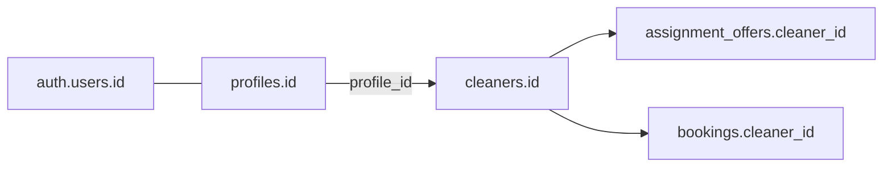

# Cleaner login identity & offer visibility audit

**Date:** 2026-05-16  
**Scope:** Why `test_e2e_cleaner@shalean.co.za` sees ~2 bookings/offers while admin assignment queue shows ~6 `pending_assignment` bookings.  
**Status:** Audit only — no fixes applied.

---

## Executive summary

There is **only one** `public.cleaners` row in the database. The two UUIDs cited in the problem (`eeab94a5-…` and `06307bd9-…`) are **not** two cleaner records:

| UUID | What it actually is in this project |
|------|-------------------------------------|
| `06307bd9-e70f-49e7-8a6a-f0c13636b9e9` | **Auth user + profile id** for `test_e2e_cleaner@shalean.co.za` |
| `eeab94a5-34db-4d30-b478-cc488bba3ab2` | **Does not exist** in `auth.users`, `profiles`, or `cleaners` |
| `bbfc422b-0d6b-4630-8540-bcc8d4147ade` | **Actual `cleaners.id`** linked to the E2E cleaner profile |

**You cannot “log into the second cleaner” because there is no second cleaner row or second cleaner login.** Login mapping for the E2E account is correct.

The mismatch between admin queue and cleaner UI is explained by:

1. **Admin queue** lists all `pending_assignment` bookings (needs dispatch attention), regardless of which cleaner has offers.
2. **Cleaner offers** only show `assignment_offers` rows with `status = 'offered'` for **`cleaners.id = bbfc422b`**.
3. **Six** `pending_assignment` bookings have **zero** `assignment_offers` rows in the DB; metadata still claims offers went to a **deleted** cleaner `a4113e86-…` (orphaned assignment snapshot).
4. E2E cleaner has **two accepted** offers → **two completed jobs** — not six open offers.

**Classification:** **E** (admin vs cleaner views are different by design) **+ D** (orphaned offers pointed at a removed non-E2E / legacy cleaner) **+ data integrity** (metadata says `offered`, offer rows missing after cleaner delete CASCADE).

**Not:** A, B, C, or F as primary causes.

---

## Identity model (how login maps to cleaners)



| Step | Mechanism |
|------|-----------|
| Sign-in | `test_e2e_cleaner@shalean.co.za` → session `auth.uid()` = profile id |
| Role | `profiles.role = 'cleaner'` |
| Cleaner row | `resolveActorScope()` → `cleaners` where `profile_id = auth.uid()` → `actingCleanerId` = **`cleaners.id`** |
| Offers | `listOffersForCleaner(client, actingCleanerId, ['offered'])` |
| Jobs | `bookings.cleaner_id = actingCleanerId` |

```29:36:src/lib/auth/resolveActorScope.ts
  if (role === "cleaner") {
    const { data, error } = await client
      .from("cleaners")
      .select("id")
      .eq("profile_id", profileId)
      .maybeSingle();
    ...
    ctx.actingCleanerId = data?.id ?? null;
  }
```

E2E seed creates **one** auth user and **one** cleaner row per email:

```87:105:scripts/e2e/lib/auth.mjs
export async function ensureE2eCleaner(client, profileId) {
  const { data: byProfile } = await client
    .from("cleaners")
    .select("id, profile_id")
    .eq("profile_id", profileId)
    .maybeSingle();
  if (byProfile) return byProfile;
  // insert cleaners row with profile_id
}
```

`.env.local` documents the mapping:

- `E2E_TEST_CLEANER_EMAIL=test_e2e_cleaner@shalean.co.za`
- `E2E_TEST_ADMIN_PROFILE_ID=168c96e1-…` (admin **profile**, not cleaner)
- `E2E_TEST_CLEANER_ID=bbfc422b-…` (**cleaners.id**)

---

## Table mapping (authoritative DB state)

Project: `jdmumbvednevkrctkiwd`, queried 2026-05-16.

### Auth & profiles (cleaner-related)

```sql
select id, email from auth.users
where email ilike '%cleaner%' or email ilike '%test_e2e%';
```

| auth.users.id | email |
|---------------|-------|
| `06307bd9-e70f-49e7-8a6a-f0c13636b9e9` | test_e2e_cleaner@shalean.co.za |
| `168c96e1-3d07-447f-bf64-3c0bbb8f9a3b` | test_e2e_admin@shalean.co.za |
| `0d0ed30c-5d59-485d-a219-19995bcabced` | test_e2e_customer@shalean.co.za |

```sql
select p.id, p.role, p.full_name, u.email
from public.profiles p
left join auth.users u on u.id = p.id
where p.role = 'cleaner';
```

| profile id | role | full_name | email |
|------------|------|-----------|-------|
| `06307bd9-…` | cleaner | E2E Test Cleaner | test_e2e_cleaner@shalean.co.za |

**Only one cleaner profile.**

### Cleaners table (entire table)

| cleaners.id | profile_id | email | active | suspended_at | capabilities | areas | availability |
|-------------|------------|-------|--------|--------------|--------------|-------|--------------|
| `bbfc422b-0d6b-4630-8540-bcc8d4147ade` | `06307bd9-…` | test_e2e_cleaner@shalean.co.za | true | null | 6 | 1 | 6 slots |

Query used `cleaners.id in ('eeab94a5-…', '06307bd9-…')` returns **[]** because those values are **not** `cleaners.id` (one is unknown, one is `profile_id`).

### Summary row for audit table

| cleaners.id | profile / auth id | email | role | active | suspended | offered (open) | offers (accepted) | assigned jobs |
|-------------|-------------------|-------|------|--------|-----------|----------------|-------------------|---------------|
| `bbfc422b-…` | `06307bd9-…` | test_e2e_cleaner@shalean.co.za | cleaner | yes | no | **0** | **2** | **2** (both `completed`) |
| `a4113e86-…` | — | — | — | **deleted** | — | 0 | 0 | 0 |
| `eeab94a5-…` | — | — | — | **N/A** | — | — | — | — |

### Assignment offers (all rows)

```sql
select cleaner_id, status, count(*) from public.assignment_offers
group by cleaner_id, status;
```

| cleaner_id | status | count |
|------------|--------|-------|
| `bbfc422b-…` | accepted | 2 |

**No `offered` rows exist for any cleaner.**

### Pending assignment bookings vs offers

Six bookings in `pending_assignment`; **each has 0 `assignment_offers` rows**:

| booking id (short) | status | offer rows | metadata.assignment.status | metadata.assignment.cleanerId |
|--------------------|--------|------------|------------------------------|-------------------------------|
| 50f1e1ee… | pending_assignment | 0 | offered | `a4113e86-…` (**missing cleaner**) |
| 8fe5f304… | pending_assignment | 0 | offered | `a4113e86-…` |
| 257f5c91… | pending_assignment | 0 | offered | `a4113e86-…` |
| f29261a4… | pending_assignment | 0 | offered | `a4113e86-…` |
| 5e850108… | pending_assignment | 0 | offered | `a4113e86-…` |
| d197d9e9… | pending_assignment | 0 | offered | `a4113e86-…` |

Metadata `offerId` values (e.g. `fb7bbbb7-…`) also **do not exist** in `assignment_offers`.

**Root data issue:** Assignment engine recorded success in `bookings.metadata.assignment`, but offer rows were removed when cleaner `a4113e86` was deleted (`assignment_offers.cleaner_id` → `ON DELETE CASCADE`).

### E2E cleaner jobs

```sql
select id, status, cleaner_id from public.bookings
where cleaner_id = 'bbfc422b-0d6b-4630-8540-bcc8d4147ade';
```

| booking id | status | cleaner_id |
|------------|--------|------------|
| 183248b6-… | completed | bbfc422b-… |
| 20d2a373-… | completed | bbfc422b-… |

These match the **two accepted** offers — what the cleaner dashboard correctly surfaces as job history.

---

## Why admin shows ~6 items and cleaner shows ~2

### Admin assignment queue

```256:277:src/features/dashboards/server/adminOperationsReadModel.ts
  const { data: bookings } = await client
    .from("bookings")
    .select(...)
    .in("status", ["pending_assignment", "confirmed"])
    ...
    const needsAttention =
      display.assignmentAttention === "attention_required" ||
      row.status === "pending_assignment";
```

- Includes **every** `pending_assignment` booking (6 in DB).
- Does **not** mean “offers for logged-in cleaner”.
- Open offers subsection is empty for these six (`openOffers.length === 0`) but rows still appear because `status === 'pending_assignment'`.

### Cleaner offers API

```54:69:src/features/assignments/server/getCleanerOffers.ts
  const offers = await listOffersForCleaner(client, ctx.actingCleanerId, ["offered"]);
  ...
    if (isOfferPastExpiry(offer.expires_at)) continue;
    if (booking.status !== "pending_assignment") continue;
```

- Only **`offered`** rows for **`bbfc422b`** → **0** results today.
- Accepted/completed work appears under **Jobs**, not Offers.

### Cleaner home “2”

`CleanerHomePage` shows open offers count + active jobs. The **two completed assignments** align with **2 jobs** in history; **0 open offers**.

---

## RLS (not hiding valid E2E offers)

```364:366:supabase/migrations/20260516160000_rls_role_security.sql
create policy assignment_offers_select_cleaner on public.assignment_offers
  for select to authenticated
  using (cleaner_id = public.auth_cleaner_id());
```

`auth_cleaner_id()` resolves `cleaners.id` from `profile_id = auth.uid()` — same path as `resolveActorScope`. RLS is consistent; there are simply **no** `offered` rows for `bbfc422b`.

**F rejected** for E2E cleaner (no rows to hide). Orphaned metadata offers for `a4113e86` are invisible to everyone in `assignment_offers` because rows were cascaded away.

---

## Phase 2 vs E2E cleaners

`src/tests/security/rlsTestSupport.ts` provisions ephemeral `test_phase2_*` cleaners per run (`provisionPhase2AuthUser`, `cleaners` insert). Those are **separate** from E2E seed and are torn down after tests.

The phantom id `a4113e86-96c6-407c-a047-fb225ebeee1a` is consistent with a **previous** cleaner row removed after assignment ran (manual delete, partial cleanup, or non-E2E test data). It is **not** the current E2E cleaner.

---

## Answers to audit questions

| Question | Answer |
|----------|--------|
| Which cleaner id belongs to `test_e2e_cleaner@shalean.co.za`? | **`bbfc422b-0d6b-4630-8540-bcc8d4147ade`** (`cleaners.id`); profile/auth id **`06307bd9-…`** |
| Does the second id have an auth user? | **`eeab94a5-…` — no row anywhere.** `06307bd9-…` **is** the E2E cleaner auth user (not a second cleaner). |
| Second cleaner profile with role cleaner? | **No second cleaner profile.** |
| Does login resolve `cleaner_id` correctly? | **Yes** for E2E account. |
| Are 6 pending bookings open offers for E2E cleaner? | **No** — no offer rows; metadata points at deleted cleaner. |
| Are they unassigned / stale / other cleaner? | **Unassigned in DB** (`bookings.cleaner_id` null); **stale metadata** says offered to deleted cleaner; **not** offered to `bbfc422b`. |

---

## Issue classification

| Code | Applies? | Notes |
|------|----------|-------|
| **A** Second cleaner no auth/profile | **No** | Only one cleaner exists |
| **B** Wrong role | **No** | E2E profile role is `cleaner` |
| **C** Broken profile↔cleaner link | **No** | `profile_id` maps correctly to `bbfc422b` |
| **D** Phase 2 / other test cleaner | **Partially** | Orphaned offers targeted deleted `a4113e86` |
| **E** Dashboard filtering vs admin queue | **Yes (primary UX)** | Different queries by design |
| **F** RLS hiding offers | **No** for E2E | Rows genuinely absent |

**Combined label:** **E + orphaned assignment data (post-cleaner-delete CASCADE)**

---

## Recommended safe fixes (when implementing)

### 1. Repair stuck `pending_assignment` bookings (data / ops)

Re-run assignment for bookings with metadata `assignment.status = 'offered'` but no `assignment_offers` row (service role). `runAssignmentAfterPayment` does **not** short-circuit on metadata-only `offered` when DB offers are missing — it will dispatch to the **current** eligible cleaner (`bbfc422b` if only one exists).

Example diagnostic:

```sql
select b.id
from public.bookings b
where b.status = 'pending_assignment'
  and b.metadata->'assignment'->>'status' = 'offered'
  and not exists (
    select 1 from public.assignment_offers ao
    where ao.booking_id = b.id and ao.status = 'offered'
  );
```

Optional metadata reset (only if re-dispatch tooling requires it):

```sql
-- Use with care; prefer application-level recordAssignmentOutcome / re-dispatch
update public.bookings
set metadata = metadata - 'assignment'
where id in (/* ids from diagnostic above */);
```

### 2. Do **not** create a second E2E cleaner login unless testing multi-cleaner dispatch

One E2E cleaner is correct for current seed design. A second login is only needed to test competition/ranking between cleaners.

### 3. Seed script

**No change required** for identity mapping. Optional future enhancement: `test_e2e_cleaner_b@…` + second `ensureE2eCleaner` if multi-cleaner E2E is a product requirement.

### 4. SQL to create a **second** cleaner login (optional, not recommended for current issue)

```sql
-- Illustrative only — use auth.admin.createUser + ensureE2eCleaner pattern in seed.mjs
-- 1) Create auth user + profile (role cleaner) via Admin API
-- 2) insert into cleaners (profile_id, phone, active) returning id
-- 3) seed cleaner_service_capabilities / areas / availability
```

Prefer `npm run e2e:seed` patterns in `scripts/e2e/lib/auth.mjs` over raw SQL for auth passwords.

### 5. Product / code improvements (later)

- Admin queue: distinguish “pending assignment, no open offer” vs “offer outstanding”.
- Assignment engine: if metadata `offerId` missing, treat as not offered and re-dispatch.
- Guard against deleting cleaners with open offers, or soft-delete cleaners.

---

## Tests needed (when fixing)

| Test | Purpose |
|------|---------|
| `resolveActorScope` integration | profile id → `actingCleanerId` = `cleaners.id` |
| `getCleanerOffers` | only returns rows for acting cleaner + `offered` |
| `listAdminAssignmentQueue` | includes `pending_assignment` without offers |
| Orphan metadata fixture | metadata says offered, DB has no row → re-dispatch or attention |
| E2E smoke | after pay, E2E cleaner receives offer when eligible |

---

## SQL reference (audit queries)

```sql
-- Auth / E2E users
select id, email from auth.users
where email ilike '%cleaner%' or email ilike '%test_e2e%';

-- Cleaner profiles
select p.id, p.role, p.full_name, u.email
from public.profiles p
left join auth.users u on u.id = p.id
where p.role = 'cleaner'
order by u.email;

-- Resolve profile_id → cleaners.id (correct join)
select c.id as cleaner_id, c.profile_id, c.active, c.suspended_at, u.email
from public.cleaners c
left join auth.users u on u.id = c.profile_id;

-- Wrong: treating profile id as cleaners.id
select c.* from public.cleaners c
where c.id in ('06307bd9-e70f-49e7-8a6a-f0c13636b9e9'); -- returns []

-- Offers for E2E cleaner
select ao.* from public.assignment_offers ao
where ao.cleaner_id = 'bbfc422b-0d6b-4630-8540-bcc8d4147ade'
order by ao.created_at desc;

-- Pending bookings vs offer counts
select b.id, b.status, count(ao.id) as offers,
       count(ao.id) filter (where ao.status = 'offered') as open_offers
from public.bookings b
left join public.assignment_offers ao on ao.booking_id = b.id
where b.status = 'pending_assignment'
group by b.id, b.status;
```

---

## References

- E2E seed: `scripts/e2e/seed.mjs`, `scripts/e2e/lib/auth.mjs`
- Actor scope: `src/lib/auth/resolveActorScope.ts`
- Offers: `src/features/assignments/server/getCleanerOffers.ts`, `offerRepository.ts`
- Cleaner dashboard: `src/features/dashboards/server/cleanerJobReadModel.ts`
- Admin queue: `src/features/dashboards/server/adminOperationsReadModel.ts`
- Assignment: `src/features/assignments/server/runAssignmentAfterPayment.ts`
- RLS: `supabase/migrations/20260516160000_rls_role_security.sql`
- FK cascade: `assignment_offers.cleaner_id` → `cleaners` ON DELETE CASCADE
- Related: `docs/audits/service-type-propagation-audit.md`
