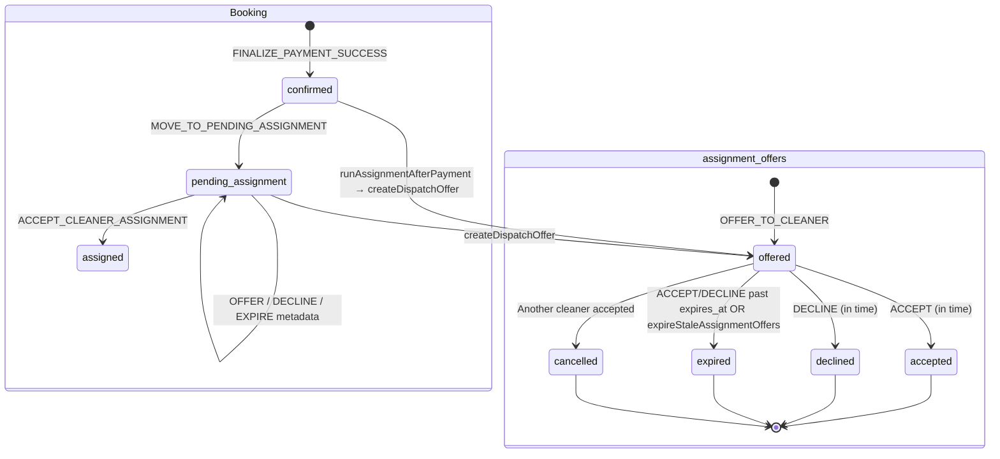

# Cleaner offer expiration system audit

**Date:** 2026-05-16  
**Scope:** End-to-end behavior of `assignment_offers` expiration — creation, storage, enforcement, UI, redispatch, and cross-role consistency.  
**Status:** Audit only — no code changes.

**UI reference:** Cleaner offers page renders `Expires {new Date(o.expiresAt).toLocaleString("en-ZA")}` (e.g. `2026/05/18, 19:58:10`). There is no separate `"Offer Expiration:"` label in code; that may be user/browser phrasing or a future design.

---

## Executive summary

Offer expiration is **partially enforced** with a **lazy, multi-layer** model:

| Layer | Behavior |
|-------|----------|
| **Storage** | `assignment_offers.expires_at` (timestamptz), set at offer creation |
| **TTL** | **48 hours** from creation (`ASSIGNMENT_OFFER_TTL_HOURS`) |
| **Proactive expiry job** | **`expireStaleAssignmentOffers()` exists but is never scheduled** — no cron, edge function, or API route calls it |
| **Accept/decline** | **Hard reject** if past `expires_at`; row updated to `status = expired` |
| **Cleaner list/API** | **Soft hide** — `getCleanerOffers()` skips past-expiry rows still marked `offered` |
| **Admin queue** | **Does not check `expires_at`** — stale `offered` rows past expiry can appear as “open offers” |
| **Booking status on expiry** | **Unchanged by time alone** — stays `pending_assignment` until accept/decline, manual expire job, or assignment |

There is **no** `offer_expires_at`, `assignment_expires_at`, or `timeout_at` column. Payment lock expiry (`booking_locks.expires_at`, `payments.payment_link_expires_at`) is a **separate** checkout flow.

---

## Lifecycle diagram



### Before expiration (offer active)

1. Payment finalizes → `runAssignmentAfterPayment()` → `createDispatchOffer()` → `OFFER_TO_CLEANER`.
2. Row inserted: `status = offered`, `offered_at = now()`, `expires_at = now() + 48h` (unless overridden).
3. `metadata.assignment` updated (`status: offered`, path, cleanerId, offerId).
4. Push notification enqueued (`template: assignment_offer`) — outbox only; delivery not audited here.
5. Cleaner sees offer on `/cleaner/offers` if `expires_at > now` and booking `pending_assignment`.

### After expiration (time passes)

**There is no automatic “on the second” mutation.** Until something runs:

| Artifact | State if nothing runs |
|----------|------------------------|
| `assignment_offers.status` | Often still **`offered`** |
| `assignment_offers.expires_at` | In the past |
| `bookings.status` | **`pending_assignment`** |
| `bookings.cleaner_id` | `null` |
| `metadata.assignment` | Last write (e.g. `offered`) — **not** auto-updated to `attention_required` |

**What can change state after expiry:**

| Trigger | Offer row | Booking | Metadata |
|---------|-----------|---------|----------|
| Cleaner **accept** (API) | → `expired`, reject | unchanged | unchanged |
| Cleaner **decline** (API) | → `expired`, reject | unchanged | unchanged |
| **`expireStaleAssignmentOffers()`** (manual/unscheduled) | → `expired` | unchanged | → `attention_required` if still unassigned |
| **New `OFFER_TO_CLEANER`** to same cleaner | Old `offered` expired inline, new offer created | unchanged | updated on dispatch |

---

## 1. Where expiration timestamps are generated

| Source | Function | When |
|--------|----------|------|
| Default TTL | `buildOfferExpiresAt()` in `src/features/assignments/server/buildOfferExpiry.ts` | `offered_at + ASSIGNMENT_OFFER_TTL_HOURS` (48h) |
| Dispatch | `createDispatchOffer()` | Passes `expiresAt: params.expiresAt ?? buildOfferExpiresAt()` |
| Command | `executeBookingCommand` → `OFFER_TO_CLEANER` | Persists `expires_at: cmd.expiresAt ?? null` on insert |

```3:5:src/features/assignments/server/buildOfferExpiry.ts
export function buildOfferExpiresAt(from: Date = new Date()): string {
  return new Date(from.getTime() + ASSIGNMENT_OFFER_TTL_HOURS * 60 * 60 * 1000).toISOString();
}
```

```1:2:src/features/assignments/server/constants.ts
/** Default cleaner offer TTL after payment (MVP — future cron can expire). */
export const ASSIGNMENT_OFFER_TTL_HOURS = 48;
```

**Override:** Callers may pass explicit `expiresAt` (tests, future admin tools). Production dispatch uses default 48h unless customized.

**Not used for offers:** `booking_locks.expires_at` (~30 min checkout), `payments.payment_link_expires_at`.

---

## 2. Storage field

| Field | Table | Type | Purpose |
|-------|-------|------|---------|
| **`expires_at`** | `assignment_offers` | `timestamptz` nullable | Offer acceptance deadline |
| `offered_at` | `assignment_offers` | `timestamptz` | When offer was sent |
| `responded_at` | `assignment_offers` | nullable | Accept/decline/cancel timestamp |
| `status` | `assignment_offers` | `assignment_offer_status` enum | `offered`, `accepted`, `declined`, `expired`, `cancelled` |

Migration: `supabase/migrations/20260515201500_core_foundation.sql` (table + enum).  
Index: `idx_assignment_offers_offered_expires` on `(expires_at) WHERE status = 'offered'`.

**No** separate `offer_expires_at`, `assignment_expires_at`, or `timeout_at`.

Assignment snapshot (not expiry): `bookings.metadata.assignment` (`attemptedAt`, `status`, `path`, `reason`, etc.).

---

## 3. Expiration duration rules

| Rule | Value |
|------|--------|
| Default TTL | **48 hours** from offer creation time |
| Config | `ASSIGNMENT_OFFER_TTL_HOURS` in `constants.ts` |
| Selected vs auto-assign | **Same TTL** — no extended timeout for customer-selected cleaner |
| Retry to same cleaner after decline | **No automatic retry** — decline sets `attention_required`; new offer requires `runAssignmentAfterPayment` / repair / manual dispatch |
| Null `expires_at` | `isOfferPastExpiry` / `isOfferExpired` → **never expired** (accept always allowed on time check) |

---

## 4. Hard vs soft enforcement

| Mechanism | Type | Details |
|-----------|------|---------|
| `ACCEPT_CLEANER_ASSIGNMENT` | **Hard** | Rejects with `OFFER_NOT_OPEN` / "Offer has expired."; sets `status = expired` |
| `DECLINE_CLEANER_ASSIGNMENT` | **Hard** | Same as accept |
| `getCleanerOffers()` | **Soft** | Skips `offered` rows where `expires_at <= now` — does not update DB |
| `listCleanerOffersForDashboard` | **Soft** | Uses `getCleanerOffers`; computes `isExpired` but listed offers are already non-expired |
| Cleaner home `openOffers` | **Soft** | Filters `!o.isExpired` (redundant if list source unchanged) |
| `expireStaleAssignmentOffers()` | **Hard** (batch) | Updates `offered` → `expired`; may set `attention_required` |
| **Cron / scheduled job** | **None wired** | Function exported only |
| DB trigger on `expires_at` | **None** | |
| UI-only | **Partial** | Expiry **display** is real; hiding expired offers is read-filter, not status sync |

---

## 5. Backend process that detects expired offers

| Process | Invoked? | Role |
|---------|----------|------|
| **`expireStaleAssignmentOffers()`** | **No production caller** | Intended batch expiry + redispatch flag |
| **`isOfferExpired()`** in `executeBookingCommand.ts` | On accept/decline/new offer to same cleaner | Lazy per-request |
| **`isOfferPastExpiry()`** in `getCleanerOffers.ts` | On every cleaner offer list | Lazy read filter |
| Cron / pg_cron | **Not found** | |
| Supabase Edge Functions | **Not found** (`supabase/functions/` empty) |
| Queue worker | **Not found** | |

```15:18:src/features/assignments/server/expireOffers.ts
/**
 * Marks stale `offered` rows as `expired` and flags bookings for admin redispatch.
 * Safe to call manually or from a future cron job.
 */
```

**Grep:** `expireStaleAssignmentOffers` is only referenced in `expireOffers.ts`, `assignments/index.ts`, and docs — **not** in app routes or scripts (except documentation).

---

## 6. What happens after expiration

### Offer row

- **Time alone:** Usually unchanged (`offered` + past `expires_at`).
- **Accept/decline attempt:** `status → expired`, `updated_at` set; no `responded_at` on expired path in accept handler (decline sets `responded_at` only on successful decline).
- **Batch expire:** `status → expired`.
- **Another cleaner accepts:** Other open offers → `cancelled` via `expireOtherOpenOffers()`.

### Booking row

- **Never** auto-transitions to a booking status named `expired` (no such booking status).
- Stays **`pending_assignment`** until assigned, cancelled, or admin override.
- **`cleaner_id`** set only on successful accept.

### Cleaner visibility

- Past-expiry `offered` rows: **hidden** from `getCleanerOffers` / dashboard list.
- Rows already `expired`: excluded (status filter `offered` only).

### Redispatch / escalation

| Event | Auto redispatch? | Metadata |
|-------|------------------|----------|
| Time expiry (no job) | **No** | Unchanged |
| `expireStaleAssignmentOffers()` | **No new offer** | `attention_required` + reason |
| Decline | **No** | `attention_required` via decline API |
| `runAssignmentAfterPayment()` when `attention_required` && no open offer | **No** — returns idempotent attention | Stays attention |

**Escalation** = `metadata.assignment.status = attention_required` + admin queue — not a multi-cleaner automated chain.

### Notifications

- Offer created: `enqueueNotification("push", cleanerId, { template: "assignment_offer" })`.
- **No** notification on expiry found in code.
- No Realtime subscription usage for offers in `src/`.

---

## 7. Selected cleaner vs best available

| Aspect | Selected cleaner | Best available |
|--------|------------------|----------------|
| Dispatch path | `path: "selected"` | `path: "best_available"` |
| Offer TTL | **48h** (same) | **48h** (same) |
| Ineligible selected | Fallback offer to `pickBestEligibleCleanerId` if different cleaner | N/A |
| No fallback | `attention_required`, no offer | `attention_required`, no offer |
| Extended timeout | **No** | **No** |
| Single retry to same cleaner | **No** auto retry after decline/expiry | **No** |
| Escalation protection | **No** special protection — metadata only | **No** |

```209:226:src/features/assignments/server/runAssignmentAfterPayment.ts
  if (preference.mode === "selected" && preference.selectedCleanerId) {
    const selectedId = preference.selectedCleanerId;
    const eligible = await isCleanerEligibleForAssignment(client, context, selectedId);
    if (eligible) {
      return dispatchOffer(backend, bookingId, selectedId, "selected");
    }
    const fallbackId = await pickBestEligibleCleanerId(client, context);
    if (fallbackId && fallbackId !== selectedId) {
      await recordAssignmentOutcome(backend, bookingId, {
        status: "attention_required",
        ...
        reason: "Selected cleaner ineligible at assignment; falling back to best available.",
      });
      return dispatchOffer(backend, bookingId, fallbackId, "fallback_best_available");
    }
```

---

## 8. Multiple active offers

- **Per cleaner per booking:** Unique partial index — at most one `offered` row per `(booking_id, cleaner_id)`.
- **Per booking across cleaners:** **Multiple `offered` rows allowed** (different `cleaner_id`). Engine MVP dispatches **one** offer per `runAssignmentAfterPayment` call; multiple open offers would require multiple dispatch actions or manual offers.
- **On accept:** `expireOtherOpenOffers()` sets other `offered` → **`cancelled`** (not `expired`).

---

## 9. Race condition analysis

| Scenario | Outcome | Risk |
|----------|---------|------|
| **Accept after expiry** | **Rejected** (`OFFER_NOT_OPEN`); offer marked `expired` | Low — tested in `assignmentEngine.test.ts` |
| **Two cleaners accept simultaneously** | First wins `assigned`; second hits `ASSIGNMENT_CONFLICT` or `OFFER_NOT_OPEN` | Medium — depends on DB transaction ordering; no explicit row lock |
| **Accept while batch expire runs** | Both use `UPDATE ... WHERE status = offered` on expire; accept path checks expiry first | Medium |
| **Admin manual assign during open offer** | No admin `OFFER_TO_CLEANER` UI route in `app/api/admin`; only `ADMIN_OVERRIDE_STATUS` command exists (not wired to UI in grep) | Low until admin tools added |
| **Cleaner sees offer at T-1s, accepts at T+1s** | Rejected at command layer | Low |
| **Stale `offered` past expiry in admin UI** | Shown as open offer until batch expire or interaction | **High** (ops confusion) |
| **Direct API accept with offer UUID** | Still goes through `executeBookingCommand` expiry check | Low |
| **`expires_at` null** | Never expires on time check | Medium if misconfigured |

---

## 10. Cleaner dashboard / API visibility

| Surface | Expired behavior |
|---------|------------------|
| `getCleanerOffers()` | **Hides** past-expiry `offered` (not in response) |
| `GET /api/cleaner/offers` | Same (via `listCleanerOffersForDashboard` → `getCleanerOffers`) |
| `/cleaner/offers` UI | Shows `Expires {locale}` for active offers; **Expired** badge path largely unreachable for time-expired (filtered upstream) |
| `/cleaner` home | `openOffers` = `offered && !isExpired` |
| Accept/decline buttons | Only on non-expired offers in list; **direct POST with offer ID still possible** |

---

## 11. Can an expired cleaner still accept the job?

**Through normal UI:** No — expired offers are not listed.

**Through `POST /api/cleaner/offers/[offerId]/accept` with a known offer ID:**

- If DB row is still `offered` but `expires_at` is in the past → **No**. `executeBookingCommand` runs `isOfferExpired()`, updates row to `expired`, returns `OFFER_NOT_OPEN`.
- If row already `expired` / `declined` / `cancelled` → **No** (`OFFER_NOT_OPEN`).
- If `expires_at` is **null** → **Yes** (time check skipped) — configuration bug only.

**Test coverage:** `assignmentEngine.test.ts` — `"expired offer cannot be accepted"`.

---

## 12. What exactly happens the second an offer expires?

**Nothing automatic.**

1. No cron fires.
2. No DB trigger updates the row.
3. `expires_at` is simply in the past.
4. Next **list** for cleaner omits the offer (`getCleanerOffers`).
5. Next **accept/decline** marks `expired` and fails.
6. Admin may still see `status = offered` in assignment queue until batch expire or manual ops.
7. Booking remains `pending_assignment` with no new cleaner assigned.

To get metadata `attention_required` **without** cleaner action, something must call **`expireStaleAssignmentOffers()`**.

---

## 13. Admin / customer / cleaner consistency

| Role | Sees expired offers? | Booking state | Notes |
|------|----------------------|---------------|-------|
| **Cleaner** | Hidden when past `expires_at` | `pending_assignment` | Consistent for UX; DB may be stale |
| **Admin** | `openOffers` = `status === 'offered'` **only** | Queue shows `pending_assignment` | **Can show false “open” offers** past expiry |
| **Customer** | No offer-level UI in MVP dashboards | `pending_assignment` until assigned | Customer does not see offer expiry |

Admin booking detail includes full offer list with `expiresAt` on each offer (`mapOffers`) — better than queue filter.

---

## 14. Analytics / events

- **No** dedicated expiration/redispatch analytics module.
- `booking_state_audit` records commands; `RECORD_ASSIGNMENT_ATTENTION` does **not** change booking status (audit with same from/to status).
- Payment events separate (`payment_events`).
- Offer state changes are **not** mirrored to a dedicated offer audit table.

---

## Component table

| Component | Role | Risk | Correct? | Notes |
|-----------|------|------|----------|-------|
| `buildOfferExpiresAt` | Sets `expires_at` +48h | Low | Yes | Single source for TTL |
| `createDispatchOffer` | Creates offer after payment | Low | Yes | Idempotent offer per cleaner |
| `runAssignmentAfterPayment` | Post-payment dispatch | Medium | Mostly | No auto-redispatch after decline/expiry |
| `executeBookingCommand` OFFER_TO_CLEANER | Inserts offer | Low | Yes | Expires stale same-cleaner offered inline |
| `executeBookingCommand` ACCEPT/DECLINE | Enforces expiry | Low | Yes | Hard reject + mark expired |
| `expireOtherOpenOffers` | Cancels competing offers | Low | Yes | Uses `cancelled` status |
| `expireStaleAssignmentOffers` | Batch expiry + attention | **High** | **Unused** | Never scheduled |
| `getCleanerOffers` | Cleaner list filter | Medium | Partial | Hides stale rows; doesn't fix DB |
| `listCleanerOffersForDashboard` | SSR offers page | Low | Yes | Expiry display via `expiresAt` |
| `/cleaner/offers` UI | Shows expiry time | Low | Yes | `en-ZA` locale formatting |
| `GET /api/cleaner/offers` | BFF list | Low | Yes | Same read model |
| Accept/decline API routes | Cleaner actions | Low | Yes | No pre-check bypass |
| Admin assignment queue | Ops visibility | **High** | **No** | Ignores `expires_at` for open offers |
| `repairOrphanedAssignments` script | Re-run dispatch | Medium | Ops tool | E2E-scoped; not expiry cron |
| RLS `assignment_offers` | Row access | Low | N/A | Not expiry-specific |
| Notifications outbox | Push on offer | Medium | Partial | No expiry notification |
| Realtime | — | N/A | **Missing** | No sync layer |
| `finalizePaidBooking` | Triggers assignment | Low | Yes | Never rolls back payment |

---

## What is working correctly

1. **Expiry timestamp** written at offer creation (`expires_at`, default 48h).
2. **Accept after expiry rejected** at command layer with tests.
3. **Cleaner list** hides time-expired offers (soft filter).
4. **Accept** transitions booking to `assigned` and cancels other open offers.
5. **Decline** keeps booking unassigned and sets `attention_required` metadata.
6. **Unique index** prevents duplicate open offers per cleaner per booking.
7. **Payment → assignment** flow documented and implemented via `finalizePaidBooking` → `runAssignmentAfterPayment`.
8. **Selected vs fallback** paths implemented with metadata reasons.

---

## Unsafe behaviors

1. **No scheduled `expireStaleAssignmentOffers()`** — offers can sit `offered` past `expires_at` indefinitely in DB.
2. **Admin queue treats time-expired `offered` as open** — operational false positives.
3. **`expires_at` null** disables time expiry entirely.
4. **No automatic redispatch** after time expiry — bookings can stall in `pending_assignment` without `attention_required` until manual job or cleaner action.
5. **Decline/redispatch does not create next offer** — requires separate dispatch/repair.
6. **`attention_required` + no open offer** blocks `runAssignmentAfterPayment` from re-offering (idempotent return) — repair script needed.

---

## Likely bugs / gaps

1. **UI “Expired” badge** on `/cleaner/offers` is effectively dead for time-based expiry (filtered in `getCleanerOffers` before `isExpired` is useful).
2. **Admin/customer inconsistency** on whether an offer is truly “open”.
3. **`expireStaleAssignmentOffers` never runs** — documented as “future cron” since Phase 8.
4. **No expiry notification** to cleaner or admin.
5. **Multiple cleaners**: engine sends one offer per dispatch; not a bug but limits parallel offer races.

---

## UI-only expiration risks

- Displayed expiry time is **authoritative for UX** but **not** for DB state until interaction.
- Locale formatting (`en-ZA`) may confuse admins comparing to UTC stored values.
- Label in code is `"Expires …"` only — not `"Offer Expiration:"`.

---

## Race condition risks (summary)

- Accept-after-expire: **mitigated** in command layer.
- Simultaneous accept: **partially mitigated** by booking transition + cancel others; not fully serialized.
- Stale admin view: **not mitigated**.

---

## Recommended fixes (do not implement in this audit)

1. **Schedule `expireStaleAssignmentOffers()`** (Vercel cron, Supabase pg_cron, or hourly API) — primary gap.
2. **Admin queue:** filter `openOffers` with `!isOfferPastExpiry(expires_at)` or `status = offered AND expires_at > now()`.
3. **Optional:** show expired offers on cleaner history with `Expired` badge (separate query on `expired` status).
4. **On expire job:** optionally enqueue admin notification.
5. **Auto-redispatch policy:** after expire/decline, second `runAssignmentAfterPayment` or next-cleaner offer (product decision).
6. **Selected cleaner:** configurable TTL or one automatic re-offer (product decision).
7. **Tests:** integration test that admin queue excludes past-expiry `offered`; cron handler test; accept race with two cleaners.
8. **Analytics:** audit row or event `offer_expired` with `booking_id`, `offer_id`, `reason`.

---

## Recommended tests

| Test | Purpose |
|------|---------|
| Accept after `expires_at` via API | Returns 400 `OFFER_NOT_OPEN`; DB `expired` |
| `expireStaleAssignmentOffers` integration | `offered`→`expired`; metadata `attention_required` |
| Admin queue with past-expiry `offered` | Should not list as open (currently would fail) |
| `getCleanerOffers` vs DB | Row `offered` + past expiry absent from API |
| Simultaneous accept two cleaners | One `assigned`, one conflict/cancelled |
| Decline → no auto second offer | Booking `pending_assignment`, attention set |
| `runAssignmentAfterPayment` idempotent when open offer exists | No duplicate offer same cleaner |
| `expires_at: null` offer | Document/reject at creation |
| Repair script on expired+attention booking | Can create new offer when no `offered` |

---

## Key file reference

| Area | Path |
|------|------|
| TTL / helpers | `src/features/assignments/server/buildOfferExpiry.ts`, `constants.ts` |
| Batch expire | `src/features/assignments/server/expireOffers.ts` |
| Dispatch | `src/features/assignments/server/runAssignmentAfterPayment.ts`, `createDispatchOffer.ts` |
| Commands | `src/features/bookings/server/commands/executeBookingCommand.ts` |
| Cleaner list | `src/features/assignments/server/getCleanerOffers.ts` |
| APIs | `src/app/api/cleaner/offers/[offerId]/accept/route.ts`, `decline/route.ts` |
| UI | `src/app/(cleaner)/cleaner/offers/page.tsx` |
| Admin queue | `src/features/dashboards/server/adminOperationsReadModel.ts` |
| Schema | `supabase/migrations/20260515201500_core_foundation.sql`, `20260516200000_assignment_offer_integrity.sql` |
| Docs | `docs/assignments/assignment-engine.md` |

---

## Related audits

- [Cleaner login & offer visibility](./cleaner-login-identity-offer-visibility-audit.md)
- [Assignment engine](../assignments/assignment-engine.md)
- [Customer/cleaner/admin dashboards](../dashboards/customer-cleaner-admin-dashboards.md)
