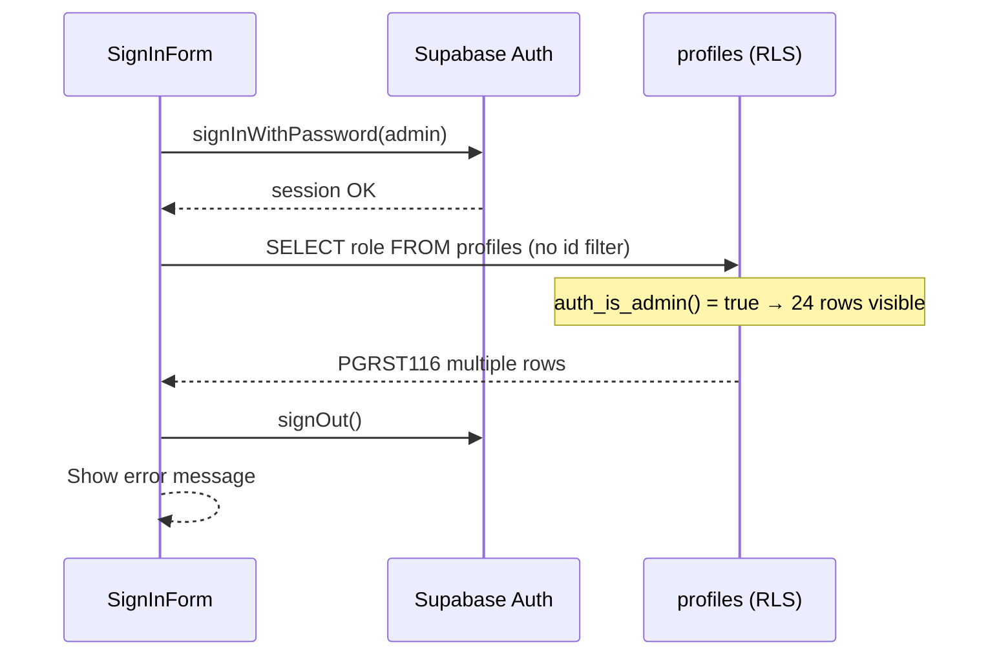

# E2E admin login profile lookup audit

**Date:** 2026-05-16  
**Scope:** `test_e2e_admin@shalean.co.za` sign-in failure — `JSON object requested, multiple (or no) rows returned`  
**Status:** Audit only — no fixes applied.

---

## Executive summary

Admin E2E login fails **after** `signInWithPassword` succeeds. The failure is **not** missing seed data, duplicate profile rows, or a wrong role on the admin profile.

**Root cause:** `SignInForm.tsx` loads `profiles` with `.maybeSingle()` but **does not filter by the signed-in user’s id**. For admin users, RLS policy `profiles_select` allows `SELECT` on **all** profile rows (`auth_is_admin()`). PostgREST returns many rows; `.maybeSingle()` rejects that with the observed error.

| Hypothesis | Verdict |
|------------|---------|
| No `profiles` row for admin | **Rejected** — exactly one row, `role = admin` |
| Duplicate `profiles` rows (same `id`) | **Rejected** — PK intact; no duplicate `id` groups |
| Profile exists but role ≠ admin | **Rejected** — `role = admin` |
| `.single()` used incorrectly | **Partially** — `.maybeSingle()` is used, but **without `.eq("id", user.id)`**; same class of error when row count ≠ 1 |
| Seed script broken | **Rejected** — seed state is correct |
| `handle_new_user` trigger broken | **Rejected** — profile present and consistent |

**Fix owner:** Sign-in logic (`SignInForm.tsx`), not the E2E seed script.

---

## Observed failure

- **Email:** `test_e2e_admin@shalean.co.za`
- **Error (UI):** `JSON object requested, multiple (or no) rows returned`
- **When:** Immediately after successful password sign-in, during post-login profile/role lookup

Customer and cleaner E2E accounts are unaffected because their RLS scope returns at most one row even without an explicit `id` filter.

---

## Database state (project `jdmumbvednevkrctkiwd`)

Queries run via Supabase SQL (service role), 2026-05-16.

### `auth.users`

```sql
select id, email from auth.users where email = 'test_e2e_admin@shalean.co.za';
```

| id | email |
|----|-------|
| `168c96e1-3d07-447f-bf64-3c0bbb8f9a3b` | `test_e2e_admin@shalean.co.za` |

Matches `.env.local` → `E2E_TEST_ADMIN_PROFILE_ID=168c96e1-3d07-447f-bf64-3c0bbb8f9a3b`.

### `public.profiles`

```sql
select * from public.profiles where id in (
  select id from auth.users where email = 'test_e2e_admin@shalean.co.za'
);
```

| id | role | full_name | created_at | updated_at |
|----|------|-----------|------------|------------|
| `168c96e1-3d07-447f-bf64-3c0bbb8f9a3b` | `admin` | E2E Test Admin | 2026-05-16 14:52:11+00 | 2026-05-16 14:52:11+00 |

### Duplicate check

```sql
select id, count(*) as cnt from public.profiles group by id having count(*) > 1;
```

**0 rows** — no duplicate primary keys.

### Table scale (why admin query returns “multiple”)

```sql
select count(*) as profile_count from public.profiles;
```

**24** profiles in the database. An unscoped admin `SELECT` on `profiles` can return all 24 under RLS.

---

## Code path analysis

### 1. Sign-in form (defect)

`src/app/sign-in/SignInForm.tsx` — after `signInWithPassword`:

```53:56:src/app/sign-in/SignInForm.tsx
      const { data: profile, error: profileError } = await supabase
        .from("profiles")
        .select("role")
        .maybeSingle();
```

**Missing:** `.eq("id", user.id)` (or equivalent filter on `auth.uid()`).

PostgREST behavior:

- `.maybeSingle()` — expects **0 or 1** row; errors if **2+** rows.
- Error text: `JSON object requested, multiple (or no) rows returned` (PGRST116).

This is **not** specific to `.single()`; `.maybeSingle()` fails the same way when multiple rows are returned.

### 2. RLS — why only admin hits this

`supabase/migrations/20260516160000_rls_role_security.sql`:

```199:202:supabase/migrations/20260516160000_rls_role_security.sql
drop policy if exists profiles_select on public.profiles;
create policy profiles_select on public.profiles
  for select to authenticated
  using (id = auth.uid() or public.auth_is_admin());
```

`auth_is_admin()` (same migration):

```21:33:supabase/migrations/20260516160000_rls_role_security.sql
create or replace function public.auth_is_admin()
returns boolean
...
  select exists (
    select 1
    from public.profiles p
    where p.id = auth.uid()
      and p.role = 'admin'
  );
```

| Signed-in role | Effective `profiles` SELECT scope | Unscoped query row count |
|----------------|-----------------------------------|---------------------------|
| customer | own row only | ≤ 1 |
| cleaner | own row only | ≤ 1 |
| **admin** | **all rows** (`auth_is_admin()` true) | **24** (current DB) → `.maybeSingle()` **fails** |

### 3. Correct patterns elsewhere (for comparison)

These paths **do** filter by user id:

| Location | Filter |
|----------|--------|
| `src/middleware.ts` | `.eq("id", user.id).maybeSingle()` |
| `src/app/auth/callback/route.ts` | `.eq("id", user.id).maybeSingle()` |
| `src/lib/auth/getCurrentUser.ts` | `.eq("id", userData.user.id).maybeSingle()` |

`SignInForm.tsx` is the outlier.

### 4. Role redirect helper

`src/lib/auth/redirects.ts` — `resolvePostSignInPath(role, redirectedFrom)` is **not** involved in the failure; execution never reaches it because the profile query errors first.

For a fixed flow, admin would resolve to `/admin` (or a valid `redirectedFrom` under `/admin/*`).

### 5. E2E seed (`scripts/e2e/seed.mjs` + `scripts/e2e/lib/auth.mjs`)

Seed flow for admin:

1. `ensureE2eUser` — find/create auth user, then `profiles` upsert `{ id: userId, role: 'admin', full_name: 'E2E Test Admin' }` with `onConflict: 'id'`.
2. Logs `✓ admin profile ${adminProfileId}`; writes `E2E_TEST_ADMIN_PROFILE_ID` to `.env.local`.

**Conclusion:** Seed is idempotent and produced correct data. Re-running seed would not fix sign-in without changing `SignInForm.tsx`.

### 6. Auth bootstrap trigger

`supabase/migrations/20260516150000_auth_profile_bootstrap.sql` — `handle_new_user` on `auth.users` INSERT:

- Inserts `profiles` with role from `raw_user_meta_data.role` (defaults `customer`).
- `ON CONFLICT (id) DO UPDATE` for `full_name` only (does **not** overwrite `role` on conflict).

E2E seed order: `createUser` (trigger may insert profile) → explicit `profiles` upsert with `role: admin`. Final state is correct.

No evidence the trigger created duplicates or left admin without a profile.

---

## Failure sequence (admin)



---

## Root cause (single sentence)

**Unscoped `profiles` query in `SignInForm.tsx` combined with admin-wide RLS read access causes `.maybeSingle()` to receive 24 rows instead of 1.**

---

## Safest fix (recommended, not implemented)

**Change sign-in logic only** — align with middleware/callback/getCurrentUser:

1. After successful `signInWithPassword`, read `user` from `supabase.auth.getUser()` (or sign-in response if user is present).
2. Query:

   ```ts
   .from("profiles")
   .select("role")
   .eq("id", user.id)
   .maybeSingle();
   ```

3. Optional hardening: add a unit/integration test that admin sign-in path uses `.eq("id", …)` (regression guard).

**Do not change RLS** to “fix” sign-in — admin broad read is intentional for admin dashboards.

**Do not change seed** — data is already correct.

**Do not switch to `.single()`** without `.eq("id", …)` — that would still fail for admin (and would also fail on zero rows with a different message).

---

## Seed script vs sign-in logic

| Area | Change? | Reason |
|------|---------|--------|
| `scripts/e2e/seed.mjs` / `auth.mjs` | **No** | Auth user and profile are correct |
| `handle_new_user` trigger | **No** | Working; not causal |
| `SignInForm.tsx` | **Yes** | Missing `id` filter |
| `middleware.ts` / `callback` / `getCurrentUser` | **No** | Already correct |

---

## Verification checklist (post-fix)

- [ ] Sign in as `test_e2e_admin@shalean.co.za` — no PGRST116 error
- [ ] Redirect lands on `/admin` (or allowed `redirectedFrom`)
- [ ] Customer/cleaner E2E sign-in still works
- [ ] Middleware allows `/admin/*` for admin session
- [ ] No new duplicate profiles from re-seed

---

## References

- Sign-in: `src/app/sign-in/SignInForm.tsx`
- Redirects: `src/lib/auth/redirects.ts`
- Middleware profile load: `src/middleware.ts`
- RLS: `supabase/migrations/20260516160000_rls_role_security.sql`
- Profile bootstrap: `supabase/migrations/20260516150000_auth_profile_bootstrap.sql`
- E2E seed: `scripts/e2e/seed.mjs`, `scripts/e2e/lib/auth.mjs`
