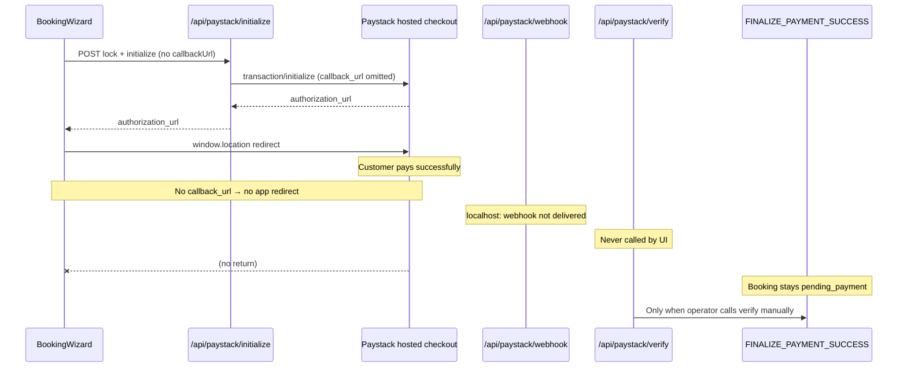

# Paystack post-payment redirect and verify audit

**Date:** 2026-05-16  
**Scope:** Why the browser does not return to the app after a successful Paystack payment, and why booking finalization does not happen until `/api/paystack/verify` is called manually.  
**Status:** Audit only — no fixes applied.

---

## Executive summary

Payment **succeeds on Paystack** but the app **never receives a post-checkout signal**. The booking stays `pending_payment` until someone hits the verify API.

**Root cause (precise):** The checkout path never sends Paystack a `callback_url`, and there is **no success return route** that calls verify. The wizard only does `window.location.href = authorization_url` and stops. Finalization is designed for **webhook (production)** or **verify API (fallback)** — neither runs automatically after payment in the current UI.

| Layer | Status |
|-------|--------|
| Paystack initialize | Works; returns `authorization_url` |
| `callback_url` to Paystack | **Not sent** (always `undefined` from wizard) |
| Browser return to app | **Missing** — no callback URL, no success page |
| Webhook on localhost | **Unreachable** without tunnel (expected) |
| Verify API | **Implemented and correct** — JSON route, not wired to UI |
| Auto verify after return | **Does not exist** |

This is an **architectural gap** in the customer checkout UX, not a bug in `FINALIZE_PAYMENT_SUCCESS`, webhook handling, or manual verify.

---

## Observed vs expected behavior

| Step | Observed | Expected (product) |
|------|----------|-------------------|
| Paystack payment | Success screen on Paystack | Same |
| Browser redirect | Stays on Paystack / no app return | Redirect to app success URL |
| Booking status | `pending_payment` | `confirmed` → `pending_assignment` |
| Finalize trigger | Only after manual `GET /api/paystack/verify?reference=…` | Webhook and/or success-page verify |
| Assignment offer | After manual verify | After finalize (automatic today) |

Manual verify working confirms: **Paystack charge is valid**, **verify + finalize path is sound**, **missing piece is post-payment orchestration only**.

---

## Current architecture (as implemented)



### Intended architecture (documented)

From `docs/payments/paystack-foundation.md` and `docs/booking/customer-booking-wizard.md`:

1. Initialize → `pending_payment` + Paystack URL  
2. Customer pays on Paystack  
3. **Production:** `charge.success` webhook → `processPaystackChargeSuccess(..., "webhook")` → finalize  
4. **Fallback:** verify API → same finalize path  
5. Assignment engine runs after finalize (already implemented)

The docs explicitly state: *“Confirmation happens only via webhook/verify (Phase 3), not in the wizard.”*  
They also say (E2E): *“rely on verify fallback after redirect”* — but **no redirect or verify-on-return is implemented**.

---

## Code trace: initialize flow

### 1. Wizard → initialize payload

**File:** `src/features/booking-wizard/checkout.ts`

- `InitializeCheckoutPayload` allows optional `callbackUrl`.
- `buildInitializeCheckoutPayload()` returns only:
  - `bookingId`, `lockId`, `paymentIdempotencyKey`, `email`
- **`callbackUrl` is never set.**

Test explicitly documents this: *“builds initialize payload with lock id and booking id only”* (`checkout.test.ts`).

### 2. Wizard → Paystack redirect

**File:** `src/features/booking-wizard/components/BookingWizard.tsx` (lines 196–220)

```ts
const result = await initializePaystackCheckout(initPayload);
// ...
clearWizardStorage();
window.location.href = result.authorization_url;
```

- **Full-page redirect** to Paystack hosted checkout (`authorization_url`).
- **Not** inline modal / Pop / `access_code` flow (`access_code` is returned by API but unused).
- **No** success handler, **no** `reference` stored client-side, **no** post-return fetch to verify.

### 3. API route

**File:** `src/app/api/paystack/initialize/route.ts`

- Accepts optional `callbackUrl` from JSON body and passes to `initializePayment`.
- Wizard never sends it → always `undefined`.

### 4. Server initialize → Paystack API

**File:** `src/features/payments/server/initializePayment.ts` (`completePaystackInitialize`)

```ts
const paystack = await paystackInitializeTransaction({
  email,
  amount: paystackAmount,
  reference,
  currency: booking.currency,
  callback_url: callbackUrl,  // undefined in production wizard path
  metadata: { booking_id, payment_id, ... },
});
```

**File:** `src/features/payments/server/paystackClient.ts`

- POST `/transaction/initialize` with JSON body.
- `redirect_url` is **not** used (Paystack uses `callback_url` only; see `paystackTypes.ts`).

When `callbackUrl` is `undefined`, `JSON.stringify` omits `callback_url` → Paystack has **no per-transaction return URL**.

### 5. Paystack parameters summary

| Parameter | Sent today? | Source |
|-----------|-------------|--------|
| `email` | Yes | Wizard / customer session |
| `amount` | Yes | Locked `bookings.price_cents` |
| `reference` | Yes | Built from booking + payment id |
| `currency` | Yes | Booking currency |
| `metadata` | Yes | `booking_id`, `payment_id`, etc. |
| `callback_url` | **No** | Never passed from wizard |
| `redirect_url` | N/A | Not in types or client |

There is **no** `NEXT_PUBLIC_APP_URL` / `VERCEL_URL` helper to build a callback URL even if the server wanted one.

---

## Code trace: verify and webhook

### Webhook (authoritative for production)

**File:** `src/app/api/paystack/webhook/route.ts` → `handlePaystackWebhook.ts`

- Validates `x-paystack-signature`.
- Handles `charge.success` only.
- Calls `processPaystackChargeSuccess(charge, "webhook")` → `finalizePaidBooking` → `FINALIZE_PAYMENT_SUCCESS`.

**Local dev:** Paystack cannot POST to `http://localhost:3000/api/paystack/webhook` unless a tunnel (ngrok, Cloudflare Tunnel) is configured. Documented in `docs/testing/live-e2e-smoke-test.md`.

**If webhook is not received:** booking correctly remains `pending_payment` until verify runs.

### Verify (fallback)

**File:** `src/app/api/paystack/verify/route.ts` → `verifyPayment.ts`

- GET/POST with `?reference=` (or JSON body on POST).
- Requires **authenticated customer** (`getCurrentUser`) for ownership check.
- Calls Paystack `/transaction/verify/{reference}` then `processPaystackChargeSuccess(charge, "verify")`.
- Returns **JSON** (`{ ok, bookingId, paid, ... }`) — **not an HTML page**.

**No caller in the app** invokes this after checkout. Grep shows no `fetch("/api/paystack/verify")` in `booking-wizard` or any page component.

### Shared finalize path

**Files:** `upsertBookingFromPaystack.ts`, `finalizePaidBooking.ts`

- Webhook and verify both use the same finalize + assignment path.
- Manual verify success proves this layer is **correct**.

---

## Missing routes and components

Searched `src/app` for payment success / verify pages:

| Route | Exists? |
|-------|---------|
| `/payment/success` | **No** |
| `/booking/success` | **No** |
| `/payments/verify` | **No** (only `/api/paystack/verify`) |
| `/customer/bookings/.../payment-success` | **No** |
| `/api/paystack/verify` | **Yes** (API only) |
| `/api/paystack/webhook` | **Yes** |
| `/api/paystack/initialize` | **Yes** |

There is **no UI surface** for Paystack to redirect to and **no client** that runs verify on load.

---

## Actual runtime flow (customer book → Paystack → ???)

```
/customer/book (BookingWizard)
  → POST /api/bookings/lock
  → POST /api/paystack/initialize  (no callbackUrl)
  → window.location = Paystack authorization_url
  → Customer completes payment on Paystack
  → Paystack shows "Payment Successful"
  → ???  [MISSING STEP]
  → User remains on Paystack OR closes tab
  → Webhook: not delivered to localhost (typical)
  → Verify: not triggered
  → bookings.status = pending_payment
```

**Missing step:** Redirect to app URL with `?reference=` (or `trxref`) **and** a page/action that calls `/api/paystack/verify` (or server-side verify in a Route Handler).

---

## Root cause classification

| Hypothesis | Verdict |
|------------|---------|
| Missing `callback_url` | **Yes — primary** |
| Callback route missing | **Yes — no success page** |
| Frontend never redirects back | **Yes — only outbound redirect to Paystack** |
| Popup/modal flow without callback handler | **No — uses full redirect, not popup** |
| `redirect_url` misnamed / wrong field | **N/A — app never sets callback** |
| Localhost callback unsupported by Paystack | **Secondary** — test mode often allows `http://localhost:*`; not the blocker if URL were sent |
| Webhook-only gap on localhost | **Yes — contributing** for local dev without tunnel |
| Verify not wired after return | **Yes — primary** alongside missing callback |
| Paystack config dashboard default | **Possible fallback** — if dashboard has a global callback, behavior could vary; app does not set per-checkout URL |
| Wrong app URL env | **Yes — no app base URL env exists** to build callback even server-side |

**Exact failing condition:**  
`callback_url` is `undefined` at Paystack initialize time **and** no application route performs verify when payment completes.

---

## Webhook vs verify: is the architecture otherwise correct?

**Yes**, for server-side payment finalization:

| Concern | Assessment |
|---------|------------|
| Idempotent finalize | OK (`payment_events`, command idempotency) |
| Amount matching | OK |
| Webhook signature | OK |
| Verify same path as webhook | OK |
| Assignment after pay | OK (runs after finalize) |
| Client never confirms booking | OK (by design) |

**Gap:** Customer-facing **return + verify trigger** was documented as E2E fallback but **never built**. The system behaves like **webhook-only in practice on localhost**, without a working verify fallback in the UX.

---

## Paystack / localhost notes

- **Initialize** uses standard hosted checkout (`authorization_url`), not Pop.
- **Local webhook** requires a public URL (tunnel) per `live-e2e-smoke-test.md`.
- **Local verify fallback** was intended to replace webhook when redirect returns to the app — requires:
  1. `callback_url` pointing at the app (e.g. `http://localhost:3000/customer/bookings/payment/callback?reference=…` or dedicated success page).
  2. That page (or route handler) calling verify with the reference Paystack appends (`reference` / `trxref` query params per Paystack docs).
- Paystack test mode generally allows `http://localhost` callbacks when explicitly set; the app currently sets **none**.

---

## Affected files

| File | Role in gap |
|------|-------------|
| `src/features/booking-wizard/checkout.ts` | Omits `callbackUrl` from payload |
| `src/features/booking-wizard/components/BookingWizard.tsx` | Redirect to Paystack only; no return handling |
| `src/features/booking-wizard/api.ts` | `initializePaystackCheckout` does not add callback |
| `src/app/api/paystack/initialize/route.ts` | Supports `callbackUrl` but unused |
| `src/features/payments/server/initializePayment.ts` | Forwards `callback_url` only when provided |
| `src/features/payments/server/paystackTypes.ts` | Defines `callback_url` optional |
| `src/app/api/paystack/verify/route.ts` | Fallback works; not linked from UI |
| `src/features/payments/server/verifyPayment.ts` | Same |
| `src/features/payments/server/handlePaystackWebhook.ts` | Correct; unreachable on localhost without tunnel |
| `docs/booking/customer-booking-wizard.md` | Documents webhook/verify finalize, not return UX |
| `docs/testing/live-e2e-smoke-test.md` | Mentions verify after redirect — **not implemented** |

---

## Risks

| Risk | Severity |
|------|----------|
| Customers think payment failed while booking unpaid | High |
| Ops must manually verify references | High (local/staging) |
| Production relies on webhook only — if webhook misconfigured, same stall | High |
| Verify API exposed but undiscoverable | Medium |
| Opening verify URL in browser without session returns 401 | Medium (customer must be logged in) |
| No `APP_URL` env — staging/prod callback URLs easy to misconfigure | Medium |

---

## Recommended fix order (minimal, do not refactor lifecycle)

### Phase 1 — Callback URL (initialize)

1. Add server helper to build absolute callback URL (e.g. `APP_URL` or `VERCEL_URL` + path).
2. Pass `callbackUrl` from `buildInitializeCheckoutPayload` / wizard (or set only server-side in initialize route from env).
3. Path should include booking context if useful; Paystack will append `?reference=` (and `trxref`).

Example target:  
`{APP_URL}/customer/bookings/payment/return` or `/payment/return`

### Phase 2 — Success / return page (verify trigger)

1. Add **App Router page** (e.g. `src/app/(customer)/customer/bookings/payment/return/page.tsx`) or route handler.
2. On load: read `reference` / `trxref` from query.
3. `fetch("/api/paystack/verify?reference=…")` with customer session (cookies).
4. Show success / pending / error UI; link to `/customer/bookings/{id}`.
5. Do **not** set `confirmed` in the client — only call verify API.

Alternative: **Route Handler** `GET /customer/bookings/payment/return` that server-side calls `verifyPayment` and redirects to booking detail (303).

### Phase 3 — Local dev docs

1. Document `APP_URL=http://localhost:3000` in `.env.example`.
2. E2E smoke: step “return from Paystack → auto verify” instead of manual API URL.
3. Optional: ngrok for webhook testing (parallel path, not required if verify-on-return works).

### Phase 4 — Production hardening (later)

1. Paystack dashboard: webhook URL + allowed callback domain.
2. Monitor stuck `pending_payment` > N minutes.
3. Optional: background retry verify (cron) — not required if return page works.

**Do not** change `FINALIZE_PAYMENT_SUCCESS`, assignment rules, or RLS in Phase 1–2.

---

## Acceptance mapping (audit)

| Criterion | Result |
|-----------|--------|
| Exact root cause | **No `callback_url` + no post-return verify UI** |
| Exact missing step | **Paystack success → app return → auto verify** |
| File locations | Documented above |
| Minimal fix plan | Phase 1–2 above |
| Webhook + verify architecture correct? | **Yes** server-side; **UX incomplete** |

---

## Related docs

- [Paystack foundation](../payments/paystack-foundation.md)
- [Customer booking wizard](../booking/customer-booking-wizard.md)
- [Live E2E smoke test](../testing/live-e2e-smoke-test.md) — webhook tunnel + verify fallback (manual today)
- [Production readiness checklist](../launch/production-readiness-checklist.md)
