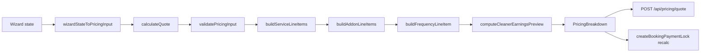
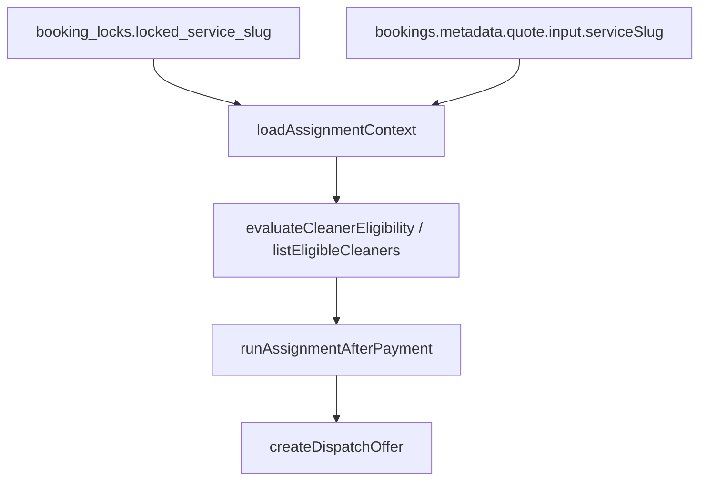
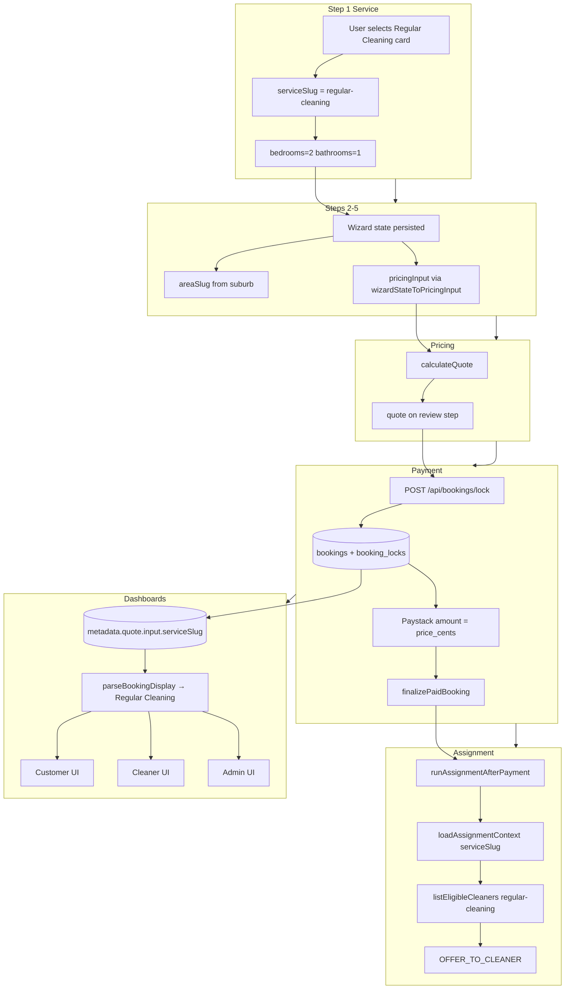

# Regular Cleaning — end-to-end system audit

**Date:** 2026-05-18  
**Scope:** How `regular-cleaning` flows from booking Step 1 through pricing, validation, payment, assignment, customer/cleaner/admin dashboards, database contracts, and tests.  
**Status:** Audit only — **no production code changes**.

**Related audits:** `docs/audits/service-type-propagation-audit.md`, `docs/audits/customer-booking-flow-post-ui-polish-regression-audit.md`, `docs/audits/step1-horizontal-service-ui-redesign-safety-audit.md`

---

## Executive summary

| Question | Answer |
|----------|--------|
| Is `regular-cleaning` the canonical slug? | **Yes** — defined in `SERVICE_SLUGS`, `SERVICE_CATALOG`, wizard options, lock column `locked_service_slug`, and cleaner capabilities |
| Must the slug stay frozen? | **Yes** — renaming breaks locks, capabilities, tests, SQL fixtures, and any stored metadata |
| Does Regular Cleaning differ from other residential services in the wizard? | **Mostly no** — same bedroom/bathroom defaults (2/1) on select; office/carpet are the exceptions |
| Pricing model | **Percent-based cleaner earnings** (60–70% clamped R250–R300), not fixed R250 like deep/moving/carpet |
| Customer total authority | `calculateQuote()` → lock recalc → `bookings.price_cents` → Paystack `amount` |
| Where is slug stored? | `metadata.quote.input.serviceSlug` (primary), `booking_locks.locked_service_slug`, optional legacy top-level keys |
| Display label | `SERVICE_CATALOG["regular-cleaning"].label` → **"Regular Cleaning"** via `parseBookingDisplay` / `serviceLabelFromSlug` |
| Biggest risks when changing Regular Cleaning | Slug rename, catalog cents, earnings percent rules, cleaner capability rows, lock hash inputs |

**Overall:** Regular Cleaning is the **default residential service** in the code-first catalog (listed first in the wizard, used heavily in tests, and used as a **fallback slug** in two server parsers when metadata is incomplete). Safe changes start with **Step 1 display copy and icon styling**; risky changes touch **catalog pricing, earnings logic, and any slug string**.

---

## 1. Booking Step 1 (Service)

### Where Regular Cleaning appears

| Layer | Location | Behavior |
|-------|----------|----------|
| Wizard entry | `src/app/(customer)/customer/book/page.tsx` | Renders `BookingWizard` |
| Step 1 UI | `src/features/booking-wizard/components/ServiceStepPanel.tsx` | Card grid; first service in list order |
| Options source | `src/features/booking-wizard/constants.ts` → `WIZARD_SERVICE_OPTIONS` | Built from `SERVICE_CATALOG`; **`regular-cleaning` is first** in the slug array |
| Label | `SERVICE_CATALOG["regular-cleaning"].label` | **"Regular Cleaning"** |
| Mobile description | `SERVICE_STEP_DESCRIPTIONS["regular-cleaning"]` | `"Routine upkeep for your home"` |
| Desktop description | `SERVICE_STEP_DESCRIPTIONS_DESKTOP["regular-cleaning"]` | `"Routine clean for kitchens, bathrooms, and living areas."` |

### Slug and catalog contract

```typescript
// src/features/pricing/server/types.ts
"regular-cleaning" // member of SERVICE_SLUGS union

// src/features/pricing/server/catalog.ts
"regular-cleaning": {
  slug: "regular-cleaning",
  label: "Regular Cleaning",
  baseCents: 45_000,
  extraBedroomCents: 8_000,
  extraBathroomCents: 6_000,
}
```

**Confirm:** `regular-cleaning` must **not** be renamed without a coordinated migration (metadata, locks, `cleaner_service_capabilities`, tests, seed docs).

### Icon / card UI

| Asset | File | Regular Cleaning value |
|-------|------|------------------------|
| Icon | `serviceStepIcons.tsx` | `IconHome` |
| Text color | `serviceStepIcons.tsx` | `text-sky-600` |
| Surface | `serviceStepIcons.tsx` | `bg-sky-50` |
| Mobile layout | `ServiceStepPanel.tsx` `ServiceCardMobile` | Marked **frozen** — do not change without explicit mobile redesign |
| Desktop layout | `ServiceCardDesktop` | 2-col / 3-col grid at `md` / `xl` |

### Selection behavior

```62:70:src/features/booking-wizard/components/BookingWizard.tsx
  const handleSelectService = useCallback(
    (slug: ServiceSlug) => {
      patch({
        serviceSlug: slug,
        bedrooms: slug === "office-cleaning" ? 0 : 2,
        bathrooms: slug === "office-cleaning" ? 0 : 1,
      });
    },
    [patch],
  );
```

**Confirm:** Selecting Regular Cleaning sets **`bedrooms: 2`, `bathrooms: 1`** (same as deep, moving, airbnb). Only `office-cleaning` resets rooms to 0. Initial state in `INITIAL_WIZARD_STATE` is also 2/1 before any selection.

### Office vs residential room behavior

| Service | Bedrooms / bathrooms on select | Details step UI |
|---------|------------------------------|-----------------|
| `regular-cleaning` | 2 / 1 | Bedroom + bathroom inputs (`allowZeroRooms` false) |
| `office-cleaning` | 0 / 0 | Property size (sqm) only |
| `carpet-cleaning` | 2 / 1 on select | Bedrooms used as **carpet zones** in pricing |

### Validation dependencies (Step 1)

| Check | File | Regular Cleaning |
|-------|------|------------------|
| Service required | `validation.ts` `validateServiceStep` | `serviceSlug` must be set and in `WIZARD_SERVICE_OPTIONS` with `enabled: true` |
| Enabled flag | `constants.ts` | `enabled: true` for all six services today |

Steps 2+ depend on `state.serviceSlug` being set; details validation reads `SERVICE_CATALOG[state.serviceSlug]` for min bedrooms/bathrooms (≥1 for regular).

### Step 1 persistence

`storage.ts` persists `serviceSlug` in `PERSIST_KEYS` under `shalean-booking-wizard-v1`. Quote, lock IDs, and cleaner list are **not** persisted across refresh (reset on load).

---

## 2. Booking Steps 2–7

Wizard steps: `service` → `datetime` → `location` → `details` → `cleaner` → `review` → `checkout` (`navigation.ts`).

### Step 2 — Schedule (`datetime`)

| Concern | Regular Cleaning impact |
|---------|-------------------------|
| State fields | `date`, `time` only — **no service-specific schedule rules** |
| Slot build | `slot.ts` `buildWizardSlot` → ISO `scheduledStart` / `scheduledEnd` (180 min job duration from `WIZARD_JOB_DURATION_MINUTES`) |
| Validation | `validateDateTimeStep` — future slot in `Africa/Johannesburg` |
| UI | `ScheduleStepPanel.tsx` — preset cards + hidden native inputs (service-agnostic) |

### Step 3 — Location

| Concern | Impact |
|---------|--------|
| Fields | `addressLine1`, `suburb`, `city`, `locationNotes` |
| Area matching | `normalizeAreaSlug(state.suburb)` → `areaSlug` used for cleaner eligibility and lock |
| Validation | Suburb must normalize; required address fields |

### Step 4 — Details (`details`)

| Field | Regular Cleaning |
|-------|------------------|
| Bedrooms / bathrooms | Shown (not office); min 1 each via `SERVICE_CATALOG` rule |
| Frequency | `FrequencyStepPanel` — `once` / `weekly` / `biweekly` / `monthly` (same catalog multipliers for all residential) |
| Add-ons | `AddonsStepPanel` — all five addon slugs available; pricing identical regardless of service |
| Special instructions | Free text → `metadata.specialInstructions` |

### Step 5 — Cleaner preference

| Concern | Flow |
|---------|------|
| Prefetch | On enter `cleaner` (and when leaving `details` → `cleaner`), `fetchAvailableCleaners(state)` |
| API | `POST /api/cleaners/available` with `serviceSlug`, `areaSlug`, slot, `pricingInput` |
| Eligibility | Cleaners must have `regular-cleaning` in `cleaner_service_capabilities.service_slug` |
| Modes | `best_available` or `selected` + `selectedCleanerId` |
| Earnings preview on cards | `listEligibleCleaners` calls `calculateQuote` with full `pricingInput` → **percent model** for regular |

### Step 6 — Review

| Concern | Flow |
|---------|------|
| Quote load | `useEffect` on `review` step → `fetchPricingQuote` → `POST /api/pricing/quote` |
| Display | Service label from `WIZARD_SERVICE_OPTIONS`; line items from `state.quote.lineItems` |
| Confirm | `reviewConfirmed` checkbox required |

### Step 7 — Checkout

| Concern | Flow |
|---------|------|
| Guard | `validateCheckoutStep` + `canProceedToCheckout` |
| Lock payload | `buildLockRequestPayload` — includes `serviceSlug`, rooms, frequency, addons, schedule, `bookingMetadata` |
| Paystack | `createPaymentLock` → `initializePaystackCheckout` → redirect; wizard storage cleared |

### Checkout / metadata payload (service-specific data)

`buildWizardBookingMetadata` → `buildBookingQuoteMetadata`:

- Nested: `metadata.quote.input.serviceSlug` = `"regular-cleaning"`
- Also: `areaSlug`, `suburb`, `address`, `cleanerPreferenceMode`, `preferred_cleaner_id`, `timezone`

`hashLockInputs` canonical object includes **`pricingInput` (with `serviceSlug`)**, schedule, `areaSlug`, `cleanerPreference` — **not** display labels.

---

## 3. Pricing

### Regular Cleaning rate card (authoritative: `catalog.ts`)

| Component | Cents | Notes |
|-----------|-------|-------|
| Base (1 bed + 1 bath) | 45_000 | R450.00 |
| Extra bedroom | 8_000 each | Above first bedroom |
| Extra bathroom | 6_000 each | Above first bathroom |
| `fixedCleanerPayout` | **unset** | Uses **percent** earnings path |

**Example (test-backed):** 2 bed / 2 bath, once → **59_000** cents (45000 + 8000 + 6000).

### Add-ons

Service-agnostic; added to subtotal before frequency discount (`computeLineItems.ts`).

### Frequency

| Frequency | Multiplier | Effect on regular 2/2 (59000 subtotal) |
|-----------|------------|----------------------------------------|
| `once` | 1.0 | 59_000 |
| `weekly` | 0.9 | 53_100 (discount line item) |
| `biweekly` | 0.95 | — |
| `monthly` | 0.97 | — |

### Quote calculation path



### Server-side lock recalculation

`createBookingPaymentLock.ts`:

1. `calculateQuote(input.pricingInput)` on server
2. Compare `serverTotal` to `clientQuoteTotalCents` → `QUOTE_MISMATCH` if differ
3. Draft booking `price_cents` = server total
4. Lock row `locked_service_slug` = `pricingInput.serviceSlug`

### Cleaner earnings preview (Regular Cleaning specific)

| Rule | Value |
|------|-------|
| Model | `regular_percent_with_min_max` |
| Tenure &lt; 4 months | 60% of customer total, clamped **25_000–30_000** cents per cleaner |
| Tenure ≥ 4 months | 70%, same clamp |
| Tenure unknown | 60% + `fallbackReason` in metadata |
| Team size &gt; 1 | Fixed R250/cleaner (same as deep) — **regular 1bed/1bath teamSize 2 fails** `UNSAFE_CLEANER_EARNINGS` in tests |

Deep/moving/carpet use **fixed R250** per cleaner; regular and airbnb/office use percent (see `computeCleanerEarnings.ts`).

### Paystack amount source

**Not** from client quote at initialize time:

1. Lock sets `bookings.price_cents`
2. `initializePayment` → `completePaystackInitialize` uses **`booking.price_cents`** as `paystackAmount`
3. Must match `payment.amount_cents`

---

## 4. Payment

### Lock payload (client → server)

From `lockPayload.ts` / `POST /api/bookings/lock`:

| Field | Regular Cleaning typical value |
|-------|-------------------------------|
| `serviceSlug` | `"regular-cleaning"` |
| `bedrooms` / `bathrooms` | User-selected (default 2/1) |
| `frequency` | e.g. `"once"` |
| `addons` | `[]` or addon slugs |
| `clientQuoteTotalCents` | From `state.quote.totalCents` |
| `bookingMetadata` | Full quote snapshot + address + preference |

### Paystack initialize payload

From `checkout.ts` `buildInitializeCheckoutPayload`:

- `bookingId`, `lockId`, `paymentIdempotencyKey`, `email`, `callbackUrl`
- **No serviceSlug in initialize body** — service is already on booking metadata and lock

### Verify / webhook finalize

| Step | Module | Regular Cleaning |
|------|--------|------------------|
| Verify | `PaymentSuccessVerifier.tsx` → `GET /api/paystack/verify` | Service-agnostic |
| Finalize | `finalizePaidBooking.ts` | Amount match; then `runAssignmentAfterPayment` |
| Assignment trigger | Same for all services | Uses lock/metadata context |

### Payment success redirect

`buildPaymentSuccessCallbackUrl` → `/payment/success` → verify → redirect to customer booking detail.

### Booking status after payment

Typical happy path: `pending_payment` → (finalize) → `confirmed` → `pending_assignment` → offer/assign flows. Service slug does not change status machine.

---

## 5. Assignment / cleaner matching

### How service slug reaches assignment



### Selected cleaner eligibility

- Lock time: `validateCleanerPreferenceForLock` checks capability includes `input.pricingInput.serviceSlug`
- Assignment time: `isCleanerEligibleForAssignment` with `context.serviceSlug`

### Best available

`pickBestEligibleCleanerId` → `listEligibleCleaners` filtered by **`regular-cleaning`** capability and area/slot.

### Dispatch offer

`createDispatchOffer` — **no service-specific branching**; offer is per booking + cleaner.

### Cleaner visibility

- Offers/jobs: `parseBookingDisplay(metadata)` → **"Regular Cleaning"**
- Earnings on offer cards: `resolveCleanerEarningsDisplay` recomputes from metadata quote input

### Fallback slug risk

```117:120:src/features/assignments/server/assignmentContext.ts
  const serviceSlug =
    typeof metadata.serviceSlug === "string"
      ? metadata.serviceSlug
      : "regular-cleaning";
```

If lock is missing **and** top-level metadata has no slug, assignment assumes **`regular-cleaning`**. Same pattern in `parseRequests.ts` for booking cleaners API. **Do not rely on this for new features** — wizard bookings always have nested `quote.input.serviceSlug`.

---

## 6. Customer dashboard

| Surface | Read model | Service label source |
|---------|------------|---------------------|
| Bookings list | `customerBookingReadModel.ts` | `parseBookingDisplay` → `serviceLabelFromSlug` |
| Booking detail | Same + `customerBookingDetailDisplay.ts` (hero copy) | **"Regular Cleaning"** when `quote.input.serviceSlug` present |
| Lifecycle timeline | `lifecycleTimeline.ts` | Status-driven; not service-specific |
| Payment display | `price_cents`, payment summaries | Amount only; service from metadata |
| Status labels | `customerBookingDetailDisplay.ts` | Maps booking status to customer-facing strings |

**Note:** `resolveServiceSlugFromMetadata` reads nested `quote.input.serviceSlug` (fixed since service-type-propagation audit). Legacy bookings with only top-level slug still work.

---

## 7. Cleaner dashboard

| Surface | File | Regular Cleaning |
|---------|------|------------------|
| Home offers/jobs | `cleaner/page.tsx` | `serviceLabel` from read model |
| Offers list API | `api/cleaner/offers/route.ts` | `serviceLabel` per offer |
| Job detail | `cleaner/jobs/[bookingId]/page.tsx` | Subtitle = `serviceLabel` |
| Earnings page | `cleaner/earnings/page.tsx` | Per-job `serviceLabel` |
| Earnings amount | `resolveCleanerEarningsDisplay.ts` | Percent rules for regular slug |
| Completion | `api/cleaner/jobs/[bookingId]/complete/route.ts` | Service-agnostic status transition |
| Completion earnings | `computeEarningsForBooking.ts` | Uses `quote.input.serviceSlug`; percent path for regular |

---

## 8. Admin dashboard

| Surface | Read model | Regular Cleaning |
|---------|------------|------------------|
| Admin home queue | `adminOperationsReadModel.ts` | `parseBookingDisplay` on booking metadata |
| Bookings list | Same helpers | Search text includes service label |
| Booking detail | `admin/bookings/[bookingId]/page.tsx` | `serviceLabel` subtitle |
| Assignment controls | Dispatch/recover/replace routes | Service-agnostic; context from lock |
| Lifecycle / status | `buildLifecycleTimeline`, operational helpers | Shared across services |
| Payouts | `admin/payouts/page.tsx` | `serviceLabel` on payout rows |
| Operations queue | `admin/assignments/page.tsx` | `serviceLabel` in list |

Admin does **not** filter assignment queue by service slug in SQL today; service is display-only unless search matches label text.

---

## 9. Database / contracts

### Fields storing service identity

| Store | Column / path | Type | Constraint on slug values |
|-------|---------------|------|---------------------------|
| Booking metadata | `metadata.quote.input.serviceSlug` | JSON string | None (app validates via `isServiceSlug`) |
| Booking metadata | `metadata.quote.breakdown` | JSON | Includes line items with label "Regular Cleaning" |
| Booking lock | `booking_locks.locked_service_slug` | `text not null` | **No CHECK** — any text |
| Cleaner capabilities | `cleaner_service_capabilities.service_slug` | `text not null` | **No CHECK** — must match app catalog operationally |
| Bookings (legacy) | `bookings.service_id` | `uuid` nullable | **Unused** in wizard path (`null`) |
| Services seed | `services.name` | text | Human name "Regular Cleaning"; **not linked** by slug in app quotes |

### Migrations referencing service slugs

| Migration | Relevance |
|-----------|-----------|
| `20260516180000_cleaner_availability_eligibility.sql` | `cleaner_service_capabilities.service_slug` |
| `20260516190000_booking_payment_lock.sql` | `locked_service_slug` |
| `20260515201500_core_foundation.sql` | `services` table (name-based seed) |

### Seed data

`supabase/seed.sql` inserts **'Regular Cleaning'** with `base_price_cents: 45000` aligned with catalog — informational; app quotes from code.

### Assumptions tied to `regular-cleaning`

1. First/default residential service in wizard ordering and test fixtures  
2. Fallback slug when metadata incomplete (`assignmentContext`, `parseRequests`)  
3. Percent earnings path (not `fixedCleanerPayout`)  
4. E2E smoke doc expects **Regular Cleaning** as manual test service (`docs/testing/live-e2e-smoke-test.md`)  
5. Cleaner test seeds often include `regular-cleaning` capability  

---

## 10. Safe modification map

| Change type | Classification | Examples |
|-------------|----------------|----------|
| Step 1 mobile/desktop **copy** only | **Safe UI** | `SERVICE_STEP_DESCRIPTIONS`, `SERVICE_STEP_DESCRIPTIONS_DESKTOP` |
| Icon **colors** (not structure) | **Safe UI** | `serviceStepIcons.tsx` sky palette |
| Service card **desktop** layout/spacing | **Safe UI** (avoid mobile `ServiceCardMobile` without explicit approval) | `ServiceCardDesktop` |
| Label text "Regular Cleaning" | **Safe UI** if slug unchanged | `SERVICE_CATALOG[].label` only affects display + line item label |
| Base/extra room **prices** | **Risky business logic** | `catalog.ts` — breaks tests, locks, historical quotes |
| Slug rename | **Do not change** | Any string other than `regular-cleaning` |
| `SERVICE_SLUGS` union order | **Risky** | Type exports, validation messages |
| Earnings percent / clamps | **Risky business logic** | `computeCleanerEarnings.ts`, `catalog.ts` constants |
| `handleSelectService` room defaults | **Risky** | Affects validation and quotes for all new selections |
| `hashLockInputs` shape | **Do not change** without migration | Invalidates active locks |
| DB capability rows | **Risky** | Cleaners lose eligibility if slug mismatches |
| Fallback `"regular-cleaning"` strings | **Risky** | Silent wrong assignment if changed casually |

---

## 11. Test coverage

### Existing tests using `regular-cleaning` (representative)

| Area | File |
|------|------|
| Pricing / earnings | `src/features/pricing/server/calculateQuote.test.ts` |
| Wizard validation | `src/features/booking-wizard/validation.test.ts` |
| Wizard API/lock/checkout | `api.test.ts`, `checkout.test.ts` |
| Step 1 UI | `ServiceStepPanel.test.tsx` |
| Lock create/parse/retry | `createBookingPaymentLock.test.ts`, `parseRetryLockFromBooking.test.ts`, `initializePayment.lock.test.ts` |
| Paystack initialize w/ lock | (above) |
| Cleaner eligibility | `evaluate.test.ts`, `listEligibleCleaners.test.ts`, `apiRoutes.test.ts` |
| Assignment engine | `assignmentEngine.test.ts`, `runAssignmentAfterPayment.openOffer.test.ts`, admin dispatch tests |
| Dashboard display | `parseBookingDisplay.test.ts`, `dashboardReadModels.test.ts` |
| Earnings completion | `earningsAndCompletion.test.ts` |
| Notifications | `paymentFailed.test.ts`, assignment notification tests |
| SQL | `supabase/tests/booking_lock_retry_active_unique.sql` |

### Gaps / recommended tests

| Gap | Recommendation |
|-----|----------------|
| No dedicated E2E wizard test for regular only | Playwright/Cypress: Step 1 select regular → lock → mock Paystack |
| Customer dashboard golden path | Integration test: metadata with `quote.input.serviceSlug: regular-cleaning` → label "Regular Cleaning" |
| Cleaner offer card earnings | Assert percent preview &gt; 25000 for typical regular quote |
| Admin export CSV | Row contains "Regular Cleaning" for regular bookings |
| Fallback slug behavior | Unit test documenting `assignmentContext` default when metadata empty (guard against accidental removal) |
| Frequency + addons combo | Single calculateQuote test for regular with weekly + 2 addons |
| Rename regression | CI grep or test that `SERVICE_SLUGS` contains exactly `regular-cleaning` |

---

## Data flow map (Regular Cleaning)



---

## Risky boundaries (do not cross without plan)

| Boundary | Why |
|----------|-----|
| `regular-cleaning` string literal | Locks, capabilities, metadata, 25+ test files, SQL tests |
| `src/features/pricing/server/catalog.ts` | Single source of customer totals and line item labels |
| `src/features/pricing/server/types.ts` `SERVICE_SLUGS` | TypeScript exhaustiveness across app |
| `hashLockInputs` | Active checkout sessions |
| `computeCleanerEarnings.ts` percent branch | Cleaner payouts and previews |
| `cleaner_service_capabilities` rows | Eligibility false negatives if slug wrong |
| `assignmentContext` fallback default | Wrong service if metadata corrupt |
| Mobile `ServiceCardMobile` | Explicitly frozen in code comments |

---

## Safest change plan (recommended order)

1. **Copy & presentation (Step 1)** — `constants.ts` descriptions, optional icon tint tweaks on desktop only  
2. **Review/checkout display** — formatting only; do not alter `buildLockRequestPayload` fields  
3. **Customer/cleaner dashboard hero copy** — `customerBookingDetailDisplay.ts` if status messaging mentions service (display-only)  
4. **Catalog label** — rename display string only (still "Regular Cleaning" or marketing variant)  
5. **Price changes** — only with updated `calculateQuote.test.ts`, smoke lock test, and finance sign-off  
6. **Earnings rule changes** — coordinate with `earningsAndCompletion.test.ts` and cleaner preview UX  
7. **Never** rename slug in place; add new slug + migration path if product requires it  

---

## Tests to run before and after any Regular Cleaning change

```bash
# Pricing + earnings (regular-specific assertions)
npx vitest run src/features/pricing/server/calculateQuote.test.ts

# Wizard + lock + checkout
npx vitest run src/features/booking-wizard/
npx vitest run src/features/bookings/server/lock/

# Cleaners + assignment
npx vitest run src/features/cleaners/server/eligibility/
npx vitest run src/features/assignments/server/assignmentEngine.test.ts
npx vitest run src/features/assignments/server/runAssignmentAfterPayment.openOffer.test.ts

# Dashboards
npx vitest run src/features/dashboards/server/parseBookingDisplay.test.ts
npx vitest run src/features/dashboards/server/dashboardReadModels.test.ts

# Earnings on completion
npx vitest run src/features/earnings/server/earningsAndCompletion.test.ts

# Typecheck
npm run typecheck
```

**Manual:** `docs/testing/live-e2e-smoke-test.md` — service **Regular Cleaning**, complete payment, verify customer detail label and cleaner offer if applicable.

---

## Final verdict — where to start changing Regular Cleaning

| Priority | Safe to start here | Avoid until planned |
|----------|-------------------|---------------------|
| **1** | `constants.ts` Step 1 descriptions (mobile + desktop) | Slug rename |
| **2** | `serviceStepIcons.tsx` color tokens (desktop cards) | `catalog.ts` base/extra cents |
| **3** | `SERVICE_CATALOG["regular-cleaning"].label` (marketing name only) | `computeCleanerEarnings.ts` |
| **4** | `ServiceStepPanel` desktop card layout (not mobile) | `hashLockInputs`, lock API contract |
| **5** | Customer detail **display-only** strings in `customerBookingDetailDisplay.ts` | Assignment fallback defaults |
| **Later** | Price or earnings changes with full test + lock QA | DB CHECK constraints without backfill plan |

**Recommended next step:** Treat Regular Cleaning as **display-first iteration** — update Step 1 copy and desktop card polish in `constants.ts` / `ServiceStepPanel` / `serviceStepIcons.tsx`, run wizard + pricing vitest suites, then manual smoke with service **Regular Cleaning** through checkout. Defer any change to `catalog.ts` amounts or slug until product/finance explicitly requests it with updated tests.

---

## All files involved (by layer)

### Booking wizard (Step 1–7)

- `src/app/(customer)/customer/book/page.tsx`
- `src/features/booking-wizard/components/BookingWizard.tsx`
- `src/features/booking-wizard/components/ServiceStepPanel.tsx`
- `src/features/booking-wizard/components/ServiceStepPanel.test.tsx`
- `src/features/booking-wizard/components/serviceStepIcons.tsx`
- `src/features/booking-wizard/components/ScheduleStepPanel.tsx`
- `src/features/booking-wizard/components/FrequencyStepPanel.tsx`
- `src/features/booking-wizard/components/AddonsStepPanel.tsx`
- `src/features/booking-wizard/components/WizardStepper.tsx`
- `src/features/booking-wizard/components/WizardNav.tsx`
- `src/features/booking-wizard/constants.ts`
- `src/features/booking-wizard/types.ts`
- `src/features/booking-wizard/validation.ts`
- `src/features/booking-wizard/storage.ts`
- `src/features/booking-wizard/navigation.ts`
- `src/features/booking-wizard/buildMetadata.ts`
- `src/features/booking-wizard/lockPayload.ts`
- `src/features/booking-wizard/checkout.ts`
- `src/features/booking-wizard/api.ts`
- `src/features/booking-wizard/slot.ts`
- `src/features/booking-wizard/format.ts`

### Pricing

- `src/features/pricing/server/catalog.ts`
- `src/features/pricing/server/types.ts`
- `src/features/pricing/server/calculateQuote.ts`
- `src/features/pricing/server/computeLineItems.ts`
- `src/features/pricing/server/computeCleanerEarnings.ts`
- `src/features/pricing/server/validateInput.ts`
- `src/features/pricing/server/metadata.ts`
- `src/app/api/pricing/quote/route.ts`
- `docs/pricing/pricing-engine.md`

### Payment / lock

- `src/app/api/bookings/lock/route.ts`
- `src/features/bookings/server/lock/createBookingPaymentLock.ts`
- `src/features/bookings/server/lock/hashLockInputs.ts`
- `src/features/bookings/server/lock/lockRepository.ts`
- `src/features/bookings/server/lock/validateCleanerPreference.ts`
- `src/features/payments/server/initializePayment.ts`
- `src/features/payments/server/finalizePaidBooking.ts`
- `src/app/api/paystack/initialize/route.ts`
- `src/app/api/paystack/verify/route.ts`
- `src/app/payment/success/PaymentSuccessVerifier.tsx`

### Cleaners / assignment

- `src/app/api/cleaners/available/route.ts`
- `src/features/cleaners/server/getAvailableCleaners.ts`
- `src/features/cleaners/server/parseRequests.ts`
- `src/features/cleaners/server/eligibility/evaluate.ts`
- `src/features/cleaners/server/eligibility/listEligibleCleaners.ts`
- `src/features/cleaners/server/repository.ts`
- `src/features/assignments/server/assignmentContext.ts`
- `src/features/assignments/server/runAssignmentAfterPayment.ts`
- `src/features/assignments/server/createDispatchOffer.ts`
- `src/features/assignments/server/eligibilityForAssignment.ts`

### Dashboards

- `src/features/dashboards/server/parseBookingDisplay.ts`
- `src/features/dashboards/server/customerBookingReadModel.ts`
- `src/features/dashboards/server/cleanerJobReadModel.ts`
- `src/features/dashboards/server/adminOperationsReadModel.ts`
- `src/features/dashboards/server/resolveCleanerEarningsDisplay.ts`
- `src/features/dashboards/customerBookingDetailDisplay.ts`
- `src/app/(customer)/customer/bookings/page.tsx`
- `src/app/(customer)/customer/bookings/[bookingId]/page.tsx`
- `src/app/(cleaner)/cleaner/page.tsx`
- `src/app/(cleaner)/cleaner/jobs/[bookingId]/page.tsx`
- `src/app/(admin)/admin/bookings/page.tsx`
- `src/app/(admin)/admin/bookings/[bookingId]/page.tsx`

### Earnings

- `src/features/earnings/server/computeEarningsForBooking.ts`
- `src/features/earnings/server/recordEarningsForBooking.ts`

### Database

- `supabase/migrations/20260515201500_core_foundation.sql`
- `supabase/migrations/20260516180000_cleaner_availability_eligibility.sql`
- `supabase/migrations/20260516190000_booking_payment_lock.sql`
- `supabase/seed.sql`
- `supabase/tests/booking_lock_retry_active_unique.sql`

### Tests & docs (regular-cleaning fixtures)

- See §11 table; plus `docs/testing/live-e2e-smoke-test.md`

---

*End of audit.*
