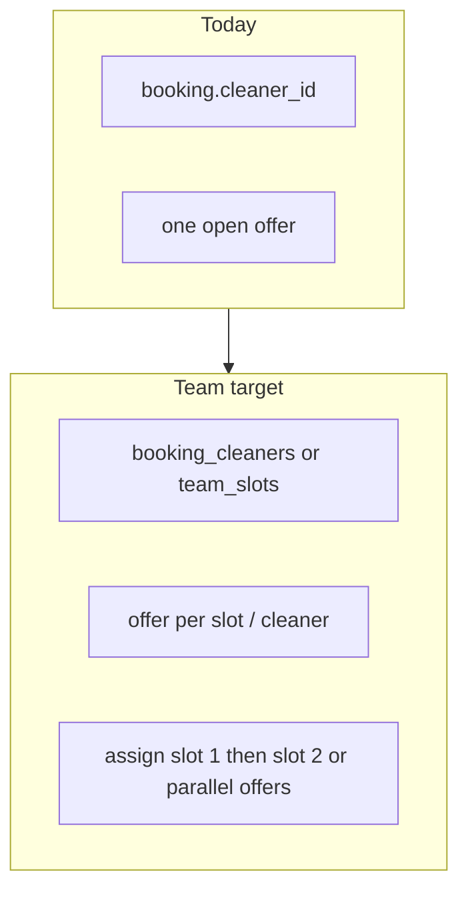
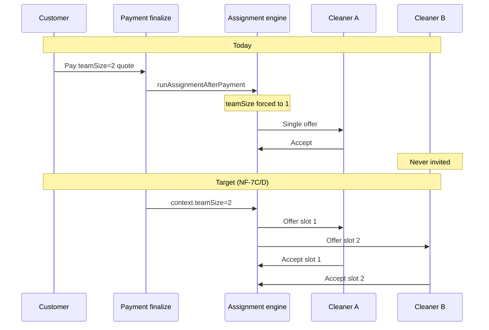

# NF-7A — Team support architecture and operational audit

**Date:** 2026-05-18  
**Scope:** Regular Cleaning (`regular-cleaning`) — request for 2 cleaners (team support)  
**Phase:** Architecture + operational planning only — **no production logic changes**  
**Related:** `docs/audits/regular-cleaning-end-to-end-system-audit.md`, `docs/audits/stage-3a-assignment-dispatch-reliability-audit.md`, `docs/earnings/earnings-and-payouts.md`, `docs/pricing/pricing-engine.md`, `docs/operations/assignment-offer-race-protection.md`

---

## Executive summary

| Question | Answer |
|----------|--------|
| Safe for MVP without architecture work? | **No** |
| Does pricing already support `teamSize`? | **Partially** — quote API accepts `teamSize` 1–10; wizard/lock hardcode `1` |
| Can assignment engine assign 2 cleaners today? | **No** — single `bookings.cleaner_id`, one open offer per booking, dispatch targets one cleaner |
| Can payouts support 2 cleaners today? | **No** — one `booking_completion` earning line per booking, paid to `booking.cleaner_id` only |
| Safest MVP product behavior? | **Request-only** (“Request 2 cleaners”) + **admin-confirmed** fulfillment; never “guaranteed” |
| Requires assignment engine redesign? | **Yes** (multi-slot dispatch, schema, offer constraints) |
| Requires payout redesign? | **Yes** (multi-line earnings, completion semantics) |
| Existing team infrastructure? | **Pricing preview only** — no roster, no `booking_cleaners`, no dual lifecycle |

**Go/no-go:** **No-go** for automated team assignment or team-aware payouts in NF-7B without foundational schema and command-layer work. **Conditional go** for NF-7B slice limited to **customer request capture + admin ops visibility + manual operational playbook** (no dual dispatch, no dual payout).

---

## 1. Current architecture findings

### 1.1 Product surface today

| Layer | Team support |
|-------|----------------|
| Booking wizard | `teamSize: 1` hardcoded in `buildMetadata.ts`, `api.ts` |
| Lock / Paystack | `teamSize: 1` in `app/api/bookings/lock/route.ts` fallback |
| Assignment context | **`teamSize` forced to `1`** when loading context — ignores quote metadata |
| Customer UI | No team-size control; copy assumes one cleaner |
| Admin UI | No team badge; single `cleaner_id` on booking |

### 1.2 Data model (single-cleaner invariant)

```155:169:supabase/migrations/20260515201500_core_foundation.sql
create table if not exists public.bookings (
  id uuid primary key default gen_random_uuid(),
  customer_id uuid not null references public.customers (id) on delete restrict,
  cleaner_id uuid references public.cleaners (id) on delete set null,
  ...
);
```

- **One** `bookings.cleaner_id` — assignment, RLS, job lists, and completion all key off this column.
- **No** `booking_cleaners`, `team_slot`, or roster tables.
- `assignment_offers` is per `(booking_id, cleaner_id)` but **at most one `offered` row per booking** (`idx_assignment_offers_one_open_per_booking`).

### 1.3 Pricing (`teamSize` — preview-only for teams)

`PricingInput.teamSize` is validated (1–10) and flows through `calculateQuote` → `computeCleanerEarningsPreview`.

| Rule | Regular cleaning | Team (`teamSize > 1`) |
|------|------------------|------------------------|
| Customer total | Bedroom/bathroom/addon/frequency math | **Unchanged** — no team surcharge in catalog |
| Cleaner preview | Percent 60–70%, clamped R250–R300/cleaner | Switches to **fixed R250/cleaner** (`team_fixed_per_cleaner`) |
| Safety | `totalCleanerPayoutCents ≤ customer total` | **Fails** on small homes (e.g. 1 bed / 1 bath → R450 total, R500 payout) |

```42:53:src/features/pricing/server/calculateQuote.test.ts
  it("rejects unsafe cleaner earnings when team payout exceeds customer total", () => {
    const result = calculateQuote({
      serviceSlug: "regular-cleaning",
      bedrooms: 1,
      bathrooms: 1,
      teamSize: 2,
    });
    expect(result.code).toBe("UNSAFE_CLEANER_EARNINGS");
  });
```

**Implication:** Enabling `teamSize: 2` on regular cleaning without a **customer price increase** breaks quoting for typical small homes and leaves economics misaligned for larger homes (customer pays for one job; platform owes two fixed payouts).

### 1.4 Assignment engine

| Component | Behavior |
|-----------|----------|
| `runAssignmentAfterPayment` | Dispatches **one** offer via `createDispatchOffer` |
| `loadAssignmentContext` | Strips `teamSize` from metadata → always `1` |
| `OFFER_TO_CLEANER` | Blocks second open offer to a different cleaner |
| `ACCEPT_CLEANER_ASSIGNMENT` | Sets single `cleaner_id`, `pending_assignment` → `assigned` |
| Redispatch | `pickBestEligibleCleanerIdExcluding` — one replacement cleaner |
| Conflict detection | `loadConflictingCleanerIds` — one cleaner per overlapping booking |

Documented explicitly in `docs/audits/stage-3a-assignment-dispatch-reliability-audit.md` §10 and `docs/operations/assignment-offer-race-protection.md` §Team assignment caveat.

### 1.5 Earnings and payouts

| Component | Behavior |
|-----------|----------|
| `computeEarningsForBooking` | Uses `teamSize` from **metadata** for preview math; returns **one** `cleanerId` = `booking.cleaner_id` |
| `recordEarningsForBooking` | Inserts **one** `booking_completion` line at `perCleanerAmountCents` |
| DB constraint | `earning_lines_booking_completion_unique` — **one completion line per booking** |
| Deferred | `docs/earnings/earnings-and-payouts.md` — “Multi-cleaner team split lines per member” |

**Critical mismatch if `teamSize: 2` is stored but only one cleaner is assigned:** metadata may record `totalCleanerPayoutCents = 50_000` while only **R25_000** is paid to the sole assigned cleaner (`payoutAmountCents = perCleanerAmountCents`). Second cleaner receives nothing; ops may believe team payout is complete.

### 1.6 Cleaner experience

| Surface | Team behavior today |
|---------|---------------------|
| Offers list | Per-cleaner offers; no “team job” grouping |
| Jobs list | `.eq("cleaner_id", actingCleanerId)` — second cleaner never sees booking |
| Start / complete | `assertCleanerIs` — only `booking.cleaner_id` |
| Earnings display | `resolveCleanerEarningsDisplay` — first earning line only; preview uses `teamSize` on offers |

### 1.7 Lifecycle and dashboards

- **Customer:** `customerBookingDetailDisplay` — “matching a cleaner” / “cleaner is confirmed” (singular); no team copy.
- **Admin:** `adminOperationsReadModel` — `hasAssignedCleaner: Boolean(cleaner_id)`; assignment visibility keys assume single dispatch.
- **Timeline:** Status machine is booking-level, not per-cleaner; no partial-team states.

---

## 2. Operational risks

| Risk | Severity | Description |
|------|----------|-------------|
| **Partial team assignment** | Critical | Customer requests 2 cleaners; one assigned; customer expects two on site |
| **Payout mismatch** | Critical | `teamSize: 2` in metadata, one earning line → underpay or ops confusion |
| **Quote failure at checkout** | High | `teamSize: 2` without surcharge on small homes → `UNSAFE_CLEANER_EARNINGS`, blocked lock |
| **False earnings preview** | High | Offer cards may show per-cleaner preview from quote `teamSize` while dispatch is single-cleaner |
| **One cleaner no-show** | High | No secondary assignee on booking; full redispatch replaces primary only |
| **Team completion mismatch** | High | One cleaner can complete for entire booking; partner has no job row |
| **Acceptance race** | Medium | Mitigated for single slot; dual-slot needs new concurrency design |
| **Offer expiry / redispatch** | Medium | Redispatch fills **one** slot; second slot needs separate attempt accounting |
| **Schedule conflict** | Medium | Two cleaners on same slot not reserved — both could be double-booked elsewhere |
| **Admin manual dispatch** | Medium | `createAdminDispatchOffer` still one open offer; cannot arm two cleaners in parallel |
| **Capacity overcommit** | Medium | No “pairs” or team roster — ops must find two eligible individuals ad hoc |

---

## 3. Product recommendation

### 3.1 Customer expectation (safe wording)

| Wording | Use? |
|---------|------|
| **1 cleaner** | Yes — default, matches current system |
| **Request 2 cleaners** | Yes — sets expectation of **ask**, not promise |
| Guaranteed 2 cleaners | **No** |
| Extra cleaner | **No** — implies add-on pricing model not yet defined |

### 3.2 Recommended MVP behavior (NF-7B)

**Mode: Request-only + admin-confirmed fulfillment**

1. Customer selects **1 cleaner** (default) or **Request 2 cleaners** on Regular Cleaning details/review.
2. Persist `teamSizeRequested: 2` (or `teamSize: 2`) in quote metadata and lock hash inputs.
3. **Do not** auto-dispatch two cleaners or change assignment engine.
4. Customer-facing assignment copy: *“We're arranging your clean. For two-cleaner requests, we'll confirm team availability before your visit.”*
5. Admin queue shows **“2-cleaner request”** badge; ops manually coordinates second cleaner off-platform or via future NF-7C dispatch.
6. Until dual payout exists: **do not** set `teamSize: 2` in earnings path for single-assigned bookings — use `teamSize: 1` for payout metadata and track request separately (e.g. `metadata.teamRequest: { requested: 2, fulfilled: 1 | 2 }`).

**Why not guaranteed / auto-assigned for MVP:** Capacity, partial assignment, payout split, and DB constraints all require engineered solutions; over-promising creates support debt.

### 3.3 Options considered

| Mode | Verdict |
|------|---------|
| Guaranteed 2 cleaners | **Reject** for MVP — capacity and legal/CS risk |
| Request-only | **Adopt** |
| Admin-confirmed | **Adopt** — ops verifies two eligible cleaners |
| Auto-assigned pair | **Defer** to NF-7C+ |
| Lead + assistant (one payout) | Possible interim ops model; **defer** productization |

---

## 4. Assignment feasibility

### 4.1 Can the current engine assign 2 cleaners safely?

**No.**

| Blocker | Detail |
|---------|--------|
| Schema | Single `bookings.cleaner_id` |
| Offer constraint | One `offered` per booking |
| Command layer | `ACCEPT_CLEANER_ASSIGNMENT` assigns one cleaner; conflict if second accepted |
| Context | `teamSize` stripped to `1` |
| Eligibility | No “pair” availability; conflicts check individuals only |

### 4.2 Is admin intervention required?

**Yes**, for any MVP that reaches the customer before NF-7C:

- Second cleaner cannot be on-booking without schema + commands.
- Admin can use **manual dispatch** for one cleaner only; second requires phone/coordination or sequential replace flow (undesirable).

### 4.3 Existing infrastructure partial support

| Capability | Status |
|------------|--------|
| `teamSize` in pricing API | Exists |
| Team payout preview rules | Exists (`team_fixed_per_cleaner` when `teamSize > 1`) |
| Team dispatch | **Not implemented** |
| Team roster / pairs | **None** |
| Dual offers | **Blocked** by index + `OPEN_OFFER_EXISTS` |

### 4.4 Target assignment architecture (for NF-7C)



**Design notes:**

- Replace or relax `idx_assignment_offers_one_open_per_booking` → e.g. `(booking_id, team_slot) WHERE status = 'offered'`.
- Extend `AssignmentContext` to pass through `teamSize` from lock metadata.
- Define partial fulfillment: `team_fulfilled_count` vs `team_requested_count`.
- Redispatch policy per slot, not per booking only.

---

## 5. Earnings / payout feasibility

### 5.1 Split models

| Model | Fit | Notes |
|-------|-----|-------|
| **Equal split** | Good default | `perCleanerAmountCents` each; two `booking_completion` lines |
| Weighted split | Defer | Needs lead weight config |
| Lead cleaner (full payout to lead) | Ops workaround only | Not fair; avoid without explicit policy |

### 5.2 Current clamps (regular + team)

- Percent path: R250–R300/cleaner (tenure-based %).
- Team path: fixed R250/cleaner × `teamSize`, must be ≤ customer total.
- **Regular cleaning has no team customer surcharge** — economic gap.

### 5.3 Required payout changes

1. **Drop or relax** `earning_lines_booking_completion_unique` → allow N lines per booking OR one line per `(booking_id, cleaner_id)`.
2. **`recordEarningsForBooking`** → loop assigned cleaners or create lines on each completion.
3. **`computeEarningsForBooking`** → accept `cleanerId` parameter; return per-cleaner amount.
4. **Guard:** never persist `teamSize > 1` total on a single line to one cleaner.
5. Admin payout UI: show **two rows** for team jobs.

### 5.4 Feasibility verdict

| Question | Answer |
|----------|--------|
| Safe with current ledger? | **No** |
| Requires payout redesign? | **Yes** — documented as deferred in Phase 10 |
| New line semantics? | **Yes** — e.g. `booking_completion` per cleaner, or `team_completion` with unique `(booking_id, cleaner_id)` |

---

## 6. Pricing strategy audit

### 6.1 Options evaluated

| Strategy | Customer clarity | Ops sustainability | MVP fit |
|----------|------------------|--------------------|---------|
| Flat surcharge (e.g. +R200) | High | Medium — must cover 2× min payout | **Good** |
| Per-cleaner surcharge (e.g. +R250/cleaner) | High | High — aligns with fixed payout | **Good** |
| Duration reduction only | Low | Poor — no price signal | **Reject** |
| Dynamic pricing | Low | Complex | **Defer** |
| No surcharge (status quo) | N/A | **Fails** UNSAFE_CLEANER_EARNINGS / margin | **Reject** |

### 6.2 Recommendation

**MVP pricing (NF-7B):**

- Add explicit line item when **Request 2 cleaners** selected, e.g. `team_surcharge` **+R250–R350** (finance to calibrate) **or** second base-equivalent charge — must ensure `totalCents ≥ teamSize × FIXED_CLEANER_PAYOUT_CENTS` with margin.
- Rule of thumb: minimum customer total for 2 cleaners ≥ **R500** (2 × R250) **+ platform margin** → typical 2 bed / 2 bath (R590) is barely viable; surcharge required for most SKUs.

**Operationally sustainable:**

- Per-cleaner surcharge tied to `FIXED_CLEANER_PAYOUT_CENTS` (index-linked).
- Optional: reduce `WIZARD_JOB_DURATION_MINUTES` display note only — do not reduce price without ops sign-off.

**Customer-understandable:**

- Review step: *“Request 2 cleaners (+R X)”* and *“Subject to availability — we'll confirm before your clean.”*

---

## 7. Lifecycle / dashboard implications

| Surface | Change needed |
|---------|---------------|
| **Customer** | Team request badge; assignment copy for `pending_assignment` / `assigned`; avoid “your cleaner” when `teamRequested === 2` and only one assigned |
| **Cleaner** | “Team job” label; show partner name when second assigned; restrict complete to assigned members only |
| **Admin** | `teamRequested`, `teamAssignedCount`, dual cleaner links, dual dispatch actions, earnings preview **per cleaner** |
| **Timeline** | Optional events: `TEAM_REQUESTED`, `SECOND_CLEANER_ASSIGNED`, `TEAM_DEGRADED_TO_ONE` |
| **Failure states** | `attention_required` + reason: `team_partially_fulfilled`, `team_unavailable` |

---

## 8. Recommended MVP scope (NF-7B)

**In scope:**

- Wizard + metadata: `teamSize` / `teamRequested` (1 vs 2) for `regular-cleaning` only.
- Pricing: team surcharge line item + updated `hashLockInputs` / lock validation.
- Customer + admin copy (request-only).
- Admin ops badge and filter (read-model only).
- Feature flag / kill switch.

**Out of scope (NF-7B):**

- Automated dual dispatch.
- Second `cleaner_id` on booking.
- Dual earning lines / payout.
- Cleaner app team UX.
- Guaranteed availability SLA.

---

## 9. Recommended staged rollout

| Phase | Scope | Depends on |
|-------|--------|------------|
| **NF-7A** | This audit | — |
| **NF-7B** | Request-only UI + surcharge pricing + metadata + admin visibility + ops runbook | Pricing constants |
| **NF-7C** | Schema (`booking_cleaners` or slots) + dual dispatch offers + accept per slot + relax one-open-offer index | Migration, command layer |
| **NF-7D** | Dual cleaner jobs (RLS), lifecycle (start/complete per member or team complete rule), multi-line earnings, payout admin | NF-7C |
| **NF-7E** (optional) | Auto-pair dispatch, roster, capacity planning metrics | Ops data |

---

## 10. Go / no-go verdict

| Criterion | Verdict |
|-----------|---------|
| **Safe for MVP (full team feature)?** | **No-go** |
| **Requires architecture work first?** | **Yes** — booking–cleaner cardinality, offers, assignment context |
| **Requires payout redesign?** | **Yes** — unique completion index, `recordEarningsForBooking` |
| **Requires assignment engine redesign?** | **Yes** — multi-slot dispatch, redispatch, conflict model |
| **Safe for NF-7B (request + pricing + ops visibility only)?** | **Conditional go** — with explicit “no dual assign/payout” guardrails |

**Bottom line:** Ship **customer request + pricing + honest copy + admin visibility** in NF-7B. Do **not** enable `teamSize: 2` in assignment or earnings paths until NF-7C/D. Treat deep-cleaning’s existing `teamSize` preview as **pricing-lab only**, not production team fulfillment.

---

## 11. Files and modules reviewed

### Pricing and quote

- `src/features/pricing/server/types.ts`
- `src/features/pricing/server/catalog.ts`
- `src/features/pricing/server/calculateQuote.ts`
- `src/features/pricing/server/computeCleanerEarnings.ts`
- `src/features/pricing/server/validateInput.ts`
- `src/features/pricing/server/calculateQuote.test.ts`
- `src/features/pricing/server/parseQuoteRequest.ts`
- `src/features/pricing/server/metadata.ts`
- `docs/pricing/pricing-engine.md`

### Booking wizard and lock

- `src/features/booking-wizard/buildMetadata.ts`
- `src/features/booking-wizard/api.ts`
- `src/features/booking-wizard/constants.ts`
- `src/features/bookings/server/lock/hashLockInputs.ts`
- `src/features/bookings/server/lock/createBookingPaymentLock.ts`
- `src/features/bookings/server/lock/parseRetryLockFromBooking.ts`
- `src/app/api/bookings/lock/route.ts`

### Assignment

- `src/features/assignments/server/assignmentContext.ts`
- `src/features/assignments/server/runAssignmentAfterPayment.ts`
- `src/features/assignments/server/createDispatchOffer.ts`
- `src/features/assignments/server/createAdminDispatchOffer.ts`
- `src/features/assignments/server/eligibilityForAssignment.ts`
- `src/features/assignments/server/processBookingAfterOfferEnded.ts`
- `src/features/assignments/server/resolveAssignmentVisibility.ts`
- `src/features/bookings/server/commands/executeBookingCommand.ts`
- `supabase/migrations/20260516200000_assignment_offer_integrity.sql`
- `supabase/migrations/20260517300000_assignment_offer_one_open_per_booking.sql`
- `docs/audits/stage-3a-assignment-dispatch-reliability-audit.md`
- `docs/operations/assignment-offer-race-protection.md`

### Earnings and completion

- `src/features/earnings/server/computeEarningsForBooking.ts`
- `src/features/earnings/server/recordEarningsForBooking.ts`
- `src/features/earnings/server/completionActions.ts`
- `supabase/migrations/20260516210000_phase10_earnings_payouts.sql`
- `docs/earnings/earnings-and-payouts.md`

### Dashboards and display

- `src/features/dashboards/server/cleanerJobReadModel.ts`
- `src/features/dashboards/server/resolveCleanerEarningsDisplay.ts`
- `src/features/dashboards/server/customerBookingReadModel.ts`
- `src/features/dashboards/customerBookingDetailDisplay.ts`
- `src/features/dashboards/server/adminOperationsReadModel.ts`
- `src/features/cleaners/server/repository.ts`

### Database foundation

- `supabase/migrations/20260515201500_core_foundation.sql`
- `supabase/migrations/20260516180000_cleaner_availability_eligibility.sql`

### Related audits

- `docs/audits/regular-cleaning-end-to-end-system-audit.md`
- `docs/architecture/stage-4b-3-manual-cleaner-dispatch-design.md`
- `docs/architecture/stage-3c-offer-race-global-duplicate-protection-design.md`

---

## Appendix A — Assignment flow (today vs team target)



## Appendix B — Minimum viable customer total (regular, teamSize 2)

| Bedrooms / baths | Once total (cents) | 2 × R250 payout | Quote with teamSize 2 |
|------------------|-------------------|-----------------|------------------------|
| 1 / 1 | 45_000 | 50_000 | **Fails** UNSAFE_CLEANER_EARNINGS |
| 2 / 2 | 59_000 | 50_000 | Passes (thin margin, no surcharge) |
| 3 / 2 | 67_000 | 50_000 | Passes |

**Conclusion:** Team pricing surcharge is required for most real-world regular-cleaning SKUs, not only small homes.
