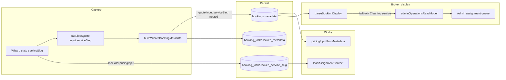

# Service type propagation audit

**Date:** 2026-05-16  
**Scope:** Why admin assignment queue shows every booking as “Cleaning service” instead of the selected service type.  
**Status:** Audit only — no fixes applied.

---

## Executive summary

Service type is **not lost** during the wizard, pricing, lock, or booking draft creation. All six catalog slugs are preserved in:

- `bookings.metadata.quote.input.serviceSlug` (nested)
- `booking_locks.locked_service_slug` (column)

The admin assignment queue shows **“Cleaning service”** because `parseBookingDisplay()` only reads **top-level** `metadata.serviceSlug` / `metadata.service_slug`. Wizard metadata stores the slug under **`metadata.quote.input.serviceSlug`** instead. With no top-level slug, the display helper falls back to the hard-coded string `"Cleaning service"`.

| Question | Answer |
|----------|--------|
| Is service type lost in the wizard? | **No** — `serviceSlug` in wizard state and lock payload |
| Is it stored in the DB? | **Yes** — nested in `bookings.metadata`; also `booking_locks.locked_service_slug` |
| Is `bookings.service_id` used? | **No** — always `null` on recent rows; app is slug/metadata-first |
| Why “Cleaning service”? | **Display fallback** in `parseBookingDisplay.ts` line 38 |
| Do all 6 types survive checkout? | **Yes** — confirmed in DB for regular, deep, moving, airbnb (and locks match) |
| Is assignment logic affected? | **No** — `loadAssignmentContext()` reads lock slug + nested quote correctly |

**Classification:** **A** — Service type is correctly stored; dashboard display / read-model parsing is wrong.  
(Secondary note: **B** — slug exists on `booking_locks` but assignment queue read model does not join locks for labels; fixing `parseBookingDisplay` alone is sufficient because nested slug is already on `bookings.metadata`.)

---

## Issue classification

**Primary: A — Correctly stored; dashboard display fallback is wrong**

Supporting evidence:

- Production SQL: `metadata->>'serviceSlug'` is **null**; `metadata->'quote'->'input'->>'serviceSlug'` is populated (`deep-cleaning`, `regular-cleaning`, etc.).
- `parseBookingDisplay` never reads `quote.input.serviceSlug`.
- Fallback when `serviceSlug` is null: `serviceSlug ?? "Cleaning service"` → always **“Cleaning service”** for wizard-created bookings.

**Not D** — Creation path writes nested quote metadata intentionally via `buildBookingQuoteMetadata()`.

**Not E** — Code-first `SERVICE_CATALOG` slugs align with wizard options and lock slugs; DB `services.description` stores slug-like values on seeded rows but bookings do not use `service_id`.

**Partial C** — `bookings.service_id` is unused; denormalizing a top-level `serviceSlug` on metadata would also work but is not required if the display parser reads nested quote input.

---

## Current service type flow map



---

## 1. Booking wizard

### Service selection & state

| Item | Location | Status |
|------|----------|--------|
| Step 1 service pick | `BookingWizard.tsx` | Sets `state.serviceSlug` from `WIZARD_SERVICE_OPTIONS` |
| All 6 slugs | `constants.ts` → `SERVICE_CATALOG` | regular, deep, moving, airbnb, office, carpet |
| Persistence across steps | `storage.ts` `PERSIST_KEYS` includes `serviceSlug` | Survives refresh through step 7 |
| Display name in wizard | `SERVICE_CATALOG[slug].label` | e.g. “Deep Cleaning” on review step |

### Payloads

| Payload | `serviceSlug` present? | Notes |
|---------|------------------------|-------|
| Quote request (`api.ts`) | Yes | `wizardStateToPricingInput(state)` |
| Lock body (`lockPayload.ts`) | Yes | Top-level `serviceSlug` + `bookingMetadata` |
| `bookingMetadata` (`buildMetadata.ts`) | **Nested only** | `buildBookingQuoteMetadata` → `quote.input.serviceSlug` |
| Checkout (`checkout.ts`) | Indirect | Uses lock result; no separate service field |

**Conclusion:** `serviceSlug` is captured and survives all wizard steps. Display name is derivable from `SERVICE_CATALOG` at any time. It is **not** duplicated at the top level of `bookingMetadata`.

---

## 2. Pricing engine

| Item | Location | Status |
|------|----------|--------|
| Catalog labels (6 services) | `catalog.ts` `SERVICE_CATALOG` | All labels match expected names |
| `calculateQuote()` output | `PricingBreakdown.serviceSlug` | Set on breakdown |
| `buildBookingQuoteMetadata()` | `metadata.ts` | Stores `quote.input.serviceSlug` only (nested) |

```7:31:src/features/pricing/server/metadata.ts
export function buildBookingQuoteMetadata(
  input: PricingInput,
  breakdown: PricingBreakdown,
): Record<string, unknown> {
  return {
    pricingVersion: breakdown.pricingVersion,
    quote: {
      input: {
        serviceSlug: input.serviceSlug,
        // ...
      },
      breakdown: { /* lineItems, totals */ },
      cleanerEarningsPreview: breakdown.cleanerEarnings,
    },
  };
}
```

**Conclusion:** Quote metadata includes service information in the **canonical nested** shape. No top-level `serviceSlug` is added by design.

---

## 3. Booking lock

| Field | Written? | Source |
|-------|----------|--------|
| `locked_service_slug` | Yes | `params.input.pricingInput.serviceSlug` (`lockRepository.ts`) |
| `locked_metadata` | Yes | Full `input.bookingMetadata` (includes nested `quote.input.serviceSlug`) |
| Generic “Cleaning service” | **No** | Not written anywhere in lock path |

`createBookingPaymentLock()` passes `metadata: { ...input.bookingMetadata, paymentLock: {...} }` into `CREATE_BOOKING_DRAFT` — same nested structure as wizard metadata.

**DB sample (recent locks):**

| `locked_service_slug` | `locked_metadata.quote.input.serviceSlug` |
|-----------------------|-------------------------------------------|
| deep-cleaning | deep-cleaning |
| regular-cleaning | regular-cleaning |
| airbnb-cleaning | airbnb-cleaning |
| moving-cleaning | moving-cleaning |

**Conclusion:** Lock layer preserves service type correctly in both column and metadata snapshot.

---

## 4. Booking creation / command layer

### Schema

- `bookings.service_id` — optional FK to `services`; **not set** by wizard flow (`serviceId` omitted on `CREATE_BOOKING_DRAFT`).
- `bookings.metadata` — jsonb; holds wizard + quote snapshot.

### Commands

| Command | Service fields |
|---------|----------------|
| `CREATE_BOOKING_DRAFT` | `metadata` spread from lock; `service_id: cmd.serviceId ?? null` → **null** |
| `MARK_PAYMENT_PENDING` | Does not alter booking metadata for service |
| `FINALIZE_PAYMENT_SUCCESS` | Paystack metadata only; does not strip quote |

**Conclusion:** Service identity lives in **metadata JSON**, not `service_id`. Draft insert does **not** hardcode “Cleaning service”; it never sets a display label in metadata.

---

## 5. Paystack initialize / finalization

| Step | Service impact |
|------|----------------|
| `initializePayment()` | Uses lock + booking id; no metadata rewrite |
| `finalizePaidBooking()` | `FINALIZE_PAYMENT_SUCCESS` + assignment run |
| `upsertBookingFromPaystack()` | Delegates to finalize |
| `runAssignmentAfterPayment()` | `loadAssignmentContext()` uses **lock** slug + `pricingInputFromMetadata` |

Payment path does **not** remove `quote.input.serviceSlug` from `bookings.metadata`.

**Caveat:** Older `confirmed` bookings without locks and without `quote` in metadata cannot be labeled from DB (see SQL below). Wizard/checkout bookings in `pending_assignment` have full quote metadata.

---

## 6. Dashboard read models & UI

### Where “Cleaning service” comes from

```35:38:src/features/dashboards/server/parseBookingDisplay.ts
  const serviceLabel =
    serviceSlug && isServiceSlug(serviceSlug)
      ? SERVICE_CATALOG[serviceSlug].label
      : serviceSlug ?? "Cleaning service";
```

`serviceSlug` is resolved only from **top-level** metadata:

```28:33:src/features/dashboards/server/parseBookingDisplay.ts
  const serviceSlug =
    typeof record.serviceSlug === "string"
      ? record.serviceSlug
      : typeof record.service_slug === "string"
        ? record.service_slug
        : null;
```

It does **not** read `record.quote.input.serviceSlug` (unlike `assignmentContext.pricingInputFromMetadata`).

### Admin assignment queue

- `listAdminAssignmentQueue()` → `parseBookingDisplay(row.metadata)` → `serviceLabel`
- `admin/assignments/page.tsx` renders `{item.serviceLabel}`

Same pattern in:

- `listAdminBookings` / admin booking detail
- `customerBookingReadModel`
- `cleanerJobReadModel`
- `payoutReadModel`

### Read models & `services` table

- **No join** to `public.services` for display names.
- **No join** to `booking_locks` in dashboard read models.
- Labels are intended to come from `SERVICE_CATALOG` via slug in metadata.

### Tests vs production

`dashboardReadModels.test.ts` mocks metadata with **top-level** `serviceSlug: "regular-cleaning"`, which masks the production bug.

---

## 7. Database inspection

Project: `jdmumbvednevkrctkiwd` (2026-05-16).

### Recent bookings — slug location

```sql
select id, status, service_id,
       metadata->>'serviceSlug' as top_level_slug,
       metadata->'quote'->'input'->>'serviceSlug' as quote_input_slug,
       price_cents
from public.bookings
order by created_at desc
limit 10;
```

| Pattern | Observation |
|---------|-------------|
| `top_level_slug` | **null** on all wizard/checkout rows |
| `quote_input_slug` | **set** — e.g. `deep-cleaning`, `regular-cleaning`, `airbnb-cleaning`, `moving-cleaning` |
| `service_id` | **null** |

### Assignment queue candidates

```sql
select b.id, b.status,
       b.metadata->'quote'->'input'->>'serviceSlug' as slug,
       bl.locked_service_slug
from public.bookings b
left join public.booking_locks bl on bl.booking_id = b.id
where b.status in ('pending_assignment', 'confirmed')
order by b.updated_at desc
limit 15;
```

- `pending_assignment` rows: slug and `locked_service_slug` **match** (e.g. both `deep-cleaning`).
- Many older `confirmed` rows: **no lock**, **no quote** in metadata → display cannot infer service (would still fall back).

### Booking locks

```sql
select booking_id, locked_service_slug,
       locked_metadata->'quote'->'input'->>'serviceSlug' as meta_quote_slug
from public.booking_locks
order by locked_at desc
limit 10;
```

`locked_service_slug` always matches nested quote slug on recent rows.

### Services catalog (DB)

```sql
select id, name, description from public.services order by name;
```

Six rows exist (Regular, Deep, Moving, Airbnb, Office, Carpet). `description` holds slug-like values on current DB; **bookings do not reference these ids**.

### Recommended ongoing checks

```sql
-- Bookings missing any derivable slug
select id, status,
       metadata->>'serviceSlug' as top,
       metadata->'quote'->'input'->>'serviceSlug' as nested
from public.bookings
where status in ('pending_assignment', 'pending_payment', 'confirmed')
  and coalesce(
        metadata->>'serviceSlug',
        metadata->'quote'->'input'->>'serviceSlug'
      ) is null;

-- Queue rows with lock slug vs metadata
select b.id, bl.locked_service_slug,
       b.metadata->'quote'->'input'->>'serviceSlug' as meta_slug
from public.bookings b
join public.booking_locks bl on bl.booking_id = b.id
where b.status = 'pending_assignment';
```

---

## 8. Root cause (exact)

**Every admin queue item shows “Cleaning service” because:**

1. `listAdminAssignmentQueue` labels bookings via `parseBookingDisplay(bookings.metadata)`.
2. Wizard-created metadata stores `serviceSlug` only at `metadata.quote.input.serviceSlug`.
3. `parseBookingDisplay` looks for top-level `serviceSlug` / `service_slug`, finds **null**.
4. Fallback expression `serviceSlug ?? "Cleaning service"` yields the constant string **“Cleaning service”** for every booking.

This is **display-only**. Assignment eligibility uses `loadAssignmentContext()` which correctly reads lock column + nested quote.

---

## 9. Affected files

| File | Role |
|------|------|
| `src/features/dashboards/server/parseBookingDisplay.ts` | **Root cause** — slug resolution + fallback |
| `src/features/dashboards/server/adminOperationsReadModel.ts` | Assignment queue + admin lists |
| `src/features/dashboards/server/customerBookingReadModel.ts` | Customer booking lists/detail |
| `src/features/dashboards/server/cleanerJobReadModel.ts` | Cleaner jobs |
| `src/features/earnings/server/payoutReadModel.ts` | Payout lines |
| `src/app/(admin)/admin/assignments/page.tsx` | Renders `serviceLabel` |
| `src/features/pricing/server/metadata.ts` | Canonical nested storage (working as designed) |
| `src/features/booking-wizard/buildMetadata.ts` | Composes wizard metadata |
| `src/features/assignments/server/assignmentContext.ts` | **Correct** nested slug reader (reference impl) |

**Not broken:** wizard, lock, pricing, payment, assignment engine.

---

## 10. Safest minimal fix strategy

**Recommended (no migration):**

1. Update `parseBookingDisplay()` to resolve slug in order:
   - `metadata.serviceSlug` / `metadata.service_slug` (existing)
   - `metadata.quote.input.serviceSlug` (wizard/checkout bookings)
   - Optional: accept `metadata.quote.input.service_slug`
2. Keep label resolution via `SERVICE_CATALOG[slug].label`.
3. Change fallback from `"Cleaning service"` to something neutral only if slug is unknown (e.g. `"Unknown service"`) or omit fallback when slug is missing entirely.

**Optional hardening (still no migration):**

- Add top-level `serviceSlug` in `buildWizardBookingMetadata()` for easier querying — redundant but aids SQL/ad-hoc reports. Not required if parser is fixed.

**Not recommended for this bug:**

- RLS / lifecycle / assignment changes
- Pricing rule changes
- Populating `bookings.service_id` unless product wants FK-based reporting (larger scope)

**Migration needed?** **No** for display fix. Existing rows already contain nested slugs.

---

## 11. Tests needed (when implementing fix)

| Test | Purpose |
|------|---------|
| `parseBookingDisplay.test.ts` | Nested `quote.input.serviceSlug` → correct label for all 6 slugs |
| | Top-level `serviceSlug` still works (backward compat) |
| | Missing slug → fallback behavior (explicit expectation) |
| | Invalid slug string → fallback, not catalog throw |
| Update `dashboardReadModels.test.ts` | Use **nested** metadata shape matching production |
| Optional integration | Admin assignment queue item `serviceLabel` for seeded booking |

---

## 12. Service type preservation matrix

| Stage | Preserved? | Storage key |
|-------|------------|-------------|
| Wizard state | Yes | `serviceSlug` |
| Quote API | Yes | `PricingInput.serviceSlug` |
| Lock API body | Yes | `serviceSlug` + `pricingInput` |
| `booking_locks` | Yes | `locked_service_slug` |
| `bookings.metadata` | Yes | `quote.input.serviceSlug` |
| Payment / finalize | Yes | Unchanged |
| Assignment | Yes | Lock + `pricingInputFromMetadata` |
| Admin/customer/cleaner UI | **No** | Parser gap → “Cleaning service” |

All **six** customer service types are represented in catalog and observed in recent DB rows (regular, deep, moving, airbnb confirmed in SQL; office/carpet available in catalog and wizard, same code path).

---

## References

- Wizard: `src/features/booking-wizard/`
- Pricing metadata: `src/features/pricing/server/metadata.ts`, `catalog.ts`
- Lock: `src/features/bookings/server/lock/`
- Commands: `src/features/bookings/server/commands/executeBookingCommand.ts`
- Assignment context: `src/features/assignments/server/assignmentContext.ts`
- Display: `src/features/dashboards/server/parseBookingDisplay.ts`
- Prior related audit: `docs/audits/e2e-admin-login-profile-audit.md` (unrelated auth issue)
