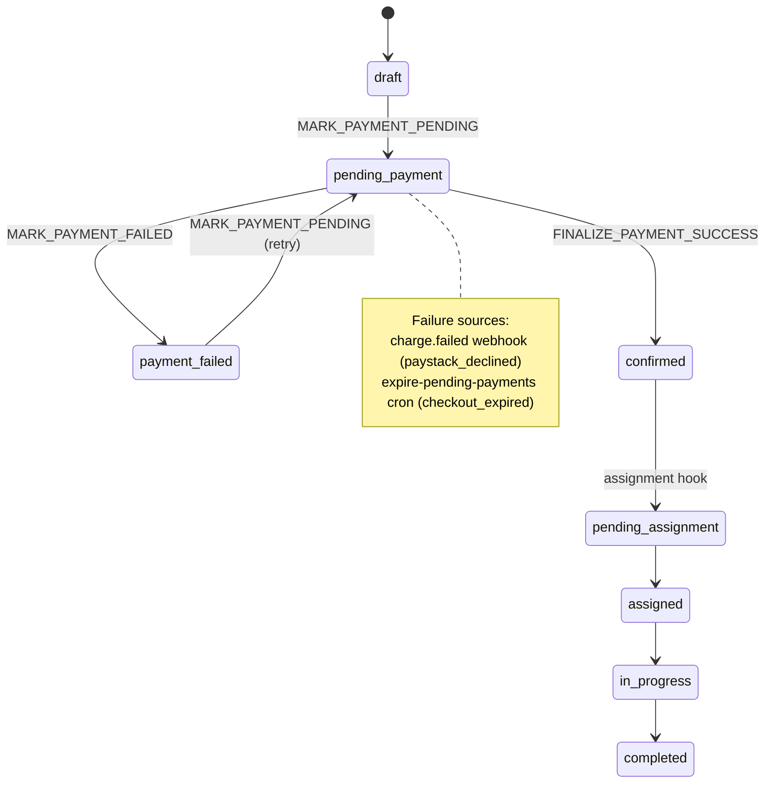
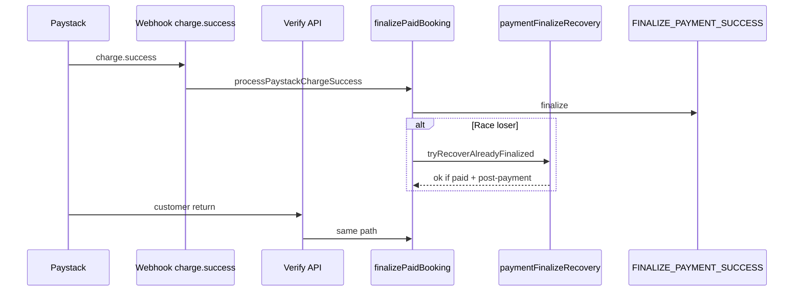
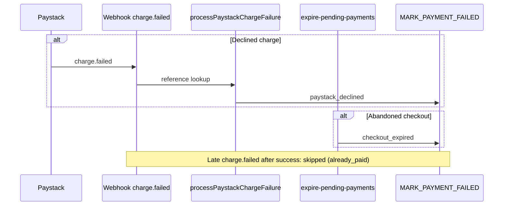

# Stage 2 — Final payment edge & failure handling audit

**Date:** 2026-05-17  
**Type:** Audit only — no implementation changes in this pass  
**Baseline:** [Stage 2A audit](./stage-2a-payment-edge-safety-audit.md), [Stage 2B audit](./stage-2b-payment-edge-final-audit.md)  
**Scope:** Full Stage 2 — success path hardening (2B-1), abandonment expiry (2B-2a), failure UX (2B-2b), same-booking retry (2B-2c), Paystack `charge.failed` (2B-3a)

---

## Executive summary

Stage 2 stabilizes the Paystack payment edge: **idempotent success** (webhook + verify), **two failure paths** (real-time decline webhook + abandoned-checkout cron), **customer/admin visibility**, and **same-booking retry** — without changing assignment logic, earnings, RLS, booking status enum, or `booking_finalize_payment_success` RPC.

| Sub-stage | Deliverable | Status |
|-----------|-------------|--------|
| 2B-1 | Webhook/verify race recovery | **Complete** |
| 2B-2a | Expire stale `pending_payment` cron | **Complete** |
| 2B-2b | `payment_failed` customer/admin UX | **Complete** |
| 2B-2c | Same-booking Paystack retry | **Complete** |
| 2B-3a | `charge.failed` → `MARK_PAYMENT_FAILED` | **Complete** |

**Final verdict:** **Stage 2 is complete and safe enough to move to the next engineering phase (Stage 3)**, provided production ops completes the rollout checklist below (cron secret, scheduled expiry job, Paystack webhook events, `BOOKING_LOCK_REQUIRED=true`, migrations applied). Payment success behavior remains command-layer finalization with existing guards.

---

## Stage 2 summary

### What was broken (Stage 2A)

- Concurrent webhook + verify could surface false errors on `/payment/success`.
- Abandoned checkouts stuck in `pending_payment` indefinitely.
- `MARK_PAYMENT_FAILED` existed but had no production callers.
- Customers had no same-booking retry; only “start new booking.”
- Paystack declines were invisible until manual ops.

### What Stage 2 delivers

1. **Success authority unchanged in shape:** `charge.success` / verify → `processPaystackChargeSuccess` → `finalizePaidBooking` → `FINALIZE_PAYMENT_SUCCESS`.
2. **Race recovery:** `tryRecoverAlreadyFinalizedPayment` when finalize command fails but booking is already post-payment.
3. **Abandonment:** Cron → `MARK_PAYMENT_FAILED` with `failure_reason: checkout_expired`.
4. **Decline:** Webhook `charge.failed` → `MARK_PAYMENT_FAILED` with `failure_reason: paystack_declined`.
5. **Recovery UX:** `PaymentIssuePanel`, retry-lock + initialize on same `bookingId`.
6. **Guards:** Paid/post-payment bookings cannot be failed or retried; wrong customer cannot verify; amount mismatch still rejects finalize.

---

## Verification checklist (15 items)

| # | Requirement | Status | Evidence |
|---|-------------|--------|----------|
| 1 | `charge.success` still finalizes as before | **Pass** | `handlePaystackWebhook.ts` L77–113: same `mapPaystackWebhookChargeSuccess` → `processPaystackChargeSuccess`; `finalizePaidBooking.ts` unchanged contract; `paystackFoundation.test.ts` webhook success → `confirmed` |
| 2 | Webhook/verify race → idempotent success | **Pass** | `paymentFinalizeRecovery.ts`, `finalizePaidBookingWithDeps`; tests: `paymentFinalizeRecovery.test.ts` (webhook-first/verify-first), `verifyPayment.test.ts` `recoveredFromAlreadyFinalized`, `PaymentSuccessVerifier.test.ts` |
| 3 | `charge.failed` → `payment_failed` | **Pass** | `processPaystackChargeFailure.ts` → `MARK_PAYMENT_FAILED`; `processPaystackChargeFailure.test.ts`, webhook integration test |
| 4 | Duplicate `charge.failed` idempotent | **Pass** | `paystack:failed:{txnId}` command key + `paystack:txn:{id}` event dedup; duplicate test |
| 5 | `charge.failed` after success no downgrade | **Pass** | Pre-guards `isPaidPaymentStatus` / `isPostPaymentBookingStatus`; `failed-after-success` test |
| 6 | Abandoned checkout cron expires stale `pending_payment` | **Pass** | `expirePendingPayments.ts` → `MARK_PAYMENT_FAILED` (`checkout_expired`); `expirePendingPayments.test.ts`, cron route tests |
| 7 | Failure UX: `checkout_expired` + `paystack_declined` | **Pass** (partial UX) | `checkout_expired`: distinct labels/copy (`paymentFailureDisplay.test.ts`, `dashboardReadModels.test.ts`). `paystack_declined`: stored in audit, resolves via `resolvePaymentFailureReason`, shows **generic** “Payment failed” / panel copy (no separate customer strings yet) |
| 8 | Same-booking retry for eligible `payment_failed` | **Pass** | `createPaymentRetryLock.ts`, `retryPaymentFlow.test.ts`, `payment-retry-lock/route.test.ts`, `paymentRetryEligibility.test.ts` |
| 9 | Wrong customer/reference fails | **Pass** | `verifyPayment.test.ts` → `FORBIDDEN`; `paystackFoundation.test.ts` amount/reference paths |
| 10 | Amount mismatch still fails | **Pass** | `finalizePaidBooking` `AMOUNT_MISMATCH`; `paystackFoundation.test.ts`, recovery test excludes mismatch from recovery |
| 11 | Paid/confirmed/assigned cannot retry or fail | **Pass** | Failure: `processPaystackChargeFailure` skip `already_paid`; Retry: `assessPaymentRetryEligibility`, `createPaymentRetryLock` rejects confirmed/paid |
| 12 | Cron route `CRON_SECRET` protected | **Pass** | `verifyCronSecret.ts`, `expire-pending-payments/route.ts` 401; `route.test.ts`, `verifyCronSecret.test.ts` |
| 13 | Webhook signature verification | **Pass** | First step in `handlePaystackWebhook`; `paystackSignature.test.ts` |
| 14 | No assignment/earnings/RLS/enum/finalize RPC changes | **Pass** | `runAssignmentAfterPayment` only in `finalizePaidBooking.ts` (pre-Stage-2 pattern); no new RLS migrations in Stage 2 commits; `booking_finalize_payment_success` in `20260515203000` only; enum still includes `payment_failed` only |
| 15 | Ops docs: cron + `charge.failed` | **Pass** | `docs/operations/expire-pending-payments-cron.md`, `paystack-failed-charge-webhook.md`, `payment-failed-customer-retry.md` |

---

## Before vs after

### Payment success

| Scenario | Before Stage 2 | After Stage 2 |
|----------|------------------|---------------|
| Webhook then verify | Risk: error on success page | Idempotent success / `recoveredFromAlreadyFinalized` |
| Duplicate `charge.success` | Partially idempotent | Explicit `payment_events` + audit idempotency |
| Finalize path | `finalizePaidBooking` + assignment hook | **Same** (assignment failure still non-blocking) |

### Payment failure

| Scenario | Before Stage 2 | After Stage 2 |
|----------|------------------|---------------|
| Card declined at Paystack | Stuck `pending_payment` until cron | `charge.failed` webhook → immediate `payment_failed` (if Paystack delivers event) |
| Abandoned checkout | Stuck indefinitely | Cron → `payment_failed` (`checkout_expired`) |
| Customer sees failure | Unclear / “upcoming” leakage | Badges, detail panel, retry CTA |
| Recovery | New booking only | Same-booking retry when eligible |

---

## Payment lifecycle map (success + failure)

### Success authority (unchanged architecture)

### Failure lifecycle map

---

## Customer UX

| Surface | Behavior |
|---------|----------|
| List / home | `payment_failed` not treated as upcoming job; badge “Checkout expired” or “Payment failed” |
| Detail (`payment_failed`) | Red **Payment not completed** panel; reason-specific body for `checkout_expired`; generic body for `paystack_declined` and unknown |
| Retry | **Retry payment** when `canRetryPayment` (eligibility server-side); always **Start a new booking** |
| Success page | “Payment already confirmed” when verify recovers finalized state |

**Retry eligibility:** `payment_failed`, customer owner, `BOOKING_LOCK_REQUIRED=true`, no paid payment, valid quote metadata, future schedule, price matches live quote.

---

## Admin UX

| Surface | Behavior |
|---------|----------|
| List | Status + attention badge (“Checkout expired” / “Payment failed”) |
| Detail | Banner for incomplete payment; `paymentFailureReason` from latest `MARK_PAYMENT_FAILED` audit |
| Actions | Read-only — no force-expire or status override in Stage 2 |

---

## Ops requirements

| Requirement | Purpose |
|-------------|---------|
| `PAYSTACK_SECRET_KEY` / `PAYSTACK_WEBHOOK_SECRET` | API + webhook HMAC |
| `PAYSTACK_ENABLED=true` | Production checkout |
| `SUPABASE_SERVICE_ROLE_KEY` | Command persistence |
| `CRON_SECRET` | Protect expiry cron route |
| `BOOKING_LOCK_REQUIRED=true` | Production retry + lock authority |
| `APP_BASE_URL` | Paystack callback URL |
| Migrations applied | Including `20260517210000_booking_lock_retry_active_unique.sql` |

---

## Paystack dashboard setup checklist

- [ ] Webhook URL: `https://<production-domain>/api/paystack/webhook`
- [ ] Events subscribed: **`charge.success`** and **`charge.failed`**
- [ ] Webhook secret matches `PAYSTACK_WEBHOOK_SECRET` (or `PAYSTACK_SECRET_KEY`)
- [ ] Live vs test keys correct per environment
- [ ] Callback / redirect URL allowed for `/payment/success`
- [ ] Smoke: one **success** and one **decline** test transaction; confirm webhook log shows 200
- [ ] Document: `charge.failed` delivery is best-effort — keep expiry cron enabled

See [paystack-failed-charge-webhook.md](../operations/paystack-failed-charge-webhook.md) and [paystack-foundation.md](../payments/paystack-foundation.md).

---

## Vercel / scheduler cron setup checklist

The repo does **not** ship `vercel.json` cron config; scheduling is **ops-configured** (same pattern as assignment offer expiry).

- [ ] Set `CRON_SECRET` in Vercel production (strong random value)
- [ ] Schedule HTTP call to `/api/cron/expire-pending-payments` every **5–15 minutes**
  - **Option A:** Vercel Cron Jobs → `GET` or `POST` with `Authorization: Bearer $CRON_SECRET`
  - **Option B:** Supabase `pg_cron` + `pg_net` (see [expire-pending-payments-cron.md](../operations/expire-pending-payments-cron.md))
- [ ] Optional: `PENDING_PAYMENT_EXPIRY_GRACE_MINUTES`, `PENDING_PAYMENT_EXPIRE_BATCH_SIZE`
- [ ] Verify manual curl returns `{ ok: true, expired, skipped, errors }`
- [ ] Monitor: `expired` count, stuck `pending_payment` age > 1h

---

## Test evidence (2026-05-17)

| Command | Result |
|---------|--------|
| `npm run typecheck` | **Pass** |
| Stage 2 targeted vitest (16 files, 103 tests) | **Pass** |
| `src/tests/security/rls-policies.integration.test.ts` (8 tests, 60s timeout) | **Pass** |

### Targeted suite (representative)

| Area | Files |
|------|-------|
| Success / webhook | `paystackFoundation.test.ts`, `paystackSignature.test.ts` |
| Race recovery | `paymentFinalizeRecovery.test.ts`, `verifyPayment.test.ts`, `PaymentSuccessVerifier.test.ts` |
| Failure webhook | `processPaystackChargeFailure.test.ts` |
| Cron expiry | `expirePendingPayments.test.ts`, `expire-pending-payments/route.test.ts`, `verifyCronSecret.test.ts` |
| UX / read models | `paymentFailureDisplay.test.ts`, `dashboardReadModels.test.ts` |
| Retry | `createPaymentRetryLock.test.ts`, `retryPaymentFlow.test.ts`, `payment-retry-lock/route.test.ts`, `paymentRetryEligibility.test.ts` |
| Commands | `executeBookingCommand.test.ts` |

---

## Remaining risks

| Risk | Severity | Notes |
|------|----------|-------|
| `charge.failed` not delivered by Paystack | Medium | Cron + manual verify; confirm in dashboard |
| Cron not scheduled in production | **High** | Abandoned checkouts revert to indefinite `pending_payment` |
| `paystack_declined` generic customer copy | Low | Audit distinguishes; optional 2B-3b copy |
| Duplicate `payment_failed` emails on idempotent replay | Low | Pre-existing `executeBookingCommand` behavior |
| Assignment after pay can still fail silently | Medium | Pre-existing; not Stage 2 scope |
| Notification templates not branched by `failure_reason` | Low | Single `payment_failed` template |
| No `vercel.json` cron in repo | Low | Documented external/Supabase setup |

---

## Production rollout checklist

- [ ] Apply all Supabase migrations (including retry lock unique index)
- [ ] `BOOKING_LOCK_REQUIRED=true` in production
- [ ] `CRON_SECRET` set; expiry cron scheduled and monitored
- [ ] Paystack webhooks: `charge.success` + `charge.failed`
- [ ] Smoke: happy path pay → `confirmed`
- [ ] Smoke: decline → `payment_failed` (webhook)
- [ ] Smoke: abandon checkout → wait grace → `payment_failed` (`checkout_expired`)
- [ ] Smoke: eligible retry → Paystack → success on same booking
- [ ] Monitor: false `PERSISTENCE_ERROR` on verify (should be ~0)

---

## Rollback plan

| Layer | Action |
|-------|--------|
| `charge.failed` handler | Deploy revert; declines fall back to cron-only |
| Expiry cron | Disable job; bookings stop auto-expiring |
| Retry UI | `BOOKING_LOCK_REQUIRED=false` hides retry (not ideal long-term) |
| Race recovery | Revert to pre-2B-1 deploy (reintroduces success-page false errors) |
| DB | Do not drop `booking_locks_one_active_per_booking_idx` without ops review |

Prefer **forward fix** over migration rollback.

---

## Out-of-scope integrity

| Area | Finding |
|------|---------|
| `finalizePaidBooking` / `booking_finalize_payment_success` | Success finalize logic intact; failure does not use finalize |
| `processPaystackChargeSuccess` | Unchanged contract |
| `paymentFinalizeRecovery` | Unchanged; only used on success path |
| Assignment | `runAssignmentAfterPayment` only after successful finalize |
| Earnings | No Stage 2 payment-edge edits |
| RLS | Policies unchanged; integration tests pass locally |
| Booking enum | No new statuses; `payment_failed` only |

---

## Final question: Is Stage 2 complete and safe enough to move to Stage 3?

**Yes — with ops preconditions.**

**Code complete:** All Stage 2 sub-stages (2B-1 through 2B-3a) are implemented, typecheck-clean, and covered by 103 targeted tests plus RLS integration tests.

**Safe for success path:** `charge.success` still routes through the same finalize pipeline; failure handling is additive (separate processor, pre-guards, no downgrade). Automated tests explicitly guard failed-after-success and duplicate events.

**Safe for operations:** Dual failure coverage (webhook + cron) with documented setup. Production is not fully “hands-off” until cron and Paystack webhooks are configured — that is an **ops gate**, not a code gap.

**Reasonable to start Stage 3** (next product/engineering phase beyond payment-edge stabilization) once:

1. Production rollout checklist above is checked off.
2. Team accepts `paystack_declined` uses generic customer copy until a optional UX slice adds distinct strings.
3. Stage 3 scope does not require reopening finalize RPC or assignment coupling without explicit design.

**Do not** block Stage 3 on perfect Paystack `charge.failed` delivery guarantees — keep cron as permanent safety net.

---

## Related documents

- [Stage 2A audit](./stage-2a-payment-edge-safety-audit.md)
- [Stage 2B audit](./stage-2b-payment-edge-final-audit.md)
- [Stage 2B-3 design](../architecture/stage-2b-3-paystack-failed-charge-webhook-design.md)
- [Expire pending payments cron](../operations/expire-pending-payments-cron.md)
- [Paystack failed charge webhook](../operations/paystack-failed-charge-webhook.md)
- [Payment failed customer retry](../operations/payment-failed-customer-retry.md)
