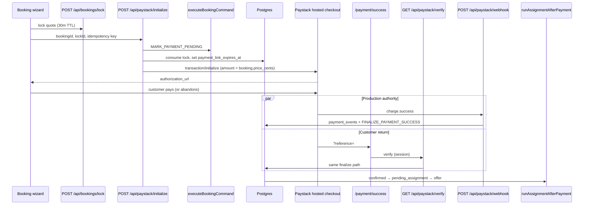

# Stage 2A — Payment edge safety audit

**Date:** 2026-05-16  
**Scope:** Paystack initialize, verify, webhook, payment return pages, `pending_payment` / failure handling, lock expiry, assignment-after-payment, admin/customer visibility, tests  
**Type:** Audit only — no code, migrations, RLS, command matrix, assignment engine, or earnings changes in this pass.

---

## Executive summary

Payment success paths are **well-structured and mostly idempotent**: a single `finalizePaidBooking` pipeline backs both webhook and verify, with amount guards, `payment_events` deduplication, and audit-key idempotency on `FINALIZE_PAYMENT_SUCCESS`. Initialize correctly separates checkout from confirmation and reuses payment rows on retry.

The largest operational risks are **failure and abandonment paths that are defined but unwired**, plus **read-side errors after successful payment**:

| Risk area | Severity | Summary |
|-----------|----------|---------|
| Abandoned / stuck `pending_payment` | **High** | No cron, no `MARK_PAYMENT_FAILED` from Paystack, `payment_link_expires_at` stored but never enforced |
| `payment_expired` status | **N/A** | **Does not exist** in schema or app; only lock expiry + unused link-expiry column |
| Verify/webhook race loser | **Medium** | Concurrent finalize can surface `PERSISTENCE_ERROR` on `/payment/success` after Paystack already charged |
| `/payment/failed` unwired | **Medium** | Static page exists; Paystack cancel/failure never redirects there |
| Assignment after payment | **Medium** | Failures swallowed; paid bookings can sit `confirmed` or `pending_assignment` without offer |
| Admin ops visibility | **Medium** | Detail is rich; list has no filters/queues for payment problems |
| Customer recovery UX | **Medium** | No “pay again” from booking detail; wizard storage cleared on redirect |

**Verdict:** Safe to take payment live for happy-path checkout **if** webhook delivery is reliable and ops can query admin booking detail. **Not** safe to treat payment edge cases as handled until Stage 2B addresses idempotent read paths and abandoned-checkout policy.

**Safest first Stage 2B fix (see §12):** Treat **already-paid / already-confirmed** outcomes as idempotent success on verify and finalize read paths — no schema change, no command-matrix change, fixes the worst customer-facing false failure.

---

## Current payment architecture map

### End-to-end lifecycle



### Key modules

| Layer | Path | Responsibility |
|-------|------|----------------|
| Initialize API | `src/app/api/paystack/initialize/route.ts` | Auth + delegate |
| Initialize core | `src/features/payments/server/initializePayment.ts` | Lock, `MARK_PAYMENT_PENDING`, Paystack init |
| Verify API | `src/app/api/paystack/verify/route.ts` | Auth + delegate |
| Verify core | `src/features/payments/server/verifyPayment.ts` | Paystack verify API + finalize |
| Webhook API | `src/app/api/paystack/webhook/route.ts` | Raw body |
| Webhook core | `src/features/payments/server/handlePaystackWebhook.ts` | Signature + `charge.success` only |
| Shared finalize | `src/features/payments/server/finalizePaidBooking.ts` | Amount guard, `payment_events`, command, assignment |
| Charge routing | `src/features/payments/server/upsertBookingFromPaystack.ts` | Resolve payment by `provider_ref` |
| RPC | `supabase/migrations/20260515203000_booking_command_layer.sql` | `booking_finalize_payment_success`, `booking_record_payment_failure` |
| Success UI | `src/app/payment/success/PaymentSuccessVerifier.tsx` | Single verify + redirect |
| Failed UI | `src/app/payment/failed/page.tsx` | Static messaging (unlinked) |
| Assignment | `src/features/assignments/server/runAssignmentAfterPayment.ts` | Post-pay dispatch (never rolls back payment) |

### Status vocabulary (actual)

**Booking:** `draft` → `pending_payment` → `confirmed` → `pending_assignment` → …  
Also: `payment_failed` (terminal for payment retry), `cancelled`, etc.

**Payment row:** `initialized` / `pending` → `paid` (on finalize) or `failed` (only via `MARK_PAYMENT_FAILED`, unwired).

**Not in repo:** `payment_expired` (booking status), Paystack failure webhook handling, payment-stuck cron.

---

## 1. Success path findings

### 1.1 Amount mismatch guard — **Present**

`finalizePaidBooking` rejects when Paystack amount ≠ `payments.amount_cents` before any command runs:

```71:77:src/features/payments/server/finalizePaidBooking.ts
  if (payment.amount_cents !== input.charge.amountCents) {
    return {
      ok: false,
      code: "AMOUNT_MISMATCH",
      message: `Paystack amount ${input.charge.amountCents} does not match payment.amount_cents ${payment.amount_cents}.`,
    };
  }
```

Initialize also enforces server quote: Paystack `amount` = `booking.price_cents`, and idempotent re-init checks existing payment amount (`initializePayment.ts` lines 167–174, 326–333).

**Gap:** Finalize does **not** re-check lock or `payment_link_expires_at`; a late Paystack success after abandoned window would still confirm if webhook/verify runs.

### 1.2 Payment reference idempotency — **Present**

| Layer | Mechanism |
|-------|-----------|
| Payment row | `payments.idempotency_key` UNIQUE (`20260515201500_core_foundation.sql`) |
| Lock checkout | `paystack:checkout:{checkoutIdempotencyKey}` (`lock/constants.ts`) |
| Initialize retry | Same booking + `pending_payment` + same key → skip lock, re-call Paystack (`initializePayment.ts` 162–184) |
| Paystack reference | Stable `provider_ref` or `bk_{bookingId}_{paymentIdSuffix}` |

### 1.3 Webhook + verify race handling — **Mostly present, one gap**

Shared idempotency key: `paystack:txn:{transactionId}` (`mapPaystackCharge.ts`).

| Layer | Behavior |
|-------|----------|
| `payment_events` | UNIQUE `provider_event_id`; duplicate → `duplicate`, finalize continues (`recordPaymentEvent.ts`) |
| `booking_state_audit` | UNIQUE `(booking_id, idempotency_key)`; RPC + executor pre-check |
| Sequential duplicate | Second call returns `idempotent: true` (tested in `paystackFoundation.test.ts`) |

**Gap — concurrent twin finalize:** If two requests pass the audit pre-check before either commits, the loser can hit RPC `PAYMENT_NOT_FINALIZABLE` (payment already `paid`) or `BOOKING_NOT_AWAITING_PAYMENT` (booking already `confirmed`). These map to `PERSISTENCE_ERROR` in `finalizePaidBooking` / `verifyPayment`, so `/payment/success` can show an error **after successful charge**. Webhook-first production usually masks this; verify-on-return is vulnerable.

`executeBookingCommand` pre-check (audit hit) mitigates the common “webhook then verify” case when the first transaction has committed:

```217:220:src/features/bookings/server/commands/executeBookingCommand.ts
      if (
        (await backend.findAuditsByBookingAndKey(cmd.bookingId, cmd.idempotencyKey)).length > 0
      ) {
        return ok(booking.id, booking.status, true);
```

### 1.4 `payment_events` uniqueness — **Present**

```196:203:supabase/migrations/20260515201500_core_foundation.sql
create table if not exists public.payment_events (
  ...
  constraint payment_events_provider_event_id_unique unique (provider_event_id)
);
```

Event types: `charge.success` (webhook) vs `verify.success` (verify) — same `provider_event_id`, so second path records duplicate and proceeds.

### 1.5 Booking status transition safety — **Present on happy path**

`FINALIZE_PAYMENT_SUCCESS` only transitions `pending_payment` → `confirmed` (`bookingCommandGuards.ts` 117–118). RPC uses `FOR UPDATE` and rejects wrong status (`booking_finalize_payment_success`).

### 1.6 No duplicate assignment offers — **Present**

`runAssignmentAfterPayment` short-circuits on existing open offer, `assigned`, or `attention_required` without offer (`runAssignmentAfterPayment.ts` 143–180). Post-payment idempotency key on `MOVE_TO_PENDING_ASSIGNMENT`.

**Gap:** Assignment errors in `finalizePaidBooking` are caught and ignored (lines 125–129), so duplicate-offer risk is low but **orphan paid bookings** are possible.

### 1.7 Webhook signature — **Present**

HMAC SHA512, timing-safe compare (`paystackClient.ts`). Invalid → 401.

### 1.8 Callback URL — **Present (wizard wired)**

Wizard sends `buildPaymentSuccessCallbackUrl` via `checkout.ts`. Server fallback: `APP_BASE_URL` / `NEXT_PUBLIC_APP_URL` → `/payment/success`. Missing base → `503 CALLBACK_URL_MISSING`.

---

## 2. Failure path findings

### 2.1 Failed Paystack events — **Ignored**

Webhook handles **only** `charge.success`; all other events return `handled: false` (`handlePaystackWebhook.ts` 38–39):

- `charge.failed`, abandoned, refund, dispute — **no booking mutation**
- No call to `MARK_PAYMENT_FAILED`

Verify on non-success Paystack status returns `{ ok: true, paid: false }` **without** updating booking (`verifyPayment.ts` 103–111).

### 2.2 `MARK_PAYMENT_FAILED` — **Implemented, unwired**

Command + RPC `booking_record_payment_failure` exist (`executeBookingCommand.ts` 243–262, migration `booking_record_payment_failure`). Transition: `pending_payment` → `payment_failed`.

**No production caller** from Paystack initialize/verify/webhook. Only unit tests reference it.

### 2.3 Abandoned checkout — **No automatic cleanup**

| Scenario | Current behavior |
|----------|------------------|
| Close Paystack without paying | Booking stays `pending_payment`; payment row `pending` |
| Never hit `/payment/success` | Same; relies on webhook in prod |
| Wizard redirect to Paystack | `clearWizardStorage()` — customer must find booking in list |
| Paystack cancel | No redirect to `/payment/failed` (`PAYMENT_FAILED_PATH` unused outside `paymentReturn.ts`) |

### 2.4 Expired lock behavior — **Partial**

- Lock TTL: **30 minutes** (`BOOKING_LOCK_TTL_MINUTES`)
- First initialize: requires active lock; expired → `410 LOCK_EXPIRED`
- After init: lock **consumed**; idempotent re-init allowed without lock when still `pending_payment`
- `payment_link_expires_at` copied from lock at init — **never read** on verify/finalize/re-init

### 2.5 `payment_expired` — **Not implemented**

Repo-wide: **zero** `payment_expired` matches. Closest concepts:

| Concept | Exists? | Enforced on pay? |
|---------|---------|------------------|
| `booking_locks.status = expired` | Yes | At lock API + first init only |
| `payments.payment_link_expires_at` | Yes (column) | **No** |
| Booking status `payment_expired` | **No** | — |

Product must choose: new status vs `payment_failed` + metadata vs cancel.

### 2.6 `/payment/failed` — **Orphan page**

`src/app/payment/failed/page.tsx`: static copy, optional `?reason=`, links to re-book and bookings list. **Nothing** in Paystack init or wizard points here.

### 2.7 Customer dashboard visibility — **Passive only**

- Badges: `Awaiting payment` / `Payment failed` + payment row status
- Detail: payments list + lifecycle timeline
- **No** payment events, audit, link expiry, or pay-again action
- Badge mismatch possible if booking `pending_payment` but latest payment row `paid` (different sources in read model)

---

## 3. Stuck booking scenarios

| Stuck state | How it happens | Detection today | Auto recovery |
|-------------|----------------|-----------------|---------------|
| **`pending_payment`** | Abandon checkout; webhook not delivered; verify never run | Badge on list/detail; checklist mentions >1h monitor — **not implemented** | None |
| **`payment_expired`** | N/A (status missing) | — | — |
| **`pending_payment` + paid row** | Finalize partial failure / manual DB edit | Conflicting badges | None |
| **`pending_assignment` no offer** | Assignment engine finds no cleaner; attention recorded | Admin assignment attention badge; repair script (E2E-scoped) | Manual `repairOrphanedAssignments.ts` |
| **`confirmed` no assignment** | `runAssignmentAfterPayment` throws; error swallowed | Easy to miss — status looks “ok” | Same repair script |
| **Initialized Paystack, never finalized** | Customer charged, webhook down, verify fails/errors | `payment_events` empty; Paystack dashboard | Manual verify/admin |
| **`payment_failed` with intent to retry** | Only if something calls `MARK_PAYMENT_FAILED` | Badge | New lock + initialize (allowed from `payment_failed`) |
| **Verify error after success** | Webhook won; verify race loser | Customer sees error on success page; booking may be `confirmed` | User retry may error again |

---

## 4. API and UI behavior

### 4.1 `/payment/success`

- `PaymentSuccessVerifier`: one GET verify on mount; `inFlight` ref prevents double-fetch **in same tab** only
- Success → redirect `/customer/bookings/{id}` after 1.5s
- Error → manual “Try again” (calls verify again)
- Requires authenticated customer (verify route)
- **No polling** while waiting for webhook

### 4.2 `/payment/failed`

- Public static page
- Not linked from Paystack `callback_url` or cancel URL

### 4.3 Customer dashboard

| Surface | Payment info |
|---------|----------------|
| `/customer`, `/customer/bookings` | Booking + latest payment badges |
| `/customer/bookings/[id]` | Badges, payments list, lifecycle |
| `/customer/book` | Wizard → Paystack (no return to failed page) |

### 4.4 Admin dashboard

| Surface | Payment info |
|---------|----------------|
| `/admin` recent bookings | Booking status only — **no payment badge** |
| `/admin/bookings` | Booking + payment + assignment badges (limit 200, no filter) |
| `/admin/bookings/[id]` | Payments, **payment events**, state audit, lifecycle |
| `/admin/assignments` | Assignment queue — not payment-centric |

### 4.5 Polling / status APIs

| API | Role |
|-----|------|
| `GET/POST /api/paystack/verify` | Charge verify + finalize (not a booking poll) |
| `POST /api/paystack/initialize` | Start checkout |
| `POST /api/paystack/webhook` | Authoritative in prod |
| Dashboard booking APIs | Point-in-time snapshot |

**Missing:** `GET /api/bookings/{id}/payment-status`, SSE, or interval poll on success page.

### 4.6 Cron

Only `expire-assignment-offers` exists. **No** payment-stuck sweeper.

---

## 5. Operational visibility

### What admin **can** see (booking detail)

- All payment rows + provider refs
- `payment_events` (webhook/verify trail)
- `booking_state_audit` (including `MARK_PAYMENT_FAILED` if ever run)
- Lifecycle timeline
- Assignment offers + attention metadata

### What admin **cannot** see or do easily

| Gap | Impact |
|-----|--------|
| No list filter for `pending_payment` / `payment_failed` | Ops must scan 200 recent bookings |
| No “stuck payment” queue on admin home | Payment issues less visible than assignment issues |
| `payment_link_expires_at` not displayed | Cannot tell abandoned-checkout age |
| No webhook error inbox | Failed webhook HTTP responses only in platform logs |
| No stuck-duration highlight | Checklist item only (`production-readiness-checklist.md`) |
| No in-app re-verify / finalize action | Must use Paystack dashboard or SQL |
| Admin home omits payment status badge | Under-reports payment problems on landing |

### What customer **cannot** see

- Payment events / audit
- Link expiry / “checkout expired”
- Clear pay-again CTA on `payment_failed` detail
- Distinction between “still processing” vs “abandoned” for `pending_payment`

---

## 6. Test coverage

### Existing tests (good foundation)

| File | Covers |
|------|--------|
| `src/features/payments/server/paystackFoundation.test.ts` | Init → `pending_payment`; finalize; duplicate finalize; verify path; amount mismatch; webhook signature + success |
| `src/features/payments/server/paystackSignature.test.ts` | HMAC |
| `src/features/bookings/server/lock/initializePayment.lock.test.ts` | Lock, amount, idempotent pending, callback URL |
| `src/features/bookings/server/lock/createBookingPaymentLock.test.ts` | Expired lock |
| `src/features/bookings/server/commands/executeBookingCommand.test.ts` | `MARK_PAYMENT_FAILED`, finalize, assignment gate |
| `src/features/booking-wizard/checkout.test.ts` | Callback URL in payload |
| `src/lib/app/paymentReturn.test.ts` | Reference parsing, verify response parsing |
| `src/app/payment/success/PaymentSuccessVerifier.test.ts` | Static source check only |
| `src/tests/security/rls-policies.integration.test.ts` | Payments RLS; finalize RPC |

### Missing tests (Stage 2B targets)

| Scenario | Priority |
|----------|----------|
| Concurrent webhook + verify (race loser → success) | **P0** |
| Verify when booking already `confirmed` / payment `paid` | **P0** |
| `MARK_PAYMENT_FAILED` wired from webhook/verify policy | P1 |
| Abandoned `pending_payment` timeout job | P1 |
| `payment_link_expires_at` enforcement | P1 |
| HTTP route tests for `/api/paystack/*` | P2 |
| `PaymentSuccessVerifier` integration behavior | P2 |
| Admin/customer dashboard badges with payment fixtures | P2 |
| E2E Paystack flow | P2 |
| Assignment failure after payment (orphan `confirmed`) | P2 |

---

## 7. Critical blockers (before treating edges as done)

1. **False failure on success page** after real payment (race / `PAYMENT_NOT_FINALIZABLE` / `BOOKING_NOT_AWAITING_PAYMENT`).
2. **Unbounded `pending_payment`** with no expiry policy or ops surfacing.
3. **`MARK_PAYMENT_FAILED` unwired** — failed/abandoned payments invisible to lifecycle.
4. **Assignment failure swallowed** — paid bookings without offers look healthy at booking-status level.
5. **Local/staging without webhooks** — finalize depends on customer hitting verify; tunnel or manual ops required.

Non-blockers for happy path: unwired `/payment/failed`, missing admin filters, missing `payment_expired` status (if product accepts `payment_failed` instead).

---

## 8. Safe Stage 2B implementation plan

Ordered by **safety × impact**; each step is independently shippable. Do **not** rewrite `finalizePaidBooking` RPC, command transition matrix, assignment engine, earnings, or RLS in early steps.

### Phase 2B-1 — Read-path idempotency (recommended first)

**Scope:** `verifyPayment`, `finalizePaidBooking` / `executeBookingCommand` error mapping, `/payment/success` messaging.

- When payment row is `paid` and booking is `confirmed` (or `pending_assignment`+), return `{ ok: true, paid: true, idempotent: true }` even if RPC threw `PAYMENT_NOT_FINALIZABLE` or `BOOKING_NOT_AWAITING_PAYMENT`.
- Map `INVALID_STATE_FOR_FINALIZE` from `bookingCommandRpc.ts` to idempotent success when invariants already satisfied.
- Add tests for webhook-then-verify and concurrent finalize.

**Touches:** Payment server TS only. No migrations. No matrix change.

### Phase 2B-2 — Abandoned checkout policy

**Scope:** Application policy only (prefer `payment_failed` over new `payment_expired` unless product insists).

- Option A: Cron/workflow — `pending_payment` older than `payment_link_expires_at` (or lock TTL) → `MARK_PAYMENT_FAILED` with reason `checkout_expired`.
- Option B: Block finalize after link expiry (stricter; risk if webhook delayed).
- Surface expiry on customer detail (“Checkout expired — book again”).

**Touches:** New cron route or workflow; wire existing `MARK_PAYMENT_FAILED`. **Do not** add status to matrix without explicit design.

### Phase 2B-3 — Paystack failure signals

- Handle `charge.failed` (and optionally abandoned) in webhook → `MARK_PAYMENT_FAILED`.
- Paystack cancel URL → `/payment/failed?reason=cancelled`.
- Customer detail: “Complete payment” when `payment_failed` or re-eligible `pending_payment`.

### Phase 2B-4 — Ops visibility (read-only plus filters)

- Admin list query params: `status=pending_payment|payment_failed`.
- Admin home card: count `pending_payment` updated > 1h ago.
- Show `payment_link_expires_at` on admin payment section.

### Phase 2B-5 — Success page resilience

- Optional short polling on `/payment/success` (e.g. 3× verify every 2s) when `paid: false` and status `pending`.
- Log webhook handler failures with booking id (no PII in payload).

### Phase 2B-6 — Assignment visibility (separate from payment core)

- Do not change `runAssignmentAfterPayment` logic in payment phases.
- Extend admin attention queue to include `confirmed` without `pending_assignment` transition (ops script already exists for E2E).

---

## 9. Things not to touch (per Stage 2A charter)

| Area | Reason |
|------|--------|
| `booking_finalize_payment_success` RPC body | Risk to paid-booking integrity; prefer TS read-path fixes first |
| Booking command transition matrix (`bookingCommandGuards.ts`) | Stage 2B should use existing commands, not new transitions |
| Assignment engine (`runAssignmentAfterPayment`, offer dispatch) | Separate stage; payment audit scope |
| Earnings / payout | Out of scope |
| RLS policies | Out of scope |
| Paystack amount authority model | Working; client amounts already ignored when lock used |
| `payment_events` uniqueness | Correct dedup layer |

---

## 10. Customer UX gaps (summary)

1. Success page error after real payment (trust killer).
2. No guidance for long-lived `pending_payment` (“still processing” vs abandoned).
3. No pay-again from booking detail.
4. Wizard clears local state — hard to resume interrupted checkout.
5. `/payment/failed` unreachable from normal flow.

---

## 11. Related docs

| Doc | Note |
|-----|------|
| `docs/payments/paystack-foundation.md` | Aligned with implementation |
| `docs/audits/paystack-post-payment-redirect-audit.md` | **Partially stale** — wizard now sends callback URL |
| `docs/booking/booking-lock-before-payment.md` | Lock semantics |
| `docs/launch/production-readiness-checklist.md` | Stuck booking monitor — not built |

---

## 12. Safest first payment edge fix for Stage 2B

**Recommendation: Phase 2B-1 — Idempotent success on verify/finalize when payment already succeeded.**

### Why this first

| Criterion | Assessment |
|-----------|------------|
| Blast radius | Smallest — TS read/error mapping only |
| Customer impact | Fixes false errors on `/payment/success` immediately after charge |
| Data safety | No new transitions; does not weaken amount mismatch guard |
| Dependencies | None on cron, product status design, or Paystack dashboard config |
| Testability | Unit tests can simulate race without Paystack sandbox |

### What it does **not** solve (defer to 2B-2+)

- Abandoned `pending_payment` accumulation
- Wiring `MARK_PAYMENT_FAILED` from Paystack failure events
- `payment_expired` product decision
- Admin filters and stuck-payment dashboard
- Orphan assignment after payment

### Implementation sketch (for planners only — not implemented in 2A)

1. After failed `executeBookingCommand` / RPC in finalize path, re-load booking + payment.
2. If `payment.status === 'paid'` and booking ∈ `{ confirmed, pending_assignment, assigned, … }`, return success with `idempotent: true`.
3. In `verifyPayment`, never return HTTP 400 for that case.
4. Add regression tests mirroring `paystackFoundation.test.ts` duplicate cases for “confirmed before verify returns”.

---

## Appendix A — Idempotency stack (reference)

```
Paystack charge.success / verify success
  → processPaystackChargeSuccess (by provider_ref)
    → finalizePaidBooking
      → amount_cents match
      → payment_events INSERT (UNIQUE provider_event_id)
      → FINALIZE_PAYMENT_SUCCESS (idempotency paystack:txn:{id})
        → booking_state_audit UNIQUE
        → booking_finalize_payment_success RPC
      → runAssignmentAfterPayment (best-effort)
```

## Appendix B — `payment_expired` clarification

Stage 2A scope asked for `payment_expired` handling. **It does not exist.** Stage 2B should either:

- **Adopt `payment_failed`** with metadata `failure_reason: checkout_expired`, or
- **Add a new booking status** only with an explicit command-matrix and migration design pass (out of scope for “safest first fix”).

Do not assume `payment_expired` is implemented or tested anywhere in the current codebase.
